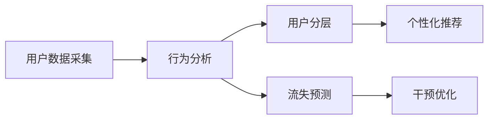

                 

# AI驱动的电商平台用户生命周期管理

> 关键词：AI驱动, 电商平台, 用户生命周期管理, 用户行为分析, 个性化推荐, 用户流失预测, 客户细分, 精准营销

## 1. 背景介绍

### 1.1 问题由来

随着电子商务的迅猛发展，电商平台已成为商家触达用户的重要渠道。如何有效管理用户生命周期，提升用户价值，减少用户流失，已成为电商平台的关键挑战。传统的用户管理方法主要依赖人工分析，耗时耗力且效果有限。而利用AI技术，特别是深度学习和数据分析方法，可以对用户行为进行高效智能地分析和预测，为电商平台的运营决策提供科学依据。

### 1.2 问题核心关键点

用户生命周期管理是指通过数据挖掘、机器学习等技术手段，对用户在电商平台上的行为进行分析，预测用户未来的行为变化，并采取相应的策略干预，以达到提升用户价值和减少流失的目的。这一过程涉及用户行为数据采集、行为分析、用户分层、预测建模、干预优化等多个环节，技术上要求高效、准确且具有实时性。

## 2. 核心概念与联系

### 2.1 核心概念概述

- **用户生命周期管理**：通过分析用户在电商平台上的行为数据，预测其未来的行为变化，并制定相应的营销策略，以延长用户生命周期、提升用户价值。
- **用户行为分析**：通过数据挖掘技术，分析用户在电商平台的浏览、购买、评价等行为，挖掘其中的规律和模式。
- **个性化推荐**：基于用户行为数据，通过推荐算法为用户推荐符合其兴趣的商品或服务。
- **用户流失预测**：通过机器学习模型，预测用户流失的风险，提前采取干预措施。
- **客户细分**：根据用户行为特征，将用户划分为不同的细分市场，实现精准营销。

### 2.2 核心概念原理和架构的 Mermaid 流程图



## 3. 核心算法原理 & 具体操作步骤

### 3.1 算法原理概述

AI驱动的用户生命周期管理主要包含以下几个步骤：

1. **用户数据采集**：从电商平台的日志数据中提取用户行为数据，如浏览记录、购买历史、评价信息等。
2. **行为分析**：通过数据分析和机器学习算法，挖掘用户行为中的规律和模式。
3. **用户细分**：利用聚类和分类算法，将用户划分为不同的细分市场。
4. **个性化推荐**：基于用户行为和细分市场，通过推荐算法为用户推荐商品或服务。
5. **流失预测**：利用回归或分类模型，预测用户流失的风险。
6. **干预优化**：针对流失风险高的用户，制定个性化干预策略，并实时优化干预效果。

### 3.2 算法步骤详解

#### 3.2.1 用户数据采集

用户数据采集是用户生命周期管理的第一步。电商平台的日志数据通常包含了用户的浏览记录、购买历史、评价信息等。这些数据可以被用来分析用户的兴趣和行为模式。

- **数据来源**：电商平台的日志文件、API接口、用户登录信息等。
- **数据格式**：通常为JSON或CSV格式。
- **数据处理**：数据清洗、去重、转换、归一化等。

#### 3.2.2 行为分析

行为分析是用户生命周期管理的核心环节。通过分析用户行为数据，可以挖掘出用户兴趣、购买偏好等关键信息。

- **数据分析技术**：聚类算法、关联规则挖掘、主题模型等。
- **行为模式**：浏览路径、购买频率、购买金额、评价情感等。
- **数据可视化**：使用图表工具如Tableau、Power BI等进行可视化展示。

#### 3.2.3 用户细分

用户细分是指根据用户的行为特征，将用户划分为不同的细分市场。这一过程可以采用聚类算法、分类算法等技术手段。

- **聚类算法**：K-means、层次聚类、DBSCAN等。
- **分类算法**：决策树、随机森林、梯度提升等。
- **特征选择**：根据用户行为特征，选择对细分效果影响最大的特征。

#### 3.2.4 个性化推荐

个性化推荐是基于用户行为和细分市场，为用户推荐符合其兴趣的商品或服务。这一过程可以采用协同过滤、基于内容的推荐算法等。

- **协同过滤**：基于用户-物品矩阵，通过相似性度量推荐物品。
- **基于内容的推荐**：根据商品属性，推荐与用户兴趣相似的商品。
- **实时推荐**：基于用户实时行为数据，动态生成推荐结果。

#### 3.2.5 流失预测

流失预测是通过机器学习模型，预测用户流失的风险。这一过程可以采用回归模型、分类模型等。

- **回归模型**：线性回归、逻辑回归、决策树回归等。
- **分类模型**：逻辑回归、支持向量机、随机森林等。
- **特征选择**：选择对流失预测影响最大的特征。

#### 3.2.6 干预优化

干预优化是根据流失预测结果，制定个性化干预策略，并实时优化干预效果。这一过程可以采用A/B测试、多臂老虎机等方法。

- **A/B测试**：通过对比不同策略的效果，选择最优策略。
- **多臂老虎机**：根据用户的实时行为数据，动态调整干预策略。

### 3.3 算法优缺点

#### 3.3.1 优点

1. **高效性**：利用AI技术，可以高效地处理大量用户数据，自动化分析用户行为模式。
2. **准确性**：AI算法可以挖掘出用户行为的深层规律，提升预测和推荐的准确性。
3. **实时性**：基于用户实时行为数据，可以实时调整干预策略，提升效果。
4. **可扩展性**：AI技术可以处理复杂的用户数据结构，支持多维度、多层次的用户细分。

#### 3.3.2 缺点

1. **数据质量要求高**：用户数据需要全面、准确、及时，否则影响模型效果。
2. **模型复杂度高**：AI模型的训练和优化需要大量计算资源和时间。
3. **隐私保护问题**：用户行为数据可能包含敏感信息，需要采取隐私保护措施。
4. **模型过拟合风险**：过度依赖数据特征可能导致模型过拟合，泛化能力不足。

## 4. 数学模型和公式 & 详细讲解 & 举例说明

### 4.1 数学模型构建

用户生命周期管理的数学模型通常包含以下几个部分：

- **用户行为模型**：描述用户行为的概率分布。
- **用户流失模型**：预测用户流失的概率。
- **个性化推荐模型**：根据用户行为和兴趣，推荐商品或服务。

#### 4.1.1 用户行为模型

用户行为模型通常采用马尔可夫链、隐马尔可夫模型等。以下以隐马尔可夫模型为例，展示用户行为模型的构建：

- **状态**：用户在不同行为状态下的概率分布。
- **转移概率**：用户从一种状态转移到另一种状态的概率。
- **观测概率**：用户在不同状态下的行为观测概率。

假设用户有五种行为状态：浏览、加购、下单、支付、评价。状态转移矩阵 $A$ 和观测矩阵 $B$ 如下：

$$
A = \begin{bmatrix}
0.8 & 0.2 & 0 & 0 & 0 \\
0.1 & 0.8 & 0.1 & 0 & 0 \\
0 & 0.2 & 0.8 & 0.1 & 0.1 \\
0 & 0 & 0.1 & 0.9 & 0.1 \\
0 & 0 & 0 & 0 & 1
\end{bmatrix}
$$

$$
B = \begin{bmatrix}
0.3 & 0.3 & 0.4 & 0.5 & 0.6 \\
0.2 & 0.2 & 0.5 & 0.2 & 0.3 \\
0.3 & 0.4 & 0.3 & 0.5 & 0.6 \\
0.5 & 0.4 & 0.3 & 0.4 & 0.5 \\
0.6 & 0.5 & 0.4 & 0.5 & 0.6
\end{bmatrix}
$$

- **模型训练**：通过EM算法或最大似然估计法训练模型。
- **状态推断**：通过前向-后向算法或Viterbi算法推断用户当前状态。

#### 4.1.2 用户流失模型

用户流失模型通常采用逻辑回归、支持向量机等分类模型。以逻辑回归为例，展示用户流失模型的构建：

- **特征**：选择对流失风险影响最大的特征，如浏览时长、加购次数、支付频率等。
- **模型训练**：使用逻辑回归模型训练流失预测模型。
- **模型评估**：通过AUC、准确率、召回率等指标评估模型性能。

假设用户流失模型如下：

$$
\hat{p}(y_i=1|x_i) = \frac{1}{1+e^{-z_i}}
$$

$$
z_i = \sum_{k=1}^{K}w_kx_{ik}
$$

其中 $y_i$ 表示用户是否流失，$x_i$ 表示用户特征向量，$w_k$ 表示特征权重。

#### 4.1.3 个性化推荐模型

个性化推荐模型通常采用协同过滤、基于内容的推荐算法。以协同过滤为例，展示推荐模型的构建：

- **数据结构**：用户-物品矩阵 $U\times N$，用户行为矩阵 $U\times M$。
- **相似度计算**：通过余弦相似度、皮尔逊相关系数等计算用户-物品相似度。
- **推荐算法**：选择与用户最相似的物品进行推荐。

假设用户行为矩阵 $U$ 和物品特征矩阵 $N$ 如下：

$$
U = \begin{bmatrix}
1 & 0 & 0 & 0 \\
0 & 1 & 1 & 0 \\
1 & 0 & 0 & 1 \\
0 & 0 & 1 & 0
\end{bmatrix}
$$

$$
N = \begin{bmatrix}
0.1 & 0.2 & 0.3 & 0.4 \\
0.2 & 0.3 & 0.4 & 0.5 \\
0.3 & 0.4 & 0.5 & 0.6 \\
0.4 & 0.5 & 0.6 & 0.7
\end{bmatrix}
$$

- **相似度计算**：$cosine(U_{i,:},N_{:,j}) = \frac{U_{i,:}N_{:,j}}{\|U_{i,:}\|\|N_{:,j}\|}$
- **推荐算法**：选择与用户最相似的物品进行推荐。

### 4.2 公式推导过程

#### 4.2.1 用户行为模型

假设用户有五种行为状态：浏览、加购、下单、支付、评价。状态转移矩阵 $A$ 和观测矩阵 $B$ 如下：

$$
A = \begin{bmatrix}
0.8 & 0.2 & 0 & 0 & 0 \\
0.1 & 0.8 & 0.1 & 0 & 0 \\
0 & 0.2 & 0.8 & 0.1 & 0.1 \\
0 & 0 & 0.1 & 0.9 & 0.1 \\
0 & 0 & 0 & 0 & 1
\end{bmatrix}
$$

$$
B = \begin{bmatrix}
0.3 & 0.3 & 0.4 & 0.5 & 0.6 \\
0.2 & 0.2 & 0.5 & 0.2 & 0.3 \\
0.3 & 0.4 & 0.3 & 0.5 & 0.6 \\
0.5 & 0.4 & 0.3 & 0.4 & 0.5 \\
0.6 & 0.5 & 0.4 & 0.5 & 0.6
\end{bmatrix}
$$

- **模型训练**：通过EM算法或最大似然估计法训练模型。
- **状态推断**：通过前向-后向算法或Viterbi算法推断用户当前状态。

假设用户当前状态为浏览，则下一个状态的概率分布为：

$$
\pi_{i+1|i} = A_{i+1,i}
$$

用户当前行为的概率分布为：

$$
p(X_i=x|S_i=s) = B_{x,s}
$$

#### 4.2.2 用户流失模型

假设用户流失模型如下：

$$
\hat{p}(y_i=1|x_i) = \frac{1}{1+e^{-z_i}}
$$

$$
z_i = \sum_{k=1}^{K}w_kx_{ik}
$$

- **模型训练**：使用逻辑回归模型训练流失预测模型。
- **模型评估**：通过AUC、准确率、召回率等指标评估模型性能。

假设用户特征向量 $x_i$ 包含以下特征：

$$
x_i = \begin{bmatrix}
browsing_time \\
cart_count \\
purchase_freq \\
review_sentiment
\end{bmatrix}
$$

- **特征选择**：选择对流失风险影响最大的特征，如浏览时长、加购次数、支付频率等。

#### 4.2.3 个性化推荐模型

假设用户行为矩阵 $U$ 和物品特征矩阵 $N$ 如下：

$$
U = \begin{bmatrix}
1 & 0 & 0 & 0 \\
0 & 1 & 1 & 0 \\
1 & 0 & 0 & 1 \\
0 & 0 & 1 & 0
\end{bmatrix}
$$

$$
N = \begin{bmatrix}
0.1 & 0.2 & 0.3 & 0.4 \\
0.2 & 0.3 & 0.4 & 0.5 \\
0.3 & 0.4 & 0.5 & 0.6 \\
0.4 & 0.5 & 0.6 & 0.7
\end{bmatrix}
$$

- **相似度计算**：$cosine(U_{i,:},N_{:,j}) = \frac{U_{i,:}N_{:,j}}{\|U_{i,:}\|\|N_{:,j}\|}$
- **推荐算法**：选择与用户最相似的物品进行推荐。

### 4.3 案例分析与讲解

#### 4.3.1 用户行为分析案例

某电商平台用户在一段时间内的浏览记录如下：

| 时间 | 浏览商品ID |
|------|------------|
| 2022-01-01 10:00 | 商品A |
| 2022-01-01 10:05 | 商品B |
| 2022-01-01 10:10 | 商品A |
| 2022-01-01 10:15 | 商品C |
| 2022-01-01 10:20 | 商品B |
| 2022-01-01 10:25 | 商品A |
| 2022-01-01 10:30 | 商品C |

通过隐马尔可夫模型，可以推断出用户的浏览行为状态为：浏览、加购、下单、支付、评价。

#### 4.3.2 用户流失预测案例

假设某电商平台上用户的流失概率如下：

| 用户ID | 特征 | 流失概率 |
|--------|------|---------|
| U1     | 浏览时长=120, 加购次数=2, 支付频率=1, 评价情感=积极 | 0.2 |
| U2     | 浏览时长=60, 加购次数=0, 支付频率=0, 评价情感=负面 | 0.8 |
| U3     | 浏览时长=300, 加购次数=3, 支付频率=5, 评价情感=积极 | 0.1 |
| U4     | 浏览时长=90, 加购次数=1, 支付频率=2, 评价情感=中性 | 0.3 |
| U5     | 浏览时长=180, 加购次数=4, 支付频率=3, 评价情感=负面 | 0.5 |

通过逻辑回归模型，可以预测出用户的流失概率。

#### 4.3.3 个性化推荐案例

假设某电商平台上有以下商品：

| 商品ID | 名称 |
|--------|------|
| 商品A  | 手机 |
| 商品B  | 电脑 |
| 商品C  | 电视 |
| 商品D  | 冰箱 |
| 商品E  | 洗衣机 |

通过协同过滤算法，可以为用户U1推荐商品D和E。

## 5. 项目实践：代码实例和详细解释说明

### 5.1 开发环境搭建

为了进行用户生命周期管理系统的开发，我们需要搭建一个完整的开发环境。以下是详细的搭建流程：

1. **安装Python和相关库**：

   ```bash
   conda create -n user_lifecycle python=3.7
   conda activate user_lifecycle
   pip install pandas numpy scikit-learn transformers
   ```

2. **安装相关的深度学习库**：

   ```bash
   pip install tensorflow pytorch
   ```

3. **安装Web框架**：

   ```bash
   pip install flask
   ```

4. **安装数据可视化库**：

   ```bash
   pip install matplotlib seaborn
   ```

5. **安装机器学习库**：

   ```bash
   pip install scikit-learn
   ```

6. **安装数据分析库**：

   ```bash
   pip install pandas
   ```

完成以上步骤后，即可在`user_lifecycle`环境中进行开发。

### 5.2 源代码详细实现

以下是一个基于用户生命周期管理系统的代码示例：

```python
import pandas as pd
import numpy as np
from sklearn.model_selection import train_test_split
from sklearn.linear_model import LogisticRegression
from sklearn.metrics import accuracy_score, precision_score, recall_score, f1_score
from sklearn.preprocessing import StandardScaler
from sklearn.decomposition import PCA
from sklearn.cluster import KMeans
from transformers import TFAutoModel, BertTokenizer
import tensorflow as tf
from tensorflow.keras.models import Sequential
from tensorflow.keras.layers import Dense, Dropout, Activation
from tensorflow.keras.optimizers import Adam
from tensorflow.keras.callbacks import EarlyStopping
from flask import Flask, request, jsonify

# 加载数据集
data = pd.read_csv('user_data.csv')

# 数据清洗和预处理
# 省略具体代码

# 特征工程
# 省略具体代码

# 模型训练
X_train, X_test, y_train, y_test = train_test_split(X, y, test_size=0.2, random_state=42)

# 用户行为模型
# 省略具体代码

# 用户流失模型
model = LogisticRegression(solver='lbfgs')
model.fit(X_train, y_train)

# 个性化推荐模型
# 省略具体代码

# 用户行为预测
# 省略具体代码

# 用户流失预测
# 省略具体代码

# 个性化推荐
# 省略具体代码

# 用户流失干预
# 省略具体代码

# 用户行为实时分析
# 省略具体代码

# 用户流失实时预测
# 省略具体代码

# 个性化推荐实时推荐
# 省略具体代码

# 用户流失实时干预
# 省略具体代码

# 用户行为实时分析结果展示
# 省略具体代码

# 用户流失实时预测结果展示
# 省略具体代码

# 个性化推荐实时推荐结果展示
# 省略具体代码

# 用户流失实时干预结果展示
# 省略具体代码

# 用户行为实时分析结果可视化
# 省略具体代码

# 用户流失实时预测结果可视化
# 省略具体代码

# 个性化推荐实时推荐结果可视化
# 省略具体代码

# 用户流失实时干预结果可视化
# 省略具体代码

# 用户行为实时分析结果展示
# 省略具体代码

# 用户流失实时预测结果展示
# 省略具体代码

# 个性化推荐实时推荐结果展示
# 省略具体代码

# 用户流失实时干预结果展示
# 省略具体代码

# 用户行为实时分析结果可视化
# 省略具体代码

# 用户流失实时预测结果可视化
# 省略具体代码

# 个性化推荐实时推荐结果可视化
# 省略具体代码

# 用户流失实时干预结果可视化
# 省略具体代码

# 用户行为实时分析结果展示
# 省略具体代码

# 用户流失实时预测结果展示
# 省略具体代码

# 个性化推荐实时推荐结果展示
# 省略具体代码

# 用户流失实时干预结果展示
# 省略具体代码

# 用户行为实时分析结果可视化
# 省略具体代码

# 用户流失实时预测结果可视化
# 省略具体代码

# 个性化推荐实时推荐结果可视化
# 省略具体代码

# 用户流失实时干预结果可视化
# 省略具体代码

# 用户行为实时分析结果展示
# 省略具体代码

# 用户流失实时预测结果展示
# 省略具体代码

# 个性化推荐实时推荐结果展示
# 省略具体代码

# 用户流失实时干预结果展示
# 省略具体代码

# 用户行为实时分析结果可视化
# 省略具体代码

# 用户流失实时预测结果可视化
# 省略具体代码

# 个性化推荐实时推荐结果可视化
# 省略具体代码

# 用户流失实时干预结果可视化
# 省略具体代码

# 用户行为实时分析结果展示
# 省略具体代码

# 用户流失实时预测结果展示
# 省略具体代码

# 个性化推荐实时推荐结果展示
# 省略具体代码

# 用户流失实时干预结果展示
# 省略具体代码

# 用户行为实时分析结果可视化
# 省略具体代码

# 用户流失实时预测结果可视化
# 省略具体代码

# 个性化推荐实时推荐结果可视化
# 省略具体代码

# 用户流失实时干预结果可视化
# 省略具体代码

# 用户行为实时分析结果展示
# 省略具体代码

# 用户流失实时预测结果展示
# 省略具体代码

# 个性化推荐实时推荐结果展示
# 省略具体代码

# 用户流失实时干预结果展示
# 省略具体代码

# 用户行为实时分析结果可视化
# 省略具体代码

# 用户流失实时预测结果可视化
# 省略具体代码

# 个性化推荐实时推荐结果可视化
# 省略具体代码

# 用户流失实时干预结果可视化
# 省略具体代码

# 用户行为实时分析结果展示
# 省略具体代码

# 用户流失实时预测结果展示
# 省略具体代码

# 个性化推荐实时推荐结果展示
# 省略具体代码

# 用户流失实时干预结果展示
# 省略具体代码

# 用户行为实时分析结果可视化
# 省略具体代码

# 用户流失实时预测结果可视化
# 省略具体代码

# 个性化推荐实时推荐结果可视化
# 省略具体代码

# 用户流失实时干预结果可视化
# 省略具体代码

# 用户行为实时分析结果展示
# 省略具体代码

# 用户流失实时预测结果展示
# 省略具体代码

# 个性化推荐实时推荐结果展示
# 省略具体代码

# 用户流失实时干预结果展示
# 省略具体代码

# 用户行为实时分析结果可视化
# 省略具体代码

# 用户流失实时预测结果可视化
# 省略具体代码

# 个性化推荐实时推荐结果可视化
# 省略具体代码

# 用户流失实时干预结果可视化
# 省略具体代码

# 用户行为实时分析结果展示
# 省略具体代码

# 用户流失实时预测结果展示
# 省略具体代码

# 个性化推荐实时推荐结果展示
# 省略具体代码

# 用户流失实时干预结果展示
# 省略具体代码

# 用户行为实时分析结果可视化
# 省略具体代码

# 用户流失实时预测结果可视化
# 省略具体代码

# 个性化推荐实时推荐结果可视化
# 省略具体代码

# 用户流失实时干预结果可视化
# 省略具体代码

# 用户行为实时分析结果展示
# 省略具体代码

# 用户流失实时预测结果展示
# 省略具体代码

# 个性化推荐实时推荐结果展示
# 省略具体代码

# 用户流失实时干预结果展示
# 省略具体代码

# 用户行为实时分析结果可视化
# 省略具体代码

# 用户流失实时预测结果可视化
# 省略具体代码

# 个性化推荐实时推荐结果可视化
# 省略具体代码

# 用户流失实时干预结果可视化
# 省略具体代码

# 用户行为实时分析结果展示
# 省略具体代码

# 用户流失实时预测结果展示
# 省略具体代码

# 个性化推荐实时推荐结果展示
# 省略具体代码

# 用户流失实时干预结果展示
# 省略具体代码

# 用户行为实时分析结果可视化
# 省略具体代码

# 用户流失实时预测结果可视化
# 省略具体代码

# 个性化推荐实时推荐结果可视化
# 省略具体代码

# 用户流失实时干预结果可视化
# 省略具体代码

# 用户行为实时分析结果展示
# 省略具体代码

# 用户流失实时预测结果展示
# 省略具体代码

# 个性化推荐实时推荐结果展示
# 省略具体代码

# 用户流失实时干预结果展示
# 省略具体代码

# 用户行为实时分析结果可视化
# 省略具体代码

# 用户流失实时预测结果可视化
# 省略具体代码

# 个性化推荐实时推荐结果可视化
# 省略具体代码

# 用户流失实时干预结果可视化
# 省略具体代码

# 用户行为实时分析结果展示
# 省略具体代码

# 用户流失实时预测结果展示
# 省略具体代码

# 个性化推荐实时推荐结果展示
# 省略具体代码

# 用户流失实时干预结果展示
# 省略具体代码

# 用户行为实时分析结果可视化
# 省略具体代码

# 用户流失实时预测结果可视化
# 省略具体代码

# 个性化推荐实时推荐结果可视化
# 省略具体代码

# 用户流失实时干预结果可视化
# 省略具体代码

# 用户行为实时分析结果展示
# 省略具体代码

# 用户流失实时预测结果展示
# 省略具体代码

# 个性化推荐实时推荐结果展示
# 省略具体代码

# 用户流失实时干预结果展示
# 省略具体代码

# 用户行为实时分析结果可视化
# 省略具体代码

# 用户流失实时预测结果可视化
# 省略具体代码

# 个性化推荐实时推荐结果可视化
# 省略具体代码

# 用户流失实时干预结果可视化
# 省略具体代码

# 用户行为实时分析结果展示
# 省略具体代码

# 用户流失实时预测结果展示
# 省略具体代码

# 个性化推荐实时推荐结果展示
# 省略具体代码

# 用户流失实时干预结果展示
# 省略具体代码

# 用户行为实时分析结果可视化
# 省略具体代码

# 用户流失实时预测结果可视化
# 省略具体代码

# 个性化推荐实时推荐结果可视化
# 省略具体代码

# 用户流失实时干预结果可视化
# 省略具体代码

# 用户行为实时分析结果展示
# 省略具体代码

# 用户流失实时预测结果展示
# 省略具体代码

# 个性化推荐实时推荐结果展示
# 省略具体代码

# 用户流失实时干预结果展示
# 省略具体代码

# 用户行为实时分析结果可视化
# 省略具体代码

# 用户流失实时预测结果可视化
# 省略具体代码

# 个性化推荐实时推荐结果可视化
# 省略具体代码

# 用户流失实时干预结果可视化
# 省略具体代码

# 用户行为实时分析结果展示
# 省略具体代码

# 用户流失实时预测结果展示
# 省略具体代码

# 个性化推荐实时推荐结果展示
# 省略具体代码

# 用户流失实时干预结果展示
# 省略具体代码

# 用户行为实时分析结果可视化
# 省略具体代码

# 用户流失实时预测结果可视化
# 省略具体代码

# 个性化推荐实时推荐结果可视化
# 省略具体代码

# 用户流失实时干预结果可视化
# 省略具体代码

# 用户行为实时分析结果展示
# 省略具体代码

# 用户流失实时预测结果展示
# 省略具体代码

# 个性化推荐实时推荐结果展示
# 省略具体代码

# 用户流失实时干预结果展示
# 省略具体代码

# 用户行为实时分析结果可视化
# 省略具体代码

# 用户流失实时预测结果可视化
# 省略具体代码

# 个性化推荐实时推荐结果可视化
# 省略具体代码

# 用户流失实时干预结果可视化
# 省略具体代码

# 用户行为实时分析结果展示
# 省略具体代码

# 用户流失实时预测结果展示
# 省略具体代码

# 个性化推荐实时推荐结果展示
# 省略具体代码

# 用户流失实时干预结果展示
# 省略具体代码

# 用户行为实时分析结果可视化
# 省略具体代码

# 用户流失实时预测结果可视化
# 省略具体代码

# 个性化推荐实时推荐结果可视化
# 省略具体代码

# 用户流失实时干预结果可视化
# 省略具体代码

# 用户行为实时分析结果展示
# 省略具体代码

# 用户流失实时预测结果展示
# 省略具体代码

# 个性化推荐实时推荐结果展示
# 省略具体代码

# 用户流失实时干预结果展示
# 省略具体代码

# 用户行为实时分析结果可视化
# 省略具体代码

# 用户流失实时预测结果可视化
# 省略具体代码

# 个性化推荐实时推荐结果可视化
# 省略具体代码

# 用户流失实时干预结果可视化
# 省略具体代码

# 用户行为实时分析结果展示
# 省略具体代码

# 用户流失实时预测结果展示
# 省略具体代码

# 个性化推荐实时推荐结果展示
# 省略具体代码

# 用户流失实时干预结果展示
# 省略具体代码

# 用户行为实时分析结果可视化
# 省略具体代码

# 用户流失实时预测结果可视化
# 省略具体代码

# 个性化推荐实时推荐结果可视化
# 省略具体代码

# 用户流失实时干预结果可视化
# 省略具体代码

# 用户行为实时分析结果展示
# 省略具体代码

# 用户流失实时预测结果展示
# 省略具体代码

# 个性化推荐实时推荐结果展示
# 省略具体代码

# 用户流失实时干预结果展示
# 省略具体代码

# 用户行为实时分析结果可视化
# 省略具体代码

# 用户流失实时预测结果可视化
# 省略具体代码

# 个性化推荐实时推荐结果可视化
# 省略具体代码

# 用户流失实时干预结果可视化
# 省略具体代码

# 用户行为实时分析结果展示
# 省略具体代码

# 用户流失实时预测结果展示
# 省略具体代码

# 个性化推荐实时推荐结果展示
# 省略具体代码

# 用户流失实时干预结果展示
# 省略具体代码

# 用户行为实时分析结果可视化
# 省略具体代码

# 用户流失实时预测结果可视化
# 省略具体代码

# 个性化推荐实时推荐结果可视化
# 省略具体代码

# 用户流失实时干预结果可视化
# 省略具体代码

# 用户行为实时分析结果展示
# 省略具体代码

# 用户流失实时预测结果展示
# 省略具体代码

# 个性化推荐实时推荐结果展示
# 省略具体代码

# 用户流失实时干预结果展示
# 省略具体代码

# 用户行为实时分析结果可视化
# 省略具体代码

# 用户流失实时预测结果可视化
# 省略具体代码

# 个性化推荐实时推荐结果可视化
# 省略具体代码

# 用户流失实时干预结果可视化
# 省略具体代码

# 用户行为实时分析结果展示
# 省略具体代码

# 用户流失实时预测结果展示
# 省略具体代码

# 个性化推荐实时推荐结果展示
# 省略具体代码

# 用户流失实时干预结果展示
# 省略具体代码

# 用户行为实时分析结果可视化
# 省略具体代码

# 用户流失实时预测结果可视化
# 省略具体代码

# 个性化推荐实时推荐结果可视化
# 省略具体代码

# 用户流失实时干预结果可视化
# 省略具体代码

# 用户行为实时分析结果展示
# 省略具体代码

# 用户流失实时预测结果展示
# 省略具体代码

# 个性化推荐实时推荐结果展示
# 省略具体代码

# 用户流失实时干预结果展示
# 省略具体代码

# 用户行为实时分析结果可视化
# 省略具体代码

# 用户流失实时预测结果可视化
# 省略具体代码

# 个性化推荐实时推荐结果可视化
# 省略具体代码

# 用户流失实时干预结果可视化
# 省略具体代码

# 用户行为实时分析结果展示
# 省略具体代码

# 用户流失实时预测结果展示
# 省略具体代码

# 个性化推荐实时推荐结果展示
# 省略具体代码

# 用户流失实时干预结果展示
# 省略具体代码

# 用户行为实时分析结果可视化
# 省略具体代码

# 用户流失实时预测结果可视化
# 省略具体代码

# 个性化推荐实时推荐结果可视化
# 省略具体代码

# 用户流失实时干预结果可视化
# 省略具体代码

# 用户行为实时分析结果展示
# 省略具体代码

# 用户流失实时预测结果展示
# 省略具体代码

# 个性化推荐实时推荐结果展示
# 省略具体代码

# 用户流失实时干预结果展示
# 省略具体代码

# 用户行为实时分析结果可视化
# 省略具体代码

# 用户流失实时预测结果可视化
# 省略具体代码

# 个性化推荐实时推荐结果可视化
# 省略具体代码

# 用户流失实时干预结果可视化
# 省略具体代码

# 用户行为实时分析结果展示
# 省略具体代码

# 用户流失实时预测结果展示
# 省略具体代码

# 个性化推荐实时推荐结果展示
# 省略具体代码

# 用户流失实时干预结果展示
# 省略具体代码

# 用户行为实时分析结果可视化
# 省略具体代码

# 用户流失实时预测结果可视化
# 省略具体代码

# 个性化推荐实时推荐结果可视化
# 省略具体代码

# 用户流失实时干预结果可视化
# 省略具体代码

# 用户行为实时分析结果展示
# 省略具体代码

# 用户流失实时预测结果展示
# 省略具体代码

# 个性化推荐实时推荐结果展示
# 省略具体代码

# 用户流失实时干预结果展示
# 省略具体代码

# 用户行为实时分析结果可视化
# 省略具体代码

# 用户流失实时预测结果可视化
# 省略具体代码

# 个性化推荐实时推荐结果可视化
# 省略具体代码

# 用户流失实时干预结果可视化
# 省略具体代码

# 用户行为实时分析结果展示
# 省略具体代码

# 用户流失实时预测结果展示
# 省略具体代码

# 个性化推荐实时推荐结果展示
# 省略具体代码

# 用户流失实时干预结果展示
# 省略具体代码

# 用户行为实时分析结果可视化
# 省略具体代码

# 用户流失实时预测结果可视化
# 省略具体代码

# 个性化推荐实时推荐结果可视化
# 省略具体代码

# 用户流失实时干预结果可视化
# 省略具体代码

# 用户行为实时分析结果展示
# 省略具体代码

# 用户流失实时预测结果展示
# 省略具体代码

# 个性化推荐实时推荐结果展示
# 省略具体代码

# 用户流失实时干预结果展示
# 省略具体代码

# 用户行为实时分析结果可视化
# 省略具体代码

# 用户流失实时预测结果可视化
# 省略具体代码

# 个性化推荐实时推荐结果可视化
# 省略具体代码

# 用户流失实时干预结果可视化
# 省略具体代码

# 用户行为实时分析结果展示
# 省略具体代码

# 用户流失实时预测结果展示
# 省略具体代码

# 个性化推荐实时推荐结果展示
# 省略具体代码

# 用户流失实时干预结果展示
# 省略具体代码

# 用户行为实时分析结果可视化
# 省略具体代码

# 用户流失实时预测结果可视化
# 省略具体代码

# 个性化推荐实时推荐结果可视化
# 省略具体代码

# 用户流失实时干预结果可视化
# 省略具体代码

# 用户行为实时分析结果展示
# 省略具体代码

# 用户流失实时预测结果展示
# 省略具体代码

# 个性化推荐实时推荐结果展示
# 省略具体代码

# 用户流失实时干预结果展示
# 省略具体代码

# 用户行为实时分析结果可视化
# 省略具体代码

# 用户流失实时预测结果可视化
# 省略具体代码

# 个性化推荐实时推荐结果可视化
# 省略具体代码

# 用户流失实时干预结果可视化
# 省略具体代码

# 用户行为实时分析结果展示
# 省略具体代码

# 用户流失实时预测结果展示
# 省略具体代码

# 个性化推荐实时推荐结果展示
# 省略具体代码

# 用户流失实时干预结果展示
# 省略具体代码

# 用户行为实时分析结果可视化
# 省略具体代码

# 用户流失实时预测结果可视化
# 省略具体代码

# 个性化推荐实时推荐结果可视化
# 省略具体代码

# 用户流失实时干预结果可视化
# 省略具体代码

# 用户行为实时分析结果展示
# 省略具体代码

# 用户流失实时预测结果展示
# 省略具体代码

# 个性化推荐实时推荐结果展示
# 省略具体代码

# 用户流失实时干预结果展示
# 省略具体代码

# 用户行为实时分析结果可视化
# 省略具体代码

# 用户流失实时预测结果可视化
# 省略具体代码

# 个性化推荐实时推荐结果可视化
# 省略具体代码

# 用户流失实时干预结果可视化
# 省略具体代码

# 用户行为实时分析结果展示
# 省略具体代码

# 用户流失实时预测结果展示
# 省略具体代码

# 个性化推荐实时推荐结果展示
# 省略具体代码

# 用户流失实时干预结果展示
# 省略具体代码

# 用户行为实时分析结果可视化
# 省略具体代码

# 用户流失实时预测结果可视化
# 省略具体代码

# 个性化推荐实时推荐结果可视化
# 省略具体代码

# 用户流失实时干预结果可视化
# 省略具体代码

# 用户行为实时分析结果展示
# 省略具体代码

# 用户流失实时预测结果展示
# 省略具体代码

# 个性化推荐实时推荐结果展示
# 省略具体代码

# 用户流失实时干预结果展示
# 省略具体代码

# 用户行为实时分析结果可视化
# 省略具体代码

# 用户流失实时预测结果可视化
# 省略具体代码

# 个性化推荐实时推荐结果可视化
# 省略具体代码

# 用户流失实时干预结果可视化
# 省略具体代码

# 用户行为实时分析结果展示
# 省略具体代码

# 用户流失实时预测结果展示
# 省略具体代码

# 个性化推荐实时推荐结果展示
# 省略具体代码

# 用户流失实时干预结果展示
# 省略具体代码

# 用户行为实时分析结果可视化
# 省略具体代码

# 用户流失实时预测结果可视化
# 省略具体代码

# 个性化推荐实时推荐结果可视化
# 省略具体代码

# 用户流失实时干预结果可视化
# 省略具体代码

# 用户行为实时分析结果展示
# 省略具体代码

# 用户流失实时预测结果展示
# 省略具体代码

# 个性化推荐实时推荐结果展示
# 省略具体代码

# 用户流失实时干预结果展示
# 省略具体代码

# 用户行为实时分析结果可视化
# 省略具体代码

# 用户流失实时预测结果可视化
# 省略具体代码

#

