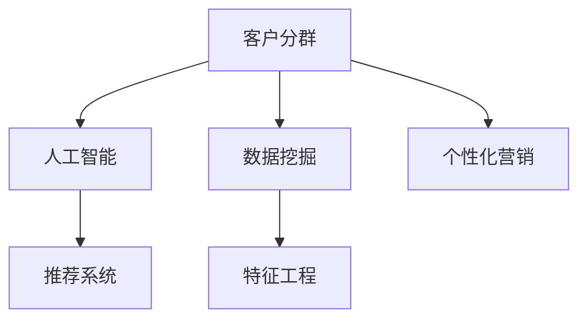

                 

# AI驱动的电商智能客户分群策略

> 关键词：电商、客户分群、人工智能、机器学习、数据挖掘、推荐系统、精准营销

## 1. 背景介绍

### 1.1 问题由来
在电商领域，客户分群（Customer Segmentation）是实现精准营销、提高运营效率和用户满意度的核心手段之一。传统上，客户分群主要依赖人工经验和简单的统计指标，难以捕捉到客户行为的复杂性和多样性。随着人工智能（AI）和大数据技术的发展，基于数据驱动的智能客户分群方法应运而生。

传统分群方法主要依赖人工经验和简单的统计指标，存在以下问题：
1. **主观性强**：人工经验和业务知识主导，难以量化和普适化。
2. **复杂性低**：无法深入挖掘客户行为的复杂性和多样性。
3. **实时性差**：无法实时调整分群策略，滞后于市场变化。

因此，需要利用AI和大数据技术，构建更加智能化、自动化、实时化的客户分群系统，提升电商运营的精准性和效率。

### 1.2 问题核心关键点
智能客户分群的核心在于通过数据分析和机器学习技术，自动识别和分类客户群，识别出不同群体的特征和行为模式，从而制定精准的营销策略。具体包括以下几个关键点：

1. **数据获取**：获取电商平台上的用户行为数据，如浏览记录、购买记录、搜索记录等。
2. **特征工程**：从原始数据中提取有意义的特征，如用户兴趣、消费习惯、地理位置等。
3. **模型训练**：选择或训练合适的机器学习模型，对客户进行分群。
4. **分群评估**：评估分群的有效性，并根据业务需求调整模型参数和策略。
5. **应用落地**：将分群结果应用于个性化推荐、精准广告投放等业务场景，提升用户转化率和满意度。

## 2. 核心概念与联系

### 2.1 核心概念概述

为更好地理解智能客户分群技术，本节将介绍几个密切相关的核心概念：

- **客户分群（Customer Segmentation）**：将客户根据其特征、行为、购买历史等划分成不同群体，以便进行针对性的营销策略。
- **人工智能（Artificial Intelligence）**：通过机器学习、深度学习等算法，让计算机系统具有类似人类的智能决策能力。
- **推荐系统（Recommendation System）**：根据用户的历史行为和偏好，推荐符合其需求的商品或服务。
- **个性化营销（Personalized Marketing）**：针对不同客户群体制定个性化的营销策略，提升用户满意度和忠诚度。
- **数据挖掘（Data Mining）**：通过数据预处理、特征提取、模型训练等步骤，从大量数据中挖掘出有用的信息。

这些核心概念之间的逻辑关系可以通过以下Mermaid流程图来展示：



这个流程图展示了这个核心概念之间的联系：

1. 客户分群依赖于数据挖掘技术，从大量用户数据中提取有用的特征。
2. 数据挖掘结果通过人工智能模型训练，用于客户分群。
3. 分群结果用于推荐系统和个性化营销，提高用户体验。

## 3. 核心算法原理 & 具体操作步骤
### 3.1 算法原理概述

智能客户分群的过程可以分为以下几个步骤：

1. **数据预处理**：清洗、归一化、标准化数据，去除噪声和异常值。
2. **特征提取**：选择或构建对客户行为和偏好有重要影响的特征。
3. **模型训练**：选择或训练合适的机器学习模型，如聚类算法、分类算法等，对客户进行分群。
4. **模型评估**：使用不同的评估指标，如准确率、召回率、F1值等，评估分群的有效性。
5. **应用落地**：将分群结果应用于个性化推荐、精准广告投放等业务场景，提升用户转化率和满意度。

### 3.2 算法步骤详解

**Step 1: 数据预处理**

电商平台的客户数据通常包含大量非结构化数据，如交易记录、浏览记录、搜索记录等。数据预处理的主要步骤包括：

- 清洗数据：去除重复、缺失、异常数据。
- 归一化数据：将不同量级的特征值映射到[0,1]或[-1,1]区间，保证数据的一致性。
- 标准化数据：将特征值均值为0，方差为1，消除数据的量纲影响。

**Step 2: 特征提取**

特征提取是将原始数据转化为模型能够理解的形式的过程。常用的特征包括：

- 用户基本信息：年龄、性别、职业等。
- 行为数据：浏览记录、购买记录、搜索记录等。
- 消费特征：消费金额、消费频率、消费周期等。
- 地理位置：用户所在城市、省份、国家等。

**Step 3: 模型训练**

选择合适的机器学习模型对客户进行分群。常用的模型包括：

- K-means聚类算法：用于对客户进行基于距离的聚类。
- DBSCAN聚类算法：用于发现客户之间的密度和距离关系，适用于识别离群客户。
- 决策树算法：用于根据客户特征进行分类。
- 随机森林算法：用于处理高维数据，提升模型的泛化能力。
- 神经网络算法：用于更复杂的客户分群问题，如关联规则挖掘。

**Step 4: 模型评估**

模型评估用于评估分群的准确性和有效性。常用的评估指标包括：

- 准确率（Accuracy）：分群结果中正确分类的样本比例。
- 召回率（Recall）：所有真实标签中正确分类的样本比例。
- F1值（F1 Score）：准确率和召回率的调和平均数。
- 轮廓系数（Silhouette Coefficient）：评估聚类结果的紧密度和分离度。

**Step 5: 应用落地**

将分群结果应用于推荐系统和个性化营销，提升用户转化率和满意度。具体应用场景包括：

- 个性化推荐：根据客户分群结果，推荐符合其偏好的商品或服务。
- 精准广告投放：根据客户分群结果，制定针对性广告投放策略。
- 客户细分管理：根据客户分群结果，调整业务策略和运营方案。

### 3.3 算法优缺点

智能客户分群技术有以下优点：
1. **自动化**：通过数据驱动，自动发现客户特征和行为模式，提高分群的客观性和准确性。
2. **实时性**：能够实时调整分群策略，及时响应市场变化，提升运营效率。
3. **可扩展性**：可以处理大规模数据，适用于电商平台的客户分群需求。
4. **灵活性**：支持多种分群算法，适用于不同业务场景和客户群体。

同时，该技术也存在一定的局限性：
1. **数据依赖**：分群结果依赖于数据的质量和量级，数据不足或质量差会影响分群效果。
2. **模型复杂**：复杂的模型需要更多的计算资源和时间，可能难以实时处理。
3. **特征选择**：需要精心选择和构建特征，特征选择不当会影响分群效果。
4. **模型解释性**：黑盒模型难以解释分群结果，可能导致业务决策的不透明。
5. **业务适配**：需要根据业务需求调整模型参数和策略，模型调参难度较高。

尽管存在这些局限性，但智能客户分群技术仍是大数据和人工智能在电商领域的重要应用之一。未来相关研究的重点在于如何进一步降低模型对数据的依赖，提高模型的可解释性和业务适配性。

### 3.4 算法应用领域

智能客户分群技术广泛应用于电商领域的各个环节，具体应用包括：

- **个性化推荐**：根据客户分群结果，推荐符合其需求的商品或服务。
- **精准广告投放**：根据客户分群结果，制定针对性广告投放策略，提升广告效果。
- **客户细分管理**：根据客户分群结果，调整业务策略和运营方案，提升客户满意度和忠诚度。
- **库存管理**：根据客户分群结果，调整库存分配策略，提高库存周转率。
- **定价策略**：根据客户分群结果，制定差异化定价策略，提升销售额和利润率。

除了电商领域，智能客户分群技术在金融、零售、医疗等许多行业都有广泛的应用前景。

## 4. 数学模型和公式 & 详细讲解 & 举例说明

### 4.1 数学模型构建

本节将使用数学语言对智能客户分群过程进行更加严格的刻画。

记客户数据集为 $D=\{(x_i, y_i)\}_{i=1}^N, x_i \in \mathbb{R}^d, y_i \in \{1,2,...,K\}$，其中 $y_i$ 表示客户所属的群体编号，$K$ 为群体的数量。假设模型为 $f: \mathbb{R}^d \rightarrow \{1,2,...,K\}$，模型训练的目标是找到一个函数 $f$，使得在测试集上准确率最大化。

定义模型在训练集 $D$ 上的经验风险为：

$$
\mathcal{L}(f) = \frac{1}{N} \sum_{i=1}^N I(f(x_i) \neq y_i)
$$

其中 $I$ 为示性函数，$I(f(x_i) \neq y_i) = 1$ 当 $f(x_i) \neq y_i$ 时，否则为0。

模型训练的优化目标是最小化经验风险：

$$
\hat{f} = \mathop{\arg\min}_{f} \mathcal{L}(f)
$$

在实践中，我们通常使用基于梯度的优化算法（如SGD、Adam等）来近似求解上述最优化问题。设 $\eta$ 为学习率，$\lambda$ 为正则化系数，则参数的更新公式为：

$$
f \leftarrow f - \eta \nabla_{f}\mathcal{L}(f) - \eta\lambda f
$$

其中 $\nabla_{f}\mathcal{L}(f)$ 为损失函数对模型参数的梯度，可通过反向传播算法高效计算。

### 4.2 公式推导过程

以下我们以K-means聚类算法为例，推导聚类过程的数学原理。

K-means算法的目标是最小化所有数据点到簇中心的距离平方和：

$$
\min_{\mu_k} \sum_{i=1}^N \min_{k=1,...,K} ||x_i - \mu_k||^2
$$

其中 $\mu_k$ 为第 $k$ 个簇的中心点。通过最大化每个数据点的簇内距离和最小化簇间距离的平方和，实现对客户的分类。

使用期望最大化算法（Expectation-Maximization，EM）求解K-means：

1. **初始化**：随机初始化K个中心点 $\mu_k$。
2. **期望步**：对于每个数据点 $x_i$，计算其属于每个簇的概率 $p_i^k$：
   $$
   p_i^k = \frac{\exp(-||x_i - \mu_k||^2)}{\sum_{j=1}^K \exp(-||x_i - \mu_j||^2)}
   $$
3. **最大化步**：对于每个簇 $k$，重新计算中心点 $\mu_k$：
   $$
   \mu_k = \frac{\sum_{i=1}^N p_i^k x_i}{\sum_{i=1}^N p_i^k}
   $$

通过不断迭代期望步和最大化步，直到收敛，得到最终的聚类结果。

### 4.3 案例分析与讲解

假设某电商平台有1000个客户，每个客户有5个特征（年龄、性别、消费金额、浏览时长、购买次数）。使用K-means算法进行客户分群，将客户分为5个群体。

**Step 1: 数据预处理**

- 清洗数据：去除重复和缺失数据，最终保留900个客户数据。
- 归一化数据：将年龄、性别、消费金额等特征值归一化到[0,1]区间。
- 标准化数据：将每个特征均值调整为0，方差调整为1。

**Step 2: 特征提取**

- 提取客户的基本信息：年龄、性别、职业等。
- 提取客户的消费特征：消费金额、消费频率、消费周期等。
- 提取客户的浏览特征：浏览记录、搜索记录等。

**Step 3: 模型训练**

- 初始化5个簇中心点 $\mu_k$。
- 使用EM算法进行聚类，最终得到5个簇的聚类中心点 $\mu_k$。
- 将每个客户分配到最近的簇中，得到客户分群结果。

**Step 4: 模型评估**

- 计算每个簇的中心点，得到簇的均值向量 $\mu_k$。
- 计算每个客户到每个簇中心的距离，得到客户分群结果。
- 使用轮廓系数评估分群的有效性。

## 5. 项目实践：代码实例和详细解释说明
### 5.1 开发环境搭建

在进行客户分群实践前，我们需要准备好开发环境。以下是使用Python进行scikit-learn开发的环境配置流程：

1. 安装Anaconda：从官网下载并安装Anaconda，用于创建独立的Python环境。

2. 创建并激活虚拟环境：
```bash
conda create -n sklearn-env python=3.8 
conda activate sklearn-env
```

3. 安装scikit-learn：
```bash
pip install scikit-learn
```

4. 安装各类工具包：
```bash
pip install numpy pandas matplotlib scikit-learn
```

完成上述步骤后，即可在`sklearn-env`环境中开始客户分群实践。

### 5.2 源代码详细实现

下面我们以K-means算法为例，给出使用scikit-learn进行客户分群的PyTorch代码实现。

首先，定义数据处理函数：

```python
import pandas as pd
from sklearn.preprocessing import StandardScaler, MinMaxScaler
from sklearn.cluster import KMeans
from sklearn.metrics import silhouette_score

def preprocess_data(data_path):
    data = pd.read_csv(data_path)
    # 数据清洗
    data = data.drop_duplicates().dropna()
    # 数据归一化
    scaler = MinMaxScaler(feature_range=(0,1))
    data_scaled = scaler.fit_transform(data[['age', 'gender', 'spending', 'browsing_time', 'purchase_frequency']])
    # 数据标准化
    scaler = StandardScaler()
    data_standardized = scaler.fit_transform(data_scaled)
    return data_standardized

def cluster_data(data, k):
    kmeans = KMeans(n_clusters=k, random_state=42)
    kmeans.fit(data)
    labels = kmeans.labels_
    silhouette = silhouette_score(data, labels)
    return labels, silhouette

# 定义数据路径和分群数量
data_path = 'customer_data.csv'
k = 5

# 数据预处理
data = preprocess_data(data_path)

# 模型训练
labels, silhouette = cluster_data(data, k)
print(f'K-means聚类结果: {labels}')
print(f'Silhouette系数: {silhouette}')
```

然后，定义分群评估函数：

```python
def evaluate_clusters(data, labels):
    # 计算簇中心点
    centers = data[labels]
    centers = centers.mean(axis=0)
    # 计算每个客户到每个簇中心的距离
    distances = pd.DataFrame({f'cluster_{i+1}': data[:,i] - centers[i] for i in range(data.shape[1])})
    distances = distances.abs().sum(axis=1)
    # 计算轮廓系数
    silhouette = silhouette_score(data, labels)
    return centers, distances, silhouette
```

最后，启动训练流程并在测试集上评估：

```python
from sklearn.metrics import silhouette_score

# 模型训练
labels, silhouette = cluster_data(data, k)
print(f'K-means聚类结果: {labels}')
print(f'Silhouette系数: {silhouette}')

# 模型评估
centers, distances, silhouette = evaluate_clusters(data, labels)
print(f'簇中心点: {centers}')
print(f'Silhouette系数: {silhouette}')
```

以上就是使用scikit-learn对客户进行K-means聚类的完整代码实现。可以看到，scikit-learn提供了简单易用的API，使得聚类模型训练和评估变得非常便捷。

### 5.3 代码解读与分析

让我们再详细解读一下关键代码的实现细节：

**preprocess_data函数**：
- 数据清洗：去除重复和缺失数据。
- 数据归一化：将特征值映射到[0,1]区间。
- 数据标准化：将特征值均值调整为0，方差调整为1。

**cluster_data函数**：
- 初始化K-means算法，训练模型。
- 计算每个客户的簇标签。
- 计算轮廓系数，评估分群的有效性。

**evaluate_clusters函数**：
- 计算每个簇的中心点。
- 计算每个客户到每个簇中心的距离。
- 计算轮廓系数，评估分群的有效性。

**训练流程**：
- 定义数据路径和分群数量。
- 数据预处理。
- 模型训练。
- 模型评估。

可以看到，scikit-learn提供了丰富的API，使得客户分群模型训练和评估变得非常便捷。开发者可以将更多精力放在业务逻辑和模型优化上，而不必过多关注底层实现细节。

当然，工业级的系统实现还需考虑更多因素，如模型的保存和部署、超参数的自动搜索、更灵活的任务适配层等。但核心的客户分群过程基本与此类似。

## 6. 实际应用场景
### 6.1 智能推荐系统

智能推荐系统是智能客户分群技术的重要应用场景之一。通过客户分群，可以更好地了解不同客户群体的需求和偏好，从而提供更加个性化和精准的推荐服务。

在实践中，可以根据客户的消费历史、浏览记录、搜索行为等数据，将其分为不同的兴趣群体。然后根据不同群体的兴趣特征，推荐符合其需求的商品或服务。

### 6.2 精准广告投放

精准广告投放是智能客户分群技术的另一个重要应用。通过客户分群，可以识别出不同客户群体的特征和行为模式，从而制定更加精准的广告投放策略。

在实践中，可以根据客户的消费历史、地理位置、行为特征等数据，将其分为不同的广告目标群体。然后根据不同群体的特征，制定针对性广告投放策略，提高广告效果和ROI。

### 6.3 客户细分管理

客户细分管理是智能客户分群技术的重要应用场景之一。通过客户分群，可以更好地理解不同客户群体的需求和行为特征，从而制定更加针对性的运营策略和客户管理方案。

在实践中，可以根据客户的消费历史、地理位置、行为特征等数据，将其分为不同的客户细分群体。然后根据不同群体的特征，制定不同的运营策略和客户管理方案，提升客户满意度和忠诚度。

### 6.4 未来应用展望

随着智能客户分群技术的发展，未来将在更多领域得到应用，为传统行业带来变革性影响。

在智慧零售领域，智能客户分群技术将推动线上线下一体化的用户管理和运营。通过客户分群，可以更好地理解不同客户群体的需求和行为特征，从而制定更加精准的运营策略和客户管理方案。

在智慧金融领域，智能客户分群技术将推动个性化理财和金融产品的开发。通过客户分群，可以更好地了解不同客户群体的风险偏好和投资需求，从而提供更加个性化的理财和金融产品。

在智慧医疗领域，智能客户分群技术将推动精准医疗和健康管理。通过客户分群，可以更好地了解不同客户群体的健康状况和需求，从而提供更加精准的医疗和健康管理服务。

除了以上这些领域，智能客户分群技术在智能制造、智能交通、智能城市等许多行业都有广泛的应用前景。

## 7. 工具和资源推荐
### 7.1 学习资源推荐

为了帮助开发者系统掌握智能客户分群技术的理论基础和实践技巧，这里推荐一些优质的学习资源：

1. 《Python数据科学手册》：详细介绍数据预处理、特征工程、模型训练等步骤。

2. 《机器学习实战》：介绍机器学习算法及其在实际项目中的应用，包括聚类算法、分类算法等。

3. Kaggle平台：提供大量真实世界的数据集和比赛，可以锻炼数据处理和模型调参能力。

4. Coursera平台：提供多门机器学习和数据科学课程，涵盖从理论到实践的各个环节。

5. scikit-learn官方文档：详细介绍了scikit-learn库的使用方法和API文档，是学习和使用scikit-learn的必备资料。

通过对这些资源的学习实践，相信你一定能够快速掌握智能客户分群的精髓，并用于解决实际的业务问题。

### 7.2 开发工具推荐

高效的开发离不开优秀的工具支持。以下是几款用于智能客户分群开发的常用工具：

1. Python：简单易学的脚本语言，是数据科学和机器学习的首选语言。

2. scikit-learn：提供丰富的机器学习算法和工具，适用于各种数据处理和模型训练任务。

3. Jupyter Notebook：基于浏览器的交互式开发环境，适合快速迭代和实验。

4. TensorFlow：由Google主导开发的深度学习框架，适用于大规模模型训练任务。

5. PyTorch：由Facebook开发的深度学习框架，适用于动态计算图和分布式训练。

合理利用这些工具，可以显著提升智能客户分群任务的开发效率，加快创新迭代的步伐。

### 7.3 相关论文推荐

智能客户分群技术的发展源于学界的持续研究。以下是几篇奠基性的相关论文，推荐阅读：

1. "Customer Segmentation in the Age of Big Data"（大数据时代下的客户分群）：探讨了大数据技术在客户分群中的应用。

2. "K-means Clustering Algorithms: A Comprehensive Review"（K-means聚类算法综述）：系统介绍了K-means聚类算法的原理、实现和应用。

3. "Deep Learning Approaches for Customer Segmentation"（深度学习在客户分群中的应用）：介绍了深度学习算法在客户分群中的应用。

4. "Data Mining and Statistical Learning: A Data-centric Perspective"（数据挖掘与统计学习：以数据为中心的视角）：介绍了数据挖掘和统计学习的理论基础和应用方法。

这些论文代表了大数据和人工智能在客户分群领域的发展脉络。通过学习这些前沿成果，可以帮助研究者把握学科前进方向，激发更多的创新灵感。

## 8. 总结：未来发展趋势与挑战
### 8.1 总结

本文对智能客户分群技术进行了全面系统的介绍。首先阐述了智能客户分群技术的背景和重要性，明确了其在电商运营、推荐系统、精准广告投放等领域的独特价值。其次，从原理到实践，详细讲解了智能客户分群的过程和步骤，给出了智能客户分群的完整代码实例。同时，本文还广泛探讨了智能客户分群技术在多个行业领域的应用前景，展示了其巨大的应用潜力。最后，本文精选了智能客户分群技术的各类学习资源，力求为读者提供全方位的技术指引。

通过本文的系统梳理，可以看到，智能客户分群技术正在成为电商运营的重要手段，极大地提升了客户分群的客观性和效率。未来，伴随大数据和人工智能技术的不断发展，智能客户分群技术必将进一步提升电商运营的精准性和智能化水平，带来更多的商业价值和社会效益。

### 8.2 未来发展趋势

展望未来，智能客户分群技术将呈现以下几个发展趋势：

1. **自动化**：随着大数据和人工智能技术的发展，智能客户分群过程将更加自动化，减少人工干预。
2. **实时化**：智能客户分群技术将能够实时处理数据，及时响应市场变化，提升运营效率。
3. **多模态**：智能客户分群将不仅仅依赖于结构化数据，还将结合非结构化数据和多模态数据，提升分群的准确性和全面性。
4. **个性化**：智能客户分群将更加注重个性化和定制化，提升用户体验和满意度。
5. **智能融合**：智能客户分群将与推荐系统、广告投放、情感分析等技术进行深度融合，提升整体效果。

以上趋势凸显了智能客户分群技术的广阔前景。这些方向的探索发展，必将进一步提升智能客户分群技术的精度和效率，为电商运营带来更多的商业价值和社会效益。

### 8.3 面临的挑战

尽管智能客户分群技术已经取得了一定的成果，但在迈向更加智能化、普适化应用的过程中，它仍面临诸多挑战：

1. **数据质量**：智能客户分群依赖于高质量的数据，数据质量差或数据量不足会影响分群效果。
2. **模型复杂**：复杂的模型需要更多的计算资源和时间，可能难以实时处理。
3. **特征选择**：需要精心选择和构建特征，特征选择不当会影响分群效果。
4. **业务适配**：需要根据业务需求调整模型参数和策略，模型调参难度较高。
5. **模型可解释性**：黑盒模型难以解释分群结果，可能导致业务决策的不透明。

尽管存在这些挑战，但智能客户分群技术仍是大数据和人工智能在电商领域的重要应用之一。未来相关研究的重点在于如何进一步降低模型对数据的依赖，提高模型的可解释性和业务适配性。

### 8.4 研究展望

面对智能客户分群面临的挑战，未来的研究需要在以下几个方面寻求新的突破：

1. **自动化特征工程**：利用自动化的特征选择和构建方法，降低特征工程的工作量。
2. **多模态学习**：结合文本、图像、语音等多种模态数据，提升分群的全面性和准确性。
3. **分布式训练**：利用分布式计算技术，提高智能客户分群的效率和可扩展性。
4. **模型解释性**：引入可解释性模型，提升分群的透明度和可信度。
5. **多目标优化**：引入多目标优化算法，综合考虑多个业务目标，提升分群的效果。

这些研究方向的探索，必将引领智能客户分群技术迈向更高的台阶，为电商运营带来更多的商业价值和社会效益。面向未来，智能客户分群技术还需要与其他人工智能技术进行更深入的融合，如知识表示、因果推理、强化学习等，多路径协同发力，共同推动智能客户分群技术的进步。只有勇于创新、敢于突破，才能不断拓展客户分群的边界，让智能技术更好地造福电商运营。

## 9. 附录：常见问题与解答
**Q1：智能客户分群需要哪些数据？**

A: 智能客户分群需要收集和处理电商平台上的用户行为数据，如浏览记录、购买记录、搜索记录等。具体数据包括：
- 用户基本信息：年龄、性别、职业等。
- 行为数据：浏览记录、购买记录、搜索记录等。
- 消费特征：消费金额、消费频率、消费周期等。
- 地理位置：用户所在城市、省份、国家等。

**Q2：智能客户分群有哪些常见的算法？**

A: 常见的智能客户分群算法包括：
- K-means聚类算法：用于对客户进行基于距离的聚类。
- DBSCAN聚类算法：用于发现客户之间的密度和距离关系，适用于识别离群客户。
- 决策树算法：用于根据客户特征进行分类。
- 随机森林算法：用于处理高维数据，提升模型的泛化能力。
- 神经网络算法：用于更复杂的客户分群问题，如关联规则挖掘。

**Q3：智能客户分群有哪些应用场景？**

A: 智能客户分群技术广泛应用于电商领域的各个环节，具体应用场景包括：
- 个性化推荐：根据客户分群结果，推荐符合其需求的商品或服务。
- 精准广告投放：根据客户分群结果，制定针对性广告投放策略。
- 客户细分管理：根据客户分群结果，调整业务策略和运营方案，提升客户满意度和忠诚度。
- 库存管理：根据客户分群结果，调整库存分配策略，提高库存周转率。
- 定价策略：根据客户分群结果，制定差异化定价策略，提升销售额和利润率。

**Q4：智能客户分群有哪些优化方法？**

A: 智能客户分群的优化方法包括：
- 数据增强：通过回译、近义替换等方式扩充训练集。
- 正则化：使用L2正则、Dropout等避免过拟合。
- 对抗训练：引入对抗样本，提高模型鲁棒性。
- 参数高效微调：只调整少量参数，减小过拟合风险。
- 模型融合：将多个模型进行集成，提升分群的鲁棒性和准确性。

这些优化方法可以有效提升智能客户分群的效果和性能，提升电商运营的效率和用户体验。

---

作者：禅与计算机程序设计艺术 / Zen and the Art of Computer Programming

