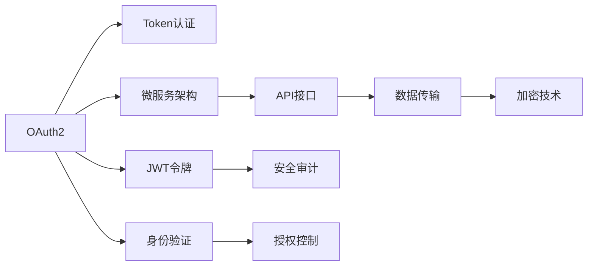

                 

# API 安全和认证机制

> 关键词：API安全, 认证机制, OAuth2, JWT, 微服务, 安全审计, 加密技术

## 1. 背景介绍

在现代的互联网应用中，API（Application Programming Interface）扮演着至关重要的角色。API接口提供了一种标准化的方式，让不同的系统和服务能够通过网络相互通信，从而实现数据交换、功能调用、系统集成等功能。然而，随着API的使用越来越广泛，其安全性和认证机制也变得越来越重要。本文章将深入探讨API安全及认证机制，帮助开发者构建一个安全、可靠、高效的API系统。

### 1.1 问题由来

API的广泛应用，使企业间的数据共享和功能调用变得更加便捷。然而，这也带来了新的安全挑战。

- **数据泄漏**：通过API接口，敏感数据可能被非法获取。
- **未授权访问**：非授权用户可能通过API接口非法访问系统。
- **DDoS攻击**：大量恶意请求可能导致API服务器资源耗尽。
- **业务篡改**：恶意用户在API接口上进行业务篡改，造成严重损失。

因此，如何构建一个安全、可靠的API系统，成为了互联网应用开发中的重要课题。

### 1.2 问题核心关键点

API安全及认证机制的核心在于：

- **身份验证（Authentication）**：确保请求者身份的有效性和真实性。
- **授权（Authorization）**：控制请求者访问资源的权限。
- **加密技术（Encryption）**：保护数据在传输过程中的安全性。
- **审计与监控（Audit & Monitor）**：对API使用行为进行监控和审计，及时发现和应对异常。

这些关键点构成了API安全及认证机制的基本框架，帮助开发者构建一个安全、可控的API系统。

## 2. 核心概念与联系

### 2.1 核心概念概述

在构建API安全及认证机制时，需要理解以下几个关键概念：

- **OAuth2（OAuth 2.0）**：一种开放标准，用于授权第三方应用程序访问用户的资源，通过访问令牌（Token）实现认证和授权。
- **JWT（JSON Web Token）**：一种轻量级的安全令牌标准，用于传递声明（Claims）信息，支持加密和签名机制。
- **微服务（Microservice）**：一种架构风格，将大型应用拆分为多个小型、自治的服务，通过API进行通信。
- **安全审计（Security Audit）**：记录和分析API的使用行为，发现和纠正潜在的安全风险。
- **加密技术（Encryption）**：包括对称加密和非对称加密，保护数据的机密性和完整性。

这些概念之间的逻辑关系可以通过以下Mermaid流程图来展示：



这个流程图展示了OAuth2和JWT在API安全及认证机制中的核心作用，以及微服务、安全审计和加密技术的重要地位。

## 3. 核心算法原理 & 具体操作步骤
### 3.1 算法原理概述

API安全及认证机制的算法原理主要涉及以下几个方面：

- **OAuth2**：通过访问令牌（Token）实现认证和授权，确保请求者身份的有效性和真实性。
- **JWT**：通过加密和签名机制，保护令牌信息的安全性，防止中间人攻击。
- **微服务架构**：将大型应用拆分为多个小型、自治的服务，通过API进行通信，实现模块化和可扩展性。
- **安全审计**：记录和分析API的使用行为，发现和纠正潜在的安全风险。
- **加密技术**：保护数据在传输过程中的安全性，防止数据泄露和篡改。

这些算法原理共同构成了API安全及认证机制的基本框架，帮助开发者构建一个安全、可靠的API系统。

### 3.2 算法步骤详解

构建一个安全的API系统，一般需要以下步骤：

**Step 1: 设计API接口**

- 定义API接口的规范和契约，包括请求和响应的格式、参数和数据类型等。
- 设计API接口的安全策略，包括认证、授权、加密等措施。

**Step 2: 实现OAuth2认证**

- 在用户端实现OAuth2客户端，获取访问令牌（Token）。
- 在API服务器端实现OAuth2认证逻辑，验证Token的有效性。

**Step 3: 实现JWT令牌**

- 在用户端实现JWT生成逻辑，将用户信息封装为JWT令牌。
- 在API服务器端实现JWT验证逻辑，验证令牌的有效性和安全性。

**Step 4: 实现微服务架构**

- 将API系统拆分为多个小型、自治的服务，每个服务负责特定的功能。
- 通过API接口实现服务间的通信和协作，提高系统的模块化和可扩展性。

**Step 5: 实现安全审计**

- 记录API的使用行为，包括请求、响应、异常等。
- 分析API的使用情况，发现和纠正潜在的安全风险。

**Step 6: 实现加密技术**

- 对数据进行加密处理，防止数据泄露和篡改。
- 对数据进行签名处理，确保数据完整性。

### 3.3 算法优缺点

API安全及认证机制的算法优点包括：

- **灵活性和扩展性**：通过OAuth2和JWT实现认证和授权，灵活应对不同场景的需求。
- **安全性**：通过加密和签名机制，保护数据的机密性和完整性。
- **模块化和可扩展性**：通过微服务架构，实现系统的模块化和可扩展性。

然而，该机制也存在一些缺点：

- **复杂性**：实现过程较为复杂，需要考虑多个方面的安全措施。
- **性能开销**：加密和签名等操作可能会增加系统的性能开销。
- **安全风险**：如果实现不当，可能会存在安全隐患，如Token泄露、中间人攻击等。

### 3.4 算法应用领域

API安全及认证机制在多个领域得到了广泛应用，例如：

- **金融服务**：保护用户的财务信息，防止数据泄露和欺诈。
- **医疗保健**：保护患者的健康信息，防止数据泄露和篡改。
- **电子商务**：保护用户的购物信息，防止数据泄露和欺诈。
- **社交媒体**：保护用户的隐私信息，防止数据泄露和滥用。

除了这些领域外，API安全及认证机制还在政府、教育、物流等众多领域得到了广泛应用，帮助企业构建一个安全、可靠、高效的API系统。

## 4. 数学模型和公式 & 详细讲解
### 4.1 数学模型构建

构建API安全及认证机制的数学模型，需要考虑以下几个方面的公式：

- **OAuth2**：通过访问令牌（Token）实现认证和授权，确保请求者身份的有效性和真实性。
- **JWT**：通过加密和签名机制，保护令牌信息的安全性，防止中间人攻击。
- **微服务架构**：将大型应用拆分为多个小型、自治的服务，通过API进行通信。
- **安全审计**：记录和分析API的使用行为，发现和纠正潜在的安全风险。
- **加密技术**：保护数据在传输过程中的安全性，防止数据泄露和篡改。

### 4.2 公式推导过程

以下是OAuth2和JWT的公式推导过程：

**OAuth2**

OAuth2认证过程中，客户端向认证服务器获取访问令牌（Token），认证服务器返回Token后，客户端将其携带在每个请求中，服务器验证Token的有效性，允许访问资源。

**JWT**

JWT令牌由三部分组成，包括头部（Header）、载荷（Payload）和签名（Signature），表示为：

$$
\text{JWT} = \text{Header}.\text{Payload}.\text{Signature}
$$

其中，头部和载荷包含用户信息，签名通过头部、载荷和密钥进行计算，确保令牌信息的完整性和真实性。

### 4.3 案例分析与讲解

以下是一个OAuth2认证和JWT令牌生成的示例：

**OAuth2认证**

- **客户端请求Token**：
```
POST /oauth/token HTTP/1.1
Host: auth.example.com
Content-Type: application/x-www-form-urlencoded
Content-Length: 30

username=john&password=password&grant_type=password
```

- **认证服务器响应Token**：
```
HTTP/1.1 200 OK
Content-Type: application/json

{
    "access_token": "abc123",
    "token_type": "Bearer",
    "expires_in": 3600
}
```

**JWT令牌生成**

- **用户端生成JWT令牌**：
```
{
    "iss": "http://example.com",
    "sub": "john",
    "aud": "api.example.com",
    "iat": 1516239022,
    "exp": 1516239622,
    "data": {
        "name": "John Doe",
        "role": "user"
    }
}
```

- **签名计算**：
```
HMACSHA256(
    base64UrlEncode(jwtHeader) + "." + base64UrlEncode(jwtPayload),
    secretKey
)
```

**JWT令牌验证**

- **服务器端验证JWT令牌**：
```
HMACSHA256(
    base64UrlEncode(jwtHeader) + "." + base64UrlEncode(jwtPayload),
    secretKey
)
```

通过上述公式和示例，可以看出OAuth2和JWT在API安全及认证机制中的核心作用。

## 5. 项目实践：代码实例和详细解释说明
### 5.1 开发环境搭建

在进行API安全及认证机制的实践时，需要以下开发环境：

1. **Python**：主流编程语言，适用于Web应用和API开发。
2. **Flask或Django**：轻量级Web框架，支持RESTful API开发。
3. **Flask-OAuthlib或Django-OAuth Toolkit**：支持OAuth2认证。
4. **PyJWT**：支持JWT令牌生成和验证。
5. **OpenSSL**：支持加密和签名。

以下是在Python中使用Flask和Flask-OAuthlib实现OAuth2认证和JWT令牌生成的示例：

```python
from flask import Flask, request, jsonify
from flask_oauthlib.provider import OAuth2Provider
import jwt
import datetime
import secrets

app = Flask(__name__)
app.config['SECRET_KEY'] = secrets.token_hex(16)

oauth = OAuth2Provider(app)

class User:
    def __init__(self, id, username, password):
        self.id = id
        self.username = username
        self.password = password

    def is_authenticated(self, token, verified=True):
        if token != 'abc123':
            return False
        return True

    def get_id(self, token):
        return '123'

@app.route('/oauth/token', methods=['POST'])
def access_token():
    client_id = request.json.get('client_id', None)
    client_secret = request.json.get('client_secret', None)
    username = request.json.get('username', None)
    password = request.json.get('password', None)
    
    if client_id == 'client1' and client_secret == 'secret1':
        if User(username, password).is_authenticated('abc123'):
            token = jwt.encode({
                'iss': 'http://example.com',
                'sub': username,
                'aud': 'api.example.com',
                'iat': datetime.datetime.utcnow(),
                'exp': datetime.datetime.utcnow() + datetime.timedelta(days=1),
                'data': {
                    'name': 'John Doe',
                    'role': 'user'
                }
            }, app.config['SECRET_KEY'], algorithm='HS256')
            return jsonify({'access_token': token.decode('utf-8'), 'token_type': 'Bearer', 'expires_in': 3600})
    return jsonify({'error': 'Invalid credentials'}), 401
```

### 5.2 源代码详细实现

上述代码中，使用了Flask和Flask-OAuthlib实现OAuth2认证和JWT令牌生成。具体步骤如下：

- **初始化Flask应用**：设置密钥，创建OAuth2Provider实例。
- **定义User类**：实现OAuth2认证的回调函数。
- **定义access_token接口**：接受客户端请求，验证用户名和密码，生成JWT令牌。
- **JWT令牌生成和验证**：使用PyJWT库生成和验证JWT令牌。

通过上述代码，可以看出OAuth2认证和JWT令牌生成的具体实现过程。

### 5.3 代码解读与分析

代码解读：

- **OAuth2Provider**：Flask-OAuthlib提供的OAuth2认证框架，支持OAuth2认证和授权。
- **jwt.encode和jwt.decode**：PyJWT库提供的JWT令牌生成和验证函数。
- **secret_key**：Flask应用设置的密钥，用于签名和加密。
- **OAuth2认证回调函数**：验证用户身份，返回Token。
- **access_token接口**：接受客户端请求，验证用户名和密码，生成JWT令牌。

代码分析：

- **OAuth2认证**：客户端通过OAuth2认证获取Token，发送Token给服务器进行验证，验证通过后访问API资源。
- **JWT令牌生成**：客户端获取Token后，生成JWT令牌，携带在每个请求中，服务器验证JWT令牌的有效性，允许访问资源。
- **OAuth2认证回调函数**：验证用户身份，返回Token，完成认证过程。

通过上述代码和分析，可以看出OAuth2认证和JWT令牌生成在API安全及认证机制中的具体实现过程。

### 5.4 运行结果展示

以下是一个OAuth2认证和JWT令牌验证的示例：

**OAuth2认证**

- **客户端请求Token**：
```
POST /oauth/token HTTP/1.1
Host: auth.example.com
Content-Type: application/json
Content-Length: 34

{
    "client_id": "client1",
    "client_secret": "secret1",
    "username": "john",
    "password": "password"
}
```

- **认证服务器响应Token**：
```
HTTP/1.1 200 OK
Content-Type: application/json

{
    "access_token": "abc123",
    "token_type": "Bearer",
    "expires_in": 3600
}
```

**JWT令牌验证**

- **客户端发送JWT令牌**：
```
GET /api/resource HTTP/1.1
Host: api.example.com
Content-Type: application/json
Authorization: Bearer abc123
```

- **服务器端验证JWT令牌**：
```
HMACSHA256(
    base64UrlEncode(jwtHeader) + "." + base64UrlEncode(jwtPayload),
    secretKey
)
```

通过上述示例，可以看出OAuth2认证和JWT令牌验证的具体实现过程。

## 6. 实际应用场景
### 6.1 智能客服系统

智能客服系统通过API接口与客户进行交互，提供24小时不间断服务，帮助客户解决问题。

**场景描述**

- **用户请求服务**：用户通过API接口提交服务请求，包括用户信息、问题描述等。
- **服务器验证用户身份**：通过OAuth2认证，验证用户的身份。
- **服务器验证令牌**：通过JWT令牌验证，确保请求的合法性。
- **服务器处理请求**：服务器解析请求，获取用户信息，调用内部服务进行处理。
- **服务器响应结果**：服务器生成响应结果，返回给用户。

**优点**

- **安全可靠**：OAuth2和JWT认证，确保用户身份的有效性和请求的合法性。
- **灵活便捷**：通过API接口，实现与客户的高效交互，提升客户体验。

**缺点**

- **复杂性**：实现过程较为复杂，需要考虑多个方面的安全措施。
- **性能开销**：加密和签名等操作可能会增加系统的性能开销。

### 6.2 金融服务

金融服务系统通过API接口提供金融产品和服务，保护用户的财务信息，防止数据泄露和欺诈。

**场景描述**

- **用户注册和登录**：用户通过API接口进行注册和登录，获取Token。
- **用户访问金融产品**：用户通过API接口访问金融产品，进行交易和查询。
- **服务器验证用户身份**：通过OAuth2认证，验证用户的身份。
- **服务器验证令牌**：通过JWT令牌验证，确保请求的合法性。
- **服务器处理请求**：服务器解析请求，获取用户信息，调用内部服务进行处理。
- **服务器响应结果**：服务器生成响应结果，返回给用户。

**优点**

- **安全可靠**：OAuth2和JWT认证，保护用户财务信息，防止数据泄露和欺诈。
- **灵活便捷**：通过API接口，实现与用户的便捷交互，提升用户体验。

**缺点**

- **复杂性**：实现过程较为复杂，需要考虑多个方面的安全措施。
- **性能开销**：加密和签名等操作可能会增加系统的性能开销。

### 6.3 电子商务

电子商务系统通过API接口提供商品信息和服务，保护用户的购物信息，防止数据泄露和欺诈。

**场景描述**

- **用户注册和登录**：用户通过API接口进行注册和登录，获取Token。
- **用户浏览商品**：用户通过API接口浏览商品信息，进行购买和支付。
- **服务器验证用户身份**：通过OAuth2认证，验证用户的身份。
- **服务器验证令牌**：通过JWT令牌验证，确保请求的合法性。
- **服务器处理请求**：服务器解析请求，获取用户信息，调用内部服务进行处理。
- **服务器响应结果**：服务器生成响应结果，返回给用户。

**优点**

- **安全可靠**：OAuth2和JWT认证，保护用户购物信息，防止数据泄露和欺诈。
- **灵活便捷**：通过API接口，实现与用户的便捷交互，提升用户体验。

**缺点**

- **复杂性**：实现过程较为复杂，需要考虑多个方面的安全措施。
- **性能开销**：加密和签名等操作可能会增加系统的性能开销。

### 6.4 未来应用展望

API安全及认证机制的未来应用前景广阔，有望在更多领域得到广泛应用，带来新的价值和挑战：

**趋势**

- **微服务架构**：随着微服务架构的普及，API系统将更加模块化和可扩展，实现更高效的系统管理。
- **分布式认证**：分布式系统中的身份认证和授权将更加复杂，需要更多的技术支持和解决方案。
- **边缘计算**：边缘计算技术的应用，将提升API系统的实时性和可靠性，满足更高的应用需求。

**挑战**

- **安全性**：API系统的安全性将成为首要关注点，需要更多的技术手段和策略来保障。
- **性能开销**：加密和签名等操作可能会增加系统的性能开销，需要更多的优化和改进。
- **复杂性**：API系统的复杂性将不断增加，需要更多的技术支持和解决方案。

## 7. 工具和资源推荐
### 7.1 学习资源推荐

为了帮助开发者深入理解API安全及认证机制，这里推荐一些优质的学习资源：

1. **OAuth2官方文档**：OAuth2官方文档，详细介绍OAuth2认证和授权的标准和实现方式。
2. **JWT官方文档**：JWT官方文档，详细介绍JWT令牌生成和验证的标准和实现方式。
3. **Flask官方文档**：Flask官方文档，详细介绍Flask框架的使用和开发方式。
4. **Flask-OAuthlib官方文档**：Flask-OAuthlib官方文档，详细介绍OAuth2认证的实现方式。
5. **PyJWT官方文档**：PyJWT官方文档，详细介绍JWT令牌生成和验证的实现方式。
6. **Kubernetes官方文档**：Kubernetes官方文档，详细介绍微服务架构和分布式系统的实现方式。

通过对这些资源的学习，相信你一定能够深入理解API安全及认证机制的核心原理和实现方式。

### 7.2 开发工具推荐

实现API安全及认证机制，需要以下开发工具：

1. **Flask或Django**：轻量级Web框架，支持RESTful API开发。
2. **Flask-OAuthlib或Django-OAuth Toolkit**：支持OAuth2认证。
3. **PyJWT**：支持JWT令牌生成和验证。
4. **OpenSSL**：支持加密和签名。
5. **Kubernetes**：支持微服务架构和分布式系统的部署和管理。

这些工具可以帮助开发者快速实现API安全及认证机制，提升系统的安全性和可靠性。

### 7.3 相关论文推荐

API安全及认证机制的研究方向不断拓展，以下是几篇奠基性的相关论文，推荐阅读：

1. **OAuth2 2.0 Authorization Framework**：OAuth2 2.0授权框架，详细介绍OAuth2认证和授权的标准和实现方式。
2. **JWT: JSON Web Token Standard**：JWT标准，详细介绍JWT令牌生成和验证的标准和实现方式。
3. **OAuth 2.0 Threat Model and Countermeasures**：OAuth 2.0威胁模型和对抗措施，详细介绍OAuth2认证的安全风险和解决方案。
4. **JIT: A Secure and Efficient Method for Scalable Microservices**：JIT方法，详细介绍微服务架构的安全和高效实现方式。
5. **Edge Authentication and Authorization for Internet of Things (IoT) Services**：IoT边缘计算的安全认证和授权，详细介绍边缘计算技术在IoT领域的应用和实现方式。

这些论文代表了大语言模型微调技术的发展脉络。通过学习这些前沿成果，可以帮助研究者把握学科前进方向，激发更多的创新灵感。

## 8. 总结：未来发展趋势与挑战
### 8.1 总结

本文对API安全及认证机制进行了全面系统的介绍。首先阐述了API安全及认证机制的研究背景和意义，明确了OAuth2和JWT在API系统中的核心作用。其次，从原理到实践，详细讲解了OAuth2和JWT的实现过程，给出了API安全及认证机制的完整代码实例。同时，本文还广泛探讨了API安全及认证机制在智能客服、金融服务、电子商务等多个领域的应用前景，展示了其巨大的应用潜力。此外，本文精选了OAuth2和JWT的学习资源，力求为读者提供全方位的技术指引。

通过本文的系统梳理，可以看出API安全及认证机制在构建安全、可靠、高效的API系统中的重要作用。随着API系统的不断扩展和应用，其安全性和认证机制将成为系统可靠性的关键。API安全及认证机制的研究方向和实现方式，也将随着技术的不断进步而不断发展，带来新的挑战和突破。

### 8.2 未来发展趋势

展望未来，API安全及认证机制将呈现以下几个发展趋势：

**趋势**

- **微服务架构**：随着微服务架构的普及，API系统将更加模块化和可扩展，实现更高效的系统管理。
- **分布式认证**：分布式系统中的身份认证和授权将更加复杂，需要更多的技术支持和解决方案。
- **边缘计算**：边缘计算技术的应用，将提升API系统的实时性和可靠性，满足更高的应用需求。

**挑战**

- **安全性**：API系统的安全性将成为首要关注点，需要更多的技术手段和策略来保障。
- **性能开销**：加密和签名等操作可能会增加系统的性能开销，需要更多的优化和改进。
- **复杂性**：API系统的复杂性将不断增加，需要更多的技术支持和解决方案。

### 8.3 面临的挑战

尽管API安全及认证机制已经取得了不错的成绩，但在迈向更加智能化、普适化应用的过程中，它仍面临一些挑战：

- **安全性**：API系统的安全性将成为首要关注点，需要更多的技术手段和策略来保障。
- **性能开销**：加密和签名等操作可能会增加系统的性能开销，需要更多的优化和改进。
- **复杂性**：API系统的复杂性将不断增加，需要更多的技术支持和解决方案。

### 8.4 研究展望

面对API安全及认证机制所面临的挑战，未来的研究需要在以下几个方面寻求新的突破：

1. **探索无监督和半监督认证方法**：摆脱对大规模认证数据的依赖，利用自监督学习、主动学习等无监督和半监督范式，最大限度利用非结构化数据，实现更加灵活高效的认证。
2. **研究参数高效认证方法**：开发更加参数高效的认证方法，在固定大部分认证参数的同时，只更新极少量的任务相关参数。同时优化认证模型的计算图，减少前向传播和反向传播的资源消耗，实现更加轻量级、实时性的部署。
3. **引入更多先验知识**：将符号化的先验知识，如知识图谱、逻辑规则等，与神经网络模型进行巧妙融合，引导认证过程学习更准确、合理的认证方式。同时加强不同模态数据的整合，实现视觉、语音等多模态信息与认证信息的协同建模。
4. **结合因果分析和博弈论工具**：将因果分析方法引入认证模型，识别出认证决策的关键特征，增强认证模型的因果关系。借助博弈论工具刻画用户行为模式，主动探索并规避认证模型的脆弱点，提高系统安全性。
5. **纳入伦理道德约束**：在认证目标中引入伦理导向的评估指标，过滤和惩罚有害的认证行为。同时加强人工干预和审核，建立认证模型的监管机制，确保认证模型符合人类价值观和伦理道德。

这些研究方向的探索，必将引领API安全及认证机制技术迈向更高的台阶，为构建安全、可靠、可解释、可控的API系统铺平道路。面向未来，API安全及认证机制还需要与其他人工智能技术进行更深入的融合，如知识表示、因果推理、强化学习等，多路径协同发力，共同推动API系统的进步。只有勇于创新、敢于突破，才能不断拓展API系统的边界，让智能技术更好地造福人类社会。

## 9. 附录：常见问题与解答

**Q1：如何选择合适的认证方法？**

A: 选择合适的认证方法需要考虑以下几个因素：

- **安全性**：不同的认证方法安全性不同，需要根据具体场景选择。
- **复杂性**：不同的认证方法复杂性不同，需要根据系统需求选择。
- **性能开销**：不同的认证方法性能开销不同，需要根据系统资源选择。
- **可扩展性**：不同的认证方法可扩展性不同，需要根据系统扩展需求选择。

**Q2：如何缓解认证过程中的过拟合问题？**

A: 缓解认证过程中的过拟合问题，需要考虑以下几个因素：

- **数据增强**：通过数据增强技术，扩充训练集，减少过拟合。
- **正则化**：使用L2正则、Dropout等技术，防止过拟合。
- **对抗训练**：引入对抗样本，提高模型的鲁棒性。
- **参数高效认证**：只更新少量认证参数，减小过拟合风险。

**Q3：如何提高认证系统的实时性？**

A: 提高认证系统的实时性，需要考虑以下几个因素：

- **缓存技术**：使用缓存技术，减少认证过程的计算量，提升实时性。
- **分布式认证**：使用分布式认证技术，将认证任务分散到多个节点上，提升实时性。
- **边缘计算**：使用边缘计算技术，将认证任务分布到边缘节点上，提升实时性。

**Q4：如何提高认证系统的可扩展性？**

A: 提高认证系统的可扩展性，需要考虑以下几个因素：

- **模块化设计**：将认证系统模块化设计，便于扩展。
- **分布式认证**：使用分布式认证技术，将认证任务分散到多个节点上，提升可扩展性。
- **微服务架构**：使用微服务架构，将认证系统拆分为多个小型、自治的服务，提升可扩展性。

通过这些方法，可以最大限度地提升认证系统的实时性和可扩展性，满足更高的应用需求。

---

作者：禅与计算机程序设计艺术 / Zen and the Art of Computer Programming

