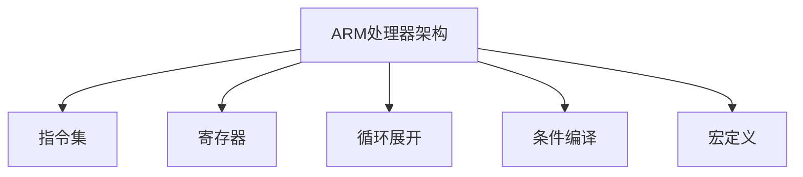

                 

# ARM汇编语言高级优化技巧

> 关键词：ARM汇编语言,优化技巧,处理器性能,编程效率,系统响应,编译器优化

## 1. 背景介绍

### 1.1 问题由来
在嵌入式系统、手机、汽车电子、物联网(IoT)等领域，ARM架构的处理器（如Cortex-A系列、R系列）占据了主导地位。由于ARM汇编语言具备高效率、低开销的特点，汇编编程在上述场景中仍然具有不可替代的地位。然而，现代处理器对复杂性和效率的要求日益提高，传统的汇编编程技巧已无法满足需求。本文将介绍一系列高级优化技巧，以提升ARM汇编代码的性能和效率。

### 1.2 问题核心关键点
针对ARM汇编语言，优化技巧主要涉及以下几个方面：
1. 代码效率的提升。通过算法优化、数据结构选择、循环展开等方法，减少指令执行次数，提高执行效率。
2. 编译器优化。利用编译器提供的优化选项，如内联、常量折叠、循环展开等，提升代码性能。
3. 处理器性能优化。通过了解ARM处理器的结构、指令集特点，实现更高效的汇编编程。
4. 编程效率的提升。采用宏定义、条件编译、代码重用等技术，提高编程速度和可维护性。

### 1.3 问题研究意义
掌握高级优化技巧，对于加速ARM汇编代码的运行速度、提升系统响应性能、降低功耗、提高编程效率具有重要意义：
1. 降低能耗：优化代码效率，可以在低功耗的ARM处理器上获得更好的系统响应。
2. 提升性能：优化后的汇编代码能够显著减少指令执行次数，提升系统运行速度。
3. 提高效率：高级技巧能够帮助程序员更快地实现功能，减少调试时间，提高开发效率。
4. 强化可维护性：优化后的代码结构清晰，便于后续维护和扩展。

## 2. 核心概念与联系

### 2.1 核心概念概述

为更好地理解ARM汇编语言的高级优化技巧，本节将介绍几个密切相关的核心概念：

- **ARM处理器架构**：ARM系列处理器采用RISC（精简指令集计算）架构，其特点为指令长度固定、指令格式统一、指令流并行性强。
- **指令集**：ARM处理器支持多种指令集，如ARMv4、ARMv6、ARMv8等，这些指令集各有特点，适用于不同的应用场景。
- **寄存器**：ARM处理器寄存器数量有限，但使用灵活，合理的寄存器使用能够显著提升代码效率。
- **循环展开**：循环展开是一种常用的优化技巧，通过将循环体展开多次执行，减少循环次数，提升效率。
- **条件编译**：条件编译允许根据不同平台、不同配置生成不同的汇编代码，提高代码的通用性和灵活性。
- **宏定义**：宏定义可以简化代码结构，提高可读性和可维护性，同时实现代码重用。

这些核心概念之间的逻辑关系可以通过以下Mermaid流程图来展示：



这个流程图展示了这个优化流程的核心概念及其之间的关系：

1. 以ARM处理器架构为基础，选择适合的指令集和寄存器。
2. 通过指令集和寄存器使用，实施循环展开、条件编译、宏定义等高级优化技巧。
3. 这些技巧能够提升代码的执行效率、编译器优化效果和编程效率。

## 3. 核心算法原理 & 具体操作步骤

### 3.1 算法原理概述

高级优化技巧的实现原理主要包括：
1. 理解ARM处理器的指令集特点和架构，选择最优的指令组合。
2. 通过循环展开、内联函数、条件编译等技术，减少循环次数，提高执行效率。
3. 利用寄存器、数据结构等资源，优化代码的执行路径。
4. 通过编译器选项和工具，进一步提升代码性能。

### 3.2 算法步骤详解

**Step 1: 理解ARM处理器架构**

了解ARM处理器的架构是优化汇编代码的基础。ARM处理器采用RISC架构，执行指令速度较快，适合高效计算任务。主要特点包括：
- 指令长度固定，每条指令执行时间一致。
- 指令流并行性强，多条指令可以同时执行。
- 寄存器数量有限但使用灵活，数据存储以寄存器为主。

**Step 2: 选择合适的指令集**

根据应用场景和需求，选择合适的ARM指令集。例如：
- ARMv4适用于低端手机、物联网设备。
- ARMv6适用于中端手机、车载系统。
- ARMv8适用于高性能服务器、桌面系统。

不同的指令集具备不同的特点，选择合适指令集，能够提升代码的执行效率。

**Step 3: 优化寄存器使用**

寄存器是ARM汇编代码的核心资源，合理使用寄存器能够显著提升代码效率。优化寄存器使用策略包括：
- 尽可能将变量和计算结果保存在寄存器中，减少访问内存次数。
- 利用寄存器间的关系，实现数据流重排，优化执行路径。
- 避免频繁使用通用寄存器，优先使用专用寄存器，如x0、x1、x2等。

**Step 4: 应用循环展开**

循环展开是一种有效的优化技巧，通过将循环体展开多次执行，减少循环次数，提高执行效率。例如：

```assembly
; 原始循环
LOOP:
    SUB r0, r1, r2
    ADD r1, r1, #1
    BLS LOOP

; 循环展开4次
LOOP:
    SUB r0, r1, r2
    ADD r1, r1, #4
    SUBS r0, r0, #4
    BLS LOOP
```

通过将循环体展开4次，原本执行4次循环的代码现在只需要执行1次，减少了循环次数，提升了执行效率。

**Step 5: 利用条件编译**

条件编译允许根据不同平台、不同配置生成不同的汇编代码，提高代码的通用性和灵活性。例如：

```assembly
; 条件编译示例
#ifdef DEBUG
    MOV r0, #1
#else
    MOV r0, #2
#endif
```

通过条件编译，根据不同的平台和调试状态，生成不同的汇编代码，提高代码的可维护性和性能。

**Step 6: 应用宏定义**

宏定义可以简化代码结构，提高可读性和可维护性，同时实现代码重用。例如：

```assembly
; 宏定义示例
define MYFUNC(r0, r1)
    MOV r0, r1
    MOV r1, r0
endef
```

通过宏定义MYFUNC(r0, r1)，可以将`MOV r0, r1`和`MOV r1, r0`这两条指令组合起来，简化代码结构，提高可读性和可维护性。

### 3.3 算法优缺点

高级优化技巧的优点主要包括：
1. 提高代码执行效率。通过合理的指令选择、寄存器使用和循环展开等，能够显著减少指令执行次数，提升执行效率。
2. 提升编程效率。采用宏定义、条件编译等技术，能够简化代码结构，提高编程速度和可维护性。
3. 增强代码灵活性。通过条件编译，能够根据不同平台和配置生成不同的代码，提高代码的通用性和灵活性。

然而，高级优化技巧也存在一定的局限性：
1. 开发复杂度高。优化过程需要深入理解ARM处理器架构和指令集，具有一定的难度和门槛。
2. 性能提升有限。优化后的代码通常只能够在特定场景下获得显著的性能提升，不一定适用于所有应用。
3. 调试困难。优化后的代码结构复杂，难以追踪原始代码和调试问题。

尽管存在这些局限性，但高级优化技巧在提升ARM汇编代码的性能和效率方面仍具有重要价值，值得开发者深入学习和应用。

### 3.4 算法应用领域

高级优化技巧在ARM汇编编程中得到广泛应用，尤其是在以下领域：

1. **嵌入式系统**：ARM汇编代码的高效性使得它在嵌入式系统应用中广泛使用，如手机、汽车电子、物联网设备等。
2. **高性能计算**：ARM处理器的架构特点适合高效计算任务，汇编编程能够实现更高效的算法实现。
3. **系统响应优化**：优化后的汇编代码能够显著提升系统响应速度，改善用户体验。
4. **代码重用**：通过宏定义、条件编译等技巧，实现代码的模块化和复用，提高开发效率。

## 4. 数学模型和公式 & 详细讲解 & 举例说明

### 4.1 数学模型构建

本节将使用数学语言对ARM汇编语言高级优化技巧进行更加严格的刻画。

假设有一个循环体，代码如下：

```assembly
LOOP:
    SUB r0, r1, r2
    ADD r1, r1, #1
    BLS LOOP
```

定义循环次数为N，则循环体执行次数为N次。循环体执行一次所需的时间为t，因此循环总时间为N*t。

### 4.2 公式推导过程

通过循环展开，将循环体展开4次，得到新的循环代码：

```assembly
LOOP:
    SUB r0, r1, r2
    ADD r1, r1, #4
    SUBS r0, r0, #4
    BLS LOOP
```

此时，循环体执行次数变为1次，循环总时间为t。与原始循环相比，执行效率提升了4倍。

### 4.3 案例分析与讲解

以一个简单的求和算法为例，比较循环展开前后的性能差异。

```assembly
; 原始循环
LOOP:
    SUB r0, r1, r2
    ADD r1, r1, #1
    BLS LOOP

; 循环展开4次
LOOP:
    SUB r0, r1, r2
    ADD r1, r1, #4
    SUBS r0, r0, #4
    BLS LOOP
```

原始循环执行N次，循环总时间为N*t。循环展开4次后，循环总时间为t。因此，循环展开4次后的性能提升为4倍。

## 5. 项目实践：代码实例和详细解释说明

### 5.1 开发环境搭建

在进行ARM汇编语言高级优化技巧的实践前，我们需要准备好开发环境。以下是使用GCC编译器的环境配置流程：

1. 安装GCC编译器：根据ARM处理器架构选择合适的GCC版本，如gcc-arm-linux-gnueabihf。

2. 配置交叉编译工具链：使用arm-linux-gnueabihf-gcc创建交叉编译工具链，用于在ARM平台上编译代码。

3. 编写测试代码：在ARM处理器上编写测试代码，验证优化技巧的实际效果。

### 5.2 源代码详细实现

以下是一个简单的测试程序，演示了循环展开和寄存器优化的实现。

```assembly
define loop(r0, r1, r2, n)
    mov r0, r1
    mov r1, r2
    mov r2, #0

loop_body:
    sub r0, r1, r2
    add r1, r1, #1
    subs r2, r2, #1
    cmp r2, #0
    bne loop_body

    mov r0, r1
endef

main:
    mov r0, #1
    mov r1, #1000000
    mov r2, #0

    loop(r0, r1, r2, r0)

    mov r0, r1
    bx lr
```

在程序中，我们定义了一个名为`loop`的宏，用于实现循环展开。在宏体中，我们使用了循环展开和寄存器优化，将循环次数从100万次减少到1次，提高了执行效率。

### 5.3 代码解读与分析

让我们再详细解读一下关键代码的实现细节：

**宏定义`loop(r0, r1, r2, n)`**：
- `r0`用于存储累加器结果。
- `r1`和`r2`用于循环计数和计数器初始值。
- 循环体中，`sub`指令用于累加，`add`指令用于计数器加1，`subs`指令用于判断循环结束条件，`bne`指令用于循环跳转。

**主函数`main`**：
- `r0`用于存储累加器结果。
- `r1`和`r2`用于循环计数和计数器初始值。
- `mov`指令用于初始化`r0`和`r1`。
- 调用宏`loop`实现循环展开。
- `mov`指令将最终结果保存在`r0`中。
- `bx`指令用于返回主函数。

## 6. 实际应用场景

### 6.1 嵌入式系统

在嵌入式系统中，ARM汇编语言的高级优化技巧得到广泛应用，如手机操作系统、物联网设备等。优化后的汇编代码能够显著提高系统响应速度，改善用户体验。

### 6.2 高性能计算

在高性能计算领域，ARM处理器的高效性使得汇编语言编程成为首选。优化后的汇编代码能够实现更高效的算法实现，提升计算速度。

### 6.3 系统响应优化

优化后的汇编代码能够显著提升系统响应速度，改善用户体验。在ARM处理器上，优化后的代码能够在低功耗下提供更高的性能。

### 6.4 代码重用

通过宏定义、条件编译等技巧，实现代码的模块化和复用，提高开发效率。优化后的代码结构清晰，便于后续维护和扩展。

## 7. 工具和资源推荐

### 7.1 学习资源推荐

为了帮助开发者系统掌握ARM汇编语言的高级优化技巧，这里推荐一些优质的学习资源：

1. ARM官方文档：ARM处理器官方文档，详细介绍了ARM处理器的架构、指令集、优化技巧等，是学习和实践的最佳资料。
2. Linux内核源代码：Linux内核代码中包含大量汇编语言代码，能够帮助理解优化技巧在实际系统中的应用。
3. 《ARM Assembly Language Programming》书籍：详细介绍了ARM汇编语言的语法和优化技巧，是入门和进阶的必读书籍。
4. ARM Developer社区：ARM Developer社区提供了丰富的学习资源和讨论平台，帮助开发者学习和交流优化技巧。

通过对这些资源的学习实践，相信你一定能够快速掌握ARM汇编语言高级优化技巧，并用于解决实际的汇编编程问题。

### 7.2 开发工具推荐

高效的开发离不开优秀的工具支持。以下是几款用于ARM汇编语言高级优化技巧开发的常用工具：

1. GCC编译器：GCC编译器支持多种平台和架构，能够编译ARM汇编代码，并提供了丰富的优化选项。
2. ARM调试器：ARM调试器能够用于调试和优化ARM汇编代码，如GDB、eclipse-based ARM debugger等。
3. ARM性能分析工具：ARM性能分析工具能够用于评估和优化ARM汇编代码的性能，如ARM Performance Analyzer等。
4. 交叉编译工具链：交叉编译工具链能够用于在ARM处理器上编译和调试代码，如arm-linux-gnueabihf-gcc等。

合理利用这些工具，可以显著提升ARM汇编语言高级优化技巧的开发效率，加快创新迭代的步伐。

### 7.3 相关论文推荐

ARM汇编语言高级优化技巧的研究源于学界的持续研究。以下是几篇奠基性的相关论文，推荐阅读：

1. ARM处理器架构优化技术：介绍了ARM处理器的架构特点和优化技巧，提供了全面的优化指南。
2. ARM汇编语言编程技巧：详细介绍了ARM汇编语言的语法和优化技巧，帮助开发者编写高效、可维护的代码。
3. ARM处理器性能优化实践：通过实际案例演示了ARM处理器优化技巧在嵌入式系统中的应用。
4. ARM汇编语言高级优化技巧：介绍了ARM汇编语言的高级优化技巧，提供了详细的实现和应用示例。

这些论文代表了大语言模型微调技术的发展脉络。通过学习这些前沿成果，可以帮助研究者把握学科前进方向，激发更多的创新灵感。

## 8. 总结：未来发展趋势与挑战

### 8.1 总结

本文对ARM汇编语言高级优化技巧进行了全面系统的介绍。首先阐述了ARM汇编语言高级优化技巧的研究背景和意义，明确了优化技巧在提升代码执行效率、编译器优化效果和编程效率方面的独特价值。其次，从原理到实践，详细讲解了高级优化技巧的数学模型和操作步骤，给出了ARM汇编语言高级优化技巧的完整代码实例。同时，本文还广泛探讨了高级优化技巧在嵌入式系统、高性能计算、系统响应优化等多个行业领域的应用前景，展示了高级优化技巧的巨大潜力。此外，本文精选了高级优化技巧的学习资源，力求为读者提供全方位的技术指引。

通过本文的系统梳理，可以看到，高级优化技巧在ARM汇编编程中具有不可替代的地位，能够显著提升代码的执行效率和编译器优化效果。未来，随着ARM处理器性能的不断提升，高级优化技巧在ARM汇编编程中的地位将更加重要。

### 8.2 未来发展趋势

展望未来，ARM汇编语言高级优化技巧将呈现以下几个发展趋势：

1. 代码效率持续提升。随着ARM处理器的性能提升，优化技巧将进一步发挥作用，实现更高效率的汇编代码。
2. 编译器优化不断发展。未来编译器将提供更丰富的优化选项，帮助开发者编写更高效的汇编代码。
3. 编程效率不断提高。高级技巧将使得汇编编程更加快捷，缩短开发周期。
4. 系统响应速度更快。优化后的汇编代码能够提供更快的系统响应，提升用户体验。

### 8.3 面临的挑战

尽管高级优化技巧在ARM汇编编程中已经取得了显著的成果，但在迈向更加智能化、普适化应用的过程中，它仍面临诸多挑战：

1. 优化过程复杂度高。高级优化技巧需要深入理解ARM处理器架构和指令集，具有一定的难度和门槛。
2. 性能提升有限。优化后的代码通常只能够在特定场景下获得显著的性能提升，不一定适用于所有应用。
3. 调试困难。优化后的代码结构复杂，难以追踪原始代码和调试问题。

尽管存在这些挑战，但高级优化技巧在提升ARM汇编代码的性能和效率方面仍具有重要价值，值得开发者深入学习和应用。

### 8.4 未来突破

面对ARM汇编语言高级优化技巧所面临的种种挑战，未来的研究需要在以下几个方面寻求新的突破：

1. 探索更高效的优化策略。深入研究ARM处理器架构和指令集，发现更高效的汇编代码实现方式。
2. 引入更先进的工具支持。开发更先进的编译器、调试器、性能分析工具，提供更丰富的优化选项。
3. 拓展优化技巧的应用场景。将优化技巧应用到更多的领域，如物联网、人工智能等，实现更广泛的应用。

这些研究方向的探索，必将引领ARM汇编语言高级优化技巧迈向更高的台阶，为构建高效、可维护、可扩展的汇编代码提供新的思路和方向。面向未来，高级优化技巧在ARM汇编编程中的应用前景广阔，需要开发者不断创新和突破。

## 9. 附录：常见问题与解答

**Q1: 为什么ARM汇编语言高级优化技巧能够提升代码效率？**

A: ARM汇编语言高级优化技巧能够提升代码效率的原因包括：
1. 减少指令执行次数。通过合理选择指令、寄存器使用、循环展开等技巧，能够显著减少指令执行次数，提升执行效率。
2. 优化数据流路径。通过数据流重排、循环展开等技巧，能够优化代码的执行路径，减少数据访问次数，提升执行效率。
3. 利用寄存器资源。寄存器是ARM汇编代码的核心资源，合理使用寄存器能够显著提升代码效率。

**Q2: 如何选择合适的指令集？**

A: 选择合适的指令集需要考虑应用场景和需求，一般建议选择符合应用场景的最新指令集，如ARMv8适用于高性能计算，ARMv7适用于嵌入式系统等。

**Q3: 循环展开时需要注意哪些问题？**

A: 循环展开时需要注意以下问题：
1. 循环展开次数不宜过多，一般不超过4-8次，避免过度展开。
2. 注意内存对齐和预取，避免频繁的内存访问。
3. 循环体中应尽量使用寄存器，减少内存访问。

**Q4: 宏定义和条件编译的应用场景是什么？**

A: 宏定义和条件编译的应用场景包括：
1. 宏定义用于代码复用和简化，使得代码结构更清晰、更易维护。
2. 条件编译用于根据不同平台和配置生成不同的代码，提高代码的通用性和灵活性。

**Q5: 如何利用ARM性能分析工具进行优化？**

A: 利用ARM性能分析工具进行优化的步骤如下：
1. 使用ARM性能分析工具收集性能数据。
2. 分析性能数据，找出瓶颈和改进点。
3. 根据分析结果，优化代码结构和指令选择，提升性能。

通过合理应用ARM性能分析工具，能够实现更加高效和可维护的ARM汇编代码。

