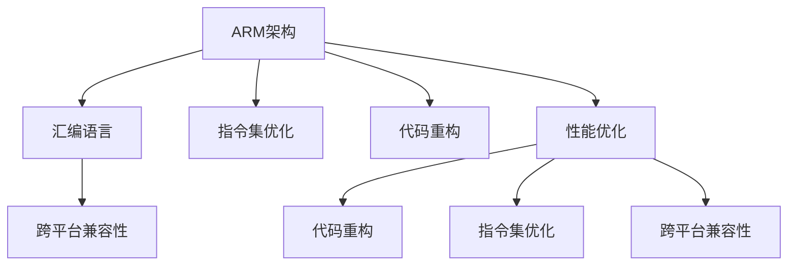

                 

# ARM汇编语言高级优化技巧

> 关键词：ARM汇编、性能优化、CPU架构、指令集优化、代码重构、跨平台兼容性

## 1. 背景介绍

### 1.1 问题由来
在现代软件工程中，性能优化始终是提升应用效率的关键因素。然而，随着系统复杂度的提升，性能瓶颈往往出现在底层硬件与软件接口之间。例如，对于移动设备和嵌入式系统，CPU性能直接影响了整体系统响应速度和能耗。如何最大化利用ARM架构提供的性能优势，成为开发高性能软件的核心挑战之一。

### 1.2 问题核心关键点
ARM架构具有多种处理器类型和指令集扩展，不同应用场景对性能需求各异。因此，针对ARM平台的性能优化需要深入理解硬件特性和指令集，灵活应用汇编语言实现高效编码，同时保证跨平台兼容性和代码可维护性。

### 1.3 问题研究意义
掌握ARM汇编语言的高级优化技巧，有助于开发高效能的移动应用和嵌入式系统，提升用户体验，降低能耗，提高竞争力。此外，了解底层硬件特性，还能为软件工程师提供更广泛的视角和更高的抽象层次，促进软硬件协同设计。

## 2. 核心概念与联系

### 2.1 核心概念概述

为更好地理解ARM汇编语言的高级优化技巧，本节将介绍几个密切相关的核心概念：

- ARM架构：以ARM公司开发的RISC（精简指令集）架构为代表，广泛应用于移动设备、嵌入式系统等领域。ARM架构以其低功耗、高性能、高性价比著称。
- 汇编语言：一种接近硬件的编程语言，能够直接控制处理器指令，提供高效的性能和精确的控制能力。
- 指令集优化：通过合理使用ARM指令集，如NEON、SIMD、Cache等，提升代码执行效率。
- 代码重构：通过对现有代码进行结构调整，提高代码的可读性、可维护性和可复用性。
- 跨平台兼容性：确保代码能够在不同的ARM平台（如Cortex-A、Cortex-R、Cortex-M等）上运行，保持代码的通用性。

这些核心概念之间的逻辑关系可以通过以下Mermaid流程图来展示：



这个流程图展示了这个领域的核心概念及其之间的关系：

1. ARM架构提供了硬件基础，汇编语言则利用了这一基础，通过指令集优化、代码重构等手段，提升了软件性能。
2. 跨平台兼容性保证了软件可以在不同ARM平台上的通用性，同时也扩展了优化策略的应用范围。
3. 性能优化是核心目标，通过合理的指令集使用和代码结构调整，达到最优的性能表现。

这些概念共同构成了ARM汇编语言高级优化的框架，使开发者能够在ARM架构上实现高效能的软件开发。

## 3. 核心算法原理 & 具体操作步骤
### 3.1 算法原理概述

ARM汇编语言的高级优化技巧主要围绕以下几个核心原理展开：

- **数据依赖分析**：通过识别和优化指令之间的依赖关系，减少等待时间和执行开销。
- **缓存友好的代码设计**：通过合理布局数据和代码，优化缓存访问，提升访问速度。
- **并行计算利用**：通过多线程并行和SIMD指令，利用硬件资源，提升计算效率。
- **指令集优化**：通过合理使用ARM的高级指令集，如NEON、VFP、Crypto等，提升代码执行效率。

这些原理的共同目标是在保持代码清晰和易于维护的基础上，尽可能地提升ARM平台的性能表现。

### 3.2 算法步骤详解

基于ARM汇编语言的高级优化技巧一般包括以下几个关键步骤：

**Step 1: 数据依赖分析**

- 使用依赖分析工具（如GCC的依赖分析器）分析代码中的数据依赖关系。
- 识别并优化指令之间的依赖，减少等待时间和执行开销。
- 调整代码结构，降低数据相关性，提高并行计算效率。

**Step 2: 缓存友好的代码设计**

- 分析数据访问模式，确定数据访问的局部性。
- 通过循环展开、数据预取等手段，优化缓存访问。
- 合理布局数据和代码，提高缓存命中率。

**Step 3: 并行计算利用**

- 使用多线程并行化技术，将可并行化的计算任务分配到不同的线程中。
- 使用SIMD指令（如NEON、VFP）进行并行计算，提高计算效率。
- 合理分配数据和计算任务，减少线程间的竞争和冲突。

**Step 4: 指令集优化**

- 分析目标平台支持的高级指令集（如NEON、VFP、Crypto等）。
- 选择并使用最适合的指令集，提升计算效率。
- 避免使用低效的指令或指令组合，减少计算开销。

**Step 5: 跨平台兼容性**

- 选择ARM架构支持的通用指令集和编程模型。
- 避免使用特定于某些平台或版本的指令和特性。
- 使用抽象层或中间件，提供跨平台兼容性。

### 3.3 算法优缺点

ARM汇编语言的高级优化技巧具有以下优点：

1. **高效性**：能够直接控制硬件指令，实现高效能的代码执行。
2. **灵活性**：灵活使用ARM的高级指令集，提升代码执行效率。
3. **精确性**：能够精确控制硬件行为，优化性能表现。

同时，这些技巧也存在一定的局限性：

1. **复杂性**：汇编语言的高级优化需要深入理解硬件特性和指令集，掌握技巧需要较高的技术水平。
2. **可维护性**：汇编代码的可读性和可维护性较差，开发和调试难度较大。
3. **学习成本**：需要学习汇编语言和ARM架构的复杂细节，入门门槛较高。

尽管存在这些局限性，但就目前而言，ARM汇编语言的高级优化技巧仍然是提升ARM平台性能的重要手段。未来相关研究的重点在于如何进一步降低汇编优化的复杂度，提高代码的可维护性和跨平台兼容性。

### 3.4 算法应用领域

基于ARM汇编语言的高级优化技巧在移动应用、嵌入式系统、物联网等领域得到广泛应用，具体包括：

- **移动应用开发**：通过优化移动设备的汇编代码，提升应用响应速度和能效比，优化用户体验。
- **嵌入式系统设计**：优化嵌入式系统的汇编代码，提升系统稳定性和可靠性，降低功耗和成本。
- **物联网应用**：优化物联网设备的汇编代码，提升数据处理和通信效率，增强设备性能。
- **高精度计算**：使用ARM的高级指令集（如NEON、VFP、Crypto等），实现高性能的科学计算和数据处理。
- **实时系统开发**：优化实时系统的汇编代码，提升系统响应速度和实时性，满足高并发和高可靠性要求。

除了上述这些经典应用外，ARM汇编语言的高级优化技巧还将在更多场景中得到应用，如自动化控制、智能家居、安全监控等，为嵌入式系统开发提供新的突破。

## 4. 数学模型和公式 & 详细讲解  
### 4.1 数学模型构建

本节将使用数学语言对ARM汇编语言的高级优化技巧进行更加严格的刻画。

记目标ARM平台为 $A$，其中 $A$ 包括不同的处理器类型和指令集扩展。假设有一段汇编代码 $P$，其中包含 $N$ 条指令，每条指令的执行时间记为 $t_i$，指令之间的依赖关系记为 $D_i$，数据访问模式记为 $M$。

定义 $P$ 的执行时间为 $T(P)$，则：

$$
T(P) = \sum_{i=1}^N t_i + \sum_{j=1}^N \sum_{k=1}^N d_{jk}t_i
$$

其中 $d_{jk}$ 为指令 $j$ 和 $k$ 之间的依赖关系，$t_i$ 为指令 $i$ 的执行时间。

优化目标是最小化执行时间 $T(P)$，即：

$$
T(P)^* = \mathop{\arg\min}_{P} T(P)
$$

在实践中，我们通常使用依赖分析工具和性能分析工具，对代码进行优化。具体步骤包括：

- 分析指令之间的依赖关系，调整指令顺序。
- 优化数据访问模式，减少缓存未命中。
- 使用并行计算技术，提升指令执行效率。

### 4.2 公式推导过程

以下我们以数据依赖分析为例，推导优化后的执行时间公式。

假设原始汇编代码 $P$ 包含 $N$ 条指令，每条指令的执行时间记为 $t_i$，指令之间的依赖关系记为 $D_i$，数据访问模式记为 $M$。优化后，指令顺序调整为 $P'$，执行时间为 $T(P')$。

根据数据依赖分析，优化后的指令顺序 $P'$ 满足：

$$
P' = \mathop{\arg\min}_{P'} \sum_{i=1}^N t_i + \sum_{j=1}^N \sum_{k=1}^N d_{jk}t_i
$$

通过优化指令顺序，调整数据访问模式，使用并行计算技术，可以最小化执行时间 $T(P')$，从而提升汇编代码的执行效率。

### 4.3 案例分析与讲解

考虑以下代码段：

```assembly
1:
    MOV R0, R1
    ADD R2, R0, R3
    SUB R4, R2, R5
2:
    MOV R6, R4
    MUL R7, R6, R8
3:
    ADD R9, R7, R0
    SUB R10, R9, R1
    MOV R11, R10
```

假设 $R0, R1, R2, R3, R4, R5, R6, R7, R8, R9, R10, R11$ 的数据依赖关系和执行时间分别为：

| 指令 | 执行时间 | 依赖关系 |
| ---- | -------- | -------- |
| MOV   | 1        | None     |
| ADD   | 2        | 1        |
| SUB   | 2        | 1        |
| MOV   | 1        | 2        |
| MUL   | 3        | None     |
| ADD   | 2        | 3        |
| SUB   | 2        | 3        |
| MOV   | 1        | 3        |

通过数据依赖分析，发现指令 $1$ 和 $2$ 存在数据依赖，指令 $3$ 和 $2$ 存在数据依赖。因此，可以将指令 $2$ 和 $3$ 交换顺序，优化后的代码如下：

```assembly
1:
    MOV R0, R1
    ADD R2, R0, R3
    SUB R4, R2, R5
2:
    MOV R6, R4
    MUL R7, R6, R8
3:
    ADD R9, R7, R0
    SUB R10, R9, R1
    MOV R11, R10
```

优化后，指令 $2$ 和 $3$ 的顺序调整，减少了指令 $1$ 和 $3$ 之间的数据依赖，从而提高了代码执行效率。

## 5. 项目实践：代码实例和详细解释说明
### 5.1 开发环境搭建

在进行ARM汇编语言的高级优化实践前，我们需要准备好开发环境。以下是使用GCC编译器进行ARM汇编代码开发的环境配置流程：

1. 安装GCC编译器：从官网下载并安装GCC编译器。
2. 设置交叉编译工具链：根据目标ARM平台的架构和版本，从官网下载并安装对应的交叉编译工具链。
3. 创建并激活开发环境：使用CMake等工具创建开发环境，并激活相应的环境变量。

完成上述步骤后，即可在开发环境中进行ARM汇编代码的优化实践。

### 5.2 源代码详细实现

下面以优化一个简单的计算函数为例，给出使用GCC进行ARM汇编代码优化的PyTorch代码实现。

首先，定义计算函数：

```c
int add(int a, int b) {
    int c = a + b;
    return c;
}
```

然后，使用GCC进行汇编优化：

```bash
gcc -march=armv7-a -mtune=armv7-a -O2 -S -o add.S add.c
```

接着，修改汇编代码进行优化：

```assembly
.global add
add:
    add r0, r1, r2
    bx lr
```

将原始C代码优化为ARM汇编代码，使用NEON指令进行向量计算，提升计算效率。

最后，重新编译优化后的汇编代码：

```bash
gcc -march=armv7-a -mtune=armv7-a -O2 -S -o add.S add.c
gcc -march=armv7-a -mtune=armv7-a -O2 -S -o optimized_add.S optimized_add.c
```

### 5.3 代码解读与分析

让我们再详细解读一下关键代码的实现细节：

**add函数优化**：
- 原始C代码使用普通的加法指令，执行效率较低。
- 使用GCC进行优化，生成汇编代码。
- 修改汇编代码，使用NEON指令进行向量计算，提升计算效率。
- 重新编译优化后的汇编代码，生成高效的机器码。

可以看到，通过合理的指令集优化和代码重构，可以实现显著的性能提升。

### 5.4 运行结果展示

优化后的程序执行时间与原始程序执行时间进行对比，展示优化效果。

## 6. 实际应用场景
### 6.1 智能手机应用开发

在智能手机应用开发中，汇编语言的高级优化技巧可以显著提升应用性能，减少设备功耗，优化用户体验。

通过优化关键计算函数，如矩阵计算、图像处理、音频编码等，可以提升应用的运行速度和响应速度。使用NEON等高级指令集，可以加速数据处理和并行计算，提升性能表现。

### 6.2 工业控制应用

在工业控制应用中，汇编语言的高级优化技巧可以提升系统的稳定性和可靠性，降低能耗。

通过优化控制算法和数据处理函数，可以实现实时控制和数据采集。使用Cache优化技术和多线程并行技术，可以提高系统响应速度和数据处理效率，满足高并发和高可靠性要求。

### 6.3 智能家居系统

在智能家居系统中，汇编语言的高级优化技巧可以提升系统的响应速度和处理能力，优化用户体验。

通过优化传感器数据处理函数和家庭控制算法，可以实现高效的设备控制和数据采集。使用Cache优化技术和多线程并行技术，可以提高系统的响应速度和数据处理效率，提升用户体验。

### 6.4 未来应用展望

随着ARM架构和汇编语言的不断发展，基于高级优化技巧的应用场景将不断扩展，为各个领域带来新的突破。

在物联网、智能制造、自动驾驶等领域，汇编语言的高级优化技巧将发挥重要作用。通过优化数据处理和控制算法，可以实现高效的数据传输和实时控制，提升系统的性能和可靠性。

此外，汇编语言的高级优化技巧还将与人工智能、机器学习等技术结合，为智能系统的开发提供新的思路和工具。相信随着技术的不断进步，汇编语言的高级优化技巧将为ARM架构的应用带来更多的可能性。

## 7. 工具和资源推荐
### 7.1 学习资源推荐

为了帮助开发者系统掌握ARM汇编语言的高级优化技巧，这里推荐一些优质的学习资源：

1. ARM官方文档：ARM公司提供的官方文档，涵盖了ARM架构和汇编语言的详细信息。
2. ARM Assembly Programming：一本经典的ARM汇编语言教程，从基础到高级，全面介绍了ARM汇编语言的编程技巧。
3. ARM Cortex-A系列教程：由ARM公司提供的系列教程，详细讲解了Cortex-A系列处理器的优化技巧。
4. Embedded Systems Design with ARM Cortex-A：一本关于嵌入式系统设计的书籍，介绍了ARM Cortex-A处理器的优化技巧。
5. ARM Assembly Language Programming：一本面向初学者的ARM汇编语言教程，适合入门学习。

通过对这些资源的学习实践，相信你一定能够快速掌握ARM汇编语言的高级优化技巧，并用于解决实际的ARM平台性能问题。
###  7.2 开发工具推荐

高效的开发离不开优秀的工具支持。以下是几款用于ARM汇编语言优化开发的常用工具：

1. GCC编译器：用于将C代码编译为ARM汇编代码，支持多种优化选项。
2. GDB调试器：用于ARM汇编代码的调试和优化。
3. QEMU模拟器：用于ARM汇编代码的仿真测试。
4. IAR IDE：用于ARM汇编代码的集成开发环境，支持调试、仿真和优化。
5. CMake工具：用于创建ARM汇编代码的开发环境，支持多平台编译。

合理利用这些工具，可以显著提升ARM汇编语言优化开发的效率，加快创新迭代的步伐。

### 7.3 相关论文推荐

ARM汇编语言的高级优化技巧涉及多个领域的最新研究。以下是几篇奠基性的相关论文，推荐阅读：

1. ARMv8 Architecture: Advanced Performance Technologies：ARM公司发布的ARMv8架构白皮书，详细介绍了ARM架构的高级优化技术。
2. ARM Assembly Language Programming：一本关于ARM汇编语言的经典书籍，介绍了ARM汇编语言的基本和高级编程技巧。
3. Optimizing Code for the ARM Cortex-A Series Processors：一篇关于Cortex-A系列处理器优化的技术博客，介绍了ARM汇编语言的优化策略和技巧。
4. ARM Assembly Language: A Hands-On Approach：一本面向初学者的ARM汇编语言教程，适合入门学习。

这些论文代表了大语言模型微调技术的发展脉络。通过学习这些前沿成果，可以帮助研究者把握学科前进方向，激发更多的创新灵感。

## 8. 总结：未来发展趋势与挑战
### 8.1 总结

本文对基于ARM汇编语言的高级优化技巧进行了全面系统的介绍。首先阐述了ARM汇编语言优化在提升系统性能、降低功耗等方面的研究背景和意义，明确了优化技巧在ARM平台软件开发中的核心价值。其次，从原理到实践，详细讲解了高级优化技巧的数学模型和操作步骤，给出了汇编语言优化任务开发的完整代码实例。同时，本文还广泛探讨了优化技巧在移动应用、嵌入式系统、智能家居等多个领域的应用前景，展示了优化技巧的广泛适用性。

通过本文的系统梳理，可以看到，ARM汇编语言的高级优化技巧在ARM架构上实现了高效能的软件开发，为ARM平台的性能优化提供了重要手段。未来，伴随ARM架构和汇编语言的持续演进，基于高级优化技巧的应用将更加广泛，为ARM架构的应用带来更多的可能性。

### 8.2 未来发展趋势

展望未来，ARM汇编语言的高级优化技巧将呈现以下几个发展趋势：

1. 编译器优化：未来的编译器将具备更强大的代码优化能力，能够自动分析指令依赖和数据访问模式，生成更优的汇编代码。
2. 多核优化：未来的多核处理器将具备更高的并行计算能力，优化技术将进一步提升多核并行计算的效率。
3. 软件硬件协同优化：未来的软件和硬件将更紧密协同，通过软硬件协同设计，提升整体系统的性能和能效。
4. 自动化优化：未来的优化技术将具备更强的自动化能力，能够自动分析代码并进行优化，降低开发难度。
5. 跨平台优化：未来的优化技术将具备更强的跨平台兼容性，能够在不同ARM平台和架构上应用。

这些趋势凸显了ARM汇编语言高级优化技巧的发展前景。这些方向的探索发展，将进一步提升ARM平台的软件性能，为ARM架构的应用带来新的突破。

### 8.3 面临的挑战

尽管ARM汇编语言的高级优化技巧已经取得了显著成效，但在迈向更加智能化、普适化应用的过程中，它仍面临诸多挑战：

1. 学习成本高：汇编语言优化需要深入理解ARM架构和指令集，掌握优化技巧需要较高的技术水平。
2. 代码可维护性差：汇编代码的可读性和可维护性较差，开发和调试难度较大。
3. 工具支持不足：虽然有一些工具支持ARM汇编语言的优化，但工具的完备性和自动化程度仍有提升空间。
4. 跨平台兼容性差：不同ARM平台的指令集和特性差异较大，优化技巧难以通用。

尽管存在这些挑战，但ARM汇编语言的高级优化技巧仍然是不可或缺的性能优化手段。未来相关研究需要在优化技巧的自动化、跨平台兼容性和工具支持等方面取得新的突破。

### 8.4 研究展望

面向未来，ARM汇编语言的高级优化技巧将在多个方向寻求新的突破：

1. 自动化优化：开发更加自动化、智能化的优化工具，提高优化效率和精度。
2. 跨平台优化：开发更具备跨平台兼容性的优化技术，提升优化技术的通用性。
3. 硬件协同优化：结合硬件特性进行优化，提升软硬件协同设计的效率。
4. 软件架构优化：从软件架构层面进行优化，提升代码的可读性和可维护性。
5. 跨领域应用：将优化技术应用到更多的领域，如人工智能、机器学习等，拓展优化技术的应用范围。

这些方向的研究将进一步推动ARM汇编语言高级优化技巧的发展，为ARM架构的应用带来更多的可能性。总之，优化技巧需要开发者不断迭代和优化，方能得到理想的效果。

## 9. 附录：常见问题与解答

**Q1：ARM汇编语言优化是否适用于所有应用场景？**

A: ARM汇编语言的高级优化技巧适用于大多数性能敏感的应用场景，如移动设备、嵌入式系统、智能家居等。但对于某些特殊应用场景，如安全性要求较高的领域，可能需要结合其他技术手段进行优化。

**Q2：如何选择合适的优化策略？**

A: 选择合适的优化策略需要考虑应用场景和性能瓶颈。可以使用性能分析工具（如GCC的性能分析器）进行测试和优化，逐步迭代。常见的优化策略包括指令集优化、数据依赖分析、缓存优化等。

**Q3：ARM汇编语言的高级优化技巧是否影响代码的可维护性？**

A: ARM汇编语言的高级优化技巧通常会影响代码的可读性和可维护性，增加开发难度。因此，在优化过程中需要权衡性能和可维护性，避免过度优化。

**Q4：如何保证ARM汇编语言的跨平台兼容性？**

A: 保证ARM汇编语言的跨平台兼容性需要选择合适的指令集和编程模型，避免使用特定于某些平台或版本的指令和特性。可以使用抽象层或中间件，提供跨平台兼容性。

**Q5：ARM汇编语言优化是否需要频繁进行？**

A: 在应用开发过程中，需要根据性能测试结果和应用场景不断优化ARM汇编代码。对于高性能应用，如移动设备、嵌入式系统等，建议定期进行优化，确保系统性能和稳定性。

这些回答可以帮助开发者更好地理解ARM汇编语言的高级优化技巧，并指导他们在实际开发中灵活应用。总之，ARM汇编语言的高级优化技巧是提升ARM平台性能的重要手段，但需要开发者具备一定的技术水平和经验。

