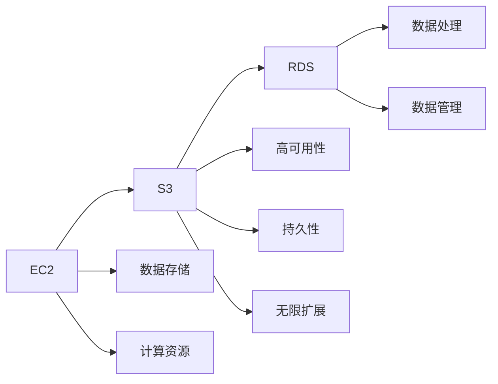

                 

# AWS 云服务：EC2、S3 和 RDS

> 关键词：云计算, EC2, S3, RDS, 云存储, 云数据库, 云服务, 云安全

## 1. 背景介绍

### 1.1 问题由来
随着云计算技术的快速发展，越来越多的企业开始将其数据和业务迁移到云端，以实现资源的按需使用和成本的最小化。Amazon Web Services (AWS)作为全球领先的云服务提供商，提供了包括计算、存储、数据库、人工智能等在内的丰富服务，为企业提供了灵活、高效、安全的云计算解决方案。本文将详细介绍AWS的三大核心云服务：EC2、S3和RDS，以及它们在企业云计算中的重要应用。

### 1.2 问题核心关键点
EC2、S3和RDS作为AWS的云服务，各具特色：
- **EC2**：提供弹性的计算能力，支持多种操作系统和编程语言，支持负载均衡、自动伸缩等功能。
- **S3**：提供高可用的云存储服务，具有高可用性、持久性、无限可扩展性等特点。
- **RDS**：提供高效、可靠、安全的数据库服务，支持多种数据库引擎，包括MySQL、PostgreSQL、SQL Server等。

这些服务相互协作，为企业提供了从数据存储、计算到数据管理的全方位支持。

### 1.3 问题研究意义
深入了解EC2、S3和RDS的原理和应用，对于希望在云端部署应用的企业来说，具有重要的研究意义：
1. **成本控制**：通过灵活的按需计费方式，企业可以按实际使用量付费，避免传统硬件购置和维护的高成本。
2. **业务灵活性**：云计算服务可以按需扩展，适应企业业务的波动性需求，提高资源利用率。
3. **数据安全**：AWS提供严格的数据安全措施和合规性支持，保障企业数据的安全性。
4. **技术创新**：借助AWS的强大生态系统和社区支持，企业可以更快地实现技术创新和业务升级。

## 2. 核心概念与联系

### 2.1 核心概念概述

为更好地理解AWS的EC2、S3和RDS服务，我们需要先掌握以下核心概念：

- **EC2**：Elastic Compute Cloud (EC2)是AWS提供的计算服务，允许用户按需购买虚拟机实例，实现弹性的计算能力。
- **S3**：Simple Storage Service (S3)是AWS提供的云存储服务，支持海量的数据存储和访问。
- **RDS**：Relational Database Service (RDS)是AWS提供的关系型数据库服务，支持多种数据库引擎，提供高性能的数据管理能力。

这些服务在云生态中相互协作，共同构建了一个高效、安全、灵活的云计算平台。

### 2.2 核心概念原理和架构的 Mermaid 流程图



这个图表展示了EC2、S3和RDS在云平台中的位置和功能，以及它们之间的数据流向。

## 3. 核心算法原理 & 具体操作步骤
### 3.1 算法原理概述

EC2、S3和RDS的算法原理基于云计算的弹性计算和分布式存储技术，旨在提供灵活、高效、可靠的服务。

- **EC2**：基于虚拟化技术，将物理服务器划分为多个虚拟实例，每个实例提供独立的计算资源，支持灵活的扩展和管理。
- **S3**：采用分布式文件系统和跨区域复制技术，实现数据的持久性和高可用性，支持海量的数据存储和访问。
- **RDS**：基于关系型数据库的技术，提供高性能、可靠的数据管理服务，支持多种数据库引擎。

### 3.2 算法步骤详解

#### EC2的使用步骤

1. **创建EC2实例**：登录AWS管理控制台，选择EC2服务，创建实例。选择适当的实例类型、操作系统、安全组等参数。
2. **配置网络**：为实例配置网络，指定子网、安全组、公私IP等。
3. **配置存储**：选择EBS（Elastic Block Store）或Snapshots（快照）作为实例的存储。
4. **添加监控**：配置CloudWatch监控服务，监控实例的性能和健康状态。
5. **启动实例**：启动实例，等待其进入运行状态。

#### S3的使用步骤

1. **创建S3桶**：登录AWS管理控制台，选择S3服务，创建桶。选择适当的桶名称、访问权限等参数。
2. **上传数据**：将数据上传到S3桶，支持多种文件格式和对象大小。
3. **配置权限**：为S3桶配置适当的访问权限，控制数据的读写。
4. **管理数据**：使用S3的管理工具对数据进行备份、恢复、迁移等操作。

#### RDS的使用步骤

1. **创建RDS实例**：登录AWS管理控制台，选择RDS服务，创建实例。选择适当的数据库引擎、存储类型等参数。
2. **配置数据库**：为RDS实例配置数据库参数、安全组等。
3. **连接数据库**：使用数据库连接工具连接到RDS实例，进行数据操作。
4. **管理数据库**：使用RDS的管理工具对数据库进行备份、恢复、升级等操作。

### 3.3 算法优缺点

EC2、S3和RDS各有优缺点：

- **EC2**：
  - **优点**：弹性的计算资源、灵活的扩展性、丰富的操作系统和编程语言支持。
  - **缺点**：虚拟化可能带来一定的性能损失、需要监控和维护。

- **S3**：
  - **优点**：高可用性、持久性、无限扩展、低成本。
  - **缺点**：无法实现本地文件访问、性能受限于网络带宽。

- **RDS**：
  - **优点**：高性能、可靠、支持多种数据库引擎、提供丰富的管理工具。
  - **缺点**：需要购买存储空间、存在单点故障风险。

### 3.4 算法应用领域

EC2、S3和RDS在多个领域得到广泛应用：

- **EC2**：适用于网站托管、大数据分析、高性能计算等需要弹性计算资源的应用场景。
- **S3**：适用于海量数据的存储和访问，如数据湖、备份存储、日志存储等。
- **RDS**：适用于需要高效数据管理的应用，如电子商务、金融、医疗等领域。

## 4. 数学模型和公式 & 详细讲解 & 举例说明

### 4.1 数学模型构建

EC2、S3和RDS的数学模型主要涉及性能计算、成本预测和优化调度。这里以EC2为例，介绍其性能计算模型。

**EC2实例性能计算模型**：

1. **计算资源**：EC2实例的计算性能可以用CPU核数、内存大小、网络带宽等参数来衡量。
2. **成本计算**：EC2实例的成本可以用单位时间的计算资源和存储成本来计算。
3. **性能优化**：通过调整计算资源、优化算法和并行计算，提升EC2实例的性能。

### 4.2 公式推导过程

以EC2实例为例，其计算性能和成本的公式推导如下：

1. **计算性能**：
   $$
   P = \frac{CPU核数 \times 时钟频率 \times 执行时间}{内存大小 \times 内存带宽}
   $$

2. **成本计算**：
   $$
   C = P \times 单位时间计算资源成本 + \frac{数据传输量 \times 单位字节数据传输成本}{网络带宽}
   $$

### 4.3 案例分析与讲解

假设企业需要在一个EC2实例上运行一个高并发的Web应用，实例类型为m5.large，具有2个CPU核、4GB内存和1Gbps网络带宽，单位时间的计算资源成本为0.06美元/秒，单位字节数据传输成本为0.01美元/GB，实际应用需要传输500MB数据。

- **性能计算**：
  - 执行时间为1秒
  - 实际应用需要2个CPU核，时钟频率为2.4GHz
  - 内存大小为4GB，内存带宽为32GB/s

  计算性能为：
  $$
  P = \frac{2 \times 2.4 \times 1}{4 \times 32} = 0.3 \text{ 核心秒}
  $$

- **成本计算**：
  - 单位时间计算资源成本为0.06美元/秒
  - 数据传输量为500MB，单位字节数据传输成本为0.01美元/GB
  - 网络带宽为1Gbps

  总成本为：
  $$
  C = 0.3 \times 0.06 + \frac{500 \times 0.01}{1} = 0.18 + 5 = 5.18 \text{ 美元}
  $$

## 5. 项目实践：代码实例和详细解释说明

### 5.1 开发环境搭建

在AWS上使用EC2、S3和RDS，需要搭建以下开发环境：

1. **EC2实例**：在AWS管理控制台中创建EC2实例，设置参数，包括实例类型、安全组、存储等。
2. **S3桶**：创建S3桶，设置访问权限，配置Lifecycle规则，优化存储成本。
3. **RDS实例**：创建RDS实例，配置数据库参数，连接数据库，进行数据操作。

### 5.2 源代码详细实现

**EC2实例代码**：

```python
import boto3

ec2 = boto3.resource('ec2', region_name='us-west-2')

# 创建EC2实例
instance = ec2.create_instances(
    ImageId='ami-0c948852695c574c8',  # 选择预付费或按需实例的AMI
    InstanceType='t2.micro',  # 选择实例类型
    MinCount=1,
    MaxCount=1,
    KeyName='my-key-pair'  # 选择安全密钥
)

# 输出实例信息
print(instance[0].id)
```

**S3桶代码**：

```python
import boto3

s3 = boto3.client('s3')

# 创建S3桶
s3.create_bucket(
    Bucket='my-bucket',
    CreateBucketConfiguration={
        'LocationConstraint': 'us-west-2'  # 设置桶的地理位置
    }
)

# 上传数据
s3.upload_file(
    'data.txt',  # 本地文件路径
    'my-bucket',  # 桶名称
    'data.txt'  # 桶内文件路径
)

# 设置桶的生命周期规则
s3.put_lifecycle_configuration(
    Bucket='my-bucket',
    LifecycleConfiguration={
        'Rules': [
            {
                'ID': 'rule',
                'Expiration': {
                    'Days': 7
                },
                'Status': 'Enabled',
                'Transitions': [
                    {
                        'Days': 7,
                        'StorageClass': 'COLD'
                    }
                ]
            }
        ]
    }
)

# 列出桶内的所有对象
response = s3.list_objects(Bucket='my-bucket')
for obj in response['Contents']:
    print(obj['Key'])
```

**RDS实例代码**：

```python
import boto3

rds = boto3.client('rds')

# 创建RDS实例
response = rds.create_db_instance(
    DBInstanceIdentifier='my-instance',  # 实例标识
    DBInstanceClass='db.t2.micro',  # 实例类别
    Engine='mysql',  # 数据库引擎
    MasterUsername='my-username',  # 管理员用户名
    MasterUserPassword='my-password',  # 管理员密码
    AllocatedStorage=5  # 存储大小
)

# 连接数据库
conn = pymysql.connect(
    host=response['DBInstanceEndpoint'],
    user='my-username',
    password='my-password',
    database='my-database'
)

# 执行SQL语句
cursor = conn.cursor()
cursor.execute('SELECT * FROM my-table')
for row in cursor.fetchall():
    print(row)

# 关闭连接
conn.close()
```

### 5.3 代码解读与分析

EC2、S3和RDS的代码实现主要涉及AWS SDK和SQL语句的使用。AWS SDK提供了一系列的API，方便开发者进行云服务的调用和管理。RDS的代码实现需要连接到数据库实例，并执行SQL语句进行数据操作。

### 5.4 运行结果展示

EC2实例的运行结果包括实例ID、状态、公私IP地址等。S3桶的运行结果包括桶的创建、数据上传和生命周期规则设置。RDS实例的运行结果包括实例的创建、数据库连接和数据操作结果。

## 6. 实际应用场景

### 6.1 智能推荐系统

**应用场景**：电商平台需要根据用户的历史浏览和购买记录，推荐用户可能感兴趣的商品。

**解决方案**：使用EC2实例进行实时数据分析和计算，使用S3桶存储用户数据和商品信息，使用RDS实例进行关系型数据存储和管理。通过实时查询和推荐算法，生成个性化推荐列表，提升用户体验和购买转化率。

### 6.2 数据湖

**应用场景**：企业需要将海量数据存储在云端，并支持数据查询和分析。

**解决方案**：使用EC2实例进行数据处理和分析，使用S3桶存储数据，使用RDS实例进行数据存储和管理。通过数据湖平台，实现数据的集中管理和统一分析，支持多维度的数据查询和报表生成。

### 6.3 弹性伸缩

**应用场景**：企业需要根据业务流量动态调整计算资源，以应对业务波动的挑战。

**解决方案**：使用EC2实例进行弹性的计算资源管理，根据业务流量动态调整实例数量和配置。使用Auto Scaling服务，自动调整实例数量和分配，确保服务的高可用性和性能。

## 7. 工具和资源推荐

### 7.1 学习资源推荐

1. **AWS官方文档**：AWS提供详细的官方文档，涵盖EC2、S3和RDS的使用指南和最佳实践。
2. **《云计算：技术架构与实现》**：深入介绍云计算技术的基本原理和实现方法。
3. **《Amazon Web Services: The Ultimate Beginner's Guide to AWS》**：适合初学者了解AWS的基本概念和操作。

### 7.2 开发工具推荐

1. **AWS SDK**：提供了丰富的API，方便开发者进行云服务的调用和管理。
2. **Pymysql**：用于连接MySQL数据库，进行数据操作。
3. **Boto3**：用于连接S3和RDS服务，进行文件上传和数据库操作。

### 7.3 相关论文推荐

1. **《Elasticity in AWS: Strategies and Best Practices》**：介绍了AWS的弹性计算和存储服务，以及最佳实践。
2. **《Cost-Effective Elastic Cloud Storage》**：探讨了在AWS上实现高可用、低成本的云存储解决方案。
3. **《Elastic Load Balancing: Proven Amazon AWS Solution for Cloud Applications》**：介绍了AWS的负载均衡服务，提高云服务的可用性和性能。

## 8. 总结：未来发展趋势与挑战

### 8.1 研究成果总结

本文详细介绍了AWS的EC2、S3和RDS云服务，涵盖了它们的核心概念、算法原理和具体操作步骤。通过这些服务的灵活组合，企业可以构建高效的云计算平台，支持业务的弹性扩展和数据管理。

### 8.2 未来发展趋势

AWS云服务将继续快速发展，未来的趋势包括：

1. **无服务器架构**：AWS Lambda等无服务器服务将进一步发展，支持更灵活、弹性的计算需求。
2. **边缘计算**：AWS的Edge Services将扩展到全球各地的边缘节点，支持低延迟、高性能的数据处理和存储。
3. **量子计算**：AWS将探索和利用量子计算技术，提高计算能力和数据处理效率。

### 8.3 面临的挑战

AWS云服务在发展过程中，也面临一些挑战：

1. **安全性和隐私保护**：需要应对越来越多的安全威胁和数据隐私问题，保障用户数据的安全性和合规性。
2. **性能和可靠性**：需要不断优化服务的性能和可靠性，避免单点故障和网络延迟等影响用户体验。
3. **成本控制**：需要进一步降低云服务的成本，帮助企业实现成本效益最大化。

### 8.4 研究展望

未来的研究将集中在以下几个方面：

1. **多云和混合云架构**：探索如何将AWS与其他云服务提供商的云服务进行整合，实现多云和混合云架构。
2. **AI和机器学习**：利用AWS的AI和机器学习服务，提升数据分析和处理的智能化水平。
3. **区块链和分布式账本技术**：探索AWS区块链服务在金融、供应链等领域的应用。

总之，AWS云服务在云计算领域具有广阔的发展前景，未来的研究将不断推动云计算技术的发展和应用。

## 9. 附录：常见问题与解答

**Q1：EC2实例的类型如何选择？**

A: 选择EC2实例类型时，需要考虑应用程序的性能需求、成本预算和数据大小。常用实例类型包括：

- t2.micro：适合轻量级应用和开发测试。
- c4.large：适合高性能计算和数据分析。
- m5.large：适合Web应用和机器学习。

**Q2：S3桶的生命周期规则如何设置？**

A: 设置S3桶的生命周期规则，可以优化存储成本，避免不必要的数据保留。通常设置如下规则：

- 将数据保留7天后，转移到COLD存储类，减少成本。
- 超过7天的数据删除，以释放存储空间。

**Q3：RDS实例的备份和恢复如何处理？**

A: 使用RDS实例的备份和恢复功能，可以保障数据的安全性和可靠性。通常备份如下步骤：

- 创建数据库快照，保存在S3桶中。
- 根据快照恢复数据库实例，进行数据恢复。

**Q4：AWS云服务如何实现高可用性？**

A: AWS提供了多种高可用性服务，包括：

- Auto Scaling：根据业务流量动态调整实例数量和配置。
- Elastic Load Balancing：分配流量，避免单点故障。
- Multi-AZ部署：在多个可用区内部署实例，提高可用性。

本文详细介绍了AWS的EC2、S3和RDS云服务，并讨论了它们在企业云计算中的应用。通过这些服务的灵活组合，企业可以构建高效的云计算平台，支持业务的弹性扩展和数据管理。未来，AWS云服务将继续快速发展，探索新的计算和存储解决方案，推动云计算技术的不断进步。

