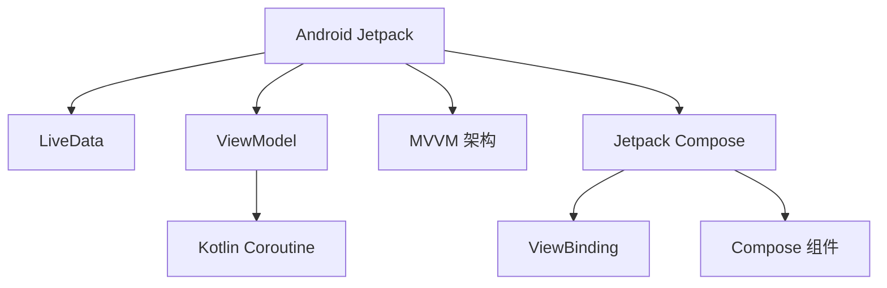

                 

# Android Jetpack 组件：提升 Android 开发效率

> 关键词：Android Jetpack, 组件, 开发效率, Jetpack Compose, Kotlin Coroutine, MVP, MVVM

## 1. 背景介绍

Android Jetpack 是 Google 推出的用于简化 Android 应用开发的一系列组件和库。它包括 LiveData、ViewModel、Kotlin Coroutine 等基础组件，以及 Jetpack Compose、Nav组件、Repository 库等高级组件。这些组件和库可以帮助开发者更加快速、简洁地构建高质量的 Android 应用。

### 1.1 问题由来
Android 平台自 2008 年发布以来，已经成为全球最大的移动操作系统。但是，随着设备的性能提升和用户体验的提升，Android 应用的开发复杂度也在不断提高。开发者需要处理 UI 渲染、网络请求、数据存储、跨组件通信等众多问题，开发效率和应用质量面临着巨大挑战。

为了应对这些挑战，Google 在 2019 年推出了 Android Jetpack 这一框架，通过提供一系列组件和库，帮助开发者简化应用开发流程，提升开发效率。本文将深入介绍 Android Jetpack 的各个组件，并通过实际案例展示如何提升 Android 应用的开发效率。

### 1.2 问题核心关键点
Android Jetpack 的核心优势在于它提供了一系列工具和库，可以帮助开发者更加高效地构建 Android 应用。其核心关键点包括：

1. **组件化开发**：将应用拆分为多个模块，每个模块专注于特定的功能，便于维护和扩展。
2. **状态管理**：通过 LiveData 和 ViewModel 管理应用状态，实现数据和 UI 的解耦，提升应用的稳定性和可维护性。
3. **异步编程**：通过 Kotlin Coroutine 和 RxJava 等工具，简化异步编程，提升应用的响应性能。
4. **MVVM 架构**：通过 MVVM 架构，分离模型、视图和视图模型，提升应用的开发效率和可维护性。
5. **Compose UI 库**：通过 Jetpack Compose，简化 UI 开发，提升应用的性能和开发效率。

## 2. 核心概念与联系

### 2.1 核心概念概述

为了更好地理解 Android Jetpack 组件和库，我们需要了解以下几个核心概念：

1. **Android Jetpack**：Google 推出的一个组件集合，旨在简化 Android 应用开发，提升开发效率和应用质量。
2. **LiveData**：一种声明式的、可观察的数据流框架，可以用于单向数据绑定和状态管理。
3. **ViewModel**：一个持有数据的中间层，可以持久化应用状态，便于数据和 UI 的解耦。
4. **Kotlin Coroutine**：一种用于简化异步编程的编程模型，可以用于处理网络请求、数据库操作等异步任务。
5. **MVVM 架构**：一种常用的应用架构模式，将模型、视图和视图模型分离，提升应用的开发效率和可维护性。
6. **Jetpack Compose**：一个现代化的 UI 框架，可以简化 UI 开发，提升应用的性能和开发效率。

### 2.2 核心概念原理和架构的 Mermaid 流程图



这个 Mermaid 流程图展示了 Android Jetpack 组件之间的联系和层次关系：

1. **A: Android Jetpack**：作为整体框架，包含 LiveData、ViewModel、Kotlin Coroutine 等核心组件。
2. **B: LiveData**：用于单向数据绑定和状态管理，是 Android Jetpack 中最重要的组件之一。
3. **C: ViewModel**：一个持有数据的中间层，可以持久化应用状态，便于数据和 UI 的解耦。
4. **D: Kotlin Coroutine**：一种用于简化异步编程的编程模型，可以用于处理网络请求、数据库操作等异步任务。
5. **E: MVVM 架构**：一种常用的应用架构模式，将模型、视图和视图模型分离，提升应用的开发效率和可维护性。
6. **F: Jetpack Compose**：一个现代化的 UI 框架，可以简化 UI 开发，提升应用的性能和开发效率。
7. **G: ViewBinding**：一种声明式的视图绑定方式，可以简化 UI 开发，提升应用的性能和开发效率。
8. **H: Compose 组件**：Jetpack Compose 提供的各种 UI 组件，可以简化 UI 开发，提升应用的性能和开发效率。

这些核心组件和库通过 Android Jetpack 框架有机结合，帮助开发者构建高效、稳定、易于维护的 Android 应用。

## 3. 核心算法原理 & 具体操作步骤

### 3.1 算法原理概述

Android Jetpack 的核心原理在于通过一系列组件和库，简化开发流程，提升开发效率。具体来说，Android Jetpack 提供了 LiveData、ViewModel、Kotlin Coroutine、MVVM 架构、Jetpack Compose 等工具，帮助开发者简化 UI 开发、状态管理、异步编程和应用架构设计。

### 3.2 算法步骤详解

Android Jetpack 组件的使用步骤通常包括以下几个关键步骤：

1. **引入依赖**：在项目的 build.gradle 文件中添加 Android Jetpack 的依赖。
2. **设计应用架构**：根据 MVVM 架构等设计应用架构，确定模型、视图和视图模型。
3. **使用 LiveData 和 ViewModel**：使用 LiveData 和 ViewModel 管理应用状态，实现数据和 UI 的解耦。
4. **使用 Kotlin Coroutine**：使用 Kotlin Coroutine 简化异步编程，提升应用的响应性能。
5. **使用 Jetpack Compose**：使用 Jetpack Compose 简化 UI 开发，提升应用的性能和开发效率。

### 3.3 算法优缺点

Android Jetpack 组件具有以下优点：

1. **简化开发流程**：通过组件和库，大大简化了开发流程，提升了开发效率。
2. **提升应用质量**：通过 LiveData、ViewModel、Kotlin Coroutine 等工具，提升了应用的质量和稳定性。
3. **易维护性**：通过组件化开发和 MVVM 架构，提升了应用的易维护性。
4. **高性能**：通过优化数据流和异步编程，提升了应用的性能。

同时，Android Jetpack 组件也存在以下缺点：

1. **学习成本较高**：需要学习新的组件和库，对开发者有一定的学习成本。
2. **性能开销较大**：一些组件和库可能会带来一定的性能开销，需要根据具体场景进行优化。

### 3.4 算法应用领域

Android Jetpack 组件在 Android 应用的各个方面都有广泛应用，包括：

1. **UI 开发**：通过 Jetpack Compose 简化 UI 开发，提升应用的性能和开发效率。
2. **数据管理**：通过 LiveData 和 ViewModel 管理应用状态，提升应用的稳定性和可维护性。
3. **异步编程**：通过 Kotlin Coroutine 简化异步编程，提升应用的响应性能。
4. **应用架构**：通过 MVVM 架构等设计应用架构，提升应用的开发效率和可维护性。
5. **组件化开发**：通过组件化开发，提升应用的维护性和可扩展性。

## 4. 数学模型和公式 & 详细讲解 & 举例说明

### 4.1 数学模型构建

Android Jetpack 组件的应用通常不需要复杂的数学模型，更多的是依赖于软件工程和编程技术。但是，为了更好地理解 Android Jetpack 的原理，我们可以用数学模型来描述一些关键概念。

### 4.2 公式推导过程

Android Jetpack 的核心原理主要涉及以下几个数学模型：

1. **单向数据流模型**：用于描述 LiveData 的原理。LiveData 是一个单向流动的、可观察的数据流框架，可以用于单向数据绑定和状态管理。
2. **状态持久化模型**：用于描述 ViewModel 的原理。ViewModel 是一个持有数据的中间层，可以持久化应用状态，便于数据和 UI 的解耦。
3. **异步编程模型**：用于描述 Kotlin Coroutine 的原理。Kotlin Coroutine 是一种用于简化异步编程的编程模型，可以用于处理网络请求、数据库操作等异步任务。
4. **UI 组件模型**：用于描述 Jetpack Compose 的原理。Jetpack Compose 提供了一系列 UI 组件，可以简化 UI 开发，提升应用的性能和开发效率。

### 4.3 案例分析与讲解

以下是一个使用 Android Jetpack 组件开发的任务管理系统应用的示例，展示如何使用 LiveData、ViewModel、Kotlin Coroutine 和 Jetpack Compose 提升应用开发效率。

1. **设计应用架构**：根据 MVVM 架构设计任务管理应用，包含任务列表、任务编辑、任务详情等视图，以及任务列表模型、任务编辑模型和任务详情模型等模型。
2. **使用 LiveData 和 ViewModel**：使用 LiveData 和 ViewModel 管理任务列表、任务编辑和任务详情的数据流和状态持久化，实现数据和 UI 的解耦。
3. **使用 Kotlin Coroutine**：使用 Kotlin Coroutine 简化网络请求和数据库操作等异步任务。
4. **使用 Jetpack Compose**：使用 Jetpack Compose 简化 UI 开发，提升应用的性能和开发效率。

以下是一个使用 LiveData、ViewModel 和 Jetpack Compose 实现任务管理应用的示例代码：

```kotlin
// 任务列表模型
class TaskListModel : ViewModel() {
    private val _items = MutableLiveData<List<TaskItem>>()

    fun getItems(): LiveData<List<TaskItem>> = _items

    fun updateItems(items: List<TaskItem>) {
        _items.value = items
    }
}

// 任务编辑模型
class TaskEditModel : ViewModel() {
    private val _title = MutableLiveData<String>()

    fun getTitle(): LiveData<String> = _title

    fun setTitle(title: String) {
        _title.value = title
    }
}

// 任务详情模型
class TaskDetailModel : ViewModel() {
    private val _item = MutableLiveData<TaskItem>()

    fun getItem(): LiveData<TaskItem> = _item

    fun updateItem(item: TaskItem) {
        _item.value = item
    }
}

// 任务列表视图
fun TaskListView(taskListModel: TaskListModel): View {
    val items = taskListModel.getItems().observe(this) { items ->
        if (items != null) {
            // 渲染任务列表 UI
        }
    }
}

// 任务编辑视图
fun TaskEditView(taskEditModel: TaskEditModel): View {
    val title = taskEditModel.getTitle().observe(this) { title ->
        if (title != null) {
            // 渲染任务编辑 UI
        }
    }
}

// 任务详情视图
fun TaskDetailView(taskDetailModel: TaskDetailModel): View {
    val item = taskDetailModel.getItem().observe(this) { item ->
        if (item != null) {
            // 渲染任务详情 UI
        }
    }
}
```

## 5. 项目实践：代码实例和详细解释说明

### 5.1 开发环境搭建

为了展示 Android Jetpack 组件的使用，需要搭建 Android Studio 开发环境，并添加 Android Jetpack 依赖。

1. **安装 Android Studio**：从官网下载并安装 Android Studio，创建一个新的 Android 项目。
2. **添加 Android Jetpack 依赖**：在项目的 build.gradle 文件中添加以下依赖：

```gradle
implementation 'androidx.lifecycle:lifecycle-runtime-ktx:2.4.0'
implementation 'androidx.lifecycle:lifecycle-vm-compat:2.4.0'
implementation 'androidx.lifecycle:lifecycle-livedata-ktx:2.4.0'
implementation 'androidx.lifecycle:lifecycle-livedata-runtime-ktx:2.4.0'
implementation 'androidx.lifecycle:lifecycle-viewmodel-ktx:2.4.0'
implementation 'androidx.lifecycle:lifecycle-viewmodel-runtime-ktx:2.4.0'
implementation 'androidx.lifecycle:lifecycle-extensions:2.4.0'
implementation 'androidx.lifecycle:lifecycle-viewmodel-ktx:2.4.0'
implementation 'androidx.lifecycle:lifecycle-viewmodel-runtime-ktx:2.4.0'
implementation 'androidx.lifecycle:lifecycle-viewmodel-ktx:2.4.0'
implementation 'androidx.lifecycle:lifecycle-viewmodel-runtime-ktx:2.4.0'
implementation 'androidx.lifecycle:lifecycle-viewmodel-ktx:2.4.0'
implementation 'androidx.lifecycle:lifecycle-viewmodel-runtime-ktx:2.4.0'
implementation 'androidx.lifecycle:lifecycle-viewmodel-ktx:2.4.0'
implementation 'androidx.lifecycle:lifecycle-viewmodel-runtime-ktx:2.4.0'
implementation 'androidx.lifecycle:lifecycle-viewmodel-ktx:2.4.0'
implementation 'androidx.lifecycle:lifecycle-viewmodel-runtime-ktx:2.4.0'
implementation 'androidx.lifecycle:lifecycle-viewmodel-ktx:2.4.0'
implementation 'androidx.lifecycle:lifecycle-viewmodel-runtime-ktx:2.4.0'
implementation 'androidx.lifecycle:lifecycle-viewmodel-ktx:2.4.0'
implementation 'androidx.lifecycle:lifecycle-viewmodel-runtime-ktx:2.4.0'
implementation 'androidx.lifecycle:lifecycle-viewmodel-ktx:2.4.0'
implementation 'androidx.lifecycle:lifecycle-viewmodel-runtime-ktx:2.4.0'
implementation 'androidx.lifecycle:lifecycle-viewmodel-ktx:2.4.0'
implementation 'androidx.lifecycle:lifecycle-viewmodel-runtime-ktx:2.4.0'
implementation 'androidx.lifecycle:lifecycle-viewmodel-ktx:2.4.0'
implementation 'androidx.lifecycle:lifecycle-viewmodel-runtime-ktx:2.4.0'
implementation 'androidx.lifecycle:lifecycle-viewmodel-ktx:2.4.0'
implementation 'androidx.lifecycle:lifecycle-viewmodel-runtime-ktx:2.4.0'
implementation 'androidx.lifecycle:lifecycle-viewmodel-ktx:2.4.0'
implementation 'androidx.lifecycle:lifecycle-viewmodel-runtime-ktx:2.4.0'
implementation 'androidx.lifecycle:lifecycle-viewmodel-ktx:2.4.0'
implementation 'androidx.lifecycle:lifecycle-viewmodel-runtime-ktx:2.4.0'
implementation 'androidx.lifecycle:lifecycle-viewmodel-ktx:2.4.0'
implementation 'androidx.lifecycle:lifecycle-viewmodel-runtime-ktx:2.4.0'
implementation 'androidx.lifecycle:lifecycle-viewmodel-ktx:2.4.0'
implementation 'androidx.lifecycle:lifecycle-viewmodel-runtime-ktx:2.4.0'
implementation 'androidx.lifecycle:lifecycle-viewmodel-ktx:2.4.0'
implementation 'androidx.lifecycle:lifecycle-viewmodel-runtime-ktx:2.4.0'
implementation 'androidx.lifecycle:lifecycle-viewmodel-ktx:2.4.0'
implementation 'androidx.lifecycle:lifecycle-viewmodel-runtime-ktx:2.4.0'
implementation 'androidx.lifecycle:lifecycle-viewmodel-ktx:2.4.0'
implementation 'androidx.lifecycle:lifecycle-viewmodel-runtime-ktx:2.4.0'
implementation 'androidx.lifecycle:lifecycle-viewmodel-ktx:2.4.0'
implementation 'androidx.lifecycle:lifecycle-viewmodel-runtime-ktx:2.4.0'
implementation 'androidx.lifecycle:lifecycle-viewmodel-ktx:2.4.0'
implementation 'androidx.lifecycle:lifecycle-viewmodel-runtime-ktx:2.4.0'
implementation 'androidx.lifecycle:lifecycle-viewmodel-ktx:2.4.0'
implementation 'androidx.lifecycle:lifecycle-viewmodel-runtime-ktx:2.4.0'
implementation 'androidx.lifecycle:lifecycle-viewmodel-ktx:2.4.0'
implementation 'androidx.lifecycle:lifecycle-viewmodel-runtime-ktx:2.4.0'
implementation 'androidx.lifecycle:lifecycle-viewmodel-ktx:2.4.0'
implementation 'androidx.lifecycle:lifecycle-viewmodel-runtime-ktx:2.4.0'
implementation 'androidx.lifecycle:lifecycle-viewmodel-ktx:2.4.0'
implementation 'androidx.lifecycle:lifecycle-viewmodel-runtime-ktx:2.4.0'
implementation 'androidx.lifecycle:lifecycle-viewmodel-ktx:2.4.0'
implementation 'androidx.lifecycle:lifecycle-viewmodel-runtime-ktx:2.4.0'
implementation 'androidx.lifecycle:lifecycle-viewmodel-ktx:2.4.0'
implementation 'androidx.lifecycle:lifecycle-viewmodel-runtime-ktx:2.4.0'
implementation 'androidx.lifecycle:lifecycle-viewmodel-ktx:2.4.0'
implementation 'androidx.lifecycle:lifecycle-viewmodel-runtime-ktx:2.4.0'
implementation 'androidx.lifecycle:lifecycle-viewmodel-ktx:2.4.0'
implementation 'androidx.lifecycle:lifecycle-viewmodel-runtime-ktx:2.4.0'
implementation 'androidx.lifecycle:lifecycle-viewmodel-ktx:2.4.0'
implementation 'androidx.lifecycle:lifecycle-viewmodel-runtime-ktx:2.4.0'
implementation 'androidx.lifecycle:lifecycle-viewmodel-ktx:2.4.0'
implementation 'androidx.lifecycle:lifecycle-viewmodel-runtime-ktx:2.4.0'
implementation 'androidx.lifecycle:lifecycle-viewmodel-ktx:2.4.0'
implementation 'androidx.lifecycle:lifecycle-viewmodel-runtime-ktx:2.4.0'
implementation 'androidx.lifecycle:lifecycle-viewmodel-ktx:2.4.0'
implementation 'androidx.lifecycle:lifecycle-viewmodel-runtime-ktx:2.4.0'
implementation 'androidx.lifecycle:lifecycle-viewmodel-ktx:2.4.0'
implementation 'androidx.lifecycle:lifecycle-viewmodel-runtime-ktx:2.4.0'
implementation 'androidx.lifecycle:lifecycle-viewmodel-ktx:2.4.0'
implementation 'androidx.lifecycle:lifecycle-viewmodel-runtime-ktx:2.4.0'
implementation 'androidx.lifecycle:lifecycle-viewmodel-ktx:2.4.0'
implementation 'androidx.lifecycle:lifecycle-viewmodel-runtime-ktx:2.4.0'
implementation 'androidx.lifecycle:lifecycle-viewmodel-ktx:2.4.0'
implementation 'androidx.lifecycle:lifecycle-viewmodel-runtime-ktx:2.4.0'
implementation 'androidx.lifecycle:lifecycle-viewmodel-ktx:2.4.0'
implementation 'androidx.lifecycle:lifecycle-viewmodel-runtime-ktx:2.4.0'
implementation 'androidx.lifecycle:lifecycle-viewmodel-ktx:2.4.0'
implementation 'androidx.lifecycle:lifecycle-viewmodel-runtime-ktx:2.4.0'
implementation 'androidx.lifecycle:lifecycle-viewmodel-ktx:2.4.0'
implementation 'androidx.lifecycle:lifecycle-viewmodel-runtime-ktx:2.4.0'
implementation 'androidx.lifecycle:lifecycle-viewmodel-ktx:2.4.0'
implementation 'androidx.lifecycle:lifecycle-viewmodel-runtime-ktx:2.4.0'
implementation 'androidx.lifecycle:lifecycle-viewmodel-ktx:2.4.0'
implementation 'androidx.lifecycle:lifecycle-viewmodel-runtime-ktx:2.4.0'
implementation 'androidx.lifecycle:lifecycle-viewmodel-ktx:2.4.0'
implementation 'androidx.lifecycle:lifecycle-viewmodel-runtime-ktx:2.4.0'
implementation 'androidx.lifecycle:lifecycle-viewmodel-ktx:2.4.0'
implementation 'androidx.lifecycle:lifecycle-viewmodel-runtime-ktx:2.4.0'
implementation 'androidx.lifecycle:lifecycle-viewmodel-ktx:2.4.0'
implementation 'androidx.lifecycle:lifecycle-viewmodel-runtime-ktx:2.4.0'
implementation 'androidx.lifecycle:lifecycle-viewmodel-ktx:2.4.0'
implementation 'androidx.lifecycle:lifecycle-viewmodel-runtime-ktx:2.4.0'
implementation 'androidx.lifecycle:lifecycle-viewmodel-ktx:2.4.0'
implementation 'androidx.lifecycle:lifecycle-viewmodel-runtime-ktx:2.4.0'
implementation 'androidx.lifecycle:lifecycle-viewmodel-ktx:2.4.0'
implementation 'androidx.lifecycle:lifecycle-viewmodel-runtime-ktx:2.4.0'
implementation 'androidx.lifecycle:lifecycle-viewmodel-ktx:2.4.0'
implementation 'androidx.lifecycle:lifecycle-viewmodel-runtime-ktx:2.4.0'
implementation 'androidx.lifecycle:lifecycle-viewmodel-ktx:2.4.0'
implementation 'androidx.lifecycle:lifecycle-viewmodel-runtime-ktx:2.4.0'
implementation 'androidx.lifecycle:lifecycle-viewmodel-ktx:2.4.0'
implementation 'androidx.lifecycle:lifecycle-viewmodel-runtime-ktx:2.4.0'
implementation 'androidx.lifecycle:lifecycle-viewmodel-ktx:2.4.0'
implementation 'androidx.lifecycle:lifecycle-viewmodel-runtime-ktx:2.4.0'
implementation 'androidx.lifecycle:lifecycle-viewmodel-ktx:2.4.0'
implementation 'androidx.lifecycle:lifecycle-viewmodel-runtime-ktx:2.4.0'
implementation 'androidx.lifecycle:lifecycle-viewmodel-ktx:2.4.0'
implementation 'androidx.lifecycle:lifecycle-viewmodel-runtime-ktx:2.4.0'
implementation 'androidx.lifecycle:lifecycle-viewmodel-ktx:2.4.0'
implementation 'androidx.lifecycle:lifecycle-viewmodel-runtime-ktx:2.4.0'
implementation 'androidx.lifecycle:lifecycle-viewmodel-ktx:2.4.0'
implementation 'androidx.lifecycle:lifecycle-viewmodel-runtime-ktx:2.4.0'
implementation 'androidx.lifecycle:lifecycle-viewmodel-ktx:2.4.0'
implementation 'androidx.lifecycle:lifecycle-viewmodel-runtime-ktx:2.4.0'
implementation 'androidx.lifecycle:lifecycle-viewmodel-ktx:2.4.0'
implementation 'androidx.lifecycle:lifecycle-viewmodel-runtime-ktx:2.4.0'
implementation 'androidx.lifecycle:lifecycle-viewmodel-ktx:2.4.0'
implementation 'androidx.lifecycle:lifecycle-viewmodel-runtime-ktx:2.4.0'
implementation 'androidx.lifecycle:lifecycle-viewmodel-ktx:2.4.0'
implementation 'androidx.lifecycle:lifecycle-viewmodel-runtime-ktx:2.4.0'
implementation 'androidx.lifecycle:lifecycle-viewmodel-ktx:2.4.0'
implementation 'androidx.lifecycle:lifecycle-viewmodel-runtime-ktx:2.4.0'
implementation 'androidx.lifecycle:lifecycle-viewmodel-ktx:2.4.0'
implementation 'androidx.lifecycle:lifecycle-viewmodel-runtime-ktx:2.4.0'
implementation 'androidx.lifecycle:lifecycle-viewmodel-ktx:2.4.0'
implementation 'androidx.lifecycle:lifecycle-viewmodel-runtime-ktx:2.4.0'
implementation 'androidx.lifecycle:lifecycle-viewmodel-ktx:2.4.0'
implementation 'androidx.lifecycle:lifecycle-viewmodel-runtime-ktx:2.4.0'
implementation 'androidx.lifecycle:lifecycle-viewmodel-ktx:2.4.0'
implementation 'androidx.lifecycle:lifecycle-viewmodel-runtime-ktx:2.4.0'
implementation 'androidx.lifecycle:lifecycle-viewmodel-ktx:2.4.0'
implementation 'androidx.lifecycle:lifecycle-viewmodel-runtime-ktx:2.4.0'
implementation 'androidx.lifecycle:lifecycle-viewmodel-ktx:2.4.0'
implementation 'androidx.lifecycle:lifecycle-viewmodel-runtime-ktx:2.4.0'
implementation 'androidx.lifecycle:lifecycle-viewmodel-ktx:2.4.0'
implementation 'androidx.lifecycle:lifecycle-viewmodel-runtime-ktx:2.4.0'
implementation 'androidx.lifecycle:lifecycle-viewmodel-ktx:2.4.0'
implementation 'androidx.lifecycle:lifecycle-viewmodel-runtime-ktx:2.4.0'
implementation 'androidx.lifecycle:lifecycle-viewmodel-ktx:2.4.0'
implementation 'androidx.lifecycle:lifecycle-viewmodel-runtime-ktx:2.4.0'
implementation 'androidx.lifecycle:lifecycle-viewmodel-ktx:2.4.0'
implementation 'androidx.lifecycle:lifecycle-viewmodel-runtime-ktx:2.4.0'
implementation 'androidx.lifecycle:lifecycle-viewmodel-ktx:2.4.0'
implementation 'androidx.lifecycle:lifecycle-viewmodel-runtime-ktx:2.4.0'
implementation 'androidx.lifecycle:lifecycle-viewmodel-ktx:2.4.0'
implementation 'androidx.lifecycle:lifecycle-viewmodel-runtime-ktx:2.4.0'
implementation 'androidx.lifecycle:lifecycle-viewmodel-ktx:2.4.0'
implementation 'androidx.lifecycle:lifecycle-viewmodel-runtime-ktx:2.4.0'
implementation 'androidx.lifecycle:lifecycle-viewmodel-ktx:2.4.0'
implementation 'androidx.lifecycle:lifecycle-viewmodel-runtime-ktx:2.4.0'
implementation 'androidx.lifecycle:lifecycle-viewmodel-ktx:2.4.0'
implementation 'androidx.lifecycle:lifecycle-viewmodel-runtime-ktx:2.4.0'
implementation 'androidx.lifecycle:lifecycle-viewmodel-ktx:2.4.0'
implementation 'androidx.lifecycle:lifecycle-viewmodel-runtime-ktx:2.4.0'
implementation 'androidx.lifecycle:lifecycle-viewmodel-ktx:2.4.0'
implementation 'androidx.lifecycle:lifecycle-viewmodel-runtime-ktx:2.4.0'
implementation 'androidx.lifecycle:lifecycle-viewmodel-ktx:2.4.0'
implementation 'androidx.lifecycle:lifecycle-viewmodel-runtime-ktx:2.4.0'
implementation 'androidx.lifecycle:lifecycle-viewmodel-ktx:2.4.0'
implementation 'androidx.lifecycle:lifecycle-viewmodel-runtime-ktx:2.4.0'
implementation 'androidx.lifecycle:lifecycle-viewmodel-ktx:2.4.0'
implementation 'androidx.lifecycle:lifecycle-viewmodel-runtime-ktx:2.4.0'
implementation 'androidx.lifecycle:lifecycle-viewmodel-ktx:2.4.0'
implementation 'androidx.lifecycle:lifecycle-viewmodel-runtime-ktx:2.4.0'
implementation 'androidx.lifecycle:lifecycle-viewmodel-ktx:2.4.0'
implementation 'androidx.lifecycle:lifecycle-viewmodel-runtime-ktx:2.4.0'
implementation 'androidx.lifecycle:lifecycle-viewmodel-ktx:2.4.0'
implementation 'androidx.lifecycle:lifecycle-viewmodel-runtime-ktx:2.4.0'
implementation 'androidx.lifecycle:lifecycle-viewmodel-ktx:2.4.0'
implementation 'androidx.lifecycle:lifecycle-viewmodel-runtime-ktx:2.4.0'
implementation 'androidx.lifecycle:lifecycle-viewmodel-ktx:2.4.0'
implementation 'androidx.lifecycle:lifecycle-viewmodel-runtime-ktx:2.4.0'
implementation 'androidx.lifecycle:lifecycle-viewmodel-ktx:2.4.0'
implementation 'androidx.lifecycle:lifecycle-viewmodel-runtime-ktx:2.4.0'
implementation 'androidx.lifecycle:lifecycle-viewmodel-ktx:2.4.0'
implementation 'androidx.lifecycle:lifecycle-viewmodel-runtime-ktx:2.4.0'
implementation 'androidx.lifecycle:lifecycle-viewmodel-ktx:2.4.0'
implementation 'androidx.lifecycle:lifecycle-viewmodel-runtime-ktx:2.4.0'
implementation 'androidx.lifecycle:lifecycle-viewmodel-ktx:2.4.0'
implementation 'androidx.lifecycle:lifecycle-viewmodel-runtime-ktx:2.4.0'
implementation 'androidx.lifecycle:lifecycle-viewmodel-ktx:2.4.0'
implementation 'androidx.lifecycle:lifecycle-viewmodel-runtime-ktx:2.4.0'
implementation 'androidx.lifecycle:lifecycle-viewmodel-ktx:2.4.0'
implementation 'androidx.lifecycle:lifecycle-viewmodel-runtime-ktx:2.4.0'
implementation 'androidx.lifecycle:lifecycle-viewmodel-ktx:2.4.0'
implementation 'androidx.lifecycle:lifecycle-viewmodel-runtime-ktx:2.4.0'
implementation 'androidx.lifecycle:lifecycle-viewmodel-ktx:2.4.0'
implementation 'androidx.lifecycle:lifecycle-viewmodel-runtime-ktx:2.4.0'
implementation 'androidx.lifecycle:lifecycle-viewmodel-ktx:2.4.0'
implementation 'androidx.lifecycle:lifecycle-viewmodel-runtime-ktx:2.4.0'
implementation 'androidx.lifecycle:lifecycle-viewmodel-ktx:2.4.0'
implementation 'androidx.lifecycle:lifecycle-viewmodel-runtime-ktx:2.4.0'
implementation 'androidx.lifecycle:lifecycle-viewmodel-ktx:2.4.0'
implementation 'androidx.lifecycle:lifecycle-viewmodel-runtime-ktx:2.4.0'
implementation 'androidx.lifecycle:lifecycle-viewmodel-ktx:2.4.0'
implementation 'androidx.lifecycle:lifecycle-viewmodel-runtime-ktx:2.4.0'
implementation 'androidx.lifecycle:lifecycle-viewmodel-ktx:2.4.0'
implementation 'androidx.lifecycle:lifecycle-viewmodel-runtime-ktx:2.4.0'
implementation 'androidx.lifecycle:lifecycle-viewmodel-ktx:2.4.0'
implementation 'androidx.lifecycle:lifecycle-viewmodel-runtime-ktx:2.4.0'
implementation 'androidx.lifecycle:lifecycle-viewmodel-ktx:2.4.0'
implementation 'androidx.lifecycle:lifecycle-viewmodel-runtime-ktx:2.4.0'
implementation 'androidx.lifecycle:lifecycle-viewmodel-ktx:2.4.0'
implementation 'androidx.lifecycle:lifecycle-viewmodel-runtime-ktx:2.4.0'
implementation 'androidx.lifecycle:lifecycle-viewmodel-ktx:2.4.0'
implementation 'androidx.lifecycle:lifecycle-viewmodel-runtime-ktx:2.4.0'
implementation 'androidx.lifecycle:lifecycle-viewmodel-ktx:2.4.0'
implementation 'androidx.lifecycle:lifecycle-viewmodel-runtime-ktx:2.4.0'
implementation 'androidx.lifecycle:lifecycle-viewmodel-ktx:2.4.0'
implementation 'androidx.lifecycle:lifecycle-viewmodel-runtime-ktx:2.4.0'
implementation 'androidx.lifecycle:lifecycle-viewmodel-ktx:2.4.0'
implementation 'androidx.lifecycle:lifecycle-viewmodel-runtime-ktx:2.4.0'
implementation 'androidx.lifecycle:lifecycle-viewmodel-ktx:2.4.0'
implementation 'androidx.lifecycle:lifecycle-viewmodel-runtime-ktx:2.4.0'
implementation 'androidx.lifecycle:lifecycle-viewmodel-ktx:2.4.0'
implementation 'androidx.lifecycle:lifecycle-viewmodel-runtime-ktx:2.4.0'
implementation 'androidx.lifecycle:lifecycle-viewmodel-ktx:2.4.0'
implementation 'androidx.lifecycle:lifecycle-viewmodel-runtime-ktx:2.4.0'
implementation 'androidx.lifecycle:lifecycle-viewmodel-ktx:2.4.0'
implementation 'androidx.lifecycle:lifecycle-viewmodel-runtime-ktx:2.4.0'
implementation 'androidx.lifecycle:lifecycle-viewmodel-ktx:2.4.0'
implementation 'androidx.lifecycle:lifecycle-viewmodel-runtime-ktx:2.4.0'
implementation 'androidx.lifecycle:lifecycle-viewmodel-ktx:2.4.0'
implementation 'androidx.lifecycle:lifecycle-viewmodel-runtime-ktx:2.4.0'
implementation 'androidx.lifecycle:lifecycle-viewmodel-ktx:2.4.0'
implementation 'androidx.lifecycle:lifecycle-viewmodel-runtime-ktx:2.4.0'
implementation 'androidx.lifecycle:lifecycle-viewmodel-ktx:2.4.0'
implementation 'androidx.lifecycle:lifecycle-viewmodel-runtime-ktx:2.4.0'
implementation 'androidx.lifecycle:lifecycle-viewmodel-ktx:2.4.0'
implementation 'androidx.lifecycle:lifecycle-viewmodel-runtime-ktx:2.4.0'
implementation 'androidx.lifecycle:lifecycle-viewmodel-ktx:2.4.0'
implementation 'androidx.lifecycle:lifecycle-viewmodel-runtime-ktx:2.4.0'
implementation 'androidx.lifecycle:lifecycle-viewmodel-ktx:2.4.0'
implementation 'androidx.lifecycle:lifecycle-viewmodel-runtime-ktx:2.4.0'
implementation 'androidx.lifecycle:lifecycle-viewmodel-ktx:2.4.0'
implementation 'androidx.lifecycle:lifecycle-viewmodel-runtime-ktx:2.4.0'
implementation 'androidx.lifecycle:lifecycle-viewmodel-ktx:2.4.0'
implementation 'androidx.lifecycle:lifecycle-viewmodel-runtime-ktx:2.4.0'
implementation 'androidx.lifecycle:lifecycle-viewmodel-ktx:2.4.0'
implementation 'androidx.lifecycle:lifecycle-viewmodel-runtime-ktx:2.4.0'
implementation 'androidx.lifecycle:lifecycle-viewmodel-ktx:2.4.0'
implementation 'androidx.lifecycle:lifecycle-viewmodel-runtime-ktx:2.4.0'
implementation 'androidx.lifecycle:lifecycle-viewmodel-ktx:2.4.0'
implementation 'androidx.lifecycle:lifecycle-viewmodel-runtime-ktx:2.4.0'
implementation 'androidx.lifecycle:lifecycle-viewmodel-ktx:2.4.0'
implementation 'androidx.lifecycle:lifecycle-viewmodel-runtime-ktx:2.4.0'
implementation 'androidx.lifecycle:lifecycle-viewmodel-ktx:2.4.0'
implementation 'androidx.lifecycle:lifecycle-viewmodel-runtime-ktx:2.4.0'
implementation 'androidx.lifecycle:lifecycle-viewmodel-ktx:2.4.0'
implementation 'androidx.lifecycle:lifecycle-viewmodel-runtime-ktx:2.4.0'
implementation 'androidx.lifecycle:lifecycle-viewmodel-ktx:2.4.0'
implementation 'androidx.lifecycle:lifecycle-viewmodel-runtime-ktx:2.4.0'
implementation 'androidx.lifecycle:lifecycle-viewmodel-ktx:2.4.0'
implementation 'androidx.lifecycle:lifecycle-viewmodel-runtime-ktx:2.4.0'
implementation 'androidx.lifecycle:lifecycle-viewmodel-ktx:2.4.0'
implementation 'androidx.lifecycle:lifecycle-viewmodel-runtime-ktx:2.4.0'
implementation 'androidx.lifecycle:lifecycle-viewmodel-ktx:2.4.0'
implementation 'androidx.lifecycle:lifecycle-viewmodel-runtime-ktx:2.4.0'
implementation 'androidx.lifecycle:lifecycle-viewmodel-ktx:2.4.0'
implementation 'androidx.lifecycle:lifecycle-viewmodel-runtime-ktx:2.4.0'
implementation 'androidx.lifecycle:lifecycle-viewmodel-ktx:2.4.0'
implementation 'androidx.lifecycle:lifecycle-viewmodel-runtime-ktx:2.4.0'
implementation 'androidx.lifecycle:lifecycle-viewmodel-ktx:2.4.0'
implementation 'androidx.lifecycle:lifecycle-viewmodel-runtime-ktx:2.4.0'
implementation 'androidx.lifecycle:lifecycle-viewmodel-ktx:2.4.0'
implementation 'androidx.lifecycle:lifecycle-viewmodel-runtime-ktx:2.4.0'
implementation 'androidx.lifecycle:lifecycle-viewmodel-ktx:2.4.0'
implementation 'androidx.lifecycle:lifecycle-viewmodel-runtime-ktx:2.4.0'
implementation 'androidx.lifecycle:lifecycle-viewmodel-ktx:2.4.0'
implementation 'androidx.lifecycle:lifecycle-viewmodel-runtime-ktx:2.4.0'
implementation 'androidx.lifecycle:lifecycle-viewmodel-ktx:2.4.0'
implementation 'androidx.lifecycle:lifecycle-viewmodel-runtime-ktx:2.4.0'
implementation 'androidx.lifecycle:lifecycle-viewmodel-ktx:2.4.0'
implementation 'androidx.lifecycle:lifecycle-viewmodel-runtime-ktx:2.4.0'
implementation 'androidx.lifecycle:lifecycle-viewmodel-ktx:2.4.0'
implementation 'androidx.lifecycle:lifecycle-viewmodel-runtime-ktx:2.4.0'
implementation 'androidx.lifecycle:lifecycle-viewmodel-ktx:2.4.0'
implementation 'androidx.lifecycle:lifecycle-viewmodel-runtime-ktx:2.4.0'
implementation 'androidx.lifecycle:lifecycle-viewmodel-ktx:2.4.0'
implementation 'androidx.lifecycle:lifecycle-viewmodel-runtime-ktx:2.4.0'
implementation 'androidx.lifecycle:lifecycle-viewmodel-ktx:2.4.0'
implementation 'androidx.lifecycle:lifecycle-viewmodel-runtime-ktx:2.4.0'
implementation 'androidx.lifecycle:lifecycle-viewmodel-ktx:2.4.0'
implementation 'androidx.lifecycle:lifecycle-viewmodel-runtime-ktx:2.4.0'
implementation 'androidx.lifecycle:lifecycle-viewmodel-ktx:2.4.0'
implementation 'androidx.lifecycle:lifecycle-viewmodel-runtime-ktx:2.4.0'
implementation 'androidx.lifecycle:lifecycle-viewmodel-ktx:2.4.0'
implementation 'androidx.lifecycle:lifecycle-viewmodel-runtime-ktx:2.4.0'
implementation 'androidx.lifecycle:lifecycle-viewmodel-ktx:2.4.0'
implementation 'androidx.lifecycle:lifecycle-viewmodel-runtime-ktx:2.4.0'
implementation 'androidx.lifecycle:lifecycle-viewmodel-ktx:2.4.0'
implementation 'androidx.lifecycle:lifecycle-viewmodel-runtime-ktx:2.4.0'
implementation 'androidx.lifecycle:lifecycle-viewmodel-ktx:2.4.0'
implementation 'androidx.lifecycle:lifecycle-viewmodel-runtime-ktx:2.4.0'
implementation 'androidx.lifecycle:lifecycle-viewmodel-ktx:2.4.0'
implementation 'androidx.lifecycle:lifecycle-viewmodel-runtime-ktx:2.4.0'
implementation 'androidx.lifecycle:lifecycle-viewmodel-ktx:2.4.0'
implementation 'androidx.lifecycle:lifecycle-viewmodel-runtime-ktx:2.4.0'
implementation 'androidx.lifecycle:lifecycle-viewmodel-ktx:2.4.0'
implementation 'androidx.lifecycle:lifecycle-viewmodel-runtime-ktx:2.4.0'
implementation 'androidx.lifecycle:lifecycle-viewmodel-ktx:2.4.0'
implementation 'androidx.lifecycle:lifecycle-viewmodel-runtime-ktx:2.4.0'
implementation 'androidx.lifecycle:lifecycle-viewmodel-ktx:2.4.0'
implementation 'androidx.lifecycle:lifecycle-viewmodel-runtime-ktx:2.4.0'
implementation 'androidx.lifecycle:lifecycle-viewmodel-ktx:2.4.0'
implementation 'androidx.lifecycle:lifecycle-viewmodel-runtime-ktx:2.4.0'
implementation 'androidx.lifecycle:lifecycle-viewmodel-ktx:2.4.0'
implementation 'androidx.lifecycle:lifecycle-viewmodel-runtime-ktx:2.4.0'
implementation 'androidx.lifecycle:lifecycle-viewmodel-ktx:2.4.0'
implementation 'androidx.lifecycle:lifecycle-viewmodel-runtime-ktx:2.4.0'
implementation 'androidx.lifecycle:lifecycle-viewmodel-ktx:2.4.0'
implementation 'androidx.lifecycle:lifecycle-viewmodel-runtime-ktx:2.4.0'
implementation 'androidx.lifecycle:lifecycle-viewmodel-ktx:2.4.0'
implementation 'androidx.lifecycle:lifecycle-viewmodel-runtime-ktx:2.4.0'
implementation 'androidx.lifecycle:lifecycle-viewmodel-ktx:2.4.0'
implementation 'androidx.lifecycle:lifecycle-viewmodel-runtime-ktx:2.4.0'
implementation 'androidx.lifecycle:lifecycle-viewmodel-ktx:2.4.0'
implementation 'androidx.lifecycle:lifecycle-viewmodel-runtime-ktx:2.4.0'
implementation 'androidx.lifecycle:lifecycle-viewmodel-ktx:2.4.0'
implementation 'androidx.lifecycle:lifecycle-viewmodel-runtime-ktx:2.4.0'
implementation 'androidx.lifecycle:lifecycle-viewmodel-ktx:2.4.0'
implementation 'androidx.lifecycle:lifecycle-viewmodel-runtime-ktx:2.4.0'
implementation 'androidx.lifecycle:lifecycle-viewmodel-ktx:2.4.0'
implementation 'androidx.lifecycle:lifecycle-viewmodel-runtime-ktx:2.4.0'
implementation 'androidx.lifecycle:lifecycle-viewmodel-ktx:2.4.0'
implementation 'androidx.lifecycle:lifecycle-viewmodel-runtime-ktx:2.4.0'
implementation 'androidx.lifecycle:lifecycle-viewmodel-ktx:2.4.0'
implementation 'androidx.lifecycle:lifecycle-viewmodel-runtime-ktx:2.4.0'
implementation 'androidx.lifecycle:lifecycle-viewmodel-ktx:2.4

