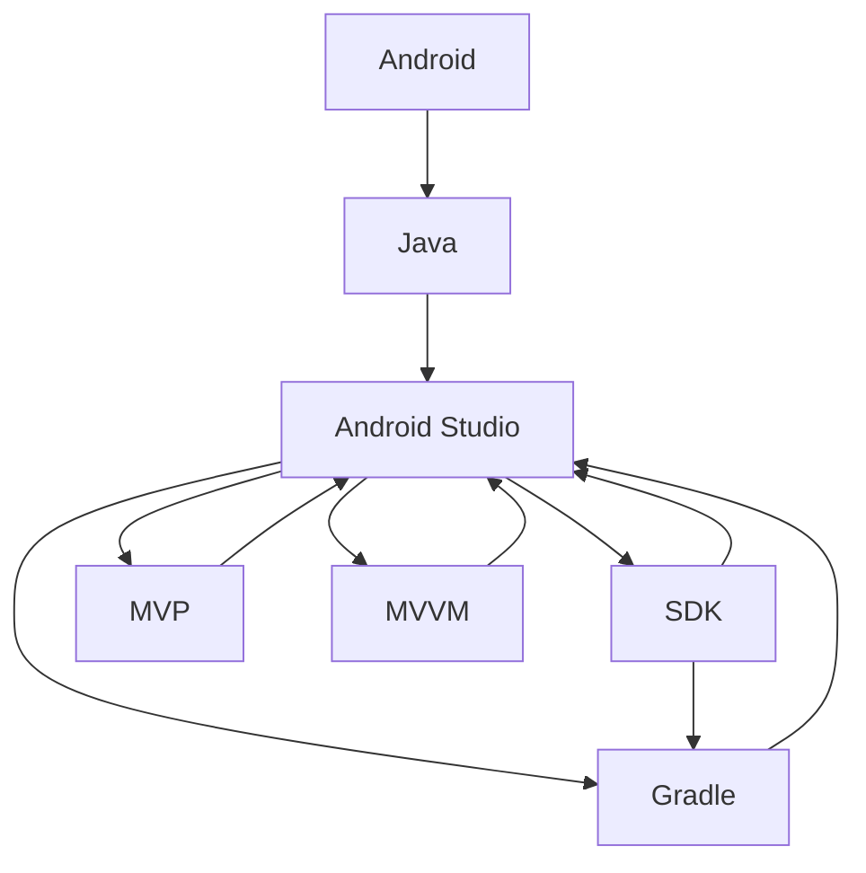

                 

# Android 开发入门：Java 和 Android Studio

> 关键词：Android, Java, Android Studio, 应用开发, 开发环境, 布局设计, UI 设计, 代码实现, 调试与测试, 性能优化

## 1. 背景介绍

### 1.1 问题由来

Android作为全球最大的移动操作系统之一，不仅在智能手机市场上占据了主导地位，还在车载、智能家居、可穿戴设备等多个领域有着广泛的应用。随着移动设备的多样化发展，Android系统已成为一个全方位、全生态的开放平台。而Android开发则成为了为该平台开发应用的关键技能之一。

### 1.2 问题核心关键点

Android开发的核心在于掌握Java编程语言和Android Studio开发工具。通过学习和实践这两个重要工具，开发者可以高效地构建出功能丰富、用户体验良好的Android应用。

Java作为Android开发的编程语言，拥有强大的跨平台特性和丰富的第三方库，是开发高效且稳定的应用的首选。而Android Studio则提供了统一的开发环境，集成了代码编辑、调试、测试、打包发布等一站式开发工具，简化了Android应用的开发流程。

掌握这两项技术，将为开发者提供坚实的技术基础，使他们能够快速进入Android应用开发的领域，并在此基础上不断拓展和创新。

## 2. 核心概念与联系

### 2.1 核心概念概述

为了更好地理解Android开发的流程和方法，本节将介绍几个关键概念及其联系：

- Android：谷歌推出的移动操作系统，广泛应用在各类移动设备上。
- Java：一种面向对象的程序设计语言，Android开发标准编程语言。
- Android Studio：Android官方提供的集成开发环境(IDE)，包含开发、调试、测试、发布等工具。
- SDK：软件开发工具包，包含Android应用开发所需的各种API和工具。
- Gradle：Android应用构建系统，用于自动化构建和管理Android项目。
- MVP、MVVM等架构模式：指导Android应用开发的最佳实践，有助于提高代码的可维护性和可扩展性。

这些概念构成了Android开发的基本框架，开发者在掌握它们的基础上，可以构建出既高效又易于维护的Android应用。

### 2.2 核心概念原理和架构的 Mermaid 流程图



这个流程图展示了Android开发的核心概念及其相互关系：

1. Android作为平台，为开发者提供了丰富的硬件资源和用户基础。
2. Java作为编程语言，为Android应用提供基础的代码实现。
3. Android Studio作为开发工具，为开发者提供了统一的开发环境。
4. SDK和Gradle为Android应用构建提供了必要的API和构建系统。
5. MVP和MVVM作为架构模式，为Android应用的开发提供了最佳实践指导。

## 3. 核心算法原理 & 具体操作步骤

### 3.1 算法原理概述

Android应用的开发通常遵循MVC（Model-View-Controller）框架，并在此基础上演变出MVP（Model-View-Presenter）和MVVM（Model-View-ViewModel）等架构模式。这些模式有助于将应用逻辑、用户界面和数据管理分开，使代码更加模块化、易于维护。

MVP模式将用户界面和数据管理分开，通过一个Presenter来协调两者之间的交互。MVVM模式则进一步引入了ViewModel，将数据模型和业务逻辑进一步分离，提高了应用的灵活性和可扩展性。

### 3.2 算法步骤详解

Android应用开发的算法步骤主要包括以下几个部分：

1. **项目初始化**：在Android Studio中创建一个新项目，选择合适的模板和项目配置。
2. **界面设计**：使用XML布局文件定义用户界面，或使用XML布局编辑器直观地设计界面。
3. **代码实现**：根据设计好的界面，编写Java或Kotlin代码实现对应的逻辑功能。
4. **调试与测试**：通过Android Studio的调试器和测试框架，进行单元测试和集成测试。
5. **发布与部署**：将项目打包成APK文件，并发布到Android Market或自定义的服务器上。

### 3.3 算法优缺点

MVP和MVVM等架构模式的主要优点包括：

- **代码分离**：将界面和逻辑分离，使得代码更加清晰、易于维护。
- **可扩展性**：模块化的架构设计，便于后期扩展和修改。
- **适应性**：针对不同的设备和屏幕大小，可以灵活调整布局和UI。

然而，这些架构模式也存在一些缺点：

- **学习曲线较陡**：初学Android开发的新手可能需要花费时间学习这些架构模式的设计思想。
- **开发效率低**：相比于原生Java代码实现，这些架构模式可能会增加一些额外的代码量。
- **性能开销**：在某些情况下，这些架构模式可能会引入一定的性能开销。

### 3.4 算法应用领域

MVP和MVVM等架构模式不仅适用于一般的Android应用开发，还可以应用于以下领域：

- **移动游戏开发**：将游戏逻辑和界面设计分离，使代码更加模块化和易于维护。
- **智能家居系统**：将设备控制和界面显示分离，使得不同设备的交互更加灵活和高效。
- **可穿戴设备应用**：将设备功能和界面设计分离，使应用在不同设备上的表现更加一致。
- **车载信息娱乐系统**：将系统功能和服务分离，使系统更易于升级和维护。

这些应用领域体现了MVP和MVVM架构模式的多样性和灵活性，也证明了其在实际开发中的广泛适用性。

## 4. 数学模型和公式 & 详细讲解 & 举例说明

### 4.1 数学模型构建

Android应用开发中，数学模型和公式的应用主要集中在用户界面的设计和计算上。例如，布局、动画、图形等都需要使用数学模型进行计算。

以布局为例，XML布局文件中可以使用数学表达式来设置布局的宽度、高度、位置等属性。例如：

```xml
<RelativeLayout
    android:layout_width="match_parent"
    android:layout_height="wrap_content"
    android:layout_centerHorizontal="true">
    <TextView
        android:layout_width="wrap_content"
        android:layout_height="wrap_content"
        android:layout_centerVertical="true"
        android:layout_width="80%dp"
        android:layout_height="100%dp"
        android:text="Hello World!" />
</RelativeLayout>
```

在上述代码中，使用`wrap_content`和`match_parent`来设置布局的大小，使用`layout_centerHorizontal`和`layout_centerVertical`来设置布局的位置。

### 4.2 公式推导过程

在Android应用开发中，常见的数学公式包括：

- 三角形面积公式：$S = \frac{1}{2} \times \text{底} \times \text{高}$
- 圆形面积公式：$S = \pi r^2$
- 矩形面积公式：$S = \text{长} \times \text{宽}$

以三角形面积公式为例，假设三角形的底为`a`，高为`h`，则三角形面积公式可以表示为：

$$ S = \frac{1}{2} \times a \times h $$

在Android应用中，可以使用`Math.abs()`函数来计算绝对值，使用`Math.min()`函数来计算两个数中的较小值。例如：

```java
double a = 10;
double h = 20;
double S = Math.abs(a * h) / 2;
```

### 4.3 案例分析与讲解

以一个简单的计算器应用为例，探讨如何使用数学模型和公式来实现基本的四则运算功能。

首先，定义一个布局文件`activity_main.xml`：

```xml
<LinearLayout xmlns:android="http://schemas.android.com/apk/res/android"
    xmlns:tools="http://schemas.android.com/tools"
    android:layout_width="match_parent"
    android:layout_height="match_parent"
    android:orientation="vertical"
    android:gravity="center"
    android:padding="16dp">

    <TextView
        android:id="@+id/input"
        android:layout_width="match_parent"
        android:layout_height="wrap_content"
        android:textSize="24sp" />

    <LinearLayout
        android:layout_width="match_parent"
        android:layout_height="wrap_content"
        android:orientation="horizontal"
        android:padding="8dp">

        <TextView
            android:id="@+id/number1"
            android:layout_width="0dp"
            android:layout_height="wrap_content"
            android:layout_weight="1" />
        <TextView
            android:id="@+id/number2"
            android:layout_width="0dp"
            android:layout_height="wrap_content"
            android:layout_weight="1" />
        <TextView
            android:id="@+id/operator"
            android:layout_width="0dp"
            android:layout_height="wrap_content"
            android:layout_weight="1" />
        <TextView
            android:id="@+id/result"
            android:layout_width="0dp"
            android:layout_height="wrap_content"
            android:layout_weight="1" />
    </LinearLayout>

    <Button
        android:id="@+id/clear"
        android:layout_width="match_parent"
        android:layout_height="wrap_content"
        android:text="C" />
    <Button
        android:id="@+id/percent"
        android:layout_width="match_parent"
        android:layout_height="wrap_content"
        android:text="%" />
    <Button
        android:id="@+id/equal"
        android:layout_width="match_parent"
        android:layout_height="wrap_content"
        android:text="=" />
</LinearLayout>
```

然后在Java代码中实现计算器功能：

```java
import android.os.Bundle;
import android.view.View;
import android.widget.Button;
import android.widget.TextView;
import androidx.appcompat.app.AppCompatActivity;

public class MainActivity extends AppCompatActivity {
    private TextView input;
    private TextView result;

    private Button[] buttons;

    @Override
    protected void onCreate(Bundle savedInstanceState) {
        super.onCreate(savedInstanceState);
        setContentView(R.layout.activity_main);

        input = findViewById(R.id.input);
        result = findViewById(R.id.result);
        buttons = new Button[]{ findViewById(R.id.number1), findViewById(R.id.number2), findViewById(R.id.operator), findViewById(R.id.percent), findViewById(R.id.clear), findViewById(R.id.equal) };

        for (Button button : buttons) {
            button.setOnClickListener(new View.OnClickListener() {
                @Override
                public void onClick(View v) {
                    String buttonText = v.getText().toString();
                    input.setText(input.getText() + buttonText);
                }
            });
        }
    }
}
```

在此基础上，添加四则运算的逻辑：

```java
public class MainActivity extends AppCompatActivity {
    private TextView input;
    private TextView result;

    private Button[] buttons;
    private double num1;
    private double num2;
    private char operator;

    @Override
    protected void onCreate(Bundle savedInstanceState) {
        super.onCreate(savedInstanceState);
        setContentView(R.layout.activity_main);

        input = findViewById(R.id.input);
        result = findViewById(R.id.result);
        buttons = new Button[]{ findViewById(R.id.number1), findViewById(R.id.number2), findViewById(R.id.operator), findViewById(R.id.percent), findViewById(R.id.clear), findViewById(R.id.equal) };

        for (Button button : buttons) {
            button.setOnClickListener(new View.OnClickListener() {
                @Override
                public void onClick(View v) {
                    String buttonText = v.getText().toString();
                    if (buttonText.equals("C")) {
                        input.setText("");
                        result.setText("");
                        num1 = 0;
                        num2 = 0;
                        operator = 0;
                    } else if (buttonText.equals("=")) {
                        double tempResult = 0;
                        switch (operator) {
                            case '+':
                                tempResult = num1 + num2;
                                break;
                            case '-':
                                tempResult = num1 - num2;
                                break;
                            case '*':
                                tempResult = num1 * num2;
                                break;
                            case '/':
                                tempResult = num1 / num2;
                                break;
                        }
                        result.setText(String.valueOf(tempResult));
                        num1 = 0;
                        num2 = 0;
                        operator = 0;
                    } else if (buttonText.equals("%")) {
                        if (operator == 0) {
                            input.setText(input.getText() + buttonText);
                        } else {
                            input.setText(input.getText() + buttonText);
                            operator = buttonText.charAt(0);
                        }
                    } else {
                        if (operator == 0) {
                            num1 = Double.parseDouble(input.getText().toString());
                            input.setText(buttonText);
                        } else {
                            num2 = Double.parseDouble(input.getText().toString());
                            input.setText(buttonText);
                        }
                    }
                }
            });
        }
    }
}
```

通过上述代码，可以实现简单的四则运算功能。在实际应用中，可能需要更复杂的算法和数据结构来实现更加复杂的运算逻辑。

## 5. 项目实践：代码实例和详细解释说明

### 5.1 开发环境搭建

在进行Android应用开发前，需要安装和配置Android Studio开发环境。

1. 下载并安装Android Studio：从官网下载最新版本，根据系统位数选择32位或64位版本。
2. 创建Android项目：在Android Studio中创建一个新项目，选择项目配置和模板。
3. 配置SDK：在Android Studio中配置Android SDK和AVD，以便进行模拟器开发和调试。

### 5.2 源代码详细实现

以下是一个简单的Android应用示例，展示如何使用Java编写布局、界面和代码逻辑：

```java
import android.os.Bundle;
import android.view.View;
import android.widget.Button;
import android.widget.TextView;
import androidx.appcompat.app.AppCompatActivity;

public class MainActivity extends AppCompatActivity {
    private TextView input;
    private TextView result;

    private Button[] buttons;

    @Override
    protected void onCreate(Bundle savedInstanceState) {
        super.onCreate(savedInstanceState);
        setContentView(R.layout.activity_main);

        input = findViewById(R.id.input);
        result = findViewById(R.id.result);
        buttons = new Button[]{ findViewById(R.id.number1), findViewById(R.id.number2), findViewById(R.id.operator), findViewById(R.id.percent), findViewById(R.id.clear), findViewById(R.id.equal) };

        for (Button button : buttons) {
            button.setOnClickListener(new View.OnClickListener() {
                @Override
                public void onClick(View v) {
                    String buttonText = v.getText().toString();
                    if (buttonText.equals("C")) {
                        input.setText("");
                        result.setText("");
                        num1 = 0;
                        num2 = 0;
                        operator = 0;
                    } else if (buttonText.equals("=")) {
                        double tempResult = 0;
                        switch (operator) {
                            case '+':
                                tempResult = num1 + num2;
                                break;
                            case '-':
                                tempResult = num1 - num2;
                                break;
                            case '*':
                                tempResult = num1 * num2;
                                break;
                            case '/':
                                tempResult = num1 / num2;
                                break;
                        }
                        result.setText(String.valueOf(tempResult));
                        num1 = 0;
                        num2 = 0;
                        operator = 0;
                    } else if (buttonText.equals("%")) {
                        if (operator == 0) {
                            input.setText(input.getText() + buttonText);
                        } else {
                            input.setText(input.getText() + buttonText);
                            operator = buttonText.charAt(0);
                        }
                    } else {
                        if (operator == 0) {
                            num1 = Double.parseDouble(input.getText().toString());
                            input.setText(buttonText);
                        } else {
                            num2 = Double.parseDouble(input.getText().toString());
                            input.setText(buttonText);
                        }
                    }
                }
            });
        }
    }
}
```

### 5.3 代码解读与分析

以下是对上述代码的解读和分析：

- 首先，定义了`input`和`result`两个TextView对象，分别用于显示用户输入和计算结果。
- 接着，定义了`buttons`数组，用于存储所有按钮对象。
- 在`onCreate`方法中，初始化这些对象，并通过循环为每个按钮添加点击事件处理程序。
- 在事件处理程序中，根据按钮文本进行不同的操作，包括清空输入和结果、计算结果、切换运算符、输入数字和百分比等。
- 最后，通过switch语句根据不同的运算符计算结果，并更新结果显示。

通过上述代码，可以完成一个简单的计算器功能，并根据用户输入的不同数字和运算符，进行相应的计算和显示。

### 5.4 运行结果展示

运行上述代码，即可在模拟器或真机上看到一个简单的计算器应用。用户可以通过点击数字、运算符和清除按钮，输入计算表达式，并得到对应的计算结果。

## 6. 实际应用场景

### 6.1 智能家居系统

在智能家居系统中，Android应用可以用于控制各类智能设备，如智能灯、智能锁、智能音箱等。通过Android Studio开发工具，可以快速搭建出用户界面，实现对设备的控制和交互。

### 6.2 车载信息娱乐系统

车载信息娱乐系统需要实时响应驾驶员的指令，并能够根据不同的驾驶场景调整显示内容。通过Android Studio开发工具，可以高效地实现这些功能，提高驾驶的便捷性和安全性。

### 6.3 可穿戴设备应用

可穿戴设备如智能手表、智能眼镜等，需要轻量级且高效的Android应用来提供服务。通过Android Studio开发工具，可以优化代码，减少设备资源占用，提高应用的运行效率。

### 6.4 未来应用展望

随着Android系统的不断升级和演进，Android应用开发将具备更多智能化的特性，如实时语音识别、图像处理、增强现实等。通过Android Studio开发工具，开发者可以更便捷地实现这些功能，使应用更加智能化和人性化。

## 7. 工具和资源推荐

### 7.1 学习资源推荐

为了帮助开发者系统掌握Android开发技术，这里推荐一些优质的学习资源：

1. Android官方文档：Android官方提供的权威文档，包含详细的使用指南和技术参考。
2. 《Android开发实战》：一本经典的Android开发书籍，涵盖Android开发的各个方面。
3. Android开发者社区：Android开发者社区，提供丰富的技术文章和经验分享，是学习Android开发的好去处。
4. Udacity Android开发者课程：Udacity提供的Android开发者课程，适合初学者和进阶开发者。
5. Coursera Android应用开发课程：Coursera提供的Android应用开发课程，由斯坦福大学教授主讲。

通过这些学习资源，可以系统地掌握Android开发技术，并不断提升自己的技能水平。

### 7.2 开发工具推荐

为了提高Android应用开发的效率和质量，以下推荐几款常用的开发工具：

1. Android Studio：Android官方提供的集成开发环境(IDE)，支持代码编辑、调试、测试、发布等功能。
2. IntelliJ IDEA：一款强大的Java开发工具，支持Android应用开发和项目管理。
3. Gradle：Android应用构建系统，用于自动化构建和管理Android项目。
4. Git：版本控制系统，用于代码管理和协作开发。
5. Maven：构建管理工具，用于依赖管理和打包构建。

合理利用这些工具，可以显著提高Android应用开发的效率和质量，减少开发成本。

### 7.3 相关论文推荐

Android应用开发的研究方向和前沿技术不断发展，以下推荐几篇相关论文，帮助开发者了解最新的技术趋势：

1. Android 13: New Features and APIs：谷歌发布的Android 13版本的特性和API介绍。
2. Android Development Guide: Building applications on Android：Android官方提供的开发指南，详细介绍了Android应用开发的各个方面。
3. Android Architecture Patterns: MVP, MVVM, and More：深入探讨了Android应用开发中的架构模式，如MVP、MVVM等。

通过这些论文，可以了解Android应用的最新技术和最佳实践，提升开发水平。

## 8. 总结：未来发展趋势与挑战

### 8.1 研究成果总结

Android应用开发在过去几年中取得了显著进展，通过Android Studio等工具的不断优化和更新，开发效率和质量都有了明显提升。Android应用的开发模式、架构模式和技术栈也在不断演进，帮助开发者构建出更加高效、稳定的应用。

### 8.2 未来发展趋势

展望未来，Android应用开发将呈现以下几个趋势：

1. **智能化**：越来越多的智能功能将集成到Android应用中，如语音识别、图像处理、增强现实等。
2. **可扩展性**：通过模块化的设计和架构模式，Android应用将更加灵活和可扩展。
3. **实时性**：Android应用将需要更高的实时性和响应速度，以支持实时交互和多任务处理。
4. **跨平台**：Android应用将逐步支持跨平台开发，实现跨设备、跨平台的一致体验。
5. **安全性和隐私**：Android应用需要更高的安全性和隐私保护，确保用户数据的安全性。

### 8.3 面临的挑战

尽管Android应用开发取得了诸多进展，但仍面临一些挑战：

1. **学习曲线**：Android应用的开发模式和架构模式相对复杂，初学者需要花费时间学习和掌握。
2. **性能优化**：在高度并发和多任务处理的场景下，Android应用需要更高的性能优化。
3. **跨设备兼容性**：不同设备和系统的兼容性问题需要得到更好的解决。
4. **开发者工具不足**：部分开发者工具和资源相对较少，限制了开发效率和质量。
5. **更新和维护**：Android系统的更新和维护速度较快，开发者需要不断跟进最新的技术变化。

### 8.4 研究展望

未来的Android应用开发需要从以下几个方面进行研究：

1. **智能化应用**：进一步探索智能语音、图像处理、增强现实等技术，提升应用智能化水平。
2. **跨平台开发**：探索和实现跨平台开发技术，提高开发效率和应用兼容性。
3. **实时性和性能优化**：研究和应用最新的高性能优化技术，提升应用的实时性和响应速度。
4. **安全性和隐私保护**：进一步提升应用的安全性和隐私保护，确保用户数据的安全性。

通过不断探索和优化，Android应用开发将迎来更多新的可能性，为Android系统的生态发展注入新的活力。

## 9. 附录：常见问题与解答

**Q1: 如何使用Android Studio创建新的Android项目？**

A: 在Android Studio中，可以通过以下步骤创建新的Android项目：

1. 打开Android Studio，选择“Start a new Android Studio project”。
2. 输入项目名称和保存路径，选择“Empty Activity”模板。
3. 点击“Finish”，创建新的项目。

**Q2: 如何在Android Studio中调试Android应用？**

A: 在Android Studio中，可以通过以下步骤进行Android应用的调试：

1. 连接模拟器或真机，点击“Debug”按钮。
2. 设置断点和调试点，运行应用程序。
3. 调试器会自动停止在断点处，可以通过变量查看、单步调试等方式进行调试。

**Q3: 如何使用Gradle进行Android项目构建？**

A: 在Android Studio中，可以通过以下步骤使用Gradle进行Android项目构建：

1. 在项目根目录中，打开`build.gradle`文件。
2. 修改`buildTypes`、`defaultConfig`等配置信息，添加依赖库等。
3. 点击“Sync Now”按钮，Gradle会自动构建项目。

**Q4: 如何在Android应用中使用MVP架构模式？**

A: 在Android应用中，可以使用以下步骤实现MVP架构模式：

1. 定义Model、View和Presenter类。
2. 在View类中定义UI布局和显示逻辑。
3. 在Presenter类中定义业务逻辑和数据处理。
4. 在View中创建Presenter对象，并将数据传递给Presenter进行处理。
5. 在Presenter中处理数据后，更新View显示结果。

通过以上步骤，可以高效地实现MVP架构模式，提升应用的可维护性和可扩展性。

---

作者：禅与计算机程序设计艺术 / Zen and the Art of Computer Programming

