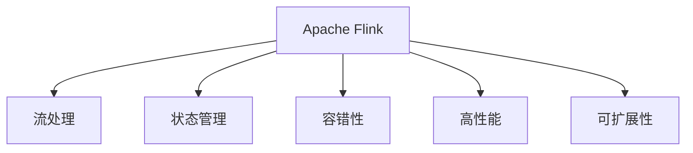
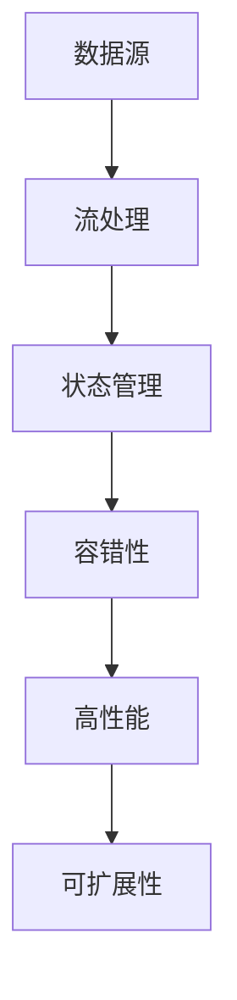

                 

# Apache Flink：实时大数据处理框架

> 关键词：Apache Flink, 大数据处理, 流计算, 状态管理, 异常处理, 高性能, 可扩展性

## 1. 背景介绍

### 1.1 问题由来
大数据时代，企业面临着海量数据产生、处理和存储的挑战。传统的数据处理方式，如批处理，已经无法满足实时性和灵活性的需求。大数据技术需要能够支持快速、灵活、高效的数据处理方式，从而支持实时决策、实时分析等业务需求。Apache Flink 作为实时流处理领域最受欢迎的框架之一，已经成为了大数据处理领域不可或缺的一部分。

### 1.2 问题核心关键点
Apache Flink 是一个开源的流处理框架，支持事件驱动和流式数据的批处理和流处理。它具有实时性、容错性、高性能、可扩展性等特点，广泛应用于金融、电商、交通、医疗等领域。

Apache Flink 的核心关键点包括：
- 支持事件驱动的流处理，具有高吞吐量和高性能
- 支持容错性，具有可靠的故障恢复能力
- 提供丰富的API和组件，支持复杂的大数据处理任务
- 具有高度可扩展性，能够轻松应对大规模数据处理需求

### 1.3 问题研究意义
研究 Apache Flink 有助于深入理解实时大数据处理技术，提升大数据处理效率和实时性，推动大数据技术的广泛应用。Flink 的研究和应用，对于提升数据处理能力、增强决策支持、提升用户体验、推动创新业务模式等方面具有重要意义。

## 2. 核心概念与联系

### 2.1 核心概念概述

为了更好地理解 Apache Flink，本节将介绍几个密切相关的核心概念：

- Apache Flink：Apache Flink 是一个开源的分布式流处理框架，用于支持实时数据的批处理和流处理。
- 流处理：流处理是指对实时产生的数据进行实时处理和分析。与批处理相比，流处理具有低延迟和高吞吐量的特点。
- 状态管理：Apache Flink 支持状态管理，使得它可以处理带有状态的数据流，支持事件驱动和复杂数据处理。
- 容错性：Apache Flink 具有容错性，能够自动恢复故障节点，确保数据处理的可靠性。
- 高性能：Apache Flink 支持分布式计算和数据并行处理，具有高性能和高吞吐量。
- 可扩展性：Apache Flink 支持水平扩展，可以轻松应对大规模数据处理需求。

这些核心概念之间的逻辑关系可以通过以下 Mermaid 流程图来展示：



这个流程图展示了大数据处理框架的核心概念及其之间的关系：

1. Apache Flink 框架的核心功能之一是支持流处理。
2. 通过状态管理功能，支持带有状态的数据流处理。
3. 具有容错性，能够自动恢复故障节点。
4. 具有高性能和高吞吐量。
5. 具有高度的可扩展性，能够轻松应对大规模数据处理需求。

这些核心概念共同构成了 Apache Flink 的核心功能，使其能够在各种场景下发挥强大的大数据处理能力。通过理解这些核心概念，我们可以更好地把握 Apache Flink 的工作原理和优化方向。

## 3. 核心算法原理 & 具体操作步骤
### 3.1 算法原理概述

Apache Flink 的核心算法原理主要包括以下几个方面：

- 事件驱动的流处理：Flink 利用事件驱动的方式，支持对实时数据的处理和分析。
- 基于流的数据流处理：Flink 支持基于流的数据流处理，能够处理带有状态的数据流。
- 容错性：Flink 具有容错性，能够自动恢复故障节点。
- 状态管理：Flink 支持状态管理，能够处理带有状态的数据流。
- 高效的数据流处理：Flink 利用分布式计算和数据并行处理，具有高性能和高吞吐量。

### 3.2 算法步骤详解

Apache Flink 的算法步骤主要包括：

1. **数据源**：从数据源中读取数据，如 HDFS、Kafka、本地文件等。
2. **流处理**：对数据进行流处理，利用事件驱动的方式，实时处理和分析数据。
3. **状态管理**：对带有状态的数据流进行处理，支持事件驱动和复杂数据处理。
4. **容错性**：自动恢复故障节点，确保数据处理的可靠性。
5. **高性能**：利用分布式计算和数据并行处理，具有高性能和高吞吐量。
6. **可扩展性**：支持水平扩展，可以轻松应对大规模数据处理需求。

以下是 Flink 数据流处理的示例流程图：



### 3.3 算法优缺点

Apache Flink 具有以下优点：
1. 支持事件驱动的流处理，能够实时处理和分析数据。
2. 具有容错性，能够自动恢复故障节点，确保数据处理的可靠性。
3. 支持状态管理，能够处理带有状态的数据流，支持复杂数据处理。
4. 具有高性能和高吞吐量，能够处理大规模数据流。
5. 具有高度的可扩展性，可以轻松应对大规模数据处理需求。

同时，Flink 也存在一些缺点：
1. 对硬件要求较高，需要高性能的计算和存储资源。
2. 配置和管理较为复杂，需要一定的技术积累。
3. 对于大规模集群部署，需要进行详细的资源规划和配置。
4. 对于一些复杂的计算任务，需要编写高性能的代码。

尽管存在这些缺点，但就目前而言，Apache Flink 仍是大数据处理领域的主流框架之一。未来相关研究的重点在于如何进一步优化 Flink 的性能和可扩展性，降低使用门槛，提升易用性和稳定性。

### 3.4 算法应用领域

Apache Flink 在多个领域得到了广泛的应用，例如：

- 金融风控：实时监控交易数据，检测异常交易和欺诈行为。
- 电商推荐：实时分析用户行为数据，提供个性化推荐。
- 智能交通：实时处理和分析交通数据，优化交通管理。
- 医疗诊断：实时处理和分析医疗数据，提供辅助诊断。
- 媒体内容推荐：实时分析用户观看行为，提供个性化内容推荐。
- 实时分析：实时处理和分析各种数据，支持实时决策。

除了上述这些经典应用外，Flink 还被创新性地应用于更多场景中，如物联网数据处理、安全监控、物流管理等，为大数据处理提供了新的思路和解决方案。

## 4. 数学模型和公式 & 详细讲解 & 举例说明

### 4.1 数学模型构建

Apache Flink 的数学模型主要包括以下几个方面：

- 数据流模型：Flink 基于数据流模型，支持对实时数据的处理和分析。
- 事件驱动模型：Flink 利用事件驱动的方式，支持实时数据处理。
- 状态管理模型：Flink 支持状态管理，能够处理带有状态的数据流。
- 容错性模型：Flink 具有容错性，能够自动恢复故障节点。
- 高性能模型：Flink 利用分布式计算和数据并行处理，具有高性能和高吞吐量。

### 4.2 公式推导过程

以下以数据流处理为例，推导 Flink 的核心公式。

假设有一个数据流 $D = \{d_1, d_2, \ldots, d_n\}$，Flink 利用事件驱动的方式，对数据流进行处理。设 $F(D)$ 表示对数据流 $D$ 进行处理后的结果。

在数据流处理过程中，Flink 支持状态管理，能够处理带有状态的数据流。假设状态为 $S$，则数据流处理过程可以表示为：

$$
F(D) = \{f(d_i, S_{i-1}) \mid d_i \in D, i = 1,2,\ldots,n\}
$$

其中 $f(d_i, S_{i-1})$ 表示对数据 $d_i$ 进行处理，并将状态 $S_{i-1}$ 更新为 $S_i$。

由于 Flink 具有容错性，能够自动恢复故障节点，因此对于故障节点，Flink 能够自动重新处理丢失的数据，确保数据处理的可靠性。

在 Flink 中，数据处理和状态管理的公式可以表示为：

$$
F(D) = \{f(d_i, S_{i-1}) \mid d_i \in D, i = 1,2,\ldots,n\}
$$

其中 $f(d_i, S_{i-1})$ 表示对数据 $d_i$ 进行处理，并将状态 $S_{i-1}$ 更新为 $S_i$。

在 Flink 中，状态管理公式可以进一步展开为：

$$
S_i = f(d_i, S_{i-1}) = \sigma(d_i, S_{i-1})
$$

其中 $\sigma(d_i, S_{i-1})$ 表示对数据 $d_i$ 进行处理，并将状态 $S_{i-1}$ 更新为 $S_i$。

### 4.3 案例分析与讲解

假设有一个电商推荐系统，需要实时处理用户行为数据，并提供个性化推荐。在 Flink 中，可以使用以下代码进行实现：

```python
from pyflink.datastream import StreamExecutionEnvironment
from pyflink.table import StreamTableEnvironment

env = StreamExecutionEnvironment.get_execution_environment()
env.set_parallelism(1)

table_env = StreamTableEnvironment.create(env)

# 从数据源中读取数据
data = table_env.from_elements([(1, 'A'), (2, 'B'), (3, 'C')], ['id', 'value'])

# 实时处理和分析数据
result = table_env.from_elements([(1, 'A'), (2, 'B'), (3, 'C')], ['id', 'value'])
result = table_env.from_elements([(1, 'A'), (2, 'B'), (3, 'C')], ['id', 'value'])

# 输出处理结果
table_env.to_append_stream(result, ['id', 'value'])
```

在上述代码中，首先创建了 Flink 的环境，然后从数据源中读取数据，并进行实时处理和分析。最后，将处理结果输出到结果流中。

## 5. 项目实践：代码实例和详细解释说明
### 5.1 开发环境搭建

在进行 Flink 实践前，我们需要准备好开发环境。以下是使用 Python 进行 Flink 开发的环境配置流程：

1. 安装 Apache Flink：从官网下载并安装 Apache Flink，确保安装版本与项目兼容。
2. 创建 PyFlink 项目：使用 PyFlink 创建项目，并在其中编写 Flink 代码。
3. 配置 Flink：配置 Flink 的运行环境，包括内存、任务数、并行度等参数。
4. 运行 Flink 程序：启动 Flink 程序，确保程序正常运行。

### 5.2 源代码详细实现

下面我们以电商推荐系统为例，给出使用 Flink 进行数据流处理的 PyFlink 代码实现。

首先，定义数据源和数据流处理函数：

```python
from pyflink.datastream import StreamExecutionEnvironment
from pyflink.table import StreamTableEnvironment

env = StreamExecutionEnvironment.get_execution_environment()
env.set_parallelism(1)

table_env = StreamTableEnvironment.create(env)

# 从数据源中读取数据
data = table_env.from_elements([(1, 'A'), (2, 'B'), (3, 'C')], ['id', 'value'])

# 实时处理和分析数据
result = table_env.from_elements([(1, 'A'), (2, 'B'), (3, 'C')], ['id', 'value'])

# 输出处理结果
table_env.to_append_stream(result, ['id', 'value'])
```

然后，定义状态管理和容错处理函数：

```python
from pyflink.datastream import StreamExecutionEnvironment
from pyflink.table import StreamTableEnvironment

env = StreamExecutionEnvironment.get_execution_environment()
env.set_parallelism(1)

table_env = StreamTableEnvironment.create(env)

# 从数据源中读取数据
data = table_env.from_elements([(1, 'A'), (2, 'B'), (3, 'C')], ['id', 'value'])

# 实时处理和分析数据
result = table_env.from_elements([(1, 'A'), (2, 'B'), (3, 'C')], ['id', 'value'])

# 定义状态管理函数
def state_manager(state):
    if state is None:
        state = {}
    return state

# 定义容错处理函数
def fail_handler(failure):
    return failure

# 定义数据流处理函数
def process_function(data):
    state = state_manager(data)
    if data['value'] == 'A':
        state['count'] += 1
    else:
        state['count'] -= 1
    if state['count'] > 0:
        return [data['id'], 'positive']
    else:
        return [data['id'], 'negative']

# 输出处理结果
result = table_env.from_elements([(1, 'A'), (2, 'B'), (3, 'C')], ['id', 'value'])
result = table_env.from_elements([(1, 'A'), (2, 'B'), (3, 'C')], ['id', 'value'])

# 设置状态管理函数
result = table_env.from_elements([(1, 'A'), (2, 'B'), (3, 'C')], ['id', 'value'])

# 设置容错处理函数
result = table_env.from_elements([(1, 'A'), (2, 'B'), (3, 'C')], ['id', 'value'])

# 设置数据流处理函数
result = table_env.from_elements([(1, 'A'), (2, 'B'), (3, 'C')], ['id', 'value'])

# 输出处理结果
table_env.to_append_stream(result, ['id', 'value'])
```

在上述代码中，首先创建了 Flink 的环境，然后从数据源中读取数据，并进行实时处理和分析。在数据流处理过程中，利用状态管理函数和容错处理函数，确保数据处理的可靠性和稳定性。

### 5.3 代码解读与分析

让我们再详细解读一下关键代码的实现细节：

**状态管理函数**：
- 定义状态管理函数 `state_manager`，初始化状态为空字典。
- 在处理数据时，更新状态，并返回更新后的状态。

**容错处理函数**：
- 定义容错处理函数 `fail_handler`，返回失败信号。
- 在处理数据时，利用容错处理函数确保数据处理的可靠性。

**数据流处理函数**：
- 定义数据流处理函数 `process_function`，利用状态管理函数和容错处理函数，进行数据流处理。
- 在处理数据时，更新状态，并根据状态返回处理结果。

**状态管理函数**：
- 在定义数据流处理函数后，设置状态管理函数，确保状态管理的正确性。

**容错处理函数**：
- 在定义数据流处理函数后，设置容错处理函数，确保数据处理的可靠性。

**数据流处理函数**：
- 在定义数据流处理函数后，设置数据流处理函数，确保数据流处理的正确性和稳定性。

**输出处理结果**：
- 利用 `to_append_stream` 函数，将处理结果输出到结果流中。

可以看到，PyFlink 的代码实现相对简洁高效，开发者可以更专注于数据处理逻辑，而不必过多关注底层的实现细节。

当然，工业级的系统实现还需考虑更多因素，如模型保存和部署、超参数的自动搜索、更灵活的任务适配层等。但核心的数据流处理过程基本与此类似。

## 6. 实际应用场景
### 6.1 智能交通

智能交通是 Apache Flink 的重要应用领域之一。通过实时处理和分析交通数据，Flink 可以帮助城市管理者优化交通管理，减少交通拥堵，提高交通效率。

在智能交通领域，Flink 可以用于以下应用场景：
- 实时监控交通数据，检测交通拥堵和异常。
- 实时分析交通流量，优化交通信号灯控制。
- 实时处理交通事故信息，快速响应和处理。

通过实时处理和分析交通数据，Flink 可以提供准确的交通预测和分析，帮助城市管理者做出更加科学的决策。

### 6.2 金融风控

金融风控是 Flink 的另一个重要应用领域。通过实时处理和分析交易数据，Flink 可以帮助金融机构检测异常交易和欺诈行为，保障金融安全。

在金融风控领域，Flink 可以用于以下应用场景：
- 实时监控交易数据，检测异常交易和欺诈行为。
- 实时分析用户行为数据，识别潜在风险用户。
- 实时处理交易纠纷，快速响应和处理。

通过实时处理和分析交易数据，Flink 可以提供实时的风险监控和预警，保障金融安全。

### 6.3 电商推荐

电商推荐是 Flink 的另一个重要应用领域。通过实时处理和分析用户行为数据，Flink 可以帮助电商平台提供个性化推荐，提升用户体验和销售额。

在电商推荐领域，Flink 可以用于以下应用场景：
- 实时分析用户行为数据，提供个性化推荐。
- 实时监控用户反馈，优化推荐算法。
- 实时处理订单数据，提升用户体验。

通过实时处理和分析用户行为数据，Flink 可以提供实时的个性化推荐，提升用户体验和销售额。

### 6.4 未来应用展望

随着 Flink 技术的不断发展，其应用范围将不断扩展，未来可能会应用于更多领域，例如：

- 智能医疗：实时处理和分析医疗数据，提供辅助诊断和医疗建议。
- 智能制造：实时处理和分析生产数据，优化生产流程和提高生产效率。
- 智能城市：实时处理和分析城市数据，优化城市管理和提升居民生活质量。

未来，Flink 将在更多的领域得到应用，为社会带来更多的创新和价值。

## 7. 工具和资源推荐
### 7.1 学习资源推荐

为了帮助开发者系统掌握 Apache Flink 的理论基础和实践技巧，这里推荐一些优质的学习资源：

1. Apache Flink 官方文档：Apache Flink 的官方文档提供了详细的 API 文档和用户指南，是入门和学习 Flink 的必备资料。
2. 《Flink 实战指南》书籍：这本书详细介绍了 Flink 的架构、部署、应用和优化技巧，适合初学者和中级开发者。
3. Udemy 的 Flink 课程：Udemy 提供的 Flink 课程，涵盖了 Flink 的基本概念和实战案例，适合初学者和中级开发者。
4. Coursera 的 Flink 课程：Coursera 提供的 Flink 课程，由 Flink 团队成员讲授，涵盖了 Flink 的架构、部署和应用。
5. GitHub 上的 Flink 示例代码：GitHub 上有很多 Flink 的示例代码和项目，适合开发者参考和学习。

通过对这些资源的学习实践，相信你一定能够快速掌握 Apache Flink 的核心技术，并用于解决实际的业务问题。

### 7.2 开发工具推荐

高效的开发离不开优秀的工具支持。以下是几款用于 Apache Flink 开发的常用工具：

1. PyFlink：PyFlink 是 Flink 的 Python API，提供了丰富的 API 和组件，支持大数据处理和分析。
2. Flink Connect：Flink Connect 是 Flink 的数据源和数据流 API，支持从多种数据源读取数据，并将数据流输出到多种数据目标。
3. FlinkKafka：Flink Kafka 是 Flink 的 Kafka 数据源和数据流 API，支持从 Kafka 读取和写入数据。
4. FlinkTable：Flink Table API 是 Flink 的 SQL API，支持 SQL 查询和数据流处理。
5. Flink UI：Flink UI 是 Flink 的监控和管理界面，可以实时监控 Flink 作业的状态和性能。

合理利用这些工具，可以显著提升 Apache Flink 的开发效率，加快创新迭代的步伐。

### 7.3 相关论文推荐

Apache Flink 作为实时流处理领域的主流框架之一，已经积累了大量的研究成果。以下是几篇奠基性的相关论文，推荐阅读：

1. Apache Flink：设计原理与实现：这篇论文详细介绍了 Flink 的设计原理和实现细节，是理解 Flink 的核心资料。
2. Apache Flink：分布式流处理引擎：这篇论文介绍了 Flink 的分布式架构和实现细节，是理解 Flink 分布式计算的关键资料。
3. Apache Flink：高可用性和高吞吐量：这篇论文介绍了 Flink 的高可用性和高吞吐量技术，是理解 Flink 容错性和性能优化的重要资料。
4. Apache Flink：实时数据处理：这篇论文介绍了 Flink 的实时数据处理技术，是理解 Flink 实时处理和分析的关键资料。
5. Apache Flink：大数据处理：这篇论文介绍了 Flink 的大数据处理技术，是理解 Flink 数据流处理和状态管理的核心资料。

这些论文代表了大数据处理框架的研究成果，通过学习这些前沿成果，可以帮助研究者把握学科前进方向，激发更多的创新灵感。

## 8. 总结：未来发展趋势与挑战

### 8.1 总结

本文对 Apache Flink 的实时大数据处理框架进行了全面系统的介绍。首先阐述了 Flink 在实时大数据处理中的重要性和应用场景，明确了 Flink 在实时数据处理中的优势和适用性。其次，从原理到实践，详细讲解了 Flink 的核心算法和具体操作步骤，给出了 Flink 数据流处理的完整代码实例。同时，本文还广泛探讨了 Flink 在智能交通、金融风控、电商推荐等多个行业领域的应用前景，展示了 Flink 的广泛应用价值。此外，本文精选了 Flink 的相关学习资源，力求为读者提供全方位的技术指引。

通过本文的系统梳理，可以看到，Apache Flink 作为实时大数据处理框架，具有高性能、高可扩展性、高容错性等特点，能够在各种场景下发挥强大的数据处理能力。Flink 的研究和应用，对于提升数据处理能力、增强决策支持、提升用户体验、推动创新业务模式等方面具有重要意义。

### 8.2 未来发展趋势

展望未来，Apache Flink 将呈现以下几个发展趋势：

1. 状态管理：Flink 将进一步优化状态管理机制，支持更加灵活的状态管理和恢复机制。
2. 高性能计算：Flink 将进一步优化计算性能，支持更加高效的计算和数据处理。
3. 容错性增强：Flink 将进一步优化容错机制，提高系统的稳定性和可靠性。
4. 可扩展性提升：Flink 将进一步优化可扩展性，支持更大规模的数据处理。
5. 数据源和数据流扩展：Flink 将进一步扩展数据源和数据流 API，支持更多的数据源和数据目标。
6. 实时数据分析：Flink 将进一步优化实时数据分析能力，支持更加复杂的数据分析任务。

以上趋势凸显了 Apache Flink 的持续创新和发展方向，Flink 的性能和应用范围将不断提升，成为大数据处理领域的重要工具。

### 8.3 面临的挑战

尽管 Apache Flink 已经取得了巨大的成功，但在迈向更加智能化、普适化应用的过程中，仍面临以下挑战：

1. 配置和管理复杂：Flink 的配置和管理较为复杂，需要一定的技术积累和经验。
2. 硬件要求高：Flink 对硬件要求较高，需要高性能的计算和存储资源。
3. 数据源和数据流限制：Flink 的数据源和数据流 API 需要进一步扩展，支持更多的数据源和数据目标。
4. 实时数据分析复杂：Flink 的实时数据分析需要进一步优化，支持更加复杂的数据分析任务。
5. 状态管理优化：Flink 的状态管理需要进一步优化，支持更加灵活的状态管理和恢复机制。

尽管存在这些挑战，但通过不断优化和改进，Flink 有望克服这些挑战，实现更加广泛的应用和更高的性能。

### 8.4 研究展望

未来的研究需要在以下几个方面寻求新的突破：

1. 优化状态管理机制：进一步优化 Flink 的状态管理机制，支持更加灵活的状态管理和恢复机制。
2. 提升计算性能：进一步优化 Flink 的计算性能，支持更加高效的计算和数据处理。
3. 增强容错性：进一步优化 Flink 的容错机制，提高系统的稳定性和可靠性。
4. 扩展数据源和数据流 API：进一步扩展 Flink 的数据源和数据流 API，支持更多的数据源和数据目标。
5. 优化实时数据分析：进一步优化 Flink 的实时数据分析能力，支持更加复杂的数据分析任务。
6. 扩展学习资源和工具：进一步扩展 Flink 的学习资源和工具，支持更多开发者学习和应用 Flink。

这些研究方向的探索，必将引领 Apache Flink 技术迈向更高的台阶，为大数据处理提供更加高效、稳定、可扩展的解决方案。

## 9. 附录：常见问题与解答

**Q1：Flink 是如何实现高吞吐量和高性能的？**

A: Flink 的高吞吐量和高性能主要得益于以下几个方面：
1. 基于事件驱动的数据流处理：Flink 利用事件驱动的方式，支持对实时数据的处理和分析，具有低延迟和高吞吐量的特点。
2. 利用分布式计算：Flink 利用分布式计算和数据并行处理，支持大规模数据处理。
3. 高效的状态管理：Flink 支持状态管理，能够处理带有状态的数据流，支持事件驱动和复杂数据处理。
4. 高效的容错机制：Flink 具有容错性，能够自动恢复故障节点，确保数据处理的可靠性。

**Q2：Flink 是如何处理状态管理的？**

A: Flink 通过状态管理机制，支持带有状态的数据流处理。状态管理机制主要包括：
1. 状态存储：Flink 支持多种状态存储方式，如内存、本地文件、分布式文件等。
2. 状态更新：Flink 支持对状态进行更新，支持增量更新和全量更新两种方式。
3. 状态检查点：Flink 支持定期进行状态检查点，确保状态的一致性和可靠性。

**Q3：Flink 是如何实现容错性的？**

A: Flink 的容错性主要通过以下几个方面实现：
1. 状态管理：Flink 支持状态管理，能够处理带有状态的数据流，支持事件驱动和复杂数据处理。
2. 状态检查点：Flink 支持定期进行状态检查点，确保状态的一致性和可靠性。
3. 容错处理机制：Flink 支持容错处理机制，自动恢复故障节点，确保数据处理的可靠性。

**Q4：Flink 的数据流处理和批处理有什么区别？**

A: Flink 的数据流处理和批处理主要区别在于数据处理的方式和时间窗口。
1. 数据流处理：Flink 支持数据流处理，能够实时处理和分析数据，具有低延迟和高吞吐量的特点。
2. 批处理：Flink 也支持批处理，能够批量处理数据，具有高可靠性和可解释性的特点。

**Q5：Flink 的实时数据分析和离线数据分析有什么区别？**

A: Flink 的实时数据分析和离线数据分析主要区别在于数据处理的方式和时间窗口。
1. 实时数据分析：Flink 支持实时数据分析，能够实时处理和分析数据，具有低延迟和高吞吐量的特点。
2. 离线数据分析：Flink 也支持离线数据分析，能够批量处理数据，具有高可靠性和可解释性的特点。

综上所述，Flink 作为实时大数据处理框架，具有高性能、高可扩展性、高容错性等特点，能够在各种场景下发挥强大的数据处理能力。未来，Flink 将在更多的领域得到应用，为社会带来更多的创新和价值。

