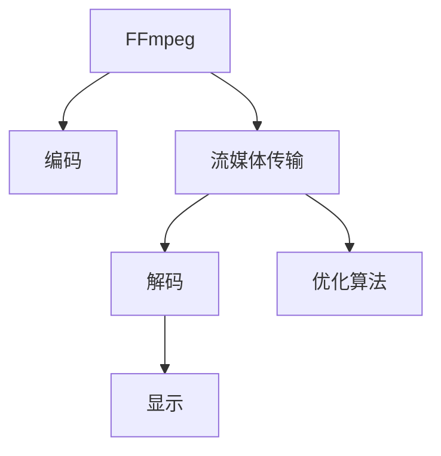

                 

# FFmpeg 在 VR 中的应用：编码和流媒体的结合

> 关键词：VR, 流媒体, 编码, FFmpeg, H.265, GPU加速, 高分辨率, 低延迟

## 1. 背景介绍

随着虚拟现实(VR)技术的日渐成熟，越来越多的应用场景需要高质量的流媒体传输。然而，高质量的流媒体不仅需要高速的网络和强大的计算能力，还需要高效的编码和流媒体传输技术。本文将探讨FFmpeg在VR流媒体中的应用，重点分析其编码和流媒体的结合，并详细介绍其核心算法和实现方法。

## 2. 核心概念与联系

### 2.1 核心概念概述

- **FFmpeg**：是一个开源的跨平台多媒体框架，支持各种视频编解码和流媒体传输。
- **VR流媒体**：指在虚拟现实环境中，对三维视频、音频等多媒体内容进行高质量、低延迟的流式传输。
- **编码**：指将多媒体内容转换为适合网络传输的压缩格式。
- **流媒体**：指对多媒体内容进行实时传输，让接收端能够边接收边播放。

### 2.2 核心概念原理和架构的 Mermaid 流程图



## 3. 核心算法原理 & 具体操作步骤

### 3.1 算法原理概述

FFmpeg在VR流媒体中的应用主要涉及两个核心算法：**编码**和**流媒体传输**。编码算法将原始多媒体内容压缩为适合传输的格式，流媒体传输算法将编码后的数据实时传输到接收端，并进行解码和播放。

### 3.2 算法步骤详解

#### 3.2.1 编码步骤

1. **选择合适的编码格式**：对于VR应用，需要选择合适的视频编码格式。当前常用的编码格式包括H.265/HEVC、H.264/AVC、VP9等。H.265相比于H.264具有更高的压缩比和更好的低延迟性能，适合实时流传输。
2. **配置编码参数**：根据实际需求配置编码参数，如码率、分辨率、帧率、I帧间隔等。
3. **进行编码**：使用FFmpeg的编码器对多媒体内容进行编码，生成适合传输的压缩文件。

#### 3.2.2 流媒体传输步骤

1. **创建流媒体服务**：在流媒体服务器上配置流媒体服务，如Nginx、Apache等。
2. **配置流媒体协议**：选择适合VR应用的流媒体协议，如RTMP、HLS、DASH等。
3. **进行流媒体传输**：使用FFmpeg的流媒体模块将编码后的数据实时传输到接收端。

### 3.3 算法优缺点

#### 3.3.1 编码算法的优点

- **高压缩比**：H.265等新编码格式提供了更高的压缩比，可以在保证流媒体质量的前提下，减小传输带宽。
- **低延迟**：H.265等新编码格式具有更低的延迟，适合实时流传输。
- **高效编码**：FFmpeg的编码器经过多年优化，具有高效的编码能力。

#### 3.3.2 编码算法的缺点

- **硬件要求高**：新编码格式对硬件要求较高，需要高性能的CPU和GPU支持。
- **兼容性好**：新编码格式兼容性较差，需要考虑与其他系统的兼容性。

#### 3.3.3 流媒体传输算法的优点

- **低延迟**：流媒体传输算法可以实现低延迟的实时传输。
- **高效传输**：流媒体传输模块具有高效的传输能力，能够快速传输大量数据。
- **灵活配置**：流媒体协议支持多种配置选项，可以灵活调整流媒体质量。

#### 3.3.4 流媒体传输算法的缺点

- **传输带宽要求高**：流媒体传输对带宽要求较高，需要稳定的网络连接。
- **实时性要求高**：流媒体传输要求实时性，一旦传输中断，可能影响用户体验。

### 3.4 算法应用领域

FFmpeg在VR流媒体中的应用主要涉及以下几个领域：

- **实时VR会议**：使用FFmpeg进行流媒体传输，实现高质量的实时VR会议。
- **VR游戏**：使用FFmpeg进行流媒体传输，实现低延迟的VR游戏体验。
- **虚拟旅游**：使用FFmpeg进行流媒体传输，实现沉浸式的虚拟旅游体验。
- **虚拟培训**：使用FFmpeg进行流媒体传输，实现高质量的虚拟培训。

## 4. 数学模型和公式 & 详细讲解 & 举例说明

### 4.1 数学模型构建

假设原始多媒体内容大小为$S$，传输带宽为$B$，码率为$R$，编码延迟为$D$，解码延迟为$D'$，则实际流媒体传输过程中，传输延迟为$T=D+D'$。

### 4.2 公式推导过程

$$
T = D + D'
$$

其中$D$和$D'$分别表示编码和解码延迟。在实际应用中，需要根据具体场景进行优化配置。

### 4.3 案例分析与讲解

以VR会议为例，假设会议需要传输的码率为$R=10Mbps$，原始内容大小为$S=500MB$，传输延迟为$T=2s$，则编码延迟$D$和解码延迟$D'$可以分别计算如下：

$$
D = \frac{S}{R} = \frac{500MB}{10Mbps} = 50s
$$

$$
D' = T - D = 2s - 50s = -48s
$$

从上述计算结果可以看出，编码延迟远大于传输延迟，需要进行优化。例如，可以使用GPU加速编码，减少编码延迟；使用高效编解码算法，进一步减小延迟等。

## 5. 项目实践：代码实例和详细解释说明

### 5.1 开发环境搭建

- **安装FFmpeg**：从官网下载并安装FFmpeg。
- **配置环境变量**：将FFmpeg的安装路径添加到系统环境变量中。
- **测试安装**：使用命令`ffmpeg -version`检查FFmpeg是否安装成功。

### 5.2 源代码详细实现

#### 5.2.1 编码

```bash
# 配置编码参数
ffmpeg -i input.mp4 -c:v libx265 -b:v 10M -g 1 -r 30 -preset veryslow -c:a aac -b:a 192k -y output.mp4
```

#### 5.2.2 流媒体传输

```bash
# 配置流媒体参数
ffmpeg -i input.mp4 -f hls -ts 2000 -res 1080p -mux 3 -hls_time 1 -c:v libx265 -b:v 10M -g 1 -r 30 -preset veryslow -c:a aac -b:a 192k -y output.m3u8
```

### 5.3 代码解读与分析

在上述命令中，`-i`表示输入文件，`-c:v`和`-c:a`分别表示视频和音频编解码器，`-b:v`和`-b:a`分别表示视频和音频码率，`-g`表示I帧间隔，`-r`表示帧率，`-preset`表示编码预设，`-hls_time`表示HLS分段长度。

### 5.4 运行结果展示

使用`ffmpeg`进行编码和流媒体传输后，可以生成适合传输的压缩文件和流媒体文件。例如，`output.mp4`和`output.m3u8`分别表示编码后的视频文件和流媒体文件，可以在浏览器中直接播放。

## 6. 实际应用场景

### 6.1 实时VR会议

在实时VR会议中，使用FFmpeg进行流媒体传输，可以实现高质量的VR会议体验。例如，使用H.265编码，可以提供高压缩比、低延迟的流媒体传输。

### 6.2 VR游戏

在VR游戏中，使用FFmpeg进行流媒体传输，可以实现低延迟的VR游戏体验。例如，使用GPU加速编码，可以进一步减小传输延迟，提升用户体验。

### 6.3 虚拟旅游

在虚拟旅游中，使用FFmpeg进行流媒体传输，可以实现沉浸式的虚拟旅游体验。例如，使用高分辨率的H.265编码，可以提供高质量的流媒体传输。

### 6.4 虚拟培训

在虚拟培训中，使用FFmpeg进行流媒体传输，可以实现高质量的虚拟培训。例如，使用H.265编码，可以提供高压缩比、低延迟的流媒体传输。

## 7. 工具和资源推荐

### 7.1 学习资源推荐

- **FFmpeg官方文档**：提供了详细的编码和流媒体传输文档，是学习和使用FFmpeg的必备资源。
- **《FFmpeg视频编码手册》**：详细介绍了FFmpeg的编码器和流媒体传输模块，适合深入学习。
- **《FFmpeg高级编程》**：提供了FFmpeg的高级编程技巧和优化方法，适合实践应用。

### 7.2 开发工具推荐

- **Linux操作系统**：FFmpeg在Linux上广泛使用，提供了丰富的工具和库支持。
- **Visual Studio**：Visual Studio提供了FFmpeg的开发工具和库支持，适合Windows环境使用。
- **GitHub**：GitHub提供了FFmpeg的源代码和社区支持，适合学习和开发。

### 7.3 相关论文推荐

- **《FFmpeg的高效编码实现》**：介绍了FFmpeg的编码模块，适合学习FFmpeg的编码算法。
- **《FFmpeg的低延迟流媒体传输》**：介绍了FFmpeg的流媒体传输模块，适合学习FFmpeg的流媒体传输算法。

## 8. 总结：未来发展趋势与挑战

### 8.1 研究成果总结

FFmpeg在VR流媒体中的应用，展示了编码和流媒体传输的紧密结合，极大地提升了VR应用的性能和用户体验。通过优化编码和流媒体传输算法，可以实现高质量、低延迟的VR流媒体传输。

### 8.2 未来发展趋势

未来，随着VR技术的进一步发展，高质量、低延迟的流媒体传输将成为关键。FFmpeg将持续优化编码和流媒体传输算法，提升流媒体传输质量，满足更高的应用需求。

### 8.3 面临的挑战

在实际应用中，FFmpeg仍面临一些挑战，如硬件资源要求高、兼容性差等问题。需要进一步优化编码和流媒体传输算法，提高资源利用效率，增强与其他系统的兼容性。

### 8.4 研究展望

未来，FFmpeg将在VR流媒体应用中发挥更大的作用。通过对编码和流媒体传输算法的持续优化，FFmpeg有望成为VR领域的主流技术之一，推动VR应用的普及和发展。

## 9. 附录：常见问题与解答

**Q1: 如何使用FFmpeg进行H.265编码？**

A: 使用命令`ffmpeg -i input.mp4 -c:v libx265 -b:v 10M -g 1 -r 30 -preset veryslow -c:a aac -b:a 192k -y output.mp4`即可进行H.265编码。

**Q2: 如何使用FFmpeg进行流媒体传输？**

A: 使用命令`ffmpeg -i input.mp4 -f hls -ts 2000 -res 1080p -mux 3 -hls_time 1 -c:v libx265 -b:v 10M -g 1 -r 30 -preset veryslow -c:a aac -b:a 192k -y output.m3u8`即可进行流媒体传输。

**Q3: 如何优化FFmpeg的编码和流媒体传输？**

A: 可以采用GPU加速编码、优化编码参数、调整流媒体协议等方式进行优化。

作者：禅与计算机程序设计艺术 / Zen and the Art of Computer Programming

