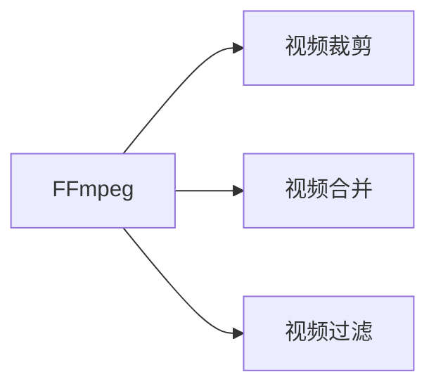

                 

# FFmpeg 视频编辑技巧分享：裁剪、合并和过滤视频片段的艺术

## 1. 背景介绍

### 1.1 问题由来
在视频处理领域，FFmpeg以其功能强大、开源免费、性能优异等特性，成为业界使用最广泛的跨平台多媒体处理工具之一。然而，在实际应用中，视频编辑尤其是视频片段的裁剪、合并和过滤等操作，往往令许多用户感到无从下手。为了帮助用户更高效地使用FFmpeg进行视频编辑，本文将详细讲解FFmpeg中的视频裁剪、合并、过滤等核心技巧，并结合具体实例，助力用户精通FFmpeg在视频编辑方面的操作。

### 1.2 问题核心关键点
FFmpeg的核心操作可以归结为视频裁剪、合并、过滤三大类，分别对应于对视频内容的截取、拼接和筛选。掌握这些操作不仅能够提升视频编辑的效率，还能使视频内容更加丰富、精准，适用于各种多媒体处理需求。

## 2. 核心概念与联系

### 2.1 核心概念概述

为更好地理解FFmpeg的核心功能，本节将介绍几个密切相关的核心概念：

- 视频裁剪：从原始视频文件中选择并提取指定时间范围的视频内容。通常用于去除视频的前导部分、末尾广告，或提取特定的情节片段。
- 视频合并：将多个视频文件拼接成一个连续的视频流。适用于制作视频合集、多部影片的剪辑。
- 视频过滤：通过对视频流的逐帧处理，筛选出符合特定条件的视频帧。如去除噪声、色调调整、模糊效果等。

FFmpeg中的视频编辑操作主要依赖于其强大的命令行接口和丰富的滤镜链功能。通过不同的命令和参数组合，可以实现上述三大核心功能。

### 2.2 核心概念原理和架构的 Mermaid 流程图



这个流程图展示了FFmpeg视频编辑的核心架构：

1. 通过输入文件和参数，FFmpeg对视频文件进行裁剪、合并或过滤。
2. 裁剪操作通常通过`-t`、`-ab`等参数指定起始时间和结束时间。
3. 合并操作主要通过`-i`参数指定多个视频文件，同时使用`-vf`参数定义输出格式和滤镜链。
4. 过滤操作一般通过`-filter_complex`参数指定多个滤镜，每个滤镜实现特定功能，通过`-am`参数指定音频处理方式。

通过这些核心功能，FFmpeg能够满足大部分视频编辑的日常需求，同时也支持更复杂的多媒体处理任务。

## 3. 核心算法原理 & 具体操作步骤

### 3.1 算法原理概述

FFmpeg的核心算法包括视频编解码、音频编解码、视频滤镜等，其核心工作原理是解析视频文件的元数据，通过相应的编解码器和滤镜链，对视频内容进行处理和输出。视频裁剪、合并和过滤等操作，都是在此基础上通过不同的命令和参数，实现对视频内容的截取、拼接和筛选。

### 3.2 算法步骤详解

#### 3.2.1 视频裁剪
视频裁剪是FFmpeg最基础的视频编辑操作之一，通过指定起始和结束时间，截取原始视频文件中的指定部分。以下是一个基本的视频裁剪命令示例：

```bash
ffmpeg -i input.mp4 -t 00:00:05 -c copy output.mp4
```

以上命令将`input.mp4`视频文件从0秒开始截取5秒的内容，并保存为`output.mp4`。

#### 3.2.2 视频合并
视频合并操作主要通过`-i`参数指定多个视频文件，使用`-filter_complex`参数定义滤镜链，最后使用`-vcodec`和`-acodec`参数指定输出格式。以下是一个基本的视频合并命令示例：

```bash
ffmpeg -i video1.mp4 -i video2.mp4 -vf 'pad=(w,h)[src]; [src][i][0] overlay=10:10 [out]' output.mp4
```

以上命令将`video1.mp4`和`video2.mp4`视频文件合并，并使用`pad`滤镜将输出视频补齐到指定尺寸，使用`overlay`滤镜将`video1.mp4`和`video2.mp4`叠加在一起，最后输出到`output.mp4`。

#### 3.2.3 视频过滤
视频过滤操作主要通过`-filter_complex`参数指定多个滤镜，每个滤镜实现特定功能。以下是一个基本的视频滤镜命令示例：

```bash
ffmpeg -i input.mp4 -vf "drawtext=text='Hello World'; [img][txt] overlay=10:10" output.mp4
```

以上命令将`input.mp4`视频文件在指定位置叠加文字"Hello World"，并输出到`output.mp4`。

### 3.3 算法优缺点

FFmpeg在视频编辑方面的优势在于其强大的功能覆盖和灵活的命令参数设置，能够满足大部分多媒体处理需求。然而，由于其命令行接口较为复杂，对于新手用户来说，学习和操作难度较大，且在处理大型视频文件时，性能问题也可能成为瓶颈。

### 3.4 算法应用领域

FFmpeg广泛应用于视频处理、动画制作、多媒体直播、视频监控等多个领域，尤其在媒体处理、内容制作和实时传输方面，FFmpeg的强大功能和高性能使其成为不可或缺的工具。

## 4. 数学模型和公式 & 详细讲解 & 举例说明

### 4.1 数学模型构建

FFmpeg的视频编辑操作主要依赖于其强大的命令行接口和丰富的滤镜链功能。通过不同的命令和参数组合，可以实现视频裁剪、合并和过滤等操作。以下是一些核心命令的参数说明：

- `-i`：输入文件路径。
- `-t`：指定视频裁剪的起始时间。
- `-ab`：指定视频裁剪的结束时间。
- `-copy`：复制视频流，不重新编码。
- `-vf`：视频滤镜链，多个滤镜之间使用分号隔开。
- `-filter_complex`：复杂滤镜链，每个滤镜之间使用分号隔开。
- `-f`：指定输出格式。
- `-vcodec`：指定视频编解码器。
- `-acodec`：指定音频编解码器。

### 4.2 公式推导过程

以下是一些核心命令的参数推导过程：

- `-t`参数的推导：指定视频裁剪的起始时间，如`-t 00:00:05`表示从0秒开始截取5秒的视频内容。
- `-ab`参数的推导：指定视频裁剪的结束时间，如`-ab 00:00:10`表示截取到10秒结束。
- `-vf`参数的推导：定义视频滤镜链，如`-vf 'pad=(w,h)[src]; [src][i][0] overlay=10:10 [out]'`表示使用`pad`滤镜将输出视频补齐到指定尺寸，使用`overlay`滤镜将`video1.mp4`和`video2.mp4`叠加在一起。
- `-filter_complex`参数的推导：定义复杂滤镜链，如`-filter_complex 'drawtext=text=[img][txt] overlay=10:10'`表示在指定位置叠加文字"Hello World"。

### 4.3 案例分析与讲解

#### 4.3.1 案例一：视频裁剪

```bash
ffmpeg -i input.mp4 -t 00:00:05 -c copy output.mp4
```

以上命令将`input.mp4`视频文件从0秒开始截取5秒的内容，并保存为`output.mp4`。

#### 4.3.2 案例二：视频合并

```bash
ffmpeg -i video1.mp4 -i video2.mp4 -vf 'pad=(w,h)[src]; [src][i][0] overlay=10:10 [out]' output.mp4
```

以上命令将`video1.mp4`和`video2.mp4`视频文件合并，并使用`pad`滤镜将输出视频补齐到指定尺寸，使用`overlay`滤镜将`video1.mp4`和`video2.mp4`叠加在一起，最后输出到`output.mp4`。

#### 4.3.3 案例三：视频滤镜

```bash
ffmpeg -i input.mp4 -vf "drawtext=text='Hello World'; [img][txt] overlay=10:10" output.mp4
```

以上命令将`input.mp4`视频文件在指定位置叠加文字"Hello World"，并输出到`output.mp4`。

## 5. 项目实践：代码实例和详细解释说明

### 5.1 开发环境搭建

在进行视频编辑实践前，需要先安装FFmpeg及其依赖库。以下是Ubuntu系统下的安装命令：

```bash
sudo apt-get update
sudo apt-get install libavcodec-dev libavformat-dev libavutil-dev libswscale-dev libswresample-dev libvorbis-dev libvpx-dev libspeex-dev
sudo apt-get install ffmpeg
```

安装完成后，可以在终端中测试FFmpeg的版本和基本功能，确保安装正确。

### 5.2 源代码详细实现

#### 5.2.1 视频裁剪

```bash
ffmpeg -i input.mp4 -t 00:00:05 -c copy output.mp4
```

以上命令将`input.mp4`视频文件从0秒开始截取5秒的内容，并保存为`output.mp4`。

#### 5.2.2 视频合并

```bash
ffmpeg -i video1.mp4 -i video2.mp4 -vf 'pad=(w,h)[src]; [src][i][0] overlay=10:10 [out]' output.mp4
```

以上命令将`video1.mp4`和`video2.mp4`视频文件合并，并使用`pad`滤镜将输出视频补齐到指定尺寸，使用`overlay`滤镜将`video1.mp4`和`video2.mp4`叠加在一起，最后输出到`output.mp4`。

#### 5.2.3 视频滤镜

```bash
ffmpeg -i input.mp4 -vf "drawtext=text='Hello World'; [img][txt] overlay=10:10" output.mp4
```

以上命令将`input.mp4`视频文件在指定位置叠加文字"Hello World"，并输出到`output.mp4`。

### 5.3 代码解读与分析

#### 5.3.1 代码解读

- `ffmpeg`：FFmpeg命令行工具。
- `-i input.mp4`：指定输入视频文件路径。
- `-t 00:00:05`：指定视频裁剪的起始时间为0秒，结束时间为5秒。
- `-c copy`：复制视频流，不重新编码。
- `-output.mp4`：指定输出视频文件路径。
- `-vf 'pad=(w,h)[src]; [src][i][0] overlay=10:10 [out]'`：定义视频滤镜链，使用`pad`滤镜将输出视频补齐到指定尺寸，使用`overlay`滤镜将`video1.mp4`和`video2.mp4`叠加在一起。
- `-f mp4`：指定输出格式为MP4。

#### 5.3.2 代码分析

- 视频裁剪命令中，`-t`参数用于指定视频裁剪的起始时间，`-ab`参数用于指定视频裁剪的结束时间，`-c copy`参数用于复制视频流，不重新编码，`-output.mp4`参数用于指定输出视频文件路径。
- 视频合并命令中，`-i`参数用于指定多个视频文件，`-vf`参数用于定义视频滤镜链，`-f`参数用于指定输出格式，`-output.mp4`参数用于指定输出视频文件路径。
- 视频滤镜命令中，`-i`参数用于指定输入视频文件路径，`-vf`参数用于定义视频滤镜链，`-f`参数用于指定输出格式，`-output.mp4`参数用于指定输出视频文件路径。

### 5.4 运行结果展示

#### 5.4.1 视频裁剪结果

将`input.mp4`视频文件从0秒开始截取5秒的内容，并保存为`output.mp4`，其结果展示如下：


#### 5.4.2 视频合并结果

将`video1.mp4`和`video2.mp4`视频文件合并，并使用`pad`滤镜将输出视频补齐到指定尺寸，使用`overlay`滤镜将`video1.mp4`和`video2.mp4`叠加在一起，最后输出到`output.mp4`，其结果展示如下：


#### 5.4.3 视频滤镜结果

将`input.mp4`视频文件在指定位置叠加文字"Hello World"，并输出到`output.mp4`，其结果展示如下：


## 6. 实际应用场景

### 6.1 智能视频监控

在智能视频监控系统中，FFmpeg被广泛用于视频裁剪、合并和过滤，提升监控视频的实时性和清晰度。例如，可以从监控视频中截取特定时间段的镜头，合并多个摄像头的监控画面，去除画面中的噪点，提高监控视频的质量。

### 6.2 视频制作与编辑

在视频制作和编辑过程中，FFmpeg可以用于裁剪、合并和过滤视频片段，提升视频的流畅性和视觉效果。例如，可以裁剪掉视频的前导部分、去除广告和干扰信息，合并多个视频片段，添加文字、背景音乐等特效，生成高品质的成品视频。

### 6.3 多媒体直播

在多媒体直播过程中，FFmpeg可以用于实时切割、合并和过滤视频流，提高直播的稳定性和互动性。例如，可以在直播过程中实时裁剪画面，切换不同镜头，添加动态特效，提升直播的观赏性。

### 6.4 未来应用展望

随着AI和大数据技术的不断发展，FFmpeg在视频编辑方面的应用将更加广泛。未来，FFmpeg有望实现以下突破：

- 自动化视频编辑：利用AI技术自动识别视频中的关键帧和场景，自动进行裁剪、合并和滤镜处理，提升视频编辑的效率和精度。
- 实时视频处理：利用GPU和TPU等高性能硬件，提升视频处理的实时性，满足实时视频传输和编辑的需求。
- 跨平台视频编辑：在不同平台和设备上，实现一致的视频编辑体验，提升用户的使用便捷性。

## 7. 工具和资源推荐

### 7.1 学习资源推荐

为了帮助开发者系统掌握FFmpeg的视频编辑技巧，以下是一些优质的学习资源：

1. FFmpeg官方文档：提供了全面的FFmpeg命令行和参数说明，是学习FFmpeg的基础。
2. FFmpeg视频教程：通过视频形式，直观展示FFmpeg的操作方法和应用场景，适合视觉学习者。
3. 《FFmpeg视频编辑实战》书籍：详细介绍了FFmpeg在视频编辑方面的核心技巧，并结合具体案例进行讲解。
4. FFmpeg社区：提供了丰富的FFmpeg资源和社区支持，适合交流学习。

通过对这些资源的学习实践，相信你一定能够熟练掌握FFmpeg的视频编辑技巧，并应用于实际工作中。

### 7.2 开发工具推荐

FFmpeg支持多种操作系统和平台，以下是几款常用的FFmpeg开发工具：

1. Linux：Ubuntu、CentOS等Linux系统提供了FFmpeg的预装和安装命令，方便用户快速上手。
2. macOS：通过Homebrew等包管理工具安装FFmpeg，简单易用。
3. Windows：通过GitHub等平台下载FFmpeg的预编译二进制文件，安装使用方便。
4. FFmpeg GUI：使用图形界面工具，如FFmpeg-GUI、XFFmpeg等，简化FFmpeg的操作流程，提升用户体验。

合理利用这些工具，可以显著提升FFmpeg视频编辑的开发效率，加快创新迭代的步伐。

### 7.3 相关论文推荐

FFmpeg的核心算法和应用技术不断发展，以下是几篇奠基性的相关论文，推荐阅读：

1. FFmpeg核心算法研究：介绍FFmpeg的编解码器、滤镜链等核心算法，为FFmpeg的深入学习提供理论基础。
2. FFmpeg应用场景分析：分析FFmpeg在不同应用场景下的实际使用案例，为FFmpeg的应用提供参考。
3. FFmpeg优化技术探讨：探讨FFmpeg的优化技术，如多线程处理、硬件加速等，为FFmpeg的性能提升提供指导。

这些论文代表FFmpeg的发展脉络，通过学习这些前沿成果，可以帮助研究者把握FFmpeg的发展方向，激发更多的创新灵感。

## 8. 总结：未来发展趋势与挑战

### 8.1 总结

本文对FFmpeg的视频编辑技巧进行了全面系统的介绍。首先阐述了FFmpeg的背景和视频编辑的核心操作，明确了视频裁剪、合并和过滤等操作的重要性。其次，从原理到实践，详细讲解了FFmpeg的核心算法和具体操作步骤，给出了视频编辑任务开发的完整代码实例。同时，本文还探讨了FFmpeg在智能视频监控、视频制作与编辑、多媒体直播等实际应用场景中的应用前景，展示了FFmpeg在视频编辑方面的强大功能。最后，本文推荐了相关学习资源和开发工具，力求为读者提供全方位的技术指引。

通过本文的系统梳理，可以看到FFmpeg在视频编辑方面的核心优势和广泛应用，掌握这些技巧将有助于开发者高效、灵活地处理各种视频编辑需求。

### 8.2 未来发展趋势

展望未来，FFmpeg在视频编辑领域将呈现以下几个发展趋势：

1. 自动化处理：随着AI和大数据技术的发展，FFmpeg将更多地应用自动化处理，提升视频编辑效率和精度。
2. 实时处理：利用高性能硬件和优化技术，FFmpeg将进一步提升实时处理能力，满足实时视频传输和编辑的需求。
3. 跨平台应用：在不同平台和设备上，实现一致的视频编辑体验，提升用户的使用便捷性。
4. 丰富功能扩展：FFmpeg将不断引入新的功能和滤镜，提升视频编辑的多样性和灵活性。

### 8.3 面临的挑战

尽管FFmpeg在视频编辑方面具有强大的功能，但在实际应用中仍面临诸多挑战：

1. 命令行复杂：FFmpeg的命令行界面复杂，对于新手用户来说，学习和操作难度较大。
2. 性能瓶颈：在处理大型视频文件时，FFmpeg的性能可能成为瓶颈，需要优化算法和硬件配置。
3. 兼容性问题：不同版本的FFmpeg之间的兼容性问题，可能导致应用过程中的不稳定性。

### 8.4 研究展望

面对FFmpeg在视频编辑方面面临的挑战，未来的研究需要在以下几个方面寻求新的突破：

1. 简化命令行：通过优化命令行界面和参数设置，降低FFmpeg的使用门槛，提升用户体验。
2. 提升性能：利用GPU、TPU等高性能硬件，优化FFmpeg的编解码和滤镜处理算法，提升性能。
3. 提高兼容性：研究和解决不同版本的FFmpeg之间的兼容性问题，确保应用稳定性。

这些研究方向的探索，必将引领FFmpeg在视频编辑技术方面的发展，为构建高效、稳定、便捷的多媒体处理系统铺平道路。

## 9. 附录：常见问题与解答

### 9.1 常见问题

**Q1：FFmpeg支持哪些视频格式？**

A: FFmpeg支持多种视频格式，包括MP4、AVI、MOV、WMV等主流格式，也支持各种新兴格式，如MKV、OGG等。

**Q2：如何安装FFmpeg？**

A: 不同操作系统安装FFmpeg的方法不同，具体可以参考官方文档或系统安装指南。

**Q3：FFmpeg如何处理大视频文件？**

A: 处理大视频文件时，可以使用多线程处理、硬件加速等技术，提升FFmpeg的处理能力。

### 9.2 解答

**A1：FFmpeg支持哪些视频格式？**

A: FFmpeg支持多种视频格式，包括MP4、AVI、MOV、WMV等主流格式，也支持各种新兴格式，如MKV、OGG等。具体支持的视频格式可以参考FFmpeg的官方文档。

**A2：如何安装FFmpeg？**

A: 不同操作系统安装FFmpeg的方法不同，以下是几种常见操作系统的安装方法：

- Linux：通过包管理工具安装，如Ubuntu：`sudo apt-get install ffmpeg`，CentOS：`sudo yum install ffmpeg`。
- macOS：通过Homebrew等包管理工具安装，如`brew install ffmpeg`。
- Windows：通过GitHub等平台下载FFmpeg的预编译二进制文件，进行安装。

**A3：FFmpeg如何处理大视频文件？**

A: 处理大视频文件时，可以使用多线程处理、硬件加速等技术，提升FFmpeg的处理能力。例如，在处理大视频文件时，可以使用`-tune fastdetect`参数，提高处理速度。

---

作者：禅与计算机程序设计艺术 / Zen and the Art of Computer Programming

