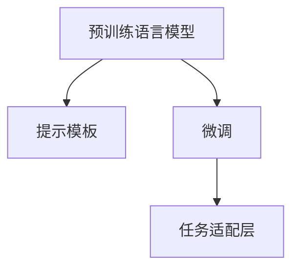

                 

# ICL: 任务指导的提示模板

> 关键词：ICL, 任务指导, 提示模板, 自然语言处理, 语言模型, 预训练, 任务适配, 深度学习

## 1. 背景介绍

### 1.1 问题由来
近年来，自然语言处理(NLP)技术取得了显著进展，其中以预训练语言模型(如BERT、GPT-3等)为代表的技术更是推动了NLP领域的革命。然而，尽管这些模型在通用文本理解上取得了巨大成功，但将它们应用到特定领域或任务时，性能往往不如预期。原因在于，预训练模型无法完全覆盖各种任务，且可能缺乏对特定领域知识的学习。

为了克服这一问题，提示工程（Instruction-tuning，ICL）应运而生。ICL是一种通过向预训练模型提供任务相关的指导信息（即提示模板）来引导模型执行特定任务的方法。这种方法不需要对模型进行大规模的微调，而是通过微调顶层分类器，将模型的预训练知识应用到特定任务上，从而提升模型的泛化能力。

### 1.2 问题核心关键点
ICL的核心在于精心设计提示模板，通过给预训练模型提供清晰的任务描述，使其能够理解并执行特定任务。提示模板的设计需要考虑以下几个关键点：

- **任务适配性**：提示模板应充分考虑任务的特性和需求，使模型能够理解和执行任务。
- **通用性**：提示模板应尽量简洁明了，避免过度依赖特定领域的术语或数据。
- **可解释性**：提示模板应能够解释模型的推理过程，提高模型的可信度和可解释性。
- **可扩展性**：提示模板应具有可扩展性，能够通过简单的调整和修改，适应新的任务和数据。

## 2. 核心概念与联系

### 2.1 核心概念概述

为更好地理解ICL的原理和实现方法，本节将介绍几个相关核心概念：

- **预训练语言模型（Pre-trained Language Model, PLM）**：指通过大规模无标签文本数据进行预训练的语言模型，如BERT、GPT-3等。预训练语言模型通过自监督学习任务（如掩码语言模型、下一句预测等）获得通用语言知识。
- **提示模板（Instruction Template）**：是指向预训练模型提供任务的指导信息，通常包含任务描述、输入格式、输出格式等。
- **微调（Fine-tuning）**：指在预训练模型的基础上，通过有监督的训练来优化模型在特定任务上的性能。微调通常涉及对模型顶层的分类器或解码器的调整。
- **迁移学习（Transfer Learning）**：指将一个领域学到的知识迁移到另一个领域的学习范式。ICL可以看作是一种特殊的迁移学习，通过提示模板将通用知识迁移到特定任务上。
- **任务适配层（Task-Adaptation Layer）**：指在预训练模型的基础上，为特定任务添加的任务相关层，如分类头、解码器等。

这些核心概念之间的逻辑关系可以通过以下Mermaid流程图来展示：



这个流程图展示了预训练模型、提示模板和微调之间的关系：

1. 预训练模型通过大规模无标签数据学习通用的语言表示。
2. 提示模板提供任务描述，引导模型执行特定任务。
3. 微调对预训练模型进行优化，使其在特定任务上表现更佳。

## 3. 核心算法原理 & 具体操作步骤

### 3.1 算法原理概述

ICL的原理基于一个简单的假设：预训练模型在特定任务上的性能可以通过提供任务的指导信息来提升。ICL的核心在于设计提示模板，将其输入到预训练模型中，使其能够理解和执行特定任务。

形式化地，假设预训练模型为 $M_{\theta}$，其中 $\theta$ 为预训练得到的模型参数。给定特定任务的输入和输出格式，定义提示模板 $I$，则ICL的目标是最大化模型在特定任务上的输出与真实标签的匹配程度，即：

$$
\max_{I} \mathcal{L}(M_{\theta}, I)
$$

其中 $\mathcal{L}$ 为针对任务 $T$ 设计的损失函数，用于衡量模型输出与真实标签之间的差异。常见的损失函数包括交叉熵损失、均方误差损失等。

通过优化提示模板 $I$，使得损失函数 $\mathcal{L}$ 最小化，从而得到适应特定任务的最佳提示模板。

### 3.2 算法步骤详解

ICL的基本流程如下：

1. **数据准备**：收集特定任务的标注数据集，并将其划分为训练集、验证集和测试集。
2. **提示模板设计**：根据任务特性设计提示模板，确保其能够清晰地描述任务需求。
3. **模型适配**：将提示模板输入到预训练模型中，微调模型的顶层分类器或解码器，以适应特定任务。
4. **模型评估**：在测试集上评估微调后的模型性能，对比微调前后的效果。
5. **部署应用**：将微调后的模型集成到实际应用系统中，提供任务执行能力。

### 3.3 算法优缺点

ICL相较于传统的微调方法具有以下优点：

1. **参数高效**：ICL通常只微调模型的顶层，参数量较少，减少了微调过程中的计算和内存消耗。
2. **快速迭代**：提示模板设计灵活，可以快速调整和测试，迭代速度较快。
3. **可解释性**：ICL中的提示模板提供了明确的执行逻辑，使得模型的推理过程更加可解释。

然而，ICL也存在一些缺点：

1. **提示模板设计难度大**：提示模板的设计需要考虑任务的多个维度，设计不当可能导致模型性能下降。
2. **性能泛化有限**：提示模板的设计高度依赖于任务和数据集的特性，在跨领域应用时效果可能不佳。
3. **模型鲁棒性差**：提示模板中的噪声或歧义可能导致模型输出不稳定，鲁棒性较差。

### 3.4 算法应用领域

ICL在NLP领域已经得到了广泛应用，涵盖多个任务，如问答系统、文本分类、对话系统等。具体应用领域包括：

- **问答系统**：提供具体问题和答案提示，指导模型生成正确的答案。
- **文本分类**：通过设计合适的分类头，将模型输出分类到特定类别。
- **对话系统**：设计多轮对话格式，引导模型生成连贯的回答。
- **情感分析**：通过设计情感标签，指导模型对文本情感进行分类。
- **命名实体识别**：设计实体边界标记，指导模型识别和分类实体。
- **机器翻译**：提供翻译任务提示，指导模型将源语言翻译成目标语言。

## 4. 数学模型和公式 & 详细讲解 & 举例说明

### 4.1 数学模型构建

ICL中的数学模型构建主要涉及提示模板的设计和模型适配层的添加。假设提示模板为 $I$，模型输出为 $y$，则提示模板引导下的模型输出可以表示为：

$$
y = M_{\theta}(x, I)
$$

其中 $x$ 为输入文本，$M_{\theta}$ 为预训练模型，$\theta$ 为模型参数。提示模板 $I$ 通常包括任务的描述、输入格式和输出格式等信息。

### 4.2 公式推导过程

假设提示模板为 $I$，模型输出为 $y$，则损失函数 $\mathcal{L}$ 可以表示为：

$$
\mathcal{L} = \frac{1}{N}\sum_{i=1}^N \ell(y_i, y_i)
$$

其中 $\ell$ 为损失函数，$y_i$ 为模型对第 $i$ 个样本的输出，$y_i$ 为真实标签。

对于特定的任务，如文本分类，可以将提示模板设计为包含任务描述、输入格式和输出格式等的信息。例如，对于情感分析任务，提示模板可以设计为：

$$
I = "请判断下列文本的情感极性，选项为 [positive, neutral, negative]："
$$

其中，提示模板中的 [positive, neutral, negative] 用于指导模型输出情感极性标签。

### 4.3 案例分析与讲解

假设有一个情感分析任务，需要将给定的文本分类为正面、中性和负面情感。可以设计如下的提示模板：

$$
I = "请判断下列文本的情感极性："
$$

然后将提示模板 $I$ 和待分类的文本 $x$ 输入到预训练模型中，模型的输出 $y$ 即可指导模型输出情感分类结果。

## 5. 项目实践：代码实例和详细解释说明

### 5.1 开发环境搭建

在进行ICL实践前，我们需要准备好开发环境。以下是使用Python进行PyTorch开发的环境配置流程：

1. 安装Anaconda：从官网下载并安装Anaconda，用于创建独立的Python环境。

2. 创建并激活虚拟环境：
```bash
conda create -n pytorch-env python=3.8 
conda activate pytorch-env
```

3. 安装PyTorch：根据CUDA版本，从官网获取对应的安装命令。例如：
```bash
conda install pytorch torchvision torchaudio cudatoolkit=11.1 -c pytorch -c conda-forge
```

4. 安装Transformers库：
```bash
pip install transformers
```

5. 安装各类工具包：
```bash
pip install numpy pandas scikit-learn matplotlib tqdm jupyter notebook ipython
```

完成上述步骤后，即可在`pytorch-env`环境中开始ICL实践。

### 5.2 源代码详细实现

下面以情感分析任务为例，给出使用Transformers库对BERT模型进行ICL的PyTorch代码实现。

首先，定义情感分析任务的数据处理函数：

```python
from transformers import BertTokenizer
from torch.utils.data import Dataset
import torch

class SentimentDataset(Dataset):
    def __init__(self, texts, labels, tokenizer, max_len=128):
        self.texts = texts
        self.labels = labels
        self.tokenizer = tokenizer
        self.max_len = max_len
        
    def __len__(self):
        return len(self.texts)
    
    def __getitem__(self, item):
        text = self.texts[item]
        label = self.labels[item]
        
        encoding = self.tokenizer(text, return_tensors='pt', max_length=self.max_len, padding='max_length', truncation=True)
        input_ids = encoding['input_ids'][0]
        attention_mask = encoding['attention_mask'][0]
        
        # 对标签进行编码
        labels = torch.tensor(label, dtype=torch.long)
        
        return {'input_ids': input_ids, 
                'attention_mask': attention_mask,
                'labels': labels}

# 标签与id的映射
label2id = {'negative': 0, 'neutral': 1, 'positive': 2}
id2label = {v: k for k, v in label2id.items()}

# 创建dataset
tokenizer = BertTokenizer.from_pretrained('bert-base-cased')

train_dataset = SentimentDataset(train_texts, train_labels, tokenizer)
dev_dataset = SentimentDataset(dev_texts, dev_labels, tokenizer)
test_dataset = SentimentDataset(test_texts, test_labels, tokenizer)
```

然后，定义模型和优化器：

```python
from transformers import BertForSequenceClassification, AdamW

model = BertForSequenceClassification.from_pretrained('bert-base-cased', num_labels=len(label2id))

optimizer = AdamW(model.parameters(), lr=2e-5)
```

接着，定义提示模板和训练和评估函数：

```python
# 提示模板
prompt = "请判断下列文本的情感极性："
# 标签提示模板
label_prompt = {0: "negative", 1: "neutral", 2: "positive"}

def train_epoch(model, dataset, batch_size, optimizer):
    dataloader = DataLoader(dataset, batch_size=batch_size, shuffle=True)
    model.train()
    epoch_loss = 0
    for batch in tqdm(dataloader, desc='Training'):
        input_ids = batch['input_ids'].to(device)
        attention_mask = batch['attention_mask'].to(device)
        labels = batch['labels'].to(device)
        model.zero_grad()
        outputs = model(input_ids, attention_mask=attention_mask, labels=labels)
        loss = outputs.loss
        epoch_loss += loss.item()
        loss.backward()
        optimizer.step()
    return epoch_loss / len(dataloader)

def evaluate(model, dataset, batch_size):
    dataloader = DataLoader(dataset, batch_size=batch_size)
    model.eval()
    preds, labels = [], []
    with torch.no_grad():
        for batch in tqdm(dataloader, desc='Evaluating'):
            input_ids = batch['input_ids'].to(device)
            attention_mask = batch['attention_mask'].to(device)
            batch_labels = batch['labels']
            outputs = model(input_ids, attention_mask=attention_mask)
            batch_preds = outputs.logits.argmax(dim=2).to('cpu').tolist()
            batch_labels = batch_labels.to('cpu').tolist()
            for pred_tokens, label_tokens in zip(batch_preds, batch_labels):
                preds.append(pred_tokens)
                labels.append(label_tokens)
                
    print(classification_report(labels, preds))
```

最后，启动训练流程并在测试集上评估：

```python
epochs = 5
batch_size = 16

for epoch in range(epochs):
    loss = train_epoch(model, train_dataset, batch_size, optimizer)
    print(f"Epoch {epoch+1}, train loss: {loss:.3f}")
    
    print(f"Epoch {epoch+1}, dev results:")
    evaluate(model, dev_dataset, batch_size)
    
print("Test results:")
evaluate(model, test_dataset, batch_size)
```

以上就是使用PyTorch对BERT进行情感分析任务ICL的完整代码实现。可以看到，得益于Transformers库的强大封装，我们可以用相对简洁的代码完成BERT模型的加载和ICL。

### 5.3 代码解读与分析

让我们再详细解读一下关键代码的实现细节：

**SentimentDataset类**：
- `__init__`方法：初始化文本、标签、分词器等关键组件。
- `__len__`方法：返回数据集的样本数量。
- `__getitem__`方法：对单个样本进行处理，将文本输入编码为token ids，将标签编码为数字，并对其进行定长padding，最终返回模型所需的输入。

**label2id和id2label字典**：
- 定义了标签与数字id之间的映射关系，用于将标签解码回原始文本。

**训练和评估函数**：
- 使用PyTorch的DataLoader对数据集进行批次化加载，供模型训练和推理使用。
- 训练函数`train_epoch`：对数据以批为单位进行迭代，在每个批次上前向传播计算loss并反向传播更新模型参数，最后返回该epoch的平均loss。
- 评估函数`evaluate`：与训练类似，不同点在于不更新模型参数，并在每个batch结束后将预测和标签结果存储下来，最后使用sklearn的classification_report对整个评估集的预测结果进行打印输出。

**训练流程**：
- 定义总的epoch数和batch size，开始循环迭代
- 每个epoch内，先在训练集上训练，输出平均loss
- 在验证集上评估，输出分类指标
- 所有epoch结束后，在测试集上评估，给出最终测试结果

可以看到，PyTorch配合Transformers库使得BERT的ICL代码实现变得简洁高效。开发者可以将更多精力放在数据处理、模型改进等高层逻辑上，而不必过多关注底层的实现细节。

当然，工业级的系统实现还需考虑更多因素，如模型的保存和部署、超参数的自动搜索、更灵活的任务适配层等。但核心的ICL范式基本与此类似。

## 6. 实际应用场景

### 6.1 智能客服系统

基于ICL的对话技术，可以广泛应用于智能客服系统的构建。传统客服往往需要配备大量人力，高峰期响应缓慢，且一致性和专业性难以保证。而使用ICL训练的对话模型，可以7x24小时不间断服务，快速响应客户咨询，用自然流畅的语言解答各类常见问题。

在技术实现上，可以收集企业内部的历史客服对话记录，将问题和最佳答复构建成监督数据，在此基础上对预训练对话模型进行ICL。ICL后的对话模型能够自动理解用户意图，匹配最合适的答案模板进行回复。对于客户提出的新问题，还可以接入检索系统实时搜索相关内容，动态组织生成回答。如此构建的智能客服系统，能大幅提升客户咨询体验和问题解决效率。

### 6.2 金融舆情监测

金融机构需要实时监测市场舆论动向，以便及时应对负面信息传播，规避金融风险。传统的人工监测方式成本高、效率低，难以应对网络时代海量信息爆发的挑战。基于ICL的文本分类和情感分析技术，为金融舆情监测提供了新的解决方案。

具体而言，可以收集金融领域相关的新闻、报道、评论等文本数据，并对其进行主题标注和情感标注。在此基础上对预训练语言模型进行ICL，使其能够自动判断文本属于何种主题，情感倾向是正面、中性还是负面。将ICL后的模型应用到实时抓取的网络文本数据，就能够自动监测不同主题下的情感变化趋势，一旦发现负面信息激增等异常情况，系统便会自动预警，帮助金融机构快速应对潜在风险。

### 6.3 个性化推荐系统

当前的推荐系统往往只依赖用户的历史行为数据进行物品推荐，无法深入理解用户的真实兴趣偏好。基于ICL的个性化推荐系统可以更好地挖掘用户行为背后的语义信息，从而提供更精准、多样的推荐内容。

在实践中，可以收集用户浏览、点击、评论、分享等行为数据，提取和用户交互的物品标题、描述、标签等文本内容。将文本内容作为模型输入，用户的后续行为（如是否点击、购买等）作为监督信号，在此基础上对预训练语言模型进行ICL。ICL后的模型能够从文本内容中准确把握用户的兴趣点。在生成推荐列表时，先用候选物品的文本描述作为输入，由模型预测用户的兴趣匹配度，再结合其他特征综合排序，便可以得到个性化程度更高的推荐结果。

### 6.4 未来应用展望

随着ICL技术的不断发展，基于ICL的方法将在更多领域得到应用，为传统行业带来变革性影响。

在智慧医疗领域，基于ICL的医疗问答、病历分析、药物研发等应用将提升医疗服务的智能化水平，辅助医生诊疗，加速新药开发进程。

在智能教育领域，ICL技术可应用于作业批改、学情分析、知识推荐等方面，因材施教，促进教育公平，提高教学质量。

在智慧城市治理中，ICL模型可应用于城市事件监测、舆情分析、应急指挥等环节，提高城市管理的自动化和智能化水平，构建更安全、高效的未来城市。

此外，在企业生产、社会治理、文娱传媒等众多领域，基于ICL的人工智能应用也将不断涌现，为NLP技术带来了全新的突破。相信随着预训练语言模型和ICL方法的持续演进，NLP技术将在更广阔的应用领域大放异彩。

## 7. 工具和资源推荐

### 7.1 学习资源推荐

为了帮助开发者系统掌握ICL的理论基础和实践技巧，这里推荐一些优质的学习资源：

1. 《Natural Language Processing with Transformers》书籍：Transformers库的作者所著，全面介绍了如何使用Transformers库进行NLP任务开发，包括ICL在内的诸多范式。

2. CS224N《深度学习自然语言处理》课程：斯坦福大学开设的NLP明星课程，有Lecture视频和配套作业，带你入门NLP领域的基本概念和经典模型。

3. HuggingFace官方文档：Transformers库的官方文档，提供了海量预训练模型和完整的ICL样例代码，是上手实践的必备资料。

4. CLUE开源项目：中文语言理解测评基准，涵盖大量不同类型的中文NLP数据集，并提供了基于ICL的baseline模型，助力中文NLP技术发展。

通过对这些资源的学习实践，相信你一定能够快速掌握ICL的精髓，并用于解决实际的NLP问题。

### 7.2 开发工具推荐

高效的开发离不开优秀的工具支持。以下是几款用于ICL开发的常用工具：

1. PyTorch：基于Python的开源深度学习框架，灵活动态的计算图，适合快速迭代研究。大部分预训练语言模型都有PyTorch版本的实现。

2. TensorFlow：由Google主导开发的开源深度学习框架，生产部署方便，适合大规模工程应用。同样有丰富的预训练语言模型资源。

3. Transformers库：HuggingFace开发的NLP工具库，集成了众多SOTA语言模型，支持PyTorch和TensorFlow，是进行ICL任务开发的利器。

4. Weights & Biases：模型训练的实验跟踪工具，可以记录和可视化模型训练过程中的各项指标，方便对比和调优。与主流深度学习框架无缝集成。

5. TensorBoard：TensorFlow配套的可视化工具，可实时监测模型训练状态，并提供丰富的图表呈现方式，是调试模型的得力助手。

6. Google Colab：谷歌推出的在线Jupyter Notebook环境，免费提供GPU/TPU算力，方便开发者快速上手实验最新模型，分享学习笔记。

合理利用这些工具，可以显著提升ICL任务的开发效率，加快创新迭代的步伐。

### 7.3 相关论文推荐

ICL技术的发展源于学界的持续研究。以下是几篇奠基性的相关论文，推荐阅读：

1. Instruction-tuning：Expanding Language Model Capabilities with Instruction-tuning（ICL的命名由来）
2. How to Delegate Reasoning: Compositionality in Pre-trained Model Instruction-tuning（ICL的扩展能力）
3. Multi-Modal Pre-training for Instruction-tuning（多模态ICL）
4. Towards General-Purpose Pre-trained Models for Instruction-tuning（通用ICL）

这些论文代表了大语言模型ICL技术的发展脉络。通过学习这些前沿成果，可以帮助研究者把握学科前进方向，激发更多的创新灵感。

## 8. 总结：未来发展趋势与挑战

### 8.1 总结

本文对基于ICL的NLP技术进行了全面系统的介绍。首先阐述了ICL的核心理念和应用场景，明确了ICL在特定任务处理中的独特优势。其次，从原理到实践，详细讲解了ICL的数学模型和核心算法，给出了ICL任务开发的完整代码实例。同时，本文还广泛探讨了ICL方法在智能客服、金融舆情、个性化推荐等多个行业领域的应用前景，展示了ICL范式的巨大潜力。此外，本文精选了ICL技术的各类学习资源，力求为读者提供全方位的技术指引。

通过本文的系统梳理，可以看到，基于ICL的方法正在成为NLP领域的重要范式，极大地拓展了预训练语言模型的应用边界，催生了更多的落地场景。受益于预训练语言模型的通用语言知识，ICL技术可以在不进行大规模微调的情况下，快速适应新任务，显著提升模型性能。未来，伴随预训练语言模型和ICL方法的持续演进，NLP技术必将在更广阔的应用领域大放异彩，深刻影响人类的生产生活方式。

### 8.2 未来发展趋势

展望未来，ICL技术将呈现以下几个发展趋势：

1. **多模态ICL**：将视觉、语音等多模态信息与文本信息进行融合，实现多模态智能交互。

2. **跨领域ICL**：将预训练模型在不同领域之间进行迁移，提升跨领域任务的性能。

3. **零样本和少样本ICL**：通过精心设计的提示模板，在未见过的样本上也能实现良好的推理能力。

4. **因果关系建模**：引入因果推断等方法，增强模型决策的因果性和逻辑性。

5. **主动学习**：在数据不足的情况下，通过主动学习获取更多样化的数据，提升模型的泛化能力。

6. **可解释性和透明性**：通过提示模板和模型的可视化，提高模型的可解释性和透明性。

以上趋势凸显了ICL技术的广阔前景。这些方向的探索发展，必将进一步提升NLP系统的性能和应用范围，为人类认知智能的进化带来深远影响。

### 8.3 面临的挑战

尽管ICL技术已经取得了瞩目成就，但在迈向更加智能化、普适化应用的过程中，它仍面临着诸多挑战：

1. **提示模板设计难度大**：提示模板的设计需要考虑任务的多个维度，设计不当可能导致模型性能下降。

2. **模型鲁棒性差**：提示模板中的噪声或歧义可能导致模型输出不稳定，鲁棒性较差。

3. **可扩展性不足**：提示模板的设计高度依赖于任务和数据集的特性，在跨领域应用时效果可能不佳。

4. **性能泛化有限**：ICL模型在特定任务上表现较好，但在通用领域泛化性能有限。

5. **可解释性不足**：模型推理过程缺乏可解释性，难以对其推理逻辑进行分析和调试。

6. **安全性有待保障**：预训练模型可能学习到有害信息，通过ICL传递到下游任务，产生误导性、歧视性的输出。

正视ICL面临的这些挑战，积极应对并寻求突破，将是大语言模型ICL走向成熟的必由之路。相信随着学界和产业界的共同努力，这些挑战终将一一被克服，ICL技术必将在构建人机协同的智能系统中扮演越来越重要的角色。

### 8.4 未来突破

面对ICL面临的种种挑战，未来的研究需要在以下几个方面寻求新的突破：

1. **优化提示模板设计**：引入生成式模型、对抗样本等方法，优化提示模板的设计过程，提升模型的泛化能力。

2. **提升模型鲁棒性**：通过正则化、对抗训练等方法，增强模型的鲁棒性和稳定性。

3. **增强可扩展性**：设计通用的提示模板框架，支持多种任务的灵活适配。

4. **提高性能泛化能力**：通过迁移学习、自监督学习等方法，提高模型在不同领域的泛化能力。

5. **增强可解释性**：引入可解释性方法，如注意力机制、决策树等，提高模型的透明性和可信度。

6. **保障安全性**：在模型训练目标中引入伦理导向的评估指标，过滤和惩罚有害输出，确保模型的安全性。

这些研究方向的探索，必将引领ICL技术迈向更高的台阶，为构建安全、可靠、可解释、可控的智能系统铺平道路。面向未来，ICL技术还需要与其他人工智能技术进行更深入的融合，如知识表示、因果推理、强化学习等，多路径协同发力，共同推动自然语言理解和智能交互系统的进步。只有勇于创新、敢于突破，才能不断拓展语言模型的边界，让智能技术更好地造福人类社会。

## 9. 附录：常见问题与解答

**Q1：ICL是否适用于所有NLP任务？**

A: ICL在大多数NLP任务上都能取得不错的效果，特别是对于数据量较小的任务。但对于一些特定领域的任务，如医学、法律等，仅仅依靠通用语料预训练的模型可能难以很好地适应。此时需要在特定领域语料上进一步预训练，再进行ICL，才能获得理想效果。此外，对于一些需要时效性、个性化很强的任务，如对话、推荐等，ICL方法也需要针对性的改进优化。

**Q2：如何选择合适的提示模板？**

A: 提示模板的设计需要考虑任务的特性和需求，使其能够清晰地描述任务。常见的提示模板包括任务描述、输入格式、输出格式等信息。例如，对于情感分析任务，提示模板可以设计为："请判断下列文本的情感极性："，其中，提示模板中的 [positive, neutral, negative] 用于指导模型输出情感极性标签。

**Q3：ICL的计算资源消耗较大，如何解决？**

A: 可以通过以下方法优化ICL的计算资源消耗：

1. **剪枝和量化**：在ICL过程中，对模型进行剪枝和量化，减小模型尺寸，降低计算资源消耗。

2. **并行计算**：利用GPU/TPU等高性能设备，加速模型训练和推理过程。

3. **模型压缩**：使用模型压缩技术，如知识蒸馏、权衡学习等，减小模型尺寸，提高计算效率。

4. **分批次训练**：将数据集分批次加载，避免一次性加载全部数据造成内存不足的问题。

5. **混合精度训练**：使用混合精度训练，减小计算精度，提高计算效率。

6. **在线学习**：利用在线学习技术，实时更新模型参数，减少计算资源的消耗。

这些优化方法可以显著提高ICL任务的计算效率，减少资源消耗。

**Q4：ICL的性能泛化能力如何？**

A: ICL的性能泛化能力有限，提示模板的设计高度依赖于任务和数据集的特性。在特定领域或任务上，ICL模型往往能够取得较好的性能，但在跨领域应用时效果可能不佳。因此，在设计提示模板时，需要充分考虑任务的多样性和数据的泛化性，以提高模型的泛化能力。

**Q5：ICL的鲁棒性如何？**

A: ICL的鲁棒性较差，提示模板中的噪声或歧义可能导致模型输出不稳定。为了提高模型的鲁棒性，可以引入对抗训练、正则化等方法，增强模型的泛化能力和鲁棒性。

**Q6：ICL的模型参数量如何？**

A: ICL的模型参数量较小，通常只微调模型的顶层，参数量较少，减少了微调过程中的计算和内存消耗。相比传统的微调方法，ICL方法更加参数高效，节省了大量的计算资源。

---

作者：禅与计算机程序设计艺术 / Zen and the Art of Computer Programming

