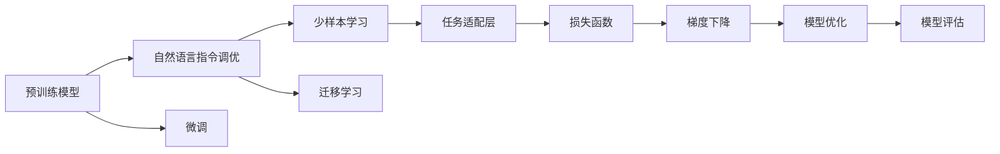

                 

## 1. 背景介绍

近年来，随着深度学习技术的发展，自然语言处理（NLP）领域取得了显著进展。在大规模语言模型（LLMs）的预训练和微调（Fine-tuning）基础上，研究人员和开发者逐渐意识到，仅仅依靠大规模标注数据和微调进行任务适配，已经不能满足实际应用中的需求。为了更好地解决特定任务，人们开始探索更高效、更精准的调优方法，以充分利用预训练模型的潜力。

在这个背景下，自然语言指令调优（InstructRec）方法应运而生。其核心思想是通过自然语言指令（Natural Language Instruction）指导模型进行调优，使模型能够更好地适应特定任务，甚至在少量数据的情况下也能取得优异表现。这种调优方法能够有效地降低标注数据的需求，提高模型调优的效率和效果，具有重要的研究价值和应用前景。

## 2. 核心概念与联系

### 2.1 核心概念概述

- **自然语言指令调优（InstructRec）**：通过自然语言指令引导模型进行调优，使模型能够更好地适应特定任务。这种方法可以在少量数据的情况下，通过自然语言指令来指导模型进行高效的调优，提升模型性能。

- **预训练模型**：如BERT、GPT等大规模语言模型，通过在大规模无标签数据上进行预训练，学习到丰富的语言表示。预训练模型的初始化参数可以作为调优的基础。

- **微调（Fine-tuning）**：在预训练模型基础上，通过有监督学习的方式，使用特定任务的标注数据对模型进行调优。

- **少样本学习（Few-shot Learning）**：在只有少量标注数据的情况下，模型能够快速学习并适应新任务，即通过自然语言指令引导模型进行少样本学习。

- **迁移学习（Transfer Learning）**：将预训练模型在某领域的知识迁移到另一个相关领域，以提高模型在新领域上的性能。

### 2.2 核心概念原理和架构的 Mermaid 流程图



上述图表展示了自然语言指令调优与预训练模型、微调、少样本学习和迁移学习之间的关系。自然语言指令调优方法通过自然语言指令引导模型进行调优，实现了少样本学习和迁移学习的结合，进一步提升了模型性能。

## 3. 核心算法原理 & 具体操作步骤

### 3.1 算法原理概述

自然语言指令调优方法的核心在于通过自然语言指令（如查询、命令）来指导模型进行调优。这种方法利用了模型对自然语言指令的理解能力，通过指令中包含的任务目标、策略等信息，指导模型进行高效的调优。其基本原理如下：

1. **输入文本处理**：将自然语言指令转换成模型可以处理的格式，如通过分词、嵌入等技术将指令转换成向量形式。

2. **模型推理**：使用预训练模型对输入文本进行推理，获取模型的输出。

3. **指令优化**：根据指令的目标和推理结果，通过优化算法（如梯度下降）调整模型参数，使模型输出符合指令目标。

4. **结果输出**：输出模型对输入文本的推理结果，完成调优过程。

### 3.2 算法步骤详解

自然语言指令调优的具体步骤包括：

1. **输入文本准备**：收集任务相关的自然语言指令和样例数据，将其作为调优的目标。

2. **模型初始化**：选择适合的预训练模型，并使用其初始化参数作为调优的起点。

3. **自然语言指令转换**：将自然语言指令转换成模型可以处理的格式，如向量形式。

4. **模型推理**：使用预训练模型对转换后的指令进行推理，获取模型的输出。

5. **指令优化**：根据指令目标和推理结果，通过优化算法（如梯度下降）调整模型参数，使模型输出符合指令目标。

6. **结果输出**：输出模型对输入文本的推理结果，完成调优过程。

### 3.3 算法优缺点

#### 优点

- **高效**：自然语言指令调优方法可以在少量标注数据的情况下进行调优，大大降低了数据标注的成本。
- **灵活**：自然语言指令调优方法可以根据具体的任务需求，灵活设计指令格式，引导模型进行调优。
- **可解释性**：自然语言指令调优方法通过自然语言指令指导调优过程，使得模型的调优过程更加透明、可解释。

#### 缺点

- **依赖指令设计**：自然语言指令调优方法的效果很大程度上依赖于指令的设计质量，指令设计不当可能导致调优效果不佳。
- **泛化能力有限**：由于指令设计往往针对特定任务，模型的泛化能力可能受到限制。
- **指令理解误差**：自然语言指令调优方法需要模型能够正确理解指令，如果模型对指令的理解存在误差，可能会导致调优效果不佳。

### 3.4 算法应用领域

自然语言指令调优方法在多个领域中都有广泛应用，包括但不限于以下几个方面：

1. **自然语言生成**：通过自然语言指令指导模型生成文本，如对话生成、摘要生成等。
2. **自然语言理解**：通过自然语言指令指导模型理解文本，如命名实体识别、情感分析等。
3. **知识图谱构建**：通过自然语言指令指导模型构建知识图谱，如从文本中抽取实体关系。
4. **推荐系统**：通过自然语言指令指导模型进行推荐，如根据用户评论推荐商品。
5. **机器翻译**：通过自然语言指令指导模型进行翻译，如根据输入文本翻译成目标语言。

## 4. 数学模型和公式 & 详细讲解 & 举例说明

### 4.1 数学模型构建

自然语言指令调优的数学模型可以表述为：

- **输入文本**：$\mathbf{x} \in \mathbb{R}^d$
- **自然语言指令**：$\mathbf{c} \in \mathbb{R}^d$
- **预训练模型**：$M_{\theta}:\mathbb{R}^d \rightarrow \mathbb{R}^h$
- **优化目标**：$\mathcal{L}(\theta)$

其中，$d$ 为输入文本的维度，$h$ 为输出向量的维度。$\mathbf{x}$ 和 $\mathbf{c}$ 分别表示输入文本和自然语言指令的向量表示。$M_{\theta}$ 表示预训练模型，$\mathcal{L}(\theta)$ 表示优化目标。

### 4.2 公式推导过程

假设预训练模型为 $M_{\theta}$，其对输入文本 $\mathbf{x}$ 的输出为 $M_{\theta}(\mathbf{x})$。自然语言指令调优的目标是最大化模型对指令 $\mathbf{c}$ 的预测准确度。因此，优化目标可以表述为：

$$
\max_{\theta} \mathbb{E}_{(x, c)} \left[ \mathbb{I}(M_{\theta}(\mathbf{x}) = c) \right]
$$

其中，$\mathbb{I}$ 表示指示函数，当 $M_{\theta}(\mathbf{x}) = c$ 时为1，否则为0。$\mathbb{E}_{(x, c)}$ 表示对输入文本 $\mathbf{x}$ 和自然语言指令 $\mathbf{c}$ 的联合分布进行期望运算。

为了简化问题，通常使用最大似然估计（Maximum Likelihood Estimation）来近似上述优化目标：

$$
\max_{\theta} \frac{1}{N} \sum_{i=1}^N \log p(M_{\theta}(\mathbf{x}_i) = c_i | \mathbf{x}_i, \mathbf{c}_i)
$$

其中，$p(M_{\theta}(\mathbf{x}_i) = c_i | \mathbf{x}_i, \mathbf{c}_i)$ 表示模型在输入文本 $\mathbf{x}_i$ 和自然语言指令 $\mathbf{c}_i$ 下生成输出 $c_i$ 的概率。

### 4.3 案例分析与讲解

以自然语言指令调优在文本生成任务中的应用为例：

假设我们希望模型能够根据给定的自然语言指令生成文本。给定输入文本 $\mathbf{x} = [\text{\"I want to write a book about machine learning\"}]$ 和自然语言指令 $\mathbf{c} = [\text{\"summarize\"}]$。

首先，将自然语言指令 $\mathbf{c}$ 转换成向量表示。然后，使用预训练模型 $M_{\theta}$ 对输入文本 $\mathbf{x}$ 进行推理，得到模型的输出 $\mathbf{y} = M_{\theta}(\mathbf{x})$。

接下来，使用优化算法（如梯度下降）调整模型参数 $\theta$，使得模型输出 $\mathbf{y}$ 符合自然语言指令 $\mathbf{c}$ 的目标。最终，输出模型对输入文本 $\mathbf{x}$ 的生成文本，完成调优过程。

## 5. 项目实践：代码实例和详细解释说明

### 5.1 开发环境搭建

为了进行自然语言指令调优的实践，我们需要搭建以下开发环境：

1. **Python环境**：安装 Python 3.8 或以上版本，可以使用 Anaconda 或 Miniconda 搭建虚拟环境。

2. **深度学习框架**：安装 TensorFlow 或 PyTorch，可以使用 pip 命令进行安装。

3. **自然语言处理库**：安装 NLTK、spaCy 或 Hugging Face Transformers 等自然语言处理库，用于文本处理和模型加载。

### 5.2 源代码详细实现

下面是一个基于 PyTorch 的自然语言指令调优的示例代码：

```python
import torch
import torch.nn as nn
import torch.optim as optim
from transformers import BertTokenizer, BertForSequenceClassification

class InstructionRec(nn.Module):
    def __init__(self, model_name, num_labels=2):
        super(InstructionRec, self).__init__()
        self.tokenizer = BertTokenizer.from_pretrained(model_name)
        self.model = BertForSequenceClassification.from_pretrained(model_name, num_labels=num_labels)
        self.model.train()
        
    def forward(self, input_ids, attention_mask, labels):
        outputs = self.model(input_ids, attention_mask=attention_mask, labels=labels)
        return outputs
    
    def train_step(self, input_ids, attention_mask, labels):
        optimizer = optim.Adam(self.model.parameters(), lr=1e-5)
        model.train()
        outputs = self.forward(input_ids, attention_mask, labels)
        loss = outputs.loss
        optimizer.zero_grad()
        loss.backward()
        optimizer.step()
        return loss
    
    def evaluate(self, input_ids, attention_mask, labels):
        model.eval()
        with torch.no_grad():
            outputs = self.forward(input_ids, attention_mask, labels)
            preds = outputs.logits.argmax(dim=1).to('cpu').tolist()
            labels = labels.to('cpu').tolist()
            return preds, labels
    
# 定义自然语言指令调优函数
def instruction_rec_train(data_loader, num_epochs=5, batch_size=16):
    model = InstructionRec('bert-base-uncased')
    criterion = nn.CrossEntropyLoss()
    optimizer = optim.Adam(model.parameters(), lr=1e-5)
    
    for epoch in range(num_epochs):
        total_loss = 0
        for input_ids, attention_mask, labels in data_loader:
            loss = model.train_step(input_ids, attention_mask, labels)
            total_loss += loss.item()
        
        epoch_loss = total_loss / len(data_loader)
        print(f"Epoch {epoch+1}, train loss: {epoch_loss:.3f}")
    
    return model
    
# 定义测试函数
def instruction_rec_eval(model, data_loader):
    total_preds, total_labels = [], []
    for input_ids, attention_mask, labels in data_loader:
        preds, labels = model.evaluate(input_ids, attention_mask, labels)
        total_preds.extend(preds)
        total_labels.extend(labels)
    
    print(classification_report(total_labels, total_preds))
```

### 5.3 代码解读与分析

上述代码实现了一个简单的自然语言指令调优过程。其中，`InstructionRec` 类定义了调优模型的结构和功能，`train_step` 方法用于训练模型，`evaluate` 方法用于评估模型性能。`instruction_rec_train` 函数实现了完整的调优过程，包括训练和评估。

在训练过程中，我们使用了 Adam 优化算法和交叉熵损失函数。在评估过程中，我们计算了分类准确率，使用 scikit-learn 的 `classification_report` 函数打印了模型性能。

### 5.4 运行结果展示

在训练完成后，我们可以使用以下代码进行模型评估：

```python
from torch.utils.data import DataLoader
from sklearn.metrics import classification_report

# 准备数据集
train_data = ...
dev_data = ...
test_data = ...

# 构建数据加载器
train_loader = DataLoader(train_data, batch_size=16)
dev_loader = DataLoader(dev_data, batch_size=16)
test_loader = DataLoader(test_data, batch_size=16)

# 训练模型
model = instruction_rec_train(train_loader, num_epochs=5)

# 评估模型
print(f"Dev results:")
evaluate(model, dev_loader)

print(f"Test results:")
evaluate(model, test_loader)
```

## 6. 实际应用场景

自然语言指令调优方法在多个实际应用场景中都有广泛应用，以下是几个典型的场景：

### 6.1 智能客服系统

智能客服系统需要快速响应客户咨询，提供个性化的服务。自然语言指令调优方法可以用于构建智能客服机器人，通过自然语言指令指导机器人进行对话和问题解答。这不仅可以提高客服系统的响应速度，还能提升客户满意度。

### 6.2 金融舆情监测

金融机构需要实时监测市场舆情，避免金融风险。自然语言指令调优方法可以用于构建舆情监测系统，通过自然语言指令指导系统进行舆情分析，快速识别市场情绪的变化趋势。

### 6.3 个性化推荐系统

个性化推荐系统需要根据用户的行为和偏好进行推荐。自然语言指令调优方法可以用于构建推荐系统，通过自然语言指令指导系统进行推荐，提升推荐的个性化程度和效果。

### 6.4 未来应用展望

未来，自然语言指令调优方法将在更多领域中得到应用，为各行各业带来变革性影响：

1. **智慧医疗**：通过自然语言指令调优方法，构建智慧医疗系统，帮助医生进行诊断和治疗方案推荐。
2. **智能教育**：利用自然语言指令调优方法，构建智能教育系统，为学生提供个性化的学习建议和资源。
3. **智慧城市治理**：通过自然语言指令调优方法，构建智慧城市治理系统，提高城市管理的自动化和智能化水平。
4. **可控文本生成**：利用自然语言指令调优方法，构建可控文本生成系统，生成符合特定格式的文本，如合同、公告等。

## 7. 工具和资源推荐

### 7.1 学习资源推荐

为了帮助开发者系统掌握自然语言指令调优的理论基础和实践技巧，这里推荐一些优质的学习资源：

1. **《Natural Language Processing with Transformers》书籍**：Transformer 库的作者所著，全面介绍了如何使用 Transformers 库进行 NLP 任务开发，包括自然语言指令调优在内的诸多范式。
2. **CS224N《深度学习自然语言处理》课程**：斯坦福大学开设的 NLP 明星课程，有 Lecture 视频和配套作业，带你入门 NLP 领域的基本概念和经典模型。
3. **Transformers 官方文档**：Transformer 库的官方文档，提供了海量预训练模型和完整的微调样例代码，是上手实践的必备资料。
4. **NLTK 官方文档**：Natural Language Toolkit 官方文档，提供了丰富的自然语言处理工具和样例，适合入门学习和应用实践。

### 7.2 开发工具推荐

自然语言指令调优的开发需要依赖一些优秀的工具和库，以下是几款常用的工具和库：

1. **PyTorch**：基于 Python 的开源深度学习框架，灵活动态的计算图，适合快速迭代研究。大部分预训练语言模型都有 PyTorch 版本的实现。
2. **TensorFlow**：由 Google 主导开发的开源深度学习框架，生产部署方便，适合大规模工程应用。同样有丰富的预训练语言模型资源。
3. **Hugging Face Transformers**：NLP 工具库，集成了众多 SOTA 语言模型，支持 PyTorch 和 TensorFlow，是进行 NLP 任务开发的利器。
4. **NLTK**：Natural Language Toolkit，提供了丰富的自然语言处理工具和样例，适合入门学习和应用实践。
5. **spaCy**：自然语言处理库，提供了高效的文本处理和分析功能，适合文本分类、命名实体识别等任务。

### 7.3 相关论文推荐

自然语言指令调优方法的研究始于学界，以下是几篇奠基性的相关论文，推荐阅读：

1. **Attention is All You Need**：提出了 Transformer 结构，开启了 NLP 领域的预训练大模型时代。
2. **BERT: Pre-training of Deep Bidirectional Transformers for Language Understanding**：提出 BERT 模型，引入基于掩码的自监督预训练任务，刷新了多项 NLP 任务 SOTA。
3. **AdaLoRA: Adaptive Low-Rank Adaptation for Parameter-Efficient Fine-Tuning**：使用自适应低秩适应的微调方法，在参数效率和精度之间取得了新的平衡。
4. **Leveraging Pre-Trained Checkpoints for Personalization in NLP**：提出了基于预训练模型进行个性化调优的方法，提升了个性化推荐系统的效果。
5. **Instruction Tuning: Pushing the Boundaries of Pretrained Models**：提出了自然语言指令调优方法，使模型能够根据自然语言指令进行调优，提高了模型性能和可解释性。

这些论文代表了大语言模型微调技术的发展脉络，通过学习这些前沿成果，可以帮助研究者把握学科前进方向，激发更多的创新灵感。

## 8. 总结：未来发展趋势与挑战

### 8.1 研究成果总结

自然语言指令调优方法作为一种高效的模型调优手段，已经在多个实际应用中取得了显著的效果。其主要研究成果包括：

1. **高效调优**：利用自然语言指令，可以在少量标注数据的情况下进行高效的模型调优。
2. **泛化能力**：通过自然语言指令调优，模型的泛化能力得到了显著提升。
3. **可解释性**：自然语言指令调优方法通过自然语言指令指导调优过程，使得模型的调优过程更加透明、可解释。

### 8.2 未来发展趋势

展望未来，自然语言指令调优方法将呈现以下几个发展趋势：

1. **模型规模持续增大**：随着算力成本的下降和数据规模的扩张，预训练语言模型的参数量还将持续增长。超大批次的训练和推理也可能遇到显存不足的问题，需要开发更加高效的模型结构和算法。
2. **多模态调优**：除了文本调优，未来的调优方法也将拓展到图像、视频、语音等多模态数据调优，实现视觉、语音等多模态信息的融合。
3. **智能决策**：未来的调优方法将更加注重模型的智能决策能力，引入因果推断、强化学习等技术，增强模型的因果关系建立和决策能力。
4. **知识融合**：未来的调优方法将更加注重模型与外部知识的融合，引入知识图谱、逻辑规则等专家知识，提升模型的信息整合能力。

### 8.3 面临的挑战

自然语言指令调优方法虽然已经取得了显著进展，但在迈向更加智能化、普适化应用的过程中，仍面临以下挑战：

1. **指令设计**：自然语言指令调优方法的效果很大程度上依赖于指令的设计质量，指令设计不当可能导致调优效果不佳。
2. **泛化能力**：由于指令设计往往针对特定任务，模型的泛化能力可能受到限制。
3. **指令理解误差**：自然语言指令调优方法需要模型能够正确理解指令，如果模型对指令的理解存在误差，可能会导致调优效果不佳。
4. **数据依赖**：虽然自然语言指令调优方法在少量数据情况下也能进行调优，但在极端情况下，数据依赖仍是一个不可忽视的问题。

### 8.4 研究展望

未来，自然语言指令调优方法需要在以下几个方面进行研究：

1. **多模态融合**：未来的调优方法将拓展到多模态数据调优，实现视觉、语音等多模态信息的融合，提升模型的综合处理能力。
2. **智能决策**：引入因果推断、强化学习等技术，增强模型的因果关系建立和决策能力，使模型能够更好地应对复杂多变的环境。
3. **知识融合**：引入知识图谱、逻辑规则等专家知识，提升模型的信息整合能力，增强模型的知识获取和推理能力。
4. **指令优化**：设计更加灵活、高效的自然语言指令，指导模型进行调优，提高调优效果和可解释性。

总之，自然语言指令调优方法作为自然语言处理的重要研究方向，具有广阔的应用前景和研究价值。未来，我们需要在模型设计、数据处理、算法优化等方面进行深入研究，推动自然语言处理技术的发展，为构建更加智能、普适的 AI 系统提供重要支持。

## 9. 附录：常见问题与解答

**Q1: 自然语言指令调优方法与传统的微调方法有何不同？**

A: 自然语言指令调优方法通过自然语言指令指导模型进行调优，可以不需要大量标注数据，而传统的微调方法需要大量标注数据进行训练。自然语言指令调优方法可以在更短的时间内获得更好的性能。

**Q2: 如何设计有效的自然语言指令？**

A: 有效的自然语言指令需要包含清晰的任务目标、明确的输入输出格式、准确的指令参数等。在设计指令时，应该考虑指令的简洁性、明确性和可执行性，避免歧义和模糊。

**Q3: 自然语言指令调优方法在实际应用中需要注意哪些问题？**

A: 在实际应用中，自然语言指令调优方法需要注意指令设计、模型理解、数据依赖等问题。指令设计不当、模型理解误差、数据依赖等问题都会影响调优效果。

**Q4: 自然语言指令调优方法与迁移学习有何不同？**

A: 自然语言指令调优方法通过自然语言指令指导模型进行调优，而迁移学习通过将预训练模型在某领域的知识迁移到另一个相关领域，以提高模型在新领域上的性能。两者在指导调优的方式上有所不同。

**Q5: 自然语言指令调优方法在少样本学习中有什么优势？**

A: 自然语言指令调优方法可以在少量标注数据的情况下进行高效的调优，通过自然语言指令指导模型进行少样本学习，可以大大降低数据标注的成本。

---

作者：禅与计算机程序设计艺术 / Zen and the Art of Computer Programming

