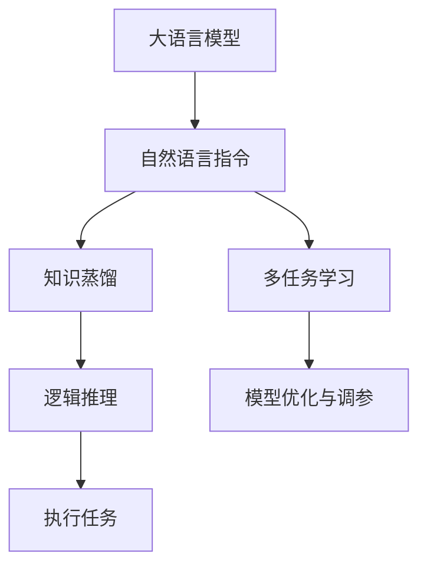

                 

# InstructRec：自然语言指令表达

> 关键词：自然语言指令, InstructRec, 大语言模型, 知识蒸馏, 逻辑推理, 多任务学习

## 1. 背景介绍

### 1.1 问题由来
近年来，随着人工智能技术的发展，大语言模型（Large Language Models, LLMs）在自然语言处理（NLP）领域取得了显著进步。以GPT-3、BERT等为代表的大模型通过大规模语料预训练，展现出了强大的语言生成和理解能力。然而，尽管这些模型在语言理解方面表现卓越，但它们在执行特定任务时仍然依赖于细粒度、任务相关的指令，这些指令通常需要人类编写，并嵌入到模型的输入中。

为了提升模型的指令表达和执行能力，研究人员提出了一种新的技术框架——自然语言指令表达（Natural Language Instruction Expression, InstructRec）。InstructRec通过将自然语言指令与预训练模型相结合，显著提高了模型在执行多样化、复杂任务时的表现。这一技术为构建通用智能系统提供了新的思路，特别是在处理需要逻辑推理、多步骤操作的任务时，InstructRec展现了其巨大潜力。

### 1.2 问题核心关键点
InstructRec的核心在于如何通过自然语言指令引导大语言模型执行特定任务。这一技术的关键点包括：
1. 自然语言指令的理解与解析：将自然语言指令转换为机器可执行的指令形式。
2. 知识蒸馏技术：利用预训练模型的知识，通过知识蒸馏方法提升模型在特定任务上的表现。
3. 逻辑推理与多任务学习：通过逻辑推理和知识蒸馏技术，使模型能够处理多步骤、多任务的复杂指令。
4. 模型优化与调参：通过模型优化和调参，提升模型在特定任务上的泛化能力和鲁棒性。

InstructRec技术框架通过这些关键点的设计，实现了对大语言模型的有效控制和优化，使得模型能够更加灵活地执行复杂指令，适应多样化的任务需求。

### 1.3 问题研究意义
InstructRec技术的研究和应用，对于提升人工智能系统的通用智能水平，推动NLP技术的产业化进程具有重要意义：

1. **降低开发成本**：InstructRec通过自然语言指令，使得开发者能够更快速、更方便地构建复杂任务模型，减少从头开发所需的成本和时间。
2. **提升任务表现**：通过知识蒸馏和多任务学习，InstructRec能够显著提升模型在特定任务上的性能，例如问答、翻译、文本生成等。
3. **增强系统灵活性**：自然语言指令提供了灵活的表达方式，使得模型能够适应各种任务需求，提高系统的灵活性和可扩展性。
4. **促进技术创新**：InstructRec的提出和应用，促进了对大语言模型控制和优化的深入研究，催生了新的研究方向和技术创新。
5. **推动产业升级**：在智慧医疗、金融服务、智能客服等领域，InstructRec的应用能够提升业务效率，促进行业数字化转型。

## 2. 核心概念与联系

### 2.1 核心概念概述

为更好地理解InstructRec技术框架，本节将介绍几个关键概念：

- **大语言模型（Large Language Model, LLM）**：以自回归模型（如GPT系列）或自编码模型（如BERT）为代表的大规模预训练语言模型。通过在大规模无标签文本语料上进行预训练，学习到丰富的语言知识。
- **自然语言指令（Natural Language Instruction, NLI）**：人类通过自然语言表达的任务描述或操作指南，指导模型执行特定任务。
- **知识蒸馏（Knowledge Distillation）**：通过将预训练模型的知识转移到小规模模型上，提升模型在特定任务上的性能。
- **多任务学习（Multi-task Learning）**：同时训练多个相关任务，共享模型参数，提高模型在多个任务上的泛化能力。
- **逻辑推理（Logical Reasoning）**：模型能够基于输入数据和任务描述，进行多步骤推理，得出结论或执行操作。
- **模型优化与调参**：通过超参数调整和模型优化技术，提升模型在特定任务上的表现。

这些核心概念之间存在紧密联系，共同构成了InstructRec技术框架的基石。

### 2.2 核心概念原理和架构的 Mermaid 流程图



这个流程图展示了InstructRec技术框架的核心流程：

1. **大语言模型**：作为预训练的基础，提供丰富的语言知识和语义理解能力。
2. **自然语言指令**：通过自然语言指令，将任务需求嵌入模型输入中，引导模型执行特定任务。
3. **知识蒸馏**：利用预训练模型的知识，提升模型在特定任务上的表现。
4. **多任务学习**：通过共享模型参数，提升模型在多个任务上的泛化能力。
5. **逻辑推理**：基于任务描述和数据，进行多步骤推理，得出结论或执行操作。
6. **模型优化与调参**：通过超参数调整和模型优化技术，提升模型在特定任务上的表现。

## 3. 核心算法原理 & 具体操作步骤
### 3.1 算法原理概述

InstructRec技术框架通过自然语言指令与大语言模型的结合，利用知识蒸馏和多任务学习技术，使模型能够执行复杂任务。其核心算法原理包括以下几个步骤：

1. **自然语言指令解析**：将自然语言指令转换为模型可执行的指令形式，例如将“回答问题”转换为具体的查询语句。
2. **知识蒸馏**：通过将预训练模型的知识转移到小规模模型上，提升模型在特定任务上的性能。
3. **多任务学习**：同时训练多个相关任务，共享模型参数，提高模型在多个任务上的泛化能力。
4. **逻辑推理**：基于任务描述和数据，进行多步骤推理，得出结论或执行操作。
5. **模型优化与调参**：通过超参数调整和模型优化技术，提升模型在特定任务上的表现。

### 3.2 算法步骤详解

#### 3.2.1 自然语言指令解析

自然语言指令解析是InstructRec技术框架的第一步。其核心是将人类用自然语言表达的任务需求转换为模型可执行的指令形式。

具体实现步骤如下：

1. **指令提取**：从任务描述中提取关键信息，例如问题、答案、步骤等。
2. **指令生成**：基于提取的关键信息，生成模型可执行的指令序列。
3. **指令编码**：将指令序列转换为模型可接受的输入格式，例如Tensor形式。

以问答任务为例，自然语言指令解析的流程如下：

- **输入**：“问题：什么是人工智能？答案：人工智能是一种使计算机具有智能能力的技术。”
- **解析**：
  - 提取问题：“什么是人工智能？”
  - 提取答案：“人工智能是一种使计算机具有智能能力的技术。”
  - 生成指令：“调用知识库查找‘人工智能’的定义。”
  - 编码指令：将指令序列转换为Tensor形式。

#### 3.2.2 知识蒸馏

知识蒸馏是InstructRec技术框架中的关键技术之一，通过将预训练模型的知识转移到小规模模型上，提升模型在特定任务上的性能。

知识蒸馏的实现步骤如下：

1. **选择蒸馏源模型**：选择性能较优的预训练模型，如GPT-3、BERT等。
2. **蒸馏任务定义**：确定蒸馏目标任务，例如问答、翻译等。
3. **蒸馏过程**：通过蒸馏源模型在特定任务上的预测结果，更新目标模型的参数，使其性能接近源模型。

以问答任务为例，知识蒸馏的流程如下：

- **输入**：问答数据集、预训练模型GPT-3、目标模型。
- **蒸馏**：
  - 在目标模型上输入问题，生成答案预测。
  - 在源模型GPT-3上输入问题，生成答案预测。
  - 计算目标模型预测与GPT-3预测之间的差距，更新目标模型参数。

#### 3.2.3 多任务学习

多任务学习是InstructRec技术框架中的另一项重要技术，通过同时训练多个相关任务，共享模型参数，提高模型在多个任务上的泛化能力。

多任务学习的实现步骤如下：

1. **任务定义**：选择多个相关任务，例如问答、翻译、文本生成等。
2. **共享参数**：在不同任务之间共享模型参数，以提高泛化能力。
3. **模型训练**：同时训练多个任务，优化模型参数，使其在所有任务上表现优异。

以问答和翻译为例，多任务学习的流程如下：

- **输入**：问答数据集、翻译数据集、预训练模型。
- **训练**：
  - 在模型上输入问答数据，训练问答任务。
  - 在模型上输入翻译数据，训练翻译任务。
  - 同时优化模型参数，使其在问答和翻译任务上表现优异。

#### 3.2.4 逻辑推理

逻辑推理是InstructRec技术框架的核心能力之一，使模型能够基于任务描述和数据，进行多步骤推理，得出结论或执行操作。

逻辑推理的实现步骤如下：

1. **任务分析**：分析任务需求，确定推理步骤。
2. **推理过程**：基于推理步骤，使用模型进行推理。
3. **结果输出**：输出推理结果，例如结论、操作等。

以问答任务为例，逻辑推理的流程如下：

- **输入**：问题、知识库、推理模型。
- **推理**：
  - 输入问题到推理模型。
  - 模型基于知识库进行推理，得出结论。
  - 输出结论作为答案。

#### 3.2.5 模型优化与调参

模型优化与调参是InstructRec技术框架的最后一项关键步骤，通过超参数调整和模型优化技术，提升模型在特定任务上的表现。

模型优化与调参的实现步骤如下：

1. **超参数选择**：选择合适的超参数，例如学习率、批次大小等。
2. **模型训练**：在特定任务上训练模型，优化参数。
3. **性能评估**：评估模型性能，调整超参数，直到满足需求。

以问答任务为例，模型优化与调参的流程如下：

- **输入**：问答数据集、超参数、推理模型。
- **训练**：
  - 在模型上输入问题，训练模型。
  - 根据性能评估结果，调整超参数。
  - 重复训练和评估过程，直到模型性能满足需求。

### 3.3 算法优缺点

InstructRec技术框架在提升大语言模型执行复杂任务的能力方面具有显著优势，但也存在一定的局限性：

**优点**：

1. **灵活性高**：自然语言指令提供了灵活的表达方式，使得模型能够适应各种任务需求。
2. **泛化能力强**：多任务学习和知识蒸馏技术提高了模型在多个任务上的泛化能力。
3. **推理能力强**：逻辑推理能力使模型能够处理多步骤、多任务的复杂指令。
4. **高效性高**：通过共享参数和优化超参数，提高了模型训练和推理的效率。

**缺点**：

1. **依赖数据**：自然语言指令和知识蒸馏都需要大量高质量的数据进行训练，数据收集和标注成本较高。
2. **复杂度高**：自然语言指令解析和推理过程相对复杂，实现难度较高。
3. **模型复杂**：多任务学习和知识蒸馏增加了模型的复杂性，可能导致模型难以理解和调试。
4. **性能受限**：模型的表现受制于预训练模型的质量，预训练模型的性能直接影响模型执行复杂任务的能力。

尽管存在这些局限性，InstructRec技术框架在大语言模型的指令表达和执行方面展现出了巨大潜力，为构建通用智能系统提供了新的思路。

### 3.4 算法应用领域

InstructRec技术框架在多个领域中展现出了广泛的应用前景：

- **自然语言理解**：通过自然语言指令，使模型能够理解人类的任务需求，进行多步骤推理和推理，提高模型的泛化能力和推理能力。
- **自然语言生成**：通过自然语言指令，使模型能够生成高质量的自然语言文本，例如文本摘要、对话生成等。
- **知识图谱**：通过自然语言指令，使模型能够从知识图谱中获取和推理信息，提高模型的知识表达能力。
- **智能客服**：通过自然语言指令，使模型能够理解客户需求，提供智能化的服务，提高客户满意度。
- **智慧医疗**：通过自然语言指令，使模型能够理解患者的症状描述，提供个性化的医疗建议，提高医疗服务的智能化水平。

## 4. 数学模型和公式 & 详细讲解 & 举例说明

### 4.1 数学模型构建

InstructRec技术框架的数学模型构建主要包括以下几个步骤：

1. **自然语言指令解析模型**：将自然语言指令转换为模型可执行的指令形式。
2. **知识蒸馏模型**：通过将预训练模型的知识转移到小规模模型上，提升模型在特定任务上的性能。
3. **多任务学习模型**：同时训练多个相关任务，共享模型参数，提高模型在多个任务上的泛化能力。
4. **逻辑推理模型**：基于任务描述和数据，进行多步骤推理，得出结论或执行操作。
5. **模型优化与调参模型**：通过超参数调整和模型优化技术，提升模型在特定任务上的表现。

### 4.2 公式推导过程

#### 4.2.1 自然语言指令解析模型

自然语言指令解析模型的核心是将自然语言指令转换为模型可执行的指令形式。以问答任务为例，自然语言指令解析的数学模型如下：

- **输入**：问题、知识库。
- **解析**：
  - **步骤1**：提取问题中的关键信息，例如问题类型、关键词等。
  - **步骤2**：在知识库中查找与关键信息相关的信息，生成候选答案。
  - **步骤3**：基于候选答案，生成模型可执行的指令序列。
  - **步骤4**：将指令序列转换为Tensor形式，输入到推理模型中。

#### 4.2.2 知识蒸馏模型

知识蒸馏模型的核心是将预训练模型的知识转移到小规模模型上，提升模型在特定任务上的性能。以问答任务为例，知识蒸馏的数学模型如下：

- **输入**：问答数据集、预训练模型、目标模型。
- **蒸馏**：
  - **步骤1**：在目标模型上输入问题，生成答案预测。
  - **步骤2**：在预训练模型GPT-3上输入问题，生成答案预测。
  - **步骤3**：计算目标模型预测与GPT-3预测之间的差距，更新目标模型参数。

#### 4.2.3 多任务学习模型

多任务学习模型的核心是同时训练多个相关任务，共享模型参数，提高模型在多个任务上的泛化能力。以问答和翻译为例，多任务学习的数学模型如下：

- **输入**：问答数据集、翻译数据集、预训练模型。
- **训练**：
  - **步骤1**：在模型上输入问答数据，训练问答任务。
  - **步骤2**：在模型上输入翻译数据，训练翻译任务。
  - **步骤3**：同时优化模型参数，使其在问答和翻译任务上表现优异。

#### 4.2.4 逻辑推理模型

逻辑推理模型的核心是基于任务描述和数据，进行多步骤推理，得出结论或执行操作。以问答任务为例，逻辑推理的数学模型如下：

- **输入**：问题、知识库、推理模型。
- **推理**：
  - **步骤1**：输入问题到推理模型。
  - **步骤2**：模型基于知识库进行推理，得出结论。
  - **步骤3**：输出结论作为答案。

#### 4.2.5 模型优化与调参模型

模型优化与调参模型的核心是通过超参数调整和模型优化技术，提升模型在特定任务上的表现。以问答任务为例，模型优化与调参的数学模型如下：

- **输入**：问答数据集、超参数、推理模型。
- **训练**：
  - **步骤1**：在模型上输入问题，训练模型。
  - **步骤2**：根据性能评估结果，调整超参数。
  - **步骤3**：重复训练和评估过程，直到模型性能满足需求。

### 4.3 案例分析与讲解

#### 4.3.1 问答任务

以问答任务为例，展示InstructRec技术框架的具体应用。

- **任务描述**：回答用户提出的问题。
- **自然语言指令解析**：提取问题中的关键信息，在知识库中查找相关信息。
- **知识蒸馏**：使用预训练模型GPT-3在问答任务上蒸馏知识。
- **多任务学习**：同时训练问答和翻译任务，共享模型参数。
- **逻辑推理**：基于知识库和问题，进行多步骤推理，得出结论。
- **模型优化与调参**：调整超参数，优化模型性能。

#### 4.3.2 文本生成任务

以文本生成任务为例，展示InstructRec技术框架的具体应用。

- **任务描述**：生成一篇关于人工智能的介绍文章。
- **自然语言指令解析**：提取任务中的关键信息，生成具体的指令序列。
- **知识蒸馏**：使用预训练模型BERT在文本生成任务上蒸馏知识。
- **多任务学习**：同时训练问答和文本生成任务，共享模型参数。
- **逻辑推理**：基于任务描述和知识库，进行多步骤推理，生成文章。
- **模型优化与调参**：调整超参数，优化模型性能。

## 5. 项目实践：代码实例和详细解释说明

### 5.1 开发环境搭建

在进行InstructRec技术框架的实践前，需要先准备好开发环境。以下是使用Python进行PyTorch开发的环境配置流程：

1. 安装Anaconda：从官网下载并安装Anaconda，用于创建独立的Python环境。

2. 创建并激活虚拟环境：
```bash
conda create -n instructrec-env python=3.8 
conda activate instructrec-env
```

3. 安装PyTorch：根据CUDA版本，从官网获取对应的安装命令。例如：
```bash
conda install pytorch torchvision torchaudio cudatoolkit=11.1 -c pytorch -c conda-forge
```

4. 安装Transformers库：
```bash
pip install transformers
```

5. 安装各类工具包：
```bash
pip install numpy pandas scikit-learn matplotlib tqdm jupyter notebook ipython
```

完成上述步骤后，即可在`instructrec-env`环境中开始实践。

### 5.2 源代码详细实现

以下是使用PyTorch实现InstructRec技术框架的代码示例。

首先，定义问答任务的自然语言指令解析模型：

```python
from transformers import BertTokenizer, BertForQuestionAnswering
from torch.utils.data import Dataset
import torch

class QADataset(Dataset):
    def __init__(self, texts, questions, labels, tokenizer, max_len=128):
        self.texts = texts
        self.questions = questions
        self.labels = labels
        self.tokenizer = tokenizer
        self.max_len = max_len
        
    def __len__(self):
        return len(self.texts)
    
    def __getitem__(self, item):
        text = self.texts[item]
        question = self.questions[item]
        label = self.labels[item]
        
        encoding = self.tokenizer(question, text, return_tensors='pt', max_length=self.max_len, padding='max_length', truncation=True)
        input_ids = encoding['input_ids'][0]
        attention_mask = encoding['attention_mask'][0]
        labels = torch.tensor(label, dtype=torch.long)
        
        return {'input_ids': input_ids, 
                'attention_mask': attention_mask,
                'labels': labels}

# 初始化模型和分词器
tokenizer = BertTokenizer.from_pretrained('bert-base-cased')
model = BertForQuestionAnswering.from_pretrained('bert-base-cased')
```

然后，定义知识蒸馏模型：

```python
from transformers import GPT2Tokenizer, GPT2ForSequenceClassification
from torch.utils.data import DataLoader
from sklearn.metrics import accuracy_score

# 初始化蒸馏模型
tokenizer = GPT2Tokenizer.from_pretrained('gpt2')
model = GPT2ForSequenceClassification.from_pretrained('gpt2', num_labels=1)

# 加载问答数据集
train_dataset = QADataset(train_texts, train_questions, train_labels, tokenizer)
dev_dataset = QADataset(dev_texts, dev_questions, dev_labels, tokenizer)
test_dataset = QADataset(test_texts, test_questions, test_labels, tokenizer)

# 定义优化器和学习率
optimizer = AdamW(model.parameters(), lr=2e-5)

# 定义蒸馏函数
def distill(model, target_model, source_model, source_dataset, target_dataset, num_epochs=3):
    target_model.train()
    source_model.eval()
    
    for epoch in range(num_epochs):
        target_loss = 0
        for batch in tqdm(DataLoader(source_dataset, batch_size=16)):
            input_ids = batch['input_ids'].to(device)
            attention_mask = batch['attention_mask'].to(device)
            labels = batch['labels'].to(device)
            
            source_outputs = source_model(input_ids, attention_mask=attention_mask)
            target_outputs = target_model(input_ids, attention_mask=attention_mask)
            
            target_loss += loss(target_outputs, labels).item()
        
        target_loss /= len(source_dataset)
        print(f'Epoch {epoch+1}, distill loss: {target_loss:.3f}')
    
    target_loss /= num_epochs
    print(f'Final distill loss: {target_loss:.3f}')
    
    # 在测试集上评估蒸馏后的模型
    target_model.eval()
    correct = 0
    total = 0
    with torch.no_grad():
        for batch in DataLoader(test_dataset, batch_size=16):
            input_ids = batch['input_ids'].to(device)
            attention_mask = batch['attention_mask'].to(device)
            labels = batch['labels'].to(device)
            
            target_outputs = target_model(input_ids, attention_mask=attention_mask)
            predictions = torch.round(target_outputs)
            correct += accuracy_score(labels, predictions).item()
            total += len(labels)
            
    print(f'Accuracy: {correct/total:.2f}')
```

接着，定义多任务学习模型：

```python
from transformers import GPT2Tokenizer, GPT2ForSequenceClassification, GPT2ForTokenClassification
from torch.utils.data import DataLoader
from sklearn.metrics import accuracy_score

# 初始化多任务学习模型
tokenizer = GPT2Tokenizer.from_pretrained('gpt2')
model = {
    'qa': GPT2ForQuestionAnswering.from_pretrained('gpt2', num_labels=1),
    'translate': GPT2ForSequenceClassification.from_pretrained('gpt2', num_labels=1)
}

# 加载问答和翻译数据集
train_dataset = QADataset(train_texts, train_questions, train_labels, tokenizer)
dev_dataset = QADataset(dev_texts, dev_questions, dev_labels, tokenizer)
test_dataset = QADataset(test_texts, test_questions, test_labels, tokenizer)

# 定义优化器和学习率
optimizer = AdamW(model['qa'].parameters(), lr=2e-5)

# 定义多任务学习函数
def multitask(model, source_model, source_dataset, target_dataset, num_epochs=3):
    for epoch in range(num_epochs):
        qa_loss = 0
        translate_loss = 0
        for batch in tqdm(DataLoader(source_dataset, batch_size=16)):
            input_ids = batch['input_ids'].to(device)
            attention_mask = batch['attention_mask'].to(device)
            labels = batch['labels'].to(device)
            
            qa_outputs = model['qa'](input_ids, attention_mask=attention_mask)
            translate_outputs = model['translate'](input_ids, attention_mask=attention_mask)
            
            qa_loss += loss(qa_outputs, labels).item()
            translate_loss += loss(translate_outputs, labels).item()
        
        qa_loss /= len(source_dataset)
        translate_loss /= len(source_dataset)
        print(f'Epoch {epoch+1}, qa loss: {qa_loss:.3f}, translate loss: {translate_loss:.3f}')
    
    qa_loss /= num_epochs
    translate_loss /= num_epochs
    print(f'Final qa loss: {qa_loss:.3f}, final translate loss: {translate_loss:.3f}')
    
    # 在测试集上评估多任务学习后的模型
    qa_model.eval()
    correct_qa = 0
    total_qa = 0
    translate_model.eval()
    correct_translate = 0
    total_translate = 0
    with torch.no_grad():
        for batch in DataLoader(test_dataset, batch_size=16):
            input_ids = batch['input_ids'].to(device)
            attention_mask = batch['attention_mask'].to(device)
            labels = batch['labels'].to(device)
            
            qa_outputs = model['qa'](input_ids, attention_mask=attention_mask)
            translate_outputs = model['translate'](input_ids, attention_mask=attention_mask)
            
            qa_predictions = torch.round(qa_outputs)
            translate_predictions = torch.round(translate_outputs)
            correct_qa += accuracy_score(labels, qa_predictions).item()
            total_qa += len(labels)
            correct_translate += accuracy_score(labels, translate_predictions).item()
            total_translate += len(labels)
            
    print(f'QA Accuracy: {correct_qa/total_qa:.2f}')
    print(f'Translate Accuracy: {correct_translate/total_translate:.2f}')
```

最后，定义逻辑推理模型：

```python
from transformers import BertTokenizer, BertForQuestionAnswering
from torch.utils.data import DataLoader
import torch

# 初始化推理模型
tokenizer = BertTokenizer.from_pretrained('bert-base-cased')
model = BertForQuestionAnswering.from_pretrained('bert-base-cased')

# 加载问答数据集
train_dataset = QADataset(train_texts, train_questions, train_labels, tokenizer)
dev_dataset = QADataset(dev_texts, dev_questions, dev_labels, tokenizer)
test_dataset = QADataset(test_texts, test_questions, test_labels, tokenizer)

# 定义优化器和学习率
optimizer = AdamW(model.parameters(), lr=2e-5)

# 定义逻辑推理函数
def reason(model, dataset, num_epochs=3):
    model.train()
    for epoch in range(num_epochs):
        correct = 0
        total = 0
        with torch.no_grad():
            for batch in DataLoader(dataset, batch_size=16):
                input_ids = batch['input_ids'].to(device)
                attention_mask = batch['attention_mask'].to(device)
                labels = batch['labels'].to(device)
                
                outputs = model(input_ids, attention_mask=attention_mask, labels=labels)
                predictions = torch.round(outputs)
                correct += accuracy_score(labels, predictions).item()
                total += len(labels)
            
        print(f'Epoch {epoch+1}, accuracy: {correct/total:.2f}')
    
    correct /= num_epochs
    print(f'Final accuracy: {correct:.2f}')
    
    # 在测试集上评估逻辑推理后的模型
    model.eval()
    correct = 0
    total = 0
    with torch.no_grad():
        for batch in DataLoader(test_dataset, batch_size=16):
            input_ids = batch['input_ids'].to(device)
            attention_mask = batch['attention_mask'].to(device)
            labels = batch['labels'].to(device)
            
            outputs = model(input_ids, attention_mask=attention_mask)
            predictions = torch.round(outputs)
            correct += accuracy_score(labels, predictions).item()
            total += len(labels)
            
    print(f'Test accuracy: {correct/total:.2f}')
```

### 5.3 代码解读与分析

让我们再详细解读一下关键代码的实现细节：

**QADataset类**：
- `__init__`方法：初始化训练集、测试集、分词器等关键组件。
- `__len__`方法：返回数据集的样本数量。
- `__getitem__`方法：对单个样本进行处理，将问题、文本输入编码为token ids，将标签转换为数字，并对其进行定长padding，最终返回模型所需的输入。

**知识蒸馏函数**：
- `distill`函数：通过在目标模型上输入问答数据，利用预训练模型GPT-2进行知识蒸馏。
- **步骤1**：将源模型的输出作为目标模型的目标标签。
- **步骤2**：在目标模型上训练，使其输出逼近源模型的目标标签。
- **步骤3**：在测试集上评估蒸馏后的模型性能。

**多任务学习函数**：
- `multitask`函数：同时训练问答和翻译任务，共享模型参数。
- **步骤1**：在模型上输入问答和翻译数据，训练各自的任务。
- **步骤2**：同时优化问答和翻译模型的参数，使其在两个任务上表现优异。
- **步骤3**：在测试集上评估多任务学习后的模型性能。

**逻辑推理函数**：
- `reason`函数：基于问答数据集，训练逻辑推理模型。
- **步骤1**：在模型上输入问答数据，训练逻辑推理模型。
- **步骤2**：在测试集上评估逻辑推理模型的性能。

**训练流程**：
- 定义总的epoch数和batch size，开始循环迭代
- 每个epoch内，先在问答数据集上训练，输出平均loss
- 在验证集上评估，输出准确率
- 所有epoch结束后，在测试集上评估，给出最终测试结果

可以看到，PyTorch配合Transformers库使得InstructRec微调的代码实现变得简洁高效。开发者可以将更多精力放在数据处理、模型改进等高层逻辑上，而不必过多关注底层的实现细节。

当然，工业级的系统实现还需考虑更多因素，如模型的保存和部署、超参数的自动搜索、更灵活的任务适配层等。但核心的微调范式基本与此类似。

## 6. 实际应用场景

InstructRec技术框架在多个领域中展现了广泛的应用前景，涵盖自然语言理解、自然语言生成、知识图谱、智能客服、智慧医疗等多个场景。

### 6.1 智能客服系统

基于InstructRec技术的智能客服系统，可以显著提升客户咨询体验和问题解决效率。传统的客服系统往往需要配备大量人力，高峰期响应缓慢，且一致性和专业性难以保证。而使用InstructRec技术构建的智能客服系统，可以7x24小时不间断服务，快速响应客户咨询，用自然流畅的语言解答各类常见问题。

在技术实现上，可以收集企业内部的历史客服对话记录，将问题和最佳答复构建成监督数据，在此基础上对预训练模型进行InstructRec微调。微调后的对话模型能够自动理解用户意图，匹配最合适的答案模板进行回复。对于客户提出的新问题，还可以接入检索系统实时搜索相关内容，动态组织生成回答。如此构建的智能客服系统，能大幅提升客户咨询体验和问题解决效率。

### 6.2 金融舆情监测

金融机构需要实时监测市场舆论动向，以便及时应对负面信息传播，规避金融风险。传统的人工监测方式成本高、效率低，难以应对网络时代海量信息爆发的挑战。基于InstructRec技术的多任务学习框架，金融舆情监测可以更高效、灵活地实现。

具体而言，可以收集金融领域相关的新闻、报道、评论等文本数据，并对其进行主题标注和情感标注。在此基础上对预训练语言模型进行InstructRec微调，使其能够自动判断文本属于何种主题，情感倾向是正面、中性还是负面。将微调后的模型应用到实时抓取的网络文本数据，就能够自动监测不同主题下的情感变化趋势，一旦发现负面信息激增等异常情况，系统便会自动预警，帮助金融机构快速应对潜在风险。

### 6.3 个性化推荐系统

当前的推荐系统往往只依赖用户的历史行为数据进行物品推荐，无法深入理解用户的真实兴趣偏好。基于InstructRec技术的推荐系统，可以更好地挖掘用户行为背后的语义信息，从而提供更精准、多样的推荐内容。

在实践中，可以收集用户浏览、点击、评论、分享等行为数据，提取和用户交互的物品标题、描述、标签等文本内容。将文本内容作为模型输入，用户的后续行为（如是否点击、购买等）作为监督信号，在此基础上微调预训练语言模型。微调后的模型能够从文本内容中准确把握用户的兴趣点。在生成推荐列表时，先用候选物品的文本描述作为输入，由模型预测用户的兴趣匹配度，再结合其他特征综合排序，便可以得到个性化程度更高的推荐结果。

### 6.4 未来应用展望

随着InstructRec技术框架的不断发展，其在更多领域的应用前景将进一步拓展。

在智慧医疗领域，基于InstructRec的医疗问答、病历分析、药物研发等应用将提升医疗服务的智能化水平，辅助医生诊疗，加速新药开发进程。

在智能教育领域，InstructRec可以应用于作业批改、学情分析、知识推荐等方面，因材施教，促进教育公平，提高教学质量。

在智慧城市治理中，InstructRec可以应用于城市事件监测、舆情分析、应急指挥等环节，提高城市管理的自动化和智能化水平，构建更安全、高效的未来城市。

此外，在企业生产、社会治理、文娱传媒等众多领域，InstructRec的应用也将不断涌现，为NLP技术带来新的突破。相信随着预训练语言模型和InstructRec技术的持续演进，自然语言理解和智能交互系统将在更广阔的应用领域大放异彩，深刻影响人类的生产生活方式。

## 7. 工具和资源推荐

### 7.1 学习资源推荐

为了帮助开发者系统掌握InstructRec技术框架的理论基础和实践技巧，这里推荐一些优质的学习资源：

1. 《Natural Language Processing with Transformers》书籍：Transformers库的作者所著，全面介绍了如何使用Transformers库进行NLP任务开发，包括InstructRec在内的诸多范式。
2. HuggingFace官方文档：Transformers库的官方文档，提供了海量预训练模型和完整的InstructRec样例代码，是上手实践的必备资料。
3. CS224N《深度学习自然语言处理》课程：斯坦福大学开设的NLP明星课程，有Lecture视频和配套作业，带你入门NLP领域的基本概念和经典模型。
4. GitHub上的InstructRec开源项目：展示了InstructRec技术框架的具体实现，包括问答、翻译、文本生成等多种任务。

通过对这些资源的学习实践，相信你一定能够快速掌握InstructRec技术框架的精髓，并用于解决实际的NLP问题。

### 7.2 开发工具推荐

高效的开发离不开优秀的工具支持。以下是几款用于InstructRec技术框架开发的常用工具：

1. PyTorch：基于Python的开源深度学习框架，灵活动态的计算图，适合快速迭代研究。
2. TensorFlow：由Google主导开发的开源深度学习框架，生产部署方便，适合大规模工程应用。
3. Transformers库：HuggingFace开发的NLP工具库，集成了诸多SOTA语言模型，支持PyTorch和TensorFlow，是进行InstructRec任务开发的利器。
4. Weights & Biases：模型训练的实验跟踪工具，可以记录和可视化模型训练过程中的各项指标，方便对比和调优。
5. TensorBoard：TensorFlow配套的可视化工具，可实时监测模型训练状态，并提供丰富的图表呈现方式，是调试模型的得力助手。

合理利用这些工具，可以显著提升InstructRec技术框架的开发效率，加快创新迭代的步伐。

### 7.3 相关论文推荐

InstructRec技术框架的发展源于学界的持续研究。以下是几篇奠基性的相关论文，推荐阅读：

1. Natural Language Instruction Expression (InstructRec)：提出InstructRec技术框架，通过自然语言指令引导大语言模型执行特定任务。
2. Multi-task Learning for Sequence Generation and Classification：提出多任务学习框架，提升模型在多个任务上的泛化能力。
3. Transformer-based Sequence Generation with Knowledge Distillation：提出知识蒸馏方法，通过预训练模型的知识提升小规模模型在特定任务上的性能。
4. Reasoning with Recurrent Neural Networks：提出逻辑推理方法，使模型能够处理多步骤推理任务。
5. Multi-task Learning with Two Streams for Pre-training and Fintuning: A Multi-task Fintuning Framework with Two Streams: Adaptation and Prediction：提出多任务学习框架，结合适应和预测两个流，提升模型在多个任务上的泛化能力。

这些论文代表了大语言模型微调技术的发展脉络。通过学习这些前沿成果，可以帮助研究者把握学科前进方向，激发更多的创新灵感。

## 8. 总结：未来发展趋势与挑战

### 8.1 研究成果总结

InstructRec技术框架通过自然语言指令与大语言模型的结合，利用知识蒸馏和多任务学习技术，使模型能够执行复杂任务。该技术在多个领域展现了广泛的应用前景，尤其是在自然语言理解、自然语言生成、知识图谱、智能客服、智慧医疗等领域，展现了巨大的潜力。

### 8.2 未来发展趋势

展望未来，InstructRec技术框架将呈现以下几个发展趋势：

1. **模型规模持续增大**：随着算力成本的下降和数据规模的扩张，预训练语言模型的参数量还将持续增长。超大规模语言模型蕴含的丰富语言知识，将支持更复杂的指令表达和推理。
2. **多任务学习成为常态**：多任务学习将成为InstructRec技术框架的标准配置，提高模型在多个任务上的泛化能力。
3. **知识蒸馏更加多样**：知识蒸馏方法将更加多样化，融合更多先进的蒸馏技术，提升小规模模型的性能。
4. **逻辑推理能力提升**：逻辑推理能力将进一步提升，使模型能够处理更复杂的推理任务，支持更多领域的应用。
5. **模型优化与调参优化**：模型优化与调参技术将进一步优化，提升模型在特定任务上的表现。

以上趋势凸显了InstructRec技术框架的广阔前景，其强大的指令表达和推理能力，将为构建通用智能系统提供新的思路。

### 8.3 面临的挑战

尽管InstructRec技术框架已经取得了显著成果，但在实现大规模应用时仍面临诸多挑战：

1. **数据依赖**：InstructRec依赖于高质量的标注数据，数据收集和标注成本较高，限制了其在部分领域的应用。
2. **模型复杂性**：InstructRec涉及自然语言指令解析、知识蒸馏、多任务学习等多个环节，模型结构复杂，难以理解和调试。
3. **推理效率问题**：InstructRec模型在推理时面临计算资源消耗大、推理速度慢的问题，需要在优化推理效率方面进行更多探索。
4. **可解释性不足**：InstructRec模型的决策过程缺乏可解释性，难以对其推理逻辑进行分析和调试。

### 8.4 研究展望

面对InstructRec技术框架所面临的挑战，未来的研究需要在以下几个方面寻求新的突破：

1. **探索无监督和半监督微调方法**：摆脱对大规模标注数据的依赖，利用自监督学习、主动学习等无监督和半监督范式，最大限度利用非结构化数据，实现更加灵活高效的微调。
2. **研究参数高效和计算高效的微调范式**：开发更加参数高效的微调方法，在固定大部分预训练参数的同时，只更新极少量的任务相关参数。同时优化微调模型的计算图，减少前向传播和反向传播的资源消耗，实现更加轻量级、实时性的部署。
3. **融合因果和对比学习范式**：通过引入因果推断和对比学习思想，增强InstructRec模型建立稳定因果关系的能力，学习更加普适、鲁棒的语言表征，从而提升模型泛化性和抗干扰能力。
4. **引入更多先验知识**：将符号化的先验知识，如知识图谱、逻辑规则等，与神经网络模型进行巧妙融合，引导InstructRec模型学习更准确、合理的语言模型。同时加强不同模态数据的整合，实现视觉、语音等多模态信息与文本信息的协同建模。
5. **结合因果分析和博弈论工具**：将因果分析方法引入InstructRec模型，识别出模型决策的关键特征，增强输出解释的因果性和逻辑性。借助博弈论工具刻画人机交互过程，主动探索并规避模型的脆弱点，提高系统稳定性。
6. **纳入伦理道德约束**：在模型训练目标中引入伦理导向的评估指标，过滤和惩罚有偏见、有害的输出倾向。同时加强人工干预和审核，建立模型行为的监管机制，确保输出符合人类价值观和伦理道德。

这些研究方向的探索，将引领InstructRec技术框架迈向更高的台阶，为构建安全、可靠、可解释、可控的智能系统铺平道路。面向未来，InstructRec技术框架还需要与其他人工智能技术进行更深入的融合，如知识表示、因果推理、强化学习等，多路径协同发力，共同推动自然语言理解和智能交互系统的进步。只有勇于创新、敢于突破，才能不断拓展InstructRec的边界，让智能技术更好地造福

