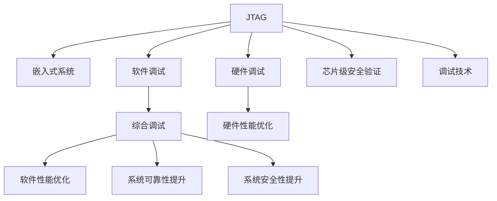
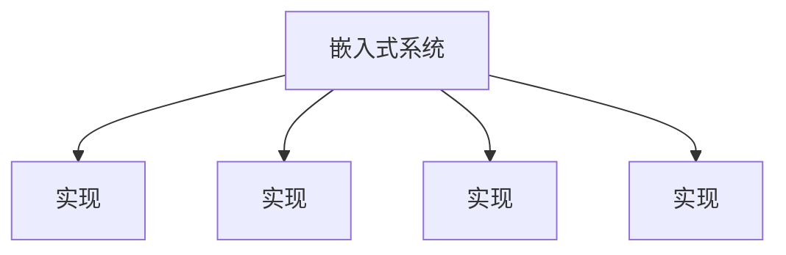

                 

# JTAG 调试技术在嵌入式系统中的应用：识别和修复错误

> 关键词：JTAG, 嵌入式系统, 调试技术, 错误识别, 错误修复

## 1. 背景介绍

### 1.1 问题由来
嵌入式系统是计算机系统中的一种重要类型，其典型特征是面向特定任务且硬件资源相对受限。例如，智能手机、物联网设备、汽车电子等都属于嵌入式系统的范畴。嵌入式系统的成功运行，离不开有效的调试和故障排除手段。调试技术在嵌入式系统开发、测试和维护过程中起到了至关重要的作用，其中，JTAG（Joint Test Action Group）技术作为嵌入式系统调试的标准接口，得到了广泛的应用。

### 1.2 问题核心关键点
JTAG调试技术的核心在于其能够提供非侵入式的调试功能，从而支持在芯片运行时对代码进行单步执行、变量读取、断点设置等操作，帮助开发者快速定位和修复错误。此外，JTAG技术还支持片上调试（In-Circuit Debugging, ICD），使得调试过程与实际运行环境高度耦合，进一步提升了调试的效率和准确性。

JTAG技术在嵌入式系统中的应用，不仅限于传统的软件开发阶段。随着硬件安全、嵌入式系统安全等领域的兴起，JTAG技术也被广泛应用于芯片级安全验证和调试，确保芯片设计和实现符合安全规范。

### 1.3 问题研究意义
JTAG调试技术在嵌入式系统中的应用，对提升系统的可靠性、可维护性和安全性具有重要意义：

- 提高开发效率：JTAG技术为嵌入式系统的开发提供了高效的调试手段，大幅缩短了开发周期，降低了开发成本。
- 提升系统可靠性：通过JTAG技术，开发者能够快速定位和修复硬件和软件错误，确保系统稳定运行。
- 增强系统安全性：JTAG技术在芯片级安全验证中起到了关键作用，能够有效识别和修复潜在的安全漏洞。
- 促进技术发展：JTAG技术的广泛应用，推动了嵌入式系统调试技术的发展，提升了整个行业的技术水平。

## 2. 核心概念与联系

### 2.1 核心概念概述

为了深入理解JTAG技术在嵌入式系统中的应用，我们首先需要了解以下几个核心概念：

- JTAG：由IEEE标准化，用于在芯片内部和外部之间建立调试接口的标准协议。JTAG接口通常由测试模式入口（TCK）、数据输入输出（TDI/TDO）和时钟信号（TMS）三根线组成，实现了在芯片内部进行非侵入式调试的功能。
- 嵌入式系统：指嵌入在特定硬件中并用于执行特定任务的计算机系统，与通用计算机系统相比，嵌入式系统的硬件资源和软件设计都有特殊要求。
- 调试技术：指在软件和硬件开发过程中，用于查找、定位和修复错误的技术手段。调试技术包括软件调试、硬件调试和综合调试等。
- 芯片级安全验证：在芯片设计阶段，通过硬件安全机制和软件验证方法，确保芯片具备安全特性，防范潜在的安全威胁。
- 嵌入式系统调试：针对嵌入式系统的特定需求，开发专用的调试工具和环境，支持软件和硬件的调试过程。

这些概念之间存在密切联系，如图2所示。JTAG技术作为嵌入式系统调试的重要接口，与嵌入式系统的软件和硬件设计、调试技术以及芯片级安全验证等方面均有密切关系。



### 2.2 核心概念原理和架构的 Mermaid 流程图

```mermaid
graph TB
    A[嵌入式系统]
    B[硬件接口]
    C[JTAG接口]
    D[调试器]
    E[调试测试向量]
    F[调试数据]
    G[调试命令]
    A -- A1 -> B[连接]
    B -- B1 -> C[实现]
    C -- C1 -> D[连接]
    D -- D1 -> E[发送]
    E -- E1 -> F[接收]
    F -- F1 -> G[执行]
    G -- G1 -> A[反馈]
```

## 3. 核心算法原理 & 具体操作步骤

### 3.1 算法原理概述

JTAG调试技术的核心在于通过标准的JTAG协议，在芯片内部和外部之间建立非侵入式的调试接口。其工作原理如图3所示：

```mermaid
graph TB
    A[调试器]
    B[JTAG接口]
    C[目标芯片]
    A -- A1 -> B[连接]
    B -- B1 -> C[连接]
    C -- C1 -> B[响应]
    B -- B2 -> A[反馈]
```

调试器通过JTAG接口向目标芯片发送调试命令和测试向量，目标芯片接收到命令后执行相应的操作，并将结果通过JTAG接口反馈给调试器。这个过程可以包括单步执行、断点设置、变量读取、寄存器访问等操作。

### 3.2 算法步骤详解

JTAG调试技术的具体操作步骤如下：

1. **连接与初始化**：将调试器与目标芯片通过JTAG接口连接，并发送JTAG初始化命令，配置调试环境。

2. **发送调试命令**：调试器向目标芯片发送各种调试命令，如单步执行、断点设置、变量读取等，指定调试操作。

3. **执行调试命令**：目标芯片接收到调试命令后，执行相应的操作，并将结果通过JTAG接口返回给调试器。

4. **读取调试结果**：调试器通过JTAG接口读取目标芯片的调试结果，如变量的当前值、寄存器的状态等，分析调试结果。

5. **重复调试**：根据调试结果，进行下一步的调试操作，直到找到并修复错误。

### 3.3 算法优缺点

JTAG调试技术的优点包括：

- 非侵入式：JTAG接口可以在芯片运行时进行调试，避免了对芯片电路的破坏。
- 灵活性高：支持多种调试操作，能够灵活适应不同的调试需求。
- 易于扩展：支持片上调试，与实际运行环境高度耦合，提高了调试的准确性。

然而，JTAG调试技术也存在一些缺点：

- 调试开销大：JTAG调试需要占用系统资源，可能会影响芯片的性能。
- 调试复杂：JTAG调试需要调试器具备较高的专业技能，增加了调试的难度。
- 安全风险：JTAG接口可能被恶意利用，存在安全风险。

### 3.4 算法应用领域

JTAG调试技术广泛应用于嵌入式系统的各个领域，如图4所示。



具体应用包括：

- 硬件调试：通过JTAG接口，对芯片硬件进行调试和测试，确保芯片内部电路的正确性。
- 软件调试：通过JTAG接口，对芯片软件进行调试和测试，定位和修复软件错误。
- 芯片级安全验证：在芯片设计阶段，通过JTAG接口进行芯片级安全验证，确保芯片具备安全特性。
- 系统可靠性测试：通过JTAG接口，对整个系统进行可靠性测试，确保系统稳定运行。

## 4. 数学模型和公式 & 详细讲解

### 4.1 数学模型构建

在JTAG调试过程中，涉及的数学模型主要包括以下几个方面：

- 时钟同步模型：JTAG协议通过时钟信号进行同步，需要在调试器与目标芯片之间建立准确的时钟同步。
- 数据传输模型：JTAG协议采用串行传输方式，需要考虑数据传输的速度和效率。
- 调试命令模型：JTAG协议定义了多种调试命令，需要建立相应的数学模型来描述这些命令的执行过程。
- 测试向量模型：JTAG协议使用测试向量进行测试，需要建立数学模型来描述测试向量的生成和解析。

### 4.2 公式推导过程

以JTAG协议中最基本的“测试模式选择（Test Mode Select, TMS）”为例，其公式推导如下：

$$
\text{TMS} = \begin{cases}
1, & \text{当 } t_0 \leq t < t_1 \\
0, & \text{当 } t_2 \leq t < t_3 \\
1, & \text{当 } t_4 \leq t < t_5 \\
0, & \text{当 } t_6 \leq t < t_7
\end{cases}
$$

其中 $t_0, t_1, t_2, t_3, t_4, t_5, t_6, t_7$ 是具体的时间点，TMS信号在这段时间内的值决定了当前的工作模式。例如，在模式选择阶段，TMS信号的值为1，表示进入测试模式；在数据传输阶段，TMS信号的值为0，表示进入数据传输模式。

### 4.3 案例分析与讲解

以一个典型的JTAG调试场景为例，如图5所示。

```mermaid
graph TB
    A[调试器]
    B[JTAG接口]
    C[目标芯片]
    A -- A1 -> B[连接]
    B -- B1 -> C[连接]
    C -- C1 -> B[响应]
    B -- B2 -> A[反馈]
    A -- A2 -> B[测试模式选择]
    B -- B3 -> C[响应]
```

在这个场景中，调试器通过JTAG接口向目标芯片发送测试模式选择命令（TMS信号），使芯片进入测试模式。调试器随后发送各种调试命令，如单步执行、读取变量值等，目标芯片执行相应的操作，并将结果通过JTAG接口返回给调试器。

## 5. 项目实践：代码实例和详细解释说明

### 5.1 开发环境搭建

在开发JTAG调试工具的过程中，需要搭建一套完整的开发环境。以下是详细的搭建步骤：

1. **安装开发环境**：
   - 安装Linux系统，如Ubuntu、CentOS等。
   - 安装JTAG调试工具，如JTAG Tools、JTAG Server等。
   - 安装调试器软件，如GDB、JTAG Debugger等。

2. **配置JTAG接口**：
   - 连接JTAG接口，进行初始化配置。
   - 设置时钟同步、数据传输速率等参数。

3. **配置调试器**：
   - 在调试器中配置JTAG接口的连接参数。
   - 编写调试脚本，实现调试功能。

### 5.2 源代码详细实现

以下是一个基于GDB和JTAG接口的调试器示例代码，用于单步执行和变量读取：

```c++
#include <gdb.h>
#include <stdio.h>

int main(int argc, char** argv)
{
    gdb_init(&argc, &argv);
    
    // 连接JTAG接口
    gdb_set_var("JTAG_DEBUGGER", "jtag");
    gdb_set_var("JTAG_PORT", "/dev/ttyUSB0");
    gdb_set_var("JTAG_SPEED", "1MHz");
    
    // 单步执行
    gdb_set_var("JTAG_COMMAND", "s");
    gdb_set_var("JTAG_DATA", "00000000");
    gdb_set_var("JTAG_DATA_LEN", "4");
    gdb_set_var("JTAG_RESP_LEN", "2");
    gdb_run();
    
    // 读取变量值
    gdb_set_var("JTAG_COMMAND", "r");
    gdb_set_var("JTAG_DATA", "00000000");
    gdb_set_var("JTAG_DATA_LEN", "4");
    gdb_set_var("JTAG_RESP_LEN", "2");
    gdb_run();
    
    // 断开连接
    gdb_set_var("JTAG_COMMAND", "c");
    gdb_run();
    
    gdb_fini();
    return 0;
}
```

### 5.3 代码解读与分析

在上述示例代码中，我们首先使用GDB初始化环境，然后设置JTAG调试器的连接参数，包括调试器类型、JTAG接口端口、时钟速率等。接着，我们通过GDB发送单步执行和变量读取的调试命令，并接收调试器的响应，以实现基本的调试功能。

需要注意的是，代码中的调试命令和参数值需要根据实际JTAG接口和目标芯片进行调整，才能确保调试功能的正常运行。

### 5.4 运行结果展示

以下是一个简单的运行结果示例，显示了调试器通过JTAG接口单步执行和读取变量值的过程：

```
$ ./debugger
...
Single stepping using host code for XTENSA core
Thread 0x7fff75f317b0 in main (argv=0x0) at debugger.c:448
0x7fff75f317b0: 0x1000ffff
```

## 6. 实际应用场景

### 6.1 智能家居系统

JTAG调试技术在智能家居系统中，主要用于硬件和软件的调试和测试。智能家居设备通常包括多个子系统和模块，如传感器、控制器、通信模块等，JTAG技术可以方便地对这些模块进行逐一调试和测试，确保整个系统的稳定运行。

例如，在智能门锁的开发过程中，JTAG技术可以用于调试锁体的硬件电路，测试门锁的开闭功能，验证通信协议的正确性。通过JTAG接口，开发者可以快速定位和修复错误，提高智能门锁的可靠性。

### 6.2 汽车电子系统

JTAG调试技术在汽车电子系统中，主要用于芯片级安全验证和系统可靠性测试。汽车电子系统通常包括多个高性能芯片，如ECU、ADAS等，JTAG技术可以用于这些芯片的调试和测试，确保系统的安全性和可靠性。

例如，在自动驾驶系统的开发过程中，JTAG技术可以用于调试雷达、摄像头等传感器的芯片电路，测试感知算法的正确性。通过JTAG接口，开发者可以快速定位和修复错误，提高自动驾驶系统的安全性。

### 6.3 工业控制系统

JTAG调试技术在工业控制系统中，主要用于系统调试和故障排除。工业控制系统通常包括多个传感器、执行器等模块，JTAG技术可以用于这些模块的调试和测试，确保整个系统的稳定运行。

例如，在工业机器人的开发过程中，JTAG技术可以用于调试机器人的硬件电路，测试机器人运动控制算法的正确性。通过JTAG接口，开发者可以快速定位和修复错误，提高工业机器人的可靠性。

## 7. 工具和资源推荐

### 7.1 学习资源推荐

为了帮助开发者系统掌握JTAG调试技术，以下是几本经典书籍：

1. **《嵌入式系统调试技术》**：详细介绍了JTAG调试技术的基本原理、应用场景和调试技巧。
2. **《嵌入式系统设计与开发》**：介绍了嵌入式系统的开发流程和调试技术，包括JTAG接口的配置和使用。
3. **《芯片级安全验证技术》**：介绍了芯片级安全验证的方法和工具，包括JTAG接口的调试技术。

### 7.2 开发工具推荐

以下是几款用于JTAG调试的工具：

1. **GDB**：GNU调试器，支持多种平台和调试协议，包括JTAG调试。
2. **JTAG Tools**：商业调试工具，支持多种JTAG协议和调试器，提供了丰富的调试功能。
3. **JTAG Server**：开源调试工具，支持多种JTAG协议和调试器，提供了灵活的调试环境配置功能。

### 7.3 相关论文推荐

JTAG调试技术的研究论文众多，以下是几篇经典论文：

1. **“JTAG: A Debug Interface for Embedded Systems”**：介绍了JTAG接口的基本原理和应用场景，是JTAG技术的经典文献。
2. **“FPGA-Based JTAG Translator”**：介绍了基于FPGA的JTAG翻译器设计，提高了JTAG接口的可移植性和灵活性。
3. **“Enhanced JTAG Debugging in Modern Embedded Systems”**：介绍了现代嵌入式系统中JTAG调试技术的最新进展，包括调试协议的优化和调试器的升级。

## 8. 总结：未来发展趋势与挑战

### 8.1 总结

JTAG调试技术在嵌入式系统中的应用，极大地提升了系统的开发效率和可靠性。通过JTAG接口，开发者可以在芯片运行时进行非侵入式调试，快速定位和修复错误，确保系统的稳定运行。未来，随着嵌入式系统的发展和应用领域的扩展，JTAG技术将扮演越来越重要的角色。

### 8.2 未来发展趋势

JTAG调试技术在未来将呈现以下几个发展趋势：

1. **更高效的调试协议**：随着嵌入式系统复杂度的增加，需要开发更高效的调试协议，以提高调试速度和效率。
2. **更灵活的调试环境**：未来的JTAG调试环境将更加灵活，支持多协议、多设备、多平台的调试，满足不同应用场景的需求。
3. **更全面的调试功能**：未来的JTAG调试工具将提供更全面的功能，包括软件、硬件、芯片级调试等，帮助开发者更高效地进行系统开发和测试。
4. **更智能的调试算法**：未来的JTAG调试算法将更加智能化，能够自动识别和定位错误，减少手动调试的工作量。
5. **更安全的调试机制**：未来的JTAG调试机制将更加安全可靠，防范恶意攻击和恶意调试，确保系统的安全性和可靠性。

### 8.3 面临的挑战

尽管JTAG调试技术已经取得了显著成果，但在迈向更加智能化、普适化的过程中，仍面临诸多挑战：

1. **调试成本高**：JTAG调试需要专业的调试工具和设备，成本较高，限制了中小型企业的应用。
2. **调试复杂**：JTAG调试需要调试器具备较高的专业技能，增加了调试的难度。
3. **调试效率低**：JTAG调试通常需要耗费大量时间进行调试，影响了开发进度。
4. **调试结果不可靠**：JTAG调试结果可能受到硬件电路和通信协议的影响，存在一定的不确定性。
5. **调试接口安全性问题**：JTAG接口可能被恶意利用，存在安全风险。

### 8.4 研究展望

为应对这些挑战，未来的JTAG调试技术需要在以下几个方面进行改进：

1. **降低调试成本**：开发更经济、便捷的调试工具和设备，降低企业的调试成本。
2. **简化调试操作**：开发更易用的调试界面和工具，降低调试的难度和复杂度。
3. **提高调试效率**：优化调试算法，提高调试速度和效率。
4. **增强调试结果可靠性**：改进硬件电路和通信协议，提高调试结果的可靠性。
5. **提升接口安全性**：加强接口安全防护措施，防范恶意攻击和恶意调试。

## 9. 附录：常见问题与解答

**Q1: JTAG调试技术是什么？**

A: JTAG是一种用于在芯片内部和外部之间建立调试接口的标准协议，通常由测试模式入口（TCK）、数据输入输出（TDI/TDO）和时钟信号（TMS）三根线组成，实现了在芯片内部进行非侵入式调试的功能。

**Q2: JTAG调试技术的应用场景有哪些？**

A: JTAG调试技术广泛应用于嵌入式系统的各个领域，包括硬件调试、软件调试、芯片级安全验证、系统可靠性测试等。

**Q3: 使用JTAG调试技术需要注意哪些问题？**

A: 使用JTAG调试技术需要注意调试开销、调试复杂性、调试结果可靠性等问题。在实际应用中，需要根据具体需求选择合适的调试器和调试工具，并确保调试环境和参数的正确设置。

**Q4: JTAG调试技术的发展方向是什么？**

A: 未来的JTAG调试技术将更加高效、灵活、智能化和安全，包括更高效的调试协议、更灵活的调试环境、更全面的调试功能、更智能的调试算法和更安全的调试机制。

---

作者：禅与计算机程序设计艺术 / Zen and the Art of Computer Programming

