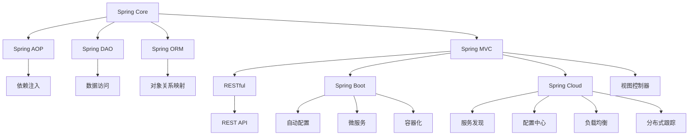

                 

# Java 企业级开发框架：Spring 和 Java EE 的比较

> 关键词：Spring, Java EE, 企业级开发, RESTful, Spring Boot, Spring Cloud, 容器化, 微服务, 性能优化

## 1. 背景介绍

在当今的企业级应用开发中，框架扮演着至关重要的角色。随着Java平台不断发展，开发框架也在不断演变。Java EE作为Java平台的核心，提供了丰富的标准API，而Spring作为Java开发的重要框架，已经被广泛应用于各种企业级应用中。本文将对比Java EE和Spring，讨论它们各自的优缺点，以及在实际开发中的应用场景。

## 2. 核心概念与联系

### 2.1 核心概念概述

#### 2.1.1 Java EE

Java EE（Java Platform, Enterprise Edition），即Java平台企业版，是一套技术规范，提供了一套组件模型和API，支持企业级的Web应用开发。它包括多个模块，如JSP、Servlet、JavaServer Faces（JSF）、JPA、JAX-RS、JMS等，涵盖了Web应用、企业服务、事务处理、安全性等各个方面。

#### 2.1.2 Spring

Spring是一个开源的Java框架，旨在简化企业级应用开发。Spring主要分为以下几个模块：Spring Core、Spring AOP、Spring DAO、Spring ORM、Spring MVC等。Spring Framework提供了一套框架核心和周边模块，使得开发者可以使用POJO作为组件，简化开发流程。

### 2.2 核心概念原理和架构的 Mermaid 流程图



### 2.3 核心概念原理和架构的 Mermaid 流程图说明

- `Spring Core`：Spring框架的核心模块，提供了依赖注入（DI）和控制反转（IoC）等基本功能。
- `Spring AOP`：提供了切面编程的支持，可以在不修改现有代码的情况下，实现横切关注点的功能。
- `Spring DAO`：提供了数据访问层的基本功能，简化ORM的开发。
- `Spring ORM`：支持多种ORM框架，如Hibernate、JPA等，提供了对象关系映射的功能。
- `Spring MVC`：提供了Web MVC框架，支持RESTful API的开发。
- `RESTful`：基于REST的API设计风格，使得Web服务的开发更加灵活和可扩展。
- `Spring Boot`：基于Spring的快速开发框架，提供了自动配置、内嵌Tomcat等功能，简化Web应用的开发和部署。
- `Spring Cloud`：提供了微服务的开发支持，包括服务发现、配置中心、负载均衡等功能。
- `依赖注入`：通过IoC容器管理组件的创建和销毁，实现了松耦合。
- `数据访问`：提供标准的数据访问API，简化数据访问的实现。
- `对象关系映射`：将对象与数据库之间的映射，简化ORM的开发。
- `视图控制器`：负责处理Web请求，调用业务逻辑层，并返回视图或JSON响应。
- `REST API`：通过HTTP协议，实现Web服务的远程调用。
- `自动配置`：Spring Boot根据配置文件自动配置组件，简化了配置和部署。
- `微服务`：将应用拆分成多个服务，通过网络调用相互协作。
- `容器化`：将应用打包为容器镜像，简化部署和扩展。
- `服务发现`：微服务架构中的服务发现机制，使得服务能够自动注册和发现。
- `配置中心`：微服务架构中的配置中心，使得所有服务共享配置信息。
- `负载均衡`：微服务架构中的负载均衡机制，确保服务的稳定性和可靠性。
- `分布式跟踪`：微服务架构中的分布式跟踪机制，便于监控和诊断。

## 3. 核心算法原理 & 具体操作步骤

### 3.1 算法原理概述

#### 3.1.1 基本概念

Java EE和Spring都提供了丰富的API和组件，使得企业级应用开发更加便捷。Java EE通过一组标准化的API，提供了企业级的Web应用开发框架，而Spring则提供了一套灵活的开发框架，简化了企业级应用的开发流程。

#### 3.1.2 主要区别

Java EE和Spring的主要区别在于设计和实现上。Java EE由一组标准API组成，提供了完整的Web应用开发框架，而Spring则提供了一套灵活的开发框架，可以与多种Web应用框架（如Spring MVC）结合使用。

### 3.2 算法步骤详解

#### 3.2.1 Java EE的开发流程

1. 项目初始化：创建一个Maven或Gradle项目，引入Java EE的依赖。
2. 配置Web.xml：配置Web应用的服务和组件。
3. 实现业务逻辑：编写Java类实现业务逻辑。
4. 配置数据库：配置JPA或JDBC连接数据库。
5. 编写Web层代码：实现JSP、Servlet等Web层组件。
6. 部署应用：将Web应用打包为war文件，部署到应用服务器。

#### 3.2.2 Spring的开发流程

1. 项目初始化：创建一个Maven或Gradle项目，引入Spring的依赖。
2. 实现业务逻辑：编写Java类实现业务逻辑。
3. 配置Spring组件：使用注解或XML配置Spring组件。
4. 编写Web层代码：实现Spring MVC控制器、视图、数据访问层等。
5. 部署应用：将Spring应用打包为jar文件，启动Spring Boot或嵌入Tomcat。

### 3.3 算法优缺点

#### 3.3.1 Java EE的优缺点

**优点**：

- 标准规范：Java EE提供了一套标准化的API，使得应用开发和部署具有高度的互操作性。
- 组件丰富：Java EE提供了丰富的组件，如JPA、JMS、JAX-RS等，支持企业级应用的各种需求。
- 成熟稳定：Java EE由Java平台开发，有着广泛的生态系统和社区支持。

**缺点**：

- 复杂繁琐：Java EE的开发流程较为复杂，需要编写大量的XML配置文件。
- 性能开销：Java EE的应用服务器和组件增加了应用的性能开销。
- 学习曲线：Java EE的学习曲线较陡峭，需要掌握大量的标准API和组件。

#### 3.3.2 Spring的优缺点

**优点**：

- 灵活便捷：Spring提供了一套灵活的开发框架，可以与多种Web应用框架结合使用。
- 无服务器依赖：Spring Boot可以内嵌Tomcat等Web服务器，简化了部署和维护。
- 轻量级：Spring框架小巧轻量，可以与多种应用框架结合使用。

**缺点**：

- 组件缺乏：Spring的组件库不如Java EE丰富，需要依赖第三方组件。
- 学习成本：Spring的学习成本相对较高，需要掌握多种组件和框架。
- 生态系统：Spring的生态系统虽然丰富，但社区支持不如Java EE广泛。

### 3.4 算法应用领域

#### 3.4.1 Java EE的应用领域

Java EE主要应用于大型企业级应用的开发，如金融、电信、政府等。Java EE的组件和API适合处理复杂的企业级应用需求，如大型Web应用、分布式系统、企业服务等。

#### 3.4.2 Spring的应用领域

Spring主要应用于Web应用和微服务的开发，如电子商务、社交媒体、移动应用等。Spring的灵活性和易用性使得Web应用开发更加便捷，Spring Boot和Spring Cloud则提供了微服务的开发支持。

## 4. 数学模型和公式 & 详细讲解 & 举例说明

### 4.1 数学模型构建

Java EE和Spring都使用了组件和API来简化应用开发，使得开发流程更加便捷。Java EE通过标准化的API提供了一整套企业级应用开发的框架，而Spring则提供了一套灵活的开发框架，可以与多种Web应用框架结合使用。

### 4.2 公式推导过程

Java EE和Spring的开发流程可以用以下公式表示：

$$
Java EE = Web.xml + servlet + JPA + JDBC + JMS + JAX-RS
$$

$$
Spring = \{\text{业务逻辑类}\} + \{\text{Spring组件}\} + \{\text{Spring MVC}\} + \{\text{Spring Boot}\} + \{\text{Spring Cloud}\}
$$

其中，Java EE提供了标准的Web应用开发框架，包括Web.xml配置文件、Servlet、JPA、JDBC、JMS、JAX-RS等组件。Spring则提供了一套灵活的开发框架，包括业务逻辑类、Spring组件、Spring MVC、Spring Boot、Spring Cloud等组件。

### 4.3 案例分析与讲解

#### 4.3.1 Java EE的案例

假设我们需要开发一个大型电商平台，使用Java EE的开发流程如下：

1. 项目初始化：创建一个Maven项目，引入Java EE的依赖。
2. 配置Web.xml：配置Web应用的Service、Servlet、JPA等组件。
3. 实现业务逻辑：编写Java类实现订单管理、商品管理等业务逻辑。
4. 配置数据库：配置JPA连接MySQL数据库。
5. 编写Web层代码：实现JSP、Servlet等Web层组件。
6. 部署应用：将Web应用打包为war文件，部署到WebLogic等应用服务器。

#### 4.3.2 Spring的案例

假设我们需要开发一个社交媒体应用，使用Spring的开发流程如下：

1. 项目初始化：创建一个Maven项目，引入Spring的依赖。
2. 实现业务逻辑：编写Java类实现用户管理、消息管理等业务逻辑。
3. 配置Spring组件：使用注解配置Spring组件，如Spring MVC控制器、数据访问层等。
4. 编写Web层代码：实现Spring MVC控制器、视图、数据访问层等。
5. 部署应用：将Spring应用打包为jar文件，启动Spring Boot，内嵌Tomcat。

## 5. 项目实践：代码实例和详细解释说明

### 5.1 开发环境搭建

#### 5.1.1 Java EE开发环境搭建

1. 安装JDK：下载并安装JDK，并配置环境变量。
2. 安装Tomcat：下载并安装Tomcat，并配置环境变量。
3. 安装Maven：下载并安装Maven，并配置环境变量。
4. 创建Maven项目：使用Maven创建Java EE项目，并引入Java EE的依赖。
5. 配置Web.xml：编写Web.xml配置文件，配置Web应用的Service、Servlet、JPA等组件。
6. 编写业务逻辑类：实现Java类，编写订单管理、商品管理等业务逻辑。
7. 配置数据库：配置JPA连接MySQL数据库。
8. 编写Web层代码：实现JSP、Servlet等Web层组件。
9. 部署应用：将Web应用打包为war文件，部署到Tomcat。

#### 5.1.2 Spring开发环境搭建

1. 安装JDK：下载并安装JDK，并配置环境变量。
2. 安装Spring Boot：下载并安装Spring Boot，并配置环境变量。
3. 安装Maven：下载并安装Maven，并配置环境变量。
4. 创建Maven项目：使用Maven创建Spring项目，并引入Spring的依赖。
5. 实现业务逻辑：编写Java类，编写用户管理、消息管理等业务逻辑。
6. 配置Spring组件：使用注解或XML配置Spring组件，如Spring MVC控制器、数据访问层等。
7. 编写Web层代码：实现Spring MVC控制器、视图、数据访问层等。
8. 部署应用：将Spring应用打包为jar文件，启动Spring Boot，内嵌Tomcat。

### 5.2 源代码详细实现

#### 5.2.1 Java EE源代码实现

```java
// Web.xml配置文件
<web-app xmlns="http://xmlns.jcp.org/xml/ns/javaee"
    xmlns:xsi="http://www.w3.org/2001/XMLSchema-instance"
    xsi:schemaLocation="http://xmlns.jcp.org/xml/ns/javaee http://xmlns.jcp.org/xml/ns/javaee/web-app_3_1.xsd"
    version="3.1">

    <servlet>
        <servlet-name>OrderServlet</servlet-name>
        <servlet-class>com.example.OrderServlet</servlet-class>
    </servlet>

    <servlet-mapping>
        <servlet-name>OrderServlet</servlet-name>
        <url-pattern>/orders</url-pattern>
    </servlet-mapping>

    <persistence-unit>
        <persistence-unit-name>examplePU</persistence-unit-name>
        <provider>org.hibernate.jpa.HibernatePersistenceProvider</provider>
        <class>com.example.Order</class>
        <properties>
            <property>
                <name>hibernate.connection.url</name>
                <value>jdbc:mysql://localhost:3306/example</value>
            </property>
            <property>
                <name>hibernate.connection.driver_class</name>
                <value>com.mysql.cj.jdbc.Driver</value>
            </property>
            <property>
                <name>hibernate.connection.username</name>
                <value>root</value>
            </property>
            <property>
                <name>hibernate.connection.password</name>
                <value>password</value>
            </property>
            <property>
                <name>hibernate.dialect</name>
                <value>org.hibernate.dialect.MySQLDialect</value>
            </property>
            <property>
                <name>hibernate.hbm2ddl.auto</name>
                <value>update</value>
            </property>
        </properties>
    </persistence-unit>

    <jsp-config>
        <jsp-version>2.3</jsp-version>
    </jsp-config>

</web-app>
```

#### 5.2.2 Spring源代码实现

```java
// OrderController.java
@Controller
public class OrderController {

    @Autowired
    private OrderService orderService;

    @GetMapping("/orders")
    public String getOrders(Model model) {
        List<Order> orders = orderService.getOrders();
        model.addAttribute("orders", orders);
        return "orderList";
    }

    @PostMapping("/orders")
    public String addOrder(Order order) {
        orderService.addOrder(order);
        return "redirect:/orders";
    }
}

// OrderService.java
@Service
public class OrderService {

    @Autowired
    private OrderRepository orderRepository;

    public List<Order> getOrders() {
        return orderRepository.findAll();
    }

    public void addOrder(Order order) {
        orderRepository.save(order);
    }
}

// OrderRepository.java
@Repository
public interface OrderRepository extends JpaRepository<Order, Long> {

}

// Order.java
@Entity
public class Order {

    @Id
    @GeneratedValue(strategy = GenerationType.IDENTITY)
    private Long id;

    private String name;
    private String address;
    private Date date;

    // getters and setters
}
```

### 5.3 代码解读与分析

#### 5.3.1 Java EE代码解读与分析

Java EE的代码示例展示了如何通过配置文件和组件来实现企业级应用的开发。Web.xml配置文件定义了Web应用的Service、Servlet、JPA等组件，Java类实现了业务逻辑，JSP、Servlet等Web层组件实现了具体的Web功能。

#### 5.3.2 Spring代码解读与分析

Spring的代码示例展示了如何通过注解和Spring组件来实现企业级应用的开发。OrderController控制器实现了业务逻辑的调用，OrderService服务层负责业务逻辑的实现，OrderRepository数据访问层负责数据操作。

## 6. 实际应用场景

### 6.1 Java EE的实际应用场景

Java EE主要应用于大型企业级应用的开发，如金融、电信、政府等。Java EE的组件和API适合处理复杂的企业级应用需求，如大型Web应用、分布式系统、企业服务等。

### 6.2 Spring的实际应用场景

Spring主要应用于Web应用和微服务的开发，如电子商务、社交媒体、移动应用等。Spring的灵活性和易用性使得Web应用开发更加便捷，Spring Boot和Spring Cloud则提供了微服务的开发支持。

## 7. 工具和资源推荐

### 7.1 学习资源推荐

1. Java EE官方文档：Oracle提供的Java EE官方文档，详细介绍了Java EE的各个组件和API。
2. Spring官方文档：Spring官方文档，详细介绍了Spring框架的各个模块和组件。
3. Java Platform Enterprise Edition (Java EE) 7: Volume 2: Migration, New Features, and Utilities：Java EE 7的权威指南，涵盖了Java EE 7的所有新特性和API。
4. Spring Boot官方文档：Spring Boot官方文档，详细介绍了Spring Boot的各个组件和API。
5. Spring Cloud官方文档：Spring Cloud官方文档，详细介绍了Spring Cloud的各个组件和API。

### 7.2 开发工具推荐

1. Eclipse：流行的Java IDE，支持Java EE和Spring的开发和调试。
2. IntelliJ IDEA：流行的Java IDE，支持Java EE和Spring的开发和调试。
3. Maven：流行的Java构建工具，支持Java EE和Spring的构建和依赖管理。
4. Gradle：流行的Java构建工具，支持Java EE和Spring的构建和依赖管理。
5. Git：流行的版本控制系统，支持Java EE和Spring的协作开发。

### 7.3 相关论文推荐

1. Java Platform Enterprise Edition (Java EE) 7: Volume 1: Foundations: XML, JSP, Transactions, and Client-APIs：Java EE 7的官方文档，详细介绍了Java EE 7的基础组件和API。
2. Spring Framework Reference Guide：Spring框架的官方文档，详细介绍了Spring框架的各个模块和组件。
3. Spring Boot 2.5.5：Documentation：Spring Boot 2.5.5的官方文档，详细介绍了Spring Boot的各个组件和API。
4. Spring Cloud 2021：Documentation：Spring Cloud 2021的官方文档，详细介绍了Spring Cloud的各个组件和API。

## 8. 总结：未来发展趋势与挑战

### 8.1 研究成果总结

本文对比了Java EE和Spring的优缺点，详细介绍了它们的应用场景和开发流程。Java EE提供了标准化的企业级应用开发框架，而Spring提供了一套灵活的开发框架，简化了企业级应用的开发流程。

### 8.2 未来发展趋势

1. 微服务：微服务架构将成为企业级应用开发的主流，Spring Cloud提供了丰富的微服务组件，支持服务发现、配置中心、负载均衡等功能。
2. 容器化：容器化技术将使得应用部署更加便捷，Spring Boot和Docker的结合将大大简化应用的部署和维护。
3. 性能优化：Java EE和Spring都需要进一步优化性能，减少应用服务器的性能开销。
4. 新技术：Java EE和Spring需要引入新技术，如函数式编程、Reactive编程等，提升应用开发效率。

### 8.3 面临的挑战

1. 学习曲线：Java EE和Spring的学习曲线较陡峭，需要掌握大量的API和组件。
2. 性能开销：Java EE和Spring的应用服务器和组件增加了应用的性能开销。
3. 生态系统：Java EE的生态系统相对成熟，而Spring的生态系统还需要进一步完善。

### 8.4 研究展望

1. 微服务架构：未来企业级应用将采用微服务架构，Spring Cloud将提供更多的微服务组件，简化微服务的开发和部署。
2. 容器化技术：容器化技术将成为应用部署的主流，Spring Boot和Docker的结合将使得应用部署更加便捷。
3. 性能优化：Java EE和Spring需要进一步优化性能，减少应用服务器的性能开销。
4. 新技术引入：Java EE和Spring需要引入新技术，如函数式编程、Reactive编程等，提升应用开发效率。

## 9. 附录：常见问题与解答

### 9.1 常见问题

**Q1: Java EE和Spring的主要区别是什么？**

A1: Java EE提供了标准化的企业级应用开发框架，而Spring提供了一套灵活的开发框架，简化了企业级应用的开发流程。Java EE提供了丰富的组件和API，适合处理复杂的企业级应用需求，而Spring则提供了一套灵活的框架，可以与多种Web应用框架结合使用。

**Q2: 如何选择Java EE和Spring？**

A2: 如果开发大型企业级应用，需要处理复杂的业务逻辑和数据访问，可以选择Java EE。如果开发Web应用或微服务应用，需要灵活的开发框架和便捷的部署方式，可以选择Spring。

**Q3: 如何选择合适的Java EE和Spring组件？**

A3: 在选择Java EE和Spring组件时，需要根据应用需求和开发经验进行选择。Java EE提供了标准化的组件，适合处理复杂的企业级应用需求，而Spring提供了一套灵活的组件，适合开发Web应用和微服务应用。

### 9.2 解答

**A1: Java EE和Spring的主要区别是什么？**

A1: Java EE提供了标准化的企业级应用开发框架，而Spring提供了一套灵活的开发框架，简化了企业级应用的开发流程。Java EE提供了丰富的组件和API，适合处理复杂的企业级应用需求，而Spring则提供了一套灵活的框架，可以与多种Web应用框架结合使用。

**A2: 如何选择Java EE和Spring？**

A2: 如果开发大型企业级应用，需要处理复杂的业务逻辑和数据访问，可以选择Java EE。如果开发Web应用或微服务应用，需要灵活的开发框架和便捷的部署方式，可以选择Spring。

**A3: 如何选择合适的Java EE和Spring组件？**

A3: 在选择Java EE和Spring组件时，需要根据应用需求和开发经验进行选择。Java EE提供了标准化的组件，适合处理复杂的企业级应用需求，而Spring提供了一套灵活的组件，适合开发Web应用和微服务应用。

作者：禅与计算机程序设计艺术 / Zen and the Art of Computer Programming

