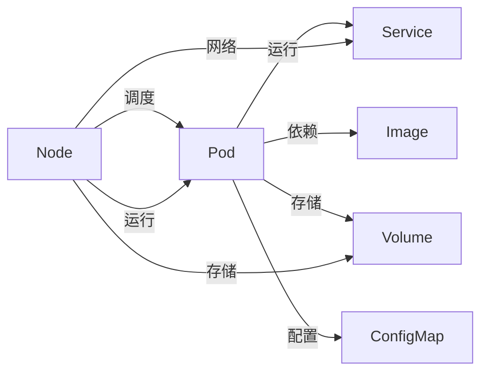

                 

# Kubernetes：容器编排与管理实践

> 关键词：容器化, 容器编排, Kubernetes, 容器镜像, 微服务, 服务网格, 持续集成与持续部署(CI/CD), 日志管理, 监控与报警, 生产环境部署, 大规模集群管理

## 1. 背景介绍

### 1.1 问题由来
随着云计算和容器技术的不断发展，微服务架构已成为现代应用程序开发的主流。微服务架构将应用程序拆分为多个小服务，每个服务独立运行，并通过网络进行通信，大大提高了系统的可扩展性和灵活性。但微服务架构同时也带来了新的挑战，如服务发现、负载均衡、服务配置、服务通信、日志管理、监控报警等。

为了解决这些问题，2008年谷歌开源了Borg，用于管理大规模的分布式系统。随后，Cloud Foundry、Docker Swarm等容器编排工具纷纷问世，但缺乏统一的标准。2014年，谷歌开源了Kubernetes，提供了统一的容器编排解决方案，成为容器编排领域的领导者。

### 1.2 问题核心关键点
Kubernetes 的核心思想是将应用程序的每个组件容器化，并按照一定的规则进行编排和管理。其关键点包括：
- **容器化**：将应用程序及其依赖打包成容器镜像，提供稳定的运行环境。
- **容器编排**：根据应用的实际需求，动态地创建、管理、扩展容器实例。
- **服务发现与负载均衡**：自动发现和负载均衡容器实例，以提高系统的可用性和可伸缩性。
- **服务配置与自动扩展**：提供灵活的服务配置和自动化的服务扩展机制，支持水平和垂直扩展。
- **服务通信与健康检查**：支持丰富的服务通信协议和服务健康检查机制，保障服务的稳定运行。
- **日志管理与监控报警**：提供集中的日志管理和监控报警功能，及时发现和解决系统问题。
- **生产环境部署与管理**：提供全面的生产环境部署和管理工具，保障系统的高可用性和稳定性。

Kubernetes不仅解决了微服务架构的管理难题，还提供了可移植、可伸缩、高可靠的系统架构，广泛应用于云原生应用、分布式系统、大规模数据处理等场景。

### 1.3 问题研究意义
Kubernetes 解决了微服务架构带来的管理难题，支持了容器化应用的高可用性、高扩展性和高可移植性，为现代云计算和分布式系统提供了统一的编排与管理解决方案。因此，研究 Kubernetes 的原理、实践和应用，对提升容器编排与管理的水平，推动云计算和微服务架构的发展具有重要意义。

## 2. 核心概念与联系

### 2.1 核心概念概述

Kubernetes 的核心概念包括容器、服务、节点、镜像、卷、配置图等。这些概念相互联系，共同构成了 Kubernetes 的生态系统。

- **容器（Pod）**：是 Kubernetes 的基本单位，包含一个或多个应用程序容器，共享网络、存储和设备等资源。
- **服务（Service）**：用于为多个容器实例提供稳定且可靠的通信机制，支持负载均衡、服务发现和健康检查等。
- **节点（Node）**：是 Kubernetes 集群中的物理机器或虚拟机，运行容器实例，提供存储和网络等资源。
- **镜像（Image）**：是容器的静态描述，包含应用程序及其依赖的打包文件，用于容器实例的创建和部署。
- **卷（Volume）**：用于提供持久存储和数据共享，支持共享和本地存储。
- **配置图（ConfigMap）**：用于配置应用程序的参数和环境变量，方便容器实例的配置管理。

这些核心概念通过 Kubernetes 的 API 接口进行统一管理，提供了一个强大的容器编排和管理系统。

### 2.2 核心概念原理和架构的 Mermaid 流程图



这个 Mermaid 流程图展示了 Kubernetes 核心概念的联系与依赖关系，直观展示了 Pod 通过 Image、Volume、ConfigMap 等资源与 Node 进行交互，并通过 Service 进行网络通信的总体架构。

## 3. 核心算法原理 & 具体操作步骤

### 3.1 算法原理概述

Kubernetes 的编排和管理原理基于以下两个核心算法：

- **调度算法**：用于决定容器实例应该运行在哪个 Node 上，根据资源需求、调度策略等进行动态调度。
- **自恢复算法**：用于监控容器实例的健康状态，当检测到实例故障时，自动重启实例，保障系统的稳定运行。

Kubernetes 通过这两大算法，实现了对容器实例的自动化部署、扩展、迁移和恢复，大大简化了容器编排和管理的复杂度。

### 3.2 算法步骤详解

Kubernetes 的编排和管理流程主要包括以下几个步骤：

**Step 1: 创建容器镜像**
- 编写应用程序的源代码，并构建 Dockerfile 文件，描述容器镜像的构建过程。
- 使用 Docker 构建容器镜像，生成镜像文件。

**Step 2: 注册容器镜像**
- 将构建好的容器镜像上传到 Docker 镜像仓库，如 Docker Hub、Harbor 等。

**Step 3: 创建 Kubernetes 部署配置**
- 编写 Kubernetes 部署配置文件，描述应用程序的运行环境和配置信息。
- 使用 kubectl 命令行工具或 Kubernetes 控制台提交部署配置。

**Step 4: 创建 Kubernetes 服务**
- 创建 Kubernetes 服务配置，指定服务的端口、选择器、负载均衡策略等。
- 使用 kubectl 命令行工具或 Kubernetes 控制台提交服务配置。

**Step 5: 调度容器实例**
- Kubernetes 调度器根据调度算法，选择合适的 Node 运行容器实例。
- 调度器将容器实例的运行请求发送给 Node 上的 kubelet 进程。

**Step 6: 创建容器实例**
- kubelet 进程根据容器实例的配置信息，创建容器实例。
- 容器实例启动后，通过网络与服务进行通信。

**Step 7: 监控和恢复容器实例**
- Kubernetes 监控器定期检查容器实例的健康状态。
- 当容器实例检测到故障时，Kubernetes 自动重启容器实例，并更新配置信息。

以上是 Kubernetes 的基本编排和管理流程。实际使用中，Kubernetes 还提供了许多高级功能，如自动扩展、多节点部署、多区域部署、跨集群管理等。

### 3.3 算法优缺点

Kubernetes 的编排和管理算法具有以下优点：
- **自动化**：通过调度算法和自恢复算法，实现了容器实例的自动化部署、扩展、迁移和恢复。
- **可扩展性**：支持大规模容器集群的管理，具备水平和垂直扩展能力。
- **高可用性**：通过负载均衡和自恢复机制，保障系统的稳定性和高可用性。
- **灵活性**：提供丰富的配置选项和 API，支持自定义和扩展。

同时，Kubernetes 也存在一些缺点：
- **学习曲线陡峭**：需要一定的学习成本和实践经验，才能掌握 Kubernetes 的使用。
- **配置复杂**：配置文件和命令的使用比较复杂，配置错误可能导致系统问题。
- **资源占用高**：Kubernetes 需要占用一定的计算和存储资源，运行环境要求较高。

### 3.4 算法应用领域

Kubernetes 广泛应用于各种云计算和分布式系统场景，如：

- **云原生应用**：微服务架构、无服务器架构、事件驱动架构等。
- **分布式系统**：大规模数据处理、大数据分析、流计算等。
- **大规模集群管理**：容器集群、Kubeflow 机器学习平台等。
- **服务网格（Istio）**：网络通信、服务治理、安全管理等。
- **持续集成与持续部署（CI/CD）**：自动化构建、测试、部署、运维等。

## 4. 数学模型和公式 & 详细讲解 & 举例说明

### 4.1 数学模型构建

Kubernetes 的编排和管理算法主要基于以下数学模型：

**调度算法**：
- 对于每个容器实例的调度请求，Kubernetes 调度器会根据以下因素进行评估：资源需求、标签、亲和性、反亲和性、服务级别等。
- 根据评估结果，选择最优的 Node 运行容器实例。

**自恢复算法**：
- Kubernetes 监控器会定期检查容器实例的健康状态，如果检测到实例故障，则触发自恢复机制。
- 自恢复机制包括以下步骤：
  1. 发送信号给容器实例，要求其重启。
  2. 如果容器实例重启失败，则将其删除，并重新创建新的容器实例。
  3. 更新配置信息，记录容器实例的故障信息。

### 4.2 公式推导过程

**调度算法公式**：
- 假设存在 $N$ 个 Node 和 $M$ 个容器实例，$C_i$ 表示第 $i$ 个容器实例的资源需求，$R_j$ 表示第 $j$ 个 Node 的资源可用量。
- 调度器会计算每个 Node 的评分 $S_j$，评分越高的 Node 越有可能被选择运行容器实例。
- 评分 $S_j$ 的计算公式为：

  $$
  S_j = \sum_{i=1}^M C_i / R_j + \sum_{i=1}^M P_i
  $$

  其中，$P_i$ 表示容器实例的优先级。

**自恢复算法公式**：
- 假设容器实例的运行状态为正常（0）或故障（1），$T$ 表示健康检查的间隔时间，$H$ 表示健康检查的超时时间。
- 当容器实例检测到故障时，会触发自恢复机制，机制的时间线如图：

  

### 4.3 案例分析与讲解

**案例1：容器镜像构建**
- 假设需要构建一个简单的 Node.js 应用程序的容器镜像，代码如下：

  ```Dockerfile
  FROM node:latest
  WORKDIR /app
  COPY package.json package-lock.json ./
  RUN npm install
  COPY . .
  EXPOSE 3000
  CMD ["npm", "start"]
  ```

  使用 Docker 构建镜像：

  ```bash
  docker build -t my-app .
  ```

  将镜像上传到 Docker Hub：

  ```bash
  docker push my-app
  ```

**案例2：Kubernetes 部署配置**
- 假设需要将容器镜像部署到 Kubernetes 集群中，配置文件如下：

  ```yaml
  apiVersion: v1
  kind: Deployment
  metadata:
    name: my-app
  spec:
    replicas: 3
    selector:
      matchLabels:
        app: my-app
    template:
      metadata:
        labels:
          app: my-app
      spec:
        containers:
        - name: my-app
          image: my-app
          ports:
          - containerPort: 3000
  ```

  使用 kubectl 提交部署配置：

  ```bash
  kubectl apply -f deployment.yaml
  ```

**案例3：Kubernetes 服务配置**
- 假设需要为容器实例创建服务，配置文件如下：

  ```yaml
  apiVersion: v1
  kind: Service
  metadata:
    name: my-app
  spec:
    selector:
      app: my-app
    ports:
    - protocol: TCP
      port: 80
      targetPort: 3000
  ```

  使用 kubectl 提交服务配置：

  ```bash
  kubectl apply -f service.yaml
  ```

## 5. 项目实践：代码实例和详细解释说明

### 5.1 开发环境搭建

Kubernetes 需要运行在 Linux 或 macOS 系统上，搭建开发环境需要以下步骤：

1. 安装 Docker：从官网下载并安装 Docker，用于构建和运行容器镜像。

2. 安装 kubectl：使用以下命令安装 kubectl：

  ```bash
  curl -L https://cloud.google.com/kubernetes-engine/setup/kubectl/releases/latest/kubectl -o ~/kubectl
  chmod +x ~/kubectl
  ```

3. 创建 Kubernetes 集群：使用以下命令创建 Kubernetes 集群：

  ```bash
  kubectl create cluster --name=kubernetes --gke-zone=us-central1-b --enable-cloud-operator
  ```

### 5.2 源代码详细实现

**案例：部署 Python Flask 应用程序**
- 假设需要部署一个简单的 Python Flask 应用程序，代码如下：

  ```python
  from flask import Flask
  app = Flask(__name__)

  @app.route('/')
  def hello():
      return 'Hello, World!'
  ```

  构建容器镜像：

  ```bash
  docker build -t my-flask .
  ```

  创建 Kubernetes 部署配置：

  ```yaml
  apiVersion: v1
  kind: Deployment
  metadata:
    name: my-flask
  spec:
    replicas: 3
    selector:
      matchLabels:
        app: my-flask
    template:
      metadata:
        labels:
          app: my-flask
      spec:
        containers:
        - name: my-flask
          image: my-flask
          ports:
          - containerPort: 5000
  ```

  创建 Kubernetes 服务配置：

  ```yaml
  apiVersion: v1
  kind: Service
  metadata:
    name: my-flask
  spec:
    selector:
      app: my-flask
    ports:
    - protocol: TCP
      port: 80
      targetPort: 5000
  ```

  提交部署和服务配置：

  ```bash
  kubectl apply -f deployment.yaml
  kubectl apply -f service.yaml
  ```

  访问服务：

  ```bash
  kubectl get services
  ```

### 5.3 代码解读与分析

**代码解读**：
- 构建容器镜像的 Dockerfile 文件包含以下步骤：
  1. 使用最新版本的 Node.js 作为基础镜像。
  2. 进入工作目录 `/app`。
  3. 复制 `package.json` 和 `package-lock.json` 文件。
  4. 运行 `npm install` 安装依赖。
  5. 复制剩余代码文件。
  6. 暴露端口 3000。
  7. 运行 `npm start` 启动应用程序。

- 创建 Kubernetes 部署配置的 YAML 文件包含以下字段：
  1. `apiVersion`：指定 API 版本。
  2. `kind`：指定资源类型，这里为 Deployment。
  3. `metadata`：指定资源的名称和标签。
  4. `spec`：指定资源的具体配置信息，这里为容器数量、选择器、模板等。
  5. `template`：指定容器的配置信息，这里为容器名称、镜像、端口等。

- 创建 Kubernetes 服务配置的 YAML 文件包含以下字段：
  1. `apiVersion`：指定 API 版本。
  2. `kind`：指定资源类型，这里为 Service。
  3. `metadata`：指定资源的名称和标签。
  4. `spec`：指定资源的具体配置信息，这里为选择器、端口等。

**代码分析**：
- Kubernetes 部署配置文件 `deployment.yaml` 和服务配置文件 `service.yaml` 是实现容器编排和管理的基础。
- 通过 kubectl 命令行工具或 Kubernetes 控制台提交配置文件，Kubernetes 会自动创建容器实例和服务实例，并监控其健康状态。
- 使用 `kubectl get pods` 命令可以查看容器实例的运行状态，使用 `kubectl get services` 命令可以查看服务的访问地址。

## 6. 实际应用场景

### 6.1 云原生应用

Kubernetes 为云原生应用提供了统一的编排和管理解决方案，支持微服务架构、无服务器架构、事件驱动架构等。以微服务架构为例，Kubernetes 提供了以下功能：

- **服务发现与负载均衡**：通过 Service 实现服务发现和负载均衡，支持多个容器实例的动态扩展和自动回收。
- **服务配置与自动扩展**：通过 Deployment 实现服务配置和自动扩展，支持水平和垂直扩展。
- **服务通信与健康检查**：通过 Kubernetes 的网络插件和健康检查机制，保障服务的稳定运行。
- **日志管理与监控报警**：通过 kubectl 命令行工具和 Kubernetes 控制台，实现日志管理、监控报警和系统告警。

### 6.2 分布式系统

Kubernetes 在大规模分布式系统中提供了强大的管理和调度能力，支持大规模数据处理、大数据分析、流计算等场景。以大规模数据处理为例，Kubernetes 提供了以下功能：

- **跨集群管理**：通过 Kubernetes 的跨集群管理机制，实现多个 Kubernetes 集群之间的数据共享和协同处理。
- **服务网格（Istio）**：通过 Istio 提供的网络通信、服务治理和安全管理功能，保障服务的可靠性和安全性。
- **自动扩展**：通过 Kubernetes 的自动扩展机制，实现大规模数据处理任务的动态扩展和资源优化。

### 6.3 持续集成与持续部署（CI/CD）

Kubernetes 为 CI/CD 提供了全面的解决方案，支持自动化构建、测试、部署和运维。以持续集成与持续部署为例，Kubernetes 提供了以下功能：

- **持续集成**：通过 Kubernetes 的资源配置和部署工具，实现代码的持续集成和自动化构建。
- **持续部署**：通过 Kubernetes 的部署和回滚机制，实现代码的持续部署和版本回滚。
- **持续运维**：通过 Kubernetes 的监控报警和日志管理功能，实现系统的持续运维和故障排查。

## 7. 工具和资源推荐

### 7.1 学习资源推荐

为了帮助开发者掌握 Kubernetes 的核心概念和实践技巧，推荐以下学习资源：

1. **《Kubernetes 权威指南》**：由 Kubernetes 社区编写，全面介绍了 Kubernetes 的核心概念、API、架构和实践技巧。

2. **Kubernetes 官方文档**：Kubernetes 的官方文档提供了详细的 API 接口、资源配置和最佳实践。

3. **Kubernetes 实战教程**：通过实战教程，学习 Kubernetes 的核心功能、配置和部署。

4. **Kubernetes 实战案例**：通过案例分析，深入理解 Kubernetes 的实际应用场景和优化策略。

5. **Kubernetes 社区**：通过 Kubernetes 社区获取最新的技术动态、最佳实践和社区资源。

### 7.2 开发工具推荐

Kubernetes 需要运行在 Linux 或 macOS 系统上，以下是一些常用的开发工具：

1. **Docker**：用于构建和运行容器镜像。
2. **kubectl**：用于管理和操作 Kubernetes 集群。
3. **Kubernetes 控制台**：用于可视化管理 Kubernetes 集群。
4. **Visual Studio Code**：一款轻量级且功能强大的编码工具。
5. **Jupyter Notebook**：用于编写和运行 Kubernetes 相关的 Python 代码。

### 7.3 相关论文推荐

Kubernetes 是云原生计算领域的重要技术，以下是一些相关论文推荐：

1. **Kubernetes: Large-Scale Distributed Resource Orchestration**：Kubernetes 的官方论文，详细介绍了 Kubernetes 的架构、设计和实现。

2. **Kubernetes 的下一代网络插件**：介绍 Kubernetes 的网络插件，包括 Flannel、Cilium 等。

3. **Kubernetes 的自动扩展机制**：介绍 Kubernetes 的自动扩展机制，包括 HPA 和 VPA。

4. **Kubernetes 的安全管理**：介绍 Kubernetes 的安全管理功能，包括 RBAC、Service Mesh 等。

5. **Kubernetes 的持续集成与持续部署**：介绍 Kubernetes 的 CI/CD 解决方案，包括 Jenkins、Jenkins Pipeline 等。

## 8. 总结：未来发展趋势与挑战

### 8.1 研究成果总结

Kubernetes 作为云原生计算的领先平台，为容器编排和管理提供了统一的解决方案。其核心算法和设计思想已经被广泛应用于各种分布式系统和微服务架构中，取得了显著的效果。Kubernetes 的技术生态和社区支持也非常强大，已经成为云计算和容器编排领域的事实标准。

### 8.2 未来发展趋势

Kubernetes 的未来发展趋势包括：

1. **多云与混合云**：Kubernetes 将进一步支持多云和混合云环境，提供跨云和本地环境的一致体验。
2. **自动扩展与负载均衡**：Kubernetes 将进一步优化自动扩展和负载均衡机制，支持动态资源管理和流量分配。
3. **服务网格（Istio）**：Kubernetes 将进一步支持服务网格（Istio），提供网络通信、服务治理和安全管理功能。
4. **持续集成与持续部署（CI/CD）**：Kubernetes 将进一步支持持续集成与持续部署（CI/CD），提供自动化构建、测试、部署和运维功能。
5. **微服务架构**：Kubernetes 将进一步支持微服务架构，提供灵活的服务配置和扩展机制。

### 8.3 面临的挑战

Kubernetes 在未来发展过程中仍然面临一些挑战：

1. **复杂度**：Kubernetes 的配置和操作复杂度较高，需要一定的学习成本和实践经验。
2. **性能**：Kubernetes 在高负载和大规模集群中的应用性能需要进一步优化。
3. **安全**：Kubernetes 的安全性问题需要进一步加强，防止系统漏洞和攻击。
4. **生态**：Kubernetes 的生态系统需要进一步扩展和完善，支持更多的第三方组件和插件。
5. **互操作性**：Kubernetes 与其他云计算平台的互操作性需要进一步优化，支持多平台协同工作。

### 8.4 研究展望

未来 Kubernetes 的研究方向包括：

1. **简化配置和管理**：通过引入更多的自动化和智能化功能，简化 Kubernetes 的配置和管理，降低使用门槛。
2. **优化性能和资源使用**：通过优化调度算法和自动扩展机制，提升 Kubernetes 的性能和资源使用效率。
3. **增强安全性和可靠性**：通过引入更多的安全机制和容错设计，增强 Kubernetes 的安全性和可靠性。
4. **扩展生态和互操作性**：通过引入更多的第三方组件和插件，扩展 Kubernetes 的生态系统，支持多平台协同工作。

## 9. 附录：常见问题与解答

**Q1：什么是 Kubernetes？**

A: Kubernetes 是一个开源的容器编排和管理平台，用于管理和调度容器化应用，支持大规模分布式系统和微服务架构。

**Q2：Kubernetes 的部署流程是什么？**

A: Kubernetes 的部署流程包括以下几个步骤：
1. 创建容器镜像。
2. 创建 Kubernetes 部署配置。
3. 创建 Kubernetes 服务配置。
4. 提交配置文件。
5. 调度容器实例。
6. 创建容器实例。
7. 监控和恢复容器实例。

**Q3：Kubernetes 的资源管理机制是什么？**

A: Kubernetes 的资源管理机制包括以下几个方面：
1. 调度算法：根据资源需求、标签、亲和性等选择最优的 Node 运行容器实例。
2. 自恢复算法：检测容器实例的故障并自动重启实例，保障系统的稳定性。
3. 自动扩展：根据系统负载动态扩展容器实例，支持水平和垂直扩展。
4. 多节点部署：支持跨集群的资源管理和负载均衡。

**Q4：Kubernetes 的日志管理和监控报警功能有哪些？**

A: Kubernetes 的日志管理和监控报警功能包括以下几个方面：
1. 日志管理：通过 kubectl 命令行工具和 Kubernetes 控制台，实时监控日志。
2. 监控报警：通过 kubectl 命令行工具和 Kubernetes 控制台，设置告警规则和通知机制，及时发现和解决系统问题。
3. 事件记录：通过 kubectl 命令行工具和 Kubernetes 控制台，记录系统事件和错误信息，便于故障排查和调试。

**Q5：Kubernetes 的跨集群管理功能有哪些？**

A: Kubernetes 的跨集群管理功能包括以下几个方面：
1. 跨集群资源管理：通过 kubectl 命令行工具和 Kubernetes 控制台，跨集群调度和管理资源。
2. 跨集群服务治理：通过 kubectl 命令行工具和 Kubernetes 控制台，跨集群发现和管理服务。
3. 跨集群自动扩展：通过 kubectl 命令行工具和 Kubernetes 控制台，跨集群动态扩展资源。

---

作者：禅与计算机程序设计艺术 / Zen and the Art of Computer Programming

