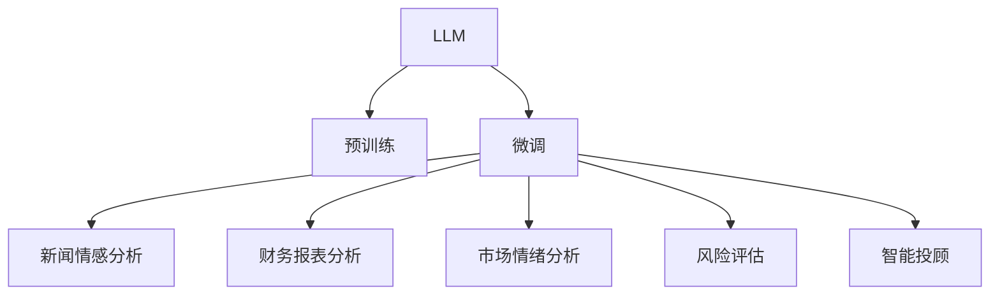

                 

# LLM 在金融领域：高效的投资策略和风险管理

## 1. 背景介绍

### 1.1 问题由来

金融领域的数据量庞大，且具有高度的时效性和复杂性。传统的金融分析往往依赖人工处理和规则驱动的策略，难以应对高频交易、市场波动等挑战。随着深度学习技术的发展，利用语言模型进行金融分析成为可能。近年来，大语言模型(LLMs)在金融领域逐渐得到应用，表现出强劲的潜力。LLMs不仅能够处理大规模文本数据，还能理解文本中的复杂语义，从而挖掘出有用的金融信息。

### 1.2 问题核心关键点

大语言模型在金融领域的应用主要集中在以下几个方面：

1. **新闻情感分析**：通过分析金融新闻和市场评论的情感倾向，预测市场走势。
2. **财务报表分析**：基于公司财报的文本摘要，提取关键财务指标。
3. **市场情绪分析**：通过分析社交媒体、论坛等平台的情绪数据，捕捉市场情绪变化。
4. **风险评估和管理**：评估金融产品的风险等级，预测违约概率。
5. **智能投顾**：利用LLMs进行股票推荐和投资组合优化。

本文将重点探讨LLMs在金融领域的高效投资策略和风险管理中的应用，深入分析其原理和操作步骤，并给出一些实用的代码实例。

## 2. 核心概念与联系

### 2.1 核心概念概述

为了更好地理解LLMs在金融领域的应用，本节将介绍几个关键概念：

1. **大语言模型(LLM)**：以自回归(如GPT)或自编码(如BERT)模型为代表的大规模预训练语言模型。通过在大规模无标签文本语料上进行预训练，学习通用的语言表示，具备强大的语言理解和生成能力。

2. **预训练(Pre-training)**：指在大规模无标签文本语料上，通过自监督学习任务训练通用语言模型的过程。常见的预训练任务包括言语建模、遮挡语言模型等。

3. **微调(Fine-tuning)**：指在预训练模型的基础上，使用金融领域任务的少量标注数据，通过有监督学习优化模型在特定任务上的性能。

4. **情感分析**：通过自然语言处理技术，分析文本中的情感倾向，用于预测市场走势、舆情分析等。

5. **文本摘要**：将长篇文本压缩为简短摘要，提取关键信息，用于财务报表分析、市场情绪分析等。

6. **风险评估**：基于金融产品的历史数据和文本信息，评估其风险等级，预测违约概率等。

7. **智能投顾**：利用LLMs进行股票推荐、投资组合优化等，辅助投资者进行决策。

### 2.2 核心概念原理和架构的 Mermaid 流程图



这个流程图展示了LLMs在金融领域的应用框架：

1. 金融数据首先通过预训练，获得通用的语言表示。
2. 在预训练模型的基础上，通过微调优化，针对金融任务进行特定适配。
3. 微调后的模型可以用于新闻情感分析、财务报表分析、市场情绪分析、风险评估和智能投顾等多个金融领域任务。

## 3. 核心算法原理 & 具体操作步骤

### 3.1 算法原理概述

基于LLMs的金融分析，本质上是利用其在自然语言处理方面的强大能力，从文本中提取和分析信息，以辅助金融决策。具体来说，LLMs可以通过以下步骤完成金融分析任务：

1. **数据准备**：收集金融领域的文本数据，如新闻、财报、市场评论等，进行预处理和清洗。
2. **预训练**：在大量无标签金融文本上对LLMs进行预训练，学习通用的语言表示。
3. **微调**：在金融领域任务的少量标注数据上对预训练模型进行微调，使其能够更好地适应特定任务。
4. **特征提取**：将微调后的模型作为特征提取器，从金融文本中提取关键特征。
5. **模型训练**：基于提取的特征，使用机器学习算法进行模型训练，预测市场走势、财务指标、风险等级等。

### 3.2 算法步骤详解

以下是LLMs在金融领域进行高效投资策略和风险管理的详细步骤：

**Step 1: 数据准备**
- 收集金融领域的文本数据，如新闻、财报、市场评论等，进行预处理和清洗，去除无关信息，标准化文本格式。
- 将数据分为训练集、验证集和测试集，确保数据分布的一致性。

**Step 2: 预训练**
- 使用大规模无标签金融文本数据对LLMs进行预训练，学习通用的语言表示。
- 常见预训练任务包括掩码语言模型、文本分类、句子相似度等。
- 预训练的目标是提高模型的语言理解能力，以便更好地处理金融文本。

**Step 3: 微调**
- 在金融领域任务的少量标注数据上对预训练模型进行微调。
- 选择合适的优化算法，如AdamW、SGD等，设置学习率、批大小、迭代轮数等。
- 应用正则化技术，如L2正则、Dropout、Early Stopping等，防止过拟合。
- 设置冻结预训练参数的策略，如仅微调顶层，或全部参数都参与微调。

**Step 4: 特征提取**
- 将微调后的模型作为特征提取器，从金融文本中提取关键特征。
- 常见特征包括文本情感、关键词、实体等。
- 使用文本分类、情感分析、实体识别等任务，提取文本的情感倾向、重要词汇和关键实体。

**Step 5: 模型训练**
- 基于提取的特征，使用机器学习算法进行模型训练，预测市场走势、财务指标、风险等级等。
- 常见算法包括逻辑回归、支持向量机、随机森林等。
- 模型训练过程中，需要使用交叉验证等技术，防止模型过拟合。

### 3.3 算法优缺点

基于LLMs的金融分析方法具有以下优点：

1. **高效性**：利用大规模预训练模型，能够快速处理大量金融文本数据，提取关键信息。
2. **适应性强**：LLMs能够适应不同类型的金融文本，如新闻、财报、评论等。
3. **灵活性高**：LLMs可以进行自定义任务微调，适应特定的金融分析需求。
4. **泛化能力强**：LLMs学习到的语言表示具有广泛的泛化能力，能够处理不同领域、不同时间段的金融数据。

然而，该方法也存在以下局限性：

1. **数据依赖性高**：微调效果很大程度上取决于标注数据的质量和数量，获取高质量标注数据的成本较高。
2. **复杂性高**：金融文本具有高度的时效性和复杂性，难以构建有效的微调数据集。
3. **模型鲁棒性不足**：金融市场波动性大，LLMs模型可能对噪声和异常值敏感，影响预测结果。
4. **可解释性差**：LLMs模型具有黑盒性质，难以解释其内部工作机制和决策逻辑。
5. **计算资源需求高**：大规模预训练和微调需要大量计算资源，硬件成本较高。

尽管存在这些局限性，但LLMs在金融领域的应用前景广阔，是金融分析的重要工具之一。

### 3.4 算法应用领域

基于LLMs的金融分析方法在以下领域得到广泛应用：

1. **新闻情感分析**：分析金融新闻的情感倾向，预测市场走势，辅助投资决策。
2. **财务报表分析**：从公司财报中提取关键财务指标，评估公司财务状况。
3. **市场情绪分析**：分析社交媒体、论坛等平台上的情绪数据，捕捉市场情绪变化。
4. **风险评估和管理**：评估金融产品的风险等级，预测违约概率，辅助风险管理。
5. **智能投顾**：利用LLMs进行股票推荐、投资组合优化，辅助投资者进行决策。

## 4. 数学模型和公式 & 详细讲解 & 举例说明

### 4.1 数学模型构建

本节将使用数学语言对基于LLMs的金融分析过程进行更加严格的刻画。

假设金融文本数据为 $D=\{x_i, y_i\}_{i=1}^N, x_i \in \mathbb{R}^d, y_i \in \{0,1\}$，其中 $x_i$ 为文本特征向量，$y_i$ 为对应的情感标签。

定义LLMs在文本 $x$ 上的输出为 $\hat{y}=M_{\theta}(x) \in [0,1]$，表示情感倾向预测。

### 4.2 公式推导过程

以下我们以情感分析任务为例，推导基于LLMs的情感分类公式及其梯度的计算公式。

假设模型 $M_{\theta}$ 在输入 $x$ 上的输出为 $\hat{y}=M_{\theta}(x) \in [0,1]$，表示情感倾向预测。定义情感分类损失函数为：

$$
\ell(M_{\theta}(x),y) = -[y\log \hat{y} + (1-y)\log(1-\hat{y})]
$$

将其代入经验风险公式，得：

$$
\mathcal{L}(\theta) = -\frac{1}{N}\sum_{i=1}^N [y_i\log M_{\theta}(x_i)+(1-y_i)\log(1-M_{\theta}(x_i))]
$$

根据链式法则，损失函数对参数 $\theta_k$ 的梯度为：

$$
\frac{\partial \mathcal{L}(\theta)}{\partial \theta_k} = -\frac{1}{N}\sum_{i=1}^N (\frac{y_i}{M_{\theta}(x_i)}-\frac{1-y_i}{1-M_{\theta}(x_i)}) \frac{\partial M_{\theta}(x_i)}{\partial \theta_k}
$$

其中 $\frac{\partial M_{\theta}(x_i)}{\partial \theta_k}$ 可进一步递归展开，利用自动微分技术完成计算。

在得到损失函数的梯度后，即可带入参数更新公式，完成模型的迭代优化。重复上述过程直至收敛，最终得到适应情感分析任务的最优模型参数 $\theta^*$。

## 5. 项目实践：代码实例和详细解释说明

### 5.1 开发环境搭建

在进行LLMs的金融分析实践前，我们需要准备好开发环境。以下是使用Python进行PyTorch开发的环境配置流程：

1. 安装Anaconda：从官网下载并安装Anaconda，用于创建独立的Python环境。

2. 创建并激活虚拟环境：
```bash
conda create -n pytorch-env python=3.8 
conda activate pytorch-env
```

3. 安装PyTorch：根据CUDA版本，从官网获取对应的安装命令。例如：
```bash
conda install pytorch torchvision torchaudio cudatoolkit=11.1 -c pytorch -c conda-forge
```

4. 安装Transformers库：
```bash
pip install transformers
```

5. 安装各类工具包：
```bash
pip install numpy pandas scikit-learn matplotlib tqdm jupyter notebook ipython
```

完成上述步骤后，即可在`pytorch-env`环境中开始LLMs的金融分析实践。

### 5.2 源代码详细实现

下面我们以情感分析任务为例，给出使用Transformers库对BERT模型进行金融文本情感分析的PyTorch代码实现。

首先，定义情感分析任务的数据处理函数：

```python
from transformers import BertTokenizer
from torch.utils.data import Dataset
import torch

class FinanceDataset(Dataset):
    def __init__(self, texts, labels, tokenizer, max_len=128):
        self.texts = texts
        self.labels = labels
        self.tokenizer = tokenizer
        self.max_len = max_len
        
    def __len__(self):
        return len(self.texts)
    
    def __getitem__(self, item):
        text = self.texts[item]
        label = self.labels[item]
        
        encoding = self.tokenizer(text, return_tensors='pt', max_length=self.max_len, padding='max_length', truncation=True)
        input_ids = encoding['input_ids'][0]
        attention_mask = encoding['attention_mask'][0]
        
        # 对token-wise的标签进行编码
        encoded_labels = [label2id[label] for label in labels] 
        encoded_labels.extend([label2id['O']] * (self.max_len - len(encoded_labels)))
        labels = torch.tensor(encoded_labels, dtype=torch.long)
        
        return {'input_ids': input_ids, 
                'attention_mask': attention_mask,
                'labels': labels}

# 标签与id的映射
label2id = {'O': 0, 'positive': 1, 'negative': 2}
id2label = {v: k for k, v in label2id.items()}

# 创建dataset
tokenizer = BertTokenizer.from_pretrained('bert-base-cased')

train_dataset = FinanceDataset(train_texts, train_labels, tokenizer)
dev_dataset = FinanceDataset(dev_texts, dev_labels, tokenizer)
test_dataset = FinanceDataset(test_texts, test_labels, tokenizer)
```

然后，定义模型和优化器：

```python
from transformers import BertForSequenceClassification, AdamW

model = BertForSequenceClassification.from_pretrained('bert-base-cased', num_labels=len(label2id))

optimizer = AdamW(model.parameters(), lr=2e-5)
```

接着，定义训练和评估函数：

```python
from torch.utils.data import DataLoader
from tqdm import tqdm
from sklearn.metrics import accuracy_score, classification_report

device = torch.device('cuda') if torch.cuda.is_available() else torch.device('cpu')
model.to(device)

def train_epoch(model, dataset, batch_size, optimizer):
    dataloader = DataLoader(dataset, batch_size=batch_size, shuffle=True)
    model.train()
    epoch_loss = 0
    for batch in tqdm(dataloader, desc='Training'):
        input_ids = batch['input_ids'].to(device)
        attention_mask = batch['attention_mask'].to(device)
        labels = batch['labels'].to(device)
        model.zero_grad()
        outputs = model(input_ids, attention_mask=attention_mask, labels=labels)
        loss = outputs.loss
        epoch_loss += loss.item()
        loss.backward()
        optimizer.step()
    return epoch_loss / len(dataloader)

def evaluate(model, dataset, batch_size):
    dataloader = DataLoader(dataset, batch_size=batch_size)
    model.eval()
    preds, labels = [], []
    with torch.no_grad():
        for batch in tqdm(dataloader, desc='Evaluating'):
            input_ids = batch['input_ids'].to(device)
            attention_mask = batch['attention_mask'].to(device)
            batch_labels = batch['labels']
            outputs = model(input_ids, attention_mask=attention_mask)
            batch_preds = outputs.logits.argmax(dim=2).to('cpu').tolist()
            batch_labels = batch_labels.to('cpu').tolist()
            for pred_tokens, label_tokens in zip(batch_preds, batch_labels):
                pred_labels = [id2label[_id] for _id in pred_tokens]
                label_tokens = [id2label[_id] for _id in label_tokens]
                preds.append(pred_labels[:len(label_tokens)])
                labels.append(label_tokens)
                
    print(classification_report(labels, preds))
    print(f'Accuracy: {accuracy_score(labels, preds):.3f}')
```

最后，启动训练流程并在测试集上评估：

```python
epochs = 5
batch_size = 16

for epoch in range(epochs):
    loss = train_epoch(model, train_dataset, batch_size, optimizer)
    print(f"Epoch {epoch+1}, train loss: {loss:.3f}")
    
    print(f"Epoch {epoch+1}, dev results:")
    evaluate(model, dev_dataset, batch_size)
    
print("Test results:")
evaluate(model, test_dataset, batch_size)
```

以上就是使用PyTorch对BERT进行金融文本情感分析的完整代码实现。可以看到，得益于Transformers库的强大封装，我们可以用相对简洁的代码完成BERT模型的加载和情感分析。

### 5.3 代码解读与分析

让我们再详细解读一下关键代码的实现细节：

**FinanceDataset类**：
- `__init__`方法：初始化文本、标签、分词器等关键组件。
- `__len__`方法：返回数据集的样本数量。
- `__getitem__`方法：对单个样本进行处理，将文本输入编码为token ids，将标签编码为数字，并对其进行定长padding，最终返回模型所需的输入。

**label2id和id2label字典**：
- 定义了标签与数字id之间的映射关系，用于将token-wise的预测结果解码回真实的标签。

**训练和评估函数**：
- 使用PyTorch的DataLoader对数据集进行批次化加载，供模型训练和推理使用。
- 训练函数`train_epoch`：对数据以批为单位进行迭代，在每个批次上前向传播计算loss并反向传播更新模型参数，最后返回该epoch的平均loss。
- 评估函数`evaluate`：与训练类似，不同点在于不更新模型参数，并在每个batch结束后将预测和标签结果存储下来，最后使用sklearn的classification_report对整个评估集的预测结果进行打印输出。

**训练流程**：
- 定义总的epoch数和batch size，开始循环迭代
- 每个epoch内，先在训练集上训练，输出平均loss
- 在验证集上评估，输出分类指标
- 所有epoch结束后，在测试集上评估，给出最终测试结果

可以看到，PyTorch配合Transformers库使得BERT情感分析的代码实现变得简洁高效。开发者可以将更多精力放在数据处理、模型改进等高层逻辑上，而不必过多关注底层的实现细节。

当然，工业级的系统实现还需考虑更多因素，如模型的保存和部署、超参数的自动搜索、更灵活的任务适配层等。但核心的微调范式基本与此类似。

## 6. 实际应用场景

### 6.1 智能投顾

智能投顾利用LLMs进行股票推荐和投资组合优化，辅助投资者进行决策。具体步骤如下：

1. **数据收集**：收集历史股票交易数据、新闻报道、财经评论等金融文本数据。
2. **预训练**：使用大规模无标签金融文本数据对LLMs进行预训练，学习通用的语言表示。
3. **微调**：在股票推荐和投资组合优化等任务上对预训练模型进行微调。
4. **特征提取**：提取股票新闻的情感倾向、关键词、实体等关键特征。
5. **模型训练**：基于提取的特征，使用机器学习算法进行模型训练，预测股票走势、评估投资组合。

### 6.2 财务报表分析

财务报表分析是LLMs在金融领域的重要应用之一。具体步骤如下：

1. **数据收集**：收集公司财报文本数据。
2. **预训练**：使用大规模无标签金融文本数据对LLMs进行预训练，学习通用的语言表示。
3. **微调**：在财务报表分析任务上对预训练模型进行微调。
4. **特征提取**：提取财报文本的关键词、实体等关键特征。
5. **模型训练**：基于提取的特征，使用机器学习算法进行模型训练，评估公司财务状况。

### 6.3 市场情绪分析

市场情绪分析利用LLMs分析社交媒体、论坛等平台上的情绪数据，捕捉市场情绪变化。具体步骤如下：

1. **数据收集**：收集社交媒体、论坛等平台上的金融文本数据。
2. **预训练**：使用大规模无标签金融文本数据对LLMs进行预训练，学习通用的语言表示。
3. **微调**：在市场情绪分析任务上对预训练模型进行微调。
4. **特征提取**：提取金融文本的情感倾向、关键词、实体等关键特征。
5. **模型训练**：基于提取的特征，使用机器学习算法进行模型训练，预测市场情绪。

### 6.4 风险评估和管理

风险评估和管理是LLMs在金融领域的另一重要应用。具体步骤如下：

1. **数据收集**：收集金融产品的历史数据、文本信息等。
2. **预训练**：使用大规模无标签金融文本数据对LLMs进行预训练，学习通用的语言表示。
3. **微调**：在风险评估和管理任务上对预训练模型进行微调。
4. **特征提取**：提取金融文本的情感倾向、关键词、实体等关键特征。
5. **模型训练**：基于提取的特征，使用机器学习算法进行模型训练，评估金融产品的风险等级，预测违约概率。

## 7. 工具和资源推荐

### 7.1 学习资源推荐

为了帮助开发者系统掌握LLMs在金融领域的应用，这里推荐一些优质的学习资源：

1. 《Transformer from Principals to Practices》系列博文：由大模型技术专家撰写，深入浅出地介绍了Transformer原理、BERT模型、微调技术等前沿话题。

2. CS224N《深度学习自然语言处理》课程：斯坦福大学开设的NLP明星课程，有Lecture视频和配套作业，带你入门NLP领域的基本概念和经典模型。

3. 《Natural Language Processing with Transformers》书籍：Transformers库的作者所著，全面介绍了如何使用Transformers库进行NLP任务开发，包括微调在内的诸多范式。

4. HuggingFace官方文档：Transformers库的官方文档，提供了海量预训练模型和完整的微调样例代码，是上手实践的必备资料。

5. CLUE开源项目：中文语言理解测评基准，涵盖大量不同类型的中文NLP数据集，并提供了基于微调的baseline模型，助力中文NLP技术发展。

通过对这些资源的学习实践，相信你一定能够快速掌握LLMs在金融领域的应用精髓，并用于解决实际的金融问题。

### 7.2 开发工具推荐

高效的开发离不开优秀的工具支持。以下是几款用于LLMs金融分析开发的常用工具：

1. PyTorch：基于Python的开源深度学习框架，灵活动态的计算图，适合快速迭代研究。大部分预训练语言模型都有PyTorch版本的实现。

2. TensorFlow：由Google主导开发的开源深度学习框架，生产部署方便，适合大规模工程应用。同样有丰富的预训练语言模型资源。

3. Transformers库：HuggingFace开发的NLP工具库，集成了众多SOTA语言模型，支持PyTorch和TensorFlow，是进行LLMs金融分析开发的利器。

4. Weights & Biases：模型训练的实验跟踪工具，可以记录和可视化模型训练过程中的各项指标，方便对比和调优。与主流深度学习框架无缝集成。

5. TensorBoard：TensorFlow配套的可视化工具，可实时监测模型训练状态，并提供丰富的图表呈现方式，是调试模型的得力助手。

6. Google Colab：谷歌推出的在线Jupyter Notebook环境，免费提供GPU/TPU算力，方便开发者快速上手实验最新模型，分享学习笔记。

合理利用这些工具，可以显著提升LLMs金融分析的开发效率，加快创新迭代的步伐。

### 7.3 相关论文推荐

LLMs在金融领域的应用源于学界的持续研究。以下是几篇奠基性的相关论文，推荐阅读：

1. Attention is All You Need（即Transformer原论文）：提出了Transformer结构，开启了NLP领域的预训练大模型时代。

2. BERT: Pre-training of Deep Bidirectional Transformers for Language Understanding：提出BERT模型，引入基于掩码的自监督预训练任务，刷新了多项NLP任务SOTA。

3. Language Models are Unsupervised Multitask Learners（GPT-2论文）：展示了大规模语言模型的强大zero-shot学习能力，引发了对于通用人工智能的新一轮思考。

4. Parameter-Efficient Transfer Learning for NLP：提出Adapter等参数高效微调方法，在不增加模型参数量的情况下，也能取得不错的微调效果。

5. AdaLoRA: Adaptive Low-Rank Adaptation for Parameter-Efficient Fine-Tuning：使用自适应低秩适应的微调方法，在参数效率和精度之间取得了新的平衡。

6. Premier Intent, Premier Recall: The Right Combination for AI to Learn from Human Feedback：探讨了基于反馈的模型优化方法，增强了LLMs的实际应用效果。

这些论文代表了大语言模型在金融领域的研究方向，通过学习这些前沿成果，可以帮助研究者把握学科前进方向，激发更多的创新灵感。

## 8. 总结：未来发展趋势与挑战

### 8.1 总结

本文对基于LLMs的金融分析方法进行了全面系统的介绍。首先阐述了LLMs在金融领域的应用背景和意义，明确了LLMs在新闻情感分析、财务报表分析、市场情绪分析、风险评估和管理等金融分析任务中的价值。其次，从原理到实践，详细讲解了LLMs的预训练、微调、特征提取、模型训练等关键步骤，并给出了一些实用的代码实例。同时，本文还广泛探讨了LLMs在智能投顾、财务报表分析、市场情绪分析、风险评估和管理等多个金融领域的应用前景，展示了LLMs的巨大潜力。

通过本文的系统梳理，可以看到，基于LLMs的金融分析方法在高效投资策略和风险管理中发挥了重要作用，是金融分析的重要工具之一。LLMs利用其强大的语言理解能力，从大规模金融文本中提取关键信息，辅助金融决策，提高了金融分析和预测的准确性和时效性。未来，随着LLMs技术的不断发展，金融分析的智能化水平将进一步提升，为金融市场带来新的变革。

### 8.2 未来发展趋势

展望未来，基于LLMs的金融分析方法将呈现以下几个发展趋势：

1. **模型规模持续增大**：随着算力成本的下降和数据规模的扩张，预训练模型和微调模型的参数量还将持续增长。超大规模语言模型蕴含的丰富语言知识，有望支撑更加复杂多变的金融分析任务。

2. **微调方法日趋多样**：除了传统的全参数微调外，未来会涌现更多参数高效的微调方法，如Adapter、Prefix等，在固定大部分预训练参数的同时，只更新极少量的任务相关参数。

3. **持续学习成为常态**：随着数据分布的不断变化，LLMs需要持续学习新知识以保持性能。如何在不遗忘原有知识的同时，高效吸收新样本信息，将成为重要的研究课题。

4. **标注样本需求降低**：受启发于提示学习(Prompt-based Learning)的思路，未来的微调方法将更好地利用LLMs的语言理解能力，通过更加巧妙的任务描述，在更少的标注样本上也能实现理想的微调效果。

5. **多模态微调崛起**：当前的微调主要聚焦于纯文本数据，未来会进一步拓展到图像、视频、语音等多模态数据微调。多模态信息的融合，将显著提升LLMs对现实世界的理解和建模能力。

6. **模型通用性增强**：经过海量数据的预训练和多领域任务的微调，LLMs将具备更强大的常识推理和跨领域迁移能力，逐步迈向通用人工智能(AGI)的目标。

以上趋势凸显了基于LLMs的金融分析技术的广阔前景。这些方向的探索发展，必将进一步提升金融分析的智能化水平，为金融市场带来新的变革。

### 8.3 面临的挑战

尽管基于LLMs的金融分析方法已经取得了瞩目成就，但在迈向更加智能化、普适化应用的过程中，它仍面临着诸多挑战：

1. **标注成本瓶颈**：微调效果很大程度上取决于标注数据的质量和数量，获取高质量标注数据的成本较高。如何进一步降低微调对标注样本的依赖，将是一大难题。

2. **模型鲁棒性不足**：金融市场波动性大，LLMs模型可能对噪声和异常值敏感，影响预测结果。如何提高LLMs模型的鲁棒性，避免灾难性遗忘，还需要更多理论和实践的积累。

3. **推理效率有待提高**：大规模LLMs在实际部署时往往面临推理速度慢、内存占用大等效率问题。如何在保证性能的同时，简化模型结构，提升推理速度，优化资源占用，将是重要的优化方向。

4. **可解释性亟需加强**：LLMs模型具有黑盒性质，难以解释其内部工作机制和决策逻辑。对于金融等高风险应用，算法的可解释性和可审计性尤为重要。如何赋予LLMs模型更强的可解释性，将是亟待攻克的难题。

5. **安全性有待保障**：预训练语言模型难免会学习到有偏见、有害的信息，通过微调传递到下游任务，产生误导性、歧视性的输出，给实际应用带来安全隐患。如何从数据和算法层面消除模型偏见，避免恶意用途，确保输出的安全性，也将是重要的研究课题。

6. **知识整合能力不足**：现有的微调模型往往局限于任务内数据，难以灵活吸收和运用更广泛的先验知识。如何让微调过程更好地与外部知识库、规则库等专家知识结合，形成更加全面、准确的信息整合能力，还有很大的想象空间。

正视LLMs金融分析面临的这些挑战，积极应对并寻求突破，将是大语言模型金融分析技术迈向成熟的必由之路。相信随着学界和产业界的共同努力，这些挑战终将一一被克服，LLMs金融分析必将在构建安全、可靠、可解释、可控的智能系统铺平道路。

### 8.4 研究展望

面对LLMs金融分析所面临的挑战，未来的研究需要在以下几个方面寻求新的突破：

1. **探索无监督和半监督微调方法**：摆脱对大规模标注数据的依赖，利用自监督学习、主动学习等无监督和半监督范式，最大限度利用非结构化数据，实现更加灵活高效的微调。

2. **研究参数高效和计算高效的微调范式**：开发更加参数高效的微调方法，在固定大部分预训练参数的同时，只更新极少量的任务相关参数。同时优化微调模型的计算图，减少前向传播和反向传播的资源消耗，实现更加轻量级、实时性的部署。

3. **融合因果和对比学习范式**：通过引入因果推断和对比学习思想，增强LLMs建立稳定因果关系的能力，学习更加普适、鲁棒的语言表征，从而提升模型泛化性和抗干扰能力。

4. **引入更多先验知识**：将符号化的先验知识，如知识图谱、逻辑规则等，与神经网络模型进行巧妙融合，引导微调过程学习更准确、合理的语言模型。同时加强不同模态数据的整合，实现视觉、语音等多模态信息与文本信息的协同建模。

5. **结合因果分析和博弈论工具**：将因果分析方法引入LLMs，识别出模型决策的关键特征，增强输出解释的因果性和逻辑性。借助博弈论工具刻画人机交互过程，主动探索并规避模型的脆弱点，提高系统稳定性。

6. **纳入伦理道德约束**：在模型训练目标中引入伦理导向的评估指标，过滤和惩罚有偏见、有害的输出倾向。同时加强人工干预和审核，建立模型行为的监管机制，确保输出符合人类价值观和伦理道德。

这些研究方向的探索，必将引领LLMs金融分析技术迈向更高的台阶，为构建安全、可靠、可解释、可控的智能系统铺平道路。面向未来，LLMs金融分析技术还需要与其他人工智能技术进行更深入的融合，如知识表示、因果推理、强化学习等，多路径协同发力，共同推动金融分析技术的进步。

## 9. 附录：常见问题与解答

**Q1：大语言模型在金融领域的应用有何优势？**

A: 大语言模型在金融领域的应用具有以下优势：

1. **高效性**：利用大规模预训练模型，能够快速处理大量金融文本数据，提取关键信息。
2. **适应性强**：LLMs能够适应不同类型的金融文本，如新闻、财报、评论等。
3. **灵活性高**：LLMs可以进行自定义任务微调，适应特定的金融分析需求。
4. **泛化能力强**：LLMs学习到的语言表示具有广泛的泛化能力，能够处理不同领域、不同时间段的金融数据。

**Q2：在金融领域应用大语言模型时，如何选择合适的学习率？**

A: 在金融领域应用大语言模型时，选择合适的学习率非常重要。一般建议从1e-5开始调参，逐步减小学习率，直至收敛。如果使用过大的学习率，容易破坏预训练权重，导致过拟合。

**Q3：金融领域的大语言模型微调过程中，有哪些资源瓶颈？**

A: 金融领域的大语言模型微调过程中，主要面临以下资源瓶颈：

1. **数据依赖性高**：微调效果很大程度上取决于标注数据的质量和数量，获取高质量标注数据的成本较高。
2. **模型鲁棒性不足**：金融市场波动性大，LLMs模型可能对噪声和异常值敏感，影响预测结果。
3. **推理效率有待提高**：大规模LLMs在实际部署时往往面临推理速度慢、内存占用大等效率问题。
4. **可解释性差**：LLMs模型具有黑盒性质，难以解释其内部工作机制和决策逻辑。
5. **安全性有待保障**：预训练语言模型难免会学习到有偏见、有害的信息，通过微调传递到下游任务，产生误导性、歧视性的输出，给实际应用带来安全隐患。

**Q4：在金融领域，如何构建高效的投资策略？**

A: 在金融领域构建高效的投资策略，可以按照以下步骤进行：

1. **数据收集**：收集历史股票交易数据、新闻报道、财经评论等金融文本数据。
2. **预训练**：使用大规模无标签金融文本数据对大语言模型进行预训练，学习通用的语言表示。
3. **微调**：在股票推荐和投资组合优化等任务上对预训练模型进行微调。
4. **特征提取**：提取股票新闻的情感倾向、关键词、实体等关键特征。
5. **模型训练**：基于提取的特征，使用机器学习算法进行模型训练，预测股票走势、评估投资组合。

**Q5：如何评估金融领域的市场情绪？**

A: 评估金融领域的市场情绪，可以按照以下步骤进行：

1. **数据收集**：收集社交媒体、论坛等平台上的金融文本数据。
2. **预训练**：使用大规模无标签金融文本数据对大语言模型进行预训练，学习通用的语言表示。
3. **微调**：在市场情绪分析任务上对预训练模型进行微调。
4. **特征提取**：提取金融文本的情感倾向、关键词、实体等关键特征。
5. **模型训练**：基于提取的特征，使用机器学习算法进行模型训练，预测市场情绪。

通过以上步骤，可以构建出高效的金融市场情绪评估系统，及时捕捉市场情绪变化，辅助投资决策。

**Q6：金融领域的大语言模型微调过程中，如何进行模型压缩？**

A: 在金融领域的大语言模型微调过程中，进行模型压缩可以按照以下步骤进行：

1. **量化加速**：将浮点模型转为定点模型，压缩存储空间，提高计算效率。
2. **模型裁剪**：去除不必要的层和参数，减小模型尺寸，加快推理速度。
3. **稀疏化存储**：采用稀疏矩阵等技术，进一步减少模型存储空间。

通过这些方法，可以在保证模型性能的同时，显著降低推理过程中的资源消耗，提升模型的实时性和可部署性。

**Q7：在金融领域应用大语言模型时，如何确保模型的安全性？**

A: 在金融领域应用大语言模型时，确保模型的安全性非常重要。可以采取以下措施：

1. **数据清洗**：在预处理阶段，去除有害信息和噪音，确保输入数据的纯洁性。
2. **模型监控**：实时监测模型输出，识别异常预测，防止模型输出有害信息。
3. **模型审计**：定期进行模型审计，检查模型输出是否符合伦理规范，发现并修复问题。
4. **人工干预**：在关键决策环节，引入人工干预机制，确保模型输出符合人类价值观和伦理道德。

通过以上措施，可以有效提高金融领域应用大语言模型的安全性，确保模型输出可靠、公正、透明。

