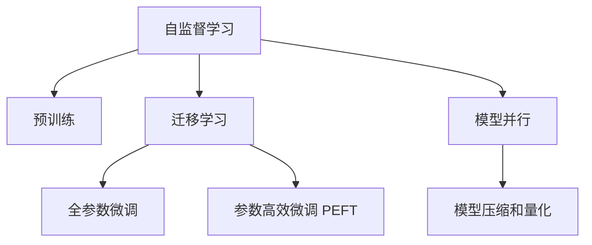

                 

# LLM 的训练：大规模数据和先进算法

## 1. 背景介绍

### 1.1 问题由来

近年来，大规模语言模型（LLM）在大规模数据和先进算法的推动下，取得了显著的进步。这些模型，如GPT系列、BERT等，已经成为自然语言处理（NLP）领域的核心工具。然而，如何有效训练这些模型，使其能够在大规模数据上达到最优性能，仍然是一个重要的问题。

在训练大规模语言模型时，需要处理大规模数据集，并使用高效的算法和优化策略，以确保模型能够学习到丰富的语言知识和语言模式。本文将详细探讨大规模数据和先进算法在训练大语言模型中的应用，帮助读者深入理解训练过程，并掌握相关技术。

### 1.2 问题核心关键点

1. **大规模数据**：训练大规模语言模型需要处理数以十亿计的文本数据，这些数据通常来自互联网、书籍、新闻文章等，需要对数据进行预处理和清洗，以确保数据的质量和一致性。
2. **先进算法**：为了高效训练大规模语言模型，需要采用先进的算法和优化策略，如自监督学习、迁移学习、参数高效微调等。这些算法能够显著提高模型训练的效率和效果。
3. **模型并行**：大规模语言模型的训练需要处理大量的数据和参数，单机的计算能力难以满足需求，因此需要采用模型并行、数据并行等分布式计算技术。
4. **模型压缩和量化**：为了优化模型推理速度和资源消耗，需要对模型进行压缩和量化处理，以减少计算和存储成本。

## 2. 核心概念与联系

### 2.1 核心概念概述

为了更好地理解大规模语言模型的训练过程，我们需要掌握以下核心概念：

- **自监督学习（Self-supervised Learning）**：一种无需人工标注的数据驱动学习方式，通过构建自我监督的预训练任务，如掩码语言模型、语言替换等，使模型能够在大规模数据上自我学习语言知识。
- **迁移学习（Transfer Learning）**：将在大规模数据上预训练的模型知识迁移到小规模数据上的特定任务中，以提升模型在新任务上的性能。
- **参数高效微调（Parameter-Efficient Fine-Tuning, PEFT）**：在大规模预训练模型的基础上，只更新部分模型参数，以减少计算成本和提升微调效果。
- **模型并行（Model Parallelism）**：通过将大规模模型的不同部分分配到多个计算节点上进行并行计算，以提升训练效率和效果。
- **模型压缩和量化（Model Compression and Quantization）**：通过剪枝、蒸馏、量化等技术，对模型进行压缩和量化处理，以优化模型推理速度和资源消耗。

这些概念之间存在紧密的联系，共同构成了大规模语言模型训练的核心框架。通过理解这些概念，我们可以更好地掌握训练大规模语言模型的关键技术和策略。

### 2.2 核心概念原理和架构的 Mermaid 流程图



这个流程图展示了自监督学习、迁移学习、全参数微调、参数高效微调、模型并行、模型压缩和量化之间的联系和关系。

## 3. 核心算法原理 & 具体操作步骤

### 3.1 算法原理概述

大规模语言模型的训练过程可以分为两个主要阶段：预训练和微调。预训练阶段通过在大规模无标注数据上执行自监督学习任务，学习语言的通用表示。微调阶段则在大规模预训练模型的基础上，使用小规模标注数据，通过有监督学习优化模型在特定任务上的性能。

### 3.2 算法步骤详解

#### 3.2.1 数据准备

1. **数据收集**：收集大规模无标注数据，如互联网文本、书籍、新闻文章等，并将其分为训练集、验证集和测试集。
2. **数据清洗和预处理**：对数据进行清洗，去除噪声、低质量数据等，并进行分词、去停用词、标准化等预处理操作。
3. **数据增强**：通过数据增强技术，如回译、近义替换、数据扩充等，增加训练数据的多样性和覆盖面。

#### 3.2.2 模型构建

1. **选择预训练模型**：选择合适的预训练模型，如BERT、GPT等，作为初始化参数。
2. **设计任务适配层**：根据具体任务，设计合适的输出层和损失函数，如分类任务使用线性分类器，生成任务使用解码器输出概率分布。

#### 3.2.3 模型训练

1. **优化器选择**：选择合适的优化器，如AdamW、SGD等，并设置学习率、批大小、迭代轮数等参数。
2. **正则化技术**：应用正则化技术，如L2正则、Dropout、Early Stopping等，防止模型过拟合。
3. **数据加载**：使用DataLoader对数据进行批量加载，供模型训练和推理使用。
4. **前向传播和反向传播**：对数据进行前向传播计算损失函数，并反向传播计算参数梯度，更新模型参数。
5. **验证集评估**：周期性在验证集上评估模型性能，决定是否触发Early Stopping。
6. **测试集评估**：在测试集上评估微调后模型的性能，对比微调前后的精度提升。

### 3.3 算法优缺点

#### 3.3.1 优点

1. **高效**：通过在大规模数据上预训练，模型能够学习到丰富的语言知识，提升下游任务的性能。
2. **泛化能力强**：预训练模型能够学习到语言的通用表示，具有良好的泛化能力，能够在新任务上取得优异表现。
3. **可扩展性高**：预训练模型和微调方法具有良好的可扩展性，能够适应不同的应用场景和任务。
4. **效果好**：经过预训练和微调，模型能够在下游任务上取得比从头训练更高的效果。

#### 3.3.2 缺点

1. **资源需求高**：大规模语言模型的训练需要处理大量的数据和参数，对计算资源和存储资源的需求较高。
2. **训练时间长**：大规模语言模型的训练过程复杂，时间较长，需要大量的计算资源。
3. **数据依赖性强**：模型的性能很大程度上依赖于数据的质量和数量，数据不足时容易出现过拟合或欠拟合。

## 4. 数学模型和公式 & 详细讲解 & 举例说明

### 4.1 数学模型构建

假设预训练语言模型为 $M_{\theta}:\mathcal{X} \rightarrow \mathcal{Y}$，其中 $\mathcal{X}$ 为输入空间，$\mathcal{Y}$ 为输出空间，$\theta \in \mathbb{R}^d$ 为模型参数。定义模型 $M_{\theta}$ 在数据样本 $(x,y)$ 上的损失函数为 $\ell(M_{\theta}(x),y)$，则在数据集 $D=\{(x_i,y_i)\}_{i=1}^N$ 上的经验风险为：

$$
\mathcal{L}(\theta) = \frac{1}{N} \sum_{i=1}^N \ell(M_{\theta}(x_i),y_i)
$$

在预训练阶段，我们通常采用自监督学习任务，如掩码语言模型（MLM）、语言替换（LM）等，来学习模型的参数 $\theta$。这些任务的特点是无需人工标注，能够利用大量的无标注数据进行训练。

### 4.2 公式推导过程

以掩码语言模型（Masked Language Model, MLM）为例，其任务是将输入文本中的某些单词用特殊标记掩盖，要求模型预测被掩盖的单词。

设输入文本为 $x=(x_1, x_2, \cdots, x_n)$，其中 $x_i$ 表示第 $i$ 个单词。假设模型能够正确预测被掩盖的单词，则其在输入 $x$ 上的损失函数为：

$$
\ell(M_{\theta}(x),y) = -\log \prod_{i=1}^n M_{\theta}(x_i)
$$

其中，$y$ 为真实的单词序列。

预训练过程中，我们通过迭代优化损失函数 $\ell(M_{\theta}(x),y)$，最小化经验风险 $\mathcal{L}(\theta)$，得到预训练后的模型参数 $\theta_{pretrain}$。

在微调阶段，我们根据下游任务的具体需求，设计合适的输出层和损失函数，如分类任务使用线性分类器，生成任务使用解码器输出概率分布。假设微调任务的标注数据集为 $D_t=\{(x_t,y_t)\}_{i=1}^N$，其中 $x_t$ 为输入文本，$y_t$ 为任务标签。

定义模型 $M_{\theta}$ 在数据样本 $(x_t,y_t)$ 上的损失函数为 $\ell_t(M_{\theta}(x_t),y_t)$，则在数据集 $D_t$ 上的经验风险为：

$$
\mathcal{L}_t(\theta) = \frac{1}{N} \sum_{i=1}^N \ell_t(M_{\theta}(x_t),y_t)
$$

通过迭代优化损失函数 $\ell_t(M_{\theta}(x_t),y_t)$，最小化经验风险 $\mathcal{L}_t(\theta)$，得到微调后的模型参数 $\theta_{fine-tune}$。

### 4.3 案例分析与讲解

以BERT模型为例，其预训练任务包括掩码语言模型（MLM）和下一句预测（NSP）。掩码语言模型的任务是预测被掩盖的单词，下一句预测的任务是判断两个句子是否连续。

在预训练阶段，我们通过优化损失函数 $\ell_{pretrain}(M_{\theta}(x),y)$，最小化经验风险 $\mathcal{L}_{pretrain}(\theta)$，得到预训练后的模型参数 $\theta_{pretrain}$。

在微调阶段，假设我们训练一个文本分类器，将输入文本 $x_t$ 分类到不同的类别 $c_t$。我们设计一个线性分类器作为输出层，定义损失函数 $\ell_{class}(M_{\theta}(x_t),y_t)$ 为：

$$
\ell_{class}(M_{\theta}(x_t),y_t) = -\log M_{\theta}(x_t)(c_t)
$$

其中 $M_{\theta}(x_t)(c_t)$ 表示模型预测输入 $x_t$ 属于类别 $c_t$ 的概率。

通过迭代优化损失函数 $\ell_{class}(M_{\theta}(x_t),y_t)$，最小化经验风险 $\mathcal{L}_{class}(\theta)$，得到微调后的模型参数 $\theta_{fine-tune}$。

## 5. 项目实践：代码实例和详细解释说明

### 5.1 开发环境搭建

在进行大规模语言模型训练时，我们需要搭建高性能的计算环境。以下是使用Python进行PyTorch开发的环境配置流程：

1. 安装Anaconda：从官网下载并安装Anaconda，用于创建独立的Python环境。
2. 创建并激活虚拟环境：
```bash
conda create -n pytorch-env python=3.8 
conda activate pytorch-env
```
3. 安装PyTorch：根据CUDA版本，从官网获取对应的安装命令。例如：
```bash
conda install pytorch torchvision torchaudio cudatoolkit=11.1 -c pytorch -c conda-forge
```
4. 安装Transformers库：
```bash
pip install transformers
```
5. 安装各类工具包：
```bash
pip install numpy pandas scikit-learn matplotlib tqdm jupyter notebook ipython
```

完成上述步骤后，即可在`pytorch-env`环境中开始训练大规模语言模型。

### 5.2 源代码详细实现

下面我们以BERT模型为例，给出使用Transformers库对大规模语言模型进行训练的PyTorch代码实现。

首先，定义训练函数：

```python
import torch
import torch.nn as nn
from transformers import BertTokenizer, BertForMaskedLM

def train_epoch(model, optimizer, train_dataset, device):
    model.train()
    total_loss = 0
    for batch in train_dataset:
        input_ids = batch['input_ids'].to(device)
        attention_mask = batch['attention_mask'].to(device)
        labels = batch['labels'].to(device)
        output = model(input_ids, attention_mask=attention_mask, labels=labels)
        loss = output.loss
        optimizer.zero_grad()
        loss.backward()
        optimizer.step()
        total_loss += loss.item()
    return total_loss / len(train_dataset)
```

然后，定义评估函数：

```python
def evaluate(model, test_dataset, device):
    model.eval()
    total_loss = 0
    for batch in test_dataset:
        input_ids = batch['input_ids'].to(device)
        attention_mask = batch['attention_mask'].to(device)
        labels = batch['labels'].to(device)
        output = model(input_ids, attention_mask=attention_mask, labels=labels)
        loss = output.loss
        total_loss += loss.item()
    return total_loss / len(test_dataset)
```

接着，定义微调函数：

```python
def fine_tune(model, optimizer, train_dataset, test_dataset, device):
    for epoch in range(num_epochs):
        train_loss = train_epoch(model, optimizer, train_dataset, device)
        test_loss = evaluate(model, test_dataset, device)
        print(f'Epoch {epoch+1}, train loss: {train_loss:.4f}, test loss: {test_loss:.4f}')
```

最后，启动训练流程：

```python
num_epochs = 3
batch_size = 16
device = torch.device('cuda' if torch.cuda.is_available() else 'cpu')
model = BertForMaskedLM.from_pretrained('bert-base-cased')
tokenizer = BertTokenizer.from_pretrained('bert-base-cased')
train_dataset = # 加载训练集数据
test_dataset = # 加载测试集数据
optimizer = torch.optim.AdamW(model.parameters(), lr=2e-5)

fine_tune(model, optimizer, train_dataset, test_dataset, device)
```

以上就是使用PyTorch对BERT模型进行微调的完整代码实现。可以看到，得益于Transformers库的强大封装，我们可以用相对简洁的代码完成BERT模型的加载和微调。

### 5.3 代码解读与分析

让我们再详细解读一下关键代码的实现细节：

**train_epoch函数**：
- 定义训练过程，包括前向传播、损失计算、反向传播和参数更新等步骤。

**evaluate函数**：
- 定义评估过程，包括前向传播、损失计算等步骤。

**fine_tune函数**：
- 定义微调过程，包括训练和评估两个阶段。

**主程序**：
- 定义模型、优化器、数据集等关键组件。
- 调用fine_tune函数进行微调。

通过这段代码，我们可以看到，尽管大规模语言模型训练的实现较为复杂，但借助Python和PyTorch等工具，我们可以快速构建和运行大规模语言模型训练程序。

## 6. 实际应用场景

### 6.1 智能客服系统

基于大规模语言模型的智能客服系统，能够实时响应客户的咨询，提供24/7的即时服务。智能客服系统通过分析客户的问题，自动生成回答，极大提升了客户满意度。

在技术实现上，可以收集企业的客服对话记录，将其整理成标注数据集，并使用大规模语言模型进行微调。微调后的模型能够自动理解客户意图，匹配最合适的回答，提供高质量的客服服务。

### 6.2 金融舆情监测

金融机构需要实时监测市场舆论动向，以规避金融风险。大规模语言模型可以通过分析社交媒体、新闻报道等大量文本数据，预测市场趋势，提供风险预警。

在技术实现上，可以收集金融领域相关的新闻、报道、评论等文本数据，并对其进行主题标注和情感标注。在此基础上对预训练语言模型进行微调，使其能够自动判断文本属于何种主题，情感倾向是正面、中性还是负面。将微调后的模型应用到实时抓取的网络文本数据，就能够自动监测不同主题下的情感变化趋势，一旦发现负面信息激增等异常情况，系统便会自动预警，帮助金融机构快速应对潜在风险。

### 6.3 个性化推荐系统

现有的推荐系统往往只依赖用户的历史行为数据进行物品推荐，无法深入理解用户的真实兴趣偏好。基于大规模语言模型的个性化推荐系统，可以更好地挖掘用户行为背后的语义信息，从而提供更精准、多样的推荐内容。

在技术实现上，可以收集用户浏览、点击、评论、分享等行为数据，提取和用户交互的物品标题、描述、标签等文本内容。将文本内容作为模型输入，用户的后续行为（如是否点击、购买等）作为监督信号，在此基础上微调预训练语言模型。微调后的模型能够从文本内容中准确把握用户的兴趣点。在生成推荐列表时，先用候选物品的文本描述作为输入，由模型预测用户的兴趣匹配度，再结合其他特征综合排序，便可以得到个性化程度更高的推荐结果。

### 6.4 未来应用展望

随着大规模语言模型的不断进步，其在更多领域的应用前景将更加广阔。

- **智慧医疗**：基于大规模语言模型的医疗问答、病历分析、药物研发等应用将提升医疗服务的智能化水平，辅助医生诊疗，加速新药开发进程。
- **智能教育**：大规模语言模型可以用于作业批改、学情分析、知识推荐等方面，因材施教，促进教育公平，提高教学质量。
- **智慧城市治理**：大规模语言模型可应用于城市事件监测、舆情分析、应急指挥等环节，提高城市管理的自动化和智能化水平，构建更安全、高效的未来城市。

## 7. 工具和资源推荐

### 7.1 学习资源推荐

为了帮助开发者系统掌握大规模语言模型训练的理论基础和实践技巧，这里推荐一些优质的学习资源：

1. 《深度学习基础》系列博文：由深度学习领域专家撰写，全面介绍了深度学习的原理和实践，包括自监督学习、迁移学习等核心概念。
2. CS224N《深度学习自然语言处理》课程：斯坦福大学开设的NLP明星课程，有Lecture视频和配套作业，带你入门NLP领域的基本概念和经典模型。
3. 《NLP中的深度学习》书籍：系统介绍了自然语言处理中的深度学习方法，包括预训练语言模型、微调技术等。
4. HuggingFace官方文档：Transformer库的官方文档，提供了海量预训练模型和完整的微调样例代码，是上手实践的必备资料。
5. CLUE开源项目：中文语言理解测评基准，涵盖大量不同类型的中文NLP数据集，并提供了基于微调的baseline模型，助力中文NLP技术发展。

通过对这些资源的学习实践，相信你一定能够快速掌握大规模语言模型训练的精髓，并用于解决实际的NLP问题。

### 7.2 开发工具推荐

高效的开发离不开优秀的工具支持。以下是几款用于大规模语言模型训练开发的常用工具：

1. PyTorch：基于Python的开源深度学习框架，灵活动态的计算图，适合快速迭代研究。大部分预训练语言模型都有PyTorch版本的实现。
2. TensorFlow：由Google主导开发的开源深度学习框架，生产部署方便，适合大规模工程应用。同样有丰富的预训练语言模型资源。
3. Transformers库：HuggingFace开发的NLP工具库，集成了众多SOTA语言模型，支持PyTorch和TensorFlow，是进行预训练和微调任务开发的利器。
4. Weights & Biases：模型训练的实验跟踪工具，可以记录和可视化模型训练过程中的各项指标，方便对比和调优。与主流深度学习框架无缝集成。
5. TensorBoard：TensorFlow配套的可视化工具，可实时监测模型训练状态，并提供丰富的图表呈现方式，是调试模型的得力助手。
6. Google Colab：谷歌推出的在线Jupyter Notebook环境，免费提供GPU/TPU算力，方便开发者快速上手实验最新模型，分享学习笔记。

合理利用这些工具，可以显著提升大规模语言模型训练的开发效率，加快创新迭代的步伐。

### 7.3 相关论文推荐

大规模语言模型和微调技术的发展源于学界的持续研究。以下是几篇奠基性的相关论文，推荐阅读：

1. Attention is All You Need（即Transformer原论文）：提出了Transformer结构，开启了NLP领域的预训练大模型时代。
2. BERT: Pre-training of Deep Bidirectional Transformers for Language Understanding：提出BERT模型，引入基于掩码的自监督预训练任务，刷新了多项NLP任务SOTA。
3. Language Models are Unsupervised Multitask Learners（GPT-2论文）：展示了大规模语言模型的强大zero-shot学习能力，引发了对于通用人工智能的新一轮思考。
4. Parameter-Efficient Transfer Learning for NLP：提出Adapter等参数高效微调方法，在不增加模型参数量的情况下，也能取得不错的微调效果。
5. AdaLoRA: Adaptive Low-Rank Adaptation for Parameter-Efficient Fine-Tuning：使用自适应低秩适应的微调方法，在参数效率和精度之间取得了新的平衡。
6. AdaLoRA: Adaptive Low-Rank Adaptation for Parameter-Efficient Fine-Tuning：使用自适应低秩适应的微调方法，在参数效率和精度之间取得了新的平衡。

这些论文代表了大规模语言模型训练的发展脉络。通过学习这些前沿成果，可以帮助研究者把握学科前进方向，激发更多的创新灵感。

## 8. 总结：未来发展趋势与挑战

### 8.1 研究成果总结

本文对大规模语言模型训练方法进行了全面系统的介绍。首先阐述了大规模语言模型和微调技术的研究背景和意义，明确了训练过程的关键技术和策略。其次，从原理到实践，详细讲解了大规模语言模型训练的数学原理和操作步骤，给出了大规模语言模型训练的完整代码实例。同时，本文还广泛探讨了大规模语言模型在智能客服、金融舆情、个性化推荐等多个行业领域的应用前景，展示了其巨大的潜力。

### 8.2 未来发展趋势

展望未来，大规模语言模型训练技术将呈现以下几个发展趋势：

1. **模型规模持续增大**：随着算力成本的下降和数据规模的扩张，预训练语言模型的参数量还将持续增长。超大规模语言模型蕴含的丰富语言知识，有望支撑更加复杂多变的下游任务训练。
2. **训练效率不断提升**：未来的大规模语言模型训练将更多采用分布式计算、模型并行、混合精度训练等技术，以提升训练效率和效果。
3. **模型压缩和量化**：为了优化模型推理速度和资源消耗，未来的预训练语言模型将更多采用模型压缩、量化等技术，以提高模型的实用性和部署效率。
4. **多模态融合**：未来的预训练语言模型将更多融合多模态数据，如视觉、语音、文本等，以提升模型的泛化能力和实用性。
5. **可解释性和可控性**：未来的预训练语言模型将更多关注模型的可解释性和可控性，通过引入因果推断、对抗训练等技术，提升模型的鲁棒性和安全性。

### 8.3 面临的挑战

尽管大规模语言模型训练技术已经取得了瞩目成就，但在迈向更加智能化、普适化应用的过程中，它仍面临着诸多挑战：

1. **数据需求高**：大规模语言模型的训练需要处理大量的数据，数据不足时容易出现过拟合或欠拟合。
2. **计算资源需求高**：大规模语言模型的训练需要处理大量的数据和参数，对计算资源和存储资源的需求较高。
3. **模型鲁棒性不足**：大规模语言模型面对域外数据时，泛化性能往往大打折扣。
4. **可解释性不足**：大规模语言模型通常被视为"黑盒"系统，难以解释其内部工作机制和决策逻辑。
5. **安全性问题**：大规模语言模型可能学习到有害的信息，通过微调传递到下游任务，产生误导性、歧视性的输出。

### 8.4 研究展望

面对大规模语言模型训练所面临的挑战，未来的研究需要在以下几个方面寻求新的突破：

1. **数据增强**：通过数据增强技术，增加训练数据的多样性和覆盖面，提升模型的泛化能力。
2. **模型压缩和量化**：通过剪枝、蒸馏、量化等技术，对模型进行压缩和量化处理，优化模型推理速度和资源消耗。
3. **多模态融合**：将符号化的先验知识，如知识图谱、逻辑规则等，与神经网络模型进行巧妙融合，引导训练过程学习更准确、合理的语言模型。
4. **模型并行**：通过模型并行技术，提升大规模语言模型的训练效率和效果。
5. **对抗训练**：通过对抗训练技术，增强模型鲁棒性，防止过拟合。

## 9. 附录：常见问题与解答

**Q1：大规模语言模型训练过程中如何防止过拟合？**

A: 防止过拟合是大规模语言模型训练的关键问题。常见的缓解策略包括：

1. 数据增强：通过回译、近义替换、数据扩充等技术，增加训练数据的多样性和覆盖面。
2. 正则化：使用L2正则、Dropout、Early Stopping等技术，防止模型过拟合。
3. 模型压缩和量化：通过剪枝、蒸馏、量化等技术，减少模型复杂度，防止过拟合。
4. 对抗训练：引入对抗样本，提高模型鲁棒性，防止过拟合。

**Q2：大规模语言模型训练过程中如何提升模型泛化能力？**

A: 提升模型泛化能力是大规模语言模型训练的重要目标。常见的提升策略包括：

1. 数据增强：通过回译、近义替换、数据扩充等技术，增加训练数据的多样性和覆盖面。
2. 模型并行：通过模型并行技术，提升大规模语言模型的训练效率和效果，防止过拟合。
3. 对抗训练：通过对抗训练技术，增强模型鲁棒性，防止过拟合。
4. 多模态融合：将符号化的先验知识，如知识图谱、逻辑规则等，与神经网络模型进行巧妙融合，引导训练过程学习更准确、合理的语言模型。

**Q3：大规模语言模型训练过程中如何提高模型效率？**

A: 提高模型效率是大规模语言模型训练的重要目标。常见的提高策略包括：

1. 模型压缩和量化：通过剪枝、蒸馏、量化等技术，减少模型复杂度，优化模型推理速度和资源消耗。
2. 模型并行：通过模型并行技术，提升大规模语言模型的训练效率和效果。
3. 混合精度训练：采用混合精度训练技术，减少计算和存储成本。
4. 硬件优化：使用GPU/TPU等高性能设备，优化大规模语言模型的训练和推理速度。

通过这些策略，可以显著提高大规模语言模型的训练效率和效果，加速模型部署和应用。

**Q4：大规模语言模型训练过程中如何提升模型可解释性？**

A: 提升模型可解释性是大规模语言模型训练的重要方向。常见的提升策略包括：

1. 模型蒸馏：通过模型蒸馏技术，将复杂模型转化为更简洁、可解释的模型。
2. 可解释性算法：引入可解释性算法，如LIME、SHAP等，分析模型决策的特征重要性。
3. 对抗训练：通过对抗训练技术，增强模型鲁棒性，防止过拟合，提高模型可解释性。

这些策略可以帮助我们更好地理解和解释大规模语言模型的决策过程，提升模型的可信度和透明度。

**Q5：大规模语言模型训练过程中如何提高模型安全性？**

A: 提高模型安全性是大规模语言模型训练的重要方向。常见的提高策略包括：

1. 对抗训练：通过对抗训练技术，增强模型鲁棒性，防止模型被恶意攻击。
2. 数据筛选：对训练数据进行严格的筛选和清洗，防止有害信息进入模型。
3. 模型监控：实时监测模型训练状态，设置异常告警阈值，确保模型安全。

这些策略可以帮助我们防止模型被恶意攻击和误导，确保模型的安全和可靠性。

---

作者：禅与计算机程序设计艺术 / Zen and the Art of Computer Programming

