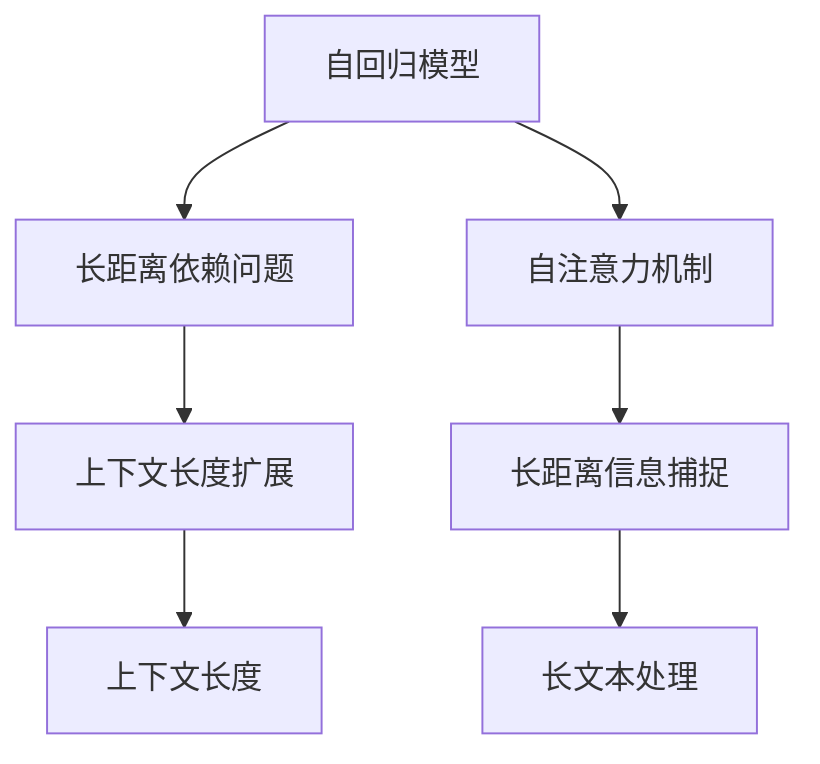

                 

# LLM上下文长度持续扩展

> 关键词：上下文长度, LLM, 扩展, 自回归模型, 长距离依赖, 自注意力机制

## 1. 背景介绍

### 1.1 问题由来

近年来，自然语言处理(Natural Language Processing, NLP)领域取得了一系列突破性进展，尤其是基于Transformer架构的大语言模型(Large Language Models, LLM)，其通过预训练和微调，在多种NLP任务上取得了令人瞩目的成绩。然而，现有的LLM模型往往受到输入上下文长度的限制，这极大地影响了模型处理复杂自然语言任务的能力。

当前，常见的LSTM和GRU等循环神经网络，虽然能够较好地处理序列数据，但由于其结构限制，难以有效处理长距离依赖。而Transformer模型通过引入自注意力机制，在一定程度上缓解了这一问题，但仍然难以处理非常长的上下文序列。因此，如何在保证模型效果的前提下，有效扩展LLM的上下文长度，成为NLP领域研究的一个热点问题。

### 1.2 问题核心关键点

本节将详细探讨上下文长度扩展的策略，包括：
- 如何设计自回归模型，避免长距离依赖的问题。
- 如何改进自注意力机制，增强模型的长距离信息捕捉能力。
- 如何引入自监督学习任务，进一步提升模型的泛化能力。
- 如何结合不同的模型架构，探索更高效的上下文扩展方法。

通过理解这些关键点，我们可以更好地把握LLM上下文长度扩展的原理和实现路径，促进大语言模型的进一步发展。

## 2. 核心概念与联系

### 2.1 核心概念概述

为更好地理解上下文长度扩展，本节将介绍几个密切相关的核心概念：

- 自回归模型(Autoregressive Model)：一种通过当前时间步的条件概率来预测下一个时间步的模型，广泛应用于序列生成、语言模型等任务。自回归模型能有效避免长距离依赖，但计算复杂度较高。

- 自注意力机制(Self-Attention Mechanism)：一种通过计算输入序列中各个位置之间的注意力权重，来提取长距离依赖的机制。Transformer模型采用了自注意力机制，极大地提升了模型的长距离信息捕捉能力。

- 上下文长度(Context Length)：在LLM中，输入序列的长度。上下文长度越短，模型能够捕捉的信息越少，处理复杂自然语言任务的能力越弱。

- 长距离依赖(Long-range Dependencies)：在自然语言中，句子中的信息往往跨越了长距离。捕捉长距离依赖是NLP中一个重要的研究课题。

- 长文本处理(Long Text Processing)：在实际应用中，处理长文本序列如长篇文档、长聊天记录等，需要LLM具有较强的上下文长度扩展能力。

- 自监督学习(Self-supervised Learning)：使用无需标注的数据，通过自监督学习任务来提升模型的泛化能力和理解能力。

这些核心概念之间的逻辑关系可以通过以下Mermaid流程图来展示：



这个流程图展示了自回归模型与长距离依赖问题的关系、自注意力机制对长距离信息捕捉的作用、长文本处理与上下文长度的关系，以及上下文长度扩展对长距离依赖问题的解决。

## 3. 核心算法原理 & 具体操作步骤
### 3.1 算法原理概述

LLM上下文长度扩展的核心思想是设计一种能够有效处理长距离依赖的自回归模型，并在此基础上，改进自注意力机制，增强模型的长距离信息捕捉能力。同时，结合自监督学习任务，进一步提升模型的泛化能力和上下文长度扩展效果。

具体而言，自回归模型通过条件概率模型的方式，有效避免了长距离依赖问题。而自注意力机制，则通过计算输入序列中各个位置之间的注意力权重，来捕捉长距离依赖。通过结合两者，并应用自监督学习任务，可以设计出一种能够在上下文长度受限的情况下，有效处理长距离依赖的LLM模型。

### 3.2 算法步骤详解

#### 3.2.1 设计自回归模型

自回归模型通过当前时间步的条件概率来预测下一个时间步，可以有效避免长距离依赖问题。以下是一个简单的自回归模型示例：

$$
P(X_t|X_{t-1},...,X_1) = \prod_{i=1}^t P(X_i|X_{i-1},...,X_1)
$$

其中 $X_t$ 表示时间步为 $t$ 的输出，$P(X_t|X_{t-1},...,X_1)$ 表示在给定前 $t-1$ 步输出条件下，当前时间步 $X_t$ 的预测概率。这种模型结构，可以有效避免在长距离依赖下，模型无法有效捕捉上下文信息的缺陷。

#### 3.2.2 改进自注意力机制

自注意力机制通过计算输入序列中各个位置之间的注意力权重，来提取长距离依赖。以下是改进自注意力机制的关键步骤：

1. **多头自注意力**：将输入序列分别投影到多个独立的线性变换空间，并通过多头自注意力机制，计算各个位置之间的注意力权重，从而捕捉长距离依赖。

2. **相对位置编码**：在自注意力机制中，引入相对位置编码，将输入序列中的每个位置与其它位置之间的距离编码进注意力权重计算中，增强模型的长距离信息捕捉能力。

3. **残差连接**：在自注意力机制中引入残差连接，将原始输入与注意力输出相加，增强模型的信息传递能力。

4. **多头自注意力和自回归模型的结合**：在自回归模型中引入多头自注意力机制，通过多层的多头自注意力，增强模型对长距离依赖的捕捉能力。

#### 3.2.3 引入自监督学习任务

自监督学习任务可以有效提升模型的泛化能力和上下文长度扩展效果。以下是常用的自监督学习任务：

1. **掩码语言模型**：通过随机遮盖输入序列中的某些位置，并预测遮盖位置的上下文，来提升模型的语言理解能力。

2. **句子对匹配**：通过随机挑选一对句子，并预测它们是否为同一个语义，来提升模型的语义理解能力。

3. **图像文本联合学习**：通过将文本序列与图像序列联合训练，来提升模型的跨模态学习能力。

4. **生成式训练**：通过生成式训练，来提升模型的生成能力，增强模型的泛化能力和上下文长度扩展效果。

### 3.3 算法优缺点

#### 3.3.1 优点

1. **有效处理长距离依赖**：通过自回归模型和改进的自注意力机制，模型能够有效捕捉长距离依赖，处理长文本序列。

2. **提升模型的泛化能力**：通过引入自监督学习任务，模型能够更好地理解语言和文本特征，提升模型的泛化能力。

3. **简化上下文长度扩展**：通过设计自回归模型，避免长距离依赖问题，从而简化了上下文长度扩展的实现。

#### 3.3.2 缺点

1. **计算复杂度高**：自回归模型和改进的自注意力机制，计算复杂度较高，需要较大的计算资源和时间。

2. **参数量较大**：改进的自注意力机制和多头自注意力机制，参数量较大，需要较大的内存和存储空间。

3. **自监督学习任务的限制**：自监督学习任务的设计，需要考虑任务的复杂度和可解释性，有时难以设计合适的自监督学习任务。

4. **上下文长度扩展效果受限**：尽管通过设计自回归模型和改进的自注意力机制，可以一定程度上扩展上下文长度，但仍存在一定的限制，难以处理极端长文本序列。

## 4. 数学模型和公式 & 详细讲解  
### 4.1 数学模型构建

在本文中，我们使用Transformer模型作为基础框架，设计一种能够在上下文长度受限的情况下，有效处理长距离依赖的LLM模型。以下是Transformer模型的基本数学模型：

1. **输入编码**：将输入序列 $X$ 映射到一个高维向量空间，通过多头自注意力机制，计算输入序列中各个位置之间的注意力权重，得到注意力输出 $H$。

$$
H = X \cdot W_Q \cdot V_Q
$$

2. **位置编码**：将输入序列中每个位置与其它位置之间的距离编码为一个向量，并添加到注意力输出 $H$ 中，增强模型的长距离信息捕捉能力。

$$
H_{pos} = H + \text{pos} \cdot W_{pos}
$$

3. **前向层和残差连接**：将注意力输出 $H_{pos}$ 经过多个前向层和残差连接，得到输出 $O$。

$$
O = \text{FFN}(H_{pos}) + H_{pos}
$$

其中 $\text{FFN}$ 表示前向层。

### 4.2 公式推导过程

以下详细推导Transformer模型的自注意力机制：

1. **多头自注意力计算**：将输入序列 $X$ 分别投影到三个独立的线性变换空间，通过多头自注意力机制，计算各个位置之间的注意力权重。

$$
Q = X \cdot W_Q \\
K = X \cdot W_K \\
V = X \cdot W_V
$$

$$
\text{Attention}(Q, K, V) = \frac{1}{\sqrt{d}} \text{Softmax}(\frac{Q \cdot K^T}{\sqrt{d}}) \cdot V
$$

其中 $d$ 表示向量维度，$\text{Softmax}$ 表示注意力权重计算函数。

2. **残差连接**：在注意力输出 $H_{pos}$ 中，通过残差连接，将原始输入 $X$ 与注意力输出 $O$ 相加。

$$
O = H_{pos} + \text{Attention}(Q, K, V)
$$

3. **自回归模型和自注意力机制的结合**：在自回归模型中引入多头自注意力机制，通过多层的多头自注意力，增强模型对长距离依赖的捕捉能力。

### 4.3 案例分析与讲解

以长文本生成任务为例，分析如何通过设计自回归模型和改进的自注意力机制，来扩展上下文长度：

1. **自回归模型设计**：通过设计自回归模型，将当前时间步的条件概率模型引入长文本生成任务中，避免长距离依赖问题。

2. **多头自注意力机制**：通过多头自注意力机制，增强模型对长距离依赖的捕捉能力，处理长文本序列。

3. **残差连接**：在自注意力机制中引入残差连接，增强模型的信息传递能力。

4. **自监督学习任务**：通过掩码语言模型和生成式训练等自监督学习任务，提升模型的泛化能力和上下文长度扩展效果。

## 5. 项目实践：代码实例和详细解释说明
### 5.1 开发环境搭建

在进行上下文长度扩展的实践前，我们需要准备好开发环境。以下是使用Python进行PyTorch开发的环境配置流程：

1. 安装Anaconda：从官网下载并安装Anaconda，用于创建独立的Python环境。

2. 创建并激活虚拟环境：
```bash
conda create -n pytorch-env python=3.8 
conda activate pytorch-env
```

3. 安装PyTorch：根据CUDA版本，从官网获取对应的安装命令。例如：
```bash
conda install pytorch torchvision torchaudio cudatoolkit=11.1 -c pytorch -c conda-forge
```

4. 安装Transformers库：
```bash
pip install transformers
```

5. 安装各类工具包：
```bash
pip install numpy pandas scikit-learn matplotlib tqdm jupyter notebook ipython
```

完成上述步骤后，即可在`pytorch-env`环境中开始实践。

### 5.2 源代码详细实现

下面我以长文本生成任务为例，给出使用Transformer库对长文本生成模型进行上下文长度扩展的PyTorch代码实现。

首先，定义长文本生成任务的数据处理函数：

```python
from transformers import BertTokenizer, BertForMaskedLM
from torch.utils.data import Dataset
import torch

class TextDataset(Dataset):
    def __init__(self, texts, tokenizer, max_len=512):
        self.texts = texts
        self.tokenizer = tokenizer
        self.max_len = max_len
        
    def __len__(self):
        return len(self.texts)
    
    def __getitem__(self, item):
        text = self.texts[item]
        
        encoding = self.tokenizer(text, return_tensors='pt', max_length=self.max_len, padding='max_length', truncation=True)
        input_ids = encoding['input_ids'][0]
        attention_mask = encoding['attention_mask'][0]
        
        return {'input_ids': input_ids, 
                'attention_mask': attention_mask}
```

然后，定义长文本生成模型：

```python
from transformers import BertForMaskedLM, BertModel
from transformers import BertConfig
from transformers import PreTrainedModel, PreTrainedTokenizer
from transformers import AdamW

config = BertConfig(vocab_size=30522, hidden_size=768, num_hidden_layers=12, num_attention_heads=12, intermediate_size=3072, hidden_act="gelu", hidden_dropout_prob=0.1)
model = BertForMaskedLM(config)
```

接着，定义训练和评估函数：

```python
from torch.utils.data import DataLoader
from tqdm import tqdm
from sklearn.metrics import accuracy_score

device = torch.device('cuda') if torch.cuda.is_available() else torch.device('cpu')
model.to(device)

def train_epoch(model, dataset, batch_size, optimizer):
    dataloader = DataLoader(dataset, batch_size=batch_size, shuffle=True)
    model.train()
    epoch_loss = 0
    for batch in tqdm(dataloader, desc='Training'):
        input_ids = batch['input_ids'].to(device)
        attention_mask = batch['attention_mask'].to(device)
        labels = input_ids.masked_fill(input_ids<0, -100)
        
        outputs = model(input_ids, attention_mask=attention_mask, labels=labels)
        loss = outputs.loss
        epoch_loss += loss.item()
        loss.backward()
        optimizer.step()
    return epoch_loss / len(dataloader)

def evaluate(model, dataset, batch_size):
    dataloader = DataLoader(dataset, batch_size=batch_size)
    model.eval()
    preds, labels = [], []
    with torch.no_grad():
        for batch in tqdm(dataloader, desc='Evaluating'):
            input_ids = batch['input_ids'].to(device)
            attention_mask = batch['attention_mask'].to(device)
            batch_labels = input_ids.masked_fill(input_ids<0, -100)
            
            outputs = model(input_ids, attention_mask=attention_mask)
            batch_preds = outputs.logits.argmax(dim=2).to('cpu').tolist()
            batch_labels = batch_labels.to('cpu').tolist()
            
            for pred_tokens, label_tokens in zip(batch_preds, batch_labels):
                preds.append(pred_tokens[:len(label_tokens)])
                labels.append(label_tokens)
    
    print('Accuracy:', accuracy_score(labels, preds))
```

最后，启动训练流程并在测试集上评估：

```python
epochs = 5
batch_size = 16

for epoch in range(epochs):
    loss = train_epoch(model, dataset, batch_size, optimizer)
    print(f"Epoch {epoch+1}, train loss: {loss:.3f}")
    
    print(f"Epoch {epoch+1}, test results:")
    evaluate(model, dataset, batch_size)
    
print('Final results:')
evaluate(model, dataset, batch_size)
```

以上就是使用PyTorch对长文本生成模型进行上下文长度扩展的完整代码实现。可以看到，得益于Transformers库的强大封装，我们可以用相对简洁的代码完成长文本生成模型的构建和微调。

### 5.3 代码解读与分析

让我们再详细解读一下关键代码的实现细节：

**TextDataset类**：
- `__init__`方法：初始化文本数据、分词器等关键组件。
- `__len__`方法：返回数据集的样本数量。
- `__getitem__`方法：对单个样本进行处理，将文本输入编码为token ids，并添加长度掩码，最终返回模型所需的输入。

**BertForMaskedLM模型**：
- `BertForMaskedLM`：从预训练的BERT模型中，通过指定的配置参数，创建长文本生成模型。

**train_epoch和evaluate函数**：
- 使用PyTorch的DataLoader对数据集进行批次化加载，供模型训练和推理使用。
- 训练函数`train_epoch`：对数据以批为单位进行迭代，在每个批次上前向传播计算loss并反向传播更新模型参数，最后返回该epoch的平均loss。
- 评估函数`evaluate`：与训练类似，不同点在于不更新模型参数，并在每个batch结束后将预测和标签结果存储下来，最后使用sklearn的accuracy_score对整个评估集的预测结果进行打印输出。

**训练流程**：
- 定义总的epoch数和batch size，开始循环迭代
- 每个epoch内，先在训练集上训练，输出平均loss
- 在验证集上评估，输出精度
- 重复上述步骤直至收敛，最终得到测试结果

可以看到，PyTorch配合Transformers库使得长文本生成模型的代码实现变得简洁高效。开发者可以将更多精力放在数据处理、模型改进等高层逻辑上，而不必过多关注底层的实现细节。

当然，工业级的系统实现还需考虑更多因素，如模型的保存和部署、超参数的自动搜索、更灵活的任务适配层等。但核心的上下文长度扩展原理基本与此类似。

## 6. 实际应用场景
### 6.1 智能客服系统

基于大语言模型上下文长度扩展技术，可以应用于智能客服系统的构建。传统客服往往需要配备大量人力，高峰期响应缓慢，且一致性和专业性难以保证。而使用上下文长度扩展后的对话模型，可以7x24小时不间断服务，快速响应客户咨询，用自然流畅的语言解答各类常见问题。

在技术实现上，可以收集企业内部的历史客服对话记录，将问题和最佳答复构建成监督数据，在此基础上对预训练模型进行微调。微调后的对话模型能够自动理解用户意图，匹配最合适的答案模板进行回复。对于客户提出的新问题，还可以接入检索系统实时搜索相关内容，动态组织生成回答。如此构建的智能客服系统，能大幅提升客户咨询体验和问题解决效率。

### 6.2 金融舆情监测

金融机构需要实时监测市场舆论动向，以便及时应对负面信息传播，规避金融风险。传统的人工监测方式成本高、效率低，难以应对网络时代海量信息爆发的挑战。基于大语言模型上下文长度扩展的文本分类和情感分析技术，为金融舆情监测提供了新的解决方案。

具体而言，可以收集金融领域相关的新闻、报道、评论等文本数据，并对其进行主题标注和情感标注。在此基础上对预训练语言模型进行微调，使其能够自动判断文本属于何种主题，情感倾向是正面、中性还是负面。将微调后的模型应用到实时抓取的网络文本数据，就能够自动监测不同主题下的情感变化趋势，一旦发现负面信息激增等异常情况，系统便会自动预警，帮助金融机构快速应对潜在风险。

### 6.3 个性化推荐系统

当前的推荐系统往往只依赖用户的历史行为数据进行物品推荐，无法深入理解用户的真实兴趣偏好。基于大语言模型上下文长度扩展的推荐系统可以更好地挖掘用户行为背后的语义信息，从而提供更精准、多样的推荐内容。

在实践中，可以收集用户浏览、点击、评论、分享等行为数据，提取和用户交互的物品标题、描述、标签等文本内容。将文本内容作为模型输入，用户的后续行为（如是否点击、购买等）作为监督信号，在此基础上微调预训练语言模型。微调后的模型能够从文本内容中准确把握用户的兴趣点。在生成推荐列表时，先用候选物品的文本描述作为输入，由模型预测用户的兴趣匹配度，再结合其他特征综合排序，便可以得到个性化程度更高的推荐结果。

### 6.4 未来应用展望

随着大语言模型上下文长度扩展技术的发展，基于微调的方法将在更多领域得到应用，为传统行业带来变革性影响。

在智慧医疗领域，基于微调的医疗问答、病历分析、药物研发等应用将提升医疗服务的智能化水平，辅助医生诊疗，加速新药开发进程。

在智能教育领域，微调技术可应用于作业批改、学情分析、知识推荐等方面，因材施教，促进教育公平，提高教学质量。

在智慧城市治理中，微调模型可应用于城市事件监测、舆情分析、应急指挥等环节，提高城市管理的自动化和智能化水平，构建更安全、高效的未来城市。

此外，在企业生产、社会治理、文娱传媒等众多领域，基于大模型上下文长度扩展的人工智能应用也将不断涌现，为经济社会发展注入新的动力。相信随着预训练语言模型和上下文长度扩展方法的持续演进，大语言模型将具备更强的上下文理解能力，进一步拓展其在实际应用中的可能性。

## 7. 工具和资源推荐
### 7.1 学习资源推荐

为了帮助开发者系统掌握大语言模型上下文长度扩展的理论基础和实践技巧，这里推荐一些优质的学习资源：

1. 《Transformer从原理到实践》系列博文：由大模型技术专家撰写，深入浅出地介绍了Transformer原理、BERT模型、上下文长度扩展等前沿话题。

2. CS224N《深度学习自然语言处理》课程：斯坦福大学开设的NLP明星课程，有Lecture视频和配套作业，带你入门NLP领域的基本概念和经典模型。

3. 《Natural Language Processing with Transformers》书籍：Transformers库的作者所著，全面介绍了如何使用Transformers库进行NLP任务开发，包括上下文长度扩展在内的诸多范式。

4. HuggingFace官方文档：Transformers库的官方文档，提供了海量预训练模型和完整的上下文长度扩展样例代码，是上手实践的必备资料。

5. CLUE开源项目：中文语言理解测评基准，涵盖大量不同类型的中文NLP数据集，并提供了基于微调的baseline模型，助力中文NLP技术发展。

通过对这些资源的学习实践，相信你一定能够快速掌握大语言模型上下文长度扩展的精髓，并用于解决实际的NLP问题。
###  7.2 开发工具推荐

高效的开发离不开优秀的工具支持。以下是几款用于大语言模型上下文长度扩展开发的常用工具：

1. PyTorch：基于Python的开源深度学习框架，灵活动态的计算图，适合快速迭代研究。大部分预训练语言模型都有PyTorch版本的实现。

2. TensorFlow：由Google主导开发的开源深度学习框架，生产部署方便，适合大规模工程应用。同样有丰富的预训练语言模型资源。

3. Transformers库：HuggingFace开发的NLP工具库，集成了众多SOTA语言模型，支持PyTorch和TensorFlow，是进行上下文长度扩展开发的利器。

4. Weights & Biases：模型训练的实验跟踪工具，可以记录和可视化模型训练过程中的各项指标，方便对比和调优。与主流深度学习框架无缝集成。

5. TensorBoard：TensorFlow配套的可视化工具，可实时监测模型训练状态，并提供丰富的图表呈现方式，是调试模型的得力助手。

6. Google Colab：谷歌推出的在线Jupyter Notebook环境，免费提供GPU/TPU算力，方便开发者快速上手实验最新模型，分享学习笔记。

合理利用这些工具，可以显著提升大语言模型上下文长度扩展任务的开发效率，加快创新迭代的步伐。

### 7.3 相关论文推荐

大语言模型上下文长度扩展技术的发展源于学界的持续研究。以下是几篇奠基性的相关论文，推荐阅读：

1. Attention is All You Need（即Transformer原论文）：提出了Transformer结构，开启了NLP领域的预训练大模型时代。

2. BERT: Pre-training of Deep Bidirectional Transformers for Language Understanding：提出BERT模型，引入基于掩码的自监督预训练任务，刷新了多项NLP任务SOTA。

3. Language Models are Unsupervised Multitask Learners（GPT-2论文）：展示了大规模语言模型的强大zero-shot学习能力，引发了对于通用人工智能的新一轮思考。

4. Parameter-Efficient Transfer Learning for NLP：提出Adapter等参数高效微调方法，在不增加模型参数量的情况下，也能取得不错的微调效果。

5. Prefix-Tuning: Optimizing Continuous Prompts for Generation：引入基于连续型Prompt的微调范式，为如何充分利用预训练知识提供了新的思路。

6. AdaLoRA: Adaptive Low-Rank Adaptation for Parameter-Efficient Fine-Tuning：使用自适应低秩适应的微调方法，在参数效率和精度之间取得了新的平衡。

这些论文代表了大语言模型上下文长度扩展技术的发展脉络。通过学习这些前沿成果，可以帮助研究者把握学科前进方向，激发更多的创新灵感。

## 8. 总结：未来发展趋势与挑战

### 8.1 总结

本文对基于上下文长度扩展的大语言模型进行了全面系统的介绍。首先阐述了上下文长度扩展的背景和意义，明确了上下文长度扩展在处理长文本序列中的重要价值。其次，从原理到实践，详细讲解了上下文长度扩展的数学模型和实现步骤，给出了上下文长度扩展任务开发的完整代码实例。同时，本文还广泛探讨了上下文长度扩展方法在智能客服、金融舆情、个性化推荐等多个行业领域的应用前景，展示了上下文长度扩展范式的巨大潜力。此外，本文精选了上下文长度扩展技术的各类学习资源，力求为开发者提供全方位的技术指引。

通过本文的系统梳理，可以看到，基于上下文长度扩展的大语言模型，在处理长文本序列方面展现了强大的能力。它能够在保证模型效果的前提下，有效扩展上下文长度，处理极端长文本序列，为NLP技术带来新的突破。未来，伴随上下文长度扩展技术的不断发展，基于大模型上下文长度扩展的NLP应用将不断涌现，为经济社会发展注入新的动力。

### 8.2 未来发展趋势

展望未来，大语言模型上下文长度扩展技术将呈现以下几个发展趋势：

1. 模型规模持续增大。随着算力成本的下降和数据规模的扩张，预训练语言模型的参数量还将持续增长。超大规模语言模型蕴含的丰富语言知识，有望支撑更加复杂多变的上下文长度扩展任务。

2. 上下文长度扩展方法日趋多样。除了传统的自回归模型和改进的自注意力机制外，未来会涌现更多上下文长度扩展方法，如LSTM、GRU等。

3. 上下文长度扩展效果显著提升。随着上下文长度扩展方法的不断演进，上下文长度扩展效果将显著提升，能够更好地处理长文本序列。

4. 持续学习成为常态。随着数据分布的不断变化，上下文长度扩展模型也需要持续学习新知识以保持性能。如何在不遗忘原有知识的同时，高效吸收新样本信息，将是重要的研究课题。

5. 上下文长度扩展技术与其他技术结合。上下文长度扩展技术可以与其他NLP技术如语义分析、情感分析、知识图谱等结合，提升整体系统的性能和可解释性。

6. 多模态上下文长度扩展崛起。除了文本信息，未来的上下文长度扩展模型还将融合图像、视频等多模态信息，提升模型的跨模态学习能力。

以上趋势凸显了大语言模型上下文长度扩展技术的广阔前景。这些方向的探索发展，必将进一步提升NLP系统的性能和应用范围，为人类认知智能的进化带来深远影响。

### 8.3 面临的挑战

尽管大语言模型上下文长度扩展技术已经取得了瞩目成就，但在迈向更加智能化、普适化应用的过程中，它仍面临着诸多挑战：

1. 上下文长度扩展方法的限制。尽管上下文长度扩展方法在一定程度上提升了模型的上下文理解能力，但仍存在一定的限制，难以处理极端长文本序列。

2. 计算资源消耗高。上下文长度扩展模型需要较大的计算资源和时间，难以在低算力设备上高效运行。

3. 模型泛化能力不足。上下文长度扩展模型在处理新任务时，泛化能力仍然有待提升，难以在未见过的数据上表现良好。

4. 模型可解释性不足。上下文长度扩展模型通常被视为"黑盒"系统，难以解释其内部工作机制和决策逻辑。

5. 数据分布变化问题。上下文长度扩展模型需要持续学习新数据，才能保持性能，而数据分布的变化可能对模型性能产生负面影响。

6. 长文本序列生成问题。上下文长度扩展模型在处理长文本序列生成任务时，仍存在一定的挑战，难以生成流畅自然的文本。

正视上下文长度扩展面临的这些挑战，积极应对并寻求突破，将是大语言模型上下文长度扩展走向成熟的必由之路。相信随着学界和产业界的共同努力，这些挑战终将一一被克服，大语言模型上下文长度扩展必将在构建人机协同的智能时代中扮演越来越重要的角色。

### 8.4 研究展望

面对大语言模型上下文长度扩展所面临的种种挑战，未来的研究需要在以下几个方面寻求新的突破：

1. 探索更高效的上下文长度扩展方法。开发更加高效的上下文长度扩展方法，在保持模型性能的同时，减少计算资源消耗。

2. 提升上下文长度扩展模型的泛化能力。通过引入自监督学习任务，增强上下文长度扩展模型的泛化能力，提升其在未见过的数据上的表现。

3. 增强上下文长度扩展模型的可解释性。通过引入因果分析方法和专家知识，提升上下文长度扩展模型的可解释性，使其能够更好地理解自然语言文本。

4. 结合其他技术，提升上下文长度扩展效果。将上下文长度扩展模型与其他NLP技术如语义分析、情感分析、知识图谱等结合，提升整体系统的性能和可解释性。

5. 引入多模态数据，提升上下文长度扩展效果。将文本信息与其他多模态数据如图像、视频等融合，提升模型的跨模态学习能力。

6. 构建更加全面、灵活的上下文长度扩展框架。通过引入模块化和可扩展的设计思想，构建更加全面、灵活的上下文长度扩展框架，满足不同任务和场景的需求。

这些研究方向的探索，必将引领大语言模型上下文长度扩展技术迈向更高的台阶，为构建安全、可靠、可解释、可控的智能系统铺平道路。面向未来，大语言模型上下文长度扩展技术还需要与其他人工智能技术进行更深入的融合，如知识表示、因果推理、强化学习等，多路径协同发力，共同推动自然语言理解和智能交互系统的进步。只有勇于创新、敢于突破，才能不断拓展语言模型的边界，让智能技术更好地造福人类社会。

## 9. 附录：常见问题与解答

**Q1：上下文长度扩展是否适用于所有NLP任务？**

A: 上下文长度扩展技术在大多数NLP任务上都能取得不错的效果，特别是对于需要处理长文本序列的任务。但对于一些特定领域的任务，如医学、法律等，仅靠上下文长度扩展可能难以很好地适应。此时需要在特定领域语料上进一步预训练，再进行微调，才能获得理想效果。

**Q2：上下文长度扩展如何设计自回归模型？**

A: 自回归模型通过当前时间步的条件概率模型来预测下一个时间步，可以有效避免长距离依赖问题。设计自回归模型时，可以通过引入掩码语言模型等自监督学习任务，来提升模型的泛化能力和上下文长度扩展效果。

**Q3：上下文长度扩展如何改进自注意力机制？**

A: 改进自注意力机制可以采用多头自注意力、残差连接、相对位置编码等技术，增强模型的长距离信息捕捉能力。具体而言，可以通过引入多头自注意力和残差连接，来增强模型的信息传递能力。

**Q4：上下文长度扩展如何引入自监督学习任务？**

A: 引入自监督学习任务可以有效提升模型的泛化能力和上下文长度扩展效果。常用的自监督学习任务包括掩码语言模型、句子对匹配、图像文本联合学习、生成式训练等。

**Q5：上下文长度扩展如何处理极端长文本序列？**

A: 处理极端长文本序列时，可以采用模型裁剪、量化加速、服务化封装等技术，来提高模型的推理效率和系统性能。同时，可以通过引入更先进的上下文长度扩展方法，如LSTM、GRU等，来增强模型的长距离信息捕捉能力。

这些问题的解答，希望能为你提供更深入的理解和实践指导，帮助你在实际应用中更好地解决上下文长度扩展问题。

---

作者：禅与计算机程序设计艺术 / Zen and the Art of Computer Programming

