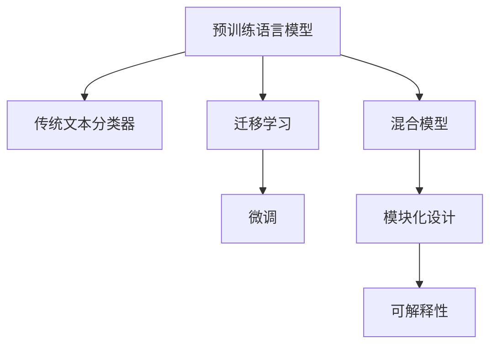

                 

# LLM与传统文本分类技术的结合：文本分析新方向

> 关键词：预训练语言模型, 传统文本分类, 迁移学习, 混合模型, 自然语言处理(NLP), 人工智能(AI)

## 1. 背景介绍

### 1.1 问题由来
在自然语言处理(NLP)领域，文本分类一直是核心的基础任务之一。传统的文本分类技术，如基于朴素贝叶斯、支持向量机(SVM)、逻辑回归等算法，因其高效和可解释性强，长期以来被广泛应用于新闻分类、情感分析、垃圾邮件过滤等多个场景。但随着深度学习技术的发展，预训练语言模型(LLM)如BERT、GPT、RoBERTa等在文本分类上展现了显著的性能提升。

预训练语言模型通过在大规模无标签数据上进行自监督预训练，学习到通用的语言表示，具备强大的语言理解和生成能力。但预训练模型的高度泛化能力和深度学习特征工程，使得模型参数量庞大，训练和推理开销大。相比之下，传统的文本分类方法则更加简洁、高效，适用于小规模、低成本的数据集。因此，如何将预训练模型与传统文本分类技术结合，发挥两者的优势，成为当下文本分析领域的一个重要研究方向。

### 1.2 问题核心关键点
预训练语言模型与传统文本分类技术的结合，旨在保留预训练模型的语言理解能力，同时使用传统分类器进行高效的样本分类，构建一种混合模型。这种混合模型融合了两者的优点，既能利用预训练模型的深度表示学习，又能通过传统分类器快速进行样本分类，具有如下核心特征：

1. **预训练与微调**：利用预训练模型的表示学习，在下游文本分类任务上进行微调，提高模型性能。
2. **参数共享**：共享预训练模型的底层参数，减少模型复杂度，提高训练和推理效率。
3. **模块化设计**：将预训练模型与传统分类器模块化设计，便于进行组合和集成。
4. **应用广泛**：适用于各类文本分类任务，包括情感分析、垃圾邮件过滤、新闻分类等。

### 1.3 问题研究意义
预训练语言模型与传统文本分类技术的结合，具有重要的研究意义：

1. **提升性能**：通过融合预训练模型的表示学习和传统分类器的判别能力，可以显著提升文本分类模型的性能。
2. **降低成本**：传统分类器参数量小、计算简单，能够有效降低预训练模型的训练和推理成本。
3. **增强可解释性**：传统分类器可解释性强，有助于理解模型决策过程，提升模型的可信度。
4. **灵活应用**：混合模型可根据任务需求灵活调整，既能进行大规模预训练，也能针对特定任务进行微调。
5. **跨领域应用**：混合模型可以应用于不同领域和场景，如医疗、金融、社交媒体等。

## 2. 核心概念与联系

### 2.1 核心概念概述

为更好地理解预训练语言模型与传统文本分类技术的结合，本节将介绍几个密切相关的核心概念：

- **预训练语言模型(LLM)**：通过在大规模无标签数据上自监督预训练，学习通用的语言表示，具备强大的语言理解和生成能力。
- **传统文本分类器**：使用朴素贝叶斯、支持向量机(SVM)、逻辑回归等算法，快速高效地进行样本分类。
- **迁移学习(Transfer Learning)**：将预训练模型的表示学习迁移到下游任务上，通过微调优化模型性能。
- **混合模型(Hybrid Model)**：融合预训练模型和传统分类器，构建既能高效进行特征提取，又能快速进行样本分类的文本分类系统。
- **模块化设计(Modular Design)**：将预训练模型与传统分类器模块化设计，便于进行组合和集成。
- **可解释性(Interpretability)**：传统分类器可解释性强，有助于理解模型决策过程，提升模型的可信度。

这些核心概念之间的逻辑关系可以通过以下Mermaid流程图来展示：



这个流程图展示了大语言模型与传统文本分类技术之间的核心概念及其关系：

1. 预训练语言模型通过自监督预训练学习通用语言表示。
2. 迁移学习将预训练模型的表示学习迁移到下游任务上。
3. 微调对迁移后的模型进行优化，提升性能。
4. 混合模型融合预训练模型和传统分类器，构建高效文本分类系统。
5. 模块化设计便于对模型进行组合和集成。
6. 可解释性增强模型的可信度。

## 3. 核心算法原理 & 具体操作步骤
### 3.1 算法原理概述

预训练语言模型与传统文本分类技术的结合，基于迁移学习范式。其核心思想是：利用预训练模型的表示学习，在下游文本分类任务上进行微调，构建一个高效、可解释的文本分类系统。

具体而言，假设预训练模型为 $M_{\theta}$，其中 $\theta$ 为预训练得到的模型参数。给定下游文本分类任务 $T$，使用预训练模型作为特征提取器，对每个样本进行特征提取，并通过传统分类器对样本进行分类。训练过程如下：

1. 对预训练模型 $M_{\theta}$ 进行微调，得到优化后的模型 $M_{\theta^*}$。
2. 对传统分类器进行训练，得到优化后的分类器 $C$。
3. 对新样本 $x$ 进行特征提取，得到特征向量 $v$。
4. 将特征向量 $v$ 输入到优化后的预训练模型 $M_{\theta^*}$ 中，得到表示 $s$。
5. 将表示 $s$ 输入到优化后的传统分类器 $C$ 中，得到分类结果 $y$。

最终，混合模型 $H$ 的输出为：

$$
H(x) = C(M_{\theta^*}(x))
$$

### 3.2 算法步骤详解

预训练语言模型与传统文本分类技术的结合，涉及以下几个关键步骤：

**Step 1: 准备预训练模型和数据集**
- 选择合适的预训练语言模型 $M_{\theta}$ 作为初始化参数，如 BERT、GPT等。
- 准备下游文本分类任务 $T$ 的数据集，划分为训练集、验证集和测试集。

**Step 2: 微调预训练模型**
- 对预训练模型 $M_{\theta}$ 进行微调，得到优化后的模型 $M_{\theta^*}$。具体方法包括：
  - 加载预训练模型和任务标注数据集。
  - 设计合适的损失函数，如交叉熵损失。
  - 选择合适的优化器，如 Adam、SGD 等，设置学习率、批大小、迭代轮数等。
  - 设置正则化技术，如 L2 正则、Dropout 等，防止模型过拟合。
  - 使用预训练模型的顶层进行微调，保留底层参数不变。

**Step 3: 训练传统分类器**
- 对传统分类器进行训练，得到优化后的分类器 $C$。具体方法包括：
  - 加载传统分类器，如朴素贝叶斯、SVM 等。
  - 设计合适的损失函数，如交叉熵损失。
  - 选择合适的优化器，如 Adam、SGD 等，设置学习率、批大小、迭代轮数等。
  - 使用传统分类器的训练集进行训练，验证集上进行验证和调参。

**Step 4: 构建混合模型**
- 将优化后的预训练模型 $M_{\theta^*}$ 和优化后的传统分类器 $C$ 组合，构建混合模型 $H$。
- 对新样本 $x$ 进行特征提取，得到表示 $s$。
- 将表示 $s$ 输入到优化后的传统分类器 $C$ 中，得到分类结果 $y$。
- 对混合模型 $H$ 进行测试，评估模型性能。

**Step 5: 测试和部署**
- 在测试集上评估混合模型 $H$ 的性能，对比原始模型和传统分类器的精度。
- 使用混合模型 $H$ 对新样本进行推理预测，集成到实际的应用系统中。

### 3.3 算法优缺点

预训练语言模型与传统文本分类技术的结合，具有以下优点：
1. 高效性：预训练模型提供高效的特征提取，传统分类器快速进行样本分类，整体流程高效。
2. 可解释性：传统分类器可解释性强，有助于理解模型决策过程，提升模型的可信度。
3. 泛化能力：预训练模型具有强大的泛化能力，适用于不同领域和场景。
4. 灵活性：可以根据任务需求灵活调整，既能进行大规模预训练，也能针对特定任务进行微调。

同时，该方法也存在一定的局限性：
1. 预训练模型的资源消耗大：预训练模型的参数量庞大，训练和推理开销大。
2. 微调模型的稳定性：微调模型容易受标注数据分布的影响，泛化性能可能不如原始预训练模型。
3. 模型复杂度：混合模型结构复杂，可能不如原始预训练模型或传统分类器简单。

尽管存在这些局限性，但就目前而言，预训练语言模型与传统文本分类技术的结合，仍然是文本分类领域的重要范式。未来相关研究的重点在于如何进一步降低预训练模型的资源消耗，提高微调模型的稳定性，同时兼顾可解释性和性能。

### 3.4 算法应用领域

预训练语言模型与传统文本分类技术的结合，在NLP领域已经得到了广泛的应用，覆盖了几乎所有常见任务，例如：

- 情感分析：对文本情感进行分类，如正面、负面、中性等。
- 垃圾邮件过滤：对邮件进行分类，判断是否为垃圾邮件。
- 新闻分类：对新闻文章进行分类，如体育、财经、娱乐等。
- 评论情感分析：对评论进行分类，判断评论情感。
- 社交媒体情感分析：对社交媒体上的文本进行分类，判断文本情感。
- 产品评论分类：对产品评论进行分类，如好评、差评、中评等。

除了上述这些经典任务外，预训练语言模型与传统文本分类技术的结合，也被创新性地应用到更多场景中，如可控文本生成、自动摘要、智能问答等，为NLP技术带来了全新的突破。随着预训练模型和分类器方法的不断进步，相信预训练语言模型与传统文本分类技术的结合将有更广阔的应用前景。

## 4. 数学模型和公式 & 详细讲解 & 举例说明
### 4.1 数学模型构建

本节将使用数学语言对预训练语言模型与传统文本分类技术的结合过程进行更加严格的刻画。

记预训练语言模型为 $M_{\theta}$，其中 $\theta$ 为预训练得到的模型参数。假设下游文本分类任务 $T$ 的训练集为 $D=\{(x_i,y_i)\}_{i=1}^N, x_i \in \mathcal{X}, y_i \in \{0,1\}$，其中 $0$ 表示负样本，$1$ 表示正样本。

定义模型 $M_{\theta}$ 在输入 $x$ 上的表示为 $s=M_{\theta}(x)$，表示 $x$ 的预训练语言模型表示。

假设传统分类器为 $C$，其损失函数为 $L_C(C; y_i, s_i)$，其中 $y_i$ 为样本的真实标签，$s_i$ 为样本的预训练表示。

预训练语言模型与传统文本分类技术的结合，即在预训练模型的基础上，对分类器的参数进行优化，使得分类器在预训练表示上具有更好的性能。

### 4.2 公式推导过程

以下我们以情感分析任务为例，推导混合模型的损失函数及其梯度计算公式。

假设样本 $x$ 为正面情感的文本，其真实标签 $y=1$，预训练表示为 $s_i$。则分类器的损失函数 $L_C(C; y_i, s_i)$ 为：

$$
L_C(C; y_i, s_i) = L(y_i, C(s_i))
$$

其中 $L$ 为分类器的损失函数，如交叉熵损失。

混合模型的损失函数 $L_H(x)$ 为：

$$
L_H(x) = L_C(C; y, s)
$$

其中 $y$ 为样本的真实标签，$s$ 为样本的预训练表示。

根据链式法则，混合模型的损失函数对模型 $M_{\theta}$ 的参数 $\theta$ 的梯度为：

$$
\nabla_{\theta} L_H(x) = \nabla_{\theta} L_C(C; y, M_{\theta}(x))
$$

将 $L_C$ 对 $C$ 的梯度带入，得到：

$$
\nabla_{\theta} L_H(x) = \nabla_{\theta} L(C; y, M_{\theta}(x))
$$

在得到混合模型的梯度后，即可带入优化算法中，完成模型的迭代优化。

### 4.3 案例分析与讲解

以情感分析任务为例，解释预训练语言模型与传统文本分类技术的结合过程：

1. 预训练模型 $M_{\theta}$ 在大规模无标签文本数据上进行预训练，学习通用的语言表示。
2. 对于情感分析任务，将预训练模型作为特征提取器，对样本进行特征提取，得到表示 $s_i$。
3. 使用传统分类器 $C$，对样本的表示 $s_i$ 进行分类，得到预测结果 $y_i'$。
4. 计算分类器的损失函数 $L_C(C; y_i, s_i)$，并反向传播更新 $C$ 的参数。
5. 重复上述过程，直到分类器 $C$ 收敛，得到优化后的分类器 $C^*$。
6. 使用优化后的分类器 $C^*$ 对新样本 $x$ 进行分类，得到预测结果 $y'$。

通过预训练语言模型与传统文本分类技术的结合，可以充分利用预训练模型的深度表示学习，同时通过传统分类器快速进行样本分类，构建高效、可解释的混合模型。

## 5. 项目实践：代码实例和详细解释说明
### 5.1 开发环境搭建

在进行混合模型实践前，我们需要准备好开发环境。以下是使用Python进行PyTorch开发的环境配置流程：

1. 安装Anaconda：从官网下载并安装Anaconda，用于创建独立的Python环境。

2. 创建并激活虚拟环境：
```bash
conda create -n pytorch-env python=3.8 
conda activate pytorch-env
```

3. 安装PyTorch：根据CUDA版本，从官网获取对应的安装命令。例如：
```bash
conda install pytorch torchvision torchaudio cudatoolkit=11.1 -c pytorch -c conda-forge
```

4. 安装Transformers库：
```bash
pip install transformers
```

5. 安装各类工具包：
```bash
pip install numpy pandas scikit-learn matplotlib tqdm jupyter notebook ipython
```

完成上述步骤后，即可在`pytorch-env`环境中开始混合模型实践。

### 5.2 源代码详细实现

下面我们以情感分析任务为例，给出使用Transformers库对BERT模型进行混合模型的PyTorch代码实现。

首先，定义情感分析任务的数据处理函数：

```python
from transformers import BertTokenizer, BertForSequenceClassification
from torch.utils.data import Dataset, DataLoader
import torch

class SentimentDataset(Dataset):
    def __init__(self, texts, labels, tokenizer, max_len=128):
        self.texts = texts
        self.labels = labels
        self.tokenizer = tokenizer
        self.max_len = max_len
        
    def __len__(self):
        return len(self.texts)
    
    def __getitem__(self, item):
        text = self.texts[item]
        label = self.labels[item]
        
        encoding = self.tokenizer(text, return_tensors='pt', max_length=self.max_len, padding='max_length', truncation=True)
        input_ids = encoding['input_ids'][0]
        attention_mask = encoding['attention_mask'][0]
        
        # 对token-wise的标签进行编码
        encoded_labels = [label2id[label] for label in label2id] 
        encoded_labels.extend([label2id['O']] * (self.max_len - len(encoded_labels)))
        labels = torch.tensor(encoded_labels, dtype=torch.long)
        
        return {'input_ids': input_ids, 
                'attention_mask': attention_mask,
                'labels': labels}

# 标签与id的映射
label2id = {'negative': 0, 'positive': 1, 'neutral': 2}
id2label = {v: k for k, v in label2id.items()}

# 创建dataset
tokenizer = BertTokenizer.from_pretrained('bert-base-cased')

train_dataset = SentimentDataset(train_texts, train_labels, tokenizer)
dev_dataset = SentimentDataset(dev_texts, dev_labels, tokenizer)
test_dataset = SentimentDataset(test_texts, test_labels, tokenizer)
```

然后，定义模型和优化器：

```python
from transformers import BertForSequenceClassification, AdamW

model = BertForSequenceClassification.from_pretrained('bert-base-cased', num_labels=len(label2id))

optimizer = AdamW(model.parameters(), lr=2e-5)
```

接着，定义训练和评估函数：

```python
from torch.utils.data import DataLoader
from tqdm import tqdm
from sklearn.metrics import classification_report

device = torch.device('cuda') if torch.cuda.is_available() else torch.device('cpu')
model.to(device)

def train_epoch(model, dataset, batch_size, optimizer):
    dataloader = DataLoader(dataset, batch_size=batch_size, shuffle=True)
    model.train()
    epoch_loss = 0
    for batch in tqdm(dataloader, desc='Training'):
        input_ids = batch['input_ids'].to(device)
        attention_mask = batch['attention_mask'].to(device)
        labels = batch['labels'].to(device)
        model.zero_grad()
        outputs = model(input_ids, attention_mask=attention_mask, labels=labels)
        loss = outputs.loss
        epoch_loss += loss.item()
        loss.backward()
        optimizer.step()
    return epoch_loss / len(dataloader)

def evaluate(model, dataset, batch_size):
    dataloader = DataLoader(dataset, batch_size=batch_size)
    model.eval()
    preds, labels = [], []
    with torch.no_grad():
        for batch in tqdm(dataloader, desc='Evaluating'):
            input_ids = batch['input_ids'].to(device)
            attention_mask = batch['attention_mask'].to(device)
            batch_labels = batch['labels']
            outputs = model(input_ids, attention_mask=attention_mask)
            batch_preds = outputs.logits.argmax(dim=2).to('cpu').tolist()
            batch_labels = batch_labels.to('cpu').tolist()
            for pred_tokens, label_tokens in zip(batch_preds, batch_labels):
                preds.append(pred_tokens[:len(label_tokens)])
                labels.append(label_tokens)
                
    print(classification_report(labels, preds))
```

最后，启动训练流程并在测试集上评估：

```python
epochs = 5
batch_size = 16

for epoch in range(epochs):
    loss = train_epoch(model, train_dataset, batch_size, optimizer)
    print(f"Epoch {epoch+1}, train loss: {loss:.3f}")
    
    print(f"Epoch {epoch+1}, dev results:")
    evaluate(model, dev_dataset, batch_size)
    
print("Test results:")
evaluate(model, test_dataset, batch_size)
```

以上就是使用PyTorch对BERT进行混合模型实践的完整代码实现。可以看到，得益于Transformers库的强大封装，我们可以用相对简洁的代码完成BERT模型的加载和混合模型的训练。

### 5.3 代码解读与分析

让我们再详细解读一下关键代码的实现细节：

**SentimentDataset类**：
- `__init__`方法：初始化文本、标签、分词器等关键组件。
- `__len__`方法：返回数据集的样本数量。
- `__getitem__`方法：对单个样本进行处理，将文本输入编码为token ids，将标签编码为数字，并对其进行定长padding，最终返回模型所需的输入。

**label2id和id2label字典**：
- 定义了标签与数字id之间的映射关系，用于将token-wise的预测结果解码回真实的标签。

**训练和评估函数**：
- 使用PyTorch的DataLoader对数据集进行批次化加载，供模型训练和推理使用。
- 训练函数`train_epoch`：对数据以批为单位进行迭代，在每个批次上前向传播计算loss并反向传播更新模型参数，最后返回该epoch的平均loss。
- 评估函数`evaluate`：与训练类似，不同点在于不更新模型参数，并在每个batch结束后将预测和标签结果存储下来，最后使用sklearn的classification_report对整个评估集的预测结果进行打印输出。

**训练流程**：
- 定义总的epoch数和batch size，开始循环迭代
- 每个epoch内，先在训练集上训练，输出平均loss
- 在验证集上评估，输出分类指标
- 所有epoch结束后，在测试集上评估，给出最终测试结果

可以看到，PyTorch配合Transformers库使得BERT混合模型的代码实现变得简洁高效。开发者可以将更多精力放在数据处理、模型改进等高层逻辑上，而不必过多关注底层的实现细节。

当然，工业级的系统实现还需考虑更多因素，如模型的保存和部署、超参数的自动搜索、更灵活的任务适配层等。但核心的混合模型构建过程基本与此类似。

## 6. 实际应用场景
### 6.1 智能客服系统

基于混合模型的对话技术，可以广泛应用于智能客服系统的构建。传统客服往往需要配备大量人力，高峰期响应缓慢，且一致性和专业性难以保证。而使用混合模型的对话模型，可以7x24小时不间断服务，快速响应客户咨询，用自然流畅的语言解答各类常见问题。

在技术实现上，可以收集企业内部的历史客服对话记录，将问题和最佳答复构建成监督数据，在此基础上对预训练对话模型进行混合。混合后的对话模型能够自动理解用户意图，匹配最合适的答案模板进行回复。对于客户提出的新问题，还可以接入检索系统实时搜索相关内容，动态组织生成回答。如此构建的智能客服系统，能大幅提升客户咨询体验和问题解决效率。

### 6.2 金融舆情监测

金融机构需要实时监测市场舆论动向，以便及时应对负面信息传播，规避金融风险。传统的人工监测方式成本高、效率低，难以应对网络时代海量信息爆发的挑战。基于混合模型的文本分类技术，为金融舆情监测提供了新的解决方案。

具体而言，可以收集金融领域相关的新闻、报道、评论等文本数据，并对其进行主题标注和情感标注。在此基础上对预训练语言模型进行混合，使其能够自动判断文本属于何种主题，情感倾向是正面、中性还是负面。将混合后的模型应用到实时抓取的网络文本数据，就能够自动监测不同主题下的情感变化趋势，一旦发现负面信息激增等异常情况，系统便会自动预警，帮助金融机构快速应对潜在风险。

### 6.3 个性化推荐系统

当前的推荐系统往往只依赖用户的历史行为数据进行物品推荐，无法深入理解用户的真实兴趣偏好。基于混合模型的推荐系统可以更好地挖掘用户行为背后的语义信息，从而提供更精准、多样的推荐内容。

在实践中，可以收集用户浏览、点击、评论、分享等行为数据，提取和用户交互的物品标题、描述、标签等文本内容。将文本内容作为模型输入，用户的后续行为（如是否点击、购买等）作为监督信号，在此基础上混合预训练语言模型。混合后的模型能够从文本内容中准确把握用户的兴趣点。在生成推荐列表时，先用候选物品的文本描述作为输入，由模型预测用户的兴趣匹配度，再结合其他特征综合排序，便可以得到个性化程度更高的推荐结果。

### 6.4 未来应用展望

随着混合模型的不断发展，其在文本分析领域将有更广泛的应用，为传统行业带来变革性影响。

在智慧医疗领域，基于混合模型的医疗问答、病历分析、药物研发等应用将提升医疗服务的智能化水平，辅助医生诊疗，加速新药开发进程。

在智能教育领域，混合模型可应用于作业批改、学情分析、知识推荐等方面，因材施教，促进教育公平，提高教学质量。

在智慧城市治理中，混合模型可应用于城市事件监测、舆情分析、应急指挥等环节，提高城市管理的自动化和智能化水平，构建更安全、高效的未来城市。

此外，在企业生产、社会治理、文娱传媒等众多领域，基于混合模型的文本分析应用也将不断涌现，为经济社会发展注入新的动力。相信随着技术的日益成熟，混合模型将进一步拓展文本分析的边界，深刻影响人类的生产生活方式。

## 7. 工具和资源推荐
### 7.1 学习资源推荐

为了帮助开发者系统掌握预训练语言模型与传统文本分类技术的结合，这里推荐一些优质的学习资源：

1. 《Transformer from Scruitge to Scale》系列博文：由大模型技术专家撰写，深入浅出地介绍了Transformer原理、BERT模型、混合模型等前沿话题。

2. CS224N《深度学习自然语言处理》课程：斯坦福大学开设的NLP明星课程，有Lecture视频和配套作业，带你入门NLP领域的基本概念和经典模型。

3. 《Natural Language Processing with Transformers》书籍：Transformers库的作者所著，全面介绍了如何使用Transformers库进行NLP任务开发，包括混合模型的构建。

4. HuggingFace官方文档：Transformers库的官方文档，提供了海量预训练模型和完整的混合模型样例代码，是上手实践的必备资料。

5. CLUE开源项目：中文语言理解测评基准，涵盖大量不同类型的中文NLP数据集，并提供了基于混合模型的baseline模型，助力中文NLP技术发展。

通过对这些资源的学习实践，相信你一定能够快速掌握预训练语言模型与传统文本分类技术的结合精髓，并用于解决实际的NLP问题。
###  7.2 开发工具推荐

高效的开发离不开优秀的工具支持。以下是几款用于混合模型开发常用的工具：

1. PyTorch：基于Python的开源深度学习框架，灵活动态的计算图，适合快速迭代研究。大部分预训练语言模型都有PyTorch版本的实现。

2. TensorFlow：由Google主导开发的开源深度学习框架，生产部署方便，适合大规模工程应用。同样有丰富的预训练语言模型资源。

3. Transformers库：HuggingFace开发的NLP工具库，集成了众多SOTA语言模型，支持PyTorch和TensorFlow，是进行混合模型开发的利器。

4. Weights & Biases：模型训练的实验跟踪工具，可以记录和可视化模型训练过程中的各项指标，方便对比和调优。与主流深度学习框架无缝集成。

5. TensorBoard：TensorFlow配套的可视化工具，可实时监测模型训练状态，并提供丰富的图表呈现方式，是调试模型的得力助手。

6. Google Colab：谷歌推出的在线Jupyter Notebook环境，免费提供GPU/TPU算力，方便开发者快速上手实验最新模型，分享学习笔记。

合理利用这些工具，可以显著提升混合模型开发的效率，加快创新迭代的步伐。

### 7.3 相关论文推荐

预训练语言模型与传统文本分类技术的结合，源于学界的持续研究。以下是几篇奠基性的相关论文，推荐阅读：

1. Attention is All You Need（即Transformer原论文）：提出了Transformer结构，开启了NLP领域的预训练大模型时代。

2. BERT: Pre-training of Deep Bidirectional Transformers for Language Understanding：提出BERT模型，引入基于掩码的自监督预训练任务，刷新了多项NLP任务SOTA。

3. Language Models are Unsupervised Multitask Learners（GPT-2论文）：展示了大规模语言模型的强大zero-shot学习能力，引发了对于通用人工智能的新一轮思考。

4. Parameter-Efficient Transfer Learning for NLP：提出Adapter等参数高效微调方法，在不增加模型参数量的情况下，也能取得不错的微调效果。

5. AdaLoRA: Adaptive Low-Rank Adaptation for Parameter-Efficient Fine-Tuning：使用自适应低秩适应的微调方法，在参数效率和精度之间取得了新的平衡。

这些论文代表了大语言模型与传统文本分类技术结合的研究脉络。通过学习这些前沿成果，可以帮助研究者把握学科前进方向，激发更多的创新灵感。

## 8. 总结：未来发展趋势与挑战

### 8.1 总结

本文对预训练语言模型与传统文本分类技术的结合进行了全面系统的介绍。首先阐述了预训练语言模型与传统文本分类技术的结合背景和意义，明确了混合模型在文本分类任务上的独特优势。其次，从原理到实践，详细讲解了混合模型的数学原理和关键步骤，给出了混合模型任务开发的完整代码实例。同时，本文还广泛探讨了混合模型在智能客服、金融舆情、个性化推荐等多个领域的应用前景，展示了混合模型的广泛潜力。此外，本文精选了混合模型的各类学习资源，力求为读者提供全方位的技术指引。

通过本文的系统梳理，可以看到，预训练语言模型与传统文本分类技术的结合，正在成为NLP领域的重要范式，极大地拓展了文本分类模型的应用边界，催生了更多的落地场景。受益于预训练模型的深度表示学习，混合模型在性能、可解释性和灵活性等方面均优于传统方法，具有广阔的发展前景。未来，伴随预训练模型和分类器方法的不断进步，相信预训练语言模型与传统文本分类技术的结合将有更广阔的应用前景。

### 8.2 未来发展趋势

展望未来，预训练语言模型与传统文本分类技术的结合将呈现以下几个发展趋势：

1. 混合模型的多模态融合。未来的混合模型将不仅限于文本数据的处理，还将扩展到图像、视频、语音等多模态数据的处理，构建多模态混合模型。

2. 预训练模型的微调优化。通过引入更有效的微调技术，如LoRA、AdaLoRA等，进一步提升预训练模型的性能和泛化能力。

3. 混合模型的推理优化。通过模型剪枝、量化等技术，进一步提升混合模型的推理效率，使其能够在大规模部署中发挥作用。

4. 混合模型的模型压缩。通过模型蒸馏、知识蒸馏等技术，进一步压缩模型大小，减少存储和传输成本。

5. 混合模型的自适应学习。通过引入自适应学习技术，使得混合模型能够实时更新和适应新数据，提升模型的动态适应能力。

6. 混合模型的鲁棒性增强。通过引入对抗训练、噪声注入等技术，进一步提升混合模型的鲁棒性和泛化性能。

以上趋势凸显了预训练语言模型与传统文本分类技术结合的广阔前景。这些方向的探索发展，必将进一步提升混合模型的性能和应用范围，为自然语言理解和智能交互系统的进步提供新的动力。

### 8.3 面临的挑战

尽管预训练语言模型与传统文本分类技术的结合在文本分类领域取得了显著进展，但在迈向更加智能化、普适化应用的过程中，仍面临诸多挑战：

1. 标注数据不足。尽管混合模型利用了预训练模型的深度表示学习，但仍然需要大量的标注数据进行微调，尤其是在特定领域或少样本场景下，标注数据的获取可能成为瓶颈。

2. 模型可解释性不足。预训练语言模型通常作为一个黑盒系统，难以解释其内部工作机制和决策逻辑。对于医疗、金融等高风险应用，算法的可解释性和可审计性尤为重要。

3. 模型鲁棒性不足。混合模型在面对域外数据时，泛化性能可能不如原始预训练模型。对于测试样本的微小扰动，混合模型的预测也可能发生波动。

4. 推理效率不足。预训练语言模型虽然精度高，但在实际部署时往往面临推理速度慢、内存占用大等效率问题。如何提高推理效率，优化资源占用，将是重要的优化方向。

5. 模型复杂度高。混合模型结构复杂，可能不如原始预训练模型或传统分类器简单。

尽管存在这些挑战，但通过不断优化混合模型的设计，引入更高效的分层特征提取和决策机制，这些问题有望逐步得到解决。相信随着预训练模型和混合模型技术的不断进步，其在文本分类领域的应用前景将更加广阔。

### 8.4 研究展望

未来，预训练语言模型与传统文本分类技术的结合，将在以下几个方面进行探索：

1. 探索更高效的混合模型设计。通过引入更高效的特征提取和决策机制，如LoRA、AdaLoRA等，进一步提升混合模型的性能和泛化能力。

2. 探索更灵活的混合模型部署。通过模型剪枝、量化等技术，进一步提升混合模型的推理效率，使其能够在大规模部署中发挥作用。

3. 探索更强大的混合模型鲁棒性。通过引入对抗训练、噪声注入等技术，进一步提升混合模型的鲁棒性和泛化性能。

4. 探索更可解释的混合模型。通过引入可解释性技术，如注意力机制、符号推理等，进一步提升混合模型的可解释性和可信度。

5. 探索更高效的数据利用方式。通过引入自适应学习技术，使得混合模型能够实时更新和适应新数据，提升模型的动态适应能力。

6. 探索更多领域的混合模型应用。通过引入多领域知识融合技术，使得混合模型能够应用于更广泛的领域，如医疗、金融、社交媒体等。

这些研究方向将进一步拓展混合模型的应用边界，提升其在现实世界中的表现和可信度，为自然语言理解和智能交互系统的进步提供新的动力。面向未来，预训练语言模型与传统文本分类技术的结合，将需要与其他人工智能技术进行更深入的融合，如知识表示、因果推理、强化学习等，多路径协同发力，共同推动自然语言理解和智能交互系统的进步。只有勇于创新、敢于突破，才能不断拓展语言模型的边界，让智能技术更好地造福人类社会。

## 9. 附录：常见问题与解答
**Q1：预训练语言模型与传统文本分类技术结合的优缺点有哪些？**

A: 预训练语言模型与传统文本分类技术的结合，具有以下优点：
1. 高效性：预训练模型提供高效的特征提取，传统分类器快速进行样本分类，整体流程高效。
2. 可解释性：传统分类器可解释性强，有助于理解模型决策过程，提升模型的可信度。
3. 泛化能力：预训练模型具有强大的泛化能力，适用于不同领域和场景。
4. 灵活性：可以根据任务需求灵活调整，既能进行大规模预训练，也能针对特定任务进行微调。

同时，该方法也存在一定的局限性：
1. 预训练模型的资源消耗大：预训练模型的参数量庞大，训练和推理开销大。
2. 微调模型的稳定性：微调模型容易受标注数据分布的影响，泛化性能可能不如原始预训练模型。
3. 模型复杂度：混合模型结构复杂，可能不如原始预训练模型或传统分类器简单。

尽管存在这些局限性，但就目前而言，预训练语言模型与传统文本分类技术的结合，仍然是文本分类领域的重要范式。未来相关研究的重点在于如何进一步降低预训练模型的资源消耗，提高微调模型的稳定性，同时兼顾可解释性和性能。

**Q2：如何选择合适的预训练语言模型和传统文本分类器？**

A: 选择合适的预训练语言模型和传统文本分类器，需要考虑以下几个因素：
1. 任务类型：不同类型的文本分类任务，适合的预训练模型和分类器也不同。例如，情感分析适合使用BERT，垃圾邮件过滤适合使用朴素贝叶斯。
2. 数据规模：数据规模较小的情况下，选择轻量级的预训练模型，如DistilBERT，可以减少计算开销。
3. 模型性能：预训练模型和分类器的性能直接影响混合模型的最终效果。一般选择SOTA模型作为预训练模型，选择高性能分类器作为传统分类器。
4. 可解释性：对于需要高可信度的应用场景，选择可解释性强的分类器，如朴素贝叶斯、SVM等。
5. 资源限制：考虑计算资源、存储空间等限制，选择适当的模型和分类器，避免过高的资源消耗。

通过综合考虑这些因素，选择合适的预训练语言模型和传统文本分类器，能够最大化混合模型的性能和可靠性。

**Q3：混合模型在实际部署时需要注意哪些问题？**

A: 将混合模型转化为实际应用，还需要考虑以下因素：
1. 模型裁剪：去除不必要的层和参数，减小模型尺寸，加快推理速度。
2. 量化加速：将浮点模型转为定点模型，压缩存储空间，提高计算效率。
3. 服务化封装：将模型封装为标准化服务接口，便于集成调用。
4. 弹性伸缩：根据请求流量动态调整资源配置，平衡服务质量和成本。
5. 监控告警：实时采集系统指标，设置异常告警阈值，确保服务稳定性。
6. 安全防护：采用访问鉴权、数据脱敏等措施，保障数据和模型安全。

将混合模型成功部署到实际应用中，需要综合考虑模型优化、服务架构、监控告警等多个方面的因素，确保系统的高效、稳定和安全。

**Q4：混合模型在处理多领域数据时需要注意哪些问题？**

A: 混合模型在处理多领域数据时，需要注意以下几个问题：
1. 领域差异：不同领域的数据分布和特征可能存在较大差异，需要分别进行预训练和微调。
2. 模型适配：混合模型需要根据不同领域的数据特点，进行适当的参数适配和优化。
3. 知识融合：引入多领域知识融合技术，如知识图谱、逻辑规则等，增强模型的泛化能力和鲁棒性。
4. 可解释性：对于多领域数据，混合模型需要具备更好的可解释性，便于理解和调试。
5. 数据利用：合理利用多领域数据，避免数据冗余和噪声，提升模型的效果和可靠性。

通过针对不同领域的数据特点，进行适当的模型适配和优化，混合模型能够在多领域数据上发挥更好的性能。

---

作者：禅与计算机程序设计艺术 / Zen and the Art of Computer Programming

