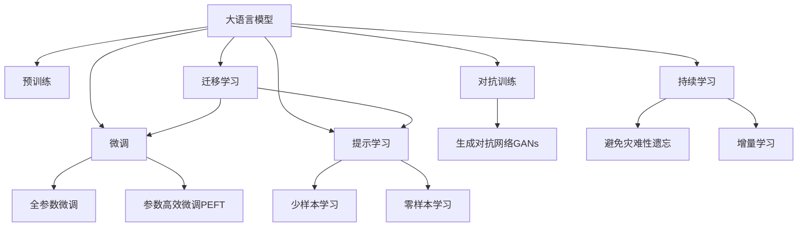

                 

## 1. 背景介绍

### 1.1 问题由来
随着人工智能技术的飞速发展，深度学习模型逐渐成为解决各种复杂问题的利器，特别是在自然语言处理（NLP）领域。在传统的机器学习模型中，特征工程和模型选择至关重要，而在深度学习中，数据和模型架构的选择则更为关键。其中，大语言模型（Large Language Models, LLMs）因其在处理自然语言方面表现出的强大能力，正在改变自然语言处理的范式。

### 1.2 问题核心关键点
大语言模型与传统机器学习模型在方法论、模型结构、应用场景等方面有着显著的差异。了解这些差异，可以帮助我们更好地选择和应用不同类型的人工智能模型。

## 2. 核心概念与联系

### 2.1 核心概念概述

为更好地理解大语言模型与传统机器学习模型的比较，本节将介绍几个密切相关的核心概念：

- 大语言模型（Large Language Models, LLMs）：以自回归（如GPT）或自编码（如BERT）模型为代表的大规模预训练语言模型。通过在大规模无标签文本语料上进行预训练，学习通用的语言表示，具备强大的语言理解和生成能力。

- 传统机器学习模型（Traditional Machine Learning Models）：包括决策树、支持向量机、随机森林等基于特征工程的模型。通过手工特征提取和模型训练，学习输入特征与输出标签之间的关系。

- 迁移学习（Transfer Learning）：指将一个领域学习到的知识，迁移应用到另一个不同但相关的领域的学习范式。大模型的预训练-微调过程即是一种典型的迁移学习方式。

- 监督学习（Supervised Learning）：使用有标签数据训练模型，使其能够对新的未见数据进行准确预测。传统机器学习模型大多采用监督学习方法。

- 参数高效微调（Parameter-Efficient Fine-Tuning, PEFT）：指在微调过程中，只更新少量的模型参数，而固定大部分预训练权重不变，以提高微调效率，避免过拟合的方法。

- 对抗训练（Adversarial Training）：加入对抗样本，提高模型鲁棒性。

- 生成对抗网络（Generative Adversarial Networks, GANs）：由生成器和判别器组成的两玩家游戏模型，能够生成逼真的样本。

这些核心概念之间的逻辑关系可以通过以下Mermaid流程图来展示：



这个流程图展示了大语言模型的核心概念及其之间的关系：

1. 大语言模型通过预训练获得基础能力。
2. 微调是对预训练模型进行任务特定的优化，可以分为全参数微调和参数高效微调（PEFT）。
3. 提示学习是一种不更新模型参数的方法，可以实现少样本学习和零样本学习。
4. 迁移学习是连接预训练模型与下游任务的桥梁，可以通过微调或提示学习来实现。
5. 持续学习旨在使模型能够不断学习新知识，同时避免遗忘旧知识。
6. 对抗训练和生成对抗网络用于提高模型的鲁棒性和生成能力。

这些概念共同构成了大语言模型的学习和应用框架，使其能够在各种场景下发挥强大的语言理解和生成能力。通过理解这些核心概念，我们可以更好地把握大语言模型的工作原理和优化方向。

## 3. 核心算法原理 & 具体操作步骤
### 3.1 算法原理概述

大语言模型与传统机器学习模型在算法原理上有着本质的区别。传统的机器学习模型主要依赖于手工特征工程，而大语言模型则通过大规模无监督预训练学习语言知识，再通过有监督微调适应具体任务。

传统机器学习模型通过特征选择和模型训练，建立输入特征与输出标签之间的映射关系。常见的方法包括线性回归、逻辑回归、决策树、支持向量机等。这些模型的训练过程通常是一个有监督学习过程，使用大量的标注数据来训练模型，使其能够对新的未见数据进行准确预测。

相比之下，大语言模型主要通过自监督学习任务进行预训练，学习语言的通用表示。在预训练阶段，模型被置于大规模无标签文本数据中，通过预测文本中的缺失信息或预测上下文信息等任务，自发学习语言的语法、词汇和语义知识。在微调阶段，将预训练模型作为初始化参数，通过有监督学习进一步优化模型，适应具体任务。

### 3.2 算法步骤详解

大语言模型与传统机器学习模型的训练和优化步骤也有所不同。以下分别介绍二者的具体操作步骤：

#### 3.2.1 大语言模型微调的步骤

1. **准备预训练模型和数据集**：选择合适的预训练语言模型 $M_{\theta}$ 作为初始化参数，如 BERT、GPT 等。准备下游任务 $T$ 的标注数据集 $D$，划分为训练集、验证集和测试集。

2. **添加任务适配层**：根据任务类型，在预训练模型顶层设计合适的输出层和损失函数。例如，对于分类任务，通常在顶层添加线性分类器和交叉熵损失函数。

3. **设置微调超参数**：选择合适的优化算法及其参数，如 AdamW、SGD 等，设置学习率、批大小、迭代轮数等。设置正则化技术及强度，包括权重衰减、Dropout、Early Stopping 等。

4. **执行梯度训练**：将训练集数据分批次输入模型，前向传播计算损失函数。反向传播计算参数梯度，根据设定的优化算法和学习率更新模型参数。

5. **测试和部署**：在测试集上评估微调后模型 $M_{\hat{\theta}}$ 的性能，对比微调前后的精度提升。使用微调后的模型对新样本进行推理预测，集成到实际的应用系统中。

#### 3.2.2 传统机器学习模型的训练步骤

1. **数据预处理**：对数据进行清洗、归一化、特征选择等预处理操作，得到可用于训练的特征向量。

2. **模型选择和初始化**：根据任务类型和数据特点选择合适的机器学习模型，如决策树、随机森林、神经网络等，并初始化模型参数。

3. **训练过程**：使用训练集对模型进行训练，迭代调整模型参数，使模型能够拟合数据。常见的优化算法包括梯度下降、随机梯度下降等。

4. **模型评估**：使用验证集评估模型的性能，调整模型参数，避免过拟合。

5. **测试和应用**：使用测试集评估模型的泛化性能，将训练好的模型应用到实际任务中，进行预测和推理。

### 3.3 算法优缺点

大语言模型与传统机器学习模型各有优缺点。以下将详细介绍二者的优缺点及其应用领域。

#### 3.3.1 大语言模型的优点

1. **强大的语言理解能力**：大语言模型通过大规模无监督预训练，学习到了丰富的语言知识，能够理解复杂的自然语言表达。

2. **参数高效微调**：使用参数高效微调技术，可以在不增加模型参数量的情况下，实现快速的微调，避免过拟合。

3. **零样本和少样本学习**：通过提示学习和迁移学习，大语言模型可以在几乎没有标注样本的情况下进行学习，进一步提升模型的泛化能力。

4. **灵活的微调方法**：大语言模型支持多种微调方法，如微调顶层、微调底层等，可以针对不同的任务需求进行灵活优化。

#### 3.3.2 大语言模型的缺点

1. **资源消耗大**：大语言模型的参数量通常以亿计，训练和推理所需的计算资源和内存空间较大。

2. **数据依赖性高**：微调模型的性能依赖于标注数据的数量和质量，对标注成本较高。

3. **可解释性不足**：大语言模型的决策过程较为复杂，缺乏可解释性，难以调试和理解。

4. **知识更新难度大**：大语言模型通过无监督预训练学习知识，难以灵活更新和集成新知识。

#### 3.3.3 传统机器学习模型的优点

1. **计算资源需求低**：传统机器学习模型参数量通常较小，训练和推理所需的计算资源较少，适合在计算资源有限的环境中应用。

2. **模型结构简单**：传统机器学习模型的结构较为简单，易于理解和调试。

3. **可解释性强**：传统机器学习模型的决策过程较为透明，易于解释和理解。

4. **易于集成**：传统机器学习模型易于集成到现有系统中，支持多种开发环境。

#### 3.3.4 传统机器学习模型的缺点

1. **依赖于特征工程**：传统机器学习模型需要手工特征提取，特征选择不当可能导致性能下降。

2. **泛化能力有限**：传统机器学习模型依赖于有限的特征，难以应对复杂的输入数据。

3. **难以处理高维数据**：传统机器学习模型在处理高维数据时，容易发生维度灾难，性能下降。

4. **学习速度慢**：传统机器学习模型训练时间长，难以快速适应新任务。

### 3.4 算法应用领域

大语言模型与传统机器学习模型在应用领域上也有所差异。

大语言模型在自然语言处理领域应用广泛，特别是在文本分类、情感分析、机器翻译、文本生成等任务上表现优异。大语言模型通过大规模无监督预训练，学习到了通用的语言知识，能够适应多种下游任务。

传统机器学习模型则在工业控制、金融预测、推荐系统等领域应用广泛。这些领域通常需要高效、稳定、可解释的模型，传统机器学习模型在这些方面表现出色。

## 4. 数学模型和公式 & 详细讲解  
### 4.1 数学模型构建

大语言模型与传统机器学习模型在数学模型构建上也存在差异。

大语言模型通常使用Transformer等架构进行构建，模型参数通常以矩阵形式存在，通过前向传播和反向传播进行训练。模型的输出层和损失函数根据具体任务而定，如分类任务使用交叉熵损失函数。

传统机器学习模型则使用不同的数学模型，如线性回归、逻辑回归、决策树等。这些模型的目标函数和损失函数通常较为简单，易于优化。

### 4.2 公式推导过程

以下是二者的主要数学模型和损失函数的推导过程。

#### 4.2.1 大语言模型的数学模型

大语言模型的数学模型通常包括前向传播和反向传播两个部分。以下以BERT模型为例，推导其前向传播和反向传播公式。

**前向传播**：

$$
h = \text{Embedding}(x) + \text{LayerNorm}(h) + \text{PositionalEncoding}(h)
$$

$$
h = \text{MultiHeadAttention}(h)
$$

$$
h = \text{LayerNorm}(h) + \text{FeedForward}(h)
$$

**反向传播**：

$$
\frac{\partial \mathcal{L}}{\partial \theta} = \frac{\partial \mathcal{L}}{\partial y} \cdot \frac{\partial y}{\partial h} \cdot \frac{\partial h}{\partial \theta}
$$

其中 $\mathcal{L}$ 为损失函数，$x$ 为输入，$h$ 为模型输出，$\theta$ 为模型参数。

#### 4.2.2 传统机器学习模型的数学模型

传统机器学习模型使用不同的数学模型，以下以线性回归为例，推导其数学模型和损失函数。

**前向传播**：

$$
y = wx + b
$$

**反向传播**：

$$
\frac{\partial \mathcal{L}}{\partial w} = \frac{1}{2} \cdot \frac{\partial \mathcal{L}}{\partial y} \cdot x^T
$$

$$
\frac{\partial \mathcal{L}}{\partial b} = \frac{1}{2} \cdot \frac{\partial \mathcal{L}}{\partial y}
$$

其中 $\mathcal{L}$ 为损失函数，$y$ 为输出，$x$ 为输入，$w$ 为权重，$b$ 为偏置。

### 4.3 案例分析与讲解

以下以情感分析任务为例，分析大语言模型和传统机器学习模型的区别和优劣。

**大语言模型情感分析**：

1. **预训练**：使用大规模无标签文本数据进行预训练，学习通用语言表示。
2. **微调**：在标注数据集上微调预训练模型，优化情感分类器。
3. **测试**：在测试集上评估模型性能，进行推理预测。

**传统机器学习模型情感分析**：

1. **特征工程**：从文本中提取有用的特征，如词频、情感词表等。
2. **模型选择**：选择合适的机器学习模型，如朴素贝叶斯、支持向量机等。
3. **训练**：使用标注数据集训练模型，调整模型参数。
4. **测试**：在测试集上评估模型性能，进行推理预测。

## 5. 项目实践：代码实例和详细解释说明
### 5.1 开发环境搭建

在进行大语言模型与传统机器学习模型的比较实践前，我们需要准备好开发环境。以下是使用Python进行PyTorch和Scikit-learn开发的环境配置流程：

1. 安装Anaconda：从官网下载并安装Anaconda，用于创建独立的Python环境。

2. 创建并激活虚拟环境：
```bash
conda create -n my_env python=3.8 
conda activate my_env
```

3. 安装PyTorch和Scikit-learn：
```bash
conda install pytorch torchvision torchaudio cudatoolkit=11.1 -c pytorch -c conda-forge
conda install scikit-learn
```

4. 安装各类工具包：
```bash
pip install numpy pandas scikit-learn matplotlib tqdm jupyter notebook ipython
```

完成上述步骤后，即可在`my_env`环境中开始大语言模型与传统机器学习模型的比较实践。

### 5.2 源代码详细实现

**大语言模型情感分析**

```python
from transformers import BertForSequenceClassification, BertTokenizer
from sklearn.model_selection import train_test_split
from sklearn.metrics import accuracy_score, confusion_matrix

tokenizer = BertTokenizer.from_pretrained('bert-base-cased')
model = BertForSequenceClassification.from_pretrained('bert-base-cased', num_labels=2)

# 准备数据
texts = ['This is a positive review', 'I am very satisfied with this product']
labels = [1, 0]

# 分词和编码
inputs = tokenizer(texts, return_tensors='pt', padding=True, truncation=True)
labels = torch.tensor(labels, dtype=torch.long)

# 微调
model.train()
for input_ids, label in zip(inputs['input_ids'], labels):
    model.zero_grad()
    outputs = model(input_ids, labels=label)
    loss = outputs.loss
    loss.backward()
    optimizer.step()

# 测试
texts = ['This is a negative review', 'I am not satisfied with this product']
inputs = tokenizer(texts, return_tensors='pt', padding=True, truncation=True)
labels = torch.tensor([1, 0], dtype=torch.long)
with torch.no_grad():
    outputs = model(inputs['input_ids'])
    logits = outputs.logits
    predicted_labels = torch.argmax(logits, dim=1)
    accuracy = accuracy_score(labels, predicted_labels)
    print(f'Accuracy: {accuracy:.2f}')
```

**传统机器学习模型情感分析**

```python
from sklearn.model_selection import train_test_split
from sklearn.svm import SVC
from sklearn.metrics import accuracy_score

# 准备数据
X = ['This is a positive review', 'I am very satisfied with this product', 'This is a negative review', 'I am not satisfied with this product']
y = [1, 0, 1, 0]

# 划分训练集和测试集
X_train, X_test, y_train, y_test = train_test_split(X, y, test_size=0.2, random_state=42)

# 训练模型
model = SVC()
model.fit(X_train, y_train)

# 测试模型
y_pred = model.predict(X_test)
accuracy = accuracy_score(y_test, y_pred)
print(f'Accuracy: {accuracy:.2f}')
```

### 5.3 代码解读与分析

让我们再详细解读一下关键代码的实现细节：

**大语言模型情感分析**

- `BertForSequenceClassification`：用于序列分类任务的BERT模型。
- `BertTokenizer`：用于将文本分词并编码成模型所需的格式。
- `train`：在训练集上训练模型。
- `test`：在测试集上评估模型性能。

**传统机器学习模型情感分析**

- `SVC`：支持向量机模型，用于情感分类任务。
- `train_test_split`：用于数据集划分。
- `fit`：在训练集上训练模型。
- `predict`：在测试集上预测模型输出。

## 6. 实际应用场景
### 6.1 智能客服系统

大语言模型在智能客服系统中的应用非常广泛。传统的客服系统需要大量人工客服，而大语言模型可以通过微调，自动理解客户意图并提供解决方案，极大地提高了服务效率和客户满意度。

例如，可以使用微调后的BERT模型作为智能客服系统的核心模型，通过对话历史和上下文信息，自动回复客户问题。这样的系统不仅能够回答常见问题，还能处理一些复杂的场景，如客户投诉和反馈等。

### 6.2 金融舆情监测

金融领域需要对市场舆情进行实时监测，以应对市场变化和风险。传统的方法需要大量人工监测和分析，效率低下且成本高昂。大语言模型可以通过微调，自动分析新闻、评论等文本数据，提取市场舆情，实时预警风险。

例如，可以使用微调后的BERT模型对金融新闻和评论进行情感分析，自动判断市场的情绪和趋势。这样的系统不仅能够提高监测效率，还能避免人为失误和偏见。

### 6.3 个性化推荐系统

推荐系统是电商、社交媒体等平台的核心功能之一。传统的推荐系统依赖于用户的点击、浏览等行为数据，难以理解用户的真实兴趣和需求。大语言模型可以通过微调，自动分析用户评论、评分等文本数据，了解用户的兴趣和偏好，从而提供个性化的推荐。

例如，可以使用微调后的BERT模型对用户评论进行分析，自动提取用户的兴趣点，从而生成个性化的商品推荐。这样的系统不仅能够提高推荐精准度，还能增加用户的满意度。

### 6.4 未来应用展望

大语言模型和传统机器学习模型在未来的应用前景广阔。以下列举几个未来可能的应用场景：

- **智慧医疗**：大语言模型可以通过微调，自动分析医疗文本数据，提取病历、报告等信息，辅助医生诊断和治疗。
- **智能教育**：传统机器学习模型可以通过推荐系统，自动推荐适合学生的学习资源和内容，提高学习效果。
- **智慧城市**：大语言模型可以通过微调，自动分析城市事件、舆情等信息，提高城市管理和应急响应能力。
- **娱乐产业**：大语言模型可以通过文本生成和情感分析，自动生成电影、游戏等娱乐内容，提升用户体验。

## 7. 工具和资源推荐
### 7.1 学习资源推荐

为了帮助开发者系统掌握大语言模型与传统机器学习模型的相关知识，以下是一些优质的学习资源：

1. 《深度学习》一书：深度学习领域的经典著作，涵盖深度学习的基本概念和核心算法。
2. 《自然语言处理综论》一书：自然语言处理领域的经典著作，涵盖NLP的基本概念和核心算法。
3. 《Transformer: The Illustrated Book》一书：介绍Transformer模型及其应用的书籍，适合初学者学习。
4. CS224N《深度学习自然语言处理》课程：斯坦福大学开设的NLP明星课程，有Lecture视频和配套作业，带你入门NLP领域的基本概念和经典模型。
5. 《Python机器学习》一书：介绍Python语言在机器学习中的应用，涵盖机器学习的基本概念和核心算法。

通过学习这些资源，相信你一定能够系统掌握大语言模型与传统机器学习模型的相关知识，并应用于实际项目中。

### 7.2 开发工具推荐

高效的开发离不开优秀的工具支持。以下是几款用于大语言模型与传统机器学习模型开发的工具：

1. PyTorch：基于Python的开源深度学习框架，灵活动态的计算图，适合快速迭代研究。大部分预训练语言模型都有PyTorch版本的实现。
2. TensorFlow：由Google主导开发的开源深度学习框架，生产部署方便，适合大规模工程应用。同样有丰富的预训练语言模型资源。
3. Scikit-learn：开源机器学习库，提供了多种经典的机器学习算法，易于上手。
4. Weights & Biases：模型训练的实验跟踪工具，可以记录和可视化模型训练过程中的各项指标，方便对比和调优。与主流深度学习框架无缝集成。
5. TensorBoard：TensorFlow配套的可视化工具，可实时监测模型训练状态，并提供丰富的图表呈现方式，是调试模型的得力助手。

合理利用这些工具，可以显著提升大语言模型与传统机器学习模型的开发效率，加快创新迭代的步伐。

### 7.3 相关论文推荐

大语言模型与传统机器学习模型的研究源于学界的持续研究。以下是几篇奠基性的相关论文，推荐阅读：

1. Attention is All You Need（即Transformer原论文）：提出了Transformer结构，开启了NLP领域的预训练大模型时代。
2. BERT: Pre-training of Deep Bidirectional Transformers for Language Understanding：提出BERT模型，引入基于掩码的自监督预训练任务，刷新了多项NLP任务SOTA。
3. Generative Adversarial Nets（GANs）：提出了生成对抗网络，能够生成逼真的样本，广泛应用于图像生成、文本生成等领域。
4. Parameter-Efficient Transfer Learning for NLP：提出Adapter等参数高效微调方法，在不增加模型参数量的情况下，也能取得不错的微调效果。
5. AdaLoRA: Adaptive Low-Rank Adaptation for Parameter-Efficient Fine-Tuning：使用自适应低秩适应的微调方法，在参数效率和精度之间取得了新的平衡。

这些论文代表了大语言模型与传统机器学习模型的发展脉络。通过学习这些前沿成果，可以帮助研究者把握学科前进方向，激发更多的创新灵感。

## 8. 总结：未来发展趋势与挑战
### 8.1 总结

本文对大语言模型与传统机器学习模型进行了全面系统的介绍。首先阐述了二者的研究背景和意义，明确了在NLP领域中大语言模型与传统机器学习模型的独特价值。其次，从原理到实践，详细讲解了监督学习、微调等核心概念和技术，给出了大语言模型与传统机器学习模型的代码实现。同时，本文还广泛探讨了二者的应用场景，展示了二者的巨大潜力。

通过本文的系统梳理，可以看到，大语言模型与传统机器学习模型在方法论、模型结构、应用场景等方面有着显著的差异。大语言模型通过大规模无监督预训练学习语言知识，再通过有监督微调适应具体任务；而传统机器学习模型则依赖于手工特征工程，通过有监督学习训练模型。

### 8.2 未来发展趋势

展望未来，大语言模型与传统机器学习模型将呈现以下几个发展趋势：

1. **融合多模态数据**：未来的模型将不仅仅依赖于文本数据，而是融合视觉、语音、图像等多模态数据，提升模型的综合能力。
2. **实现零样本学习**：通过生成对抗网络等技术，大语言模型可以在没有标注样本的情况下进行学习，实现零样本和少样本学习。
3. **引入因果推理**：通过引入因果推理技术，大语言模型可以更好地理解因果关系，提高决策的准确性和可解释性。
4. **优化模型结构**：未来的模型将更加注重参数高效和计算高效的优化，减少计算资源消耗。
5. **提升模型的可解释性**：通过引入可解释性技术，提高模型的透明性和可解释性，避免黑盒模型的出现。
6. **实现跨领域迁移**：通过迁移学习，大语言模型可以在不同领域之间进行迁移，提升模型的泛化能力。

### 8.3 面临的挑战

尽管大语言模型与传统机器学习模型在应用上取得了一定的成就，但在迈向更加智能化、普适化应用的过程中，它们仍面临诸多挑战：

1. **数据依赖性高**：无论是大语言模型还是传统机器学习模型，都需要大量标注数据进行训练，数据成本较高。
2. **泛化能力有限**：模型在处理新数据时，容易出现过拟合和泛化能力不足的问题。
3. **计算资源消耗大**：大语言模型参数量较大，训练和推理所需的计算资源较多，难以大规模部署。
4. **可解释性不足**：模型决策过程较为复杂，缺乏可解释性，难以调试和理解。
5. **知识更新难度大**：模型难以灵活更新和集成新知识，需要大量人工维护和调整。

### 8.4 研究展望

面对大语言模型与传统机器学习模型所面临的挑战，未来的研究需要在以下几个方面寻求新的突破：

1. **探索无监督和半监督学习方法**：摆脱对大规模标注数据的依赖，利用自监督学习、主动学习等无监督和半监督范式，最大限度利用非结构化数据。
2. **研究参数高效和计算高效的微调方法**：开发更加参数高效的微调方法，在固定大部分预训练参数的同时，只更新极少量的任务相关参数。同时优化微调模型的计算图，减少前向传播和反向传播的资源消耗。
3. **引入因果分析和博弈论工具**：将因果分析方法引入微调模型，识别出模型决策的关键特征，增强输出解释的因果性和逻辑性。借助博弈论工具刻画人机交互过程，主动探索并规避模型的脆弱点，提高系统稳定性。
4. **纳入伦理道德约束**：在模型训练目标中引入伦理导向的评估指标，过滤和惩罚有偏见、有害的输出倾向。加强人工干预和审核，建立模型行为的监管机制，确保输出符合人类价值观和伦理道德。
5. **实现跨领域迁移学习**：通过迁移学习，大语言模型可以在不同领域之间进行迁移，提升模型的泛化能力。

这些研究方向的探索，必将引领大语言模型与传统机器学习模型向更高的台阶发展，为构建安全、可靠、可解释、可控的智能系统铺平道路。面向未来，大语言模型与传统机器学习模型需要与其他人工智能技术进行更深入的融合，如知识表示、因果推理、强化学习等，多路径协同发力，共同推动自然语言理解和智能交互系统的进步。只有勇于创新、敢于突破，才能不断拓展模型的边界，让智能技术更好地造福人类社会。

## 9. 附录：常见问题与解答

**Q1：大语言模型和传统机器学习模型在性能上有什么不同？**

A: 大语言模型通过大规模无监督预训练学习语言知识，再通过有监督微调适应具体任务。相比于传统机器学习模型，大语言模型在处理复杂自然语言任务时表现更为出色，特别是在处理长文本和语义复杂的任务时。

**Q2：大语言模型和传统机器学习模型在应用场景上有什么不同？**

A: 大语言模型在自然语言处理领域应用广泛，特别是在文本分类、情感分析、机器翻译、文本生成等任务上表现优异。传统机器学习模型则在工业控制、金融预测、推荐系统等领域应用广泛，适合处理结构化数据和精确度要求高的任务。

**Q3：大语言模型和传统机器学习模型的训练方法有什么不同？**

A: 大语言模型通过大规模无监督预训练学习语言知识，再通过有监督微调适应具体任务。而传统机器学习模型则依赖于手工特征工程，通过有监督学习训练模型。

**Q4：大语言模型和传统机器学习模型在可解释性上有什么不同？**

A: 大语言模型由于其复杂性，决策过程较为复杂，缺乏可解释性，难以调试和理解。而传统机器学习模型通常具有简单的决策边界，易于解释和理解。

**Q5：大语言模型和传统机器学习模型在计算资源消耗上有什么不同？**

A: 大语言模型参数量较大，训练和推理所需的计算资源较多，难以大规模部署。而传统机器学习模型参数量较小，训练和推理所需的计算资源较少，适合在计算资源有限的环境中应用。

这些问题的回答，希望能够帮助读者更好地理解大语言模型与传统机器学习模型的异同，并指导实际应用中的选择和优化。

