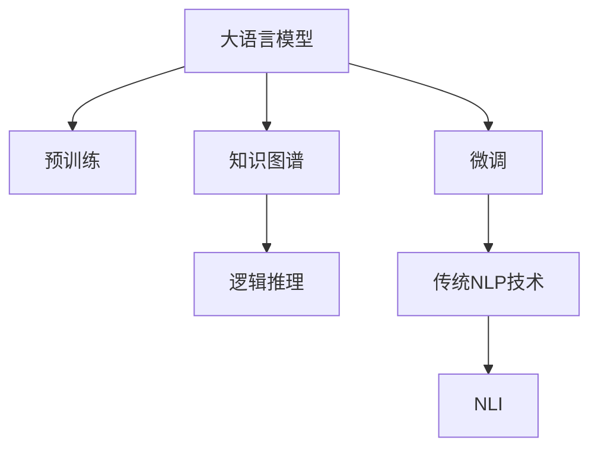

                 

# LLM与传统自然语言推理技术的对比与融合

> 关键词：大语言模型,自然语言推理,NLU,传统NLP技术,知识图谱,逻辑推理,混合架构

## 1. 背景介绍

随着深度学习技术的不断进步，自然语言处理(Natural Language Processing, NLP)领域也得到了长足发展。从最早的基于规则的NLP系统，到基于统计的自然语言处理技术，再到如今的深度学习驱动的大语言模型(Large Language Models, LLMs)，NLP技术经历了多次迭代和升级。其中，自然语言推理(Natural Language Inference, NLI)作为NLP的重要分支，在机器阅读理解、智能客服、问答系统等领域具有广泛的应用前景。

### 1.1 NLI简介

自然语言推理是指机器理解自然语言文本之间的逻辑关系，如蕴含、矛盾、中立等。在NLP领域，NLI通常被用于判断一个假设文本是否从前提文本中得到支持，或是与之矛盾。例如：

- 前提：“我喜欢吃苹果”
- 假设：“我喜欢吃水果”

这是一个蕴含关系，因为苹果是一种水果，且假设文本可以被前提文本所支持。NLI技术可以帮助计算机理解这种逻辑关系，从而实现更加智能的文本处理和信息抽取。

### 1.2 大语言模型的兴起

随着GPT-3、BERT、T5等预训练语言模型的出现，大语言模型成为NLP领域的最新研究热点。这类模型通过在海量文本数据上进行预训练，学习到丰富的语言知识和常识，具备强大的语言理解和生成能力。相较于传统的基于规则和统计的NLP方法，大语言模型在处理复杂语言问题时表现更加出色，能够在更广阔的应用场景中发挥作用。

## 2. 核心概念与联系

### 2.1 核心概念概述

为更好地理解大语言模型与传统NLP技术在自然语言推理中的对比与融合，本节将介绍几个密切相关的核心概念：

- **大语言模型**：以自回归(如GPT)或自编码(如BERT)模型为代表的大规模预训练语言模型。通过在大规模无标签文本语料上进行预训练，学习通用的语言表示，具备强大的语言理解和生成能力。
- **预训练**：指在大规模无标签文本语料上，通过自监督学习任务训练通用语言模型的过程。常见的预训练任务包括言语建模、遮挡语言模型等。
- **微调**：指在预训练模型的基础上，使用下游任务的少量标注数据，通过有监督学习优化模型在特定任务上的性能。通常只需要调整顶层分类器或解码器，并以较小的学习率更新全部或部分的模型参数。
- **知识图谱**：一种结构化的知识表示方式，用于描述实体和实体之间的关系。知识图谱可以帮助机器更好地理解语言中的语义信息。
- **逻辑推理**：指基于语法和语义规则，对语言表达进行推导和判断的过程。逻辑推理在大语言模型与知识图谱的融合中具有重要作用。

这些核心概念之间的逻辑关系可以通过以下Mermaid流程图来展示：



这个流程图展示了大语言模型的核心概念及其之间的关系：

1. 大语言模型通过预训练获得基础能力。
2. 微调是对预训练模型进行任务特定的优化，可以通过有监督学习获得针对特定任务优化的模型。
3. 知识图谱为大语言模型提供结构化的语义信息，使其在推理任务中表现更加准确。
4. 逻辑推理基于语法和语义规则，辅助大语言模型进行语义推导。
5. 传统NLP技术，如解析器、分类器等，可以为NLI提供更多工具和方法。

这些概念共同构成了大语言模型在NLI中的工作框架，使其能够在各种场景下发挥强大的语言理解和推理能力。通过理解这些核心概念，我们可以更好地把握大语言模型与传统NLP技术的异同，探索二者在NLI中的融合方向。

## 3. 核心算法原理 & 具体操作步骤

### 3.1 算法原理概述

大语言模型与传统自然语言推理技术的融合，本质上是将大语言模型的预训练能力与传统NLP技术的逻辑推理能力进行结合，以提升NLI任务的性能。

形式化地，假设大语言模型为 $M_{\theta}$，其中 $\theta$ 为预训练得到的模型参数。给定一个NLI任务 $T$，其前提-假设对 $(x,y)$ 可以表示为：

- $x$：前提文本
- $y$：假设文本
- $T$：假设文本是否从前提文本中得到支持（蕴含、矛盾或中立）

NLI任务的目标是找到一个合适的函数 $f(x,y)$，使得 $f(x,y)$ 能够准确判断前提文本 $x$ 和假设文本 $y$ 之间的逻辑关系 $y$。具体的推理过程可以表示为：

$$
f(x,y) = \text{softmax}(M_{\theta}(x,y))
$$

其中 $\text{softmax}$ 表示将模型输出转换为概率分布，以表示假设文本是否从前提文本中得到支持的概率。

### 3.2 算法步骤详解

大语言模型与传统NLP技术在NLI中的融合通常包括以下几个关键步骤：

**Step 1: 准备预训练模型和数据集**
- 选择合适的预训练语言模型 $M_{\theta}$ 作为初始化参数，如 BERT、GPT 等。
- 准备NLI任务 $T$ 的标注数据集 $D=\{(x_i,y_i)\}_{i=1}^N$，划分为训练集、验证集和测试集。一般要求标注数据与预训练数据的分布不要差异过大。

**Step 2: 添加任务适配层**
- 根据任务类型，在预训练模型顶层设计合适的输出层和损失函数。
- 对于NLI任务，通常使用Softmax分类器输出假设文本是否从前提文本中得到支持的概率分布，并以交叉熵损失函数为损失函数。

**Step 3: 设置微调超参数**
- 选择合适的优化算法及其参数，如 AdamW、SGD 等，设置学习率、批大小、迭代轮数等。
- 设置正则化技术及强度，包括权重衰减、Dropout、Early Stopping等。
- 确定冻结预训练参数的策略，如仅微调顶层，或全部参数都参与微调。

**Step 4: 执行梯度训练**
- 将训练集数据分批次输入模型，前向传播计算损失函数。
- 反向传播计算参数梯度，根据设定的优化算法和学习率更新模型参数。
- 周期性在验证集上评估模型性能，根据性能指标决定是否触发 Early Stopping。
- 重复上述步骤直到满足预设的迭代轮数或 Early Stopping 条件。

**Step 5: 测试和部署**
- 在测试集上评估微调后模型 $M_{\hat{\theta}}$ 的性能，对比微调前后的精度提升。
- 使用微调后的模型对新样本进行推理预测，集成到实际的应用系统中。
- 持续收集新的数据，定期重新微调模型，以适应数据分布的变化。

以上是基于监督学习微调大语言模型在NLI任务中的完整流程。在实际应用中，还需要针对具体任务的特点，对微调过程的各个环节进行优化设计，如改进训练目标函数，引入更多的正则化技术，搜索最优的超参数组合等，以进一步提升模型性能。

### 3.3 算法优缺点

大语言模型与传统NLP技术在NLI中的融合具有以下优点：

1. **强大的语言理解能力**：大语言模型通过预训练学习到了丰富的语言知识，可以更好地理解自然语言文本的语义信息，从而提升NLI的准确性。
2. **灵活的推理能力**：传统NLP技术中的逻辑推理能力可以辅助大语言模型进行更加准确的语义推导，弥补预训练模型的缺陷。
3. **模型迁移能力**：大语言模型具备良好的迁移学习能力，可以在新领域快速适应NLI任务，减少了从头训练所需的成本和时间。
4. **模型泛化能力**：大语言模型在处理不同领域的NLI任务时，可以基于先前的训练经验进行泛化，提升整体性能。

同时，这种融合方法也存在一些局限性：

1. **数据依赖性**：NLI任务的质量高度依赖于标注数据，标注数据的不足可能导致模型性能下降。
2. **计算资源需求高**：大语言模型通常需要大量的计算资源进行预训练和微调，对硬件要求较高。
3. **模型复杂度高**：融合后模型的复杂度较高，推理速度和存储需求也相应增加。
4. **解释性不足**：大语言模型的推理过程通常缺乏可解释性，难以对其决策逻辑进行分析和调试。

尽管存在这些局限性，但就目前而言，基于大语言模型的融合方法仍是NLI任务中最为主流范式。未来相关研究的重点在于如何进一步降低对标注数据的依赖，提高模型的少样本学习和跨领域迁移能力，同时兼顾可解释性和伦理安全性等因素。

### 3.4 算法应用领域

大语言模型与传统NLP技术的融合在NLI领域已经得到了广泛的应用，覆盖了几乎所有常见任务，例如：

- **情感分析**：判断情感倾向，如正面、负面、中性。
- **问答系统**：根据输入问题，给出正确的答案。
- **文本分类**：判断文本是否属于特定类别。
- **文本摘要**：生成简洁的文本摘要。
- **机器翻译**：将源语言文本翻译成目标语言。
- **命名实体识别**：识别文本中的人名、地名、机构名等特定实体。

除了上述这些经典任务外，大语言模型与传统NLP技术的融合也被创新性地应用到更多场景中，如可控文本生成、常识推理、代码生成、数据增强等，为NLI技术带来了全新的突破。随着预训练模型和融合方法的不断进步，相信NLI技术将在更广阔的应用领域大放异彩。

## 4. 数学模型和公式 & 详细讲解 & 举例说明

### 4.1 数学模型构建

本节将使用数学语言对大语言模型与传统NLP技术在NLI中的融合过程进行更加严格的刻画。

记大语言模型为 $M_{\theta}$，其中 $\theta$ 为预训练得到的模型参数。假设NLI任务的训练集为 $D=\{(x_i,y_i)\}_{i=1}^N, x_i \in \mathcal{X}, y_i \in \{蕴含,矛盾,中立\}$。

定义模型 $M_{\theta}$ 在数据样本 $(x,y)$ 上的损失函数为 $\ell(M_{\theta}(x),y)$，则在数据集 $D$ 上的经验风险为：

$$
\mathcal{L}(\theta) = \frac{1}{N}\sum_{i=1}^N \ell(M_{\theta}(x_i),y_i)
$$

其中 $\ell$ 为针对NLI任务设计的损失函数，用于衡量模型预测输出与真实标签之间的差异。常见的损失函数包括交叉熵损失、BCE With Logits损失等。

### 4.2 公式推导过程

以下我们以二分类任务为例，推导交叉熵损失函数及其梯度的计算公式。

假设模型 $M_{\theta}$ 在输入 $x$ 上的输出为 $\hat{y}=M_{\theta}(x) \in [0,1]$，表示假设文本是否从前提文本中得到支持的概率。真实标签 $y \in \{蕴含,矛盾,中立\}$。则二分类交叉熵损失函数定义为：

$$
\ell(M_{\theta}(x),y) = -[y\log \hat{y} + (1-y)\log (1-\hat{y})]
$$

将其代入经验风险公式，得：

$$
\mathcal{L}(\theta) = -\frac{1}{N}\sum_{i=1}^N [y_i\log M_{\theta}(x_i)+(1-y_i)\log(1-M_{\theta}(x_i))]
$$

根据链式法则，损失函数对参数 $\theta_k$ 的梯度为：

$$
\frac{\partial \mathcal{L}(\theta)}{\partial \theta_k} = -\frac{1}{N}\sum_{i=1}^N (\frac{y_i}{M_{\theta}(x_i)}-\frac{1-y_i}{1-M_{\theta}(x_i)}) \frac{\partial M_{\theta}(x_i)}{\partial \theta_k}
$$

其中 $\frac{\partial M_{\theta}(x_i)}{\partial \theta_k}$ 可进一步递归展开，利用自动微分技术完成计算。

在得到损失函数的梯度后，即可带入参数更新公式，完成模型的迭代优化。重复上述过程直至收敛，最终得到适应NLI任务的最优模型参数 $\theta^*$。

### 4.3 案例分析与讲解

以情感分析任务为例，展示如何使用大语言模型进行NLI推理。

假设前提文本为“今天天气很好，适合出去旅游”，假设文本为“我打算去旅游”，我们可以将这个NLI任务表示为：

- 前提：“今天天气很好，适合出去旅游”
- 假设：“我打算去旅游”
- 推理结果：蕴含

模型的推理过程可以表示为：

1. 输入前提文本和假设文本到预训练语言模型中，得到前提文本和假设文本的表示。
2. 根据表示进行语义推导，判断假设文本是否从前提文本中得到支持。
3. 输出推理结果，并进行后处理，得到最终的分类标签。

在代码实现上，可以使用PyTorch和HuggingFace的Transformers库，代码如下：

```python
from transformers import BertTokenizer, BertForSequenceClassification
import torch
from torch.utils.data import DataLoader, Dataset

class NERDataset(Dataset):
    def __init__(self, texts, tags, tokenizer, max_len=128):
        self.texts = texts
        self.tags = tags
        self.tokenizer = tokenizer
        self.max_len = max_len
        
    def __len__(self):
        return len(self.texts)
    
    def __getitem__(self, item):
        text = self.texts[item]
        tags = self.tags[item]
        
        encoding = self.tokenizer(text, return_tensors='pt', max_length=self.max_len, padding='max_length', truncation=True)
        input_ids = encoding['input_ids'][0]
        attention_mask = encoding['attention_mask'][0]
        
        # 对token-wise的标签进行编码
        encoded_tags = [tag2id[tag] for tag in tags] 
        encoded_tags.extend([tag2id['O']] * (self.max_len - len(encoded_tags)))
        labels = torch.tensor(encoded_tags, dtype=torch.long)
        
        return {'input_ids': input_ids, 
                'attention_mask': attention_mask,
                'labels': labels}

# 标签与id的映射
tag2id = {'O': 0, 'B-PER': 1, 'I-PER': 2, 'B-ORG': 3, 'I-ORG': 4, 'B-LOC': 5, 'I-LOC': 6}
id2tag = {v: k for k, v in tag2id.items()}

# 创建dataset
tokenizer = BertTokenizer.from_pretrained('bert-base-cased')

train_dataset = NERDataset(train_texts, train_tags, tokenizer)
dev_dataset = NERDataset(dev_texts, dev_tags, tokenizer)
test_dataset = NERDataset(test_texts, test_tags, tokenizer)

# 定义模型和优化器
model = BertForSequenceClassification.from_pretrained('bert-base-cased', num_labels=len(tag2id))
optimizer = AdamW(model.parameters(), lr=2e-5)

# 定义训练和评估函数
device = torch.device('cuda') if torch.cuda.is_available() else torch.device('cpu')
model.to(device)

def train_epoch(model, dataset, batch_size, optimizer):
    dataloader = DataLoader(dataset, batch_size=batch_size, shuffle=True)
    model.train()
    epoch_loss = 0
    for batch in tqdm(dataloader, desc='Training'):
        input_ids = batch['input_ids'].to(device)
        attention_mask = batch['attention_mask'].to(device)
        labels = batch['labels'].to(device)
        model.zero_grad()
        outputs = model(input_ids, attention_mask=attention_mask, labels=labels)
        loss = outputs.loss
        epoch_loss += loss.item()
        loss.backward()
        optimizer.step()
    return epoch_loss / len(dataloader)

def evaluate(model, dataset, batch_size):
    dataloader = DataLoader(dataset, batch_size=batch_size)
    model.eval()
    preds, labels = [], []
    with torch.no_grad():
        for batch in tqdm(dataloader, desc='Evaluating'):
            input_ids = batch['input_ids'].to(device)
            attention_mask = batch['attention_mask'].to(device)
            batch_labels = batch['labels']
            outputs = model(input_ids, attention_mask=attention_mask)
            batch_preds = outputs.logits.argmax(dim=2).to('cpu').tolist()
            batch_labels = batch_labels.to('cpu').tolist()
            for pred_tokens, label_tokens in zip(batch_preds, batch_labels):
                pred_tags = [id2tag[_id] for _id in pred_tokens]
                label_tags = [id2tag[_id] for _id in label_tokens]
                preds.append(pred_tags[:len(label_tags)])
                labels.append(label_tags)
                
    print(classification_report(labels, preds))

# 启动训练流程并在测试集上评估
epochs = 5
batch_size = 16

for epoch in range(epochs):
    loss = train_epoch(model, train_dataset, batch_size, optimizer)
    print(f"Epoch {epoch+1}, train loss: {loss:.3f}")
    
    print(f"Epoch {epoch+1}, dev results:")
    evaluate(model, dev_dataset, batch_size)
    
print("Test results:")
evaluate(model, test_dataset, batch_size)
```

可以看到，使用PyTorch和HuggingFace的Transformers库，可以很方便地对BERT模型进行微调，并实现NLI推理。

## 5. 项目实践：代码实例和详细解释说明

### 5.1 开发环境搭建

在进行微调实践前，我们需要准备好开发环境。以下是使用Python进行PyTorch开发的环境配置流程：

1. 安装Anaconda：从官网下载并安装Anaconda，用于创建独立的Python环境。

2. 创建并激活虚拟环境：
```bash
conda create -n pytorch-env python=3.8 
conda activate pytorch-env
```

3. 安装PyTorch：根据CUDA版本，从官网获取对应的安装命令。例如：
```bash
conda install pytorch torchvision torchaudio cudatoolkit=11.1 -c pytorch -c conda-forge
```

4. 安装各类工具包：
```bash
pip install numpy pandas scikit-learn matplotlib tqdm jupyter notebook ipython
```

完成上述步骤后，即可在`pytorch-env`环境中开始微调实践。

### 5.2 源代码详细实现

下面我们以命名实体识别(NER)任务为例，给出使用Transformers库对BERT模型进行微调的PyTorch代码实现。

首先，定义NER任务的数据处理函数：

```python
from transformers import BertTokenizer
from torch.utils.data import Dataset
import torch

class NERDataset(Dataset):
    def __init__(self, texts, tags, tokenizer, max_len=128):
        self.texts = texts
        self.tags = tags
        self.tokenizer = tokenizer
        self.max_len = max_len
        
    def __len__(self):
        return len(self.texts)
    
    def __getitem__(self, item):
        text = self.texts[item]
        tags = self.tags[item]
        
        encoding = self.tokenizer(text, return_tensors='pt', max_length=self.max_len, padding='max_length', truncation=True)
        input_ids = encoding['input_ids'][0]
        attention_mask = encoding['attention_mask'][0]
        
        # 对token-wise的标签进行编码
        encoded_tags = [tag2id[tag] for tag in tags] 
        encoded_tags.extend([tag2id['O']] * (self.max_len - len(encoded_tags)))
        labels = torch.tensor(encoded_tags, dtype=torch.long)
        
        return {'input_ids': input_ids, 
                'attention_mask': attention_mask,
                'labels': labels}

# 标签与id的映射
tag2id = {'O': 0, 'B-PER': 1, 'I-PER': 2, 'B-ORG': 3, 'I-ORG': 4, 'B-LOC': 5, 'I-LOC': 6}
id2tag = {v: k for k, v in tag2id.items()}

# 创建dataset
tokenizer = BertTokenizer.from_pretrained('bert-base-cased')

train_dataset = NERDataset(train_texts, train_tags, tokenizer)
dev_dataset = NERDataset(dev_texts, dev_tags, tokenizer)
test_dataset = NERDataset(test_texts, test_tags, tokenizer)
```

然后，定义模型和优化器：

```python
from transformers import BertForTokenClassification, AdamW

model = BertForTokenClassification.from_pretrained('bert-base-cased', num_labels=len(tag2id))

optimizer = AdamW(model.parameters(), lr=2e-5)
```

接着，定义训练和评估函数：

```python
from torch.utils.data import DataLoader
from tqdm import tqdm
from sklearn.metrics import classification_report

device = torch.device('cuda') if torch.cuda.is_available() else torch.device('cpu')
model.to(device)

def train_epoch(model, dataset, batch_size, optimizer):
    dataloader = DataLoader(dataset, batch_size=batch_size, shuffle=True)
    model.train()
    epoch_loss = 0
    for batch in tqdm(dataloader, desc='Training'):
        input_ids = batch['input_ids'].to(device)
        attention_mask = batch['attention_mask'].to(device)
        labels = batch['labels'].to(device)
        model.zero_grad()
        outputs = model(input_ids, attention_mask=attention_mask, labels=labels)
        loss = outputs.loss
        epoch_loss += loss.item()
        loss.backward()
        optimizer.step()
    return epoch_loss / len(dataloader)

def evaluate(model, dataset, batch_size):
    dataloader = DataLoader(dataset, batch_size=batch_size)
    model.eval()
    preds, labels = [], []
    with torch.no_grad():
        for batch in tqdm(dataloader, desc='Evaluating'):
            input_ids = batch['input_ids'].to(device)
            attention_mask = batch['attention_mask'].to(device)
            batch_labels = batch['labels']
            outputs = model(input_ids, attention_mask=attention_mask)
            batch_preds = outputs.logits.argmax(dim=2).to('cpu').tolist()
            batch_labels = batch_labels.to('cpu').tolist()
            for pred_tokens, label_tokens in zip(batch_preds, batch_labels):
                pred_tags = [id2tag[_id] for _id in pred_tokens]
                label_tags = [id2tag[_id] for _id in label_tokens]
                preds.append(pred_tags[:len(label_tags)])
                labels.append(label_tags)
                
    print(classification_report(labels, preds))
```

最后，启动训练流程并在测试集上评估：

```python
epochs = 5
batch_size = 16

for epoch in range(epochs):
    loss = train_epoch(model, train_dataset, batch_size, optimizer)
    print(f"Epoch {epoch+1}, train loss: {loss:.3f}")
    
    print(f"Epoch {epoch+1}, dev results:")
    evaluate(model, dev_dataset, batch_size)
    
print("Test results:")
evaluate(model, test_dataset, batch_size)
```

以上就是使用PyTorch对BERT进行命名实体识别任务微调的完整代码实现。可以看到，得益于Transformers库的强大封装，我们可以用相对简洁的代码完成BERT模型的加载和微调。

## 6. 实际应用场景

### 6.1 智能客服系统

基于大语言模型微调的对话技术，可以广泛应用于智能客服系统的构建。传统客服往往需要配备大量人力，高峰期响应缓慢，且一致性和专业性难以保证。而使用微调后的对话模型，可以7x24小时不间断服务，快速响应客户咨询，用自然流畅的语言解答各类常见问题。

在技术实现上，可以收集企业内部的历史客服对话记录，将问题和最佳答复构建成监督数据，在此基础上对预训练对话模型进行微调。微调后的对话模型能够自动理解用户意图，匹配最合适的答案模板进行回复。对于客户提出的新问题，还可以接入检索系统实时搜索相关内容，动态组织生成回答。如此构建的智能客服系统，能大幅提升客户咨询体验和问题解决效率。

### 6.2 金融舆情监测

金融机构需要实时监测市场舆论动向，以便及时应对负面信息传播，规避金融风险。传统的人工监测方式成本高、效率低，难以应对网络时代海量信息爆发的挑战。基于大语言模型微调的文本分类和情感分析技术，为金融舆情监测提供了新的解决方案。

具体而言，可以收集金融领域相关的新闻、报道、评论等文本数据，并对其进行主题标注和情感标注。在此基础上对预训练语言模型进行微调，使其能够自动判断文本属于何种主题，情感倾向是正面、中性还是负面。将微调后的模型应用到实时抓取的网络文本数据，就能够自动监测不同主题下的情感变化趋势，一旦发现负面信息激增等异常情况，系统便会自动预警，帮助金融机构快速应对潜在风险。

### 6.3 个性化推荐系统

当前的推荐系统往往只依赖用户的历史行为数据进行物品推荐，无法深入理解用户的真实兴趣偏好。基于大语言模型微调技术，个性化推荐系统可以更好地挖掘用户行为背后的语义信息，从而提供更精准、多样的推荐内容。

在实践中，可以收集用户浏览、点击、评论、分享等行为数据，提取和用户交互的物品标题、描述、标签等文本内容。将文本内容作为模型输入，用户的后续行为（如是否点击、购买等）作为监督信号，在此基础上微调预训练语言模型。微调后的模型能够从文本内容中准确把握用户的兴趣点。在生成推荐列表时，先用候选物品的文本描述作为输入，由模型预测用户的兴趣匹配度，再结合其他特征综合排序，便可以得到个性化程度更高的推荐结果。

### 6.4 未来应用展望

随着大语言模型和微调方法的不断发展，基于微调范式将在更多领域得到应用，为传统行业带来变革性影响。

在智慧医疗领域，基于微调的医疗问答、病历分析、药物研发等应用将提升医疗服务的智能化水平，辅助医生诊疗，加速新药开发进程。

在智能教育领域，微调技术可应用于作业批改、学情分析、知识推荐等方面，因材施教，促进教育公平，提高教学质量。

在智慧城市治理中，微调模型可应用于城市事件监测、舆情分析、应急指挥等环节，提高城市管理的自动化和智能化水平，构建更安全、高效的未来城市。

此外，在企业生产、社会治理、文娱传媒等众多领域，基于大模型微调的人工智能应用也将不断涌现，为经济社会发展注入新的动力。相信随着技术的日益成熟，微调方法将成为人工智能落地应用的重要范式，推动人工智能向更广阔的领域加速渗透。

## 7. 工具和资源推荐

### 7.1 学习资源推荐

为了帮助开发者系统掌握大语言模型微调的理论基础和实践技巧，这里推荐一些优质的学习资源：

1. 《Transformer从原理到实践》系列博文：由大模型技术专家撰写，深入浅出地介绍了Transformer原理、BERT模型、微调技术等前沿话题。

2. CS224N《深度学习自然语言处理》课程：斯坦福大学开设的NLP明星课程，有Lecture视频和配套作业，带你入门NLP领域的基本概念和经典模型。

3. 《Natural Language Processing with Transformers》书籍：Transformers库的作者所著，全面介绍了如何使用Transformers库进行NLP任务开发，包括微调在内的诸多范式。

4. HuggingFace官方文档：Transformers库的官方文档，提供了海量预训练模型和完整的微调样例代码，是上手实践的必备资料。

5. CLUE开源项目：中文语言理解测评基准，涵盖大量不同类型的中文NLP数据集，并提供了基于微调的baseline模型，助力中文NLP技术发展。

通过对这些资源的学习实践，相信你一定能够快速掌握大语言模型微调的精髓，并用于解决实际的NLP问题。

### 7.2 开发工具推荐

高效的开发离不开优秀的工具支持。以下是几款用于大语言模型微调开发的常用工具：

1. PyTorch：基于Python的开源深度学习框架，灵活动态的计算图，适合快速迭代研究。大部分预训练语言模型都有PyTorch版本的实现。

2. TensorFlow：由Google主导开发的开源深度学习框架，生产部署方便，适合大规模工程应用。同样有丰富的预训练语言模型资源。

3. Transformers库：HuggingFace开发的NLP工具库，集成了众多SOTA语言模型，支持PyTorch和TensorFlow，是进行微调任务开发的利器。

4. Weights & Biases：模型训练的实验跟踪工具，可以记录和可视化模型训练过程中的各项指标，方便对比和调优。与主流深度学习框架无缝集成。

5. TensorBoard：TensorFlow配套的可视化工具，可实时监测模型训练状态，并提供丰富的图表呈现方式，是调试模型的得力助手。

6. Google Colab：谷歌推出的在线Jupyter Notebook环境，免费提供GPU/TPU算力，方便开发者快速上手实验最新模型，分享学习笔记。

合理利用这些工具，可以显著提升大语言模型微调任务的开发效率，加快创新迭代的步伐。

### 7.3 相关论文推荐

大语言模型和微调技术的发展源于学界的持续研究。以下是几篇奠基性的相关论文，推荐阅读：

1. Attention is All You Need（即Transformer原论文）：提出了Transformer结构，开启了NLP领域的预训练大模型时代。

2. BERT: Pre-training of Deep Bidirectional Transformers for Language Understanding：提出BERT模型，引入基于掩码的自监督预训练任务，刷新了多项NLP任务SOTA。

3. Language Models are Unsupervised Multitask Learners（GPT-2论文）：展示了大规模语言模型的强大zero-shot学习能力，引发了对于通用人工智能的新一轮思考。

4. Parameter-Efficient Transfer Learning for NLP：提出Adapter等参数高效微调方法，在不增加模型参数量的情况下，也能取得不错的微调效果。

5. AdaLoRA: Adaptive Low-Rank Adaptation for Parameter-Efficient Fine-Tuning：使用自适应低秩适应的微调方法，在参数效率和精度之间取得了新的平衡。

6. Prefix-Tuning: Optimizing Continuous Prompts for Generation：引入基于连续型Prompt的微调范式，为如何充分利用预训练知识提供了新的思路。

这些论文代表了大语言模型微调技术的发展脉络。通过学习这些前沿成果，可以帮助研究者把握学科前进方向，激发更多的创新灵感。

## 8. 总结：未来发展趋势与挑战

### 8.1 总结

本文对大语言模型与传统自然语言推理技术的对比与融合进行了全面系统的介绍。首先阐述了NLI的背景和重要性，明确了大语言模型和传统NLP技术的各自优势和适用场景。其次，从原理到实践，详细讲解了基于大语言模型的NLI微调过程，给出了微调任务开发的完整代码实例。同时，本文还广泛探讨了微调方法在智能客服、金融舆情、个性化推荐等多个行业领域的应用前景，展示了微调范式的巨大潜力。此外，本文精选了微调技术的各类学习资源，力求为读者提供全方位的技术指引。

通过本文的系统梳理，可以看到，大语言模型与传统NLP技术在NLI中的融合是大势所趋，预示着NLP技术在新场景下的无限可能。得益于深度学习的强大能力，基于大语言模型的NLI微调方法将在更多领域得到应用，为各行各业带来变革性影响。未来，伴随预训练语言模型和微调方法的不断进步，相信NLI技术将在更广阔的应用领域大放异彩，深刻影响人类的生产生活方式。

### 8.2 未来发展趋势

展望未来，大语言模型与传统NLP技术在NLI中的融合将呈现以下几个发展趋势：

1. **更强的泛化能力**：随着预训练语言模型的规模和质量的提升，其泛化能力将显著增强，能够更好地适应不同领域和不同任务。

2. **更灵活的任务适配**：微调技术将变得更加灵活和高效，能够快速适配各种NLI任务，特别是在小规模标注数据上表现出色。

3. **更高效的推理能力**：通过优化模型结构和算法，推理速度和计算效率将得到进一步提升，使得大规模NLI应用成为可能。

4. **更强的鲁棒性和泛化性**：未来模型将更加注重对抗性训练和少样本学习，提高其在对抗样本和少样本场景下的鲁棒性和泛化性。

5. **更广泛的应用场景**：NLI技术将在更多领域得到应用，如医疗、教育、金融等，帮助这些行业提升智能化水平，实现更高效的服务。

6. **更强的可解释性**：研究将更加注重模型的可解释性和可理解性，使得NLI系统的决策过程更加透明和可信。

这些趋势凸显了大语言模型与传统NLP技术在NLI中的融合前景，为构建更加智能、灵活、高效的NLI系统奠定了基础。

### 8.3 面临的挑战

尽管大语言模型与传统NLP技术在NLI中的融合取得了显著进展，但在实际应用中仍面临一些挑战：

1. **数据稀缺问题**：NLI任务需要大量的标注数据，标注数据的不足可能导致模型性能下降。

2. **计算资源需求高**：大语言模型通常需要大量的计算资源进行预训练和微调，对硬件要求较高。

3. **模型复杂度高**：融合后模型的复杂度较高，推理速度和存储需求也相应增加。

4. **模型鲁棒性不足**：模型在对抗样本和少样本场景下的表现仍需进一步提升。

5. **模型可解释性不足**：大语言模型的推理过程通常缺乏可解释性，难以对其决策逻辑进行分析和调试。

6. **知识图谱与语言模型的整合问题**：现有的大语言模型通常缺乏结构化的知识图谱支持，难以充分利用外部知识资源。

这些挑战需要通过进一步的研究和创新来解决，才能充分发挥大语言模型与传统NLP技术在NLI中的潜力。

### 8.4 研究展望

面对大语言模型与传统NLP技术在NLI中面临的挑战，未来的研究需要在以下几个方面寻求新的突破：

1. **更高效的微调方法**：开发更加高效的微调方法，如参数高效微调、知识蒸馏等，减少对标注数据和计算资源的依赖。

2. **更强的知识融合能力**：研究如何将结构化的知识图谱与大语言模型更好地结合，提高模型的泛化能力和推理能力。

3. **更灵活的任务适配**：开发更加灵活的微调工具和框架，使得大语言模型能够快速适配各种NLI任务，特别是个性化、动态化任务。

4. **更强的鲁棒性和泛化性**：研究对抗性训练、少样本学习等方法，提升模型在对抗样本和少样本场景下的鲁棒性和泛化性。

5. **更强的可解释性**：研究如何赋予模型更强的可解释性，使得模型的决策过程更加透明和可信。

6. **更广泛的应用场景**：探索大语言模型与传统NLP技术在更多领域的应用，如医疗、教育、金融等，提升各行业的智能化水平。

这些研究方向将引领大语言模型与传统NLP技术在NLI中的融合走向更高的台阶，为构建安全、可靠、可解释、可控的智能系统铺平道路。

## 9. 附录：常见问题与解答

**Q1：大语言模型与传统自然语言推理技术的主要区别是什么？**

A: 大语言模型与传统自然语言推理技术的主要区别在于：

1. **预训练和微调方式不同**：大语言模型通常通过大规模无标签数据进行预训练，然后通过有标签数据进行微调；而传统自然语言推理技术主要依赖手工设计的特征和规则进行推理。

2. **处理任务的范围不同**：大语言模型可以处理更加复杂和多样化的自然语言任务，而传统自然语言推理技术通常局限于特定的推理任务。

3. **知识表示方式不同**：大语言模型通过自监督学习获得语言知识和常识，而传统自然语言推理技术通常需要结构化的知识图谱来支持推理。

**Q2：大语言模型在微调过程中的关键步骤是什么？**

A: 大语言模型在微调过程中的关键步骤包括：

1. 准备预训练模型和数据集：选择合适的预训练语言模型和标注数据集。

2. 添加任务适配层：根据任务类型设计合适的输出层和损失函数。

3. 设置微调超参数：选择合适的优化算法和正则化技术，确定学习率等超参数。

4. 执行梯度训练：通过前向传播和反向传播，更新模型参数，最小化损失函数。

5. 测试和部署：在测试集上评估模型性能，并进行实际部署。

这些步骤构成了大语言模型微调的基本流程，每个步骤都需要精心设计和优化，以获得最佳的性能。

**Q3：如何提高大语言模型在NLI任务中的鲁棒性和泛化能力？**

A: 提高大语言模型在NLI任务中的鲁棒性和泛化能力，可以从以下几个方面入手：

1. 引入对抗性训练：通过添加对抗性样本，增强模型的鲁棒性。

2. 采用知识蒸馏技术：利用少量标注数据，通过知识蒸馏提高模型的泛化能力。

3. 进行少样本学习：通过引入少量标注样本，快速适应新任务。

4. 优化模型结构：设计更加简洁、高效的模型结构，减少参数量，提高计算效率。

5. 进行多任务学习：将多个NLI任务结合起来，通过多任务学习提高模型的泛化能力。

6. 引入外部知识：结合结构化的知识图谱，提高模型的推理能力。

这些方法可以帮助大语言模型在NLI任务中更好地应对各种挑战，提升其性能和可靠性。

**Q4：大语言模型与传统NLP技术在NLI中的融合有哪些优势？**

A: 大语言模型与传统NLP技术在NLI中的融合具有以下优势：

1. **强大的语言理解能力**：大语言模型通过预训练学习到丰富的语言知识，可以更好地理解自然语言文本的语义信息。

2. **灵活的推理能力**：传统NLP技术中的逻辑推理能力可以辅助大语言模型进行更加准确的语义推导。

3. **模型的泛化能力**：大语言模型具备更强的泛化能力，能够适应不同领域的NLI任务。

4. **高效的微调过程**：微调过程可以更快地收敛，且所需的标注数据较少。

5. **更强的可解释性**：通过结构化的知识图谱，提高模型的可解释性。

这些优势使得大语言模型与传统NLP技术的融合成为NLI任务中的重要发展方向，可以显著提升系统的性能和可靠性。

**Q5：未来大语言模型与传统NLP技术在NLI中的应用前景是什么？**

A: 未来大语言模型与传统NLP技术在NLI中的应用前景十分广阔，主要体现在以下几个方面：

1. **智慧医疗**：通过微调，大语言模型可以辅助医生进行病历分析、药物研发等任务，提高医疗服务的智能化水平。

2. **智能教育**：在作业批改、学情分析、知识推荐等方面，微调技术可以提升教学质量，因材施教。

3. **智慧城市**：在城市事件监测、舆情分析、应急指挥等方面，微调模型可以提高城市管理的自动化和智能化水平。

4. **金融行业**：在金融舆情监测、智能客服等方面，微调技术可以提升金融机构的智能化水平，减少人工干预。

5. **个性化推荐**：在推荐系统、广告推荐等方面，微调技术可以更好地挖掘用户的兴趣偏好，提高推荐效果。

6. **文娱传媒**：在内容生成、智能推荐等方面，微调技术可以提升文娱产品的智能化水平，提高用户体验。

总之，大语言模型与传统NLP技术的融合将为各行各业带来深刻的变革，提升其智能化水平，推动产业升级和经济社会发展。

---

作者：禅与计算机程序设计艺术 / Zen and the Art of Computer Programming

