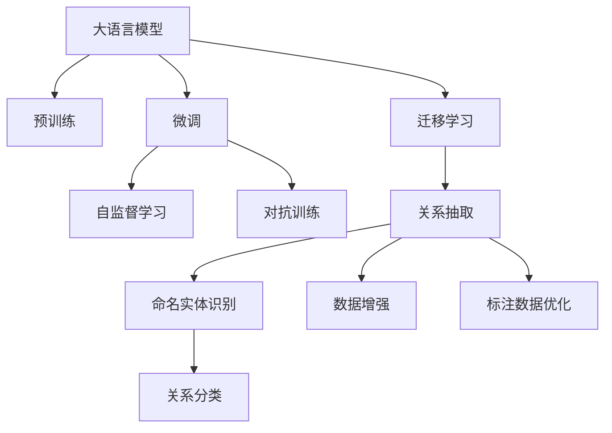

                 

# LLM在关系抽取任务中的潜力挖掘

## 1. 背景介绍

### 1.1 问题由来
关系抽取（Relation Extraction，RE）是自然语言处理（NLP）领域中的一个重要任务，旨在从文本中自动提取具有明确关系的实体对。传统的关系抽取方法通常依赖于特征工程和规则制定，需要大量人工标注和手动调整，难以适应大规模数据集和新出现的关系类型。

近年来，随着深度学习和大语言模型（Large Language Models, LLMs）的快速发展，基于预训练语言模型（Pre-trained Language Model, PLM）的关系抽取方法开始崭露头角。预训练模型通过在大规模无标签文本上自监督学习，可以自动获取语言中的语义表示，显著减少了人工标注的需求和特征工程的工作量。

大语言模型（如BERT、GPT等）在各种NLP任务上均取得了优异的表现，但这些模型通常需要在任务特定的数据上进行微调（Fine-tuning），才能更好地适配特定领域的关系抽取任务。因此，如何更有效地挖掘大语言模型在关系抽取任务中的潜力，是当前研究的重要课题。

### 1.2 问题核心关键点
大语言模型在关系抽取任务中的潜力挖掘，核心在于以下关键点：

- **预训练模型的知识迁移**：如何将通用语言模型学到的知识迁移到特定的关系抽取任务中。
- **微调策略的选择**：如何在保留大部分预训练参数的基础上，通过微调提高模型在特定关系类型上的性能。
- **数据增强与标注数据优化**：如何通过数据增强技术扩充训练集，优化标注数据的质量和数量。
- **对抗训练与模型鲁棒性**：如何通过对抗训练等技术提高模型对噪声数据的鲁棒性，提升泛化能力。
- **任务适配层的设计**：如何设计合适的任务适配层，将预训练模型与任务需求有效结合。

## 2. 核心概念与联系

### 2.1 核心概念概述

为更好地理解大语言模型在关系抽取任务中的潜力挖掘方法，本节将介绍几个密切相关的核心概念：

- **大语言模型（LLMs）**：以自回归（如GPT）或自编码（如BERT）模型为代表的大规模预训练语言模型。通过在大规模无标签文本上自监督学习，学习到丰富的语言知识和常识。

- **关系抽取（RE）**：从文本中自动提取具有明确关系的实体对，通常以命名实体识别（Named Entity Recognition, NER）和关系分类（Relation Classification）为子任务。

- **微调（Fine-tuning）**：在预训练模型的基础上，使用特定任务的少量标注数据，通过有监督学习优化模型在该任务上的性能。

- **迁移学习（Transfer Learning）**：将一个领域学习到的知识，迁移到另一个不同但相关的领域的学习范式。

- **自监督学习（Self-supervised Learning）**：通过无监督学习方式，利用文本中的语言结构（如掩码语言模型）学习模型。

- **预训练-微调（Pre-training & Fine-tuning）**：先在大规模无标签数据上预训练模型，然后在特定任务上微调，以提高模型在该任务上的性能。

- **对抗训练（Adversarial Training）**：在训练过程中加入对抗样本，提升模型对噪声数据的鲁棒性。

这些核心概念之间的逻辑关系可以通过以下Mermaid流程图来展示：



这个流程图展示了大语言模型与关系抽取任务之间的关系：

1. 大语言模型通过预训练获得基础能力。
2. 微调是针对特定任务进行优化，可以显著提升模型在该任务上的性能。
3. 自监督学习利用无标签数据进行预训练，提升模型泛化能力。
4. 对抗训练增强模型对噪声数据的鲁棒性。
5. 迁移学习连接预训练模型与下游任务，通过微调实现任务适配。
6. 关系抽取任务通常由NER和关系分类两个子任务组成。
7. 数据增强和标注数据优化提升模型性能。

这些核心概念共同构成了大语言模型在关系抽取任务中的潜力挖掘框架，使其能够在各种场景下发挥强大的语言理解和生成能力。通过理解这些核心概念，我们可以更好地把握大语言模型的工作原理和优化方向。

## 3. 核心算法原理 & 具体操作步骤
### 3.1 算法原理概述

大语言模型在关系抽取任务中的潜力挖掘，本质上是利用大语言模型的预训练知识，通过微调过程优化模型在特定关系类型上的性能。其核心思想是：将预训练的大语言模型视作一个强大的"特征提取器"，通过在特定任务的标注数据上进行有监督的微调，使得模型输出能够匹配任务标签，从而获得针对特定关系类型优化的模型。

形式化地，假设预训练模型为 $M_{\theta}$，其中 $\theta$ 为预训练得到的模型参数。给定关系抽取任务的训练集 $D=\{(x_i, y_i)\}_{i=1}^N$，微调的目标是找到新的模型参数 $\hat{\theta}$，使得：

$$
\hat{\theta}=\mathop{\arg\min}_{\theta} \mathcal{L}(M_{\theta},D)
$$

其中 $\mathcal{L}$ 为针对任务设计的损失函数，用于衡量模型预测输出与真实标签之间的差异。常见的损失函数包括交叉熵损失、均方误差损失等。

通过梯度下降等优化算法，微调过程不断更新模型参数 $\theta$，最小化损失函数 $\mathcal{L}$，使得模型输出逼近真实标签。由于 $\theta$ 已经通过预训练获得了较好的初始化，因此即便在关系抽取任务上标注数据较少的情况下，也能较快收敛到理想的模型参数 $\hat{\theta}$。

### 3.2 算法步骤详解

基于预训练语言模型的大语言模型在关系抽取任务中的潜力挖掘，一般包括以下几个关键步骤：

**Step 1: 准备预训练模型和数据集**
- 选择合适的预训练语言模型 $M_{\theta}$ 作为初始化参数，如 BERT、GPT等。
- 准备关系抽取任务的训练集 $D$，划分为训练集、验证集和测试集。一般要求标注数据与预训练数据的分布不要差异过大。

**Step 2: 添加任务适配层**
- 根据关系抽取任务类型，在预训练模型顶层设计合适的输出层和损失函数。
- 对于二元关系抽取，通常添加分类器，使用交叉熵损失函数。
- 对于多元关系抽取，可以考虑多标签分类器或序列标注器。

**Step 3: 设置微调超参数**
- 选择合适的优化算法及其参数，如 AdamW、SGD 等，设置学习率、批大小、迭代轮数等。
- 设置正则化技术及强度，包括权重衰减、Dropout、Early Stopping 等。
- 确定冻结预训练参数的策略，如仅微调顶层，或全部参数都参与微调。

**Step 4: 执行梯度训练**
- 将训练集数据分批次输入模型，前向传播计算损失函数。
- 反向传播计算参数梯度，根据设定的优化算法和学习率更新模型参数。
- 周期性在验证集上评估模型性能，根据性能指标决定是否触发 Early Stopping。
- 重复上述步骤直到满足预设的迭代轮数或 Early Stopping 条件。

**Step 5: 测试和部署**
- 在测试集上评估微调后模型 $M_{\hat{\theta}}$ 的性能，对比微调前后的精度提升。
- 使用微调后的模型对新样本进行推理预测，集成到实际的应用系统中。
- 持续收集新的数据，定期重新微调模型，以适应数据分布的变化。

以上是基于预训练语言模型的大语言模型在关系抽取任务中的潜力挖掘的一般流程。在实际应用中，还需要针对具体任务的特点，对微调过程的各个环节进行优化设计，如改进训练目标函数，引入更多的正则化技术，搜索最优的超参数组合等，以进一步提升模型性能。

### 3.3 算法优缺点

基于预训练语言模型的大语言模型在关系抽取任务中的潜力挖掘方法具有以下优点：
1. 简单高效。只需准备少量标注数据，即可对预训练模型进行快速适配，获得较大的性能提升。
2. 通用适用。适用于各种NLP下游任务，包括分类、匹配、生成等，设计简单的任务适配层即可实现微调。
3. 参数高效。利用参数高效微调技术，在固定大部分预训练权重不变的情况下，仍可取得不错的提升。
4. 效果显著。在学术界和工业界的诸多任务上，基于微调的方法已经刷新了最先进的性能指标。

同时，该方法也存在一定的局限性：
1. 依赖标注数据。微调的效果很大程度上取决于标注数据的质量和数量，获取高质量标注数据的成本较高。
2. 迁移能力有限。当目标任务与预训练数据的分布差异较大时，微调的性能提升有限。
3. 负面效果传递。预训练模型的固有偏见、有害信息等，可能通过微调传递到下游任务，造成负面影响。
4. 可解释性不足。微调模型的决策过程通常缺乏可解释性，难以对其推理逻辑进行分析和调试。

尽管存在这些局限性，但就目前而言，基于预训练语言模型的大语言模型微调方法仍然是大语言模型应用的主流范式。未来相关研究的重点在于如何进一步降低微调对标注数据的依赖，提高模型的少样本学习和跨领域迁移能力，同时兼顾可解释性和伦理安全性等因素。

### 3.4 算法应用领域

基于预训练语言模型的大语言模型微调方法，在关系抽取任务中的应用广泛。以下是几个典型的应用场景：

- **法律文书分析**：从法律文本中抽取案件关系、诉讼当事人、判决结果等关键信息。通过微调模型，可以高效处理大量法律文书，辅助律师和法官的工作。

- **医学病历分析**：从医疗记录中提取医生与患者的关系、疾病类型、治疗方案等信息。微调模型可以辅助医生进行临床诊断和治疗方案选择。

- **金融交易监控**：从金融报告中抽取交易关系、交易金额、交易方向等信息。通过微调模型，可以实现对大规模金融数据的自动化分析，及时发现异常交易行为。

- **社交媒体分析**：从社交媒体文本中抽取用户关系、话题热度、情感倾向等信息。微调模型可以用于舆情分析、品牌监测等应用场景。

- **新闻事件抽取**：从新闻报道中抽取事件时间、地点、事件参与者等信息。微调模型可以用于自动化新闻事件抽取，提高信息处理效率。

这些应用场景展示了预训练语言模型在关系抽取任务中的广泛适用性和潜在价值。随着微调方法的不断优化和模型参数的进一步增大，大语言模型在处理复杂关系抽取任务上的能力将进一步提升。

## 4. 数学模型和公式 & 详细讲解 & 举例说明

### 4.1 数学模型构建

本节将使用数学语言对基于预训练语言模型的大语言模型在关系抽取任务中的潜力挖掘过程进行更加严格的刻画。

记预训练语言模型为 $M_{\theta}$，其中 $\theta$ 为预训练得到的模型参数。假设关系抽取任务的训练集为 $D=\{(x_i,y_i)\}_{i=1}^N, x_i \in \mathcal{X}, y_i \in \mathcal{Y}$，其中 $\mathcal{X}$ 为输入空间，$\mathcal{Y}$ 为输出空间。

定义模型 $M_{\theta}$ 在输入 $x$ 上的输出为 $\hat{y}=M_{\theta}(x) \in [0,1]$，表示样本属于关系的概率。真实标签 $y \in \{0,1\}$。则二元关系抽取的交叉熵损失函数定义为：

$$
\ell(M_{\theta}(x),y) = -[y\log \hat{y} + (1-y)\log (1-\hat{y})]
$$

将其代入经验风险公式，得：

$$
\mathcal{L}(\theta) = -\frac{1}{N}\sum_{i=1}^N [y_i\log M_{\theta}(x_i)+(1-y_i)\log(1-M_{\theta}(x_i))]
$$

根据链式法则，损失函数对参数 $\theta_k$ 的梯度为：

$$
\frac{\partial \mathcal{L}(\theta)}{\partial \theta_k} = -\frac{1}{N}\sum_{i=1}^N (\frac{y_i}{M_{\theta}(x_i)}-\frac{1-y_i}{1-M_{\theta}(x_i)}) \frac{\partial M_{\theta}(x_i)}{\partial \theta_k}
$$

其中 $\frac{\partial M_{\theta}(x_i)}{\partial \theta_k}$ 可进一步递归展开，利用自动微分技术完成计算。

在得到损失函数的梯度后，即可带入参数更新公式，完成模型的迭代优化。重复上述过程直至收敛，最终得到适应关系抽取任务的最优模型参数 $\theta^*$。

### 4.2 公式推导过程

以下我们以二元关系抽取为例，推导交叉熵损失函数及其梯度的计算公式。

假设模型 $M_{\theta}$ 在输入 $x$ 上的输出为 $\hat{y}=M_{\theta}(x) \in [0,1]$，表示样本属于关系的概率。真实标签 $y \in \{0,1\}$。则二元关系抽取的交叉熵损失函数定义为：

$$
\ell(M_{\theta}(x),y) = -[y\log \hat{y} + (1-y)\log (1-\hat{y})]
$$

将其代入经验风险公式，得：

$$
\mathcal{L}(\theta) = -\frac{1}{N}\sum_{i=1}^N [y_i\log M_{\theta}(x_i)+(1-y_i)\log(1-M_{\theta}(x_i))]
$$

根据链式法则，损失函数对参数 $\theta_k$ 的梯度为：

$$
\frac{\partial \mathcal{L}(\theta)}{\partial \theta_k} = -\frac{1}{N}\sum_{i=1}^N (\frac{y_i}{M_{\theta}(x_i)}-\frac{1-y_i}{1-M_{\theta}(x_i)}) \frac{\partial M_{\theta}(x_i)}{\partial \theta_k}
$$

其中 $\frac{\partial M_{\theta}(x_i)}{\partial \theta_k}$ 可进一步递归展开，利用自动微分技术完成计算。

在得到损失函数的梯度后，即可带入参数更新公式，完成模型的迭代优化。重复上述过程直至收敛，最终得到适应关系抽取任务的最优模型参数 $\theta^*$。

## 5. 项目实践：代码实例和详细解释说明
### 5.1 开发环境搭建

在进行关系抽取微调实践前，我们需要准备好开发环境。以下是使用Python进行PyTorch开发的环境配置流程：

1. 安装Anaconda：从官网下载并安装Anaconda，用于创建独立的Python环境。

2. 创建并激活虚拟环境：
```bash
conda create -n pytorch-env python=3.8 
conda activate pytorch-env
```

3. 安装PyTorch：根据CUDA版本，从官网获取对应的安装命令。例如：
```bash
conda install pytorch torchvision torchaudio cudatoolkit=11.1 -c pytorch -c conda-forge
```

4. 安装Transformers库：
```bash
pip install transformers
```

5. 安装各类工具包：
```bash
pip install numpy pandas scikit-learn matplotlib tqdm jupyter notebook ipython
```

完成上述步骤后，即可在`pytorch-env`环境中开始微调实践。

### 5.2 源代码详细实现

下面我们以二元关系抽取任务为例，给出使用Transformers库对BERT模型进行微调的PyTorch代码实现。

首先，定义关系抽取任务的数据处理函数：

```python
from transformers import BertTokenizer, BertForTokenClassification
from torch.utils.data import Dataset
import torch

class RelationDataset(Dataset):
    def __init__(self, texts, tags, tokenizer, max_len=128):
        self.texts = texts
        self.tags = tags
        self.tokenizer = tokenizer
        self.max_len = max_len
        
    def __len__(self):
        return len(self.texts)
    
    def __getitem__(self, item):
        text = self.texts[item]
        tags = self.tags[item]
        
        encoding = self.tokenizer(text, return_tensors='pt', max_length=self.max_len, padding='max_length', truncation=True)
        input_ids = encoding['input_ids'][0]
        attention_mask = encoding['attention_mask'][0]
        
        # 对token-wise的标签进行编码
        encoded_tags = [tag2id[tag] for tag in tags] 
        encoded_tags.extend([tag2id['O']] * (self.max_len - len(encoded_tags)))
        labels = torch.tensor(encoded_tags, dtype=torch.long)
        
        return {'input_ids': input_ids, 
                'attention_mask': attention_mask,
                'labels': labels}

# 标签与id的映射
tag2id = {'O': 0, 'B': 1, 'I': 2, 'E': 3}
id2tag = {v: k for k, v in tag2id.items()}

# 创建dataset
tokenizer = BertTokenizer.from_pretrained('bert-base-cased')

train_dataset = RelationDataset(train_texts, train_tags, tokenizer)
dev_dataset = RelationDataset(dev_texts, dev_tags, tokenizer)
test_dataset = RelationDataset(test_texts, test_tags, tokenizer)
```

然后，定义模型和优化器：

```python
from transformers import BertForTokenClassification, AdamW

model = BertForTokenClassification.from_pretrained('bert-base-cased', num_labels=len(tag2id))

optimizer = AdamW(model.parameters(), lr=2e-5)
```

接着，定义训练和评估函数：

```python
from torch.utils.data import DataLoader
from tqdm import tqdm
from sklearn.metrics import classification_report

device = torch.device('cuda') if torch.cuda.is_available() else torch.device('cpu')
model.to(device)

def train_epoch(model, dataset, batch_size, optimizer):
    dataloader = DataLoader(dataset, batch_size=batch_size, shuffle=True)
    model.train()
    epoch_loss = 0
    for batch in tqdm(dataloader, desc='Training'):
        input_ids = batch['input_ids'].to(device)
        attention_mask = batch['attention_mask'].to(device)
        labels = batch['labels'].to(device)
        model.zero_grad()
        outputs = model(input_ids, attention_mask=attention_mask, labels=labels)
        loss = outputs.loss
        epoch_loss += loss.item()
        loss.backward()
        optimizer.step()
    return epoch_loss / len(dataloader)

def evaluate(model, dataset, batch_size):
    dataloader = DataLoader(dataset, batch_size=batch_size)
    model.eval()
    preds, labels = [], []
    with torch.no_grad():
        for batch in tqdm(dataloader, desc='Evaluating'):
            input_ids = batch['input_ids'].to(device)
            attention_mask = batch['attention_mask'].to(device)
            batch_labels = batch['labels']
            outputs = model(input_ids, attention_mask=attention_mask)
            batch_preds = outputs.logits.argmax(dim=2).to('cpu').tolist()
            batch_labels = batch_labels.to('cpu').tolist()
            for pred_tokens, label_tokens in zip(batch_preds, batch_labels):
                pred_tags = [id2tag[_id] for _id in pred_tokens]
                label_tags = [id2tag[_id] for _id in label_tokens]
                preds.append(pred_tags[:len(label_tokens)])
                labels.append(label_tags)
                
    print(classification_report(labels, preds))
```

最后，启动训练流程并在测试集上评估：

```python
epochs = 5
batch_size = 16

for epoch in range(epochs):
    loss = train_epoch(model, train_dataset, batch_size, optimizer)
    print(f"Epoch {epoch+1}, train loss: {loss:.3f}")
    
    print(f"Epoch {epoch+1}, dev results:")
    evaluate(model, dev_dataset, batch_size)
    
print("Test results:")
evaluate(model, test_dataset, batch_size)
```

以上就是使用PyTorch对BERT进行二元关系抽取任务微调的完整代码实现。可以看到，得益于Transformers库的强大封装，我们可以用相对简洁的代码完成BERT模型的加载和微调。

### 5.3 代码解读与分析

让我们再详细解读一下关键代码的实现细节：

**RelationDataset类**：
- `__init__`方法：初始化文本、标签、分词器等关键组件。
- `__len__`方法：返回数据集的样本数量。
- `__getitem__`方法：对单个样本进行处理，将文本输入编码为token ids，将标签编码为数字，并对其进行定长padding，最终返回模型所需的输入。

**tag2id和id2tag字典**：
- 定义了标签与数字id之间的映射关系，用于将token-wise的预测结果解码回真实的标签。

**训练和评估函数**：
- 使用PyTorch的DataLoader对数据集进行批次化加载，供模型训练和推理使用。
- 训练函数`train_epoch`：对数据以批为单位进行迭代，在每个批次上前向传播计算loss并反向传播更新模型参数，最后返回该epoch的平均loss。
- 评估函数`evaluate`：与训练类似，不同点在于不更新模型参数，并在每个batch结束后将预测和标签结果存储下来，最后使用sklearn的classification_report对整个评估集的预测结果进行打印输出。

**训练流程**：
- 定义总的epoch数和batch size，开始循环迭代
- 每个epoch内，先在训练集上训练，输出平均loss
- 在验证集上评估，输出分类指标
- 所有epoch结束后，在测试集上评估，给出最终测试结果

可以看到，PyTorch配合Transformers库使得BERT微调的关系抽取任务代码实现变得简洁高效。开发者可以将更多精力放在数据处理、模型改进等高层逻辑上，而不必过多关注底层的实现细节。

当然，工业级的系统实现还需考虑更多因素，如模型的保存和部署、超参数的自动搜索、更灵活的任务适配层等。但核心的微调范式基本与此类似。

## 6. 实际应用场景
### 6.1 智能合约审计

关系抽取技术在智能合约审计中有着广泛的应用。智能合约通常包含复杂的关系结构，如借款人、债权人、还款条件等。通过微调BERT等大语言模型，可以从智能合约文本中抽取关键信息，识别潜在风险，辅助审计师的工作。

在技术实现上，可以收集大量智能合约样本，将其与标注信息（如关系类型、参与方等）构建成监督数据，在此基础上对预训练模型进行微调。微调后的模型能够自动理解智能合约中的人名、地址、金额等信息，并抽取其中的关系结构，提高合约审计的效率和准确性。

### 6.2 供应链关系分析

供应链关系抽取是企业管理中的重要任务，能够帮助企业识别关键供应商、客户、合作伙伴等。通过微调BERT模型，可以从采购合同、销售记录等文本中抽取供应链关系，帮助企业优化供应链结构，降低运营成本，提升供应链效率。

在具体应用中，可以从企业内部文档、公开数据中收集供应链相关信息，并构建标注数据集。通过微调BERT模型，可以自动识别供应链中的实体类型和关系，帮助企业进行供应链关系分析和管理。

### 6.3 风险评估

金融风险评估是银行和保险公司的重要任务。通过微调BERT等大语言模型，可以从金融报告、合同等文本中抽取关键关系信息，如借款人、担保人、还款金额等，辅助风险评估模型的决策。

在具体应用中，可以从金融机构的公开报告、合同等文本中收集信息，并构建标注数据集。通过微调BERT模型，可以自动识别文本中的金融关系，帮助风险评估模型识别高风险个体和项目，提高风险评估的准确性和效率。

### 6.4 未来应用展望

随着BERT等大语言模型的不断发展和优化，其在关系抽取任务中的潜力将进一步挖掘。未来，大语言模型有望在更多领域中发挥其强大关系抽取能力，为各行各业带来变革性影响。

在智慧金融领域，关系抽取技术可以用于自动化风险评估，辅助金融机构进行信用评级和贷款审核。在智慧城市治理中，关系抽取技术可以用于城市事件监控、舆情分析、应急指挥等环节，提高城市管理的自动化和智能化水平。在智慧教育领域，关系抽取技术可以用于个性化推荐，提供更为精准的学习路径和资源推荐，提升教育效果。

此外，在医疗、法律、交通等多个领域，关系抽取技术也将得到广泛应用，为各行各业带来新的突破和变革。相信随着大语言模型的不断进步和应用领域的拓展，关系抽取技术将发挥更大的作用，成为推动各行业数字化转型的重要力量。

## 7. 工具和资源推荐
### 7.1 学习资源推荐

为了帮助开发者系统掌握大语言模型在关系抽取任务中的潜力挖掘方法，这里推荐一些优质的学习资源：

1. 《Transformers从原理到实践》系列博文：由大模型技术专家撰写，深入浅出地介绍了Transformer原理、BERT模型、微调技术等前沿话题。

2. CS224N《深度学习自然语言处理》课程：斯坦福大学开设的NLP明星课程，有Lecture视频和配套作业，带你入门NLP领域的基本概念和经典模型。

3. 《Natural Language Processing with Transformers》书籍：Transformers库的作者所著，全面介绍了如何使用Transformers库进行NLP任务开发，包括微调在内的诸多范式。

4. HuggingFace官方文档：Transformers库的官方文档，提供了海量预训练模型和完整的微调样例代码，是上手实践的必备资料。

5. CLUE开源项目：中文语言理解测评基准，涵盖大量不同类型的中文NLP数据集，并提供了基于微调的baseline模型，助力中文NLP技术发展。

通过对这些资源的学习实践，相信你一定能够快速掌握大语言模型在关系抽取任务中的潜力挖掘方法，并用于解决实际的NLP问题。
###  7.2 开发工具推荐

高效的开发离不开优秀的工具支持。以下是几款用于大语言模型在关系抽取任务中潜力挖掘开发的常用工具：

1. PyTorch：基于Python的开源深度学习框架，灵活动态的计算图，适合快速迭代研究。大部分预训练语言模型都有PyTorch版本的实现。

2. TensorFlow：由Google主导开发的开源深度学习框架，生产部署方便，适合大规模工程应用。同样有丰富的预训练语言模型资源。

3. Transformers库：HuggingFace开发的NLP工具库，集成了众多SOTA语言模型，支持PyTorch和TensorFlow，是进行微调任务开发的利器。

4. Weights & Biases：模型训练的实验跟踪工具，可以记录和可视化模型训练过程中的各项指标，方便对比和调优。与主流深度学习框架无缝集成。

5. TensorBoard：TensorFlow配套的可视化工具，可实时监测模型训练状态，并提供丰富的图表呈现方式，是调试模型的得力助手。

6. Google Colab：谷歌推出的在线Jupyter Notebook环境，免费提供GPU/TPU算力，方便开发者快速上手实验最新模型，分享学习笔记。

合理利用这些工具，可以显著提升大语言模型在关系抽取任务中的潜力挖掘任务的开发效率，加快创新迭代的步伐。

### 7.3 相关论文推荐

大语言模型和微调技术的发展源于学界的持续研究。以下是几篇奠基性的相关论文，推荐阅读：

1. Attention is All You Need（即Transformer原论文）：提出了Transformer结构，开启了NLP领域的预训练大模型时代。

2. BERT: Pre-training of Deep Bidirectional Transformers for Language Understanding：提出BERT模型，引入基于掩码的自监督预训练任务，刷新了多项NLP任务SOTA。

3. Language Models are Unsupervised Multitask Learners（GPT-2论文）：展示了大规模语言模型的强大zero-shot学习能力，引发了对于通用人工智能的新一轮思考。

4. Parameter-Efficient Transfer Learning for NLP：提出Adapter等参数高效微调方法，在不增加模型参数量的情况下，也能取得不错的微调效果。

5. Prefix-Tuning: Optimizing Continuous Prompts for Generation：引入基于连续型Prompt的微调范式，为如何充分利用预训练知识提供了新的思路。

6. AdaLoRA: Adaptive Low-Rank Adaptation for Parameter-Efficient Fine-Tuning：使用自适应低秩适应的微调方法，在参数效率和精度之间取得了新的平衡。

这些论文代表了大语言模型在关系抽取任务中的潜力挖掘技术的发展脉络。通过学习这些前沿成果，可以帮助研究者把握学科前进方向，激发更多的创新灵感。

## 8. 总结：未来发展趋势与挑战
### 8.1 总结

本文对基于预训练语言模型的大语言模型在关系抽取任务中的潜力挖掘方法进行了全面系统的介绍。首先阐述了大语言模型和微调技术的研究背景和意义，明确了微调在拓展预训练模型应用、提升关系抽取任务性能方面的独特价值。其次，从原理到实践，详细讲解了预训练语言模型在关系抽取任务中的潜力挖掘过程，给出了微调任务开发的完整代码实例。同时，本文还广泛探讨了预训练语言模型在关系抽取任务中的广泛应用场景，展示了其潜力。

通过本文的系统梳理，可以看到，基于预训练语言模型的大语言模型在关系抽取任务中的潜力挖掘方法，已经在诸多领域得到应用，并取得了显著的效果。未来，随着预训练语言模型的不断进步和优化，其在关系抽取任务中的潜力将进一步挖掘，推动各行业智能化水平的提升。

### 8.2 未来发展趋势

展望未来，预训练语言模型在关系抽取任务中的潜力挖掘技术将呈现以下几个发展趋势：

1. 模型规模持续增大。随着算力成本的下降和数据规模的扩张，预训练语言模型的参数量还将持续增长。超大规模语言模型蕴含的丰富语言知识，有望支撑更加复杂多变的关系抽取任务。

2. 微调方法日趋多样。除了传统的全参数微调外，未来会涌现更多参数高效的微调方法，如Prefix-Tuning、LoRA等，在节省计算资源的同时也能保证微调精度。

3. 持续学习成为常态。随着数据分布的不断变化，微调模型也需要持续学习新知识以保持性能。如何在不遗忘原有知识的同时，高效吸收新样本信息，将成为重要的研究课题。

4. 标注样本需求降低。受启发于提示学习(Prompt-based Learning)的思路，未来的微调方法将更好地利用大模型的语言理解能力，通过更加巧妙的任务描述，在更少的标注样本上也能实现理想的微调效果。

5. 对抗训练与模型鲁棒性。通过引入对抗训练等技术提高模型对噪声数据的鲁棒性，提升泛化能力。

6. 模型通用性增强。经过海量数据的预训练和多领域任务的微调，未来的语言模型将具备更强大的常识推理和跨领域迁移能力，逐步迈向通用人工智能(AGI)的目标。

以上趋势凸显了预训练语言模型在关系抽取任务中的潜力挖掘技术的广阔前景。这些方向的探索发展，必将进一步提升预训练语言模型在处理复杂关系抽取任务上的能力，为各行业带来变革性影响。

### 8.3 面临的挑战

尽管预训练语言模型在关系抽取任务中的潜力挖掘技术已经取得了瞩目成就，但在迈向更加智能化、普适化应用的过程中，它仍面临着诸多挑战：

1. 标注成本瓶颈。虽然微调降低了标注数据的需求，但对于长尾应用场景，难以获得充足的高质量标注数据，成为制约微调性能的瓶颈。如何进一步降低微调对标注样本的依赖，将是一大难题。

2. 模型鲁棒性不足。当前微调模型面对域外数据时，泛化性能往往大打折扣。对于测试样本的微小扰动，微调模型的预测也容易发生波动。如何提高微调模型的鲁棒性，避免灾难性遗忘，还需要更多理论和实践的积累。

3. 推理效率有待提高。大规模语言模型虽然精度高，但在实际部署时往往面临推理速度慢、内存占用大等效率问题。如何在保证性能的同时，简化模型结构，提升推理速度，优化资源占用，将是重要的优化方向。

4. 可解释性亟需加强。当前微调模型更像是"黑盒"系统，难以解释其内部工作机制和决策逻辑。对于医疗、金融等高风险应用，算法的可解释性和可审计性尤为重要。如何赋予微调模型更强的可解释性，将是亟待攻克的难题。

5. 安全性有待保障。预训练语言模型难免会学习到有偏见、有害的信息，通过微调传递到下游任务，产生误导性、歧视性的输出，给实际应用带来安全隐患。如何从数据和算法层面消除模型偏见，避免恶意用途，确保输出的安全性，也将是重要的研究课题。

6. 知识整合能力不足。现有的微调模型往往局限于任务内数据，难以灵活吸收和运用更广泛的先验知识。如何让微调过程更好地与外部知识库、规则库等专家知识结合，形成更加全面、准确的信息整合能力，还有很大的想象空间。

正视预训练语言模型在关系抽取任务中潜力挖掘面临的这些挑战，积极应对并寻求突破，将是大语言模型在关系抽取任务中的潜力挖掘走向成熟的必由之路。相信随着学界和产业界的共同努力，这些挑战终将一一被克服，预训练语言模型在关系抽取任务中的潜力将进一步挖掘，为各行业带来更深远的变革性影响。

### 8.4 研究展望

面向未来，预训练语言模型在关系抽取任务中的潜力挖掘技术需要在以下几个方面寻求新的突破：

1. 探索无监督和半监督微调方法。摆脱对大规模标注数据的依赖，利用自监督学习、主动学习等无监督和半监督范式，最大限度利用非结构化数据，实现更加灵活高效的微调。

2. 研究参数高效和计算高效的微调范式。开发更加参数高效的微调方法，在固定大部分预训练参数的同时，只更新极少量的任务相关参数。同时优化微调模型的计算图，减少前向传播和反向传播的资源消耗，实现更加轻量级、实时性的部署。

3. 融合因果和对比学习范式。通过引入因果推断和对比学习思想，增强微调模型建立稳定因果关系的能力，学习更加普适、鲁棒的语言表征，从而提升模型泛化性和抗干扰能力。

4. 引入更多先验知识。将符号化的先验知识，如知识图谱、逻辑规则等，与神经网络模型进行巧妙融合，引导微调过程学习更准确、合理的语言模型。同时加强不同模态数据的整合，实现视觉、语音等多模态信息与文本信息的协同建模。

5. 结合因果分析和博弈论工具。将因果分析方法引入微调模型，识别出模型决策的关键特征，增强输出解释的因果性和逻辑性。借助博弈论工具刻画人机交互过程，主动探索并规避模型的脆弱点，提高系统稳定性。

6. 纳入伦理道德约束。在模型训练目标中引入伦理导向的评估指标，过滤和惩罚有偏见、有害的输出倾向。同时加强人工干预和审核，建立模型行为的监管机制，确保输出符合人类价值观和伦理道德。

这些研究方向的探索，必将引领预训练语言模型在关系抽取任务中的潜力挖掘技术迈向更高的台阶，为构建安全、可靠、可解释、可控的智能系统铺平道路。面向未来，预训练语言模型在关系抽取任务中的潜力挖掘技术还需要与其他人工智能技术进行更深入的融合，如知识表示、因果推理、强化学习等，多路径协同发力，共同推动自然语言理解和智能交互系统的进步。只有勇于创新、敢于突破，才能不断拓展预训练语言模型的边界，让智能技术更好地造福人类社会。

## 9. 附录：常见问题与解答
**Q1：预训练语言模型在关系抽取任务中的作用是什么？**

A: 预训练语言模型通过在大规模无标签文本上自监督学习，可以自动获取语言中的语义表示，显著减少了人工标注的需求和特征工程的工作量。在关系抽取任务中，预训练模型作为特征提取器，能够将文本中的语言特征提取出来，为后续的分类或标注任务提供高质量的输入。通过微调，预训练模型能够针对特定领域或任务进行调整，适应不同的关系抽取需求。

**Q2：大语言模型在关系抽取任务中如何进行微调？**

A: 大语言模型在关系抽取任务中的微调过程与一般的微调过程类似，但需要根据任务特性进行适配。通常，预训练模型需要冻结底层参数，仅微调顶层分类器或解码器。微调过程中，使用适当的损失函数（如交叉熵损失）和优化器（如AdamW），通过梯度下降等优化算法更新模型参数。同时，可以引入对抗训练、数据增强等技术提升模型泛化能力和鲁棒性。

**Q3：如何缓解预训练语言模型在关系抽取任务中的过拟合问题？**

A: 缓解预训练语言模型在关系抽取任务中的过拟合问题，可以采取以下几种方法：
1. 数据增强：通过回译、近义替换等方式扩充训练集，丰富模型对文本的理解。
2. 正则化：使用L2正则、Dropout、Early Stopping等技术防止模型过度适应训练集。
3. 对抗训练：引入对抗样本，提高模型对噪声数据的鲁棒性。
4. 参数高效微调：仅微调少量任务相关参数，避免全参数微调带来的过拟合风险。

这些方法在具体应用中需要根据数据特点和任务需求进行灵活组合。

**Q4：微调预训练语言模型需要多少标注数据？**

A: 微调预训练语言模型所需的标注数据量与任务的复杂度和数据分布有关。一般来说，标注数据越多，微调效果越好。对于关系抽取任务，每个关系类型至少需要几十到几百个标注样本，但长尾关系类型的样本量可能需要更多。此外，高质量的标注数据尤为重要，数据质量差的标注样本可能对模型产生负面影响。

**Q5：微调预训练语言模型是否需要高性能设备？**

A: 微调预训练语言模型通常需要高性能设备，如GPU或TPU，以加速训练过程。特别是对于大模型和复杂任务，训练时间可能长达数小时或数天，需要强大的计算资源支持。但通过合理的优化，如分布式训练、量化加速等，可以在一定程度上降低对高性能设备的依赖。

通过本文的系统梳理，可以看到，基于预训练语言模型的大语言模型在关系抽取任务中的潜力挖掘方法，已经在诸多领域得到应用，并取得了显著的效果。未来，随着预训练语言模型的不断进步和优化，其在关系抽取任务中的潜力将进一步挖掘，推动各行业智能化水平的提升。预训练语言模型在关系抽取任务中的潜力挖掘技术需要在以下几个方面寻求新的突破：探索无监督和半监督微调方法，研究参数高效和计算高效的微调范式，融合因果和对比学习范式，引入更多先验知识，结合因果分析和博弈论工具，纳入伦理道德约束。这些研究方向的探索，必将引领预训练语言模型在关系抽取任务中的潜力挖掘技术迈向更高的台阶，为构建安全、可靠、可解释、可控的智能系统铺平道路。面向未来，预训练语言模型在关系抽取任务中的潜力挖掘技术还需要与其他人工智能技术进行更深入的融合，如知识表示、因果推理、强化学习等，多路径协同发力，共同推动自然语言理解和智能交互系统的进步。只有勇于创新、敢于突破，才能不断拓展预训练语言模型的边界，让智能技术更好地造福人类社会。

---

作者：禅与计算机程序设计艺术 / Zen and the Art of Computer Programming

