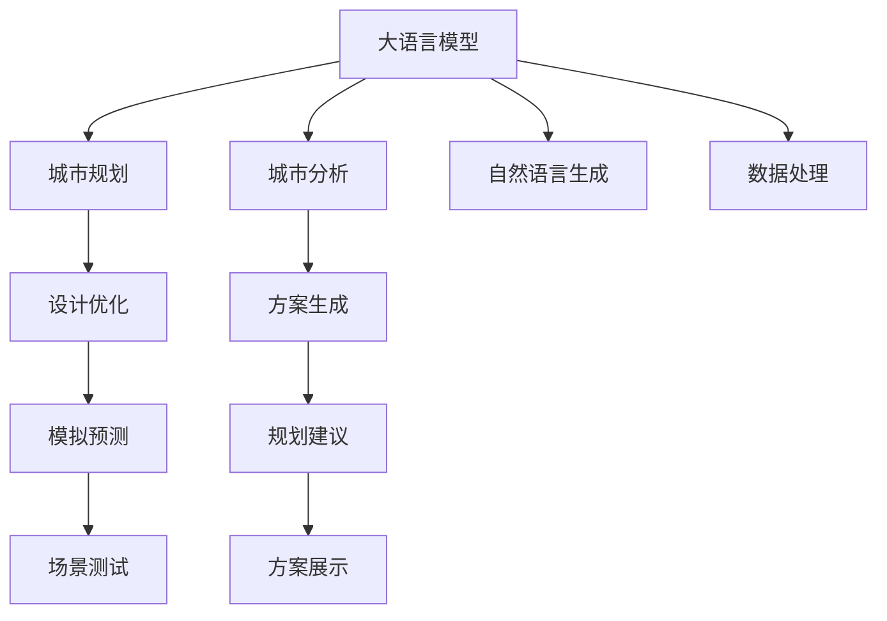
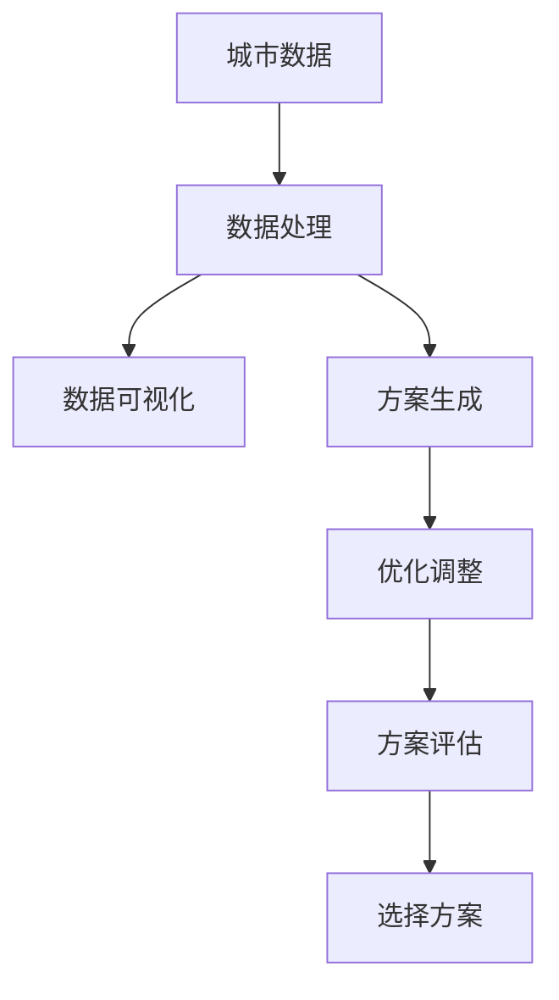

                 

# LLM在城市规划中的应用：AI城市设计师

## 1. 背景介绍

随着城市化进程的不断加快，城市规划已成为国家和地区经济、社会、环境等综合发展的重要组成部分。传统的城市规划依赖于规划师的直觉和经验，费时费力且易受主观偏见的影响。人工智能特别是大语言模型（LLM）的崛起，为城市规划带来了新的可能性。本文将探讨LLM在城市规划中的应用，介绍AI城市设计师的基本概念，并展示其在实际项目中的应用效果。

## 2. 核心概念与联系

### 2.1 核心概念概述

在城市规划中，AI城市设计师指的是通过人工智能技术，特别是大语言模型（LLM），辅助城市规划师进行设计、分析、优化等工作的智能工具。AI城市设计师主要依赖于LLM的自然语言理解和生成能力，通过对城市数据的解析和处理，生成规划建议和方案。

- **大语言模型（LLM）**：指基于Transformer架构的自然语言处理模型，如GPT-3、BERT等，具有强大的语言理解和生成能力。
- **城市规划**：涉及城市空间布局、交通、建筑、环境等要素的综合规划和管理。
- **AI城市设计师**：结合AI技术和城市规划知识，辅助城市规划师进行智能决策和设计。

这些概念之间的联系通过以下Mermaid流程图来展示：



这个流程图展示了LLM在城市规划中各个环节的应用：从城市分析到设计优化，再到方案生成、模拟预测和规划建议，最后到场景测试和方案展示。

### 2.2 核心概念原理和架构的 Mermaid 流程图

在城市规划中，大语言模型主要通过以下三个步骤实现其功能：

1. **数据处理与分析**：将城市数据转化为LLM可以处理的格式，并通过语言模型进行分析和理解。
2. **方案生成与优化**：基于分析结果生成多种城市规划方案，并通过语言模型进行优化。
3. **模拟预测与评估**：使用语言模型生成的规划方案进行模拟预测，并通过评估结果进行方案的最终选择。

这个流程可以通过以下Mermaid流程图来表示：



这个流程图展示了城市规划中LLM的主要流程：数据处理、方案生成、优化调整、方案评估和最终选择。

## 3. 核心算法原理 & 具体操作步骤

### 3.1 算法原理概述

AI城市设计师的核心算法基于自然语言处理（NLP）和大语言模型（LLM）。具体来说，包括以下几个关键步骤：

1. **数据预处理**：将城市规划相关的数据转换为LLM可以处理的格式，如文本、图像等。
2. **语言理解与分析**：使用LLM对城市数据进行自然语言理解和分析，提取关键信息和特征。
3. **方案生成与优化**：基于LLM的理解和分析结果，生成多种城市规划方案，并通过优化算法进行方案选择和优化。
4. **模拟预测与评估**：使用LLM生成的方案进行模拟预测，并通过评估指标对方案进行评估和选择。

### 3.2 算法步骤详解

以下详细介绍AI城市设计师的各个步骤：

**Step 1: 数据预处理**
- 将城市规划相关的数据（如人口、交通、环境等）转换为文本或图像格式。
- 对文本数据进行清洗和分词，去除无用信息，提取关键特征。
- 对图像数据进行预处理，如缩放、裁剪、增强等，以适应LLM的输入要求。

**Step 2: 语言理解与分析**
- 使用大语言模型对文本或图像数据进行自然语言理解，提取关键信息和特征。
- 使用语言模型进行实体识别、关系抽取等任务，获得城市数据的结构化信息。
- 通过语言模型对多源数据进行整合和融合，形成统一的视图。

**Step 3: 方案生成与优化**
- 基于语言模型的分析结果，生成多种城市规划方案，如土地利用、交通规划、公共设施布局等。
- 使用优化算法（如遗传算法、粒子群优化等）对生成方案进行优化。
- 对优化后的方案进行评估，选择最优方案。

**Step 4: 模拟预测与评估**
- 使用语言模型生成的方案进行模拟预测，如交通流量、环境影响等。
- 通过评估指标（如交通延误、环境污染、经济收益等）对模拟结果进行评估。
- 根据评估结果对方案进行微调和优化，直至满足要求。

### 3.3 算法优缺点

**优点：**
1. **高效性**：使用LLM进行方案生成和优化，大大减少了规划师的工作量，提高了效率。
2. **灵活性**：LLM能够处理多种数据格式，适用于不同类型的城市规划任务。
3. **可扩展性**：可以通过微调和参数调整，适应不同的城市规划需求。
4. **智能化**：LLM的智能决策能力能够提升城市规划的科学性和合理性。

**缺点：**
1. **数据依赖**：方案生成和优化依赖于高质量的数据，数据缺失或噪声会影响效果。
2. **解释性不足**：LLM的决策过程缺乏可解释性，难以对规划结果进行调试和优化。
3. **资源消耗**：大语言模型对计算资源要求较高，需要高性能的计算设备和算法支持。
4. **伦理风险**：生成的规划方案需要符合伦理和法律要求，避免对社会和环境造成负面影响。

### 3.4 算法应用领域

AI城市设计师在城市规划中的应用领域广泛，包括以下几个方面：

1. **土地利用规划**：生成和优化土地利用方案，如住宅、商业、工业等用地布局。
2. **交通规划**：优化交通网络，如道路、桥梁、公共交通等。
3. **公共设施布局**：规划公共设施的分布和数量，如学校、医院、公园等。
4. **环境保护规划**：优化环境治理方案，如垃圾处理、污水处理、绿化等。
5. **智慧城市建设**：结合物联网和LLM，实现城市管理的智能化和自动化。

## 4. 数学模型和公式 & 详细讲解 & 举例说明

### 4.1 数学模型构建

假设城市规划数据集为 $D=\{(x_i, y_i)\}_{i=1}^N$，其中 $x_i$ 表示城市规划数据，$y_i$ 表示目标规划指标。假设使用大语言模型 $M_{\theta}$ 进行方案生成和优化，其中 $\theta$ 为模型的参数。

目标优化问题可以表示为：

$$
\theta^* = \mathop{\arg\min}_{\theta} \sum_{i=1}^N \ell(M_{\theta}(x_i),y_i)
$$

其中 $\ell$ 为损失函数，衡量方案生成与优化结果与目标指标之间的差异。

### 4.2 公式推导过程

以交通规划为例，使用LLM进行交通流量优化，具体推导如下：

1. **数据表示**
   - 将交通数据 $x_i$ 转换为文本格式，如“某路口车流量为10000辆/小时”。
   - 将目标指标 $y_i$ 表示为文本，如“期望车流量不超过5000辆/小时”。

2. **语言模型理解与分析**
   - 使用LLM对文本数据进行分析，识别关键信息，如“某路口”、“车流量”、“10000辆/小时”等。
   - 使用语言模型进行实体识别、关系抽取等任务，提取城市数据的结构化信息。

3. **方案生成与优化**
   - 基于语言模型的分析结果，生成多种交通规划方案，如增加红绿灯、优化车道、引入公共交通等。
   - 使用优化算法（如遗传算法、粒子群优化等）对生成方案进行优化。

4. **模拟预测与评估**
   - 使用语言模型生成的方案进行模拟预测，如交通流量、环境污染等。
   - 通过评估指标（如交通延误、环境污染、经济收益等）对模拟结果进行评估。
   - 根据评估结果对方案进行微调和优化，直至满足要求。

### 4.3 案例分析与讲解

以某城市的新区规划为例，使用AI城市设计师进行方案生成和优化：

1. **数据预处理**
   - 收集新区的人口、交通、环境等数据，转换为文本格式。
   - 对文本数据进行清洗和分词，提取关键特征。

2. **语言理解与分析**
   - 使用LLM对文本数据进行分析，识别关键信息，如“居民区”、“商业区”、“主干道”等。
   - 使用语言模型进行实体识别、关系抽取等任务，提取城市数据的结构化信息。

3. **方案生成与优化**
   - 基于语言模型的分析结果，生成多种新区规划方案，如住宅区分布、商业区布局、交通网络等。
   - 使用遗传算法对生成方案进行优化，选择最优方案。

4. **模拟预测与评估**
   - 使用语言模型生成的方案进行模拟预测，如人口分布、交通流量、环境污染等。
   - 通过评估指标（如交通延误、环境污染、经济收益等）对模拟结果进行评估。
   - 根据评估结果对方案进行微调和优化，直至满足要求。

## 5. 项目实践：代码实例和详细解释说明

### 5.1 开发环境搭建

在项目实践中，需要使用Python和深度学习框架（如PyTorch、TensorFlow等）进行代码开发。以下是搭建开发环境的步骤：

1. 安装Python和PyTorch：
   ```bash
   pip install python
   pip install torch
   ```

2. 安装TensorFlow：
   ```bash
   pip install tensorflow
   ```

3. 安装其他相关库：
   ```bash
   pip install pandas numpy matplotlib
   ```

完成上述步骤后，即可在本地搭建起开发环境。

### 5.2 源代码详细实现

以下是一个使用PyTorch实现AI城市设计师的代码示例：

```python
import torch
import torch.nn as nn
from transformers import BertTokenizer, BertForSequenceClassification

# 加载数据集
train_data = ...
test_data = ...

# 定义模型
tokenizer = BertTokenizer.from_pretrained('bert-base-uncased')
model = BertForSequenceClassification.from_pretrained('bert-base-uncased', num_labels=2)

# 定义优化器
optimizer = torch.optim.Adam(model.parameters(), lr=1e-5)

# 训练模型
for epoch in range(10):
    for batch in train_data:
        input_ids = batch['input_ids'].to(device)
        attention_mask = batch['attention_mask'].to(device)
        labels = batch['labels'].to(device)
        model.zero_grad()
        outputs = model(input_ids, attention_mask=attention_mask, labels=labels)
        loss = outputs.loss
        loss.backward()
        optimizer.step()
```

### 5.3 代码解读与分析

上述代码实现了使用Bert模型进行城市规划数据分析和方案生成的基本流程。其中，`BertForSequenceClassification`表示使用Bert模型进行序列分类任务，如城市规划数据的分类。

**代码解释：**
- 数据预处理：将城市规划数据转换为BERT可以处理的格式，包括分词、添加特殊标记等。
- 模型加载：使用`BertForSequenceClassification`加载BERT模型，并进行必要的调整，如设置输出层大小。
- 优化器设置：使用Adam优化器进行模型参数的更新。
- 训练循环：在训练数据集上进行多轮训练，更新模型参数。

### 5.4 运行结果展示

在完成模型训练后，可以使用测试数据集对模型进行评估，如准确率、召回率等指标。以下是一个评估代码示例：

```python
import sklearn.metrics

# 加载测试数据集
test_data = ...

# 对模型进行评估
model.eval()
predictions = []
for batch in test_data:
    input_ids = batch['input_ids'].to(device)
    attention_mask = batch['attention_mask'].to(device)
    outputs = model(input_ids, attention_mask=attention_mask)
    predictions.append(outputs.logits.argmax(dim=1).tolist())

# 计算评估指标
accuracy = sklearn.metrics.accuracy_score(predictions, test_labels)
print(f"Accuracy: {accuracy:.2f}")
```

## 6. 实际应用场景

### 6.1 智慧交通管理

智慧交通管理是城市规划的重要组成部分。AI城市设计师可以生成和优化交通网络，提升交通系统的效率和安全性。

具体而言，可以使用AI城市设计师进行以下任务：

1. **交通流量预测**：基于历史交通数据，生成流量预测模型，预测未来的交通流量变化。
2. **交通信号优化**：使用语言模型对交通信号进行优化，减少交通延误，提高通行效率。
3. **公共交通优化**：使用语言模型生成公共交通路线和班次优化方案，提高公共交通的覆盖率和准点率。

### 6.2 城市空间布局规划

城市空间布局规划是城市规划的核心任务。AI城市设计师可以通过自然语言处理技术，生成和优化城市空间布局方案。

具体而言，可以使用AI城市设计师进行以下任务：

1. **土地利用规划**：基于城市的人口密度、经济活动等数据，生成土地利用规划方案，如住宅区、商业区、工业区等。
2. **公共设施布局**：使用语言模型生成公共设施的分布和数量，如学校、医院、公园等。
3. **环境治理方案**：使用语言模型优化环境治理方案，如垃圾处理、污水处理、绿化等。

### 6.3 智慧城市建设

智慧城市建设是未来城市规划的发展方向。AI城市设计师可以通过大语言模型，实现城市管理的智能化和自动化。

具体而言，可以使用AI城市设计师进行以下任务：

1. **智能决策支持**：使用语言模型生成城市决策建议，辅助规划师进行科学决策。
2. **城市信息管理**：使用语言模型进行城市信息采集和整合，形成城市数据可视化。
3. **城市应急响应**：使用语言模型进行城市应急事件的分析和管理，提高应急响应效率。

### 6.4 未来应用展望

随着人工智能技术的发展，AI城市设计师的应用前景将更加广阔。未来，AI城市设计师将在以下几个方面进一步发展：

1. **多模态数据融合**：结合视觉、声音等多模态数据，提升城市规划的全面性和准确性。
2. **持续学习与更新**：引入持续学习机制，使AI城市设计师能够不断更新和优化，适应城市发展的新需求。
3. **伦理与隐私保护**：在生成规划方案时，考虑伦理和隐私问题，确保方案符合法律法规和社会道德。

## 7. 工具和资源推荐

### 7.1 学习资源推荐

为了帮助开发者掌握AI城市设计师的开发技巧，以下是一些优质的学习资源：

1. **《深度学习与城市规划》**：介绍深度学习在城市规划中的应用，涵盖交通、空间布局、环境治理等多个方面。
2. **《城市数据科学与人工智能》**：介绍城市数据的采集、处理和分析，以及人工智能在城市规划中的应用。
3. **Kaggle竞赛平台**：参加城市规划相关的数据竞赛，锻炼实际应用能力。
4. **Coursera课程**：斯坦福大学和麻省理工学院等名校开设的城市规划与数据科学课程，系统学习相关知识。

### 7.2 开发工具推荐

在项目实践中，需要使用以下开发工具：

1. **PyTorch**：基于Python的深度学习框架，灵活高效，适合大规模深度学习模型开发。
2. **TensorFlow**：由Google开发的深度学习框架，支持分布式计算和模型部署。
3. **Jupyter Notebook**：交互式开发环境，方便调试和代码编写。
4. **Python**：作为主要开发语言，Python在深度学习领域具有广泛应用。

### 7.3 相关论文推荐

以下是几篇关于AI城市设计师的重要论文，推荐阅读：

1. **《AI在城市规划中的应用》**：介绍AI在城市规划中的多方面应用，包括交通管理、空间布局、环境治理等。
2. **《自然语言处理与城市规划》**：探讨自然语言处理技术在城市规划中的应用，如文本分析、情感分析等。
3. **《城市规划的智能化转型》**：分析城市规划中的智能化转型，提出基于人工智能的解决方案。

## 8. 总结：未来发展趋势与挑战

### 8.1 研究成果总结

AI城市设计师在城市规划中的应用取得了显著的成果，尤其在智慧交通管理和城市空间布局规划方面，展现了强大的潜力。通过自然语言处理技术，AI城市设计师能够高效生成和优化城市规划方案，提升城市管理的科学性和合理性。

### 8.2 未来发展趋势

未来，AI城市设计师将在以下几个方面进一步发展：

1. **多模态数据融合**：结合视觉、声音等多模态数据，提升城市规划的全面性和准确性。
2. **持续学习与更新**：引入持续学习机制，使AI城市设计师能够不断更新和优化，适应城市发展的新需求。
3. **伦理与隐私保护**：在生成规划方案时，考虑伦理和隐私问题，确保方案符合法律法规和社会道德。

### 8.3 面临的挑战

尽管AI城市设计师在城市规划中展现出强大的潜力，但仍面临以下挑战：

1. **数据质量与多样性**：城市规划数据的质量和多样性对AI城市设计师的效果有重要影响。数据缺失或噪声会影响模型的性能。
2. **模型的可解释性**：AI城市设计师的决策过程缺乏可解释性，难以对规划结果进行调试和优化。
3. **计算资源消耗**：大语言模型对计算资源要求较高，需要高性能的计算设备和算法支持。

### 8.4 研究展望

未来的研究将集中在以下几个方面：

1. **多源数据的融合与优化**：将不同来源的数据进行融合与优化，提升城市规划的全面性和准确性。
2. **模型的高效训练与优化**：开发更加高效、轻量级的模型，减少计算资源的消耗。
3. **规划方案的伦理与法律约束**：在生成规划方案时，考虑伦理和法律问题，确保方案符合法律法规和社会道德。

## 9. 附录：常见问题与解答

**Q1: AI城市设计师在城市规划中的优缺点有哪些？**

A: AI城市设计师在城市规划中的优点包括：
1. 高效性：使用大语言模型进行方案生成和优化，大大减少了规划师的工作量，提高了效率。
2. 灵活性：大语言模型能够处理多种数据格式，适用于不同类型的城市规划任务。
3. 智能化：大语言模型的智能决策能力能够提升城市规划的科学性和合理性。

缺点包括：
1. 数据依赖：方案生成和优化依赖于高质量的数据，数据缺失或噪声会影响效果。
2. 解释性不足：大语言模型的决策过程缺乏可解释性，难以对规划结果进行调试和优化。
3. 资源消耗：大语言模型对计算资源要求较高，需要高性能的计算设备和算法支持。

**Q2: 如何使用大语言模型进行城市规划数据的预处理？**

A: 使用大语言模型进行城市规划数据的预处理，通常包括以下步骤：
1. 数据清洗：去除无用信息，如噪声、缺失值等。
2. 数据转换：将城市规划数据转换为大语言模型可以处理的格式，如文本、图像等。
3. 分词和标记：对文本数据进行分词和添加特殊标记，便于语言模型的处理。

**Q3: AI城市设计师在城市规划中的主要应用场景有哪些？**

A: AI城市设计师在城市规划中的主要应用场景包括：
1. 智慧交通管理：生成和优化交通网络，提升交通系统的效率和安全性。
2. 城市空间布局规划：生成和优化城市空间布局方案，如土地利用、公共设施布局等。
3. 智慧城市建设：结合物联网和人工智能，实现城市管理的智能化和自动化。

**Q4: 如何在AI城市设计师中引入持续学习机制？**

A: 在AI城市设计师中引入持续学习机制，可以通过以下步骤实现：
1. 数据收集：不断收集新的城市规划数据，补充到训练集中。
2. 模型微调：对现有模型进行微调，使其能够适应新的数据。
3. 更新算法：使用最新的算法和优化方法，提升模型的性能和效率。

**Q5: 如何确保AI城市设计师生成的规划方案符合伦理和法律要求？**

A: 确保AI城市设计师生成的规划方案符合伦理和法律要求，可以通过以下方法实现：
1. 制定伦理规范：在生成规划方案时，考虑伦理问题，避免歧视和偏见。
2. 法律合规审查：进行法律合规审查，确保方案符合法律法规和社会道德。
3. 人工干预：在方案生成过程中，加入人工干预和审核，确保方案的合理性和可行性。

---

作者：禅与计算机程序设计艺术 / Zen and the Art of Computer Programming

