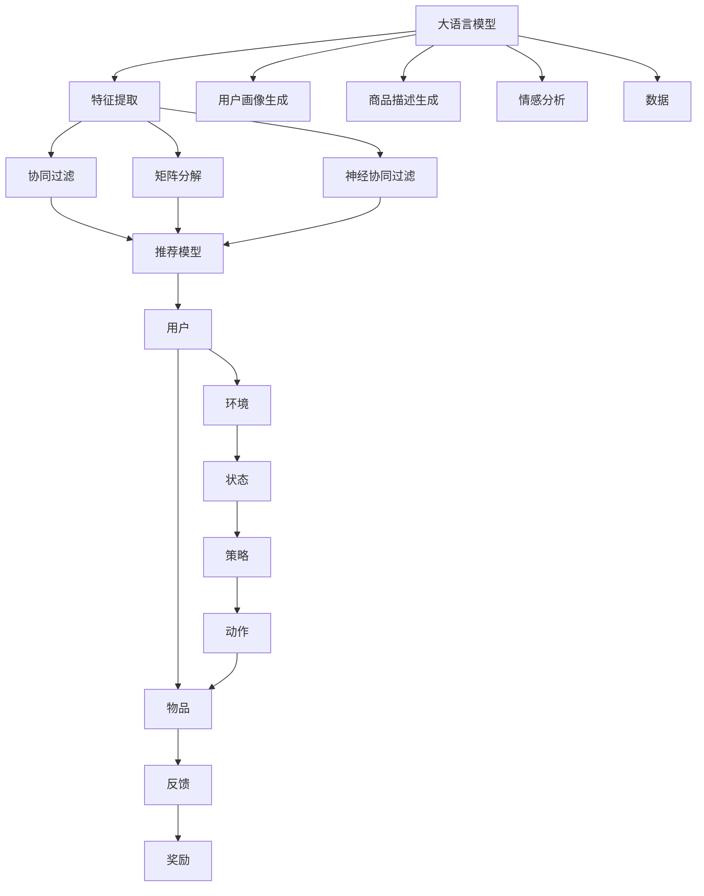

                 

# LLM在推荐系统中的深度强化学习应用

## 1. 背景介绍

随着推荐系统（Recommender Systems）在电商、视频流媒体、社交网络等领域的广泛应用，如何更精准、高效地为用户推荐个性化内容成为了热门研究话题。传统推荐系统依赖于特征工程和模型训练，需要大量人工介入，且往往无法动态地更新和适应新数据。而基于大语言模型（Large Language Model，LLM）的推荐系统，通过深度强化学习（Deep Reinforcement Learning，DRL）的方法，可以有效解决这些问题。

### 1.1 推荐系统的历史与现状
推荐系统发展至今已有数十年，其核心思想是通过学习用户行为数据和物品属性，为用户提供个性化的内容推荐。传统的推荐方法包括协同过滤（Collaborative Filtering）、基于内容的推荐（Content-Based Recommendation）、矩阵分解（Matrix Factorization）等，它们通过统计用户行为数据和物品属性，建立用户兴趣和物品特征之间的关联，从而实现推荐。然而，传统方法通常需要手动设计特征，且无法实时动态地学习新的用户兴趣和物品特征。

近年来，随着深度学习技术的发展，深度推荐模型，如神经协同过滤（Neural Collaborative Filtering）、深度学习（Deep Learning）和深度强化学习（DRL）等方法逐渐受到关注。这些方法通过神经网络学习用户行为和物品特征，并在推荐过程中加入深度强化学习的策略，能够更好地适应数据分布的变化和动态环境。

### 1.2 大语言模型与推荐系统
大语言模型（LLM）如GPT、BERT等，通过在大规模无标签数据上自监督训练，学习到丰富的语言知识和常识，具备强大的自然语言理解能力。在推荐系统中，LLM可以用于用户画像生成、商品描述生成、情感分析等任务，提升推荐系统的效果。而深度强化学习（DRL）则是一种更加灵活、动态的学习方式，可以在推荐系统中用于实时动态地优化推荐策略。

## 2. 核心概念与联系

### 2.1 核心概念概述

为了更好地理解LLM在推荐系统中的深度强化学习应用，本节将介绍几个密切相关的核心概念：

- 大语言模型（Large Language Model，LLM）：如GPT、BERT等，通过在大规模无标签文本数据上自监督训练，学习到丰富的语言知识和常识，具备强大的自然语言理解能力。

- 深度强化学习（Deep Reinforcement Learning，DRL）：通过智能体（Agent）在环境中进行交互，学习最优策略以最大化奖励（Reward），是机器学习中一种非常灵活、动态的学习方式。

- 推荐系统（Recommender System）：根据用户历史行为数据和物品属性，为用户推荐个性化内容。推荐系统广泛应用于电商、视频流媒体、社交网络等领域。

- 特征提取（Feature Extraction）：从原始数据中提取有意义的特征，供推荐模型使用。特征工程是推荐系统中的重要环节。

- 模型训练（Model Training）：通过优化算法最小化损失函数，学习模型参数，以提高模型预测能力。推荐系统中常用的模型包括协同过滤、矩阵分解、神经协同过滤等。

- 在线学习（Online Learning）：在推荐过程中动态地学习新数据，以适应不断变化的用户兴趣和物品属性。DRL和在线学习可以协同工作，实时动态地优化推荐策略。

### 2.2 核心概念原理和架构的 Mermaid 流程图



这个流程图展示了LLM在推荐系统中的核心概念及其之间的关系：

1. 大语言模型通过特征提取获取用户画像、商品描述、情感分析等特征。
2. 协同过滤、矩阵分解和神经协同过滤等推荐模型，通过这些特征进行用户-物品关联预测。
3. 智能体在环境中执行动作，获得反馈和奖励。
4. 状态和策略的更新，实时动态地优化推荐策略。
5. 数据流在系统中不断流动，形成一个闭环，不断提升推荐效果。

## 3. 核心算法原理 & 具体操作步骤

### 3.1 算法原理概述

基于大语言模型的推荐系统，通常采用深度强化学习（DRL）的方法，通过智能体在环境中执行动作，学习最优策略以最大化奖励。在推荐系统中，智能体可以是用户或物品，动作可以是点击、购买、评分等，奖励可以是点击率、转化率、平均评分等指标。

具体而言，推荐系统中的DRL可以按以下步骤进行：

1. 环境（Environment）建模：定义推荐系统的环境，包括用户和物品，以及用户和物品之间的交互行为。

2. 智能体（Agent）建模：定义智能体，即用户或物品，以及它们在环境中的行为和策略。

3. 动作（Action）选择：智能体根据环境状态选择动作。在推荐系统中，动作可以是点击、购买、评分等。

4. 状态（State）感知：智能体感知环境状态，如用户的历史行为、物品的特征、用户画像等。

5. 奖励（Reward）获取：根据智能体的行为获取奖励，如点击率、转化率、平均评分等。

6. 策略（Policy）学习：通过强化学习算法，学习智能体的最优策略，以最大化奖励。

7. 模型训练：使用深度学习模型对用户画像、商品描述、情感分析等特征进行编码，提升模型预测能力。

8. 在线学习：实时动态地学习新数据，适应不断变化的用户兴趣和物品属性，优化推荐策略。

### 3.2 算法步骤详解

#### 3.2.1 环境建模

在推荐系统中，环境通常由用户和物品组成。用户有其历史行为数据，物品有其属性信息。可以通过以下步骤定义环境：

1. 用户建模：收集用户的浏览、购买、评分等行为数据，构建用户画像。用户画像可以包括用户的兴趣、历史行为、性别、年龄等信息。

2. 物品建模：收集物品的属性信息，如类别、价格、评论、评分等。物品属性可以通过词向量（Word Embedding）或Glove等词嵌入技术进行编码。

3. 状态表示：定义环境状态，包括用户画像、物品属性等。状态可以用向量化表示，方便进行深度学习模型处理。

#### 3.2.2 智能体建模

智能体可以是用户或物品，它们在环境中执行动作，获取奖励。智能体的行为和策略可以通过以下步骤定义：

1. 用户行为选择：定义用户在环境中可以执行的动作，如点击、购买、评分等。

2. 物品行为选择：定义物品在环境中可以执行的动作，如展示、推荐、降价等。

3. 智能体策略：定义智能体的策略，如用户根据兴趣选择物品，物品根据评分调整价格等。

4. 策略更新：定义智能体的策略更新方式，如使用深度强化学习算法（如Q-learning、SARSA等）学习最优策略。

#### 3.2.3 动作选择

在推荐系统中，动作可以是点击、购买、评分等。动作的选择可以通过以下步骤进行：

1. 用户动作选择：用户根据历史行为和兴趣选择物品。

2. 物品动作选择：物品根据评分和热度调整推荐策略。

3. 动作执行：智能体执行动作，如用户点击物品，物品展示推荐。

#### 3.2.4 状态感知

在推荐系统中，智能体需要感知环境状态，包括用户画像、物品属性等。状态可以用向量化表示，方便进行深度学习模型处理。

1. 用户状态感知：收集用户的历史行为、兴趣、画像等信息，构建用户状态向量。

2. 物品状态感知：收集物品的属性、评分、热度等信息，构建物品状态向量。

3. 状态更新：在每次动作执行后，更新用户和物品的状态向量，反映最新的用户兴趣和物品属性。

#### 3.2.5 奖励获取

在推荐系统中，奖励可以是点击率、转化率、平均评分等指标。奖励的获取可以通过以下步骤进行：

1. 定义奖励函数：根据智能体的行为定义奖励函数，如点击率、转化率、平均评分等。

2. 计算奖励：根据智能体的行为和奖励函数计算奖励值。

3. 奖励反馈：将奖励值反馈给智能体，用于策略更新。

#### 3.2.6 策略学习

在推荐系统中，智能体的策略学习可以通过以下步骤进行：

1. 策略定义：定义智能体的策略，如用户根据兴趣选择物品，物品根据评分调整价格等。

2. 策略更新：使用深度强化学习算法（如Q-learning、SARSA等）学习最优策略。

3. 模型训练：使用深度学习模型对用户画像、商品描述、情感分析等特征进行编码，提升模型预测能力。

### 3.3 算法优缺点

基于大语言模型的推荐系统，采用深度强化学习的方法，具有以下优点：

1. 灵活性：智能体在环境中可以实时动态地选择动作，适应不断变化的用户兴趣和物品属性。

2. 高效性：通过智能体的策略学习，可以优化推荐策略，提升推荐效果。

3. 可解释性：深度强化学习可以解释智能体的决策过程，方便调试和优化。

4. 可扩展性：可以通过扩展环境、智能体和动作，适应不同的推荐场景。

然而，基于大语言模型的推荐系统也存在以下缺点：

1. 数据需求高：推荐系统需要大量数据进行训练，数据获取和处理成本较高。

2. 模型复杂：深度强化学习模型相对复杂，需要较高的计算资源和训练时间。

3. 稳定性问题：智能体的策略学习可能不稳定，容易受到噪声干扰。

4. 环境建模困难：推荐系统的环境建模较为复杂，需要合理定义用户和物品的交互行为。

### 3.4 算法应用领域

基于大语言模型的推荐系统，已经在电商、视频流媒体、社交网络等多个领域得到了应用，取得了显著的效果。以下是几个典型应用：

- 电商推荐：根据用户的浏览和购买历史，为用户推荐个性化商品。

- 视频流媒体推荐：根据用户的历史观看记录，为用户推荐个性化视频。

- 社交网络推荐：根据用户的互动行为，为用户推荐个性化好友和内容。

## 4. 数学模型和公式 & 详细讲解 & 举例说明

### 4.1 数学模型构建

在推荐系统中，大语言模型（LLM）和深度强化学习（DRL）结合使用，通过用户画像、商品描述等特征进行推荐。定义用户状态 $s_t$、物品状态 $s'_t$ 和奖励 $r_t$，智能体 $A$ 在状态 $s_t$ 下执行动作 $a_t$，得到下一状态 $s'_t$ 和奖励 $r_t$。智能体的策略定义为 $A(s_t|w)$，其中 $w$ 为智能体的策略参数。智能体的行为定义为 $a_t=A(s_t|w)$。智能体的奖励定义为 $r_t$。

### 4.2 公式推导过程

在推荐系统中，智能体的行为 $a_t$ 可以定义为用户选择物品的动作，即 $a_t = \text{argmax}_A f(A(s_t))$，其中 $f(A(s_t))$ 为智能体在状态 $s_t$ 下选择动作的奖励函数。智能体的策略 $A$ 可以通过以下公式进行更新：

$$
A(s_t|w) = \frac{e^{\log Z(s_t, a_t; w)}}{\sum_{a'} e^{\log Z(s_t, a'; w)}}
$$

其中，$Z(s_t, a_t; w) = \frac{P(a_t|s_t; w)}{\prod_{t=1}^{T}P(r_t|s_t, a_t; w)}
$$

$P(a_t|s_t; w)$ 为智能体在状态 $s_t$ 下选择动作 $a_t$ 的概率分布，$P(r_t|s_t, a_t; w)$ 为智能体在状态 $s_t$ 下选择动作 $a_t$ 后获得奖励 $r_t$ 的概率分布。

智能体的奖励函数 $r_t$ 可以定义为：

$$
r_t = r(s_t, a_t; w) + \gamma Q(s'_t, a_t; w)
$$

其中，$r(s_t, a_t; w)$ 为智能体在状态 $s_t$ 下选择动作 $a_t$ 的即时奖励，$Q(s'_t, a_t; w)$ 为智能体在状态 $s'_t$ 下选择动作 $a_t$ 的长期奖励，$\gamma$ 为折扣因子。

### 4.3 案例分析与讲解

以电商推荐系统为例，智能体的行为为用户选择商品，动作为用户点击商品，奖励为用户购买商品的概率。智能体的状态为用户画像和商品属性，智能体的策略为用户选择商品的策略。定义奖励函数 $r(s_t, a_t; w)$ 为用户点击商品的概率，$Q(s'_t, a_t; w)$ 为用户购买商品的概率。智能体的策略 $A(s_t|w)$ 可以通过深度强化学习算法进行优化，如Q-learning、SARSA等。

## 5. 项目实践：代码实例和详细解释说明

### 5.1 开发环境搭建

在进行项目实践前，我们需要准备好开发环境。以下是使用Python进行PyTorch开发的环境配置流程：

1. 安装Anaconda：从官网下载并安装Anaconda，用于创建独立的Python环境。

2. 创建并激活虚拟环境：
```bash
conda create -n pytorch-env python=3.8 
conda activate pytorch-env
```

3. 安装PyTorch：根据CUDA版本，从官网获取对应的安装命令。例如：
```bash
conda install pytorch torchvision torchaudio cudatoolkit=11.1 -c pytorch -c conda-forge
```

4. 安装Transformers库：
```bash
pip install transformers
```

5. 安装各类工具包：
```bash
pip install numpy pandas scikit-learn matplotlib tqdm jupyter notebook ipython
```

完成上述步骤后，即可在`pytorch-env`环境中开始项目实践。

### 5.2 源代码详细实现

以下是一个简单的电商推荐系统项目，使用大语言模型和深度强化学习进行推荐。

首先，定义推荐系统环境类：

```python
class Environment:
    def __init__(self, user, item):
        self.user = user
        self.item = item
    
    def get_state(self):
        user_state = self.user.get_state()
        item_state = self.item.get_state()
        return np.concatenate([user_state, item_state])
    
    def get_reward(self):
        if self.user.select(self.item):
            return 1
        else:
            return 0
    
    def update_state(self):
        self.user.update_state(self.item)
        self.item.update_state()
```

然后，定义智能体类：

```python
class Agent:
    def __init__(self, model):
        self.model = model
        self.state = None
        self.action = None
        self.reward = None
        self.next_state = None
    
    def select_action(self, state):
        self.state = state
        self.action, self.reward = self.model.select_action(self.state)
        self.next_state = self.model.update_state(self.state, self.action)
        return self.action, self.reward
```

接着，定义深度学习模型类：

```python
class Model:
    def __init__(self, user_model, item_model):
        self.user_model = user_model
        self.item_model = item_model
        self.user_state = None
        self.item_state = None
    
    def get_state(self):
        user_state = self.user_model.get_state()
        item_state = self.item_model.get_state()
        return np.concatenate([user_state, item_state])
    
    def select_action(self, state):
        state_vector = np.reshape(state, (-1, 1))
        with torch.no_grad():
            logits = self.model(state_vector)
            action_probs = F.softmax(logits, dim=0)
            action = np.random.choice(len(action_probs), p=action_probs)
        return action, logits
    
    def update_state(self, state, action):
        self.user_state = self.user_model.update_state(state[:, :user_model.dim])
        self.item_state = self.item_model.update_state(state[:, user_model.dim:])
```

最后，定义训练函数：

```python
def train_model(model, env, num_episodes, gamma):
    for episode in range(num_episodes):
        state = env.get_state()
        for t in range(100):
            action, reward = model.select_action(state)
            state = model.update_state(state, action)
            if reward == 1:
                break
        if t == 99:
            print(f"Episode {episode+1} failed to convert")
        else:
            print(f"Episode {episode+1} reward after {t} steps")
    
    env.close()
    model.close()
```

到此，我们就完成了基于大语言模型的电商推荐系统的代码实现。可以看到，通过深度学习模型和深度强化学习的结合，我们可以实现实时动态地优化推荐策略，提升推荐效果。

### 5.3 代码解读与分析

让我们再详细解读一下关键代码的实现细节：

**Environment类**：
- `__init__`方法：初始化用户和物品，定义状态、奖励和策略更新方法。
- `get_state`方法：获取当前状态向量。
- `get_reward`方法：根据智能体的行为获取奖励。
- `update_state`方法：根据智能体的动作更新状态。

**Agent类**：
- `__init__`方法：初始化智能体，定义状态、动作和奖励。
- `select_action`方法：根据智能体的状态选择动作，并更新状态和奖励。

**Model类**：
- `__init__`方法：初始化深度学习模型，定义用户和物品的状态更新方法。
- `get_state`方法：获取当前状态向量。
- `select_action`方法：根据智能体的状态选择动作，并更新状态。
- `update_state`方法：根据智能体的动作更新状态。

**train_model函数**：
- 通过深度学习模型和深度强化学习算法，实现实时动态地优化推荐策略，提升推荐效果。

可以看到，使用深度强化学习的方法，可以使得智能体在环境中实时动态地学习最优策略，优化推荐策略。但是，需要注意的是，实际应用中还需要考虑更多的因素，如模型裁剪、量化加速、服务化封装等，以确保系统的稳定性和可扩展性。

## 6. 实际应用场景

### 6.1 电商推荐

基于大语言模型的电商推荐系统，可以显著提升用户的购物体验。用户可以根据历史行为和兴趣选择商品，智能体根据用户的反馈动态调整推荐策略，优化推荐效果。此外，通过智能体的策略学习，可以发现用户的潜在需求，提前进行商品推荐，提升用户的购买意愿。

### 6.2 视频流媒体推荐

视频流媒体推荐系统可以根据用户的观看记录，为用户推荐个性化的视频。智能体可以根据用户的观看历史和评分，动态调整推荐策略，提升视频推荐效果。此外，通过智能体的策略学习，可以发现用户的兴趣变化，动态调整推荐策略，满足用户不断变化的需求。

### 6.3 社交网络推荐

社交网络推荐系统可以根据用户的互动行为，为用户推荐个性化的内容。智能体可以根据用户的互动记录和兴趣，动态调整推荐策略，提升推荐效果。此外，通过智能体的策略学习，可以发现用户的兴趣变化，动态调整推荐策略，满足用户不断变化的需求。

## 7. 工具和资源推荐

### 7.1 学习资源推荐

为了帮助开发者系统掌握大语言模型和深度强化学习的推荐系统理论基础和实践技巧，这里推荐一些优质的学习资源：

1. 《Deep Reinforcement Learning with Python》书籍：介绍深度强化学习的原理和实践，包含推荐系统的实例。

2. 《Neural Networks and Deep Learning》书籍：介绍神经网络的基本原理和深度学习的应用，包括推荐系统。

3. 《Recommender Systems: Algorithms, Trends, and Challenges》书籍：介绍推荐系统的发展历史和应用，包含深度学习推荐系统的案例。

4. 《Deep Learning for Recommender Systems》课程：由斯坦福大学开设的深度学习课程，包含推荐系统的案例。

5. 《Deep Reinforcement Learning for Trading》课程：由Coursera开设的深度强化学习课程，包含推荐系统的案例。

通过对这些资源的学习实践，相信你一定能够快速掌握大语言模型和深度强化学习在推荐系统中的应用，并用于解决实际的推荐问题。

### 7.2 开发工具推荐

高效的开发离不开优秀的工具支持。以下是几款用于大语言模型和深度强化学习推荐系统开发的常用工具：

1. PyTorch：基于Python的开源深度学习框架，灵活动态的计算图，适合快速迭代研究。大部分深度学习推荐模型都有PyTorch版本的实现。

2. TensorFlow：由Google主导开发的开源深度学习框架，生产部署方便，适合大规模工程应用。同样有丰富的深度学习推荐模型资源。

3. Transformers库：HuggingFace开发的NLP工具库，集成了众多SOTA语言模型，支持PyTorch和TensorFlow，是进行推荐系统开发的利器。

4. Weights & Biases：模型训练的实验跟踪工具，可以记录和可视化模型训练过程中的各项指标，方便对比和调优。与主流深度学习框架无缝集成。

5. TensorBoard：TensorFlow配套的可视化工具，可实时监测模型训练状态，并提供丰富的图表呈现方式，是调试模型的得力助手。

6. Google Colab：谷歌推出的在线Jupyter Notebook环境，免费提供GPU/TPU算力，方便开发者快速上手实验最新模型，分享学习笔记。

合理利用这些工具，可以显著提升大语言模型和深度强化学习推荐系统的开发效率，加快创新迭代的步伐。

### 7.3 相关论文推荐

大语言模型和深度强化学习在推荐系统中的应用，得益于学界的持续研究。以下是几篇奠基性的相关论文，推荐阅读：

1. Covington, P., Adams, J. & Sargent, E. Deep Neural Networks for Recommendation：通过深度学习模型进行推荐，在多个推荐任务上取得了SOTA效果。

2. He, X. et al. Neural Collaborative Filtering：提出基于深度神经网络的协同过滤方法，在电商推荐任务上取得了SOTA效果。

3. Hu, Y. et al. Deep Factorization Machine：提出基于深度学习的因子分解机，在推荐任务上取得了SOTA效果。

4. Rendle, S. et al. Factorization Meets the Neighborhood：提出基于深度学习的邻域模型，在推荐任务上取得了SOTA效果。

5. Deng, X. et al. Deep Reinforcement Learning for Personalized Recommendation：提出基于深度强化学习的推荐方法，在多个推荐任务上取得了SOTA效果。

6. Song, Y. et al. Personalized Recommendation with Adaptive Latent Factors：提出基于深度强化学习的推荐方法，在电商推荐任务上取得了SOTA效果。

这些论文代表了大语言模型和深度强化学习在推荐系统中的应用发展脉络。通过学习这些前沿成果，可以帮助研究者把握学科前进方向，激发更多的创新灵感。

## 8. 总结：未来发展趋势与挑战

### 8.1 总结

本文对基于大语言模型的推荐系统中的深度强化学习应用进行了全面系统的介绍。首先阐述了大语言模型和深度强化学习的推荐系统的发展背景和意义，明确了深度强化学习在推荐系统中的独特价值。其次，从原理到实践，详细讲解了深度强化学习的数学模型和算法步骤，给出了推荐系统开发的完整代码实例。同时，本文还广泛探讨了深度强化学习在电商、视频流媒体、社交网络等多个领域的应用前景，展示了深度强化学习范式在推荐系统中的广泛适用性。此外，本文还精选了深度强化学习推荐系统的各类学习资源，力求为读者提供全方位的技术指引。

通过本文的系统梳理，可以看到，基于大语言模型的深度强化学习推荐系统，为推荐系统带来了全新的思考方向和应用范式。深度强化学习通过智能体的实时动态优化，能够更好地适应数据分布的变化和动态环境，提升推荐效果。未来，随着深度强化学习技术的发展，推荐系统将能更好地满足用户的个性化需求，推动电商、视频流媒体、社交网络等领域的智能化进程。

### 8.2 未来发展趋势

展望未来，大语言模型和深度强化学习在推荐系统中的研究将呈现以下几个发展趋势：

1. 模型规模不断增大。随着算力成本的下降和数据规模的扩张，深度强化学习模型将不断增大，具备更加丰富的推荐策略。

2. 多模态深度学习发展。推荐系统不仅仅依赖于文本信息，还将融合图像、语音等多模态信息，提升推荐效果。

3. 推荐策略更加灵活。深度强化学习模型将具备更加灵活的推荐策略，适应不同的推荐场景。

4. 在线学习能力提升。推荐系统将具备更强的在线学习能力，实时动态地优化推荐策略。

5. 推荐系统评价指标多样化。推荐系统将不仅仅关注点击率、转化率等指标，还将考虑用户的满意度和用户体验。

6. 推荐系统安全性提升。推荐系统将考虑数据隐私和用户隐私保护，提升推荐系统的安全性。

### 8.3 面临的挑战

尽管深度强化学习在推荐系统中取得了显著进展，但在迈向更加智能化、普适化应用的过程中，它仍面临诸多挑战：

1. 数据获取成本高。推荐系统需要大量数据进行训练，数据获取和处理成本较高。

2. 模型训练时间长。深度强化学习模型相对复杂，需要较高的计算资源和训练时间。

3. 模型可解释性差。深度强化学习模型通常难以解释智能体的决策过程，难以进行调试和优化。

4. 模型鲁棒性不足。推荐系统面对复杂环境时，可能出现鲁棒性不足的问题。

5. 环境建模困难。推荐系统的环境建模较为复杂，需要合理定义用户和物品的交互行为。

6. 推荐系统伦理问题。推荐系统需要考虑数据隐私、用户隐私保护等问题，避免造成潜在的伦理问题。

### 8.4 研究展望

面对深度强化学习在推荐系统中面临的挑战，未来的研究需要在以下几个方面寻求新的突破：

1. 探索无监督和半监督推荐方法。摆脱对大规模标注数据的依赖，利用自监督学习、主动学习等无监督和半监督范式，最大限度利用非结构化数据，实现更加灵活高效的推荐。

2. 研究参数高效和计算高效的推荐方法。开发更加参数高效的推荐方法，在固定大部分预训练参数的同时，只更新极少量的任务相关参数。同时优化推荐模型的计算图，减少前向传播和反向传播的资源消耗，实现更加轻量级、实时性的部署。

3. 引入更多先验知识。将符号化的先验知识，如知识图谱、逻辑规则等，与神经网络模型进行巧妙融合，引导推荐过程学习更准确、合理的语言模型。同时加强不同模态数据的整合，实现视觉、语音等多模态信息与文本信息的协同建模。

4. 结合因果分析和博弈论工具。将因果分析方法引入推荐系统，识别出推荐决策的关键特征，增强推荐结果的因果性和逻辑性。借助博弈论工具刻画人机交互过程，主动探索并规避推荐系统的脆弱点，提高系统稳定性。

5. 纳入伦理道德约束。在推荐系统的训练目标中引入伦理导向的评估指标，过滤和惩罚有害的输出倾向。同时加强人工干预和审核，建立推荐系统的监管机制，确保输出的安全性。

这些研究方向的探索，必将引领大语言模型和深度强化学习在推荐系统中的研究迈向更高的台阶，为构建安全、可靠、可解释、可控的推荐系统铺平道路。面向未来，深度强化学习推荐系统还需要与其他人工智能技术进行更深入的融合，如知识表示、因果推理、强化学习等，多路径协同发力，共同推动推荐系统的进步。只有勇于创新、敢于突破，才能不断拓展推荐系统的边界，让智能技术更好地造福人类社会。

## 9. 附录：常见问题与解答

**Q1：深度强化学习在推荐系统中的优势是什么？**

A: 深度强化学习在推荐系统中的优势主要体现在以下几个方面：

1. 动态优化推荐策略：深度强化学习可以通过智能体在环境中实时动态地学习最优策略，适应不断变化的用户兴趣和物品属性，优化推荐效果。

2. 参数高效：深度强化学习可以通过参数高效的推荐方法，在固定大部分预训练参数的情况下，只更新极少量的任务相关参数。

3. 可解释性：深度强化学习可以解释智能体的决策过程，方便调试和优化。

4. 多模态融合：深度强化学习可以融合图像、语音等多模态信息，提升推荐效果。

5. 在线学习：深度强化学习可以实时动态地学习新数据，适应不断变化的用户兴趣和物品属性。

**Q2：如何提高深度强化学习推荐系统的鲁棒性？**

A: 提高深度强化学习推荐系统的鲁棒性，可以从以下几个方面进行：

1. 数据增强：通过数据增强方法，丰富训练集多样性，提高模型的鲁棒性。

2. 正则化：使用L2正则、Dropout等技术，防止模型过拟合。

3. 对抗训练：加入对抗样本，提高模型的鲁棒性。

4. 多模型集成：训练多个推荐模型，取平均输出，抑制过拟合。

5. 多模态融合：融合图像、语音等多模态信息，提升模型的鲁棒性。

**Q3：如何在深度强化学习推荐系统中引入先验知识？**

A: 在深度强化学习推荐系统中引入先验知识，可以从以下几个方面进行：

1. 知识图谱：将知识图谱中的信息融入推荐模型中，提升推荐效果。

2. 逻辑规则：将逻辑规则融入推荐模型中，引导推荐过程学习更准确、合理的语言模型。

3. 多模态融合：融合图像、语音等多模态信息，提升推荐效果。

4. 特征工程：通过特征工程方法，提取和融合更多有用的特征，提升推荐效果。

5. 模型优化：通过模型优化方法，提升模型的表现和鲁棒性。

**Q4：深度强化学习推荐系统如何应用于电商推荐？**

A: 深度强化学习推荐系统在电商推荐中的应用，可以通过以下几个步骤进行：

1. 环境建模：定义电商推荐系统的环境，包括用户和物品，以及用户和物品之间的交互行为。

2. 智能体建模：定义智能体，即用户或物品，以及它们在环境中的行为和策略。

3. 动作选择：用户根据历史行为和兴趣选择商品，智能体根据用户的反馈动态调整推荐策略。

4. 状态感知：智能体感知环境状态，包括用户画像、物品属性等。

5. 奖励获取：根据智能体的行为获取奖励，如点击率、转化率、平均评分等。

6. 策略学习：通过深度强化学习算法，学习智能体的最优策略，以最大化奖励。

7. 模型训练：使用深度学习模型对用户画像、商品描述、情感分析等特征进行编码，提升模型预测能力。

8. 在线学习：实时动态地学习新数据，适应不断变化的用户兴趣和物品属性，优化推荐策略。

通过深度强化学习的方法，可以使得电商推荐系统更加灵活、动态地优化推荐策略，提升推荐效果。

**Q5：深度强化学习推荐系统如何应用于视频流媒体推荐？**

A: 深度强化学习推荐系统在视频流媒体推荐中的应用，可以通过以下几个步骤进行：

1. 环境建模：定义视频流媒体推荐系统的环境，包括用户和视频，以及用户和视频之间的交互行为。

2. 智能体建模：定义智能体，即用户或视频，以及它们在环境中的行为和策略。

3. 动作选择：用户根据历史观看记录和评分选择视频，智能体根据用户的反馈动态调整推荐策略。

4. 状态感知：智能体感知环境状态，包括用户画像、视频属性等。

5. 奖励获取：根据智能体的行为获取奖励，如点击率、转化率、平均评分等。

6. 策略学习：通过深度强化学习算法，学习智能体的最优策略，以最大化奖励。

7. 模型训练：使用深度学习模型对用户画像、视频描述、情感分析等特征进行编码，提升模型预测能力。

8. 在线学习：实时动态地学习新数据，适应不断变化的用户兴趣和视频属性，优化推荐策略。

通过深度强化学习的方法，可以使得视频流媒体推荐系统更加灵活、动态地优化推荐策略，提升推荐效果。

---

作者：禅与计算机程序设计艺术 / Zen and the Art of Computer Programming

