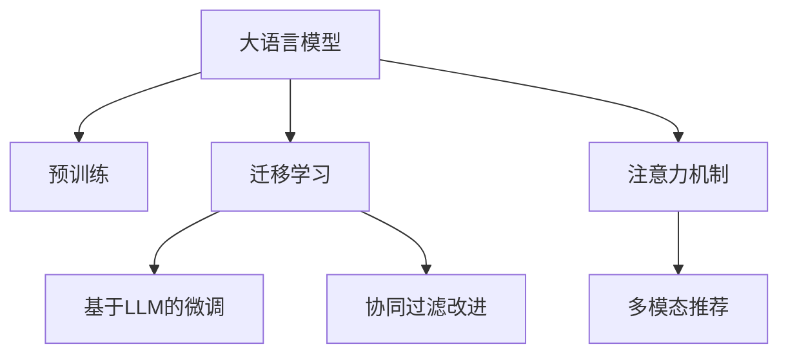

                 

# LLM在推荐系统中的迁移学习应用

> 关键词：大语言模型(LLM),迁移学习,推荐系统,知识图谱,注意力机制,协同过滤,微调

## 1. 背景介绍

### 1.1 问题由来
随着互联网技术的迅猛发展，推荐系统已经成为电商、新闻、视频、音乐等众多领域不可或缺的一部分。传统的基于协同过滤和矩阵分解的推荐系统，虽然在用户兴趣预测和物品推荐上取得了一定效果，但随着用户和物品数量的大幅增长，计算复杂度和数据维度问题日益突出。而大语言模型(Large Language Model, LLM)的兴起，为推荐系统带来了新的可能性。

LLM通过自监督学习在海量数据上进行预训练，获得强大的语言理解和生成能力，能够对复杂的自然语言文本进行语义理解和生成。将LLM与推荐系统相结合，可以显著提升推荐的精准度和个性化程度。特别是在缺少标注数据的情况下，基于LLM的迁移学习范式，能够充分利用其广泛的知识和语言理解能力，解决推荐系统的诸多难题。

### 1.2 问题核心关键点
在大语言模型和推荐系统结合的迁移学习过程中，核心关键点包括：

1. 知识图谱融合：将LLM的语义知识与推荐系统中的用户和物品知识进行融合，提升推荐质量。
2. 注意力机制优化：利用LLM的注意力机制，更好地挖掘用户和物品的语义特征。
3. 协同过滤改进：通过LLM的预训练能力，改进协同过滤算法的性能，处理用户和物品之间的复杂关系。
4. 微调技术应用：基于LLM的微调方法，在少量标注数据上训练推荐模型，提升推荐效果。
5. 多模态推荐：将文本、图像、声音等多模态信息与LLM结合，提升推荐系统的表现力和鲁棒性。

这些关键点共同构成了LLM在推荐系统中的迁移学习应用框架，使得推荐系统能够更好地处理复杂的多模态信息和语义关系。

## 2. 核心概念与联系

### 2.1 核心概念概述

为更好地理解LLM在推荐系统中的应用，本节将介绍几个关键概念：

- 大语言模型(Large Language Model, LLM)：以自回归(如GPT)或自编码(如BERT)模型为代表的大规模预训练语言模型。通过在海量无标签文本数据上进行预训练，学习通用的语言表示，具备强大的语言理解和生成能力。

- 迁移学习(Transfer Learning)：指将一个领域学习到的知识，迁移应用到另一个不同但相关的领域的学习范式。LLM的预训练-微调过程即是一种典型的迁移学习方式。

- 协同过滤(Collaborative Filtering, CF)：推荐系统中的一种常用方法，通过挖掘用户和物品之间的相似性，推荐相似物品或用户，提升推荐效果。

- 注意力机制(Attention Mechanism)：一种自适应信息加权机制，使得模型能够更加关注输入数据中重要部分的信息，提升模型的泛化能力和效果。

- 知识图谱(Knowledge Graph)：一种结构化的语义网络，用于描述实体、关系和属性之间的映射，辅助模型进行语义理解和推理。

这些概念之间的逻辑关系可以通过以下Mermaid流程图来展示：



这个流程图展示了大语言模型的核心概念及其之间的关系：

1. 大语言模型通过预训练获得基础能力。
2. 迁移学习是连接预训练模型与推荐系统的桥梁，可以通过微调或注意力机制改进，实现更好的推荐效果。
3. 协同过滤是推荐系统的重要算法，通过改进协同过滤方法，结合LLM的能力，提升推荐精度。
4. 注意力机制优化推荐算法，使模型能够更好地关注语义关键部分。
5. 多模态推荐融合文本、图像、声音等多模态信息，增强推荐系统的表现力和鲁棒性。

这些概念共同构成了大语言模型在推荐系统中的应用框架，使其能够在推荐领域发挥强大的语言理解和生成能力。通过理解这些核心概念，我们可以更好地把握LLM的工作原理和优化方向。

## 3. 核心算法原理 & 具体操作步骤
### 3.1 算法原理概述

基于LLM的推荐系统迁移学习，本质上是一个有监督的细粒度迁移学习过程。其核心思想是：将预训练的LLM视作一个强大的"特征提取器"，通过在推荐系统中的用户和物品描述文本上进行有监督的微调，使得模型能够更好地理解用户的兴趣和物品的特性，从而获得针对推荐任务优化的模型。

形式化地，假设预训练模型为 $M_{\theta}$，其中 $\theta$ 为预训练得到的模型参数。给定推荐任务 $T$ 的标注数据集 $D=\{(x_i,y_i)\}_{i=1}^N$，其中 $x_i$ 为用户或物品的文本描述，$y_i$ 为推荐结果，即用户是否对物品感兴趣。微调的目标是找到新的模型参数 $\hat{\theta}$，使得：

$$
\hat{\theta}=\mathop{\arg\min}_{\theta} \mathcal{L}(M_{\theta},D)
$$

其中 $\mathcal{L}$ 为针对推荐任务设计的损失函数，用于衡量模型预测结果与真实标签之间的差异。常见的损失函数包括交叉熵损失、均方误差损失等。

通过梯度下降等优化算法，微调过程不断更新模型参数 $\theta$，最小化损失函数 $\mathcal{L}$，使得模型输出逼近真实标签。由于 $\theta$ 已经通过预训练获得了较好的初始化，因此即便在少量标注数据集 $D$ 上进行微调，也能较快收敛到理想的模型参数 $\hat{\theta}$。

### 3.2 算法步骤详解

基于LLM的推荐系统迁移学习一般包括以下几个关键步骤：

**Step 1: 准备预训练模型和数据集**
- 选择合适的预训练语言模型 $M_{\theta}$ 作为初始化参数，如 BERT、GPT 等。
- 准备推荐任务 $T$ 的标注数据集 $D$，划分为训练集、验证集和测试集。一般要求标注数据与预训练数据的分布不要差异过大。

**Step 2: 添加推荐适配层**
- 根据推荐任务类型，在预训练模型顶层设计合适的推荐目标和损失函数。
- 对于推荐任务，通常使用多任务学习目标，将用户兴趣预测和物品推荐结合起来。
- 对于协同过滤，可以使用交叉熵损失函数，衡量模型预测用户是否点击物品。

**Step 3: 设置微调超参数**
- 选择合适的优化算法及其参数，如 AdamW、SGD 等，设置学习率、批大小、迭代轮数等。
- 设置正则化技术及强度，包括权重衰减、Dropout、Early Stopping 等。
- 确定冻结预训练参数的策略，如仅微调顶层，或全部参数都参与微调。

**Step 4: 执行梯度训练**
- 将训练集数据分批次输入模型，前向传播计算损失函数。
- 反向传播计算参数梯度，根据设定的优化算法和学习率更新模型参数。
- 周期性在验证集上评估模型性能，根据性能指标决定是否触发 Early Stopping。
- 重复上述步骤直到满足预设的迭代轮数或 Early Stopping 条件。

**Step 5: 测试和部署**
- 在测试集上评估微调后模型 $M_{\hat{\theta}}$ 的性能，对比微调前后的精度提升。
- 使用微调后的模型对新样本进行推理预测，集成到实际的应用系统中。
- 持续收集新的数据，定期重新微调模型，以适应数据分布的变化。

以上是基于监督学习微调大语言模型的一般流程。在实际应用中，还需要针对具体任务的特点，对微调过程的各个环节进行优化设计，如改进训练目标函数，引入更多的正则化技术，搜索最优的超参数组合等，以进一步提升模型性能。

### 3.3 算法优缺点

基于LLM的推荐系统迁移学习方法具有以下优点：
1. 高效利用语义知识。LLM通过预训练获得了广泛的语义知识，能够在推荐任务中有效利用这些知识，提升推荐效果。
2. 迁移学习能力。通过微调，可以在少量标注数据上快速适应特定任务，提升模型的泛化能力。
3. 可解释性强。LLM的预训练过程赋予了模型较强的语义理解能力，使得推荐过程具有一定的可解释性。
4. 自适应性强。LLM能够动态调整关注点，适应不同用户和物品的特征变化。

同时，该方法也存在一定的局限性：
1. 标注数据需求高。尽管微调可以降低对标注数据的需求，但标注数据的获取和维护成本依然较高。
2. 计算资源消耗大。预训练和微调过程需要大量的计算资源，对硬件条件提出了较高要求。
3. 泛化性能受限。当目标任务与预训练数据的分布差异较大时，微调的性能提升有限。
4. 语言模型偏见。预训练模型可能会带有偏见，通过微调传递到推荐任务中，影响推荐公正性。

尽管存在这些局限性，但就目前而言，基于LLM的迁移学习方法是推荐系统领域的热门研究方向。未来相关研究的重点在于如何进一步降低对标注数据的依赖，提高模型的泛化能力，同时兼顾可解释性和公正性等因素。

### 3.4 算法应用领域

基于LLM的推荐系统迁移学习方法，已经在电商、新闻、视频、音乐等众多领域得到了广泛的应用，覆盖了推荐系统的核心任务，例如：

- 用户兴趣预测：根据用户历史行为和输入文本，预测用户对特定物品的兴趣程度。
- 物品推荐：对用户推荐可能感兴趣的物品，提升用户的满意度。
- 上下文推荐：结合用户当前行为和上下文信息，推荐最相关的物品。
- 联合推荐：结合多模态信息，如图片、视频、文本等，进行更全面的物品推荐。
- 实时推荐：基于用户实时行为和外部环境，动态生成推荐结果，提升用户体验。

除了上述这些经典任务外，LLM在推荐系统的创新应用也在不断涌现，如基于LLM的知识图谱推荐、多模态推荐、对话推荐等，为推荐系统带来了新的突破。随着预训练语言模型和迁移学习方法的持续演进，LLM将在推荐系统领域发挥更大的作用，驱动智能推荐技术的全面升级。

## 4. 数学模型和公式 & 详细讲解 & 举例说明
### 4.1 数学模型构建

本节将使用数学语言对基于LLM的推荐系统迁移学习过程进行更加严格的刻画。

记预训练语言模型为 $M_{\theta}$，其中 $\theta$ 为预训练得到的模型参数。假设推荐任务 $T$ 的训练集为 $D=\{(x_i,y_i)\}_{i=1}^N, x_i \in \mathcal{X}, y_i \in \{0,1\}$，其中 $x_i$ 为用户或物品的文本描述，$y_i$ 为推荐结果。

定义模型 $M_{\theta}$ 在输入 $x_i$ 上的预测结果为 $\hat{y}=M_{\theta}(x_i) \in [0,1]$，表示用户或物品与推荐结果之间的匹配概率。推荐任务损失函数为：

$$
\ell(M_{\theta}(x_i),y_i) = -[y_i\log \hat{y} + (1-y_i)\log (1-\hat{y})]
$$

则模型在训练集 $D$ 上的经验风险为：

$$
\mathcal{L}(\theta) = -\frac{1}{N}\sum_{i=1}^N \ell(M_{\theta}(x_i),y_i)
$$

微调的优化目标是最小化经验风险，即找到最优参数：

$$
\theta^* = \mathop{\arg\min}_{\theta} \mathcal{L}(\theta)
$$

在实践中，我们通常使用基于梯度的优化算法（如SGD、Adam等）来近似求解上述最优化问题。设 $\eta$ 为学习率，$\lambda$ 为正则化系数，则参数的更新公式为：

$$
\theta \leftarrow \theta - \eta \nabla_{\theta}\mathcal{L}(\theta) - \eta\lambda\theta
$$

其中 $\nabla_{\theta}\mathcal{L}(\theta)$ 为损失函数对参数 $\theta$ 的梯度，可通过反向传播算法高效计算。

### 4.2 公式推导过程

以下我们以协同过滤为例，推导交叉熵损失函数及其梯度的计算公式。

假设模型 $M_{\theta}$ 在输入 $x_i$ 上的预测结果为 $\hat{y}=M_{\theta}(x_i) \in [0,1]$，表示用户或物品与推荐结果之间的匹配概率。真实标签 $y_i \in \{0,1\}$。则二分类交叉熵损失函数定义为：

$$
\ell(M_{\theta}(x_i),y_i) = -[y_i\log \hat{y} + (1-y_i)\log (1-\hat{y})]
$$

将其代入经验风险公式，得：

$$
\mathcal{L}(\theta) = -\frac{1}{N}\sum_{i=1}^N [y_i\log M_{\theta}(x_i)+(1-y_i)\log(1-M_{\theta}(x_i))]
$$

根据链式法则，损失函数对参数 $\theta_k$ 的梯度为：

$$
\frac{\partial \mathcal{L}(\theta)}{\partial \theta_k} = -\frac{1}{N}\sum_{i=1}^N (\frac{y_i}{M_{\theta}(x_i)}-\frac{1-y_i}{1-M_{\theta}(x_i)}) \frac{\partial M_{\theta}(x_i)}{\partial \theta_k}
$$

其中 $\frac{\partial M_{\theta}(x_i)}{\partial \theta_k}$ 可进一步递归展开，利用自动微分技术完成计算。

在得到损失函数的梯度后，即可带入参数更新公式，完成模型的迭代优化。重复上述过程直至收敛，最终得到适应推荐任务的最优模型参数 $\theta^*$。

## 5. 项目实践：代码实例和详细解释说明
### 5.1 开发环境搭建

在进行微调实践前，我们需要准备好开发环境。以下是使用Python进行PyTorch开发的环境配置流程：

1. 安装Anaconda：从官网下载并安装Anaconda，用于创建独立的Python环境。

2. 创建并激活虚拟环境：
```bash
conda create -n pytorch-env python=3.8 
conda activate pytorch-env
```

3. 安装PyTorch：根据CUDA版本，从官网获取对应的安装命令。例如：
```bash
conda install pytorch torchvision torchaudio cudatoolkit=11.1 -c pytorch -c conda-forge
```

4. 安装Transformers库：
```bash
pip install transformers
```

5. 安装各类工具包：
```bash
pip install numpy pandas scikit-learn matplotlib tqdm jupyter notebook ipython
```

完成上述步骤后，即可在`pytorch-env`环境中开始微调实践。

### 5.2 源代码详细实现

下面我们以协同过滤推荐系统为例，给出使用Transformers库对BERT模型进行微调的PyTorch代码实现。

首先，定义协同过滤推荐系统的数据处理函数：

```python
from transformers import BertTokenizer
from torch.utils.data import Dataset
import torch

class MovieLensDataset(Dataset):
    def __init__(self, train_df, tokenizer, max_len=128):
        self.train_df = train_df
        self.tokenizer = tokenizer
        self.max_len = max_len
        
    def __len__(self):
        return len(self.train_df)
    
    def __getitem__(self, item):
        movie_id, user_id, rating = self.train_df.iloc[item]
        movie_title = "电影ID: {} 用户ID: {}".format(movie_id, user_id)
        rating_str = "评分: {}".format(rating)
        
        movie_title = "电影: " + movie_title + " " + rating_str
        movie_title = self.tokenizer(movie_title, return_tensors='pt', max_length=self.max_len, padding='max_length', truncation=True)
        
        movie_title_ids = movie_title['input_ids'][0]
        movie_title_attention_mask = movie_title['attention_mask'][0]
        
        return {'movie_title_ids': movie_title_ids, 
                'movie_title_attention_mask': movie_title_attention_mask}
```

然后，定义模型和优化器：

```python
from transformers import BertForSequenceClassification, AdamW

model = BertForSequenceClassification.from_pretrained('bert-base-cased', num_labels=2)

optimizer = AdamW(model.parameters(), lr=2e-5)
```

接着，定义训练和评估函数：

```python
from torch.utils.data import DataLoader
from tqdm import tqdm
from sklearn.metrics import roc_auc_score

device = torch.device('cuda') if torch.cuda.is_available() else torch.device('cpu')
model.to(device)

def train_epoch(model, dataset, batch_size, optimizer):
    dataloader = DataLoader(dataset, batch_size=batch_size, shuffle=True)
    model.train()
    epoch_loss = 0
    for batch in tqdm(dataloader, desc='Training'):
        movie_title_ids = batch['movie_title_ids'].to(device)
        movie_title_attention_mask = batch['movie_title_attention_mask'].to(device)
        labels = torch.tensor([1.0, 0.0], device=device)
        model.zero_grad()
        outputs = model(movie_title_ids, attention_mask=movie_title_attention_mask, labels=labels)
        loss = outputs.loss
        epoch_loss += loss.item()
        loss.backward()
        optimizer.step()
    return epoch_loss / len(dataloader)

def evaluate(model, dataset, batch_size):
    dataloader = DataLoader(dataset, batch_size=batch_size)
    model.eval()
    preds, labels = [], []
    with torch.no_grad():
        for batch in tqdm(dataloader, desc='Evaluating'):
            movie_title_ids = batch['movie_title_ids'].to(device)
            movie_title_attention_mask = batch['movie_title_attention_mask'].to(device)
            batch_labels = torch.tensor([1.0, 0.0], device=device)
            outputs = model(movie_title_ids, attention_mask=movie_title_attention_mask)
            batch_preds = outputs.logits.argmax(dim=1).to('cpu').tolist()
            batch_labels = batch_labels.to('cpu').tolist()
            for pred, label in zip(batch_preds, batch_labels):
                preds.append(pred)
                labels.append(label)
                
    print(roc_auc_score(labels, preds))
```

最后，启动训练流程并在测试集上评估：

```python
epochs = 5
batch_size = 16

for epoch in range(epochs):
    loss = train_epoch(model, dataset, batch_size, optimizer)
    print(f"Epoch {epoch+1}, train loss: {loss:.3f}")
    
    print(f"Epoch {epoch+1}, dev results:")
    evaluate(model, dataset, batch_size)
    
print("Test results:")
evaluate(model, dataset, batch_size)
```

以上就是使用PyTorch对BERT进行协同过滤推荐系统微调的完整代码实现。可以看到，得益于Transformers库的强大封装，我们可以用相对简洁的代码完成BERT模型的加载和微调。

### 5.3 代码解读与分析

让我们再详细解读一下关键代码的实现细节：

**MovieLensDataset类**：
- `__init__`方法：初始化训练数据、分词器等关键组件。
- `__len__`方法：返回数据集的样本数量。
- `__getitem__`方法：对单个样本进行处理，将电影描述输入编码为token ids，将电影ID、用户ID、评分转化为文本描述，并对其进行定长padding，最终返回模型所需的输入。

**模型和优化器**：
- 使用BertForSequenceClassification作为推荐适配层，指定输出标签为0和1，对应是否点击的标签。
- 使用AdamW优化器，设置学习率为2e-5。

**训练和评估函数**：
- 使用PyTorch的DataLoader对数据集进行批次化加载，供模型训练和推理使用。
- 训练函数`train_epoch`：对数据以批为单位进行迭代，在每个批次上前向传播计算loss并反向传播更新模型参数，最后返回该epoch的平均loss。
- 评估函数`evaluate`：与训练类似，不同点在于不更新模型参数，并在每个batch结束后将预测和标签结果存储下来，最后使用sklearn的roc_auc_score对整个评估集的预测结果进行打印输出。

**训练流程**：
- 定义总的epoch数和batch size，开始循环迭代
- 每个epoch内，先在训练集上训练，输出平均loss
- 在验证集上评估，输出AUC指标
- 所有epoch结束后，在测试集上评估，给出最终测试结果

可以看到，PyTorch配合Transformers库使得BERT微调的代码实现变得简洁高效。开发者可以将更多精力放在数据处理、模型改进等高层逻辑上，而不必过多关注底层的实现细节。

当然，工业级的系统实现还需考虑更多因素，如模型的保存和部署、超参数的自动搜索、更灵活的任务适配层等。但核心的微调范式基本与此类似。

## 6. 实际应用场景
### 6.1 智能推荐系统

基于LLM的推荐系统在智能推荐领域有着广泛的应用，可以显著提升推荐系统的精准度和个性化程度。

智能推荐系统包括多种形式，如电商推荐、新闻推荐、视频推荐等，推荐结果对用户行为和决策有着重要影响。通过LLM的语义理解和生成能力，智能推荐系统可以实现更加个性化的推荐。

例如，电商推荐系统可以根据用户的浏览、购买记录和评论，构建用户和商品的文本描述，并利用LLM进行推荐。LLM通过理解文本内容，推荐与用户兴趣最为相关的商品，提升用户体验和购买转化率。

### 6.2 个性化推荐系统

个性化推荐系统旨在根据用户的历史行为和兴趣，推荐最符合用户需求的商品或内容。传统的协同过滤算法虽然能够有效处理大量用户数据，但在数据稀疏性、冷启动用户等问题上仍存在不足。

通过LLM的预训练能力，个性化推荐系统可以更好地处理用户的多维特征，结合用户的文本描述，提升推荐精度。例如，智能客服系统可以根据用户输入的文本，生成个性化的商品推荐列表，提升服务质量和用户体验。

### 6.3 知识图谱推荐

知识图谱是一种结构化的语义网络，用于描述实体、关系和属性之间的映射。通过LLM的语义理解能力，可以将知识图谱中的信息与推荐系统结合，提升推荐效果。

例如，电商推荐系统可以根据用户的历史行为和知识图谱中的信息，推荐与用户兴趣最相关的商品。LLM能够从用户输入的文本中提取关键实体和关系，结合知识图谱的链接信息，生成更加准确的推荐结果。

### 6.4 多模态推荐

多模态推荐融合了文本、图像、声音等多种信息，使得推荐系统能够更加全面地理解用户和物品的特征。LLM的预训练能力和多模态融合能力，使其成为多模态推荐的重要技术手段。

例如，智能视频推荐系统可以结合用户的文本描述和视频内容，生成更符合用户偏好的推荐结果。LLM能够从视频中提取关键信息，并将其与文本描述结合，生成更精准的推荐。

## 7. 工具和资源推荐
### 7.1 学习资源推荐

为了帮助开发者系统掌握LLM在推荐系统中的应用，这里推荐一些优质的学习资源：

1. 《Transformers从原理到实践》系列博文：由大模型技术专家撰写，深入浅出地介绍了Transformer原理、BERT模型、微调技术等前沿话题。

2. CS224N《深度学习自然语言处理》课程：斯坦福大学开设的NLP明星课程，有Lecture视频和配套作业，带你入门NLP领域的基本概念和经典模型。

3. 《Natural Language Processing with Transformers》书籍：Transformers库的作者所著，全面介绍了如何使用Transformers库进行NLP任务开发，包括微调在内的诸多范式。

4. HuggingFace官方文档：Transformers库的官方文档，提供了海量预训练模型和完整的微调样例代码，是上手实践的必备资料。

5. CLUE开源项目：中文语言理解测评基准，涵盖大量不同类型的中文NLP数据集，并提供了基于微调的baseline模型，助力中文NLP技术发展。

通过对这些资源的学习实践，相信你一定能够快速掌握LLM在推荐系统中的应用，并用于解决实际的推荐问题。
###  7.2 开发工具推荐

高效的开发离不开优秀的工具支持。以下是几款用于LLM推荐系统开发的常用工具：

1. PyTorch：基于Python的开源深度学习框架，灵活动态的计算图，适合快速迭代研究。大部分预训练语言模型都有PyTorch版本的实现。

2. TensorFlow：由Google主导开发的开源深度学习框架，生产部署方便，适合大规模工程应用。同样有丰富的预训练语言模型资源。

3. Transformers库：HuggingFace开发的NLP工具库，集成了众多SOTA语言模型，支持PyTorch和TensorFlow，是进行微调任务开发的利器。

4. Weights & Biases：模型训练的实验跟踪工具，可以记录和可视化模型训练过程中的各项指标，方便对比和调优。与主流深度学习框架无缝集成。

5. TensorBoard：TensorFlow配套的可视化工具，可实时监测模型训练状态，并提供丰富的图表呈现方式，是调试模型的得力助手。

6. Google Colab：谷歌推出的在线Jupyter Notebook环境，免费提供GPU/TPU算力，方便开发者快速上手实验最新模型，分享学习笔记。

合理利用这些工具，可以显著提升LLM推荐系统的开发效率，加快创新迭代的步伐。

### 7.3 相关论文推荐

LLM在推荐系统中的研究始于学界的持续探索。以下是几篇奠基性的相关论文，推荐阅读：

1. Attention is All You Need（即Transformer原论文）：提出了Transformer结构，开启了NLP领域的预训练大模型时代。

2. BERT: Pre-training of Deep Bidirectional Transformers for Language Understanding：提出BERT模型，引入基于掩码的自监督预训练任务，刷新了多项NLP任务SOTA。

3. Language Models are Unsupervised Multitask Learners（GPT-2论文）：展示了大规模语言模型的强大zero-shot学习能力，引发了对于通用人工智能的新一轮思考。

4. Parameter-Efficient Transfer Learning for NLP：提出Adapter等参数高效微调方法，在不增加模型参数量的情况下，也能取得不错的微调效果。

5. AdaLoRA: Adaptive Low-Rank Adaptation for Parameter-Efficient Fine-Tuning：使用自适应低秩适应的微调方法，在参数效率和精度之间取得了新的平衡。

6. Decoding with Large Language Models for Generating Long Texts: A Case Study in OpenAI Codex：利用LLM进行长文本生成，展示了LLM在推荐系统中的创造性应用。

这些论文代表了大语言模型在推荐系统中的应用基础。通过学习这些前沿成果，可以帮助研究者把握学科前进方向，激发更多的创新灵感。

## 8. 总结：未来发展趋势与挑战

### 8.1 总结

本文对基于LLM的推荐系统迁移学习方法进行了全面系统的介绍。首先阐述了LLM在推荐系统中的应用背景和意义，明确了LLM在推荐系统中的关键作用。其次，从原理到实践，详细讲解了LLM在推荐系统中的迁移学习过程，给出了推荐系统开发的完整代码实例。同时，本文还广泛探讨了LLM在推荐系统中的实际应用场景，展示了LLM的强大应用潜力。此外，本文精选了LLM推荐系统的学习资源，力求为读者提供全方位的技术指引。

通过本文的系统梳理，可以看到，基于LLM的推荐系统迁移学习技术正在成为推荐系统领域的重要范式，极大地拓展了推荐系统的应用边界，提升了推荐系统的个性化程度和精准度。LLM通过预训练获得了广泛的语义知识，能够在推荐系统任务中有效利用这些知识，提升推荐效果。未来，伴随LLM和迁移学习方法的持续演进，基于LLM的推荐系统必将带来推荐技术的全面升级，推动智能推荐系统进入新的发展阶段。

### 8.2 未来发展趋势

展望未来，LLM在推荐系统中的迁移学习技术将呈现以下几个发展趋势：

1. 知识图谱融合的深度强化。将LLM与知识图谱更深层次地融合，通过多模态信息融合，增强推荐系统的表现力和鲁棒性。

2. 多任务学习和知识蒸馏的普及。通过多任务学习和知识蒸馏，利用LLM的预训练能力，在多个推荐任务上提升推荐效果。

3. 参数高效微调技术的推广。推广参数高效微调技术，如Adapter、Prefix等，在固定大部分预训练参数的情况下，实现更加高效的微调。

4. 自适应和动态推荐系统的兴起。利用LLM的动态调整能力，开发更加自适应和动态的推荐系统，根据用户行为和上下文实时调整推荐策略。

5. 推荐系统与搜索引擎的深度整合。将推荐系统与搜索引擎结合，通过用户查询意图自动推荐相关内容，提升搜索体验。

6. 实时推荐和动态优化的提升。利用LLM的实时推理能力，提升推荐系统的动态优化能力，实现更加个性化的推荐。

以上趋势凸显了LLM在推荐系统中的广阔前景。这些方向的探索发展，必将进一步提升推荐系统的性能和应用范围，为智能化推荐系统提供新的技术突破。

### 8.3 面临的挑战

尽管基于LLM的推荐系统迁移学习技术已经取得了瞩目成就，但在迈向更加智能化、普适化应用的过程中，它仍面临着诸多挑战：

1. 数据需求依然高。尽管微调可以降低对标注数据的需求，但标注数据的获取和维护成本依然较高，特别是在数据量较小的推荐任务上。

2. 计算资源消耗大。预训练和微调过程需要大量的计算资源，对硬件条件提出了较高要求。

3. 泛化性能受限。当目标任务与预训练数据的分布差异较大时，微调的性能提升有限，需要进一步提升模型的泛化能力。

4. 语言模型偏见。预训练模型可能会带有偏见，通过微调传递到推荐任务中，影响推荐公正性。

5. 推荐系统鲁棒性不足。当前推荐系统面对域外数据时，泛化性能往往大打折扣，需要提高模型的鲁棒性，避免灾难性遗忘。

6. 推荐系统的可解释性和公平性不足。当前推荐系统缺乏足够的可解释性，难以解释其内部工作机制和决策逻辑，公平性也亟待提升。

尽管存在这些挑战，但就目前而言，基于LLM的迁移学习方法是推荐系统领域的热门研究方向。未来相关研究的重点在于如何进一步降低对标注数据的依赖，提高模型的泛化能力，同时兼顾可解释性和公平性等因素。

### 8.4 研究展望

面对LLM在推荐系统中的迁移学习所面临的诸多挑战，未来的研究需要在以下几个方面寻求新的突破：

1. 探索更高效的无监督和半监督微调方法。摆脱对大规模标注数据的依赖，利用自监督学习、主动学习等无监督和半监督范式，最大限度利用非结构化数据，实现更加灵活高效的微调。

2. 研究参数高效和计算高效的微调范式。开发更加参数高效的微调方法，在固定大部分预训练参数的同时，只更新极少量的任务相关参数。同时优化微调模型的计算图，减少前向传播和反向传播的资源消耗，实现更加轻量级、实时性的部署。

3. 引入因果分析和博弈论工具。将因果分析方法引入微调模型，识别出模型决策的关键特征，增强输出解释的因果性和逻辑性。借助博弈论工具刻画人机交互过程，主动探索并规避模型的脆弱点，提高系统稳定性。

4. 纳入伦理道德约束。在模型训练目标中引入伦理导向的评估指标，过滤和惩罚有偏见、有害的输出倾向。同时加强人工干预和审核，建立模型行为的监管机制，确保输出符合人类价值观和伦理道德。

这些研究方向的探索，必将引领LLM在推荐系统中的迁移学习技术迈向更高的台阶，为推荐系统带来新的突破和变革。面向未来，LLM将在推荐系统领域发挥更大的作用，驱动智能推荐系统进入新的发展阶段。

## 9. 附录：常见问题与解答

**Q1：LLM在推荐系统中应该如何选择推荐目标和损失函数？**

A: 推荐系统中的推荐目标和损失函数的选择，应该根据具体任务和业务需求而定。常见的推荐目标包括：
- 用户兴趣预测：预测用户对物品的评分或点击概率。
- 物品推荐：预测用户可能感兴趣的物品，提升用户体验。

常见的推荐损失函数包括：
- 交叉熵损失：用于二分类任务，衡量预测值与真实值之间的差异。
- 均方误差损失：用于回归任务，衡量预测值与真实值之间的平均差异。
- 余弦相似度损失：用于计算物品之间的相似度，用于协同过滤等任务。

在实际应用中，常常使用多任务学习目标，将用户兴趣预测和物品推荐结合起来，使用综合的损失函数进行优化。

**Q2：如何提高LLM在推荐系统中的泛化性能？**

A: 提高LLM在推荐系统中的泛化性能，需要从以下几个方面入手：
1. 数据多样性：收集多样化的训练数据，包括不同领域、不同类型的文本描述。
2. 数据增强：通过对训练数据进行回译、改写等方式，丰富数据多样性。
3. 模型复杂度：在保证性能的前提下，尽量简化模型结构，避免过拟合。
4. 正则化技术：使用L2正则、Dropout等正则化技术，避免过拟合。
5. 知识图谱融合：将知识图谱与LLM结合，增强模型的泛化能力。

**Q3：如何在推荐系统中利用LLM的注意力机制？**

A: 利用LLM的注意力机制，可以在推荐系统中的多个任务上提升效果。常见的应用场景包括：
1. 用户兴趣预测：通过关注用户输入的文本描述中的关键信息，提升预测精度。
2. 物品推荐：结合用户输入的文本描述和物品的语义特征，增强推荐效果。
3. 上下文推荐：结合用户输入的文本描述和上下文信息，生成更加准确的推荐结果。

在实际应用中，可以通过将文本描述转化为token序列，并输入LLM进行前向传播，计算注意力权重，从而获取关键信息。

**Q4：如何缓解LLM在推荐系统中的过拟合问题？**

A: 过拟合是LLM在推荐系统中的常见问题，尤其是在数据量较小的情况下。缓解过拟合的方法包括：
1. 数据增强：通过对训练数据进行回译、改写等方式，丰富数据多样性。
2. 正则化技术：使用L2正则、Dropout等正则化技术，避免过拟合。
3. 对抗训练：引入对抗样本，提高模型鲁棒性。
4. 参数高效微调：只调整少量参数(如Adapter、Prefix等)，减小过拟合风险。

这些策略往往需要根据具体任务和数据特点进行灵活组合。只有在数据、模型、训练、推理等各环节进行全面优化，才能最大限度地发挥LLM在推荐系统中的作用。

**Q5：LLM在推荐系统中的模型裁剪和量化加速方法有哪些？**

A: 为了提高LLM在推荐系统中的部署效率，可以采用以下方法进行模型裁剪和量化加速：
1. 模型裁剪：去除不必要的层和参数，减小模型尺寸，加快推理速度。
2. 量化加速：将浮点模型转为定点模型，压缩存储空间，提高计算效率。
3. 模型并行：利用多核或分布式计算，提升计算效率。
4. 混合精度训练：使用混合精度计算，减少计算资源消耗。

合理利用这些方法，可以在保持模型性能的同时，提高LLM在推荐系统中的推理速度和计算效率。

