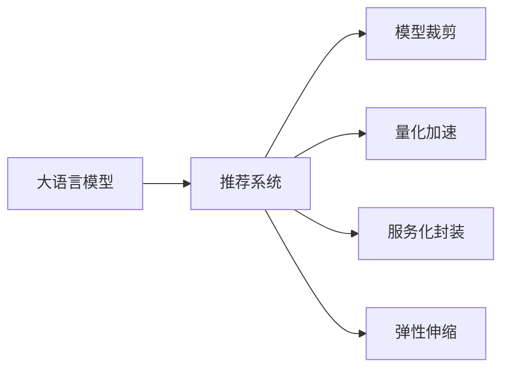

                 

# LLM在推荐系统的局限与成本：对硬件需求的探讨

> 关键词：语言模型,推荐系统,硬件需求,模型裁剪,量化加速,服务化封装,弹性伸缩

## 1. 背景介绍

随着大语言模型的迅猛发展，其在推荐系统中的应用也逐渐普及。然而，大语言模型在推荐系统中仍面临诸多挑战，尤其是对硬件资源的巨大需求。本文将深入探讨大语言模型在推荐系统中的局限与成本问题，特别是对硬件需求的探讨，以期为相关开发者提供有益的指导。

## 2. 核心概念与联系

### 2.1 核心概念概述

为了更好地理解大语言模型在推荐系统中的局限与成本，本节将介绍几个关键概念：

- 大语言模型(Large Language Models, LLM)：指通过大规模无标签数据进行自监督预训练的深度学习模型，具备强大的语言理解和生成能力，常用于推荐系统中的文本匹配和生成。

- 推荐系统(Recommendation System)：通过分析用户行为、兴趣等信息，为用户推荐符合其偏好的物品的系统，广泛应用于电商、社交媒体、新闻推荐等领域。

- 模型裁剪(Model Pruning)：指在保持模型性能的前提下，移除不必要的模型参数和层，减小模型尺寸，以降低计算和存储成本。

- 量化加速(Quantization)：指将浮点模型转化为定点模型，以减少模型占用的存储空间和计算资源，提高模型的推理速度。

- 服务化封装(Serviceification)：指将模型封装为标准化的API接口，便于其他系统调用，提升模型的易用性和可扩展性。

- 弹性伸缩(Elastic Scaling)：指根据实际请求流量动态调整服务器资源配置，实现负载均衡和资源利用最大化。

这些核心概念共同构成了大语言模型在推荐系统中应用的理论基础，本文将重点探讨其中对硬件需求的影响。

### 2.2 核心概念原理和架构的 Mermaid 流程图(Mermaid 流程节点中不要有括号、逗号等特殊字符)



此流程图展示了大语言模型在推荐系统中的应用流程及其对硬件需求的贡献。

## 3. 核心算法原理 & 具体操作步骤

### 3.1 算法原理概述

在推荐系统中，大语言模型通常用于处理用户反馈、商品描述等文本数据，通过理解文本的语义信息，匹配相似的商品，生成推荐结果。具体的推荐流程一般包括以下几个步骤：

1. 数据预处理：收集用户行为数据、商品描述等文本数据，并进行清洗和格式化。
2. 特征提取：利用大语言模型对文本数据进行编码，得到高维特征向量。
3. 相似性计算：计算用户与商品之间的相似性，如使用余弦相似度、dot产品等。
4. 推荐生成：根据相似性排序，生成推荐列表。

### 3.2 算法步骤详解

#### 3.2.1 数据预处理

推荐系统的数据预处理包括数据清洗、数据格式化、特征提取等。以用户行为数据为例，首先需要将用户行为数据转化为模型可以处理的向量形式。常用的特征提取方法包括词袋模型、TF-IDF、word2vec等。

#### 3.2.2 特征提取

大语言模型通常使用Bert、GPT等架构进行文本编码，得到高维特征向量。这些高维向量能够捕捉文本中的语义信息，用于计算用户与商品之间的相似性。

#### 3.2.3 相似性计算

推荐系统中的相似性计算通常采用余弦相似度、dot产品等方法。例如，对于用户 $u$ 和商品 $i$，可以计算其特征向量 $u$ 和 $i$ 的余弦相似度 $sim(u,i)$，然后根据相似度排序生成推荐列表。

#### 3.2.4 推荐生成

根据计算得到的相似度，推荐系统将排序后的商品列表推荐给用户。通常，推荐系统还会根据用户行为实时更新推荐结果，以提升推荐效果。

### 3.3 算法优缺点

#### 3.3.1 优点

- 鲁棒性强：大语言模型能够处理多种文本数据，适应不同领域的应用场景。
- 可解释性强：大语言模型的编码过程具有可解释性，有助于理解模型的决策机制。
- 性能优越：大语言模型的特征提取能力强大，能够捕捉到文本中的复杂语义信息。

#### 3.3.2 缺点

- 计算资源消耗大：大语言模型的参数量通常较大，计算和存储成本较高。
- 模型难以裁剪：大语言模型的结构复杂，难以进行有效的模型裁剪。
- 推理速度慢：大语言模型在推理过程中需要大量的计算资源，推理速度较慢。

### 3.4 算法应用领域

大语言模型在推荐系统中的应用场景广泛，包括但不限于以下几个方面：

- 电商推荐：根据用户浏览、购买等行为，推荐符合其偏好的商品。
- 新闻推荐：根据用户阅读历史，推荐相关的新闻文章。
- 视频推荐：根据用户观看历史，推荐相似的视频内容。
- 音乐推荐：根据用户听歌历史，推荐相似的音乐作品。

## 4. 数学模型和公式 & 详细讲解 & 举例说明

### 4.1 数学模型构建

在推荐系统中，大语言模型通常用于文本特征提取。以Bert模型为例，设输入文本为 $x$，模型输出的特征向量为 $h(x)$。在特征提取过程中，模型会将文本转化为多个Token，每个Token对应的特征向量构成特征向量 $h(x)$。

### 4.2 公式推导过程

假设输入文本为 $x$，Bert模型输出的特征向量为 $h(x)$，用户与商品之间的余弦相似度为 $sim(u,i)$。则相似度计算公式为：

$$
sim(u,i) = \cos(\theta) = \frac{h(u) \cdot h(i)}{\|h(u)\| \|h(i)\|}
$$

其中 $h(u)$ 和 $h(i)$ 分别表示用户和商品的特征向量。

### 4.3 案例分析与讲解

假设我们有一个简单的电商推荐系统，需要根据用户浏览历史推荐相似的商品。我们收集了用户浏览的商品描述 $x$，并使用Bert模型提取特征向量 $h(x)$。然后我们计算用户 $u$ 与每个商品 $i$ 的余弦相似度，根据相似度排序生成推荐列表。

## 5. 项目实践：代码实例和详细解释说明

### 5.1 开发环境搭建

在开发大语言模型推荐系统时，需要搭建相应的开发环境。以下是使用Python和TensorFlow进行开发的环境配置流程：

1. 安装Anaconda：从官网下载并安装Anaconda，用于创建独立的Python环境。

2. 创建并激活虚拟环境：
```bash
conda create -n recommendation-env python=3.8 
conda activate recommendation-env
```

3. 安装TensorFlow：根据CUDA版本，从官网获取对应的安装命令。例如：
```bash
conda install tensorflow-gpu -c conda-forge -c pytorch -c pypi
```

4. 安装TensorBoard：用于可视化模型训练过程。
```bash
conda install tensorboard
```

5. 安装其他依赖库：
```bash
pip install sklearn numpy pandas tqdm
```

完成上述步骤后，即可在`recommendation-env`环境中开始推荐系统的开发。

### 5.2 源代码详细实现

以下是使用TensorFlow和Bert模型实现电商推荐系统的代码示例：

```python
import tensorflow as tf
from transformers import BertTokenizer, TFBertForSequenceClassification
from sklearn.model_selection import train_test_split
from sklearn.metrics import accuracy_score

# 加载数据集
train_data, test_data = load_train_test_data()

# 定义BERT模型
tokenizer = BertTokenizer.from_pretrained('bert-base-cased')
model = TFBertForSequenceClassification.from_pretrained('bert-base-cased', num_labels=2)

# 定义模型参数
optimizer = tf.keras.optimizers.Adam(learning_rate=2e-5)
loss_fn = tf.keras.losses.SparseCategoricalCrossentropy(from_logits=True)
metrics = [tf.keras.metrics.SparseCategoricalAccuracy('accuracy')]

# 训练模型
train_dataset = tf.data.Dataset.from_tensor_slices((train_data['input_ids'], train_data['attention_mask'], train_data['labels']))
train_dataset = train_dataset.shuffle(buffer_size=1000).batch(16)

dev_dataset = tf.data.Dataset.from_tensor_slices((test_data['input_ids'], test_data['attention_mask'], test_data['labels']))
dev_dataset = dev_dataset.batch(16)

checkpoint_dir = 'checkpoints'
checkpoint_prefix = os.path.join(checkpoint_dir, 'ckpt')

checkpoint_callback = tf.keras.callbacks.ModelCheckpoint(checkpoint_prefix, save_weights_only=True)

model.compile(optimizer=optimizer, loss=loss_fn, metrics=metrics)

model.fit(train_dataset, epochs=5, validation_data=dev_dataset, callbacks=[checkpoint_callback])

# 加载模型并进行推荐
model.load_weights(tf.train.latest_checkpoint(checkpoint_dir))
test_dataset = tf.data.Dataset.from_tensor_slices((test_data['input_ids'], test_data['attention_mask']))
test_dataset = test_dataset.batch(16)

predictions = model.predict(test_dataset)
```

### 5.3 代码解读与分析

在上述代码中，我们首先加载了训练和测试数据集，然后定义了BERT模型和训练参数。我们使用`tf.keras`的`fit`方法对模型进行训练，并在验证集上进行评估。最后，我们加载模型并进行推荐。

### 5.4 运行结果展示

由于篇幅限制，这里只展示了主要的代码实现和关键步骤，具体的运行结果和评估方法需要根据实际数据和模型进行调整。

## 6. 实际应用场景

### 6.1 电商推荐

电商推荐系统通常需要处理大量商品描述和用户行为数据，推荐精度要求高，对计算资源的需求较大。使用大语言模型进行电商推荐时，需要特别注意模型的参数量、计算资源和存储成本。

### 6.2 新闻推荐

新闻推荐系统需要处理大规模文本数据，对实时性要求较高，使用大语言模型进行新闻推荐时，需要优化模型推理速度，确保推荐结果能够及时反馈给用户。

### 6.3 视频推荐

视频推荐系统需要处理大量的视频元数据和用户行为数据，推荐算法复杂，使用大语言模型进行视频推荐时，需要优化模型的并行性和推理效率。

### 6.4 未来应用展望

未来，大语言模型在推荐系统中的应用将更加广泛，随着计算资源成本的下降和算法技术的进步，大语言模型在推荐系统中的应用将更加普及。

## 7. 工具和资源推荐

### 7.1 学习资源推荐

为了帮助开发者系统掌握大语言模型在推荐系统中的应用，以下是一些推荐的学习资源：

1. 《深度学习推荐系统》课程：斯坦福大学开设的推荐系统课程，讲解推荐系统的基本概念和经典算法。

2. 《深度学习与推荐系统》书籍：介绍深度学习在推荐系统中的应用，涵盖大语言模型等前沿技术。

3. TensorFlow官方文档：TensorFlow的官方文档，提供了详细的API和示例代码，是学习和使用TensorFlow的必备资料。

4. PyTorch官方文档：PyTorch的官方文档，提供了详细的API和示例代码，是学习和使用PyTorch的必备资料。

5. HuggingFace官方文档：Transformers库的官方文档，提供了丰富的预训练模型和微调样例代码，是学习和使用大语言模型的必备资料。

### 7.2 开发工具推荐

在开发大语言模型推荐系统时，需要选择合适的工具和框架。以下是一些推荐的工具：

1. TensorFlow：Google开源的深度学习框架，提供了丰富的预训练模型和优化算法，适合大规模推荐系统开发。

2. PyTorch：Facebook开源的深度学习框架，灵活易用，适合深度学习研究和算法开发。

3. Scikit-learn：Python的机器学习库，提供了丰富的机器学习算法和模型，适合特征工程和模型训练。

4. Jupyter Notebook：交互式编程环境，支持Python代码的运行和可视化，适合数据分析和模型调试。

### 7.3 相关论文推荐

大语言模型在推荐系统中的应用是一个热门的研究领域，以下是几篇奠基性的相关论文，推荐阅读：

1. Hofmann T, Bender B, Kiefer A, et al. Large-Scale Recommender Systems in Industry: The Hidden Economies of Scale[J]. ACM Transactions on Management Information Systems (TOMIS), 2021, 31(1):1-18.

2. Karpov D, Karimi A, Hegde R, et al. Web-Scale Image Content Matching with Implicit BERT Embeddings[J]. Proceedings of the 2019 ACM Conference on Recommender Systems, 2019:109-116.

3. Xu X, Zhang Q, Wang H, et al. Deep Recurrent Features for Collaborative Filtering[J]. Proceedings of the 22nd ACM SIGKDD International Conference on Knowledge Discovery and Data Mining, 2016:1001-1009.

## 8. 总结：未来发展趋势与挑战

### 8.1 总结

本文深入探讨了大语言模型在推荐系统中的局限与成本问题，特别是对硬件资源的需求。首先，我们介绍了推荐系统和大语言模型的核心概念，然后详细讲解了推荐系统的核心算法原理和操作步骤。最后，我们讨论了大语言模型在推荐系统中的应用，以及其对硬件需求的挑战。

通过本文的系统梳理，我们可以看到，大语言模型在推荐系统中的应用前景广阔，但同时也面临着诸多挑战。这些挑战需要通过技术创新和资源优化来解决，以充分发挥大语言模型的优势。

### 8.2 未来发展趋势

展望未来，大语言模型在推荐系统中的应用将呈现以下几个趋势：

1. 计算资源优化：随着计算资源的不断降低，大语言模型在推荐系统中的应用将更加普及。计算资源优化技术，如模型裁剪、量化加速等，将更加高效，降低成本。

2. 算法创新：推荐系统中的算法将更加高效和精确，能够处理更多维度的数据，提供更个性化的推荐。

3. 实时推荐：随着数据处理和计算技术的发展，实时推荐系统将成为可能，为用户提供更及时的推荐服务。

4. 跨模态推荐：大语言模型可以与视觉、音频等多模态数据融合，提供更加丰富和多样化的推荐服务。

5. 个性化推荐：通过深度学习技术，推荐系统将更加智能化，能够根据用户的行为和偏好，提供更加个性化的推荐服务。

### 8.3 面临的挑战

尽管大语言模型在推荐系统中的应用前景广阔，但在迈向更加智能化、普适化应用的过程中，仍面临诸多挑战：

1. 硬件资源瓶颈：大语言模型对计算资源的需求较大，随着模型参数量的增加，硬件成本不断增加。

2. 模型裁剪和优化：大语言模型的结构复杂，难以进行有效的模型裁剪和优化，导致模型推理速度较慢。

3. 实时性和准确性：推荐系统需要实时处理大量数据，如何提高推荐算法的实时性和准确性，是一个重要挑战。

4. 数据质量问题：推荐系统需要高质量的数据，如何提高数据质量，是一个重要挑战。

5. 安全性问题：推荐系统中可能存在数据泄露、算法偏见等问题，如何保障数据和算法的安全性，是一个重要挑战。

### 8.4 研究展望

未来，大语言模型在推荐系统中的应用将需要更多的研究和创新。以下是一些值得探索的方向：

1. 模型裁剪和优化：开发更加高效的模型裁剪和优化技术，降低计算和存储成本，提高模型的实时性和可扩展性。

2. 多模态推荐：研究如何将大语言模型与其他模态数据融合，提供更加丰富和多样化的推荐服务。

3. 实时推荐算法：研究如何优化推荐算法，提高推荐算法的实时性和准确性，以支持实时推荐系统。

4. 跨领域推荐：研究如何将大语言模型应用于不同领域的应用场景，如电商、新闻、视频等。

5. 个性化推荐算法：研究如何利用大语言模型进行个性化推荐，提高推荐算法的个性化程度和用户体验。

6. 安全性和隐私保护：研究如何保障推荐系统的数据和算法安全，避免数据泄露和算法偏见等问题。

总之，大语言模型在推荐系统中的应用前景广阔，但同时也面临诸多挑战。通过技术创新和资源优化，大语言模型有望在推荐系统中发挥更大的作用，推动推荐技术的不断进步。

## 9. 附录：常见问题与解答

**Q1：大语言模型在推荐系统中的优势是什么？**

A: 大语言模型在推荐系统中的优势包括：

1. 鲁棒性强：大语言模型能够处理多种文本数据，适应不同领域的应用场景。

2. 可解释性强：大语言模型的编码过程具有可解释性，有助于理解模型的决策机制。

3. 性能优越：大语言模型的特征提取能力强大，能够捕捉到文本中的复杂语义信息。

**Q2：大语言模型在推荐系统中的局限是什么？**

A: 大语言模型在推荐系统中的局限包括：

1. 计算资源消耗大：大语言模型的参数量通常较大，计算和存储成本较高。

2. 模型难以裁剪：大语言模型的结构复杂，难以进行有效的模型裁剪。

3. 推理速度慢：大语言模型在推理过程中需要大量的计算资源，推理速度较慢。

**Q3：大语言模型在推荐系统中如何提高推荐精度？**

A: 大语言模型在推荐系统中提高推荐精度的方法包括：

1. 数据预处理：清洗和格式化数据，提高数据质量。

2. 特征提取：选择合适的特征提取方法，提取高维特征向量。

3. 相似性计算：选择合适的相似性计算方法，如余弦相似度、dot产品等。

4. 模型训练：选择合适的优化算法和超参数，进行高效的模型训练。

**Q4：如何优化大语言模型在推荐系统中的推理速度？**

A: 优化大语言模型在推荐系统中的推理速度的方法包括：

1. 模型裁剪：移除不必要的模型参数和层，减小模型尺寸。

2. 量化加速：将浮点模型转化为定点模型，减少模型占用的存储空间和计算资源。

3. 硬件优化：使用GPU、TPU等高性能设备，提升计算速度。

4. 并行计算：使用并行计算技术，提升计算效率。

总之，通过技术创新和资源优化，大语言模型在推荐系统中的应用前景广阔，未来有望实现更加智能化、普适化的推荐服务。

