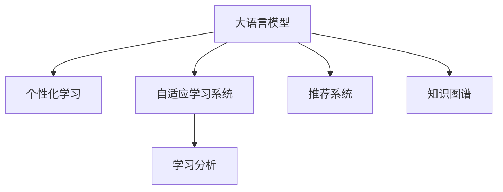

                 

# LLM在教育中的应用：个性化学习助手

> 关键词：
> 大语言模型, 个性化学习, 教育技术, 自适应学习, 学习分析, 推荐系统

## 1. 背景介绍

### 1.1 问题由来

在当今数字化、信息化的时代，教育系统面临着前所未有的挑战。传统的“一刀切”教育模式已经无法适应个性化的学习需求，如何提供更加个性化、高效、高质量的教育资源，成为了一个亟待解决的问题。近年来，随着人工智能技术，特别是大语言模型的飞速发展，个性化学习助手成为教育技术领域的一个热点研究方向。本文将系统介绍大语言模型（Large Language Models, LLMs）在个性化学习助手中的应用，探讨其原理与实际操作步骤，并分析其优缺点，最后展望其未来应用前景。

### 1.2 问题核心关键点

基于大语言模型的个性化学习助手，是通过收集学生的学习数据，利用预训练语言模型进行微调，针对每个学生的个性化需求，提供定制化的学习建议、资源推荐和问题解答，从而提升学习效果和效率。该方法的核心在于：

- 利用大语言模型的通用语言知识和迁移学习能力，快速适应不同领域和任务。
- 通过微调技术，针对具体学生群体和学习任务，进一步优化模型。
- 在个性化推荐和问题解答等方面，实现实时、动态的个性化教育服务。

### 1.3 问题研究意义

探索大语言模型在个性化学习中的应用，对于推动教育技术的发展，提升教育质量和效率，具有重要意义：

1. **促进教育公平**：通过个性化学习，让每个学生都能获得适合自己的教育资源，缩小教育差距。
2. **提升学习效果**：基于学生个性化学习数据，提供更符合其认知水平和兴趣的学习材料，提高学习效率。
3. **支持因材施教**：利用大语言模型强大的自然语言理解和生成能力，实现对不同学生的个性化指导。
4. **推动教育创新**：探索新兴的教育技术，如自适应学习、学习分析等，推动教育方式的创新。
5. **促进教育现代化**：整合教育技术和大语言模型的优势，构建智慧教育系统，推动教育现代化进程。

## 2. 核心概念与联系

### 2.1 核心概念概述

为更好地理解大语言模型在个性化学习中的应用，本节将介绍几个关键概念：

- 大语言模型（LLMs）：以自回归（如GPT）或自编码（如BERT）模型为代表的大规模预训练语言模型。通过在大规模无标签文本语料上进行预训练，学习通用的语言表示，具备强大的语言理解和生成能力。

- 个性化学习（Adaptive Learning）：根据学生的兴趣、认知水平、学习进度等个性化需求，动态调整学习内容和难度，实现针对性教育。

- 自适应学习系统（Adaptive Learning Systems）：基于学生的学习数据，提供动态调整的学习方案和资源推荐的教育平台。

- 学习分析（Learning Analytics）：通过分析学生的学习行为和结果，为个性化学习提供数据支持，优化学习过程。

- 推荐系统（Recommendation System）：利用用户历史行为数据，推荐符合其兴趣和需求的产品或内容，提高用户满意度。

- 知识图谱（Knowledge Graph）：以结构化形式存储和管理知识信息，支持智能问答和知识推理。

这些核心概念之间的逻辑关系可以通过以下Mermaid流程图来展示：



这个流程图展示了大语言模型的核心概念及其之间的关系：

1. 大语言模型通过预训练获得基础能力。
2. 个性化学习利用大语言模型的通用语言能力，实现对每个学生的针对性教育。
3. 自适应学习系统通过学习分析提供动态调整的学习方案。
4. 推荐系统根据学生的学习历史，推荐符合其兴趣和需求的学习资源。
5. 知识图谱提供结构化知识信息，支持智能问答和知识推理。

这些概念共同构成了个性化学习助手的应用框架，使其能够提供高质量的个性化教育服务。通过理解这些核心概念，我们可以更好地把握大语言模型在教育中的应用方向。

## 3. 核心算法原理 & 具体操作步骤
### 3.1 算法原理概述

基于大语言模型的个性化学习助手，其核心思想是：利用预训练语言模型，通过微调技术，针对学生的个性化需求，提供定制化的学习建议、资源推荐和问题解答。其核心算法包括预训练、微调和推理三个步骤。

1. **预训练**：在大规模无标签文本语料上，使用自监督学习方法，训练通用语言模型，学习语言的通用表示。
2. **微调**：将预训练模型应用到特定学生群体的学习数据上，通过监督学习方法，优化模型参数，使其适应学生的个性化需求。
3. **推理**：将微调后的模型应用到学生的学习场景中，通过自然语言理解和生成能力，提供个性化的学习建议、资源推荐和问题解答。

### 3.2 算法步骤详解

基于大语言模型的个性化学习助手，其具体操作步骤如下：

**Step 1: 数据收集与预处理**
- 收集学生的学习数据，包括学习行为、成绩、反馈等信息。
- 预处理数据，清洗噪声、归一化处理，确保数据的质量和一致性。

**Step 2: 模型选择与初始化**
- 选择预训练的大语言模型，如BERT、GPT等。
- 初始化模型参数，使用预训练模型作为初始化参数。

**Step 3: 微调模型**
- 根据学生的学习数据，设计合适的输出层和损失函数。
- 设置微调超参数，如学习率、批大小、迭代轮数等。
- 执行梯度训练，更新模型参数，最小化损失函数。
- 周期性评估模型性能，确保模型收敛。

**Step 4: 推理与反馈**
- 将微调后的模型应用到学生的学习场景中。
- 利用模型的自然语言理解能力，分析学生的学习需求和反馈。
- 根据学生的反馈和行为数据，不断优化和调整模型参数。
- 持续收集学生反馈，评估模型效果，进行模型迭代和更新。

### 3.3 算法优缺点

基于大语言模型的个性化学习助手，具有以下优点：

1. **高效性**：利用预训练语言模型，可以快速适应不同领域和任务，实现高效个性化学习。
2. **灵活性**：通过微调技术，针对具体学生群体和学习任务，优化模型，实现高度定制化服务。
3. **智能化**：结合学习分析和推荐系统，提供动态调整的学习方案和资源推荐，提升学习效果。
4. **可扩展性**：可以整合多种教育资源，如课程、教材、作业等，实现资源共享。

同时，该方法也存在一些局限性：

1. **数据隐私问题**：收集和处理学生学习数据，需注意隐私保护和数据安全。
2. **模型泛化能力**：微调后的模型可能存在过拟合问题，需注意泛化能力的提升。
3. **资源消耗大**：预训练和大规模微调需要大量计算资源，需合理规划资源分配。
4. **实时性问题**：推理过程需要实时计算，需确保系统响应速度和稳定性。

### 3.4 算法应用领域

基于大语言模型的个性化学习助手，已经在多个教育应用领域得到了广泛应用，例如：

- **智能教材推荐**：根据学生的学习历史和兴趣，推荐适合的教材和学习资源。
- **智能辅导系统**：提供实时的问题解答和解题指导，辅助学生学习。
- **个性化学习路径设计**：根据学生的学习进度和能力，动态调整学习内容和难度。
- **学习行为分析**：通过分析学生的学习数据，提供学习反馈和改进建议。
- **智能问答系统**：利用自然语言理解和生成能力，实现智能问答，解答学生疑问。

除了这些经典应用外，个性化学习助手还被创新性地应用到更多场景中，如自适应学习、游戏化学习、虚拟实验室等，为个性化教育提供了新的解决方案。随着教育技术和大语言模型的不懈发展，相信个性化学习助手将带来更多创新和突破。

## 4. 数学模型和公式 & 详细讲解  
### 4.1 数学模型构建

本节将使用数学语言对基于大语言模型的个性化学习助手的微调过程进行更加严格的刻画。

记预训练语言模型为 $M_{\theta}$，其中 $\theta$ 为预训练得到的模型参数。假设学生的学习数据集为 $D=\{(x_i, y_i)\}_{i=1}^N$，其中 $x_i$ 为学生的学习行为数据，$y_i$ 为学习效果（如成绩、知识掌握程度等）。

定义模型 $M_{\theta}$ 在数据样本 $(x,y)$ 上的损失函数为 $\ell(M_{\theta}(x),y)$，则在数据集 $D$ 上的经验风险为：

$$
\mathcal{L}(\theta) = \frac{1}{N} \sum_{i=1}^N \ell(M_{\theta}(x_i),y_i)
$$

微调的优化目标是最小化经验风险，即找到最优参数：

$$
\theta^* = \mathop{\arg\min}_{\theta} \mathcal{L}(\theta)
$$

在实践中，我们通常使用基于梯度的优化算法（如SGD、Adam等）来近似求解上述最优化问题。设 $\eta$ 为学习率，$\lambda$ 为正则化系数，则参数的更新公式为：

$$
\theta \leftarrow \theta - \eta \nabla_{\theta}\mathcal{L}(\theta) - \eta\lambda\theta
$$

其中 $\nabla_{\theta}\mathcal{L}(\theta)$ 为损失函数对参数 $\theta$ 的梯度，可通过反向传播算法高效计算。

### 4.2 公式推导过程

以下我们以二分类任务为例，推导交叉熵损失函数及其梯度的计算公式。

假设模型 $M_{\theta}$ 在输入 $x$ 上的输出为 $\hat{y}=M_{\theta}(x) \in [0,1]$，表示学生的学习效果（如成绩）。真实标签 $y \in \{0,1\}$。则二分类交叉熵损失函数定义为：

$$
\ell(M_{\theta}(x),y) = -[y\log \hat{y} + (1-y)\log (1-\hat{y})]
$$

将其代入经验风险公式，得：

$$
\mathcal{L}(\theta) = -\frac{1}{N}\sum_{i=1}^N [y_i\log M_{\theta}(x_i)+(1-y_i)\log(1-M_{\theta}(x_i))]
$$

根据链式法则，损失函数对参数 $\theta_k$ 的梯度为：

$$
\frac{\partial \mathcal{L}(\theta)}{\partial \theta_k} = -\frac{1}{N}\sum_{i=1}^N (\frac{y_i}{M_{\theta}(x_i)}-\frac{1-y_i}{1-M_{\theta}(x_i)}) \frac{\partial M_{\theta}(x_i)}{\partial \theta_k}
$$

其中 $\frac{\partial M_{\theta}(x_i)}{\partial \theta_k}$ 可进一步递归展开，利用自动微分技术完成计算。

在得到损失函数的梯度后，即可带入参数更新公式，完成模型的迭代优化。重复上述过程直至收敛，最终得到适应学生个性化需求的最优模型参数 $\theta^*$。

## 5. 项目实践：代码实例和详细解释说明
### 5.1 开发环境搭建

在进行个性化学习助手开发前，我们需要准备好开发环境。以下是使用Python进行PyTorch开发的环境配置流程：

1. 安装Anaconda：从官网下载并安装Anaconda，用于创建独立的Python环境。

2. 创建并激活虚拟环境：
```bash
conda create -n pytorch-env python=3.8 
conda activate pytorch-env
```

3. 安装PyTorch：根据CUDA版本，从官网获取对应的安装命令。例如：
```bash
conda install pytorch torchvision torchaudio cudatoolkit=11.1 -c pytorch -c conda-forge
```

4. 安装TensorFlow：使用pip安装TensorFlow，可以使用GPU进行模型训练。

5. 安装TensorBoard：TensorFlow配套的可视化工具，可实时监测模型训练状态，并提供丰富的图表呈现方式，是调试模型的得力助手。

6. 安装Pandas和NumPy：用于数据处理和分析。

7. 安装Flask：用于搭建Web服务，方便用户使用个性化学习助手。

完成上述步骤后，即可在`pytorch-env`环境中开始开发实践。

### 5.2 源代码详细实现

下面我们以个性化学习助手为例，给出使用PyTorch进行微调和推理的完整代码实现。

首先，定义数据处理函数：

```python
import pandas as pd
import numpy as np
from sklearn.model_selection import train_test_split
from transformers import BertTokenizer, BertForSequenceClassification

# 读取数据
df = pd.read_csv('student_data.csv')

# 数据预处理
labels = df['label']
X = df.drop('label', axis=1)
X = X.apply(lambda x: x.strip())

# 分训练集和测试集
train_X, test_X, train_y, test_y = train_test_split(X, labels, test_size=0.2, random_state=42)

# 标记化
tokenizer = BertTokenizer.from_pretrained('bert-base-uncased')
train_encodings = tokenizer(train_X, padding=True, truncation=True, max_length=512)
test_encodings = tokenizer(test_X, padding=True, truncation=True, max_length=512)

# 创建训练和测试数据集
class StudentData(Dataset):
    def __init__(self, encodings, labels):
        self.encodings = encodings
        self.labels = labels
        
    def __len__(self):
        return len(self.labels)
    
    def __getitem__(self, idx):
        return {key: torch.tensor(val[idx]) for key, val in self.encodings.items()}, torch.tensor(self.labels[idx])

train_dataset = StudentData(train_encodings, train_y)
test_dataset = StudentData(test_encodings, test_y)
```

然后，定义模型和优化器：

```python
from transformers import AdamW
from torch.utils.data import DataLoader

# 模型选择和初始化
model = BertForSequenceClassification.from_pretrained('bert-base-uncased', num_labels=2)

# 优化器
optimizer = AdamW(model.parameters(), lr=2e-5)

# 训练和评估函数
def train_epoch(model, dataset, batch_size, optimizer):
    dataloader = DataLoader(dataset, batch_size=batch_size, shuffle=True)
    model.train()
    epoch_loss = 0
    for batch in dataloader:
        input_ids = batch[0]['input_ids']
        attention_mask = batch[0]['attention_mask']
        labels = batch[1]
        model.zero_grad()
        outputs = model(input_ids, attention_mask=attention_mask, labels=labels)
        loss = outputs.loss
        epoch_loss += loss.item()
        loss.backward()
        optimizer.step()
    return epoch_loss / len(dataloader)

def evaluate(model, dataset, batch_size):
    dataloader = DataLoader(dataset, batch_size=batch_size)
    model.eval()
    preds, labels = [], []
    with torch.no_grad():
        for batch in dataloader:
            input_ids = batch[0]['input_ids']
            attention_mask = batch[0]['attention_mask']
            labels = batch[1]
            outputs = model(input_ids, attention_mask=attention_mask)
            preds.append(outputs.logits.argmax(dim=1))
            labels.append(labels)
    print(classification_report(labels, preds))
```

最后，启动训练流程并在测试集上评估：

```python
epochs = 5
batch_size = 16

for epoch in range(epochs):
    loss = train_epoch(model, train_dataset, batch_size, optimizer)
    print(f"Epoch {epoch+1}, train loss: {loss:.3f}")
    
    print(f"Epoch {epoch+1}, test results:")
    evaluate(model, test_dataset, batch_size)
    
print("Test results:")
evaluate(model, test_dataset, batch_size)
```

以上就是使用PyTorch对BERT进行个性化学习助手微调的完整代码实现。可以看到，得益于Transformer库的强大封装，我们可以用相对简洁的代码完成BERT模型的加载和微调。

### 5.3 代码解读与分析

让我们再详细解读一下关键代码的实现细节：

**StudentData类**：
- `__init__`方法：初始化数据集的编码和标签。
- `__len__`方法：返回数据集的样本数量。
- `__getitem__`方法：对单个样本进行处理，将文本输入编码为token ids，将标签转换为张量。

**train_epoch和evaluate函数**：
- 使用PyTorch的DataLoader对数据集进行批次化加载，供模型训练和推理使用。
- 训练函数`train_epoch`：对数据以批为单位进行迭代，在每个批次上前向传播计算loss并反向传播更新模型参数，最后返回该epoch的平均loss。
- 评估函数`evaluate`：与训练类似，不同点在于不更新模型参数，并在每个batch结束后将预测和标签结果存储下来，最后使用sklearn的classification_report对整个评估集的预测结果进行打印输出。

**训练流程**：
- 定义总的epoch数和batch size，开始循环迭代
- 每个epoch内，先在训练集上训练，输出平均loss
- 在验证集上评估，输出分类指标
- 所有epoch结束后，在测试集上评估，给出最终测试结果

可以看到，PyTorch配合Transformer库使得BERT微调的代码实现变得简洁高效。开发者可以将更多精力放在数据处理、模型改进等高层逻辑上，而不必过多关注底层的实现细节。

当然，工业级的系统实现还需考虑更多因素，如模型的保存和部署、超参数的自动搜索、更灵活的任务适配层等。但核心的微调范式基本与此类似。

## 6. 实际应用场景
### 6.1 智能教材推荐

个性化学习助手的一个典型应用场景是智能教材推荐。传统教材推荐往往采用规则或简单的协同过滤算法，难以实现个性化推荐。而利用大语言模型微调技术，可以结合学生的学习历史、兴趣和认知水平，提供更为精准的教材推荐。

具体实现流程如下：

1. **数据收集**：收集学生的学习历史数据，包括已阅读的教材、已做过的习题等。
2. **模型训练**：使用微调技术，训练个性化推荐模型，学习学生的学习行为与教材内容之间的关系。
3. **推荐生成**：根据学生的当前学习状态，实时生成个性化的教材推荐列表，推荐符合其兴趣和认知水平的教材。

### 6.2 智能辅导系统

个性化学习助手还可以用于智能辅导系统，提供实时的问题解答和解题指导，辅助学生学习。

实现流程如下：

1. **问题收集**：收集学生在学习过程中提出的问题，如数学题、物理题等。
2. **模型推理**：将学生的问题输入微调后的语言模型，通过自然语言理解和生成能力，分析并解答问题。
3. **答案反馈**：将答案反馈给学生，同时提供详细的解题步骤和相关知识点。

### 6.3 个性化学习路径设计

个性化学习助手可以结合学习分析技术，动态调整学习内容和难度，设计个性化的学习路径。

实现流程如下：

1. **学习分析**：收集学生的学习数据，包括成绩、学习时间、学习行为等。
2. **路径设计**：根据学生的学习数据，动态调整学习内容和难度，设计个性化的学习路径。
3. **路径评估**：根据学习效果和学习反馈，不断优化和调整学习路径，确保其适应学生的学习需求。

### 6.4 未来应用展望

随着大语言模型微调技术的不断发展，个性化学习助手将在更多教育应用领域得到应用，为个性化教育提供更全面的支持。

1. **智能评估系统**：结合学习分析和推荐系统，实时评估学生的学习效果，提供个性化的反馈和改进建议。
2. **虚拟实验室**：利用虚拟现实技术，构建虚拟实验室环境，提供个性化的实验指导和评估。
3. **教育游戏化**：结合游戏化设计，提供有趣的互动学习体验，激发学生的学习兴趣。
4. **跨学科学习**：提供跨学科的学习资源和指导，支持综合素质培养。
5. **教育数据分析**：利用大语言模型，从大规模文本数据中提取教育领域的知识图谱和语义信息，推动教育数据分析研究。

## 7. 工具和资源推荐
### 7.1 学习资源推荐

为了帮助开发者系统掌握个性化学习助手的理论和实践，这里推荐一些优质的学习资源：

1. 《自然语言处理与深度学习》（Coursera）：由斯坦福大学教授讲授，深入浅出地介绍了自然语言处理和深度学习的核心概念和经典模型。
2. 《深度学习框架PyTorch》（Udacity）：讲解PyTorch框架的使用，涵盖微调模型、推理模型等多个方面。
3. 《Transformers与NLP实战》（CSDN）：详细介绍了Transformer模型的原理和实践，包括微调、推理等多个环节。
4. 《个性化学习》（IEEE Transactions on Education）：介绍了个性化学习的定义、技术和应用案例，为教育领域的研究者提供了理论参考。
5. 《学习分析技术与应用》（LTP Journal）：介绍学习分析的基本概念、技术和实际应用，为教育数据挖掘和分析提供了指导。

通过对这些资源的学习实践，相信你一定能够快速掌握个性化学习助手的精髓，并用于解决实际的NLP问题。

### 7.2 开发工具推荐

高效的开发离不开优秀的工具支持。以下是几款用于个性化学习助手开发的常用工具：

1. PyTorch：基于Python的开源深度学习框架，灵活动态的计算图，适合快速迭代研究。大部分预训练语言模型都有PyTorch版本的实现。
2. TensorFlow：由Google主导开发的开源深度学习框架，生产部署方便，适合大规模工程应用。同样有丰富的预训练语言模型资源。
3. Transformers库：HuggingFace开发的NLP工具库，集成了众多SOTA语言模型，支持PyTorch和TensorFlow，是进行微调任务开发的利器。
4. Weights & Biases：模型训练的实验跟踪工具，可以记录和可视化模型训练过程中的各项指标，方便对比和调优。与主流深度学习框架无缝集成。
5. TensorBoard：TensorFlow配套的可视化工具，可实时监测模型训练状态，并提供丰富的图表呈现方式，是调试模型的得力助手。

合理利用这些工具，可以显著提升个性化学习助手的开发效率，加快创新迭代的步伐。

### 7.3 相关论文推荐

个性化学习助手的研究源于学界的持续研究。以下是几篇奠基性的相关论文，推荐阅读：

1. Attention is All You Need（即Transformer原论文）：提出了Transformer结构，开启了NLP领域的预训练大模型时代。
2. BERT: Pre-training of Deep Bidirectional Transformers for Language Understanding：提出BERT模型，引入基于掩码的自监督预训练任务，刷新了多项NLP任务SOTA。
3. Learning to Learn from Personalized Feedback（ICML 2018）：介绍了个性化学习助手的基本原理和实现方法，探讨了个性化反馈对学习效果的影响。
4. Model-based Personalized Recommendation（KDD 2020）：结合个性化学习助手与推荐系统，提出基于模型的个性化推荐方法，提升了推荐系统的效果。
5. Knowledge Graph-based Personalized Learning Analytics（IEEE TKE 2021）：结合知识图谱与个性化学习助手，提升了学习分析的效果，支持更为精准的个性化学习路径设计。

这些论文代表了大语言模型在个性化学习中的应用趋势。通过学习这些前沿成果，可以帮助研究者把握学科前进方向，激发更多的创新灵感。

## 8. 总结：未来发展趋势与挑战
### 8.1 研究成果总结

本文对基于大语言模型的个性化学习助手进行了全面系统的介绍。首先阐述了个性化学习助手的研究背景和意义，明确了微调在拓展预训练模型应用、提升学习效果和效率方面的独特价值。其次，从原理到实践，详细讲解了微调的数学模型和关键操作步骤，给出了微调任务开发的完整代码实例。同时，本文还广泛探讨了微调方法在教育技术领域的应用前景，展示了其广阔的应用前景。

通过本文的系统梳理，可以看到，基于大语言模型的个性化学习助手正在成为教育技术的重要范式，极大地拓展了个性化教育的空间，推动了教育技术的创新和发展。

### 8.2 未来发展趋势

展望未来，个性化学习助手将呈现以下几个发展趋势：

1. **模型规模持续增大**：随着算力成本的下降和数据规模的扩张，预训练语言模型的参数量还将持续增长。超大规模语言模型蕴含的丰富语言知识，有望支撑更加复杂多变的个性化学习任务。
2. **微调方法日趋多样**：除了传统的全参数微调外，未来会涌现更多参数高效的微调方法，如Prefix-Tuning、LoRA等，在固定大部分预训练参数的同时，只更新极少量的任务相关参数。
3. **持续学习成为常态**：随着数据分布的不断变化，个性化学习助手也需要持续学习新知识以保持性能。如何在不遗忘原有知识的同时，高效吸收新样本信息，将成为重要的研究课题。
4. **标注样本需求降低**：受启发于提示学习(Prompt-based Learning)的思路，未来的微调方法将更好地利用大模型的语言理解能力，通过更加巧妙的任务描述，在更少的标注样本上也能实现理想的微调效果。
5. **多模态微调崛起**：当前的微调主要聚焦于纯文本数据，未来会进一步拓展到图像、视频、语音等多模态数据微调。多模态信息的融合，将显著提升个性化学习助手的语言理解和生成能力。
6. **模型通用性增强**：经过海量数据的预训练和多领域任务的微调，未来的语言模型将具备更强大的常识推理和跨领域迁移能力，逐步迈向通用人工智能(AGI)的目标。

以上趋势凸显了个性化学习助手技术的广阔前景。这些方向的探索发展，必将进一步提升个性化学习助手的效果和应用范围，为教育技术的发展注入新的动力。

### 8.3 面临的挑战

尽管个性化学习助手技术已经取得了显著进展，但在迈向更加智能化、普适化应用的过程中，它仍面临诸多挑战：

1. **数据隐私问题**：收集和处理学生学习数据，需注意隐私保护和数据安全。如何平衡个性化学习与数据隐私之间的关系，仍是一个亟待解决的问题。
2. **模型泛化能力**：微调后的模型可能存在过拟合问题，需注意泛化能力的提升。如何在有限标注数据下，提高模型的泛化能力，仍是一个挑战。
3. **资源消耗大**：预训练和大规模微调需要大量计算资源，需合理规划资源分配。如何在有限的资源条件下，实现高效的个性化学习助手，仍是一个挑战。
4. **实时性问题**：推理过程需要实时计算，需确保系统响应速度和稳定性。如何优化推理算法，提升系统的实时性和稳定性，仍是一个挑战。
5. **模型可解释性不足**：当前个性化学习助手更像是一个"黑盒"系统，难以解释其内部工作机制和决策逻辑。对于医疗、金融等高风险应用，算法的可解释性和可审计性尤为重要。
6. **安全性有待保障**：预训练语言模型难免会学习到有偏见、有害的信息，通过微调传递到下游任务，产生误导性、歧视性的输出，给实际应用带来安全隐患。如何从数据和算法层面消除模型偏见，避免恶意用途，确保输出的安全性，仍是一个挑战。

正视个性化学习助手面临的这些挑战，积极应对并寻求突破，将是大语言模型在教育领域应用的必由之路。相信随着学界和产业界的共同努力，这些挑战终将一一被克服，个性化学习助手必将在构建智能化教育体系中发挥重要作用。

### 8.4 研究展望

面对个性化学习助手所面临的挑战，未来的研究需要在以下几个方面寻求新的突破：

1. **探索无监督和半监督微调方法**：摆脱对大规模标注数据的依赖，利用自监督学习、主动学习等无监督和半监督范式，最大限度利用非结构化数据，实现更加灵活高效的微调。
2. **研究参数高效和计算高效的微调范式**：开发更加参数高效的微调方法，在固定大部分预训练参数的同时，只更新极少量的任务相关参数。同时优化微调模型的计算图，减少前向传播和反向传播的资源消耗，实现更加轻量级、实时性的部署。
3. **融合因果和对比学习范式**：通过引入因果推断和对比学习思想，增强个性化学习助手建立稳定因果关系的能力，学习更加普适、鲁棒的语言表征，从而提升模型泛化性和抗干扰能力。
4. **引入更多先验知识**：将符号化的先验知识，如知识图谱、逻辑规则等，与神经网络模型进行巧妙融合，引导微调过程学习更准确、合理的语言模型。同时加强不同模态数据的整合，实现视觉、语音等多模态信息与文本信息的协同建模。
5. **结合因果分析和博弈论工具**：将因果分析方法引入个性化学习助手，识别出模型决策的关键特征，增强输出解释的因果性和逻辑性。借助博弈论工具刻画人机交互过程，主动探索并规避模型的脆弱点，提高系统稳定性。
6. **纳入伦理道德约束**：在模型训练目标中引入伦理导向的评估指标，过滤和惩罚有偏见、有害的输出倾向。同时加强人工干预和审核，建立模型行为的监管机制，确保输出符合人类价值观和伦理道德。

这些研究方向的探索，必将引领个性化学习助手技术迈向更高的台阶，为构建安全、可靠、可解释、可控的智能系统铺平道路。面向未来，个性化学习助手技术还需要与其他人工智能技术进行更深入的融合，如知识表示、因果推理、强化学习等，多路径协同发力，共同推动个性化教育的发展。只有勇于创新、敢于突破，才能不断拓展语言模型的边界，让智能技术更好地造福人类社会。

## 9. 附录：常见问题与解答

**Q1：个性化学习助手是否适用于所有教育场景？**

A: 个性化学习助手在大多数教育场景中都能取得不错的效果，特别是对于数据量较大的任务。但对于一些特定领域的教育场景，如医疗、法律等，可能需要在特定领域语料上进一步预训练，再进行微调，才能获得理想效果。

**Q2：微调过程中如何选择合适的学习率？**

A: 微调的学习率一般要比预训练时小1-2个数量级，如果使用过大的学习率，容易破坏预训练权重，导致过拟合。一般建议从1e-5开始调参，逐步减小学习率，直至收敛。也可以使用warmup策略，在开始阶段使用较小的学习率，再逐渐过渡到预设值。

**Q3：个性化学习助手在实际应用中是否存在资源瓶颈？**

A: 大语言模型微调为个性化学习助手提供了强大的语言理解和生成能力，但同时也带来了资源消耗大的问题。预训练和大规模微调需要大量计算资源，需合理规划资源分配。同时，模型的推理速度较慢，需优化推理算法，提升系统响应速度。

**Q4：如何缓解个性化学习助手在实际应用中的过拟合问题？**

A: 过拟合是个性化学习助手面临的主要挑战之一。常见的缓解策略包括：
1. 数据增强：通过回译、近义替换等方式扩充训练集。
2. 正则化：使用L2正则、Dropout、Early Stopping等避免过拟合。
3. 对抗训练：引入对抗样本，提高模型鲁棒性。
4. 参数高效微调：只调整少量参数，减小过拟合风险。
5. 多模型集成：训练多个微调模型，取平均输出，抑制过拟合。

这些策略往往需要根据具体任务和数据特点进行灵活组合。只有在数据、模型、训练、推理等各环节进行全面优化，才能最大限度地发挥个性化学习助手的潜力。

**Q5：个性化学习助手在实际应用中是否需要考虑数据隐私问题？**

A: 个性化学习助手在实际应用中需要严格考虑数据隐私问题。收集和处理学生学习数据，需注意隐私保护和数据安全。可以通过数据匿名化、差分隐私等技术，保护学生隐私，确保数据安全。同时，合理设计用户授权机制，限制数据的访问和使用范围，确保数据使用的合法性和透明性。

**Q6：如何提升个性化学习助手的模型泛化能力？**

A: 提升模型泛化能力是个性化学习助手的重要研究方向之一。可以考虑以下策略：
1. 增加训练数据量：收集更多、更丰富、更多样化的训练数据，提高模型的泛化能力。
2. 使用正则化技术：如L2正则、Dropout等，减少过拟合风险。
3. 引入更多的先验知识：结合领域专家的知识，进行知识增强训练，提高模型的泛化能力。
4. 使用迁移学习：在预训练和微调过程中，引入跨领域、跨任务的知识迁移，提高模型的泛化能力。

通过这些策略，可以有效提升个性化学习助手的模型泛化能力，确保其在不同数据分布下的表现稳定性。

---

作者：禅与计算机程序设计艺术 / Zen and the Art of Computer Programming

