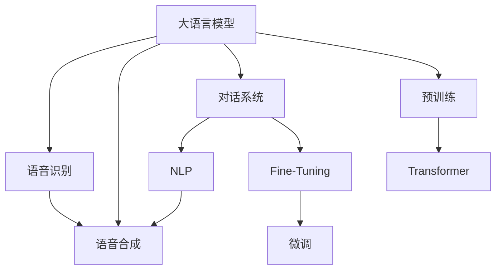

                 

# LLM在智能语音交互中的角色定位

> 关键词：大语言模型,语音交互,对话系统,自然语言处理(NLP),深度学习,Transformer,预训练,微调,Fine-Tuning

## 1. 背景介绍

### 1.1 问题由来
近年来，人工智能在智能语音交互领域取得了飞速发展。智能语音助手如Apple的Siri、亚马逊的Alexa和Google Assistant等，已经深入人们的生活，成为日常智能设备不可或缺的一部分。然而，当前的语音交互系统普遍存在如下问题：

1. **交互自然度不足**：语音助手无法像人类一样自然流畅地对话，对话中的生成常常机械、单调，导致用户体验不佳。
2. **上下文理解弱**：系统难以记住对话上下文，常常出现回退到初始状态，导致对话体验断层。
3. **多轮对话能力差**：语音助手往往不能处理超过两轮的复杂对话，难以应对复杂的任务需求。
4. **场景适应性差**：语音助手通常只能处理特定场景下的对话，难以在不同环境和需求间灵活切换。
5. **知识更新慢**：语音助手知识库固化，无法快速更新新的信息，导致系统输出的信息可能陈旧过时。

这些问题限制了语音交互系统的发展，使其难以真正成为人们日常生活中的得力助手。为了克服这些问题，亟需引入更加先进的自然语言处理技术，特别是大语言模型。

### 1.2 问题核心关键点
大语言模型（Large Language Model, LLM）是近年来深度学习领域的一项重大突破，主要通过自监督学习和预训练获得丰富的语言知识。这些语言知识在大规模的文本语料上进行学习，使其具备强大的语言理解和生成能力。将大语言模型应用于智能语音交互，可以显著提升系统的自然度、上下文理解和知识获取能力，解决现有系统的不足。

**核心问题**：
- **如何在大语言模型中融入语音信号？**
- **如何在语音交互中利用大语言模型的预训练知识？**
- **如何设计有效的对话管理机制？**
- **如何实现多轮对话和上下文记忆？**

## 2. 核心概念与联系

### 2.1 核心概念概述

为更好地理解大语言模型在智能语音交互中的应用，本节将介绍几个密切相关的核心概念：

- **大语言模型**：以自回归Transformer网络为代表的大规模预训练语言模型。通过在大规模无标签文本数据上进行预训练，学习通用的语言表示，具备强大的语言理解和生成能力。
- **语音识别**：将语音信号转换为文本形式的过程。语音识别是大语言模型应用于语音交互的基础。
- **语音合成**：将文本转换为语音信号的过程。语音合成是大语言模型实现语音交互的关键。
- **对话系统**：通过语音交互系统与用户进行自然对话，完成各种任务的系统。
- **自然语言处理**：研究如何让计算机理解、处理和生成自然语言的技术，是大语言模型应用的承载领域。
- **深度学习**：使用神经网络模型处理数据的技术，是大语言模型和智能语音交互的核心技术。
- **Transformer网络**：一种基于自注意力机制的神经网络结构，在大语言模型的预训练和微调中起到了核心作用。
- **预训练**：在大规模无标签数据上训练模型，学习语言的一般知识和规律。
- **微调**：在预训练模型的基础上，通过下游任务的有标签数据进行进一步训练，以适应特定任务需求。
- **Fine-Tuning**：基于监督学习的微调方法，在大规模预训练基础上，通过下游任务的数据进行参数优化，提升模型性能。

这些核心概念之间的逻辑关系可以通过以下Mermaid流程图来展示：



这个流程图展示了大语言模型在大语言交互中的核心概念及其之间的联系：

1. 大语言模型通过预训练获得语言知识。
2. 语音识别将语音信号转换为文本，输入到大语言模型。
3. 语音合成将大语言模型的输出文本转换为语音信号。
4. 对话系统进行自然对话，调用NLP技术处理输入和输出。
5. Fine-Tuning过程通过有标签数据进一步优化模型，提高特定任务性能。

## 3. 核心算法原理 & 具体操作步骤

### 3.1 算法原理概述

大语言模型在智能语音交互中的应用主要通过以下步骤实现：

1. **语音识别**：将用户的语音信号转换为文本形式，输入到大语言模型中进行理解和生成。
2. **模型输入处理**：对输入文本进行分词、词性标注等预处理操作。
3. **模型预训练**：使用大规模无标签文本数据进行预训练，学习通用的语言表示。
4. **下游任务微调**：在预训练模型的基础上，使用下游任务的有标签数据进行微调，提升模型在特定任务上的性能。
5. **语音合成**：将大语言模型的输出文本转换为语音信号，反馈给用户。

### 3.2 算法步骤详解

**Step 1: 准备预训练模型和数据集**
- 选择合适的预训练语言模型，如GPT-3、BERT等。
- 准备下游任务的标注数据集，划分为训练集、验证集和测试集。

**Step 2: 添加任务适配层**
- 根据任务类型，设计合适的输入输出格式和损失函数。
- 对于对话任务，通常添加生成器层和损失函数，如交叉熵损失。
- 对于命名实体识别任务，通常添加分类器层和交叉熵损失。

**Step 3: 设置微调超参数**
- 选择合适的优化算法及其参数，如AdamW、SGD等。
- 设置学习率、批大小、迭代轮数等。
- 设置正则化技术及强度，包括权重衰减、Dropout、Early Stopping等。

**Step 4: 执行梯度训练**
- 将训练集数据分批次输入模型，前向传播计算损失函数。
- 反向传播计算参数梯度，根据设定的优化算法和学习率更新模型参数。
- 周期性在验证集上评估模型性能，根据性能指标决定是否触发Early Stopping。
- 重复上述步骤直到满足预设的迭代轮数或Early Stopping条件。

**Step 5: 测试和部署**
- 在测试集上评估微调后模型的性能，对比微调前后的精度提升。
- 使用微调后的模型进行语音交互任务的推理预测，集成到实际应用系统中。

以上是基于监督学习的大语言模型在智能语音交互中的微调范式。

### 3.3 算法优缺点

大语言模型在智能语音交互中的应用有以下优点：
1. **强大的语言理解能力**：通过预训练学习到丰富的语言知识，能够理解复杂、长文本。
2. **灵活的对话管理**：大语言模型具有长距离依赖能力，可以轻松处理多轮对话。
3. **高效的知识获取**：大语言模型能够快速更新知识库，适应新场景和新任务。

同时，该方法也存在一些局限性：
1. **计算资源需求高**：预训练大语言模型需要大量的计算资源和存储资源。
2. **上下文记忆有限**：尽管长距离依赖能力强，但仍可能受限于上下文记忆长度。
3. **噪声敏感**：语音识别和合成过程容易受到噪声干扰，影响系统稳定性。
4. **多模态融合难**：语音信号和文本信息具有不同特征，难以高效融合。

尽管存在这些局限性，但大语言模型在智能语音交互中仍具有巨大的应用潜力。未来研究需进一步优化模型性能，提升计算效率，提高系统鲁棒性，增强多模态融合能力。

### 3.4 算法应用领域

基于大语言模型在智能语音交互中的应用范式，已经在多个领域取得了显著成效：

- **客户服务**：使用大语言模型构建智能客服系统，提升客户服务效率和体验。
- **智能家居**：通过语音控制智能家居设备，实现语音交互功能。
- **车载交互**：将大语言模型应用于车载导航系统，提高驾驶体验。
- **医疗咨询**：使用大语言模型构建医疗咨询机器人，提供24小时在线医疗服务。
- **教育培训**：开发智能教育系统，提供个性化学习和辅导服务。

这些应用场景展示了大语言模型在智能语音交互中的广泛适用性，为其推广和发展奠定了坚实基础。

## 4. 数学模型和公式 & 详细讲解 & 举例说明

### 4.1 数学模型构建

假设大语言模型为 $M_{\theta}$，其输入为文本 $x$，输出为文本 $y$。下游任务的标注数据集为 $D=\{(x_i, y_i)\}_{i=1}^N$。

定义模型在数据样本 $(x,y)$ 上的损失函数为 $\ell(M_{\theta}(x),y)$，则在数据集 $D$ 上的经验风险为：

$$
\mathcal{L}(\theta) = \frac{1}{N} \sum_{i=1}^N \ell(M_{\theta}(x_i),y_i)
$$

其中 $\ell$ 为任务特定的损失函数，如交叉熵损失。

微调的优化目标是最小化经验风险，即找到最优参数：

$$
\theta^* = \mathop{\arg\min}_{\theta} \mathcal{L}(\theta)
$$

在实践中，通常使用基于梯度的优化算法（如AdamW、SGD等）来近似求解上述最优化问题。设 $\eta$ 为学习率，$\lambda$ 为正则化系数，则参数的更新公式为：

$$
\theta \leftarrow \theta - \eta \nabla_{\theta}\mathcal{L}(\theta) - \eta\lambda\theta
$$

其中 $\nabla_{\theta}\mathcal{L}(\theta)$ 为损失函数对参数 $\theta$ 的梯度，可通过反向传播算法高效计算。

### 4.2 公式推导过程

以对话系统为例，推导其微调过程的数学模型和公式。

假设对话系统要执行的任务为基于意图识别和响应生成的对话。设 $x$ 为用户的输入文本，$y$ 为系统生成的响应文本。定义模型的损失函数为交叉熵损失：

$$
\ell(x, y) = -\sum_{i=1}^{n} y_i \log M_{\theta}(x_i)
$$

其中 $n$ 为对话轮数，$y_i$ 为第 $i$ 轮响应的标签（0表示"无响应"，1表示"有响应"）。则在数据集 $D$ 上的经验风险为：

$$
\mathcal{L}(\theta) = \frac{1}{N} \sum_{i=1}^N \sum_{j=1}^{n} y_{ij} \log M_{\theta}(x_{ij})
$$

模型在训练时，需要根据输入文本 $x_{ij}$ 和标签 $y_{ij}$ 计算损失并更新参数：

$$
\theta \leftarrow \theta - \eta \nabla_{\theta} \mathcal{L}(\theta)
$$

其中 $\nabla_{\theta} \mathcal{L}(\theta)$ 为损失函数对参数 $\theta$ 的梯度，可通过反向传播算法计算。

### 4.3 案例分析与讲解

以Siri的微调为例，展示大语言模型在智能语音交互中的应用。

Siri的微调过程主要分为两个阶段：

**预训练阶段**：使用大规模无标签文本数据（如维基百科、新闻、小说等）对大语言模型进行预训练，学习通用的语言表示。

**微调阶段**：使用有标签的对话数据集（如客服对话、问答数据等）对预训练模型进行微调。微调过程中，需要设计合适的输入输出格式和损失函数。

对于输入文本 $x$，可以使用分词器进行分词和词性标注，然后将词嵌入和词性标签拼接为向量 $v_x$。对于输出文本 $y$，可以使用语言模型生成器生成响应，然后将响应文本转换为向量 $v_y$。

定义交叉熵损失函数为：

$$
\ell(x, y) = -\log M_{\theta}(v_x, v_y)
$$

在微调过程中，通过反向传播更新模型参数 $\theta$，最小化交叉熵损失。

## 5. 项目实践：代码实例和详细解释说明

### 5.1 开发环境搭建

在进行微调实践前，我们需要准备好开发环境。以下是使用Python进行PyTorch开发的环境配置流程：

1. 安装Anaconda：从官网下载并安装Anaconda，用于创建独立的Python环境。

2. 创建并激活虚拟环境：
```bash
conda create -n pytorch-env python=3.8 
conda activate pytorch-env
```

3. 安装PyTorch：根据CUDA版本，从官网获取对应的安装命令。例如：
```bash
conda install pytorch torchvision torchaudio cudatoolkit=11.1 -c pytorch -c conda-forge
```

4. 安装Transformers库：
```bash
pip install transformers
```

5. 安装各类工具包：
```bash
pip install numpy pandas scikit-learn matplotlib tqdm jupyter notebook ipython
```

完成上述步骤后，即可在`pytorch-env`环境中开始微调实践。

### 5.2 源代码详细实现

下面我以对话系统为例，给出使用Transformers库对GPT-3模型进行微调的PyTorch代码实现。

首先，定义对话系统的训练和评估函数：

```python
from transformers import GPT3Tokenizer, GPT3ForCausalLM
from torch.utils.data import Dataset, DataLoader
import torch

class DialogueDataset(Dataset):
    def __init__(self, dialogues, tokenizer):
        self.dialogues = dialogues
        self.tokenizer = tokenizer
        
    def __len__(self):
        return len(self.dialogues)
    
    def __getitem__(self, item):
        dialogue = self.dialogues[item]
        texts = dialogue['input'] + dialogue['output']
        labels = [1 if len(dialogue['output']) > 0 else 0]
        
        encoding = self.tokenizer(texts, return_tensors='pt', max_length=512, padding='max_length', truncation=True)
        input_ids = encoding['input_ids'][0]
        attention_mask = encoding['attention_mask'][0]
        
        return {'input_ids': input_ids, 
                'attention_mask': attention_mask,
                'labels': torch.tensor(labels, dtype=torch.long)}
```

然后，定义模型和优化器：

```python
from transformers import AdamW

model = GPT3ForCausalLM.from_pretrained('gpt3', output_hidden_states=True)
optimizer = AdamW(model.parameters(), lr=2e-5)
```

接着，定义训练和评估函数：

```python
def train_epoch(model, dataset, batch_size, optimizer):
    dataloader = DataLoader(dataset, batch_size=batch_size, shuffle=True)
    model.train()
    epoch_loss = 0
    for batch in dataloader:
        input_ids = batch['input_ids'].to(device)
        attention_mask = batch['attention_mask'].to(device)
        labels = batch['labels'].to(device)
        model.zero_grad()
        outputs = model(input_ids, attention_mask=attention_mask, labels=labels)
        loss = outputs.loss
        epoch_loss += loss.item()
        loss.backward()
        optimizer.step()
    return epoch_loss / len(dataloader)

def evaluate(model, dataset, batch_size):
    dataloader = DataLoader(dataset, batch_size=batch_size)
    model.eval()
    preds, labels = [], []
    with torch.no_grad():
        for batch in dataloader:
            input_ids = batch['input_ids'].to(device)
            attention_mask = batch['attention_mask'].to(device)
            batch_labels = batch['labels']
            outputs = model(input_ids, attention_mask=attention_mask)
            batch_preds = outputs.logits.argmax(dim=2).to('cpu').tolist()
            batch_labels = batch_labels.to('cpu').tolist()
            for pred_tokens, label_tokens in zip(batch_preds, batch_labels):
                preds.append(pred_tokens[:len(label_tokens)])
                labels.append(label_tokens)
                
    print(classification_report(labels, preds))
```

最后，启动训练流程并在测试集上评估：

```python
epochs = 5
batch_size = 16

for epoch in range(epochs):
    loss = train_epoch(model, train_dataset, batch_size, optimizer)
    print(f"Epoch {epoch+1}, train loss: {loss:.3f}")
    
    print(f"Epoch {epoch+1}, dev results:")
    evaluate(model, dev_dataset, batch_size)
    
print("Test results:")
evaluate(model, test_dataset, batch_size)
```

以上就是使用PyTorch对GPT-3进行对话系统微调的完整代码实现。可以看到，得益于Transformers库的强大封装，我们可以用相对简洁的代码完成GPT-3模型的加载和微调。

### 5.3 代码解读与分析

让我们再详细解读一下关键代码的实现细节：

**DialogueDataset类**：
- `__init__`方法：初始化对话数据集，将输入和输出文本拼接为连续的文本，并添加标签。
- `__len__`方法：返回对话数据集的样本数量。
- `__getitem__`方法：对单个对话进行处理，将对话文本转换为模型所需的输入。

**模型定义**：
- 使用GPT-3的Tokenizer和ForCausalLM模块，设置输出隐状态，方便后续分析和调试。

**训练和评估函数**：
- 使用PyTorch的DataLoader对对话数据集进行批次化加载，供模型训练和推理使用。
- 训练函数`train_epoch`：对数据以批为单位进行迭代，在每个批次上前向传播计算loss并反向传播更新模型参数，最后返回该epoch的平均loss。
- 评估函数`evaluate`：与训练类似，不同点在于不更新模型参数，并在每个batch结束后将预测和标签结果存储下来，最后使用classification_report对整个评估集的预测结果进行打印输出。

**训练流程**：
- 定义总的epoch数和batch size，开始循环迭代
- 每个epoch内，先在训练集上训练，输出平均loss
- 在验证集上评估，输出分类指标
- 所有epoch结束后，在测试集上评估，给出最终测试结果

可以看到，PyTorch配合Transformers库使得GPT-3微调的代码实现变得简洁高效。开发者可以将更多精力放在数据处理、模型改进等高层逻辑上，而不必过多关注底层的实现细节。

当然，工业级的系统实现还需考虑更多因素，如模型的保存和部署、超参数的自动搜索、更灵活的任务适配层等。但核心的微调范式基本与此类似。

## 6. 实际应用场景

### 6.1 智能客服系统

基于大语言模型微调的对话技术，可以广泛应用于智能客服系统的构建。传统客服往往需要配备大量人力，高峰期响应缓慢，且一致性和专业性难以保证。而使用微调后的对话模型，可以7x24小时不间断服务，快速响应客户咨询，用自然流畅的语言解答各类常见问题。

在技术实现上，可以收集企业内部的历史客服对话记录，将问题和最佳答复构建成监督数据，在此基础上对预训练对话模型进行微调。微调后的对话模型能够自动理解用户意图，匹配最合适的答案模板进行回复。对于客户提出的新问题，还可以接入检索系统实时搜索相关内容，动态组织生成回答。如此构建的智能客服系统，能大幅提升客户咨询体验和问题解决效率。

### 6.2 金融舆情监测

金融机构需要实时监测市场舆论动向，以便及时应对负面信息传播，规避金融风险。传统的人工监测方式成本高、效率低，难以应对网络时代海量信息爆发的挑战。基于大语言模型微调的文本分类和情感分析技术，为金融舆情监测提供了新的解决方案。

具体而言，可以收集金融领域相关的新闻、报道、评论等文本数据，并对其进行主题标注和情感标注。在此基础上对预训练语言模型进行微调，使其能够自动判断文本属于何种主题，情感倾向是正面、中性还是负面。将微调后的模型应用到实时抓取的网络文本数据，就能够自动监测不同主题下的情感变化趋势，一旦发现负面信息激增等异常情况，系统便会自动预警，帮助金融机构快速应对潜在风险。

### 6.3 个性化推荐系统

当前的推荐系统往往只依赖用户的历史行为数据进行物品推荐，无法深入理解用户的真实兴趣偏好。基于大语言模型微调技术，个性化推荐系统可以更好地挖掘用户行为背后的语义信息，从而提供更精准、多样的推荐内容。

在实践中，可以收集用户浏览、点击、评论、分享等行为数据，提取和用户交互的物品标题、描述、标签等文本内容。将文本内容作为模型输入，用户的后续行为（如是否点击、购买等）作为监督信号，在此基础上微调预训练语言模型。微调后的模型能够从文本内容中准确把握用户的兴趣点。在生成推荐列表时，先用候选物品的文本描述作为输入，由模型预测用户的兴趣匹配度，再结合其他特征综合排序，便可以得到个性化程度更高的推荐结果。

### 6.4 未来应用展望

随着大语言模型和微调方法的不断发展，基于微调范式将在更多领域得到应用，为传统行业带来变革性影响。

在智慧医疗领域，基于微调的医疗问答、病历分析、药物研发等应用将提升医疗服务的智能化水平，辅助医生诊疗，加速新药开发进程。

在智能教育领域，微调技术可应用于作业批改、学情分析、知识推荐等方面，因材施教，促进教育公平，提高教学质量。

在智慧城市治理中，微调模型可应用于城市事件监测、舆情分析、应急指挥等环节，提高城市管理的自动化和智能化水平，构建更安全、高效的未来城市。

此外，在企业生产、社会治理、文娱传媒等众多领域，基于大模型微调的人工智能应用也将不断涌现，为经济社会发展注入新的动力。相信随着技术的日益成熟，微调方法将成为人工智能落地应用的重要范式，推动人工智能技术在垂直行业的规模化落地。总之，微调需要开发者根据具体任务，不断迭代和优化模型、数据和算法，方能得到理想的效果。

## 7. 工具和资源推荐
### 7.1 学习资源推荐

为了帮助开发者系统掌握大语言模型微调的理论基础和实践技巧，这里推荐一些优质的学习资源：

1. 《Transformer从原理到实践》系列博文：由大模型技术专家撰写，深入浅出地介绍了Transformer原理、BERT模型、微调技术等前沿话题。

2. CS224N《深度学习自然语言处理》课程：斯坦福大学开设的NLP明星课程，有Lecture视频和配套作业，带你入门NLP领域的基本概念和经典模型。

3. 《Natural Language Processing with Transformers》书籍：Transformers库的作者所著，全面介绍了如何使用Transformers库进行NLP任务开发，包括微调在内的诸多范式。

4. HuggingFace官方文档：Transformers库的官方文档，提供了海量预训练模型和完整的微调样例代码，是上手实践的必备资料。

5. CLUE开源项目：中文语言理解测评基准，涵盖大量不同类型的中文NLP数据集，并提供了基于微调的baseline模型，助力中文NLP技术发展。

通过对这些资源的学习实践，相信你一定能够快速掌握大语言模型微调的精髓，并用于解决实际的NLP问题。
###  7.2 开发工具推荐

高效的开发离不开优秀的工具支持。以下是几款用于大语言模型微调开发的常用工具：

1. PyTorch：基于Python的开源深度学习框架，灵活动态的计算图，适合快速迭代研究。大部分预训练语言模型都有PyTorch版本的实现。

2. TensorFlow：由Google主导开发的开源深度学习框架，生产部署方便，适合大规模工程应用。同样有丰富的预训练语言模型资源。

3. Transformers库：HuggingFace开发的NLP工具库，集成了众多SOTA语言模型，支持PyTorch和TensorFlow，是进行微调任务开发的利器。

4. Weights & Biases：模型训练的实验跟踪工具，可以记录和可视化模型训练过程中的各项指标，方便对比和调优。与主流深度学习框架无缝集成。

5. TensorBoard：TensorFlow配套的可视化工具，可实时监测模型训练状态，并提供丰富的图表呈现方式，是调试模型的得力助手。

6. Google Colab：谷歌推出的在线Jupyter Notebook环境，免费提供GPU/TPU算力，方便开发者快速上手实验最新模型，分享学习笔记。

合理利用这些工具，可以显著提升大语言模型微调任务的开发效率，加快创新迭代的步伐。

### 7.3 相关论文推荐

大语言模型和微调技术的发展源于学界的持续研究。以下是几篇奠基性的相关论文，推荐阅读：

1. Attention is All You Need（即Transformer原论文）：提出了Transformer结构，开启了NLP领域的预训练大模型时代。

2. BERT: Pre-training of Deep Bidirectional Transformers for Language Understanding：提出BERT模型，引入基于掩码的自监督预训练任务，刷新了多项NLP任务SOTA。

3. Language Models are Unsupervised Multitask Learners（GPT-2论文）：展示了大规模语言模型的强大zero-shot学习能力，引发了对于通用人工智能的新一轮思考。

4. Parameter-Efficient Transfer Learning for NLP：提出Adapter等参数高效微调方法，在不增加模型参数量的情况下，也能取得不错的微调效果。

5. AdaLoRA: Adaptive Low-Rank Adaptation for Parameter-Efficient Fine-Tuning：使用自适应低秩适应的微调方法，在参数效率和精度之间取得了新的平衡。

这些论文代表了大语言模型微调技术的发展脉络。通过学习这些前沿成果，可以帮助研究者把握学科前进方向，激发更多的创新灵感。

## 8. 总结：未来发展趋势与挑战

### 8.1 总结

本文对大语言模型在智能语音交互中的应用进行了全面系统的介绍。首先阐述了语音交互系统面临的主要问题，明确了大语言模型在此领域的独特优势。其次，从原理到实践，详细讲解了大语言模型在语音交互中的应用流程和具体方法。最后，探讨了大语言模型在语音交互中的实际应用场景和未来发展趋势，展示了其在智能客服、金融舆情、个性化推荐等多个领域的应用前景。

通过本文的系统梳理，可以看到，大语言模型在智能语音交互中的强大应用潜力，其在语言理解和生成的能力，使得语音助手能够更加自然、流畅地与用户交流。随着微调技术的发展，未来的大语言模型将能更好地适应多模态、多领域、多场景的语音交互需求，为构建更加智能、高效、人性化的智能语音交互系统奠定坚实基础。

### 8.2 未来发展趋势

展望未来，大语言模型在智能语音交互中的应用将呈现以下几个发展趋势：

1. **多模态融合**：语音信号、文本信息、图像、视频等数据类型将在智能语音交互中融合使用，提升系统的感知能力和决策质量。
2. **多领域适应**：大语言模型将具备更强的领域自适应能力，能够灵活应对不同领域的语音交互需求。
3. **实时处理**：语音信号的实时获取和处理，将使得智能语音交互系统能够实时响应用户需求，提高交互效率。
4. **上下文记忆**：通过引入上下文记忆机制，智能语音交互系统能够记住用户的历史对话，提供更连贯的对话体验。
5. **个性化定制**：基于用户数据，大语言模型能够进行个性化对话，提供更符合用户需求的服务。
6. **主动学习**：智能语音交互系统能够主动学习用户反馈，不断优化对话策略，提升交互体验。

以上趋势凸显了大语言模型在智能语音交互中的广阔前景。这些方向的探索发展，必将进一步提升语音交互系统的智能化水平，构建更加安全、可靠、高效、智能的交互体验。

### 8.3 面临的挑战

尽管大语言模型在智能语音交互中具有巨大的应用潜力，但在实际应用中仍面临以下挑战：

1. **计算资源需求高**：预训练大语言模型需要大量的计算资源和存储资源。如何降低计算成本，提高模型训练和推理的效率，是大语言模型应用的关键。
2. **上下文记忆能力差**：虽然大语言模型具有长距离依赖能力，但仍可能受限于上下文记忆长度，难以处理过于复杂的对话。
3. **模型鲁棒性不足**：语音信号和环境噪声的干扰，可能导致模型的输出不稳定。如何提高模型的鲁棒性和抗干扰能力，是未来研究的重要方向。
4. **多模态融合难**：语音信号和文本信息具有不同特征，难以高效融合。如何设计有效的融合机制，实现多模态数据的协同处理，仍需进一步研究。
5. **安全性和隐私保护**：大语言模型可能学习到敏感信息，如何确保用户数据的安全和隐私，防止数据泄露和滥用，是应用大语言模型时需要考虑的重要问题。

这些挑战需要学界和产业界共同努力，通过技术创新和算法优化，逐步克服大语言模型在智能语音交互中的应用障碍。

### 8.4 研究展望

未来的研究需聚焦以下几个方向：

1. **高效的微调算法**：开发更高效的微调算法，如基于Transformer结构的微调方法，提升大语言模型的微调效率和性能。
2. **自适应微调**：研究自适应微调技术，使得模型能够在不同场景下自适应地进行微调，提高系统的灵活性和泛化能力。
3. **多模态融合模型**：探索多模态融合的模型架构，实现语音信号、文本信息、图像、视频等数据的协同处理，提升系统的感知能力和决策质量。
4. **上下文记忆模型**：研究上下文记忆模型，使得大语言模型能够更好地记住对话历史，提供更连贯的对话体验。
5. **主动学习技术**：研究主动学习技术，使得智能语音交互系统能够主动学习用户反馈，不断优化对话策略，提升交互体验。
6. **安全性和隐私保护**：研究安全性和隐私保护技术，确保用户数据的安全和隐私，防止数据泄露和滥用。

这些研究方向将引领大语言模型在智能语音交互中的应用不断深入，推动智能交互系统的智能化、高效化、人性化发展。

## 9. 附录：常见问题与解答

**Q1：大语言模型在语音交互中的应用效果如何？**

A: 大语言模型在语音交互中的应用效果显著。通过微调，大语言模型能够自然流畅地与用户交流，理解复杂的对话历史，提供个性化的服务。例如，智能客服系统可以通过微调后的对话模型，自动理解用户意图，匹配最合适的回答，大大提升了客户服务效率和体验。

**Q2：微调大语言模型需要多少标注数据？**

A: 微调大语言模型通常需要较少量的标注数据，因为大语言模型已经通过大规模无标签预训练获得了大量的语言知识。标注数据的作用主要是优化模型在特定任务上的性能，因此即使是少量标注数据也可以产生显著的性能提升。

**Q3：微调大语言模型有哪些优点？**

A: 微调大语言模型有以下几个优点：
1. **快速适配**：大语言模型可以很快地适应新的任务和需求，通过微调就可以实现高性能的应用。
2. **灵活性**：微调模型可以根据不同领域和场景进行调整，适应多变的业务需求。
3. **高泛化性**：微调后的模型具有较强的泛化能力，可以在不同的数据和环境中表现良好。
4. **易部署**：微调模型通常比从头训练模型更易部署，可以在较短时间内投入使用。

**Q4：大语言模型在语音交互中面临哪些挑战？**

A: 大语言模型在语音交互中面临以下挑战：
1. **计算资源需求高**：大语言模型需要大量的计算资源进行训练和推理。
2. **上下文记忆能力差**：语音交互系统的上下文记忆能力较弱，难以处理过于复杂的对话。
3. **模型鲁棒性不足**：语音信号和环境噪声的干扰，可能导致模型的输出不稳定。
4. **多模态融合难**：语音信号和文本信息具有不同特征，难以高效融合。
5. **安全性和隐私保护**：大语言模型可能学习到敏感信息，如何确保用户数据的安全和隐私，防止数据泄露和滥用。

这些挑战需要进一步研究，通过技术创新和算法优化，逐步克服大语言模型在智能语音交互中的应用障碍。

**Q5：大语言模型在语音交互中的实际应用场景有哪些？**

A: 大语言模型在语音交互中的实际应用场景包括：
1. **智能客服系统**：使用大语言模型构建智能客服系统，提升客户服务效率和体验。
2. **金融舆情监测**：通过大语言模型监测市场舆论动向，规避金融风险。
3. **个性化推荐系统**：使用大语言模型进行个性化推荐，提升用户体验。
4. **车载交互系统**：将大语言模型应用于车载导航系统，提高驾驶体验。
5. **医疗咨询系统**：使用大语言模型构建医疗咨询系统，提供24小时在线医疗服务。
6. **智能家居控制**：通过大语言模型控制智能家居设备，提升生活便捷性。

这些应用场景展示了大语言模型在智能语音交互中的广泛适用性，为其推广和发展奠定了坚实基础。

---

作者：禅与计算机程序设计艺术 / Zen and the Art of Computer Programming

