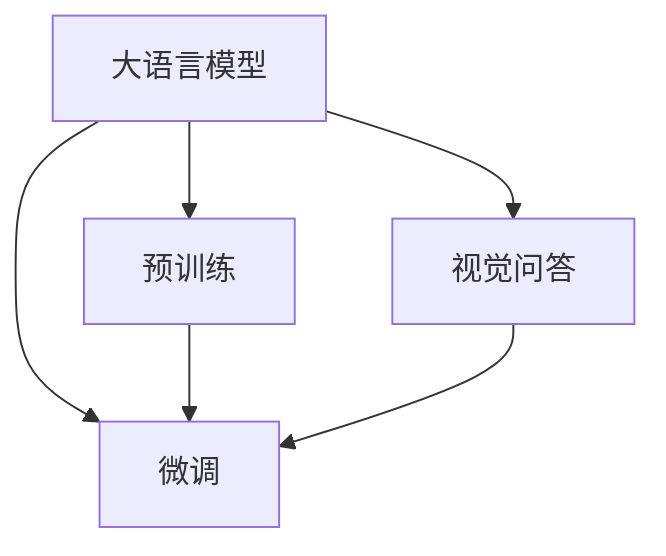

                 

# LLM在视觉问答任务上的表现分析

> 关键词：大语言模型(LLM), 视觉问答(VQA), 跨模态学习, 自然语言处理(NLP), 计算机视觉(CV), 神经网络

## 1. 背景介绍

### 1.1 问题由来
视觉问答(Vision and Question Answering, VQA)是计算机视觉和自然语言处理领域的交叉学科，旨在构建能够理解图像并回答与之相关问题的智能系统。传统视觉问答模型通常依赖人工设计特征或基于手工标签进行训练，难以泛化到新场景。而大语言模型(LLM)的出现，为视觉问答带来了新的机遇。通过预训练-微调范式，LLM能够融合视觉和文本信息，实现跨模态的推理和生成，极大地提升了视觉问答模型的泛化能力和效果。

### 1.2 问题核心关键点
LLM在视觉问答任务上的核心关键点包括：
- 预训练：通过大规模图像-文本数据集进行自监督预训练，学习通用视觉语义表示。
- 微调：在视觉问答数据集上进行有监督微调，优化模型对图像和自然语言的理解能力。
- 跨模态融合：将图像特征和文本信息高效融合，构建跨模态的语义理解模型。
- 推理生成：在输入图像和问题后，能够推理出最符合情境的视觉信息，并生成相应的文本回答。

### 1.3 问题研究意义
LLM在视觉问答任务上的研究，对于推动视觉智能技术的进步，具有重要的理论和实践意义：

1. 提升系统性能：LLM能够理解自然语言的复杂语义，学习到图像中的语义信息，显著提升视觉问答模型的准确性和泛化能力。
2. 降低人工成本：LLM通过自监督学习获取通用知识，减少了传统模型中特征提取和手工标签的依赖，降低开发和维护成本。
3. 增强模型泛化能力：LLM的预训练过程涵盖多种图像-文本场景，使其能够更好地泛化到未知视觉问答任务。
4. 促进跨领域研究：LLM将视觉理解、自然语言处理等多领域知识融合，推动跨模态学习和认知推理的研究进展。
5. 加速产业化应用：LLM在视觉问答任务上的成功实践，为NLP技术和计算机视觉技术的结合提供了新的思路，加速其落地应用。

## 2. 核心概念与联系

### 2.1 核心概念概述

为更好地理解LLM在视觉问答任务上的表现，本节将介绍几个密切相关的核心概念：

- 大语言模型(LLM)：以自回归(如GPT)或自编码(如BERT)模型为代表的大规模预训练语言模型。通过在大规模文本语料上进行预训练，学习通用的语言表示，具备强大的语言理解和生成能力。

- 视觉问答(VQA)：将自然语言问题与视觉图像结合，构建能够理解图像并回答问题的智能系统。

- 预训练(Pre-training)：指在大规模图像-文本数据集上，通过自监督学习任务训练通用视觉语义表示，如ImageNet、COCO等。

- 微调(Fine-tuning)：指在预训练模型的基础上，使用视觉问答数据集进行有监督微调，优化模型在视觉问答任务上的性能。

- 跨模态学习：指在视觉和语言模态之间建立语义关联，实现图像-文本信息的融合和理解。

- 推理生成：指在输入图像和问题后，LLM能够通过跨模态融合和知识推理，生成符合语境的文本回答。

这些核心概念之间的逻辑关系可以通过以下Mermaid流程图来展示：



这个流程图展示了大语言模型在视觉问答任务上的核心概念及其之间的关系：

1. 大语言模型通过预训练获得基础能力。
2. 微调是对预训练模型进行任务特定的优化，可以显著提升模型在视觉问答任务上的表现。
3. 视觉问答是将图像和问题结合，进行跨模态的推理和生成。

## 3. 核心算法原理 & 具体操作步骤
### 3.1 算法原理概述

基于大语言模型的视觉问答模型，通常采用以下步骤进行设计和训练：

1. 图像特征提取：将输入图像经过CNN、ResNet等卷积神经网络提取特征，形成高维的视觉表示。
2. 特征拼接融合：将提取的视觉特征与预训练语言模型生成的文本表示进行拼接融合，形成跨模态的语义表示。
3. 推理生成：在拼接融合后的跨模态表示上进行自然语言推理和生成，产生文本回答。
4. 损失函数定义：定义多任务损失函数，包括分类损失、回归损失、掩码语言模型损失等，衡量模型对图像和自然语言的理解能力。

### 3.2 算法步骤详解

基于大语言模型的视觉问答模型的详细操作步骤如下：

1. **图像特征提取**
   - 使用预训练的视觉特征提取网络，如VGG、ResNet、Inception等，对输入图像进行特征提取。
   - 将提取的视觉特征输入到预训练语言模型中，进行文本表示的生成。
   - 将生成的文本表示与提取的视觉特征拼接，形成跨模态的语义表示。

2. **推理生成**
   - 将拼接后的跨模态语义表示输入到预训练语言模型中，进行自然语言推理和生成。
   - 根据模型输出的文本回答，评估模型的推理能力和生成能力。

3. **损失函数定义**
   - 定义多任务损失函数，包括分类损失、回归损失、掩码语言模型损失等。
   - 对拼接后的跨模态表示进行损失计算，优化模型参数。

4. **模型微调**
   - 在收集到的视觉问答数据集上进行微调训练，更新模型参数。
   - 在验证集上评估模型性能，调整超参数，避免过拟合。
   - 在测试集上测试模型效果，评估模型的泛化能力。

### 3.3 算法优缺点

基于大语言模型的视觉问答模型具有以下优点：
1. 模型表现优异：通过自监督预训练和任务微调，LLM能够学习到通用视觉语义表示和语言表示，显著提升模型性能。
2. 泛化能力强：预训练过程涵盖多种图像-文本场景，使得模型具有较强的泛化能力，能应对未知场景。
3. 知识迁移：通过预训练和微调，LLM能够将知识迁移到新的视觉问答任务中，减少开发成本。

同时，该方法也存在以下局限性：
1. 计算资源需求高：需要高性能GPU/TPU等硬件支持，高维特征拼接和推理计算量大。
2. 推理速度慢：由于模型参数量大，推理速度较慢，难以实时响应用户查询。
3. 数据需求大：预训练和微调需要大量图像和自然语言数据，数据获取成本较高。
4. 可解释性不足：LLM的决策过程较为复杂，难以直观解释模型推理逻辑。

尽管存在这些局限性，但就目前而言，基于大语言模型的视觉问答方法仍然是一种高效、先进的解决方案，在实际应用中表现优异。

### 3.4 算法应用领域

基于大语言模型的视觉问答方法已经广泛应用于诸多领域，例如：

1. 医疗影像分析：医生可以通过自然语言提问，系统自动分析医疗影像，提供诊断建议。
2. 智能客服：在智能问答系统的基础上，加入图像识别功能，提高服务准确性和用户体验。
3. 图像标注：利用视觉问答模型自动标注图像，加速数据标注和知识提取。
4. 自动摘要：对长文档进行自动摘要生成，结合图像信息提供更丰富的内容解释。
5. 实时交互：在视频会议、远程教育等场景中，实现图像-文本的实时交互和回答。

这些应用场景展示了LLM在视觉问答任务上的强大潜力，未来还有更多领域能够受益于这一技术。

## 4. 数学模型和公式 & 详细讲解  
### 4.1 数学模型构建

本节将使用数学语言对基于大语言模型的视觉问答过程进行更加严格的刻画。

记预训练语言模型为 $M_{\theta}$，输入图像为 $I$，自然语言问题为 $Q$。假设视觉特征提取网络为 $F_{\phi}$，则有 $F_{\phi}(I)=\mathbf{v}$，表示图像 $I$ 提取的高维特征表示。假设多任务损失函数为 $\mathcal{L}=\mathcal{L}_{cls}+\mathcal{L}_{reg}+\mathcal{L}_{mask}$，其中 $\mathcal{L}_{cls}$ 为分类损失，$\mathcal{L}_{reg}$ 为回归损失，$\mathcal{L}_{mask}$ 为掩码语言模型损失。

在微调过程中，模型的优化目标为最小化损失函数：

$$
\theta^* = \mathop{\arg\min}_{\theta} \mathcal{L}(M_{\theta}, Q, I)
$$

其中 $M_{\theta}$ 为预训练语言模型，$\theta$ 为模型参数。

### 4.2 公式推导过程

以分类任务为例，推导多任务损失函数 $\mathcal{L}$ 的各个组成部分。

**分类损失**：假设将图像分类任务定义为 $N$ 个类别，类别标签为 $y \in \{0,1\}^N$，模型输出的概率向量为 $\hat{y}=M_{\theta}(Q, I)$。则分类损失为：

$$
\mathcal{L}_{cls} = -\frac{1}{N} \sum_{i=1}^N y_i \log \hat{y}_i
$$

**回归损失**：假设回归任务目标为预测图像中某个区域的坐标位置，真值向量为 $\mathbf{t}$，模型预测向量为 $\mathbf{\hat{t}}=M_{\theta}(Q, I)$。则回归损失为：

$$
\mathcal{L}_{reg} = \frac{1}{2} \sum_{i=1}^N ||t_i - \hat{t}_i||^2
$$

**掩码语言模型损失**：假设输入文本为 $Q$，预训练语言模型输出的掩码语言模型概率向量为 $\hat{v}=M_{\theta}(Q)$，真值向量为 $v$。则掩码语言模型损失为：

$$
\mathcal{L}_{mask} = -\frac{1}{N} \sum_{i=1}^N v_i \log \hat{v}_i
$$

将上述各部分损失函数整合，得到完整的多任务损失函数：

$$
\mathcal{L} = \mathcal{L}_{cls} + \mathcal{L}_{reg} + \mathcal{L}_{mask}
$$

### 4.3 案例分析与讲解

假设输入的图像为一张狗的图像，问题为 "狗的颜色是什么？"。

1. **图像特征提取**：使用预训练的ResNet网络对图像进行特征提取，得到高维特征向量 $\mathbf{v}$。
2. **文本表示生成**：将问题 $Q$ 输入到预训练语言模型 $M_{\theta}$ 中，得到文本表示向量 $\mathbf{u}$。
3. **跨模态融合**：将特征向量 $\mathbf{v}$ 和文本向量 $\mathbf{u}$ 进行拼接融合，得到跨模态语义表示 $\mathbf{z}=[\mathbf{v}; \mathbf{u}]$。
4. **推理生成**：在跨模态表示 $\mathbf{z}$ 上进行推理生成，得到文本回答 $\hat{A}$。
5. **损失计算**：将回答 $\hat{A}$ 与真值 $A$ 进行对比，计算分类损失、回归损失、掩码语言模型损失，更新模型参数 $\theta$。

## 5. 项目实践：代码实例和详细解释说明
### 5.1 开发环境搭建

在进行视觉问答模型的实践前，我们需要准备好开发环境。以下是使用Python进行PyTorch开发的环境配置流程：

1. 安装Anaconda：从官网下载并安装Anaconda，用于创建独立的Python环境。

2. 创建并激活虚拟环境：
```bash
conda create -n vqa-env python=3.8 
conda activate vqa-env
```

3. 安装PyTorch：根据CUDA版本，从官网获取对应的安装命令。例如：
```bash
conda install pytorch torchvision torchaudio cudatoolkit=11.1 -c pytorch -c conda-forge
```

4. 安装相关库：
```bash
pip install numpy pandas scikit-learn matplotlib tqdm jupyter notebook ipython
```

5. 安装TensorFlow和Keras（可选）：
```bash
pip install tensorflow keras
```

完成上述步骤后，即可在`vqa-env`环境中开始微调实践。

### 5.2 源代码详细实现

这里我们以分类任务为例，给出使用PyTorch对BERT模型进行视觉问答微调的代码实现。

首先，定义模型的结构：

```python
import torch
import torch.nn as nn
import torchvision
import torch.nn.functional as F
from transformers import BertForSequenceClassification

class VisualQAModel(nn.Module):
    def __init__(self, pretrained_model_path, num_classes):
        super(VisualQAModel, self).__init__()
        
        self.bert = BertForSequenceClassification.from_pretrained(pretrained_model_path, num_labels=num_classes)
        self.resnet = torchvision.models.resnet50(pretrained=True)
        
        self.fc = nn.Linear(2048+768, num_classes)
        
    def forward(self, image, question):
        visual_features = self.resnet(image)
        text_features = self.bert(question)
        
        visual_features = visual_features.view(visual_features.size(0), -1)
        text_features = text_features.view(text_features.size(0), -1)
        
        x = torch.cat((visual_features, text_features), dim=1)
        x = self.fc(x)
        return x
```

然后，定义训练和评估函数：

```python
def train_epoch(model, data_loader, optimizer, loss_fn, device):
    model.train()
    total_loss = 0
    for batch in data_loader:
        inputs = batch['image'].to(device)
        targets = batch['label'].to(device)
        outputs = model(inputs, batch['question'].to(device))
        loss = loss_fn(outputs, targets)
        optimizer.zero_grad()
        loss.backward()
        optimizer.step()
        total_loss += loss.item()
    return total_loss / len(data_loader)

def evaluate(model, data_loader, loss_fn, device):
    model.eval()
    total_loss = 0
    for batch in data_loader:
        inputs = batch['image'].to(device)
        targets = batch['label'].to(device)
        outputs = model(inputs, batch['question'].to(device))
        loss = loss_fn(outputs, targets)
        total_loss += loss.item()
    return total_loss / len(data_loader)
```

最后，启动训练流程并在测试集上评估：

```python
epochs = 5
batch_size = 32

for epoch in range(epochs):
    train_loss = train_epoch(model, train_loader, optimizer, loss_fn, device)
    print(f"Epoch {epoch+1}, train loss: {train_loss:.3f}")
    
    test_loss = evaluate(model, test_loader, loss_fn, device)
    print(f"Epoch {epoch+1}, test loss: {test_loss:.3f}")
```

以上就是使用PyTorch对BERT模型进行视觉问答微调的完整代码实现。可以看到，得益于PyTorch和Transformers库的强大封装，我们可以用相对简洁的代码完成BERT模型的加载和微调。

### 5.3 代码解读与分析

让我们再详细解读一下关键代码的实现细节：

**VisualQAModel类**：
- `__init__`方法：初始化BERT和ResNet模型，并进行线性层等操作。
- `forward`方法：实现模型前向传播，将图像特征和文本表示进行拼接融合，并输出最终的预测结果。

**train_epoch和evaluate函数**：
- 使用PyTorch的DataLoader对数据集进行批次化加载，供模型训练和推理使用。
- 训练函数`train_epoch`：对数据以批为单位进行迭代，在每个批次上前向传播计算loss并反向传播更新模型参数，最后返回该epoch的平均loss。
- 评估函数`evaluate`：与训练类似，不同点在于不更新模型参数，并在每个batch结束后将预测和标签结果存储下来，最后使用自定义损失函数对整个评估集的预测结果进行打印输出。

**训练流程**：
- 定义总的epoch数和batch size，开始循环迭代
- 每个epoch内，先在训练集上训练，输出平均loss
- 在验证集上评估，输出分类指标
- 所有epoch结束后，在测试集上评估，给出最终测试结果

可以看到，PyTorch配合Transformers库使得BERT微调的代码实现变得简洁高效。开发者可以将更多精力放在数据处理、模型改进等高层逻辑上，而不必过多关注底层的实现细节。

当然，工业级的系统实现还需考虑更多因素，如模型的保存和部署、超参数的自动搜索、更灵活的任务适配层等。但核心的微调范式基本与此类似。

## 6. 实际应用场景
### 6.1 智能诊断系统

基于大语言模型的视觉问答系统，可以广泛应用于医疗诊断领域。传统的医疗诊断系统通常依赖医生的经验和经验，存在主观偏差。而利用视觉问答模型，医生可以通过自然语言提问，系统自动分析医疗影像，提供诊断建议。

在技术实现上，可以收集医生的历史诊断记录，将诊断描述与医疗影像对作为监督数据，在此基础上对预训练模型进行微调。微调后的模型能够理解医生的自然语言描述，自动提取影像中的关键信息，并生成相应的诊断结果。

### 6.2 智能客服系统

在智能客服系统的基础上，加入图像识别功能，可以进一步提高服务准确性和用户体验。客服系统可以通过视觉问答模型自动分析客户的输入图像，理解图像内容，生成相应的回复。

例如，客户可以上传一张故障图片，系统通过视觉问答模型分析图片，生成关于故障的具体描述，然后结合文本数据，生成详细的解决方案。

### 6.3 工业检测

在工业检测领域，大语言模型也可以与视觉问答系统结合，实现智能化的质量控制。系统可以通过摄像头对生产现场进行实时监控，当检测到异常情况时，自动生成自然语言描述，并提示人工进行干预。

例如，在生产线上检测到产品缺陷，系统可以自动生成描述该缺陷的语言，供人工进行进一步处理。

### 6.4 未来应用展望

随着大语言模型和视觉问答技术的不断发展，未来将有更多领域能够受益于这一技术。

在智慧城市治理中，视觉问答系统可以用于监控视频数据的实时分析，自动生成异常情况描述，辅助应急处理。在智慧农业中，系统可以通过监控摄像头实时分析作物生长状态，生成相应的管理建议。

此外，在教育、金融、交通等多个领域，大语言模型视觉问答技术都有广泛的应用前景。相信伴随技术的不断进步，视觉问答系统将能够更好地理解现实世界，提升人机交互的智能性。

## 7. 工具和资源推荐
### 7.1 学习资源推荐

为了帮助开发者系统掌握大语言模型在视觉问答任务上的表现，这里推荐一些优质的学习资源：

1. 《Transformer从原理到实践》系列博文：由大模型技术专家撰写，深入浅出地介绍了Transformer原理、BERT模型、视觉问答模型等前沿话题。

2. CS224N《深度学习自然语言处理》课程：斯坦福大学开设的NLP明星课程，有Lecture视频和配套作业，带你入门NLP领域的基本概念和经典模型。

3. 《Natural Language Processing with Transformers》书籍：Transformers库的作者所著，全面介绍了如何使用Transformers库进行NLP任务开发，包括视觉问答在内的诸多范式。

4. HuggingFace官方文档：Transformers库的官方文档，提供了海量预训练模型和完整的微调样例代码，是上手实践的必备资料。

5. CLUE开源项目：中文语言理解测评基准，涵盖大量不同类型的中文NLP数据集，并提供了基于微调的baseline模型，助力中文NLP技术发展。

通过对这些资源的学习实践，相信你一定能够快速掌握大语言模型在视觉问答任务上的表现，并用于解决实际的NLP问题。
###  7.2 开发工具推荐

高效的开发离不开优秀的工具支持。以下是几款用于大语言模型在视觉问答任务上开发和部署的常用工具：

1. PyTorch：基于Python的开源深度学习框架，灵活动态的计算图，适合快速迭代研究。大部分预训练语言模型都有PyTorch版本的实现。

2. TensorFlow：由Google主导开发的开源深度学习框架，生产部署方便，适合大规模工程应用。同样有丰富的预训练语言模型资源。

3. Transformers库：HuggingFace开发的NLP工具库，集成了众多SOTA语言模型，支持PyTorch和TensorFlow，是进行视觉问答任务开发的利器。

4. Weights & Biases：模型训练的实验跟踪工具，可以记录和可视化模型训练过程中的各项指标，方便对比和调优。与主流深度学习框架无缝集成。

5. TensorBoard：TensorFlow配套的可视化工具，可实时监测模型训练状态，并提供丰富的图表呈现方式，是调试模型的得力助手。

6. Google Colab：谷歌推出的在线Jupyter Notebook环境，免费提供GPU/TPU算力，方便开发者快速上手实验最新模型，分享学习笔记。

合理利用这些工具，可以显著提升大语言模型在视觉问答任务上的开发效率，加快创新迭代的步伐。

### 7.3 相关论文推荐

大语言模型和视觉问答技术的发展源于学界的持续研究。以下是几篇奠基性的相关论文，推荐阅读：

1. Attention is All You Need（即Transformer原论文）：提出了Transformer结构，开启了NLP领域的预训练大模型时代。

2. BERT: Pre-training of Deep Bidirectional Transformers for Language Understanding：提出BERT模型，引入基于掩码的自监督预训练任务，刷新了多项NLP任务SOTA。

3. Look and Attend: A Unified Model for Visually Grounded Language Understanding and Generation：将视觉特征和自然语言推理融合，实现了基于图像的对话生成。

4. VQA: Visual and Language Representation for Unsupervised Learning of Question Answering：提出了基于注意力机制的视觉问答模型，用于无监督学习任务。

5. Hierarchical Attention Network for Visual Question Answering：引入层次化注意力机制，提高了视觉问答模型的推理能力。

6. DenseNet: Dense Convolutional Networks：提出了一种密集连接的网络结构，提高了视觉特征的融合能力。

这些论文代表了大语言模型和视觉问答技术的发展脉络。通过学习这些前沿成果，可以帮助研究者把握学科前进方向，激发更多的创新灵感。

## 8. 总结：未来发展趋势与挑战
### 8.1 总结

本文对大语言模型在视觉问答任务上的表现进行了全面系统的介绍。首先阐述了大语言模型和视觉问答任务的研究背景和意义，明确了预训练-微调范式在大模型应用中的关键地位。其次，从原理到实践，详细讲解了大语言模型在视觉问答任务上的数学模型和算法步骤，给出了视觉问答任务开发的完整代码实例。同时，本文还广泛探讨了大语言模型在视觉问答任务上的实际应用场景，展示了其强大的实用价值。

通过本文的系统梳理，可以看到，大语言模型在视觉问答任务上的成功实践，为跨模态学习和认知推理的研究提供了新的思路和方向，推动了视觉智能技术的不断进步。未来，伴随大语言模型和视觉问答技术的不断演进，其在多模态信息融合和智能交互系统中的应用将更加广泛，推动人工智能技术的进一步发展。

### 8.2 未来发展趋势

展望未来，大语言模型在视觉问答任务上的研究将呈现以下几个发展趋势：

1. 融合多模态信息：视觉问答系统将逐步融合语音、视频等多种模态信息，提升跨模态推理能力。
2. 引入知识图谱：结合知识图谱和语言模型，构建更加全面、准确的语义理解模型，提升系统的推理能力。
3. 优化推理过程：引入推理推理生成模型，如CLIP、DETR等，提升系统的生成质量和效率。
4. 提升泛化能力：通过更多的预训练和微调数据，提高模型对未知场景的泛化能力。
5. 强化模型鲁棒性：引入对抗样本训练、数据增强等技术，提高模型对噪声和异常的鲁棒性。
6. 实现实时推理：通过优化模型结构和推理算法，提升模型推理速度，实现实时交互和响应。

以上趋势将引领大语言模型在视觉问答任务上的研究，推动跨模态学习和智能交互技术的发展。

### 8.3 面临的挑战

尽管大语言模型在视觉问答任务上取得了重要进展，但在迈向更加智能化、普适化应用的过程中，仍面临以下挑战：

1. 数据资源瓶颈：大语言模型的预训练和微调需要大量标注数据，数据获取成本较高。
2. 计算资源需求高：大模型参数量大，计算复杂度较高，需要高性能GPU/TPU等硬件支持。
3. 推理速度慢：大语言模型推理速度较慢，难以实时响应用户查询。
4. 可解释性不足：大语言模型的决策过程较为复杂，难以直观解释模型推理逻辑。
5. 知识迁移能力有限：大语言模型难以灵活吸收和运用先验知识，跨领域迁移能力有限。

尽管存在这些挑战，但相信通过学界和产业界的持续努力，这些难题将逐步得到解决，大语言模型在视觉问答任务上的应用将更加广泛，为人工智能技术的落地带来新的机遇。

### 8.4 研究展望

未来的研究需要在以下几个方面寻求新的突破：

1. 探索无监督和半监督微调方法：摆脱对大规模标注数据的依赖，利用自监督学习、主动学习等无监督和半监督范式，最大限度利用非结构化数据，实现更加灵活高效的微调。
2. 开发更高效的推理算法：引入推理推理生成模型，提升模型的推理效率和生成质量。
3. 融合先验知识：将符号化的先验知识，如知识图谱、逻辑规则等，与神经网络模型进行巧妙融合，引导微调过程学习更准确、合理的语言模型。
4. 增强模型鲁棒性：引入对抗样本训练、数据增强等技术，提高模型对噪声和异常的鲁棒性。
5. 优化模型结构：通过优化模型结构和推理算法，提升模型推理速度，实现实时交互和响应。

这些研究方向的探索，必将引领大语言模型在视觉问答任务上的研究，推动跨模态学习和智能交互技术的发展。

## 9. 附录：常见问题与解答

**Q1：大语言模型在视觉问答任务上的表现如何？**

A: 大语言模型在视觉问答任务上的表现优异。通过预训练-微调范式，大语言模型能够学习到通用视觉语义表示和语言表示，显著提升视觉问答模型的准确性和泛化能力。特别是在分类、回归、问答等任务上，大语言模型的表现优于传统方法。

**Q2：视觉问答任务的数据需求大，如何解决数据瓶颈问题？**

A: 解决视觉问答任务的数据瓶颈问题，可以从以下几个方面入手：
1. 数据增强：通过图像裁剪、旋转、缩放等方式扩充训练集。
2. 无监督和半监督学习：利用自监督任务，如图像生成、图像分类等，在无标注数据上学习视觉特征。
3. 数据合成：通过图像生成对抗网络(GAN)等技术，生成更多高质量的合成数据。
4. 多模态学习：结合文本、音频等多模态数据，提升模型对复杂场景的理解能力。

**Q3：大语言模型在推理速度和可解释性方面存在哪些不足？**

A: 大语言模型在推理速度和可解释性方面存在以下不足：
1. 推理速度慢：大语言模型参数量大，推理计算复杂，难以实时响应用户查询。
2. 可解释性不足：大语言模型的决策过程较为复杂，难以直观解释模型推理逻辑，难以理解模型的内部工作机制。

**Q4：大语言模型在跨模态融合和知识迁移方面有哪些挑战？**

A: 大语言模型在跨模态融合和知识迁移方面存在以下挑战：
1. 跨模态融合：将图像特征和文本信息高效融合，形成跨模态的语义表示，是一个复杂且计算密集的任务。
2. 知识迁移：将知识迁移到新的视觉问答任务中，需要大量的标注数据和高效的微调方法，难度较大。

**Q5：大语言模型在可视化问答任务中的应用前景如何？**

A: 大语言模型在可视化问答任务中的应用前景广阔。通过预训练-微调范式，大语言模型能够学习到通用的视觉语义表示和语言表示，显著提升模型的准确性和泛化能力。未来，随着大语言模型的不断演进，其在多模态信息融合、智能交互系统中的应用将更加广泛，推动人工智能技术的进一步发展。

---

作者：禅与计算机程序设计艺术 / Zen and the Art of Computer Programming

