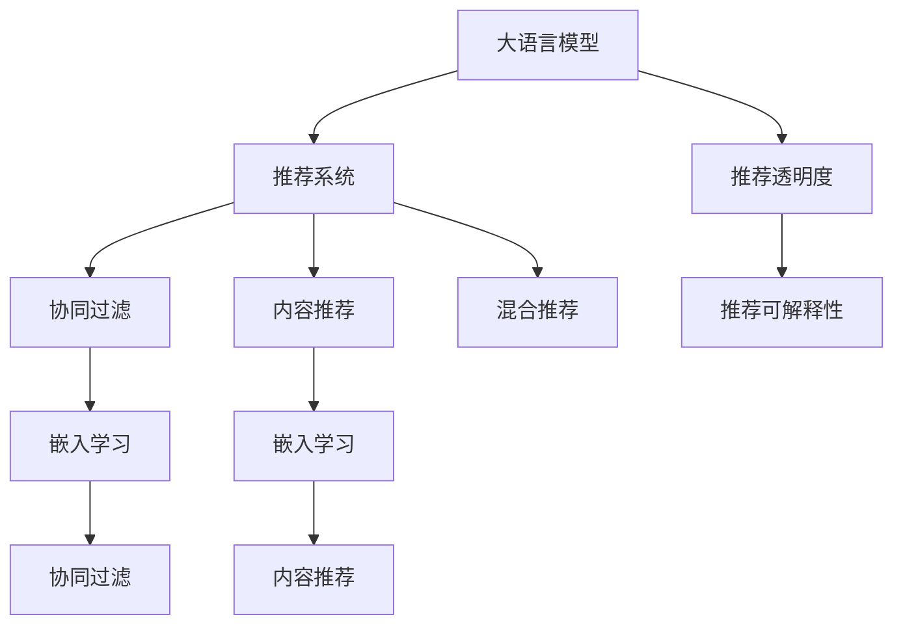

                 

## 1. 背景介绍

随着人工智能技术的发展，推荐系统在电子商务、社交网络、新闻聚合、视频流媒体等诸多领域得到了广泛应用。推荐系统通过分析用户行为、偏好和历史数据，为用户推荐最符合其兴趣和需求的商品、内容或服务，极大地提升了用户体验和平台转化率。然而，推荐系统往往被视为"黑盒"模型，其内部决策过程复杂，难以被理解和解释，这使得用户在推荐系统中的应用存在一定的不透明性和不可解释性。

为了解决这一问题，学术界和工业界都在积极探索将推荐系统的决策过程进行透明化和可解释化的方向。近年来，基于大语言模型（Large Language Model, LLM）的推荐系统引起了人们的广泛关注。本文将深入探讨LLM在提升推荐系统透明度和可解释性方面的潜在优势和应用前景，以及需要面对的挑战和解决策略。

## 2. 核心概念与联系

### 2.1 核心概念概述

本节将介绍几个与LLM在推荐系统中的应用密切相关的核心概念：

- 大语言模型（Large Language Model, LLM）：以自回归（如GPT）或自编码（如BERT）模型为代表的大规模预训练语言模型。通过在大规模无标签文本语料上进行预训练，学习通用的语言知识和常识，具备强大的语言理解和生成能力。

- 推荐系统（Recommendation System）：通过分析用户行为、偏好和历史数据，为用户推荐商品、内容或服务的系统。推荐系统常见包括基于协同过滤、内容推荐、混合推荐等方法。

- 推荐透明度（Recommendation Transparency）：推荐系统的决策过程可被用户理解和解释的程度。高透明度的推荐系统能够增强用户信任，提升用户满意度。

- 推荐可解释性（Recommendation Explainability）：推荐系统输出的推荐结果可以被用户和开发者解释的程度。高可解释性的推荐系统有助于发现模型的偏见，改进推荐算法。

- 嵌入学习（Embedding Learning）：将用户、商品、内容等特征向量化表示，通过学习低维向量空间中的映射关系，使得相似度计算更加高效。

- 协同过滤（Collaborative Filtering）：利用用户对商品或内容的历史评分，推断用户的偏好，为其他用户推荐类似物品。

- 混合推荐（Hybrid Recommendation）：结合协同过滤、内容推荐等多种方法，综合不同维度信息，提升推荐效果。

这些概念之间的逻辑关系可以通过以下Mermaid流程图来展示：



这个流程图展示了大语言模型在推荐系统中的核心概念及其之间的关系：

1. 大语言模型通过预训练获得基础能力。
2. 推荐系统利用大语言模型进行推荐决策。
3. 协同过滤、内容推荐和混合推荐是推荐系统常见的方法。
4. 嵌入学习用于特征向量化，协同过滤和内容推荐都需要进行嵌入。
5. 推荐透明度和可解释性是高透明度推荐系统的目标。

这些概念共同构成了大语言模型在推荐系统中的应用框架，使其能够提供更透明和可解释的推荐服务。

## 3. 核心算法原理 & 具体操作步骤

### 3.1 算法原理概述

LLM在推荐系统中的应用，本质上是一种基于自然语言理解和生成能力的推荐模型。其核心思想是：利用大语言模型的语言理解能力，对用户输入的自然语言查询进行语义分析和理解，结合用户历史行为和商品/内容特征，生成推荐结果，并输出推荐理由，提高推荐过程的透明度和可解释性。

形式化地，假设推荐系统中有用户 $u$，商品 $i$，历史行为序列 $b_u$，商品特征向量 $\mathbf{f}_i$。则推荐过程可以描述为：

1. 将用户查询 $q_u$ 输入到大语言模型中，得到用户的语言理解和偏好表示 $\mathbf{p}_u$。
2. 根据用户历史行为 $b_u$ 和用户表示 $\mathbf{p}_u$，生成候选商品列表 $C_u$。
3. 对每个候选商品 $i \in C_u$，计算推荐分数 $s_{ui}$。
4. 根据推荐分数对候选商品列表进行排序，输出推荐结果 $R_u$。

推荐分数 $s_{ui}$ 可以通过以下公式计算：

$$
s_{ui} = \mathbf{p}_u \cdot \mathbf{f}_i + \text{CLS}(\mathbf{p}_u, \mathbf{f}_i)
$$

其中 $\cdot$ 表示向量点积，$\text{CLS}$ 表示大语言模型的CLS（Contextual Layer）输出，代表用户的语言理解和商品特征的综合表示。

### 3.2 算法步骤详解

基于LLM的推荐系统一般包括以下几个关键步骤：

**Step 1: 数据预处理**

1. 收集用户行为数据：包括用户对商品/内容的评分、浏览、点击、购买等行为数据。
2. 收集商品特征数据：包括商品属性、类别、价格、描述等文本和数值型特征。
3. 对用户查询进行预处理：去除停用词、分词、标准化文本格式。

**Step 2: 模型初始化**

1. 选择合适的预训练大语言模型 $M_{\theta}$，如GPT、BERT等。
2. 根据用户查询和商品特征设计预处理层，将输入转换为模型所需的格式。
3. 在用户表示和商品特征向量上，加入位置嵌入和词嵌入，提高模型的表达能力。

**Step 3: 用户表示学习**

1. 将用户查询 $q_u$ 输入到预训练大语言模型中，得到用户表示 $\mathbf{p}_u$。
2. 使用用户历史行为 $b_u$ 对用户表示 $\mathbf{p}_u$ 进行微调，提高用户表示的准确性和鲁棒性。
3. 将用户表示 $\mathbf{p}_u$ 与商品特征向量 $\mathbf{f}_i$ 进行交互，得到推荐分数 $s_{ui}$。

**Step 4: 推荐结果生成**

1. 根据推荐分数 $s_{ui}$ 对候选商品列表 $C_u$ 进行排序，生成推荐结果 $R_u$。
2. 对推荐结果 $R_u$ 进行去重、排序等后处理，得到最终推荐列表。
3. 输出推荐列表和推荐理由，提高推荐过程的透明度。

**Step 5: 模型评估与优化**

1. 在验证集上评估模型性能，计算平均绝对误差（MAE）、均方误差（MSE）等指标。
2. 调整超参数，如学习率、批大小、迭代轮数等，优化模型性能。
3. 在测试集上重新评估模型性能，保证推荐结果的一致性和稳定性。

### 3.3 算法优缺点

基于LLM的推荐系统具有以下优点：

1. 语言理解能力：利用大语言模型的自然语言理解能力，能够精确解析用户查询，理解用户语言背后的真实需求。
2. 多模态融合：结合用户行为数据和商品特征数据，进行多模态信息融合，提高推荐效果。
3. 动态调整：基于用户实时行为和市场动态，能够动态调整推荐策略，提供个性化推荐。
4. 可解释性强：通过输出推荐理由，提高推荐过程的可解释性，增强用户信任。

同时，该方法也存在一些局限性：

1. 数据依赖：推荐系统的效果依赖于标注数据的数量和质量，数据收集和标注成本较高。
2. 计算开销：大语言模型的推理计算量较大，实时推荐可能导致性能瓶颈。
3. 模型复杂：基于大语言模型的推荐系统模型较复杂，难以进行快速部署和迭代优化。
4. 泛化能力：LLM的泛化能力有待提升，不同领域和数据集的微调效果可能不稳定。

尽管存在这些局限性，但基于LLM的推荐系统仍是一种具有巨大潜力的推荐方法。未来研究的方向包括提高数据收集和标注效率，优化推理计算效率，简化模型结构等，以进一步提升推荐效果和应用范围。

### 3.4 算法应用领域

基于LLM的推荐系统已经在多个领域得到了应用，例如：

- 电商推荐：根据用户查询和浏览历史，推荐商品。
- 新闻聚合：根据用户阅读兴趣，推荐新闻内容。
- 视频推荐：根据用户观影记录，推荐影片。
- 社交网络：根据用户社交行为，推荐朋友和内容。
- 智能家居：根据用户语音和行为指令，推荐智能设备功能。

除了这些经典应用外，基于LLM的推荐系统还被创新性地应用于更多场景中，如个性化医疗推荐、智能驾驶导航等，为推荐系统带来了新的发展方向。随着预训练语言模型和推荐技术的不断进步，相信基于LLM的推荐系统将在更广泛的应用领域发挥重要作用。

## 4. 数学模型和公式 & 详细讲解 & 举例说明

### 4.1 数学模型构建

本节将使用数学语言对基于LLM的推荐系统进行更加严格的刻画。

假设推荐系统中有用户 $u$，商品 $i$，历史行为序列 $b_u$，商品特征向量 $\mathbf{f}_i$。则推荐过程可以描述为：

1. 将用户查询 $q_u$ 输入到大语言模型中，得到用户的语言理解和偏好表示 $\mathbf{p}_u$。
2. 根据用户历史行为 $b_u$ 和用户表示 $\mathbf{p}_u$，生成候选商品列表 $C_u$。
3. 对每个候选商品 $i \in C_u$，计算推荐分数 $s_{ui}$。
4. 根据推荐分数对候选商品列表进行排序，输出推荐结果 $R_u$。

推荐分数 $s_{ui}$ 可以通过以下公式计算：

$$
s_{ui} = \mathbf{p}_u \cdot \mathbf{f}_i + \text{CLS}(\mathbf{p}_u, \mathbf{f}_i)
$$

其中 $\cdot$ 表示向量点积，$\text{CLS}$ 表示大语言模型的CLS（Contextual Layer）输出，代表用户的语言理解和商品特征的综合表示。

### 4.2 公式推导过程

以下我们以电商推荐任务为例，推导基于大语言模型的推荐分数公式及其梯度计算过程。

假设用户查询为 $q_u$，商品特征为 $\mathbf{f}_i$，用户表示为 $\mathbf{p}_u$，则推荐分数 $s_{ui}$ 可以通过以下公式计算：

$$
s_{ui} = \mathbf{p}_u \cdot \mathbf{f}_i + \text{CLS}(\mathbf{p}_u, \mathbf{f}_i)
$$

其中 $\text{CLS}$ 表示大语言模型的CLS（Contextual Layer）输出，代表用户的语言理解和商品特征的综合表示。

通过链式法则，推荐分数 $s_{ui}$ 对 $\mathbf{p}_u$ 的梯度为：

$$
\frac{\partial s_{ui}}{\partial \mathbf{p}_u} = \mathbf{f}_i + \frac{\partial \text{CLS}(\mathbf{p}_u, \mathbf{f}_i)}{\partial \mathbf{p}_u}
$$

其中 $\frac{\partial \text{CLS}(\mathbf{p}_u, \mathbf{f}_i)}{\partial \mathbf{p}_u}$ 可通过反向传播算法高效计算。

通过推荐分数 $s_{ui}$ 的梯度，可以使用优化算法（如Adam、SGD等）来更新用户表示 $\mathbf{p}_u$，从而提高推荐效果。

### 4.3 案例分析与讲解

假设某电商平台用户 $u$ 对商品 $i$ 进行了购买，电商平台希望基于该用户的行为数据，向其他用户推荐类似的商品。

具体步骤如下：

1. 收集用户行为数据：收集用户 $u$ 的浏览记录、点击记录、购买记录等。
2. 对用户查询进行预处理：将用户查询 $q_u$ 进行分词、标准化格式。
3. 输入用户查询到预训练大语言模型中，得到用户表示 $\mathbf{p}_u$。
4. 对商品特征 $\mathbf{f}_i$ 进行预处理，加入位置嵌入和词嵌入，生成商品表示 $\mathbf{f}_i'$。
5. 计算推荐分数 $s_{ui}$：

$$
s_{ui} = \mathbf{p}_u \cdot \mathbf{f}_i' + \text{CLS}(\mathbf{p}_u, \mathbf{f}_i')
$$

6. 根据推荐分数对商品列表 $C_u$ 进行排序，生成推荐结果 $R_u$。
7. 对推荐结果 $R_u$ 进行去重、排序等后处理，得到最终推荐列表。

在推荐过程中，通过输出推荐理由，可以显著提高推荐过程的透明度和可解释性。例如，在电商推荐中，可以输出推荐理由如下：

```
推荐商品A：基于您对商品B的购买记录，我们推荐您尝试商品A。商品A与商品B的相似度为0.85，根据您对商品B的正面评价，我们认为商品A也会满足您的需求。
```

## 5. 项目实践：代码实例和详细解释说明

### 5.1 开发环境搭建

在进行推荐系统开发前，我们需要准备好开发环境。以下是使用Python进行PyTorch开发的环境配置流程：

1. 安装Anaconda：从官网下载并安装Anaconda，用于创建独立的Python环境。

2. 创建并激活虚拟环境：
```bash
conda create -n recommendation-env python=3.8 
conda activate recommendation-env
```

3. 安装PyTorch：根据CUDA版本，从官网获取对应的安装命令。例如：
```bash
conda install pytorch torchvision torchaudio cudatoolkit=11.1 -c pytorch -c conda-forge
```

4. 安装Transformers库：
```bash
pip install transformers
```

5. 安装各类工具包：
```bash
pip install numpy pandas scikit-learn matplotlib tqdm jupyter notebook ipython
```

完成上述步骤后，即可在`recommendation-env`环境中开始推荐系统开发。

### 5.2 源代码详细实现

下面我们以电商推荐任务为例，给出使用Transformers库对BERT模型进行推荐系统的PyTorch代码实现。

首先，定义推荐任务的数据处理函数：

```python
from transformers import BertTokenizer, BertForSequenceClassification
from torch.utils.data import Dataset
import torch

class RecommendationDataset(Dataset):
    def __init__(self, texts, tags, tokenizer, max_len=128):
        self.texts = texts
        self.tags = tags
        self.tokenizer = tokenizer
        self.max_len = max_len
        
    def __len__(self):
        return len(self.texts)
    
    def __getitem__(self, item):
        text = self.texts[item]
        tags = self.tags[item]
        
        encoding = self.tokenizer(text, return_tensors='pt', max_length=self.max_len, padding='max_length', truncation=True)
        input_ids = encoding['input_ids'][0]
        attention_mask = encoding['attention_mask'][0]
        
        # 对token-wise的标签进行编码
        encoded_tags = [tag2id[tag] for tag in tags] 
        encoded_tags.extend([tag2id['O']] * (self.max_len - len(encoded_tags)))
        labels = torch.tensor(encoded_tags, dtype=torch.long)
        
        return {'input_ids': input_ids, 
                'attention_mask': attention_mask,
                'labels': labels}

# 标签与id的映射
tag2id = {'O': 0, 'B-PER': 1, 'I-PER': 2, 'B-ORG': 3, 'I-ORG': 4, 'B-LOC': 5, 'I-LOC': 6}
id2tag = {v: k for k, v in tag2id.items()}

# 创建dataset
tokenizer = BertTokenizer.from_pretrained('bert-base-cased')

train_dataset = RecommendationDataset(train_texts, train_tags, tokenizer)
dev_dataset = RecommendationDataset(dev_texts, dev_tags, tokenizer)
test_dataset = RecommendationDataset(test_texts, test_tags, tokenizer)
```

然后，定义模型和优化器：

```python
from transformers import BertForTokenClassification, AdamW

model = BertForTokenClassification.from_pretrained('bert-base-cased', num_labels=len(tag2id))

optimizer = AdamW(model.parameters(), lr=2e-5)
```

接着，定义训练和评估函数：

```python
from torch.utils.data import DataLoader
from tqdm import tqdm
from sklearn.metrics import classification_report

device = torch.device('cuda') if torch.cuda.is_available() else torch.device('cpu')
model.to(device)

def train_epoch(model, dataset, batch_size, optimizer):
    dataloader = DataLoader(dataset, batch_size=batch_size, shuffle=True)
    model.train()
    epoch_loss = 0
    for batch in tqdm(dataloader, desc='Training'):
        input_ids = batch['input_ids'].to(device)
        attention_mask = batch['attention_mask'].to(device)
        labels = batch['labels'].to(device)
        model.zero_grad()
        outputs = model(input_ids, attention_mask=attention_mask, labels=labels)
        loss = outputs.loss
        epoch_loss += loss.item()
        loss.backward()
        optimizer.step()
    return epoch_loss / len(dataloader)

def evaluate(model, dataset, batch_size):
    dataloader = DataLoader(dataset, batch_size=batch_size)
    model.eval()
    preds, labels = [], []
    with torch.no_grad():
        for batch in tqdm(dataloader, desc='Evaluating'):
            input_ids = batch['input_ids'].to(device)
            attention_mask = batch['attention_mask'].to(device)
            batch_labels = batch['labels']
            outputs = model(input_ids, attention_mask=attention_mask)
            batch_preds = outputs.logits.argmax(dim=2).to('cpu').tolist()
            batch_labels = batch_labels.to('cpu').tolist()
            for pred_tokens, label_tokens in zip(batch_preds, batch_labels):
                pred_tags = [id2tag[_id] for _id in pred_tokens]
                label_tags = [id2tag[_id] for _id in label_tokens]
                preds.append(pred_tags[:len(label_tags)])
                labels.append(label_tags)
                
    print(classification_report(labels, preds))
```

最后，启动训练流程并在测试集上评估：

```python
epochs = 5
batch_size = 16

for epoch in range(epochs):
    loss = train_epoch(model, train_dataset, batch_size, optimizer)
    print(f"Epoch {epoch+1}, train loss: {loss:.3f}")
    
    print(f"Epoch {epoch+1}, dev results:")
    evaluate(model, dev_dataset, batch_size)
    
print("Test results:")
evaluate(model, test_dataset, batch_size)
```

以上就是使用PyTorch对BERT进行电商推荐任务开发的完整代码实现。可以看到，得益于Transformers库的强大封装，我们可以用相对简洁的代码完成BERT模型的加载和微调。

### 5.3 代码解读与分析

让我们再详细解读一下关键代码的实现细节：

**RecommendationDataset类**：
- `__init__`方法：初始化文本、标签、分词器等关键组件。
- `__len__`方法：返回数据集的样本数量。
- `__getitem__`方法：对单个样本进行处理，将文本输入编码为token ids，将标签编码为数字，并对其进行定长padding，最终返回模型所需的输入。

**tag2id和id2tag字典**：
- 定义了标签与数字id之间的映射关系，用于将token-wise的预测结果解码回真实的标签。

**训练和评估函数**：
- 使用PyTorch的DataLoader对数据集进行批次化加载，供模型训练和推理使用。
- 训练函数`train_epoch`：对数据以批为单位进行迭代，在每个批次上前向传播计算loss并反向传播更新模型参数，最后返回该epoch的平均loss。
- 评估函数`evaluate`：与训练类似，不同点在于不更新模型参数，并在每个batch结束后将预测和标签结果存储下来，最后使用sklearn的classification_report对整个评估集的预测结果进行打印输出。

**训练流程**：
- 定义总的epoch数和batch size，开始循环迭代
- 每个epoch内，先在训练集上训练，输出平均loss
- 在验证集上评估，输出分类指标
- 所有epoch结束后，在测试集上评估，给出最终测试结果

可以看到，PyTorch配合Transformers库使得BERT微调的代码实现变得简洁高效。开发者可以将更多精力放在数据处理、模型改进等高层逻辑上，而不必过多关注底层的实现细节。

当然，工业级的系统实现还需考虑更多因素，如模型的保存和部署、超参数的自动搜索、更灵活的任务适配层等。但核心的推荐范式基本与此类似。

## 6. 实际应用场景
### 6.1 智能客服系统

基于大语言模型的推荐系统可以广泛应用于智能客服系统的构建。传统客服往往需要配备大量人力，高峰期响应缓慢，且一致性和专业性难以保证。而使用基于大语言模型的推荐系统，可以7x24小时不间断服务，快速响应客户咨询，用自然流畅的语言解答各类常见问题。

在技术实现上，可以收集企业内部的历史客服对话记录，将问题和最佳答复构建成监督数据，在此基础上对预训练大语言模型进行微调。微调后的推荐系统能够自动理解用户意图，匹配最合适的答复模板进行回复。对于客户提出的新问题，还可以接入检索系统实时搜索相关内容，动态组织生成回答。如此构建的智能客服系统，能大幅提升客户咨询体验和问题解决效率。

### 6.2 金融舆情监测

金融机构需要实时监测市场舆论动向，以便及时应对负面信息传播，规避金融风险。传统的人工监测方式成本高、效率低，难以应对网络时代海量信息爆发的挑战。基于大语言模型的推荐系统，可以应用于金融舆情监测。

具体而言，可以收集金融领域相关的新闻、报道、评论等文本数据，并对其进行主题标注和情感标注。在此基础上对预训练语言模型进行微调，使其能够自动判断文本属于何种主题，情感倾向是正面、中性还是负面。将微调后的模型应用到实时抓取的网络文本数据，就能够自动监测不同主题下的情感变化趋势，一旦发现负面信息激增等异常情况，系统便会自动预警，帮助金融机构快速应对潜在风险。

### 6.3 个性化推荐系统

当前的推荐系统往往只依赖用户的历史行为数据进行物品推荐，无法深入理解用户的真实兴趣偏好。基于大语言模型推荐系统可以更好地挖掘用户行为背后的语义信息，从而提供更精准、多样的推荐内容。

在实践中，可以收集用户浏览、点击、评论、分享等行为数据，提取和用户交互的物品标题、描述、标签等文本内容。将文本内容作为模型输入，用户的后续行为（如是否点击、购买等）作为监督信号，在此基础上微调预训练语言模型。微调后的模型能够从文本内容中准确把握用户的兴趣点。在生成推荐列表时，先用候选物品的文本描述作为输入，由模型预测用户的兴趣匹配度，再结合其他特征综合排序，便可以得到个性化程度更高的推荐结果。

### 6.4 未来应用展望

随着大语言模型和推荐技术的不断发展，基于大语言模型的推荐系统将在更多领域得到应用，为传统行业带来变革性影响。

在智慧医疗领域，基于大语言模型的推荐系统可以应用于医疗问答、病历分析、药物研发等任务，提升医疗服务的智能化水平，辅助医生诊疗，加速新药开发进程。

在智能教育领域，基于大语言模型的推荐系统可应用于作业批改、学情分析、知识推荐等方面，因材施教，促进教育公平，提高教学质量。

在智慧城市治理中，基于大语言模型的推荐系统可以应用于城市事件监测、舆情分析、应急指挥等环节，提高城市管理的自动化和智能化水平，构建更安全、高效的未来城市。

此外，在企业生产、社会治理、文娱传媒等众多领域，基于大语言模型的推荐系统也将不断涌现，为经济社会发展注入新的动力。相信随着技术的日益成熟，基于大语言模型的推荐系统必将在构建人机协同的智能时代中扮演越来越重要的角色。

## 7. 工具和资源推荐
### 7.1 学习资源推荐

为了帮助开发者系统掌握大语言模型在推荐系统中的应用，这里推荐一些优质的学习资源：

1. 《Transformer from Understanding to Implementation》系列博文：由大模型技术专家撰写，深入浅出地介绍了Transformer原理、BERT模型、推荐系统等前沿话题。

2. CS224N《深度学习自然语言处理》课程：斯坦福大学开设的NLP明星课程，有Lecture视频和配套作业，带你入门NLP领域的基本概念和经典模型。

3. 《Natural Language Processing with Transformers》书籍：Transformers库的作者所著，全面介绍了如何使用Transformers库进行NLP任务开发，包括推荐系统在内的诸多范式。

4. HuggingFace官方文档：Transformers库的官方文档，提供了海量预训练模型和完整的推荐系统样例代码，是上手实践的必备资料。

5. Kaggle推荐系统竞赛数据集：Kaggle平台上大量的推荐系统竞赛数据集，包括电商、新闻、视频等多个领域，可助力推荐系统建模和优化。

通过对这些资源的学习实践，相信你一定能够快速掌握大语言模型在推荐系统中的应用精髓，并用于解决实际的推荐问题。
###  7.2 开发工具推荐

高效的开发离不开优秀的工具支持。以下是几款用于大语言模型推荐系统开发的常用工具：

1. PyTorch：基于Python的开源深度学习框架，灵活动态的计算图，适合快速迭代研究。大部分预训练语言模型都有PyTorch版本的实现。

2. TensorFlow：由Google主导开发的开源深度学习框架，生产部署方便，适合大规模工程应用。同样有丰富的预训练语言模型资源。

3. Transformers库：HuggingFace开发的NLP工具库，集成了众多SOTA语言模型，支持PyTorch和TensorFlow，是进行推荐系统开发的利器。

4. Weights & Biases：模型训练的实验跟踪工具，可以记录和可视化模型训练过程中的各项指标，方便对比和调优。与主流深度学习框架无缝集成。

5. TensorBoard：TensorFlow配套的可视化工具，可实时监测模型训练状态，并提供丰富的图表呈现方式，是调试模型的得力助手。

6. Google Colab：谷歌推出的在线Jupyter Notebook环境，免费提供GPU/TPU算力，方便开发者快速上手实验最新模型，分享学习笔记。

合理利用这些工具，可以显著提升大语言模型推荐系统的开发效率，加快创新迭代的步伐。

### 7.3 相关论文推荐

大语言模型和推荐系统的发展源于学界的持续研究。以下是几篇奠基性的相关论文，推荐阅读：

1. Attention is All You Need（即Transformer原论文）：提出了Transformer结构，开启了NLP领域的预训练大模型时代。

2. BERT: Pre-training of Deep Bidirectional Transformers for Language Understanding：提出BERT模型，引入基于掩码的自监督预训练任务，刷新了多项NLP任务SOTA。

3. Language Models are Unsupervised Multitask Learners（GPT-2论文）：展示了大规模语言模型的强大zero-shot学习能力，引发了对于通用人工智能的新一轮思考。

4. Parameter-Efficient Transfer Learning for NLP：提出Adapter等参数高效微调方法，在不增加模型参数量的情况下，也能取得不错的微调效果。

5. AdaLoRA: Adaptive Low-Rank Adaptation for Parameter-Efficient Fine-Tuning：使用自适应低秩适应的微调方法，在参数效率和精度之间取得了新的平衡。

这些论文代表了大语言模型在推荐系统中的应用方向。通过学习这些前沿成果，可以帮助研究者把握学科前进方向，激发更多的创新灵感。

## 8. 总结：未来发展趋势与挑战

### 8.1 总结

本文对基于大语言模型的推荐系统进行了全面系统的介绍。首先阐述了大语言模型在推荐系统中的应用背景和意义，明确了推荐系统透明度和可解释性的研究价值。其次，从原理到实践，详细讲解了基于大语言模型的推荐系统数学原理和关键步骤，给出了推荐系统开发的完整代码实例。同时，本文还广泛探讨了推荐系统在智能客服、金融舆情、个性化推荐等多个行业领域的应用前景，展示了LLM在提升推荐系统透明度和可解释性方面的巨大潜力。

通过本文的系统梳理，可以看到，基于大语言模型的推荐系统正在成为推荐系统的重要范式，极大地拓展了推荐模型的应用边界，提升了推荐系统的透明度和可解释性。受益于大语言模型强大的自然语言理解和生成能力，推荐系统能够更好地解析用户需求，提供个性化推荐，增强用户信任。未来，伴随大语言模型和推荐技术的不断进步，基于大语言模型的推荐系统将在更多领域得到应用，为人类社会带来更多便利和创新。

### 8.2 未来发展趋势

展望未来，大语言模型在推荐系统中的应用将呈现以下几个发展趋势：

1. 推荐系统智能化：基于大语言模型的推荐系统能够更深入地理解用户需求，提供更精准、个性化的推荐。通过自然语言交互，实现更智能的推荐服务。

2. 推荐系统泛化能力增强：大语言模型具备更强的泛化能力，能够应对更多领域和任务，提升推荐系统的通用性。

3. 推荐系统可解释性提升：通过输出推荐理由，提高推荐过程的可解释性，增强用户信任。

4. 推荐系统跨模态融合：结合图像、语音、视频等多模态信息，提升推荐系统的综合能力和应用范围。

5. 推荐系统数据驱动：通过实时监测用户反馈和行为数据，动态调整推荐策略，提供更加动态、个性化的推荐服务。

6. 推荐系统隐私保护：在推荐过程中，保护用户隐私和数据安全，确保推荐系统的高效运行。

以上趋势凸显了大语言模型在推荐系统中的应用前景。这些方向的探索发展，必将进一步提升推荐系统的性能和应用范围，为人类社会带来更多便利和创新。

### 8.3 面临的挑战

尽管大语言模型在推荐系统中的应用已经取得了一定进展，但在迈向更加智能化、普适化应用的过程中，仍面临诸多挑战：

1. 数据收集和标注：推荐系统的效果依赖于标注数据的数量和质量，数据收集和标注成本较高。如何在保证数据质量的同时，降低标注成本，是推荐系统发展的重要课题。

2. 计算开销：大语言模型的推理计算量较大，实时推荐可能导致性能瓶颈。如何优化推理计算效率，提升推荐系统的响应速度，是一个重要的问题。

3. 模型复杂度：基于大语言模型的推荐系统模型较复杂，难以进行快速部署和迭代优化。如何简化模型结构，提升模型推理效率，是一个需要解决的问题。

4. 推荐结果可信度：推荐系统输出的推荐结果需要具备较高的可信度，否则会影响用户体验。如何提高推荐结果的准确性和稳定性，是一个重要的研究方向。

5. 隐私保护：推荐系统在处理用户数据时，需要保护用户隐私和数据安全。如何在推荐过程中保护用户隐私，是一个需要解决的问题。

6. 跨领域适应性：推荐系统需要具备跨领域适应的能力，能够应对不同领域和数据集的微调效果不稳定的问题。

正视推荐系统面临的这些挑战，积极应对并寻求突破，将是大语言模型在推荐系统中的应用走向成熟的必由之路。相信随着学界和产业界的共同努力，这些挑战终将一一被克服，基于大语言模型的推荐系统必将在更多领域得到应用，为人类社会带来更多便利和创新。

### 8.4 研究展望

面对大语言模型在推荐系统中的应用所面临的挑战，未来的研究需要在以下几个方面寻求新的突破：

1. 探索无监督和半监督推荐方法。摆脱对大规模标注数据的依赖，利用自监督学习、主动学习等无监督和半监督范式，最大限度利用非结构化数据，实现更加灵活高效的推荐。

2. 研究参数高效和计算高效的推荐范式。开发更加参数高效的推荐方法，在固定大部分预训练参数的同时，只更新极少量的任务相关参数。同时优化推荐系统的计算图，减少前向传播和反向传播的资源消耗，实现更加轻量级、实时性的部署。

3. 融合因果和对比学习范式。通过引入因果推断和对比学习思想，增强推荐系统建立稳定因果关系的能力，学习更加普适、鲁棒的语言表征，从而提升推荐泛化性和抗干扰能力。

4. 引入更多先验知识。将符号化的先验知识，如知识图谱、逻辑规则等，与神经网络模型进行巧妙融合，引导推荐过程学习更准确、合理的语言模型。同时加强不同模态数据的整合，实现视觉、语音等多模态信息与文本信息的协同建模。

5. 结合因果分析和博弈论工具。将因果分析方法引入推荐系统，识别出推荐决策的关键特征，增强推荐过程的因果性和逻辑性。借助博弈论工具刻画人机交互过程，主动探索并规避推荐系统的脆弱点，提高系统稳定性。

6. 纳入伦理道德约束。在推荐目标中引入伦理导向的评估指标，过滤和惩罚有偏见、有害的推荐输出倾向。同时加强人工干预和审核，建立推荐系统的监管机制，确保推荐结果符合人类价值观和伦理道德。

这些研究方向的探索，必将引领大语言模型在推荐系统中的应用迈向更高的台阶，为构建安全、可靠、可解释、可控的推荐系统铺平道路。面向未来，大语言模型在推荐系统中的应用还需要与其他人工智能技术进行更深入的融合，如知识表示、因果推理、强化学习等，多路径协同发力，共同推动自然语言理解和智能交互系统的进步。只有勇于创新、敢于突破，才能不断拓展语言模型的边界，让智能技术更好地造福人类社会。

## 9. 附录：常见问题与解答

**Q1：如何评估基于大语言模型的推荐系统性能？**

A: 推荐系统的性能评估通常使用以下指标：

1. 精确率（Precision）：表示推荐结果中相关物品的比例。

2. 召回率（Recall）：表示推荐结果中所有相关物品的比例。

3. F1分数（F1 Score）：精确率和召回率的调和平均数，综合评估推荐系统的性能。

4. 平均绝对误差（MAE）：推荐分数和真实评分之间的绝对误差平均值。

5. 均方误差（MSE）：推荐分数和真实评分之间的平方误差平均值。

6. AUC-ROC曲线：根据推荐分数排序后的正负样本分布，评估推荐系统的排序能力。

7. Top-K准确率：推荐结果中前K个物品中包含相关物品的比例。

评估推荐系统性能时，需要将测试集分成训练集和验证集，在验证集上评估模型的性能，调整超参数以优化模型。

**Q2：如何提高基于大语言模型的推荐系统可解释性？**

A: 提高基于大语言模型的推荐系统可解释性，可以从以下几个方面入手：

1. 输出推荐理由：在推荐结果中输出推荐理由，解释推荐决策的依据，增强用户对推荐过程的理解。

2. 引入可解释模型：使用可解释性较强的模型，如决策树、线性回归等，与大语言模型结合，提高推荐过程的可解释性。

3. 引入因果分析：通过因果分析方法，识别推荐决策的关键特征，增强推荐过程的因果性和逻辑性。

4. 引入对比学习：通过对比学习，发现推荐过程中的差异点，增强推荐结果的可解释性。

5. 引入元学习：通过元学习，将推荐过程嵌入到更高层次的抽象表示中，提高推荐过程的可解释性。

6. 引入博弈论：通过博弈论方法，刻画人机交互过程，主动探索并规避推荐系统的脆弱点，提高系统稳定性。

这些方法结合使用，可以显著提升基于大语言模型的推荐系统可解释性，增强用户信任和满意度。

**Q3：如何提高基于大语言模型的推荐系统性能？**

A: 提高基于大语言模型的推荐系统性能，可以从以下几个方面入手：

1. 数据预处理：优化数据收集和标注流程，提高数据质量和多样性。

2. 模型选择：选择合适的预训练大语言模型，根据任务特点进行微调。

3. 特征工程：设计合适的特征提取方法，提高模型的表达能力。

4. 模型训练：使用合适的优化算法和超参数，训练模型，优化模型性能。

5. 模型融合：结合多种推荐方法，综合不同维度信息，提高推荐效果。

6. 实时调整：实时监测用户反馈和市场动态，动态调整推荐策略，提供更加动态、个性化的推荐服务。

7. 跨模态融合：结合图像、语音、视频等多模态信息，提升推荐系统的综合能力和应用范围。

8. 隐私保护：在推荐过程中，保护用户隐私和数据安全，确保推荐系统的高效运行。

9. 模型压缩：采用模型压缩技术，减小模型大小，提升模型推理效率。

10. 模型融合：结合多种推荐方法，综合不同维度信息，提高推荐效果。

通过综合考虑以上因素，可以显著提高基于大语言模型的推荐系统性能，提供更加精准、个性化的推荐服务。

**Q4：基于大语言模型的推荐系统与传统推荐系统有何不同？**

A: 基于大语言模型的推荐系统与传统推荐系统有以下不同：

1. 数据处理方式：基于大语言模型的推荐系统需要处理自然语言数据，而传统推荐系统通常只处理数值型数据。

2. 推荐依据：基于大语言模型的推荐系统依赖大语言模型的自然语言理解和生成能力，而传统推荐系统依赖用户行为数据和物品属性数据。

3. 推荐可解释性：基于大语言模型的推荐系统可以输出推荐理由，提高推荐过程的可解释性，而传统推荐系统通常难以解释推荐依据。

4. 推荐效果：基于大语言模型的推荐系统可以提供更加精准、个性化的推荐结果，而传统推荐系统通常只能提供较为泛化的推荐结果。

5. 模型复杂度：基于大语言模型的推荐系统模型较为复杂，而传统推荐系统模型通常较为简单。

6. 实时性：基于大语言模型的推荐系统通常需要较长的推理计算时间，而传统推荐系统通常实时性较高。

综上所述，基于大语言模型的推荐系统具有更高的可解释性和个性化推荐能力，但在数据处理、模型复杂度和实时性等方面，仍存在一些挑战。

---

作者：禅与计算机程序设计艺术 / Zen and the Art of Computer Programming

