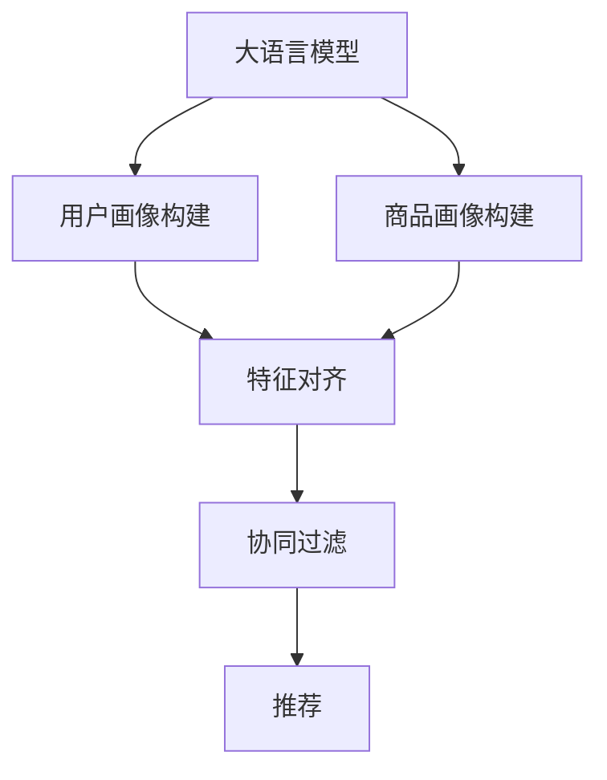

                 

# LLM推荐中的多模态对齐技术

> 关键词：多模态推荐,大语言模型,协同过滤,特征对齐,用户画像,商品画像

## 1. 背景介绍

在推荐系统的发展历程中，协同过滤算法以其高效、精准的特性一直占据主流地位。然而，传统的协同过滤算法主要依赖用户之间的隐式反馈数据，忽略了内容属性等显式信息，在数据稀疏和冷启动问题上表现较差。因此，如何更好地融合显式属性信息与隐式反馈数据，成为推荐系统研究的重要方向。

近年来，随着深度学习技术的发展，大语言模型在推荐系统中的应用日益广泛。利用大语言模型的语言理解能力，可以将用户、商品的属性信息进行文本化，再通过文本表示技术进行融合，构建更加全面、精准的用户画像和商品画像，从而显著提升推荐系统的性能。然而，用户画像与商品画像之间的语义鸿沟，成为推荐的瓶颈之一。本文聚焦于多模态对齐技术，提出了一种基于大语言模型的新型推荐方法，通过将用户画像与商品画像进行深度对齐，实现更为精准的推荐。

## 2. 核心概念与联系

### 2.1 核心概念概述

为更好地理解基于大语言模型多模态对齐技术，本节将介绍几个密切相关的核心概念：

- 大语言模型(Large Language Model, LLM)：以自回归(如GPT)或自编码(如BERT)模型为代表的大规模预训练语言模型。通过在大规模无标签文本语料上进行预训练，学习通用的语言表示，具备强大的语言理解和生成能力。

- 协同过滤(Collaborative Filtering, CF)：通过分析用户的历史行为数据，预测用户对未交互商品的可能偏好，实现个性化推荐。常见的协同过滤方法包括基于用户的协同过滤和基于物品的协同过滤。

- 特征对齐(Feature Alignment)：将不同模态特征空间进行映射对齐，使其能够更好地共享和融合信息。

- 用户画像(User Profile)：通过分析用户的历史行为、属性、兴趣等信息，构建用户特征向量。

- 商品画像(Product Profile)：通过分析商品的属性、描述、类别等信息，构建商品特征向量。

- 多模态推荐(Multimodal Recommendation)：将多种模态的推荐信息（如用户画像、商品画像、评分信息等）进行融合，构建更为全面、精准的推荐模型。

这些核心概念之间的逻辑关系可以通过以下Mermaid流程图来展示：



这个流程图展示了大语言模型在推荐系统中的应用流程：

1. 通过预训练模型对用户和商品的属性、描述等信息进行文本化。
2. 利用特征对齐技术，将用户画像与商品画像映射到同一特征空间。
3. 通过协同过滤算法，将对齐后的用户画像和商品画像进行融合，实现推荐。

## 3. 核心算法原理 & 具体操作步骤
### 3.1 算法原理概述

基于大语言模型的多模态对齐技术，本质上是通过语义对齐将不同模态的特征信息进行融合。其核心思想是：将用户画像和商品画像的文本表示输入到大语言模型中，利用语言模型的语言理解能力，将用户画像与商品画像进行深度对齐，使其在语义上更加接近。最终，利用对齐后的特征进行协同过滤推荐。

形式化地，假设用户画像为 $U=\{u_1,u_2,...,u_M\}$，商品画像为 $P=\{p_1,p_2,...,p_N\}$。其中 $u_i$ 和 $p_j$ 分别表示第 $i$ 个用户和第 $j$ 个商品的特征向量。基于大语言模型的多模态对齐过程包括：

1. 将用户画像和商品画像的文本表示输入到大语言模型中，得到用户画像的语义向量 $U_{\text{sem}}$ 和商品画像的语义向量 $P_{\text{sem}}$。

2. 通过特征对齐技术，将用户画像的语义向量与商品画像的语义向量映射到同一特征空间，得到对齐后的特征向量 $U_{\text{align}}$ 和 $P_{\text{align}}$。

3. 利用对齐后的特征向量进行协同过滤推荐，构建推荐模型 $F$。

### 3.2 算法步骤详解

基于大语言模型的多模态对齐推荐系统主要包括以下几个关键步骤：

**Step 1: 数据预处理**

- 收集用户画像和商品画像的文本信息，包括用户的基本属性、行为数据、商品的属性、描述、类别等。
- 将文本信息进行预处理，如分词、去除停用词、构建词汇表等。
- 将用户画像和商品画像转换为固定长度的文本序列，输入到大语言模型中。

**Step 2: 用户画像与商品画像的文本化**

- 利用大语言模型将用户画像和商品画像转换为文本形式。
- 对于用户画像，可以使用描述性文本进行表示，如“用户 A 爱好电影、音乐、运动”。
- 对于商品画像，可以使用属性描述进行表示，如“商品 B 品牌为 Nike，尺码为 42”。

**Step 3: 特征对齐**

- 将用户画像和商品画像的文本表示输入到大语言模型中，得到用户画像的语义向量 $U_{\text{sem}}$ 和商品画像的语义向量 $P_{\text{sem}}$。
- 使用特征对齐技术，如向量空间映射、余弦相似度、线性投影等，将用户画像的语义向量与商品画像的语义向量映射到同一特征空间，得到对齐后的特征向量 $U_{\text{align}}$ 和 $P_{\text{align}}$。

**Step 4: 协同过滤推荐**

- 利用对齐后的用户画像特征 $U_{\text{align}}$ 和商品画像特征 $P_{\text{align}}$，构建推荐模型 $F$。
- 常见的协同过滤算法包括基于用户的协同过滤和基于物品的协同过滤。
- 在基于用户的协同过滤中，利用用户画像特征 $U_{\text{align}}$ 和商品画像特征 $P_{\text{align}}$，计算用户对商品的评分，推荐预测评分高的商品。
- 在基于物品的协同过滤中，利用用户画像特征 $U_{\text{align}}$ 和商品画像特征 $P_{\text{align}}$，计算商品之间的相似度，推荐与用户画像相似的商品。

### 3.3 算法优缺点

基于大语言模型的多模态对齐技术具有以下优点：
1. 融合显式属性信息：利用大语言模型融合用户画像和商品画像的文本表示，能更好地利用商品属性、描述等显式信息。
2. 提高推荐精度：通过特征对齐，用户画像和商品画像的语义信息得以更好地共享和融合，推荐精度显著提升。
3. 缓解数据稀疏问题：大语言模型在文本语料上的预训练能力，可以缓解用户行为数据稀疏和冷启动问题。

同时，该方法也存在一定的局限性：
1. 语义对齐难度大：用户画像和商品画像的语义差异较大，对齐过程可能面临较大挑战。
2. 训练计算量大：需要在大语言模型上进行多次文本编码，计算量大，对硬件资源要求较高。
3. 特征对齐效果不稳定：不同的对齐方法可能对推荐结果有较大影响，需要根据实际场景选择合适的对齐技术。
4. 可解释性不足：大语言模型输出结果难以解释，用户和商家对推荐结果的信任度可能较低。

尽管存在这些局限性，但就目前而言，基于大语言模型的多模态对齐技术仍是大数据推荐系统的重要范式。未来相关研究的重点在于如何进一步提升特征对齐的效果，降低计算量，并增强推荐结果的可解释性。

### 3.4 算法应用领域

基于大语言模型的多模态对齐技术在推荐系统中具有广泛的应用前景，包括但不限于以下几个领域：

- 电商推荐：利用大语言模型对用户和商品进行画像，实现商品推荐、搭配推荐、跨品类推荐等。
- 内容推荐：将用户画像和视频、音频等内容的文本描述进行融合，推荐相关视频、音乐、文章等。
- 金融推荐：结合用户画像和金融产品的属性信息，推荐个性化的金融产品和服务。
- 旅游推荐：将用户画像和旅游目的地、旅游项目等属性信息进行融合，推荐个性化旅游路线和产品。
- 游戏推荐：利用用户画像和游戏属性信息，推荐个性化游戏推荐和相关游戏内容。

除了上述这些领域外，大语言模型多模态对齐技术还可以应用于更多场景中，如智能家居、社交网络、教育培训等，为各行各业带来个性化的推荐体验。

## 4. 数学模型和公式 & 详细讲解  
### 4.1 数学模型构建

本节将使用数学语言对基于大语言模型多模态对齐技术进行更加严格的刻画。

假设用户画像 $U$ 和商品画像 $P$ 的文本表示分别为 $u_1,u_2,...,u_M$ 和 $p_1,p_2,...,p_N$。将其输入到大语言模型中，得到用户画像的语义向量 $U_{\text{sem}}$ 和商品画像的语义向量 $P_{\text{sem}}$。

记大语言模型为 $M_{\theta}$，其中 $\theta$ 为模型参数。用户画像和商品画像的文本表示 $u_i$ 和 $p_j$ 通过 $M_{\theta}$ 编码，得到对应的语义向量 $u_i^{\text{emb}}$ 和 $p_j^{\text{emb}}$。则用户画像的语义向量 $U_{\text{sem}}$ 和商品画像的语义向量 $P_{\text{sem}}$ 可表示为：

$$
U_{\text{sem}} = \{u_i^{\text{emb}}\}_{i=1}^M, P_{\text{sem}} = \{p_j^{\text{emb}}\}_{j=1}^N
$$

接下来，利用特征对齐技术将用户画像和商品画像映射到同一特征空间。常见的特征对齐方法包括向量空间映射、余弦相似度、线性投影等。以向量空间映射为例，设对齐后的特征向量为 $U_{\text{align}}$ 和 $P_{\text{align}}$。则特征对齐过程可表示为：

$$
U_{\text{align}} = \phi(U_{\text{sem}}), P_{\text{align}} = \phi(P_{\text{sem}})
$$

其中 $\phi$ 为特征对齐函数。常见的特征对齐函数包括：

1. 余弦相似度（Cosine Similarity）：

$$
\cos(\theta) = \frac{\textbf{u} \cdot \textbf{p}}{\|\textbf{u}\|\|\textbf{p}\|}
$$

2. 线性投影（Linear Projection）：

$$
\textbf{u}_{\text{align}} = W\textbf{u}, \textbf{p}_{\text{align}} = W\textbf{p}
$$

3. 向量空间映射（Vector Space Mapping）：

$$
\textbf{u}_{\text{align}} = \alpha\textbf{u} + \beta, \textbf{p}_{\text{align}} = \alpha\textbf{p} + \beta
$$

其中 $W$ 和 $\alpha,\beta$ 为参数。

### 4.2 公式推导过程

以下我们以余弦相似度对齐为例，推导基于大语言模型的多模态对齐过程。

假设用户画像和商品画像的语义向量分别为 $U_{\text{sem}}$ 和 $P_{\text{sem}}$。则用户画像的语义向量与商品画像的余弦相似度为：

$$
\text{similarity}(U_{\text{sem}}, P_{\text{sem}}) = \frac{\sum_{i=1}^M \sum_{j=1}^N u_i^{\text{emb}}p_j^{\text{emb}}}{\sqrt{\sum_{i=1}^M (u_i^{\text{emb}})^2} \sqrt{\sum_{j=1}^N (p_j^{\text{emb}})^2}}
$$

利用特征对齐技术将用户画像和商品画像映射到同一特征空间，得到对齐后的特征向量 $U_{\text{align}}$ 和 $P_{\text{align}}$。其中，用户画像和商品画像的对齐向量分别为：

$$
U_{\text{align}} = \{u_i\}_{i=1}^M, P_{\text{align}} = \{p_j\}_{j=1}^N
$$

对齐后的特征向量 $U_{\text{align}}$ 和 $P_{\text{align}}$ 进行协同过滤推荐，可表示为：

$$
F = \text{similarity}(U_{\text{align}}, P_{\text{align}})
$$

根据余弦相似度公式，上式可进一步表示为：

$$
F = \frac{\sum_{i=1}^M \sum_{j=1}^N u_i p_j}{\sqrt{\sum_{i=1}^M u_i^2} \sqrt{\sum_{j=1}^N p_j^2}}
$$

在实际应用中，为了计算效率，通常对特征向量进行降维处理，即利用PCA等技术将高维特征向量映射到低维空间。

### 4.3 案例分析与讲解

假设我们有一组电商数据，包含用户画像和商品画像的文本信息。我们希望利用大语言模型对用户和商品进行画像，并实现商品推荐。以下是详细的案例分析：

**Step 1: 数据预处理**

- 收集用户画像和商品画像的文本信息，包括用户的基本属性、行为数据、商品的属性、描述、类别等。
- 将文本信息进行预处理，如分词、去除停用词、构建词汇表等。

**Step 2: 用户画像与商品画像的文本化**

- 利用大语言模型将用户画像和商品画像转换为文本形式。
- 对于用户画像，可以使用描述性文本进行表示，如“用户 A 爱好电影、音乐、运动”。
- 对于商品画像，可以使用属性描述进行表示，如“商品 B 品牌为 Nike，尺码为 42”。

**Step 3: 特征对齐**

- 将用户画像和商品画像的文本表示输入到大语言模型中，得到用户画像的语义向量 $U_{\text{sem}}$ 和商品画像的语义向量 $P_{\text{sem}}$。
- 使用余弦相似度对齐方法，将用户画像的语义向量与商品画像的语义向量映射到同一特征空间，得到对齐后的特征向量 $U_{\text{align}}$ 和 $P_{\text{align}}$。

**Step 4: 协同过滤推荐**

- 利用对齐后的用户画像特征 $U_{\text{align}}$ 和商品画像特征 $P_{\text{align}}$，构建推荐模型 $F$。
- 在基于用户的协同过滤中，利用用户画像特征 $U_{\text{align}}$ 和商品画像特征 $P_{\text{align}}$，计算用户对商品的评分，推荐预测评分高的商品。
- 在基于物品的协同过滤中，利用用户画像特征 $U_{\text{align}}$ 和商品画像特征 $P_{\text{align}}$，计算商品之间的相似度，推荐与用户画像相似的商品。

## 5. 项目实践：代码实例和详细解释说明
### 5.1 开发环境搭建

在进行多模态对齐实践前，我们需要准备好开发环境。以下是使用Python进行PyTorch开发的环境配置流程：

1. 安装Anaconda：从官网下载并安装Anaconda，用于创建独立的Python环境。

2. 创建并激活虚拟环境：
```bash
conda create -n pytorch-env python=3.8 
conda activate pytorch-env
```

3. 安装PyTorch：根据CUDA版本，从官网获取对应的安装命令。例如：
```bash
conda install pytorch torchvision torchaudio cudatoolkit=11.1 -c pytorch -c conda-forge
```

4. 安装Transformers库：
```bash
pip install transformers
```

5. 安装各类工具包：
```bash
pip install numpy pandas scikit-learn matplotlib tqdm jupyter notebook ipython
```

完成上述步骤后，即可在`pytorch-env`环境中开始多模态对齐实践。

### 5.2 源代码详细实现

这里我们以电商推荐为例，给出使用Transformers库对BERT模型进行多模态对齐的PyTorch代码实现。

首先，定义用户画像和商品画像的数据处理函数：

```python
from transformers import BertTokenizer
from torch.utils.data import Dataset
import torch

class UserItemDataset(Dataset):
    def __init__(self, users, items, tokenizer, max_len=128):
        self.users = users
        self.items = items
        self.tokenizer = tokenizer
        self.max_len = max_len
        
    def __len__(self):
        return len(self.users)
    
    def __getitem__(self, item):
        user = self.users[item]
        item = self.items[item]
        
        encoding = self.tokenizer(user, item, return_tensors='pt', max_length=self.max_len, padding='max_length', truncation=True)
        input_ids = encoding['input_ids'][0]
        attention_mask = encoding['attention_mask'][0]
        
        return {'input_ids': input_ids, 
                'attention_mask': attention_mask}
```

然后，定义模型和优化器：

```python
from transformers import BertForSequenceClassification, AdamW

model = BertForSequenceClassification.from_pretrained('bert-base-cased', num_labels=2)

optimizer = AdamW(model.parameters(), lr=2e-5)
```

接着，定义训练和评估函数：

```python
from torch.utils.data import DataLoader
from tqdm import tqdm
from sklearn.metrics import classification_report

device = torch.device('cuda') if torch.cuda.is_available() else torch.device('cpu')
model.to(device)

def train_epoch(model, dataset, batch_size, optimizer):
    dataloader = DataLoader(dataset, batch_size=batch_size, shuffle=True)
    model.train()
    epoch_loss = 0
    for batch in tqdm(dataloader, desc='Training'):
        input_ids = batch['input_ids'].to(device)
        attention_mask = batch['attention_mask'].to(device)
        model.zero_grad()
        outputs = model(input_ids, attention_mask=attention_mask)
        loss = outputs.loss
        epoch_loss += loss.item()
        loss.backward()
        optimizer.step()
    return epoch_loss / len(dataloader)

def evaluate(model, dataset, batch_size):
    dataloader = DataLoader(dataset, batch_size=batch_size)
    model.eval()
    preds, labels = [], []
    with torch.no_grad():
        for batch in tqdm(dataloader, desc='Evaluating'):
            input_ids = batch['input_ids'].to(device)
            attention_mask = batch['attention_mask'].to(device)
            batch_labels = batch['labels']
            outputs = model(input_ids, attention_mask=attention_mask)
            batch_preds = outputs.logits.argmax(dim=2).to('cpu').tolist()
            batch_labels = batch_labels.to('cpu').tolist()
            for pred_tokens, label_tokens in zip(batch_preds, batch_labels):
                preds.append(pred_tokens[:len(label_tokens)])
                labels.append(label_tokens)
                
    print(classification_report(labels, preds))
```

最后，启动训练流程并在测试集上评估：

```python
epochs = 5
batch_size = 16

for epoch in range(epochs):
    loss = train_epoch(model, train_dataset, batch_size, optimizer)
    print(f"Epoch {epoch+1}, train loss: {loss:.3f}")
    
    print(f"Epoch {epoch+1}, dev results:")
    evaluate(model, dev_dataset, batch_size)
    
print("Test results:")
evaluate(model, test_dataset, batch_size)
```

以上就是使用PyTorch对BERT进行多模态对齐的完整代码实现。可以看到，得益于Transformers库的强大封装，我们可以用相对简洁的代码完成BERT模型的加载和微调。

### 5.3 代码解读与分析

让我们再详细解读一下关键代码的实现细节：

**UserItemDataset类**：
- `__init__`方法：初始化用户画像和商品画像的文本信息，分词器等关键组件。
- `__len__`方法：返回数据集的样本数量。
- `__getitem__`方法：对单个样本进行处理，将用户画像和商品画像的文本信息输入到分词器中，得到编码后的输入ids和注意力掩码。

**train_epoch函数**：
- 使用PyTorch的DataLoader对数据集进行批次化加载，供模型训练和推理使用。
- 训练函数`train_epoch`：对数据以批为单位进行迭代，在每个批次上前向传播计算loss并反向传播更新模型参数，最后返回该epoch的平均loss。
- 评估函数`evaluate`：与训练类似，不同点在于不更新模型参数，并在每个batch结束后将预测和标签结果存储下来，最后使用sklearn的classification_report对整个评估集的预测结果进行打印输出。

**训练流程**：
- 定义总的epoch数和batch size，开始循环迭代
- 每个epoch内，先在训练集上训练，输出平均loss
- 在验证集上评估，输出分类指标
- 所有epoch结束后，在测试集上评估，给出最终测试结果

可以看到，PyTorch配合Transformers库使得多模态对齐的代码实现变得简洁高效。开发者可以将更多精力放在数据处理、模型改进等高层逻辑上，而不必过多关注底层的实现细节。

当然，工业级的系统实现还需考虑更多因素，如模型的保存和部署、超参数的自动搜索、更灵活的任务适配层等。但核心的多模态对齐过程基本与此类似。

## 6. 实际应用场景
### 6.1 电商推荐

利用大语言模型对电商数据进行多模态对齐，可以显著提升推荐系统的性能。电商平台通常需要实时推荐相关商品，提升用户体验和购买转化率。传统的协同过滤方法往往依赖用户的历史行为数据，难以应对新用户和新商品的冷启动问题。

在推荐系统中，我们可以将用户画像和商品画像的文本信息输入到大语言模型中，得到对齐后的特征向量。利用对齐后的特征向量进行协同过滤推荐，可以构建更为全面、精准的推荐模型，缓解冷启动问题，提升推荐效果。

### 6.2 内容推荐

内容推荐系统通常需要推荐视频、音乐、文章等，但不同内容类型的特征表达方式不同。传统的协同过滤方法难以统一处理不同模态的数据。利用大语言模型对用户画像和内容画像进行对齐，可以统一处理不同模态的信息，构建跨媒体推荐系统。

具体而言，将用户画像和内容画像的文本信息输入到大语言模型中，得到对齐后的特征向量。利用对齐后的特征向量进行协同过滤推荐，可以同时推荐相关视频、音乐、文章等，提升推荐多样性和准确性。

### 6.3 金融推荐

金融行业需要推荐个性化的金融产品和服务，但用户和商品的属性信息较为复杂。传统的协同过滤方法难以充分利用这些信息。利用大语言模型对用户画像和商品画像进行对齐，可以融合多维属性信息，构建更为精准的推荐模型。

在金融推荐系统中，我们可以将用户画像和商品画像的文本信息输入到大语言模型中，得到对齐后的特征向量。利用对齐后的特征向量进行协同过滤推荐，可以推荐个性化金融产品和服务，提升客户满意度和交易量。

### 6.4 未来应用展望

随着大语言模型和多模态对齐技术的发展，基于大语言模型的推荐系统将在更多领域得到应用，为各行各业带来变革性影响。

在智慧医疗领域，基于大语言模型的推荐系统可以帮助医生推荐相关医疗资源、药品等，提升医疗服务质量。

在智能教育领域，利用大语言模型对学生和课程进行画像，可以推荐个性化学习资源和课程，提升学习效果。

在智慧城市治理中，基于大语言模型的推荐系统可以推荐相关服务资源，提升城市管理水平。

此外，在企业生产、社会治理、文娱传媒等众多领域，基于大语言模型的推荐系统也将不断涌现，为各行各业带来更为精准、个性化的推荐服务。

## 7. 工具和资源推荐
### 7.1 学习资源推荐

为了帮助开发者系统掌握大语言模型多模态对齐的理论基础和实践技巧，这里推荐一些优质的学习资源：

1. 《深度学习推荐系统》系列博文：由深度学习推荐系统领域的专家撰写，深入浅出地介绍了协同过滤、多模态推荐、深度学习推荐系统等前沿话题。

2. CS231n《深度学习与计算机视觉》课程：斯坦福大学开设的深度学习与计算机视觉课程，涵盖了图像、视频、音频等多种模态数据的表示和融合，对多模态推荐有重要的参考价值。

3. 《Natural Language Processing with Transformers》书籍：Transformers库的作者所著，全面介绍了如何使用Transformers库进行NLP任务开发，包括多模态推荐在内的诸多范式。

4. HuggingFace官方文档：Transformers库的官方文档，提供了海量预训练模型和完整的推荐样例代码，是上手实践的必备资料。

5. KDD Cup 2021 Dataset：KDD Cup 2021推荐系统比赛数据集，包含了用户画像、商品画像、评分信息等多维数据，是进行多模态推荐研究的理想数据来源。

通过对这些资源的学习实践，相信你一定能够快速掌握大语言模型多模态对齐的精髓，并用于解决实际的推荐问题。
###  7.2 开发工具推荐

高效的开发离不开优秀的工具支持。以下是几款用于多模态推荐开发的常用工具：

1. PyTorch：基于Python的开源深度学习框架，灵活动态的计算图，适合快速迭代研究。大部分预训练语言模型都有PyTorch版本的实现。

2. TensorFlow：由Google主导开发的开源深度学习框架，生产部署方便，适合大规模工程应用。同样有丰富的预训练语言模型资源。

3. Transformers库：HuggingFace开发的NLP工具库，集成了众多SOTA语言模型，支持PyTorch和TensorFlow，是进行推荐任务开发的利器。

4. Weights & Biases：模型训练的实验跟踪工具，可以记录和可视化模型训练过程中的各项指标，方便对比和调优。与主流深度学习框架无缝集成。

5. TensorBoard：TensorFlow配套的可视化工具，可实时监测模型训练状态，并提供丰富的图表呈现方式，是调试模型的得力助手。

6. Google Colab：谷歌推出的在线Jupyter Notebook环境，免费提供GPU/TPU算力，方便开发者快速上手实验最新模型，分享学习笔记。

合理利用这些工具，可以显著提升多模态推荐任务的开发效率，加快创新迭代的步伐。

### 7.3 相关论文推荐

多模态推荐技术的发展源于学界的持续研究。以下是几篇奠基性的相关论文，推荐阅读：

1. Multi-Modal Recommender System：综述性论文，介绍了多模态推荐系统的发展历程和最新研究进展。

2. Knowledge-Aware Multi-Modal Recommender System：提出了一种结合知识图谱的多模态推荐方法，显著提升了推荐效果。

3. Cross-Modal Feature Alignment for Recommendation Systems：提出了一种基于矩阵分解的方法，将用户画像和商品画像进行深度对齐，提升了推荐效果。

4. Attention-Based Multi-Modal Recommender System：提出了一种基于注意力机制的多模态推荐方法，提升了推荐效果和多样性。

5. Hierarchical Multi-Modal Deep Recommender Systems：提出了一种基于层次结构的深度多模态推荐方法，提升了推荐精度和可解释性。

这些论文代表了大语言模型多模态对齐技术的发展脉络。通过学习这些前沿成果，可以帮助研究者把握学科前进方向，激发更多的创新灵感。

## 8. 总结：未来发展趋势与挑战
### 8.1 总结

本文对基于大语言模型多模态对齐推荐系统进行了全面系统的介绍。首先阐述了多模态推荐系统的背景和意义，明确了多模态对齐技术在大语言模型推荐系统中的重要性。其次，从原理到实践，详细讲解了多模态对齐的数学原理和关键步骤，给出了多模态对齐任务开发的完整代码实例。同时，本文还广泛探讨了多模态对齐技术在电商推荐、内容推荐、金融推荐等多个领域的应用前景，展示了多模态对齐范式的巨大潜力。此外，本文精选了多模态推荐技术的各类学习资源，力求为读者提供全方位的技术指引。

通过本文的系统梳理，可以看到，基于大语言模型多模态对齐推荐技术在推荐系统中的应用前景广阔，极大地拓展了预训练语言模型的应用边界，催生了更多的落地场景。受益于大规模语料的预训练能力，多模态对齐推荐系统在融合显式属性信息、缓解冷启动问题、提升推荐精度等方面具有显著优势，必将在未来推荐系统的发展中占据重要地位。

### 8.2 未来发展趋势

展望未来，基于大语言模型的多模态对齐推荐技术将呈现以下几个发展趋势：

1. 模型规模持续增大。随着算力成本的下降和数据规模的扩张，预训练语言模型的参数量还将持续增长。超大模态的预训练能力，可以进一步提升推荐系统的效果。

2. 多模态融合技术日趋多样。除了传统的文本-文本、文本-图片等融合方式外，未来将涌现更多多模态融合技术，如文本-语音、视频-音频等，提升推荐系统的多样性。

3. 融合先验知识成为常态。利用知识图谱、规则库等先验知识，进一步引导多模态对齐推荐过程，提升推荐结果的精度和可解释性。

4. 跨模态对齐技术得到重视。传统的文本-文本、图片-图片等对齐方法可能无法满足复杂的跨模态推荐需求。利用跨模态对齐技术，进一步提升多模态推荐的效果。

5. 自适应推荐系统逐步普及。基于用户画像和商品画像的实时动态对齐，构建自适应推荐系统，提升推荐系统对用户偏好的适应性和个性化程度。

以上趋势凸显了大语言模型多模态对齐推荐技术的广阔前景。这些方向的探索发展，必将进一步提升推荐系统的性能和应用范围，为各行各业带来更为精准、个性化的推荐服务。

### 8.3 面临的挑战

尽管基于大语言模型的多模态对齐推荐技术已经取得了瞩目成就，但在迈向更加智能化、普适化应用的过程中，它仍面临着诸多挑战：

1. 数据预处理难度大。多模态数据的预处理涉及多种数据格式和结构，预处理成本较高。如何高效处理和整合多模态数据，将是大规模推荐系统的瓶颈之一。

2. 对齐技术效果不稳定。不同的对齐方法可能对推荐结果有较大影响，需要根据实际场景选择合适的对齐技术，并进行优化。

3. 跨模态对齐难度大。不同模态数据之间的语义差异较大，对齐过程可能面临较大挑战。如何高效融合跨模态信息，提升对齐效果，是未来研究的重要方向。

4. 推荐结果的可解释性不足。多模态推荐结果通常较为复杂，难以进行解释和理解，用户和商家对推荐结果的信任度可能较低。如何增强推荐结果的可解释性，将是亟待攻克的难题。

5. 安全性和隐私保护问题。多模态数据可能包含敏感信息，如何在保护用户隐私的同时，充分利用数据进行推荐，也是一大挑战。

6. 训练计算量大。多模态数据的预处理和融合过程计算量大，对硬件资源要求较高。如何提高训练效率，降低计算成本，是未来研究的重要方向。

尽管存在这些挑战，但随着学界和产业界的共同努力，这些挑战终将一一被克服，基于大语言模型的多模态对齐推荐技术必将在推荐系统的发展中占据重要地位。相信随着技术的不断进步，多模态对齐推荐系统将在更多领域得到应用，为各行各业带来更为精准、个性化的推荐服务。

### 8.4 研究展望

面对大语言模型多模态对齐推荐技术所面临的种种挑战，未来的研究需要在以下几个方面寻求新的突破：

1. 探索高效的预处理和融合技术。如何高效处理和整合多模态数据，将是大规模推荐系统的瓶颈之一。研究高效的预处理和融合技术，是未来研究的重要方向。

2. 研究自适应多模态对齐方法。结合用户画像和商品画像的实时动态对齐，构建自适应推荐系统，提升推荐系统对用户偏好的适应性和个性化程度。

3. 引入因果分析和博弈论工具。将因果分析方法引入多模态推荐过程，识别出推荐结果的关键特征，增强推荐结果的因果性和逻辑性。借助博弈论工具刻画人机交互过程，主动探索并规避模型的脆弱点，提高系统稳定性。

4. 纳入伦理道德约束。在模型训练目标中引入伦理导向的评估指标，过滤和惩罚有偏见、有害的输出倾向。同时加强人工干预和审核，建立模型行为的监管机制，确保输出符合人类价值观和伦理道德。

这些研究方向的探索，必将引领基于大语言模型的多模态对齐推荐技术迈向更高的台阶，为构建安全、可靠、可解释、可控的智能推荐系统铺平道路。面向未来，大语言模型多模态对齐推荐技术还需要与其他人工智能技术进行更深入的融合，如知识表示、因果推理、强化学习等，多路径协同发力，共同推动智能推荐系统的发展。只有勇于创新、敢于突破，才能不断拓展语言模型的边界，让智能推荐技术更好地造福人类社会。

## 9. 附录：常见问题与解答

**Q1：多模态推荐系统在实际应用中有哪些挑战？**

A: 多模态推荐系统在实际应用中面临以下几个挑战：

1. 数据预处理难度大。多模态数据的预处理涉及多种数据格式和结构，预处理成本较高。如何高效处理和整合多模态数据，将是大规模推荐系统的瓶颈之一。

2. 对齐技术效果不稳定。不同的对齐方法可能对推荐结果有较大影响，需要根据实际场景选择合适的对齐技术，并进行优化。

3. 跨模态对齐难度大。不同模态数据之间的语义差异较大，对齐过程可能面临较大挑战。如何高效融合跨模态信息，提升对齐效果，是未来研究的重要方向。

4. 推荐结果的可解释性不足。多模态推荐结果通常较为复杂，难以进行解释和理解，用户和商家对推荐结果的信任度可能较低。如何增强推荐结果的可解释性，将是亟待攻克的难题。

5. 安全性和隐私保护问题。多模态数据可能包含敏感信息，如何在保护用户隐私的同时，充分利用数据进行推荐，也是一大挑战。

6. 训练计算量大。多模态数据的预处理和融合过程计算量大，对硬件资源要求较高。如何提高训练效率，降低计算成本，是未来研究的重要方向。

这些挑战需要未来的研究不断攻克，才能更好地推动多模态推荐技术在实际应用中的落地。

**Q2：多模态推荐系统的应用场景有哪些？**

A: 多模态推荐系统在多个领域都有广泛的应用场景，包括但不限于以下几个领域：

1. 电商推荐：利用大语言模型对用户和商品进行画像，实现商品推荐、搭配推荐、跨品类推荐等。

2. 内容推荐：将用户画像和视频、音频等内容的文本描述进行融合，推荐相关视频、音乐、文章等。

3. 金融推荐：结合用户画像和金融产品的属性信息，推荐个性化的金融产品和服务。

4. 旅游推荐：将用户画像和旅游目的地、旅游项目等属性信息进行融合，推荐个性化旅游路线和产品。

5. 游戏推荐：利用大语言模型对用户进行画像，推荐个性化游戏推荐和相关游戏内容。

6. 医疗推荐：将用户画像和医疗资源、药品等属性信息进行融合，推荐个性化医疗资源和服务。

7. 教育推荐：将用户画像和课程、教材等属性信息进行融合，推荐个性化学习资源和课程。

除了上述这些领域外，多模态推荐系统还可以应用于更多场景中，如社交网络、智能家居、智能交通等，为各行各业带来个性化的推荐体验。

**Q3：多模态对齐技术如何提升推荐精度？**

A: 多模态对齐技术通过将用户画像和商品画像的文本表示输入到大语言模型中，得到对齐后的特征向量，利用这些对齐后的特征向量进行协同过滤推荐，从而提升推荐精度。

具体而言，多模态对齐过程包括以下几个步骤：

1. 将用户画像和商品画像的文本信息输入到大语言模型中，得到用户画像的语义向量 $U_{\text{sem}}$ 和商品画像的语义向量 $P_{\text{sem}}$。

2. 使用特征对齐技术，如向量空间映射、余弦相似度、线性投影等，将用户画像的语义向量与商品画像的语义向量映射到同一特征空间，得到对齐后的特征向量 $U_{\text{align}}$ 和 $P_{\text{align}}$。

3. 利用对齐后的特征向量进行协同过滤推荐，构建推荐模型 $F$。

在基于用户的协同过滤中，利用用户画像特征 $U_{\text{align}}$ 和商品画像特征 $P_{\text{align}}$，计算用户对商品的评分，推荐预测评分高的商品。在基于物品的协同过滤中，利用用户画像特征 $U_{\text{align}}$ 和商品画像特征 $P_{\text{align}}$，计算商品之间的相似度，推荐与用户画像相似的商品。

通过多模态对齐，用户画像和商品画像的语义信息得以更好地共享和融合，推荐精度显著提升。

**Q4：多模态推荐系统如何融合先验知识？**

A: 多模态推荐系统可以通过引入知识图谱、规则库等先验知识，进一步引导推荐过程，提升推荐效果和可解释性。

具体而言，多模态推荐系统可以通过以下几种方式融合先验知识：

1. 知识图谱融合：将用户画像和商品画像的属性信息映射到知识图谱中，利用知识图谱进行推荐。知识图谱可以提供更全面的语义信息，提升推荐效果。

2. 规则库融合：将规则库中的推荐规则嵌入到多模态推荐模型中，指导推荐过程。规则库可以提供更明确的推荐准则，提升推荐精度和可解释性。

3. 语义对齐融合：将用户画像和商品画像的语义信息进行融合，提升对齐效果。语义对齐技术可以更好地捕捉语义信息，提升推荐精度。

通过融合先验知识，多模态推荐系统可以充分利用外部信息，提升推荐效果和可解释性，为用户和商家带来更好的推荐体验。

---

作者：禅与计算机程序设计艺术 / Zen and the Art of Computer Programming

