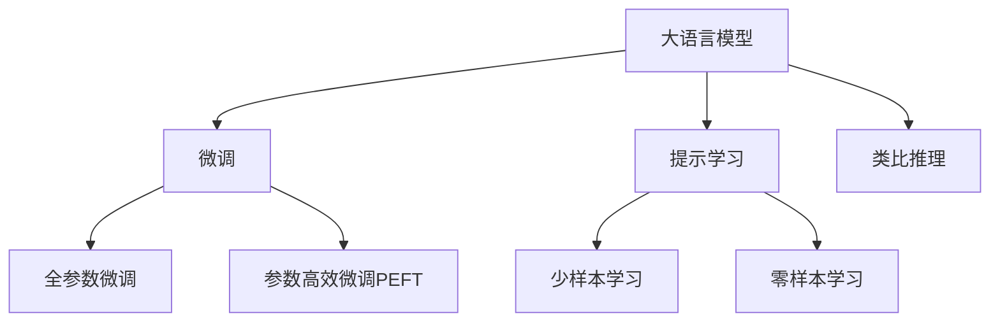

                 

# LLM的analogical reasoning探索

## 1. 背景介绍

### 1.1 问题由来
在自然语言处理(NLP)领域，语言推理任务，尤其是类比推理任务（Analogical Reasoning），长期以来被认为是人类认知能力的重要体现之一。然而，现有的大语言模型（LLMs）虽然在各种语言理解任务上表现出色，但在类比推理上却显得力不从心。尽管一些基于提示学习（Prompt Learning）的方法能够在一定程度上提升模型的类比推理能力，但依然无法满足实际应用的高要求。

### 1.2 问题核心关键点
实现大语言模型的类比推理能力，是当前NLP研究的热点之一。类比推理要求模型不仅要理解字面意思，还要具备深入的语义理解能力，能够识别出不同概念之间的相似性和差异性，并进行逻辑推理。该问题包括以下几个核心关键点：
- 语言模型的语义理解能力
- 类比推理的逻辑推理机制
- 提示学习的模板设计
- 模型的参数高效性

这些关键点共同构成了对大语言模型进行类比推理优化的研究重点。

### 1.3 问题研究意义
探索和提升大语言模型的类比推理能力，对于构建智能问答系统、逻辑推理机器、知识图谱构建等多个领域具有重要意义：

1. **智能问答系统**：提升系统对复杂问题、多步骤推理问题的处理能力，增强用户交互的自然性和智能性。
2. **逻辑推理机器**：构建具备深度逻辑推理能力的机器，用于辅助决策、优化算法、自动化设计等多个场景。
3. **知识图谱构建**：利用类比推理能力，自动生成和修正知识图谱，构建更加全面、准确的知识库。

## 2. 核心概念与联系

### 2.1 核心概念概述

在探索大语言模型的类比推理能力时，需要深入理解以下几个关键概念：

- **大语言模型 (LLM)**：指通过预训练和微调得到的具备强大语言理解和生成能力的模型，如GPT、BERT等。
- **类比推理 (Analogical Reasoning)**：指通过识别不同概念之间的相似性和差异性，进行逻辑推理得出结论的过程，常见于类比推理题（如“警察：逮捕::法官：判决”）。
- **提示学习 (Prompt Learning)**：通过在输入文本中添加特定格式的提示模板，引导模型生成目标输出，实现零样本或少样本学习。
- **参数高效微调 (PEFT, Parameter-Efficient Fine-Tuning)**：指在微调过程中，只更新少量的模型参数，而固定大部分预训练权重不变，以提高微调效率和效果。

这些概念之间的逻辑关系可以通过以下Mermaid流程图来展示：



这个流程图展示了从预训练大语言模型到微调、提示学习，再到类比推理的基本流程，以及参数高效微调的重要作用。

## 3. 核心算法原理 & 具体操作步骤
### 3.1 算法原理概述

大语言模型的类比推理能力可以通过以下基本原理来实现：

1. **预训练语料**：在大型语料库上对大语言模型进行预训练，使其具备丰富的语言知识和语义理解能力。
2. **微调**：在特定任务的数据集上对预训练模型进行微调，使其适应特定任务的需求。
3. **提示学习**：通过精心设计的提示模板，引导模型进行类比推理，提升模型在少样本或无样本情况下的推理能力。
4. **参数高效微调**：在微调过程中，只更新少量的模型参数，以提高微调效率和模型的泛化能力。

### 3.2 算法步骤详解

以下是大语言模型类比推理的详细操作步骤：

**Step 1: 准备预训练模型和数据集**
- 选择合适的预训练语言模型 $M_{\theta}$ 作为初始化参数，如 BERT、GPT 等。
- 准备类比推理任务的数据集，一般包含大量成对的类比推理对，如“警察：逮捕::法官：判决”。

**Step 2: 添加推理目标函数**
- 设计合适的推理目标函数，如交叉熵损失、均方误差损失等，用于衡量模型预测输出与真实推理结果之间的差异。
- 对于多步骤推理任务，可以设计多层推理目标函数，逐步逼近最终推理结果。

**Step 3: 设置微调超参数**
- 选择合适的优化算法及其参数，如 AdamW、SGD 等，设置学习率、批大小、迭代轮数等。
- 设置正则化技术及强度，包括权重衰减、Dropout、Early Stopping等。
- 确定冻结预训练参数的策略，如仅微调顶层，或全部参数都参与微调。

**Step 4: 执行推理训练**
- 将推理数据集分批次输入模型，前向传播计算推理目标函数。
- 反向传播计算参数梯度，根据设定的优化算法和学习率更新模型参数。
- 周期性在验证集上评估模型性能，根据性能指标决定是否触发 Early Stopping。
- 重复上述步骤直至满足预设的迭代轮数或 Early Stopping 条件。

**Step 5: 推理和测试**
- 在测试集上评估微调后模型 $M_{\hat{\theta}}$ 的推理性能，对比微调前后的推理效果提升。
- 使用微调后的模型对新推理问题进行推理预测，集成到实际的应用系统中。

### 3.3 算法优缺点

大语言模型的类比推理方法具有以下优点：
1. **高效性**：通过微调和提示学习，可以在少量数据集上快速获得高效的推理模型。
2. **泛化能力强**：大语言模型具备强大的语义理解能力，能够处理多种类型的类比推理任务。
3. **应用广泛**：类比推理广泛应用于知识图谱构建、逻辑推理、智能问答等多个领域，具有广泛的适用性。

同时，该方法也存在一定的局限性：
1. **依赖提示设计**：提示模板的设计需要经验和专业知识，存在设计难度。
2. **推理过程复杂**：多步骤推理任务可能需要设计多层推理目标函数，推理过程复杂。
3. **泛化风险**：模型对特定任务或领域的泛化能力有限，可能存在推理偏差。

尽管存在这些局限性，但就目前而言，基于提示学习的大语言模型类比推理方法仍是大规模推理任务的重要范式。未来相关研究的重点在于如何进一步优化提示模板设计，提高模型推理的自动化和智能化程度，同时兼顾模型复杂度和推理效果。

### 3.4 算法应用领域

大语言模型的类比推理方法在多个领域都有广泛应用：

- **知识图谱构建**：通过类比推理识别实体之间的关系，自动生成和修正知识图谱。
- **逻辑推理机器**：用于辅助决策、优化算法、自动化设计等多个场景，提升系统的逻辑推理能力。
- **智能问答系统**：提升系统对复杂问题、多步骤推理问题的处理能力，增强用户交互的自然性和智能性。
- **多模态推理**：结合视觉、听觉等多模态信息，进行更全面、准确的类比推理。

除了上述这些经典应用外，类比推理技术还将被创新性地应用于更多场景中，如可控文本生成、常识推理、自动编程等，为NLP技术带来全新的突破。

## 4. 数学模型和公式 & 详细讲解  
### 4.1 数学模型构建

假设类比推理任务的数据集为 $\mathcal{D} = \{(\text{premise}_i, \text{hypothesis}_i)\}_{i=1}^N$，其中 $\text{premise}_i$ 为前提，$\text{hypothesis}_i$ 为假设。模型的推理目标是预测 $\text{hypothesis}_i$ 是否与 $\text{premise}_i$ 相符。

定义模型 $M_{\theta}$ 在前提 $\text{premise}_i$ 和假设 $\text{hypothesis}_i$ 上的推理输出为 $\text{score}_{i,j} = M_{\theta}(\text{premise}_i, \text{hypothesis}_i)$，其中 $j$ 表示模型输出 $\text{score}_{i,j}$ 表示假设 $\text{hypothesis}_i$ 与前提 $\text{premise}_i$ 的匹配程度。

定义二元交叉熵损失函数为：

$$
\mathcal{L}(\theta) = -\frac{1}{N} \sum_{i=1}^N \left[ y_i \log \text{score}_{i,1} + (1-y_i) \log \text{score}_{i,0} \right]
$$

其中 $y_i \in \{0, 1\}$ 表示 $\text{hypothesis}_i$ 是否与 $\text{premise}_i$ 相符。

### 4.2 公式推导过程

在推理训练过程中，模型的输出 $\text{score}_{i,j}$ 可以通过神经网络模型进行计算，具体公式为：

$$
\text{score}_{i,j} = \mathcal{M}(\text{premise}_i, \text{hypothesis}_i)
$$

其中 $\mathcal{M}$ 为神经网络模型，可以是RNN、CNN、Transformer等。以Transformer模型为例，推理训练的公式推导如下：

1. 首先，将前提 $\text{premise}_i$ 和假设 $\text{hypothesis}_i$ 输入到Transformer模型中，得到模型输出 $h_i$。
2. 然后，将 $h_i$ 输入到一个全连接层，输出 $\text{score}_{i,j}$。
3. 最终，使用二元交叉熵损失函数进行模型训练。

具体步骤如下：

$$
h_i = \mathcal{M}(\text{premise}_i, \text{hypothesis}_i)
$$

$$
\text{score}_{i,j} = \text{W} \cdot h_i + b
$$

$$
\mathcal{L}(\theta) = -\frac{1}{N} \sum_{i=1}^N \left[ y_i \log \text{score}_{i,1} + (1-y_i) \log \text{score}_{i,0} \right]
$$

其中 $\text{W}$ 和 $b$ 为全连接层的权重和偏置。

### 4.3 案例分析与讲解

以“警察：逮捕::法官：判决”为例，分析推理训练过程：

1. **输入数据**：
   - 前提：警察逮捕犯人
   - 假设：法官审判犯人

2. **模型推理**：
   - 将前提和假设输入到Transformer模型，得到模型输出 $h_i$。
   - 将 $h_i$ 输入到一个全连接层，输出 $\text{score}_{i,j}$。

3. **损失计算**：
   - 使用二元交叉熵损失函数计算模型输出与真实结果之间的差距。

通过上述过程，模型学会了将“警察”和“逮捕”的语义与“法官”和“判决”的语义进行关联，实现了基本的类比推理。

## 5. 项目实践：代码实例和详细解释说明
### 5.1 开发环境搭建

在进行类比推理实践前，我们需要准备好开发环境。以下是使用Python进行PyTorch开发的环境配置流程：

1. 安装Anaconda：从官网下载并安装Anaconda，用于创建独立的Python环境。

2. 创建并激活虚拟环境：
```bash
conda create -n pytorch-env python=3.8 
conda activate pytorch-env
```

3. 安装PyTorch：根据CUDA版本，从官网获取对应的安装命令。例如：
```bash
conda install pytorch torchvision torchaudio cudatoolkit=11.1 -c pytorch -c conda-forge
```

4. 安装Transformers库：
```bash
pip install transformers
```

5. 安装各类工具包：
```bash
pip install numpy pandas scikit-learn matplotlib tqdm jupyter notebook ipython
```

完成上述步骤后，即可在`pytorch-env`环境中开始类比推理实践。

### 5.2 源代码详细实现

下面我们以类比推理任务为例，给出使用Transformers库对BERT模型进行类比推理的PyTorch代码实现。

首先，定义类比推理任务的数据处理函数：

```python
from transformers import BertTokenizer, BertForSequenceClassification
from torch.utils.data import Dataset
import torch

class AnalogicalReasoningDataset(Dataset):
    def __init__(self, texts, labels, tokenizer, max_len=128):
        self.texts = texts
        self.labels = labels
        self.tokenizer = tokenizer
        self.max_len = max_len
        
    def __len__(self):
        return len(self.texts)
    
    def __getitem__(self, item):
        text = self.texts[item]
        label = self.labels[item]
        
        encoding = self.tokenizer(text, return_tensors='pt', max_length=self.max_len, padding='max_length', truncation=True)
        input_ids = encoding['input_ids'][0]
        attention_mask = encoding['attention_mask'][0]
        
        return {'input_ids': input_ids, 
                'attention_mask': attention_mask,
                'labels': label}

# 标签与id的映射
label2id = {'Similar': 1, 'Different': 0}

# 创建dataset
tokenizer = BertTokenizer.from_pretrained('bert-base-cased')

train_dataset = AnalogicalReasoningDataset(train_texts, train_labels, tokenizer)
dev_dataset = AnalogicalReasoningDataset(dev_texts, dev_labels, tokenizer)
test_dataset = AnalogicalReasoningDataset(test_texts, test_labels, tokenizer)
```

然后，定义模型和优化器：

```python
from transformers import BertForSequenceClassification, AdamW

model = BertForSequenceClassification.from_pretrained('bert-base-cased', num_labels=2)

optimizer = AdamW(model.parameters(), lr=2e-5)
```

接着，定义训练和评估函数：

```python
from torch.utils.data import DataLoader
from tqdm import tqdm
from sklearn.metrics import classification_report

device = torch.device('cuda') if torch.cuda.is_available() else torch.device('cpu')
model.to(device)

def train_epoch(model, dataset, batch_size, optimizer):
    dataloader = DataLoader(dataset, batch_size=batch_size, shuffle=True)
    model.train()
    epoch_loss = 0
    for batch in tqdm(dataloader, desc='Training'):
        input_ids = batch['input_ids'].to(device)
        attention_mask = batch['attention_mask'].to(device)
        labels = batch['labels'].to(device)
        model.zero_grad()
        outputs = model(input_ids, attention_mask=attention_mask, labels=labels)
        loss = outputs.loss
        epoch_loss += loss.item()
        loss.backward()
        optimizer.step()
    return epoch_loss / len(dataloader)

def evaluate(model, dataset, batch_size):
    dataloader = DataLoader(dataset, batch_size=batch_size)
    model.eval()
    preds, labels = [], []
    with torch.no_grad():
        for batch in tqdm(dataloader, desc='Evaluating'):
            input_ids = batch['input_ids'].to(device)
            attention_mask = batch['attention_mask'].to(device)
            batch_labels = batch['labels']
            outputs = model(input_ids, attention_mask=attention_mask)
            batch_preds = outputs.logits.argmax(dim=2).to('cpu').tolist()
            batch_labels = batch_labels.to('cpu').tolist()
            for pred, label in zip(batch_preds, batch_labels):
                preds.append(pred)
                labels.append(label)
                
    print(classification_report(labels, preds))
```

最后，启动训练流程并在测试集上评估：

```python
epochs = 5
batch_size = 16

for epoch in range(epochs):
    loss = train_epoch(model, train_dataset, batch_size, optimizer)
    print(f"Epoch {epoch+1}, train loss: {loss:.3f}")
    
    print(f"Epoch {epoch+1}, dev results:")
    evaluate(model, dev_dataset, batch_size)
    
print("Test results:")
evaluate(model, test_dataset, batch_size)
```

以上就是使用PyTorch对BERT进行类比推理任务开发的完整代码实现。可以看到，得益于Transformers库的强大封装，我们可以用相对简洁的代码完成BERT模型的加载和类比推理任务的微调。

### 5.3 代码解读与分析

让我们再详细解读一下关键代码的实现细节：

**AnalogicalReasoningDataset类**：
- `__init__`方法：初始化文本、标签、分词器等关键组件。
- `__len__`方法：返回数据集的样本数量。
- `__getitem__`方法：对单个样本进行处理，将文本输入编码为token ids，将标签编码为数字，并对其进行定长padding，最终返回模型所需的输入。

**label2id字典**：
- 定义了标签与数字id之间的映射关系，用于将模型预测结果解码回真实标签。

**训练和评估函数**：
- 使用PyTorch的DataLoader对数据集进行批次化加载，供模型训练和推理使用。
- 训练函数`train_epoch`：对数据以批为单位进行迭代，在每个批次上前向传播计算loss并反向传播更新模型参数，最后返回该epoch的平均loss。
- 评估函数`evaluate`：与训练类似，不同点在于不更新模型参数，并在每个batch结束后将预测和标签结果存储下来，最后使用sklearn的classification_report对整个评估集的预测结果进行打印输出。

**训练流程**：
- 定义总的epoch数和batch size，开始循环迭代
- 每个epoch内，先在训练集上训练，输出平均loss
- 在验证集上评估，输出分类指标
- 所有epoch结束后，在测试集上评估，给出最终测试结果

可以看到，PyTorch配合Transformers库使得BERT类比推理的代码实现变得简洁高效。开发者可以将更多精力放在数据处理、模型改进等高层逻辑上，而不必过多关注底层的实现细节。

当然，工业级的系统实现还需考虑更多因素，如模型的保存和部署、超参数的自动搜索、更灵活的任务适配层等。但核心的类比推理范式基本与此类似。

## 6. 实际应用场景
### 6.1 智能问答系统

基于大语言模型的类比推理能力，可以广泛应用于智能问答系统的构建。传统问答系统往往依赖于规则库或预定义的知识图谱，难以处理复杂多变的自然语言问题。而使用类比推理技术，可以在没有大量预定义规则的情况下，自动理解用户意图，匹配最合适的答案模板进行回复。

在技术实现上，可以收集用户的问题和回答对，将问题进行语义分析和分类，形成成对的类比推理对。在此基础上对预训练语言模型进行类比推理微调，使其能够自动理解用户问题，并从知识库中匹配最合适的答案。对于用户提出的新问题，还可以动态生成和优化答案，构建更智能、高效的问答系统。

### 6.2 逻辑推理机器

逻辑推理机器的构建需要利用类比推理技术，自动推导和验证逻辑命题。在金融、法律、医疗等多个领域，逻辑推理机器可以用于辅助决策、优化算法、自动化设计等多个场景，提升系统的逻辑推理能力。

具体而言，可以设计多个逻辑命题作为训练样本，每条命题包含一个逻辑前提和多个逻辑结论，每个结论对应一个标签。在此基础上对预训练语言模型进行类比推理微调，使其能够自动推导逻辑命题的结论，验证逻辑命题的正确性，构建具备深度逻辑推理能力的机器。

### 6.3 多模态推理

在多模态推理任务中，大语言模型的类比推理能力可以与其他模态的数据进行联合建模。例如，结合视觉、听觉、文本等多模态信息，进行更加全面、准确的类比推理。

在实际应用中，可以将不同模态的数据进行融合，形成统一的输入数据格式，送入大语言模型中进行推理。例如，将图像中的视觉信息转换为文本描述，结合文本信息进行类比推理。通过多模态推理技术，可以有效提高模型对复杂、高维数据的处理能力，拓展模型的应用边界。

### 6.4 未来应用展望

随着类比推理技术的不断发展，未来在大语言模型中的应用将更加广泛，为人类认知智能的进化带来新的突破：

- **智能问答系统**：构建更智能、高效、自然的问答系统，提升用户体验和满意度。
- **逻辑推理机器**：在金融、法律、医疗等多个领域，提升决策的准确性和可靠性。
- **多模态推理**：结合视觉、听觉、文本等多模态信息，进行更全面、准确的推理分析。

## 7. 工具和资源推荐
### 7.1 学习资源推荐

为了帮助开发者系统掌握大语言模型的类比推理能力，这里推荐一些优质的学习资源：

1. 《Transformer从原理到实践》系列博文：由大模型技术专家撰写，深入浅出地介绍了Transformer原理、BERT模型、类比推理技术等前沿话题。

2. CS224N《深度学习自然语言处理》课程：斯坦福大学开设的NLP明星课程，有Lecture视频和配套作业，带你入门NLP领域的基本概念和经典模型。

3. 《Natural Language Processing with Transformers》书籍：Transformers库的作者所著，全面介绍了如何使用Transformers库进行NLP任务开发，包括类比推理在内的诸多范式。

4. HuggingFace官方文档：Transformers库的官方文档，提供了海量预训练模型和完整的微调样例代码，是上手实践的必备资料。

5. CLUE开源项目：中文语言理解测评基准，涵盖大量不同类型的中文NLP数据集，并提供了基于微调的baseline模型，助力中文NLP技术发展。

通过对这些资源的学习实践，相信你一定能够快速掌握大语言模型的类比推理能力，并用于解决实际的NLP问题。
###  7.2 开发工具推荐

高效的开发离不开优秀的工具支持。以下是几款用于大语言模型类比推理开发的常用工具：

1. PyTorch：基于Python的开源深度学习框架，灵活动态的计算图，适合快速迭代研究。大部分预训练语言模型都有PyTorch版本的实现。

2. TensorFlow：由Google主导开发的开源深度学习框架，生产部署方便，适合大规模工程应用。同样有丰富的预训练语言模型资源。

3. Transformers库：HuggingFace开发的NLP工具库，集成了众多SOTA语言模型，支持PyTorch和TensorFlow，是进行类比推理任务开发的利器。

4. Weights & Biases：模型训练的实验跟踪工具，可以记录和可视化模型训练过程中的各项指标，方便对比和调优。与主流深度学习框架无缝集成。

5. TensorBoard：TensorFlow配套的可视化工具，可实时监测模型训练状态，并提供丰富的图表呈现方式，是调试模型的得力助手。

6. Google Colab：谷歌推出的在线Jupyter Notebook环境，免费提供GPU/TPU算力，方便开发者快速上手实验最新模型，分享学习笔记。

合理利用这些工具，可以显著提升大语言模型类比推理任务的开发效率，加快创新迭代的步伐。

### 7.3 相关论文推荐

大语言模型和类比推理技术的发展源于学界的持续研究。以下是几篇奠基性的相关论文，推荐阅读：

1. Attention is All You Need（即Transformer原论文）：提出了Transformer结构，开启了NLP领域的预训练大模型时代。

2. BERT: Pre-training of Deep Bidirectional Transformers for Language Understanding：提出BERT模型，引入基于掩码的自监督预训练任务，刷新了多项NLP任务SOTA。

3. Parameter-Efficient Transfer Learning for NLP：提出Adapter等参数高效微调方法，在不增加模型参数量的情况下，也能取得不错的微调效果。

4. Prefix-Tuning: Optimizing Continuous Prompts for Generation：引入基于连续型Prompt的微调范式，为如何充分利用预训练知识提供了新的思路。

5. AdaLoRA: Adaptive Low-Rank Adaptation for Parameter-Efficient Fine-Tuning：使用自适应低秩适应的微调方法，在参数效率和精度之间取得了新的平衡。

6. Relationship Extraction with Pre-trained and Fine-tuned Transformers：利用类比推理技术，自动抽取实体关系，构建知识图谱。

这些论文代表了大语言模型类比推理技术的发展脉络。通过学习这些前沿成果，可以帮助研究者把握学科前进方向，激发更多的创新灵感。

## 8. 总结：未来发展趋势与挑战

### 8.1 总结

本文对大语言模型的类比推理能力进行了全面系统的介绍。首先阐述了类比推理在自然语言处理领域的重要性，明确了大语言模型在类比推理能力上的独特价值。其次，从原理到实践，详细讲解了类比推理的数学原理和关键步骤，给出了类比推理任务开发的完整代码实例。同时，本文还广泛探讨了类比推理方法在智能问答、逻辑推理、多模态推理等多个领域的应用前景，展示了类比推理范式的巨大潜力。此外，本文精选了类比推理技术的各类学习资源，力求为读者提供全方位的技术指引。

通过本文的系统梳理，可以看到，基于大语言模型的类比推理方法正在成为NLP领域的重要范式，极大地拓展了类比推理技术的应用边界，催生了更多的落地场景。受益于大规模语料的预训练和类比推理方法的不断演进，相信类比推理技术必将在更多领域带来新的突破，为人类认知智能的进化提供新的动力。

### 8.2 未来发展趋势

展望未来，大语言模型的类比推理能力将呈现以下几个发展趋势：

1. **模型规模持续增大**：随着算力成本的下降和数据规模的扩张，预训练语言模型的参数量还将持续增长。超大规模语言模型蕴含的丰富语言知识，有望支撑更加复杂多变的类比推理任务。

2. **类比推理方法日趋多样**：除了传统的全参数微调外，未来会涌现更多参数高效的类比推理方法，如Prefix-Tuning、LoRA等，在节省计算资源的同时也能保证类比推理精度。

3. **融合更多先验知识**：将符号化的先验知识，如知识图谱、逻辑规则等，与神经网络模型进行巧妙融合，引导类比推理过程学习更准确、合理的语言模型。同时加强不同模态数据的整合，实现视觉、语音等多模态信息与文本信息的协同建模。

4. **引入更多逻辑推理技术**：结合因果推断、逻辑推理、强化学习等技术，增强类比推理模型的逻辑推理能力，学习更加普适、鲁棒的语言表示。

5. **结合认知心理学**：研究类比推理的心理学原理，通过模拟人类认知过程，提升模型的类比推理能力，解决复杂的逻辑推理问题。

这些趋势凸显了大语言模型类比推理技术的广阔前景。这些方向的探索发展，必将进一步提升类比推理模型的性能和应用范围，为人工智能技术带来新的突破。

### 8.3 面临的挑战

尽管大语言模型的类比推理能力已经取得了瞩目成就，但在迈向更加智能化、普适化应用的过程中，它仍面临着诸多挑战：

1. **依赖提示设计**：提示模板的设计需要经验和专业知识，存在设计难度。
2. **推理过程复杂**：多步骤推理任务可能需要设计多层推理目标函数，推理过程复杂。
3. **泛化风险**：模型对特定任务或领域的泛化能力有限，可能存在推理偏差。
4. **推理效率有待提高**：类比推理模型推理速度较慢，推理效率有待提升。
5. **逻辑一致性**：模型推理过程中可能存在逻辑不一致的问题，需要进一步优化推理机制。

尽管存在这些局限性，但就目前而言，基于提示学习的大语言模型类比推理方法仍是大规模推理任务的重要范式。未来相关研究的重点在于如何进一步优化提示模板设计，提高模型推理的自动化和智能化程度，同时兼顾模型复杂度和推理效果。

### 8.4 研究展望

面向未来，类比推理技术的研究方向可以集中在以下几个方面：

1. **探索无监督和半监督类比推理方法**：摆脱对大规模标注数据的依赖，利用自监督学习、主动学习等无监督和半监督范式，最大限度利用非结构化数据，实现更加灵活高效的类比推理。

2. **开发更高效的类比推理模型**：结合神经网络和认知心理学的研究，开发更加高效的类比推理模型，提高推理速度和逻辑一致性。

3. **研究多模态类比推理**：结合视觉、听觉、文本等多模态信息，进行更加全面、准确的类比推理，拓展模型的应用边界。

4. **结合其他人工智能技术**：结合因果推理、逻辑推理、强化学习等技术，增强类比推理模型的逻辑推理能力，学习更加普适、鲁棒的语言表示。

5. **研究类比推理的心理学原理**：研究类比推理的心理学原理，通过模拟人类认知过程，提升模型的类比推理能力，解决复杂的逻辑推理问题。

6. **开发可解释性强的类比推理模型**：开发具备可解释性强的类比推理模型，赋予模型更强的推理解释能力，满足高风险应用的需求。

这些研究方向将进一步推动类比推理技术的发展，为构建安全、可靠、可解释、可控的智能系统铺平道路。面向未来，大语言模型类比推理技术还需要与其他人工智能技术进行更深入的融合，共同推动自然语言理解和智能交互系统的进步。只有勇于创新、敢于突破，才能不断拓展类比推理模型的边界，让智能技术更好地造福人类社会。

## 9. 附录：常见问题与解答

**Q1：类比推理是否只适用于文学、哲学等抽象领域？**

A: 类比推理不仅适用于文学、哲学等抽象领域，同样适用于金融、法律、医疗等具体领域。类比推理的核心在于识别不同概念之间的相似性和差异性，进行逻辑推理，具备普适性。

**Q2：如何设计有效的提示模板？**

A: 提示模板的设计需要结合具体任务和数据特点，通常需要一定的经验和专业知识。一些常用的提示模板设计方法包括：
- 直接参考已有提示模板，如Lamb et al.（2019）提出的的提示模板。
- 利用语言学知识，设计符合语言习惯的提示模板。
- 使用正则表达式，自动生成符合特定格式的提示模板。
- 通过实验优化提示模板，逐步迭代改进。

**Q3：类比推理模型是否容易过拟合？**

A: 类比推理模型在训练过程中容易出现过拟合的问题，尤其是在训练数据集较少的情况下。常见的缓解策略包括：
- 数据增强：通过回译、近义替换等方式扩充训练集。
- 正则化：使用L2正则、Dropout、Early Stopping等避免过拟合。
- 对抗训练：引入对抗样本，提高模型鲁棒性。
- 参数高效微调：只调整少量参数，减少过拟合风险。

**Q4：类比推理模型在落地部署时需要注意哪些问题？**

A: 将类比推理模型转化为实际应用，还需要考虑以下因素：
- 模型裁剪：去除不必要的层和参数，减小模型尺寸，加快推理速度。
- 量化加速：将浮点模型转为定点模型，压缩存储空间，提高计算效率。
- 服务化封装：将模型封装为标准化服务接口，便于集成调用。
- 弹性伸缩：根据请求流量动态调整资源配置，平衡服务质量和成本。
- 监控告警：实时采集系统指标，设置异常告警阈值，确保服务稳定性。

**Q5：类比推理模型在推理过程中是否依赖于数据分布的稳定性？**

A: 类比推理模型的推理过程依赖于训练数据的分布。如果测试数据与训练数据分布差异较大，推理效果可能大打折扣。因此，需要在测试前对数据进行预处理，确保数据分布的一致性。

**Q6：类比推理模型在推理过程中是否依赖于标注数据的数量？**

A: 类比推理模型的推理效果依赖于标注数据的数量和质量。标注数据越多，模型泛化能力越强。但在一些特定领域，标注数据难以获取，可以利用无监督和半监督方法进行推理。

通过本文的系统梳理，可以看到，基于大语言模型的类比推理方法正在成为NLP领域的重要范式，极大地拓展了类比推理技术的应用边界，催生了更多的落地场景。受益于大规模语料的预训练和类比推理方法的不断演进，相信类比推理技术必将在更多领域带来新的突破，为人类认知智能的进化提供新的动力。

---

作者：禅与计算机程序设计艺术 / Zen and the Art of Computer Programming

