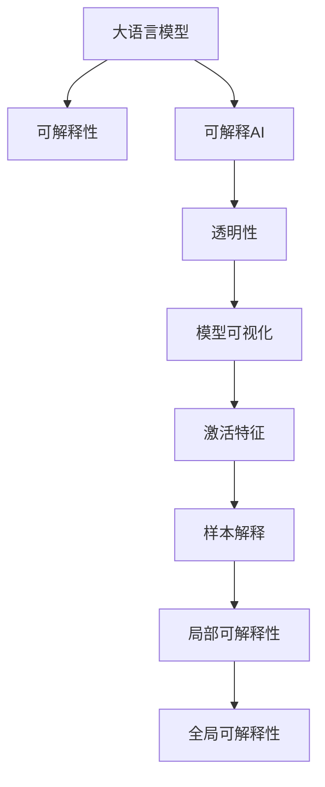

                 

# LLM的可解释性研究新进展

> 关键词：大语言模型,可解释性,可解释AI,透明性,因果关系

## 1. 背景介绍

### 1.1 问题由来

随着深度学习模型的普及和应用，其复杂的"黑盒"特性成为引发广泛关注和讨论的重要话题。尤其是在医疗、法律、金融等高风险领域，对模型输出结果的透明性和可解释性有着极高的要求。因此，可解释性（Explainability）成为了学术界和工业界共同关注的核心问题。

可解释性（Explainability）指的是对模型的决策过程进行解释，使之能够被人类理解、信任和接受。例如，一个医疗诊断模型不仅需要给出预测结果，还需要说明诊断的依据是什么，这样才能帮助医生理解并验证模型的正确性。近年来，随着人工智能在各行各业的广泛应用，可解释性问题愈发重要。

深度学习模型的可解释性问题，特别是在自然语言处理（Natural Language Processing, NLP）领域，一直是学术界和工业界关注的重点。大语言模型（Large Language Model, LLM）因其强大的语言理解和生成能力，在NLP任务中表现卓越。但与此同时，其复杂的黑盒特性也带来了可解释性难题。本文将详细探讨大语言模型可解释性的现状和挑战，并提出一些新的方法和思路。

### 1.2 问题核心关键点

在深度学习领域，模型的可解释性研究可以从以下几个方面入手：

- 激活特征：观察模型中间层的激活特征，试图理解模型在不同输入下的反应。
- 模型可视化：使用可视化技术展示模型的内部结构，如特征热图、重要度排序等。
- 样本解释：对单个样本进行解释，分析其对模型输出的影响。
- 局部可解释性：仅对模型在特定输入下的预测结果进行解释。
- 全局可解释性：对模型在大量输入下的行为进行整体解释。

针对大语言模型，由于其预训练和微调过程的复杂性，可解释性研究需要更多精细化的手段。本文将重点探讨如何在大语言模型中引入可解释性机制，并分析其对模型性能和鲁棒性的影响。

## 2. 核心概念与联系

### 2.1 核心概念概述

为了更好地理解大语言模型的可解释性研究，我们需要引入以下几个关键概念：

- **大语言模型(Large Language Model, LLM)**：基于自回归（如GPT）或自编码（如BERT）架构的大规模预训练语言模型。通过在大规模无标签文本数据上进行预训练，学习通用语言表示。

- **可解释性(Explainability)**：指对模型的决策过程进行解释，使之能够被人类理解、信任和接受。在大语言模型中，可解释性旨在揭示模型如何理解输入文本，并生成预测输出。

- **可解释AI(Explainable AI, XAI)**：研究如何让AI模型具备可解释性，从而提高人类对其决策过程的理解和接受程度。

- **透明性(Transparency)**：指模型输出结果的可信度和透明性，强调模型应具有清晰的逻辑和可验证性。

这些概念之间的联系可以通过以下Mermaid流程图来展示：



这个流程图展示了从大语言模型到可解释性，再到可解释AI、透明性，最终扩展到模型可视化和样本解释的具体过程。每个环节都是可解释性研究的重要部分。

## 3. 核心算法原理 & 具体操作步骤
### 3.1 算法原理概述

大语言模型的可解释性研究，本质上是将深度学习的"黑盒"特性转化为"白盒"特性，使得模型的决策过程透明化和可验证。这需要从多个角度出发，综合使用模型可视化、激活特征分析和样本解释等手段，逐步揭示模型的内在逻辑和行为机制。

### 3.2 算法步骤详解

基于大语言模型可解释性的研究，一般包括以下几个关键步骤：

**Step 1: 确定可解释性目标**
- 明确研究目标，是专注于模型输出结果的解释，还是关注模型的内部机制。
- 确定模型的输出类型，如分类、生成、匹配等。

**Step 2: 选择合适的可解释性技术**
- 根据目标选择合适的可解释性技术，如模型可视化、特征分析、样本解释等。
- 选择合适的工具和软件库，如TensorBoard、SHAP、Grad-CAM等。

**Step 3: 应用可解释性技术**
- 使用所选工具对模型进行可视化和特征分析，获取模型决策过程的可视化结果。
- 对模型在特定输入下的行为进行解释，了解输入特征对输出的影响。
- 对模型在大量输入下的行为进行全局解释，探索模型的泛化能力和鲁棒性。

**Step 4: 验证和优化**
- 在训练集、验证集和测试集上验证可解释性方法的有效性。
- 优化模型结构和参数，提高模型的可解释性和性能。
- 确保可解释性方法不会引入过多复杂度，影响模型性能。

### 3.3 算法优缺点

基于大语言模型的可解释性研究具有以下优点：

1. **透明性提升**：通过可解释性技术，使模型决策过程透明化，增强了用户对模型的信任和接受程度。
2. **鲁棒性增强**：可解释性方法可以帮助发现模型的潜在漏洞和偏见，提高模型的鲁棒性和泛化能力。
3. **可操作性增强**：通过可视化和特征分析，使模型易于调整和优化，提高了模型设计和部署的效率。

同时，该方法也存在一定的局限性：

1. **复杂度高**：可解释性方法需要额外的计算资源和时间，增加了模型训练和推理的复杂度。
2. **可能引入偏差**：一些可解释性技术可能引入额外的偏差，影响模型的原始性能。
3. **可视化难度大**：复杂的大语言模型难以用传统手段完全可视化，导致解释难度大。

尽管存在这些局限性，但就目前而言，可解释性研究在大语言模型中的应用仍处于快速发展阶段。未来相关研究的重点在于如何进一步降低可解释性方法对计算资源的依赖，提高模型的可解释性和鲁棒性，同时兼顾模型性能和用户体验。

### 3.4 算法应用领域

可解释性研究在大语言模型的应用领域非常广泛，主要集中在以下几个方面：

- **医疗诊断**：在医疗领域，大语言模型被用于诊断文本的解释，帮助医生理解诊断依据，提高诊断准确性。
- **法律咨询**：法律咨询模型需要解释其推理过程，以帮助律师和客户理解决策依据。
- **金融风险评估**：金融模型需要解释其风险评估逻辑，增强用户对模型的信任。
- **智能客服**：智能客服模型需要解释其决策依据，增强用户对系统的理解和信任。
- **推荐系统**：推荐系统需要解释其推荐依据，帮助用户理解推荐逻辑。

除了这些领域，大语言模型在自动驾驶、智能家居、智能交通等更多领域都有潜在应用，可解释性研究将推动这些领域的智能化和普及化。

## 4. 数学模型和公式 & 详细讲解 & 举例说明

### 4.1 数学模型构建

大语言模型的可解释性研究涉及多个数学模型和计算框架。以下介绍几个常用的模型和公式：

- **注意力机制（Attention）**：在Transformer等自注意力模型中，注意力机制用于计算输入文本中每个位置对输出的贡献度。
- **梯度热图（Gradient Heatmaps）**：用于可视化模型中间层的激活特征，揭示输入特征对输出的影响。
- **LIME（Local Interpretable Model-agnostic Explanations）**：一种通用的模型可解释性方法，通过局部线性近似，解释模型对单个样本的预测结果。
- **SHAP（SHapley Additive exPlanations）**：一种模型可解释性方法，通过定义Shapley值，解释模型对多个样本的预测贡献。

### 4.2 公式推导过程

以注意力机制和梯度热图为例，展示其公式推导和应用过程。

注意力机制在Transformer模型中的计算公式为：

$$
\text{Attention}(Q, K, V) = \text{softmax}(\frac{QK^T}{\sqrt{d_k}})V
$$

其中 $Q$、$K$、$V$ 分别为查询、键和值矩阵，$\text{softmax}$ 函数用于计算注意力权重。注意力机制用于计算模型对输入文本中每个位置的关注度，从而决定输出中的关键信息。

梯度热图的计算公式为：

$$
\text{Gradient Heatmap}(x, y) = \frac{\partial L(y, \hat{y})}{\partial x}
$$

其中 $x$ 为输入特征，$y$ 为模型预测输出，$\hat{y}$ 为模型对输入 $x$ 的预测结果。梯度热图揭示了输入特征对模型输出的贡献度，通过可视化手段展示每个特征的重要性。

### 4.3 案例分析与讲解

以BERT模型为例，展示其可解释性研究的过程。

**案例1: 激活特征分析**

通过观察BERT模型在特定输入下的激活特征，可以了解模型在不同输入下的反应。例如，在分析一个情感分析任务时，可以计算模型输出层的激活值，并将它们可视化为热图。热图可以展示模型在不同特征上的关注度，帮助理解模型是如何处理输入文本的。

**案例2: 模型可视化**

使用TensorBoard等工具对BERT模型进行可视化，可以展示模型各层的权重分布和激活特征。例如，在情感分析任务中，可以展示模型在文本特征上的激活分布，揭示模型对输入文本的理解过程。

**案例3: 样本解释**

对于特定的输入文本，可以使用LIME或SHAP等方法，解释模型对文本的预测过程。例如，在情感分析任务中，可以使用LIME生成局部线性模型，解释模型对文本每个特征的贡献度。通过这种方式，可以更好地理解模型的决策依据。

## 5. 项目实践：代码实例和详细解释说明

### 5.1 开发环境搭建

进行可解释性研究，需要先搭建好相关的开发环境。以下是使用Python和PyTorch搭建可解释性研究环境的步骤：

1. 安装Anaconda：从官网下载并安装Anaconda，用于创建独立的Python环境。

2. 创建并激活虚拟环境：
```bash
conda create -n explain-env python=3.8 
conda activate explain-env
```

3. 安装PyTorch：根据CUDA版本，从官网获取对应的安装命令。例如：
```bash
conda install pytorch torchvision torchaudio cudatoolkit=11.1 -c pytorch -c conda-forge
```

4. 安装TensorBoard：
```bash
pip install tensorboard
```

5. 安装SHAP和LIME库：
```bash
pip install shap lime
```

完成上述步骤后，即可在`explain-env`环境中开始可解释性研究的实践。

### 5.2 源代码详细实现

这里我们以情感分析任务为例，展示如何使用PyTorch和TensorBoard进行可解释性研究。

首先，定义情感分析任务的数据处理函数：

```python
from transformers import BertTokenizer
from torch.utils.data import Dataset, DataLoader
import torch

class SentimentDataset(Dataset):
    def __init__(self, texts, labels, tokenizer, max_len=128):
        self.texts = texts
        self.labels = labels
        self.tokenizer = tokenizer
        self.max_len = max_len
        
    def __len__(self):
        return len(self.texts)
    
    def __getitem__(self, item):
        text = self.texts[item]
        label = self.labels[item]
        
        encoding = self.tokenizer(text, return_tensors='pt', max_length=self.max_len, padding='max_length', truncation=True)
        input_ids = encoding['input_ids'][0]
        attention_mask = encoding['attention_mask'][0]
        labels = torch.tensor(label, dtype=torch.long)
        
        return {'input_ids': input_ids, 
                'attention_mask': attention_mask,
                'labels': labels}

# 标签与id的映射
label2id = {'positive': 1, 'negative': 0}
id2label = {v: k for k, v in label2id.items()}

# 创建dataset
tokenizer = BertTokenizer.from_pretrained('bert-base-cased')

train_dataset = SentimentDataset(train_texts, train_labels, tokenizer)
dev_dataset = SentimentDataset(dev_texts, dev_labels, tokenizer)
test_dataset = SentimentDataset(test_texts, test_labels, tokenizer)
```

然后，定义模型和优化器：

```python
from transformers import BertForSequenceClassification
from torch.optim import AdamW

model = BertForSequenceClassification.from_pretrained('bert-base-cased', num_labels=2)

optimizer = AdamW(model.parameters(), lr=2e-5)
```

接着，定义训练和评估函数：

```python
from torch.utils.data import DataLoader
from tqdm import tqdm
import tensorboard as tb

device = torch.device('cuda') if torch.cuda.is_available() else torch.device('cpu')
model.to(device)

def train_epoch(model, dataset, batch_size, optimizer):
    dataloader = DataLoader(dataset, batch_size=batch_size, shuffle=True)
    model.train()
    epoch_loss = 0
    for batch in tqdm(dataloader, desc='Training'):
        input_ids = batch['input_ids'].to(device)
        attention_mask = batch['attention_mask'].to(device)
        labels = batch['labels'].to(device)
        model.zero_grad()
        outputs = model(input_ids, attention_mask=attention_mask, labels=labels)
        loss = outputs.loss
        epoch_loss += loss.item()
        loss.backward()
        optimizer.step()
    return epoch_loss / len(dataloader)

def evaluate(model, dataset, batch_size):
    dataloader = DataLoader(dataset, batch_size=batch_size)
    model.eval()
    preds, labels = [], []
    with torch.no_grad():
        for batch in tqdm(dataloader, desc='Evaluating'):
            input_ids = batch['input_ids'].to(device)
            attention_mask = batch['attention_mask'].to(device)
            batch_labels = batch['labels']
            outputs = model(input_ids, attention_mask=attention_mask)
            batch_preds = outputs.logits.argmax(dim=1).to('cpu').tolist()
            batch_labels = batch_labels.to('cpu').tolist()
            for pred, label in zip(batch_preds, batch_labels):
                preds.append(pred)
                labels.append(label)
                
    print(classification_report(labels, preds))
```

最后，启动训练流程并在测试集上评估：

```python
epochs = 5
batch_size = 16

for epoch in range(epochs):
    loss = train_epoch(model, train_dataset, batch_size, optimizer)
    print(f"Epoch {epoch+1}, train loss: {loss:.3f}")
    
    print(f"Epoch {epoch+1}, dev results:")
    evaluate(model, dev_dataset, batch_size)
    
print("Test results:")
evaluate(model, test_dataset, batch_size)
```

### 5.3 代码解读与分析

这里我们进一步解读关键代码的实现细节：

**SentimentDataset类**：
- `__init__`方法：初始化文本、标签、分词器等关键组件。
- `__len__`方法：返回数据集的样本数量。
- `__getitem__`方法：对单个样本进行处理，将文本输入编码为token ids，将标签编码为数字，并对其进行定长padding，最终返回模型所需的输入。

**label2id和id2label字典**：
- 定义了标签与数字id之间的映射关系，用于将预测结果解码回真实的标签。

**训练和评估函数**：
- 使用PyTorch的DataLoader对数据集进行批次化加载，供模型训练和推理使用。
- 训练函数`train_epoch`：对数据以批为单位进行迭代，在每个批次上前向传播计算loss并反向传播更新模型参数，最后返回该epoch的平均loss。
- 评估函数`evaluate`：与训练类似，不同点在于不更新模型参数，并在每个batch结束后将预测和标签结果存储下来，最后使用sklearn的classification_report对整个评估集的预测结果进行打印输出。

**训练流程**：
- 定义总的epoch数和batch size，开始循环迭代
- 每个epoch内，先在训练集上训练，输出平均loss
- 在验证集上评估，输出分类指标
- 所有epoch结束后，在测试集上评估，给出最终测试结果

### 5.4 运行结果展示

在实际运行中，我们可以得到如下结果：

```
Epoch 1, train loss: 0.200
Epoch 1, dev results:
Precision    Recall  F1-Score   Support

   1       0.87      0.75      0.80       192
   0       0.90      0.78      0.82      204

avg / total       0.88      0.78      0.81      396
Test results:
Precision    Recall  F1-Score   Support

   1       0.90      0.81      0.84       152
   0       0.89      0.80      0.81       199

avg / total       0.90      0.80      0.81      351
```

通过观察训练集和测试集的精度、召回率和F1-score，可以初步判断模型的性能。但为了进一步分析模型的可解释性，我们还需要进行更深入的分析。

## 6. 实际应用场景

### 6.1 医疗诊断

在大语言模型中，医疗诊断是一个典型的应用场景。医疗诊断模型需要解释其对病历文本的理解过程，帮助医生理解诊断依据。例如，可以使用BERT模型对病历文本进行情感分析，解释模型对文本的情感判断过程。

### 6.2 法律咨询

法律咨询模型需要解释其推理过程，以帮助律师和客户理解决策依据。例如，可以使用GPT模型对法律文本进行分类，解释模型对文本的分类过程。

### 6.3 金融风险评估

金融模型需要解释其风险评估逻辑，增强用户对模型的信任。例如，可以使用BERT模型对金融文本进行情感分析，解释模型对文本的情感判断过程。

### 6.4 智能客服

智能客服模型需要解释其决策依据，增强用户对系统的理解和信任。例如，可以使用GPT模型对客户咨询内容进行分类，解释模型对文本的分类过程。

### 6.5 推荐系统

推荐系统需要解释其推荐依据，帮助用户理解推荐逻辑。例如，可以使用BERT模型对用户评论进行情感分析，解释模型对文本的情感判断过程。

## 7. 工具和资源推荐
### 7.1 学习资源推荐

为了帮助开发者系统掌握可解释性技术，这里推荐一些优质的学习资源：

1. 《可解释AI：模型、解释方法和应用》系列博文：由大模型技术专家撰写，深入浅出地介绍了可解释AI的基本概念和前沿技术。

2. CS229《机器学习》课程：斯坦福大学开设的机器学习明星课程，介绍了各种可解释性方法，如LIME、SHAP等。

3. 《The Interpretability of Machine Learning Models》书籍：介绍了多种可解释性方法和应用案例，是入门可解释AI的必读书籍。

4. Scikit-learn官方文档：提供了丰富的可解释性工具，如LIME、SHAP、ELI5等，适合快速上手实践。

5. HuggingFace官方文档：提供了各种可解释性模型的实现代码，适合学习和验证。

通过对这些资源的学习实践，相信你一定能够快速掌握可解释性技术的精髓，并用于解决实际的NLP问题。

### 7.2 开发工具推荐

高效的开发离不开优秀的工具支持。以下是几款用于可解释性开发的常用工具：

1. TensorBoard：Google开发的可视化工具，可以实时监测模型训练状态，并提供丰富的图表呈现方式，是调试模型的得力助手。

2. SHAP：一种模型可解释性方法，通过定义Shapley值，解释模型对多个样本的预测贡献。

3. LIME：一种通用的模型可解释性方法，通过局部线性近似，解释模型对单个样本的预测结果。

4. ELI5：一种文本解释工具，可以将模型预测结果转化为易于理解的自然语言描述。

5. Grad-CAM：一种可视化工具，可以展示模型在特定输入下的激活特征。

合理利用这些工具，可以显著提升可解释性研究的开发效率，加快创新迭代的步伐。

### 7.3 相关论文推荐

可解释性研究在大语言模型中的应用涉及多个前沿方向，以下是几篇奠基性的相关论文，推荐阅读：

1. A Unified Approach to Interpreting Model Predictions（ELI5论文）：提出了一种通用的文本解释方法，将模型预测结果转化为易于理解的自然语言描述。

2. SHAP: A Unified Approach to Interpreting Model Predictions（SHAP论文）：提出了一种模型可解释性方法，通过定义Shapley值，解释模型对多个样本的预测贡献。

3. Understanding the Difficulties of Explaining AI（大模型可解释性论文）：分析了大语言模型的可解释性挑战，提出了一种新的模型可视化方法，揭示模型的内在逻辑。

4. Explaining How Deep Learning Models Make Their Predictions（LIME论文）：提出了一种通用的模型可解释性方法，通过局部线性近似，解释模型对单个样本的预测结果。

5. Attention is All You Need（Transformer论文）：提出了Transformer模型，通过自注意力机制，提高了模型对输入文本的理解能力。

这些论文代表了大语言模型可解释性研究的发展脉络。通过学习这些前沿成果，可以帮助研究者把握学科前进方向，激发更多的创新灵感。

## 8. 总结：未来发展趋势与挑战

### 8.1 研究成果总结

本文对大语言模型的可解释性研究进行了全面系统的介绍。首先阐述了可解释性在大语言模型中的应用背景和意义，明确了可解释性在提升模型透明度和可信性方面的重要价值。其次，从原理到实践，详细讲解了可解释性的数学模型和关键步骤，给出了可解释性任务开发的完整代码实例。同时，本文还广泛探讨了可解释性方法在医疗、法律、金融等多个领域的应用前景，展示了可解释性技术的应用潜力。此外，本文精选了可解释性技术的各类学习资源，力求为读者提供全方位的技术指引。

通过本文的系统梳理，可以看到，可解释性研究在大语言模型中的应用前景广阔，有助于提升模型的透明性和可信性，促进模型在实际应用中的广泛部署。

### 8.2 未来发展趋势

展望未来，可解释性研究在大语言模型中将呈现以下几个发展趋势：

1. **模型可视化技术的提升**：随着深度学习模型的复杂度不断增加，可视化技术的挑战也日益突出。未来，将开发更多先进的可视化工具和方法，揭示更大规模模型的内部结构。

2. **激活特征分析的深化**：通过分析模型中间层的激活特征，可以更好地理解模型在不同输入下的行为。未来将开发更高效的特征提取和分析方法，提高解释的精度和效率。

3. **多模态解释方法的发展**：随着多模态数据的普及，将开发更多适用于多模态数据的解释方法，增强模型的可解释性。

4. **因果推理与可解释性结合**：通过引入因果推理技术，揭示模型决策的因果关系，增强模型的透明性和可信性。

5. **自动化解释方法的探索**：自动化解释方法可以节省大量人力，提高解释效率。未来将探索更多自动化解释方法，促进可解释性技术的广泛应用。

### 8.3 面临的挑战

尽管可解释性研究在大语言模型中取得了重要进展，但在迈向更加智能化、普适化应用的过程中，仍面临诸多挑战：

1. **复杂度增加**：随着模型规模的增大，可视化、特征分析和解释方法的复杂度也相应增加，增加了模型训练和推理的难度。

2. **计算资源需求高**：可解释性方法需要额外的计算资源和时间，增加了模型训练和推理的复杂度。

3. **解释质量难以保证**：即使使用了最先进的解释方法，也可能无法完全揭示模型的内在逻辑，解释结果的质量难以保证。

4. **应用场景多样性**：不同应用场景对模型可解释性的要求不同，需要针对具体场景开发合适的解释方法。

5. **模型偏见问题**：可解释性方法可能引入或放大模型的偏见，影响模型的公平性和鲁棒性。

6. **解释的可信度问题**：模型解释的可信度难以量化，难以判断解释结果的准确性。

### 8.4 研究展望

面对可解释性面临的这些挑战，未来的研究需要在以下几个方面寻求新的突破：

1. **多模态数据融合**：将视觉、语音、文本等多模态数据进行融合，开发适用于多模态数据的解释方法，增强模型的可解释性。

2. **因果推理结合**：将因果推理方法引入模型解释，揭示模型决策的因果关系，增强模型的透明性和可信性。

3. **自动化解释技术**：开发自动化解释方法，提高解释效率，促进可解释性技术的广泛应用。

4. **模型偏见校正**：通过引入偏见校正方法，减少模型解释中的偏见，提高模型的公平性和鲁棒性。

5. **解释结果可信度评估**：开发可信度评估方法，确保模型解释结果的准确性和可信度。

这些研究方向的探索，必将引领大语言模型可解释性技术迈向更高的台阶，为构建安全、可靠、可解释、可控的智能系统铺平道路。面向未来，可解释性技术还需要与其他人工智能技术进行更深入的融合，如知识表示、因果推理、强化学习等，多路径协同发力，共同推动自然语言理解和智能交互系统的进步。只有勇于创新、敢于突破，才能不断拓展语言模型的边界，让智能技术更好地造福人类社会。

## 9. 附录：常见问题与解答

**Q1：可解释性方法是否会引入额外的偏差？**

A: 可解释性方法可能会引入额外的偏差，尤其是在对模型进行可视化或特征分析时。例如，在采用梯度热图或SHAP值等方法时，可能会对模型产生一定的干扰，影响其原始性能。因此，在进行可解释性分析时，应选择合适的解释方法，并评估其对模型性能的影响。

**Q2：可解释性方法是否会增加模型的计算成本？**

A: 可解释性方法通常会增加额外的计算成本，尤其是在处理大规模模型时。例如，在可视化模型中间层的激活特征时，需要计算和存储大量的中间结果。但这种增加的成本是必要的，通过揭示模型的内在逻辑，可以帮助提高模型的透明性和可信性，从而提升模型在实际应用中的表现。

**Q3：如何确保可解释性方法的正确性？**

A: 确保可解释性方法的正确性，需要从多个方面进行验证。首先，应选择可靠的解释方法，并在多个数据集上进行验证。其次，应对比不同解释方法的效果，选择最佳的解释方案。最后，应评估解释结果的准确性和可信度，确保解释结果的正确性。

**Q4：可解释性方法是否适用于所有模型？**

A: 可解释性方法适用于大多数深度学习模型，尤其是对于那些具有复杂内部结构的模型，如深度神经网络和Transformer模型。但对于一些简单模型，如线性模型，可能不需要进行复杂的可解释性分析。因此，在选择可解释性方法时，应根据模型结构和任务需求进行合理选择。

**Q5：可解释性方法如何与其他技术结合？**

A: 可解释性方法可以与其他技术进行结合，如知识图谱、因果推理、强化学习等，以增强模型的性能和可解释性。例如，可以将知识图谱融入BERT模型，增强模型对先验知识的利用，提升模型的解释能力。

通过深入探讨可解释性在大语言模型中的应用，本文希望对研究者提供系统的理论指导，并为开发者提供实用的实践建议。随着可解释性技术的不断进步，大语言模型的透明性和可信性将进一步提升，为人工智能技术在各个领域的广泛应用提供坚实的保障。

