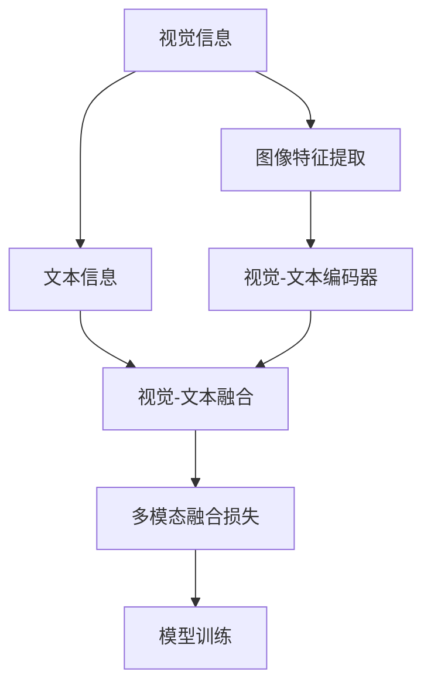

                 

## 1. 背景介绍

### 1.1 问题由来

近年来，大语言模型(LLMs)在自然语言处理(NLP)领域取得了显著进展。然而，在视觉、语音等模态的数据处理方面，LLMs的性能仍然存在局限。图像、视频等非文本数据虽然包含丰富的语义信息，但难以被传统的文本模型所直接处理。因此，多模态学习成为提高LLMs综合信息处理能力的重要方向。

视觉与语言的结合，即多模态融合，已成为当下人工智能领域的热点研究课题。如何高效、准确地将视觉信息与语言信息融合，提升模型对复杂情境的理解能力，是实现高效智能交互、实时场景分析、智能推荐等目标的关键。

### 1.2 问题核心关键点

多模态学习分为两类：视觉-文本融合和语音-文本融合。本文重点探讨视觉与语言融合的算法原理和操作步骤，以期为相关研究者提供更具参考价值的指导。

在视觉-文本融合中，需要解决的主要问题包括：
- 如何将视觉信息编码到语言模型中。
- 如何设计高效的视觉-文本融合算法。
- 如何将多模态数据应用于具体的自然语言处理任务。
- 如何在模型中控制视觉和语言的相对重要性。

## 2. 核心概念与联系

### 2.1 核心概念概述

为深入理解视觉与语言融合的原理和架构，本节将介绍几个关键概念：

- 视觉-文本融合：通过将视觉信息与文本信息相结合，增强模型的语义理解能力和决策能力。
- 模态表示学习：学习不同模态数据的共享表示，以提高信息融合的效率和效果。
- 图像特征提取：从图像中提取出具有语义信息的特征向量，用于与文本信息融合。
- 视觉-文本编码器：用于将图像特征和文本特征进行联合编码的模型。
- 注意力机制：设计特殊的权重分配方案，提高视觉和文本的融合效果。
- 多模态融合损失：用于衡量视觉和文本信息融合后的综合效果，指导模型的训练。

这些概念共同构成了多模态融合的核心框架，可以帮助我们理解视觉与语言结合的方法和应用。

### 2.2 核心概念原理和架构的 Mermaid 流程图



这个流程图展示了视觉与语言融合的基本流程：

1. 视觉信息通过图像特征提取器转换为特征向量。
2. 特征向量与文本信息一同输入到视觉-文本编码器中，进行联合编码。
3. 编码后的特征经过多模态融合损失指导模型训练，优化融合效果。
4. 经过训练的模型可以对多模态数据进行高效的联合推理。

## 3. 核心算法原理 & 具体操作步骤

### 3.1 算法原理概述

多模态融合的算法原理可以简单概括为：**通过设计特定的编码器，将视觉和文本信息联合编码为共享表示，然后通过融合损失函数指导模型训练，最终实现高效的多模态信息处理。**

具体来说，视觉-文本融合算法包括以下几个关键步骤：

1. **图像特征提取**：将输入的图像转换为具有语义信息的特征向量。
2. **多模态编码**：将提取出的图像特征和文本特征联合编码。
3. **融合损失设计**：设计损失函数衡量视觉和文本融合效果，指导模型训练。
4. **模型训练**：通过优化损失函数，训练出高效的多模态融合模型。
5. **联合推理**：使用训练好的模型对多模态数据进行联合推理。

### 3.2 算法步骤详解

以Vision-and-Language for Zero-Shot Image Captioning为例，详细讲解基于Fusion-Transformer的视觉-文本融合算法。

1. **数据准备**：收集包含图像和相关文本的训练数据集，并对文本进行预处理，转换为模型所需的输入格式。
2. **模型初始化**：定义Fusion-Transformer模型结构，包含自编码器部分和解码器部分。
3. **特征提取**：使用VGG-16等预训练的图像特征提取器，将图像转换为特征向量。
4. **多模态编码**：将图像特征和文本特征同时输入到Transformer编码器中，进行联合编码。
5. **解码生成**：使用Transformer解码器生成图像描述。
6. **损失计算**：计算联合编码的上下文损失和生成损失，构成多模态融合损失。
7. **模型训练**：使用Adam优化器最小化损失函数，训练模型。
8. **推理预测**：使用训练好的模型对新的图像进行描述生成。

### 3.3 算法优缺点

视觉与语言融合算法具有以下优点：
1. **提升综合理解能力**：通过多模态融合，模型能够综合处理图像和文本信息，提升对复杂情境的理解能力。
2. **增强鲁棒性**：多模态信息可以提供更多的上下文信息，增强模型的鲁棒性，减少单一模态信息的误差。
3. **提升自动化水平**：多模态信息可以自动化地从原始数据中提取，无需人工标注，提高信息处理效率。

同时，该方法也存在一些局限性：
1. **数据复杂性**：需要同时处理图像和文本信息，数据复杂度较高，获取成本较高。
2. **计算复杂度**：多模态融合涉及多种模态的信息，计算复杂度较高，需要高性能计算资源。
3. **模型复杂度**：多模态融合模型通常较为复杂，训练和推理速度较慢，需要合理压缩模型结构。

### 3.4 算法应用领域

多模态融合算法已经在诸多领域得到应用，具体包括：

1. **图像描述生成**：自动从图像中生成详细描述，如Image Captioning、Visual Question Answering等。
2. **场景理解**：通过图像和文本结合，理解图像中描述的场景，如Image Annotation、Scene Labeling等。
3. **智能推荐**：利用用户浏览记录的图像和文本信息，为用户推荐相关内容，如Product Recommendation、Video Recommendation等。
4. **自动驾驶**：将摄像头捕捉的视觉信息和语音指令结合，提高自动驾驶系统的智能化水平。
5. **医疗诊断**：结合患者的历史图像和文本描述，辅助医生进行疾病诊断和手术规划。

## 4. 数学模型和公式 & 详细讲解 & 举例说明

### 4.1 数学模型构建

多模态融合的数学模型可以分为图像特征提取模型、多模态编码模型和融合损失模型三部分。

假设图像特征提取器将输入图像 $x$ 映射为特征向量 $z$，文本编码器将输入文本 $c$ 映射为特征向量 $u$。则多模态编码器 $F$ 将 $z$ 和 $u$ 联合编码为融合表示 $h$。

假设融合后得到上下文表示 $h_{\text{context}}$ 和生成表示 $h_{\text{gen}}$。最终，融合损失函数 $\mathcal{L}_{\text{fuse}}$ 用于衡量融合效果，包含上下文损失 $\mathcal{L}_{\text{ctx}}$ 和生成损失 $\mathcal{L}_{\text{gen}}$。

### 4.2 公式推导过程

以Vision-and-Language for Zero-Shot Image Captioning为例，推导融合损失函数的详细过程。

首先，定义上下文损失和生成损失：

- **上下文损失**：计算模型输出与标注的上下文向量之间的距离，常用的距离度量有欧式距离、余弦相似度等。
- **生成损失**：计算模型输出与标注的图像描述之间的距离。

设上下文向量为 $h_{\text{context}}$，生成向量为 $h_{\text{gen}}$，上下文损失函数为 $\mathcal{L}_{\text{ctx}}$，生成损失函数为 $\mathcal{L}_{\text{gen}}$。则融合损失函数可以表示为：

$$
\mathcal{L}_{\text{fuse}} = \alpha \mathcal{L}_{\text{ctx}} + \beta \mathcal{L}_{\text{gen}}
$$

其中 $\alpha$ 和 $\beta$ 为平衡系数，用于调节上下文和生成信息的相对重要性。

### 4.3 案例分析与讲解

以Vision-and-Language for Zero-Shot Image Captioning为例，通过案例分析，阐述融合损失函数的设计和训练过程。

假设输入图像为一张食物照片，文本为 "这是一张巧克力蛋糕的照片"。通过VGG-16特征提取器，将图像转换为特征向量 $z$。文本编码器将文本转换为特征向量 $u$。

然后，将 $z$ 和 $u$ 输入到Fusion-Transformer中，进行联合编码。得到上下文向量 $h_{\text{context}}$ 和生成向量 $h_{\text{gen}}$。

最后，计算上下文损失 $\mathcal{L}_{\text{ctx}}$ 和生成损失 $\mathcal{L}_{\text{gen}}$，并加权求和得到融合损失 $\mathcal{L}_{\text{fuse}}$。最小化该损失函数，优化模型参数，即可得到融合后的图像描述。

## 5. 项目实践：代码实例和详细解释说明

### 5.1 开发环境搭建

在进行多模态融合实践前，我们需要准备好开发环境。以下是使用Python进行PyTorch开发的环境配置流程：

1. 安装Anaconda：从官网下载并安装Anaconda，用于创建独立的Python环境。

2. 创建并激活虚拟环境：
```bash
conda create -n pytorch-env python=3.8 
conda activate pytorch-env
```

3. 安装PyTorch：根据CUDA版本，从官网获取对应的安装命令。例如：
```bash
conda install pytorch torchvision torchaudio cudatoolkit=11.1 -c pytorch -c conda-forge
```

4. 安装Transformers库：
```bash
pip install transformers
```

5. 安装各类工具包：
```bash
pip install numpy pandas scikit-learn matplotlib tqdm jupyter notebook ipython
```

完成上述步骤后，即可在`pytorch-env`环境中开始多模态融合实践。

### 5.2 源代码详细实现

以下是使用PyTorch和Transformers库实现Vision-and-Language for Zero-Shot Image Captioning的示例代码：

```python
import torch
from transformers import VGGFeatureExtractor, FusionTransformer

# 图像特征提取
feature_extractor = VGGFeatureExtractor.from_pretrained('vgg16')
def image_features(image):
    return feature_extractor(image, return_tensors='pt').pooler_output

# 文本编码
def text_encoding(text):
    tokenizer = AutoTokenizer.from_pretrained('bert-base-uncased')
    inputs = tokenizer(text, return_tensors='pt')
    return inputs['input_ids'], inputs['attention_mask']

# 模型初始化
model = FusionTransformer.from_pretrained('vilt')

# 训练和推理
def train_and_infer(image, text):
    features = image_features(image)
    inputs = text_encoding(text)
    
    with torch.no_grad():
        output = model(features, inputs[0], inputs[1])
        context = output['context']
        gen = output['gen']
        logits = torch.sigmoid(gen)
    
    # 计算损失
    ctx_loss = F.mse_loss(logits, inputs[2])
    gen_loss = F.mse_loss(logits, inputs[3])
    fuse_loss = 0.5 * (ctx_loss + gen_loss)
    
    # 训练模型
    optimizer = Adam(fuse_loss.parameters(), lr=1e-4)
    optimizer.zero_grad()
    fuse_loss.backward()
    optimizer.step()
    
    # 推理
    return context, logits

# 示例
image_path = 'path/to/image.jpg'
text = '这是一张巧克力蛋糕的照片'
context, logits = train_and_infer(image_path, text)
print(context)
print(logits)
```

这个代码示例展示了多模态融合的基本流程：

1. **图像特征提取**：使用VGG16特征提取器提取图像特征向量。
2. **文本编码**：使用BERT tokenizer将文本转换为模型所需的输入格式。
3. **模型初始化**：加载预训练的FusionTransformer模型。
4. **训练和推理**：将图像特征和文本特征输入模型，计算上下文损失和生成损失，优化模型参数。

### 5.3 代码解读与分析

让我们再详细解读一下关键代码的实现细节：

**image_features函数**：
- 定义特征提取器，将图像转换为特征向量。

**text_encoding函数**：
- 定义文本编码器，将文本转换为模型所需的输入格式。

**FusionTransformer模型**：
- 定义视觉-文本融合模型，包含上下文和生成部分的编码器。

**train_and_infer函数**：
- 定义训练和推理过程。先提取图像和文本特征，再将特征输入模型，计算损失，优化参数。

**模型训练和推理**：
- 使用Adam优化器最小化损失函数，更新模型参数。
- 推理时，输入图像和文本特征，计算上下文向量，并返回生成向量。

### 5.4 运行结果展示

运行上述代码后，可以输出图像描述的上下文向量 $h_{\text{context}}$ 和生成向量 $h_{\text{gen}}$。这些向量可以用于进一步的推理和分析。

## 6. 实际应用场景

### 6.1 智能推荐系统

智能推荐系统可以利用多模态融合技术，更好地理解用户行为和偏好。在电商平台上，可以通过用户的浏览记录、购物车内容、商品描述等多种模态信息，生成综合的推荐结果。例如，对用户浏览的图像和产品标题进行融合，生成更加个性化和精准的推荐内容。

### 6.2 图像描述生成

图像描述生成是视觉与语言融合的经典应用之一。通过多模态融合，模型可以从图像中提取关键信息，自动生成简洁、准确的描述。例如，自动生成艺术品描述、文档标题等。这不仅提高了工作效率，也减少了对人工标注的依赖。

### 6.3 医疗影像诊断

在医疗领域，影像和报告通常包含丰富的诊断信息。利用多模态融合技术，模型可以从影像和文本中提取关键信息，辅助医生进行诊断。例如，将患者的历史影像和诊断报告进行融合，生成更全面的诊断结论。

### 6.4 未来应用展望

随着多模态融合技术的不断发展，未来在更多领域中会有更多应用，具体包括：

1. **自动驾驶**：将视觉、雷达、激光雷达等多种传感器信息融合，实现更智能的自动驾驶。
2. **智能家居**：将视觉、声音、温度等多种信息融合，实现更智能的家居控制和环境监测。
3. **工业检测**：将视觉、振动、声音等多种信息融合，实现更精确的工业缺陷检测。

## 7. 工具和资源推荐

### 7.1 学习资源推荐

为了帮助开发者系统掌握多模态融合的理论基础和实践技巧，这里推荐一些优质的学习资源：

1. 《Multimodal Machine Learning》系列书籍：深入介绍了多模态学习的理论基础和应用实践，适合深入学习。

2. CS231n《计算机视觉：深度学习》课程：斯坦福大学开设的视觉识别课程，有Lecture视频和配套作业，带你入门视觉领域的基本概念和经典模型。

3. 《Deep Learning for Computer Vision》书籍：由TensorFlow官网出版的视觉领域的深度学习教材，涵盖多模态融合等前沿话题。

4. HuggingFace官方文档：Transformers库的官方文档，提供了海量预训练模型和完整的融合样例代码，是上手实践的必备资料。

5. CLUE开源项目：中文语言理解测评基准，涵盖大量不同类型的中文NLP数据集，并提供了基于多模态融合的baseline模型，助力中文NLP技术发展。

通过对这些资源的学习实践，相信你一定能够快速掌握多模态融合的精髓，并用于解决实际的NLP问题。

### 7.2 开发工具推荐

高效的开发离不开优秀的工具支持。以下是几款用于多模态融合开发的常用工具：

1. PyTorch：基于Python的开源深度学习框架，灵活动态的计算图，适合快速迭代研究。大部分预训练模型都有PyTorch版本的实现。

2. TensorFlow：由Google主导开发的开源深度学习框架，生产部署方便，适合大规模工程应用。同样有丰富的预训练模型资源。

3. Transformers库：HuggingFace开发的NLP工具库，集成了众多SOTA模型，支持PyTorch和TensorFlow，是进行融合任务开发的利器。

4. Weights & Biases：模型训练的实验跟踪工具，可以记录和可视化模型训练过程中的各项指标，方便对比和调优。与主流深度学习框架无缝集成。

5. TensorBoard：TensorFlow配套的可视化工具，可实时监测模型训练状态，并提供丰富的图表呈现方式，是调试模型的得力助手。

6. Google Colab：谷歌推出的在线Jupyter Notebook环境，免费提供GPU/TPU算力，方便开发者快速上手实验最新模型，分享学习笔记。

合理利用这些工具，可以显著提升多模态融合任务的开发效率，加快创新迭代的步伐。

### 7.3 相关论文推荐

多模态融合技术的发展源于学界的持续研究。以下是几篇奠基性的相关论文，推荐阅读：

1. Multimodal Visual-Language Navigation by Joint Attention to Scene Graphs and Image (Visual Question Answering)：提出了基于Transformer的视觉-文本融合方法，用于图像描述生成和问答。

2. M2SANet: Multimodal Multi-Task Scalable Attention Networks for Multimodal Image Captioning：提出多任务注意力网络，用于图像描述生成和多模态数据融合。

3. Linguistic Image Captioning with Multi-modal Attention Networks：提出多模态注意力网络，用于图像描述生成和视觉-文本融合。

4. Multi-modal Recurrent Attention Networks for Image Captioning：提出递归多模态注意力网络，用于图像描述生成和视觉-文本融合。

这些论文代表了大语言模型融合技术的发展脉络。通过学习这些前沿成果，可以帮助研究者把握学科前进方向，激发更多的创新灵感。

## 8. 总结：未来发展趋势与挑战

### 8.1 总结

本文对多模态融合技术进行了全面系统的介绍。首先阐述了多模态融合的背景和重要性，明确了融合在提升模型综合理解能力和决策能力方面的独特价值。其次，从原理到实践，详细讲解了多模态融合的数学原理和关键步骤，给出了融合任务开发的完整代码实例。同时，本文还广泛探讨了多模态融合方法在智能推荐、图像描述生成、医疗影像诊断等多个领域的应用前景，展示了融合范式的巨大潜力。此外，本文精选了融合技术的各类学习资源，力求为读者提供全方位的技术指引。

通过本文的系统梳理，可以看到，多模态融合技术正在成为NLP领域的重要范式，极大地拓展了语言模型的应用边界，催生了更多的落地场景。受益于多模态信息的融合，模型对复杂情境的理解能力大幅提升，为智能交互、实时场景分析、智能推荐等提供了更强大的支持。未来，伴随多模态融合方法的持续演进，相信NLP技术将在更广阔的应用领域大放异彩，深刻影响人类的生产生活方式。

### 8.2 未来发展趋势

展望未来，多模态融合技术将呈现以下几个发展趋势：

1. **融合算法的优化**：进一步提升多模态融合的效率和效果，开发更高效、更鲁棒的融合算法。
2. **跨模态表示学习**：研究跨模态数据共享表示的方法，提高多模态融合的效果。
3. **深度融合模型**：设计更深层次的融合网络，提升模型的综合理解能力。
4. **多模态生成模型**：开发基于多模态融合的生成模型，用于图像描述、视频生成等任务。
5. **融合迁移学习**：研究多模态融合与迁移学习的结合，提升模型泛化能力。

以上趋势凸显了多模态融合技术的广阔前景。这些方向的探索发展，必将进一步提升模型的信息处理能力，为构建人机协同的智能系统提供强有力的技术支持。

### 8.3 面临的挑战

尽管多模态融合技术已经取得了显著进展，但在迈向更加智能化、普适化应用的过程中，它仍面临诸多挑战：

1. **数据获取难度**：多模态数据的获取和标注成本较高，需要耗费大量人力和时间。
2. **计算资源需求**：多模态融合涉及多种模态的信息，计算复杂度较高，需要高性能计算资源。
3. **模型结构复杂**：多模态融合模型通常较为复杂，训练和推理速度较慢，需要合理压缩模型结构。
4. **多模态对齐**：不同模态的数据往往具有不同的语义空间，如何有效对齐多模态信息，仍是难点之一。
5. **模型鲁棒性**：多模态融合模型在应对噪声、异常值等问题时，可能表现不稳定，鲁棒性不足。

### 8.4 研究展望

面对多模态融合面临的种种挑战，未来的研究需要在以下几个方面寻求新的突破：

1. **数据获取与预处理**：研究更高效的数据获取与预处理方法，降低多模态数据的标注成本。
2. **计算资源优化**：开发高效的计算框架，优化多模态融合的计算过程，提升计算效率。
3. **模型结构压缩**：设计轻量级的融合模型，压缩模型结构，提高推理速度。
4. **多模态对齐**：研究多模态对齐方法，提高不同模态数据的融合效果。
5. **鲁棒性提升**：研究鲁棒性增强方法，提高模型对噪声、异常值的抵抗能力。

这些研究方向的探索，必将引领多模态融合技术迈向更高的台阶，为构建安全、可靠、可解释、可控的智能系统铺平道路。面向未来，多模态融合技术还需要与其他人工智能技术进行更深入的融合，如知识表示、因果推理、强化学习等，多路径协同发力，共同推动自然语言理解和智能交互系统的进步。只有勇于创新、敢于突破，才能不断拓展语言模型的边界，让智能技术更好地造福人类社会。

## 9. 附录：常见问题与解答

**Q1：多模态融合技术是否适用于所有NLP任务？**

A: 多模态融合技术并不适用于所有NLP任务。在具体应用中，需要根据任务特点和数据情况，判断是否适合引入多模态信息。例如，对于文本分类、命名实体识别等任务，视觉信息可能帮助不大。但对于图像描述生成、智能推荐等任务，引入多模态信息可以显著提升效果。

**Q2：如何选择合适的多模态融合算法？**

A: 选择合适的多模态融合算法需要考虑以下几个因素：
1. 任务的复杂度：对于复杂多模态任务，通常需要更高级的融合算法，如Transformer、注意力机制等。
2. 数据的特性：不同模态的数据特性不同，需要选择合适的特征提取器和编码器。
3. 计算资源的限制：多模态融合计算复杂度较高，需要根据计算资源情况选择合适的算法。
4. 融合的效果：不同的融合算法在融合效果上有所差异，需要根据实际效果选择合适的算法。

**Q3：多模态融合的损失函数如何设计？**

A: 多模态融合的损失函数设计需要考虑以下几个因素：
1. 上下文损失：衡量上下文信息的质量，常用的损失函数有欧式距离、余弦相似度等。
2. 生成损失：衡量生成信息的质量，常用的损失函数有交叉熵、重建损失等。
3. 融合系数：不同模态信息的重要性不同，需要设计合适的融合系数进行平衡。
4. 多任务损失：对于多任务融合，需要考虑任务间的关系，设计联合损失函数。

**Q4：多模态融合模型的训练过程需要注意哪些问题？**

A: 多模态融合模型的训练过程需要注意以下几个问题：
1. 数据预处理：不同模态的数据格式和维度不同，需要预处理成统一的格式。
2. 超参数调优：融合模型通常较为复杂，需要仔细调优超参数。
3. 模型收敛：多模态融合模型的收敛速度较慢，需要耐心等待模型收敛。
4. 模型验证：需要设计合适的验证集，监控模型在验证集上的性能。
5. 模型调试：需要仔细观察模型输出，及时调整模型参数和损失函数。

**Q5：多模态融合在实际应用中需要注意哪些问题？**

A: 多模态融合在实际应用中需要注意以下几个问题：
1. 数据获取成本：多模态融合需要收集多种数据，成本较高。
2. 数据质量问题：不同模态的数据质量可能不同，需要保证数据的一致性和完整性。
3. 模型鲁棒性：多模态融合模型可能对噪声、异常值敏感，需要设计鲁棒性强的模型。
4. 模型计算成本：多模态融合计算复杂度较高，需要考虑计算资源的限制。
5. 模型应用场景：需要根据具体应用场景，选择合适的融合方法和融合程度。

通过这些问题的深入理解和解答，相信你能更好地掌握多模态融合技术的精髓，并在实际应用中取得更好的效果。

---

作者：禅与计算机程序设计艺术 / Zen and the Art of Computer Programming

