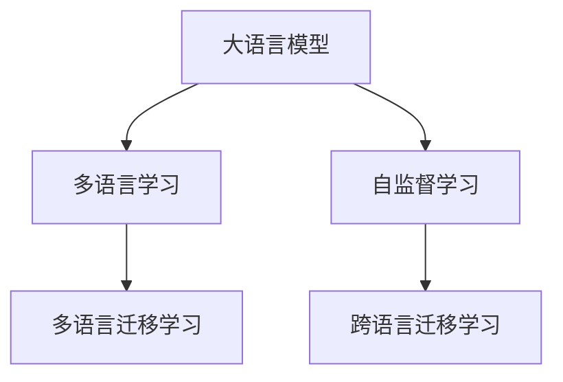

                 

# LLM的多语言学习挑战与机遇

> 关键词：大语言模型, 多语言学习, 跨语言迁移学习, 自监督学习, 多语言翻译, 语料获取, 多语言模型, 多语言理解, 自然语言处理

## 1. 背景介绍

### 1.1 问题由来
近年来，自然语言处理(Natural Language Processing, NLP)领域的进步主要得益于大语言模型(Large Language Model, LLM)的涌现。通过在海量数据上进行预训练，大语言模型能够掌握大量的语言知识和表达能力。然而，当面对多语言数据时，大语言模型的表现仍面临诸多挑战。

一方面，由于各语言的语法、词汇和语义差异巨大，不同语言之间的迁移学习效果不尽如人意。现有的大语言模型往往在特定语言上的性能优势明显，但跨语言的泛化能力较弱。另一方面，多语言数据集的获取和处理也存在显著困难。构建高质量的多语言语料库，不仅需要时间、精力，还涉及版权和伦理问题。

尽管如此，随着全球化加速，多语言处理的需求日益增加。多语言翻译、跨语言搜索、跨语言问答等应用场景不断涌现。如何在多语言环境中提升大语言模型的性能，成为NLP研究的重要课题。

### 1.2 问题核心关键点
本文聚焦于大语言模型在多语言环境中的学习挑战和机遇，介绍基于自监督学习的多语言迁移学习方法。这些方法旨在通过在多种语言数据上训练模型，提升其在不同语言环境下的理解与生成能力。

核心问题包括以下几个方面：
- 如何高效获取和处理多语言数据？
- 如何在多语言环境中有序地构建知识体系？
- 如何提升模型在不同语言之间的泛化能力？
- 如何利用自监督学习提升模型的多语言学习效果？

## 2. 核心概念与联系

### 2.1 核心概念概述

为更好地理解多语言大语言模型的学习过程，本节将介绍几个密切相关的核心概念：

- 大语言模型(Large Language Model, LLM)：以自回归(如GPT)或自编码(如BERT)模型为代表的大规模预训练语言模型。通过在海量数据上进行预训练，学习通用的语言表示，具备强大的语言理解和生成能力。

- 多语言学习(Multilingual Learning)：指同时训练模型处理多种语言数据，提升模型在多种语言环境中的性能。

- 自监督学习(Self-Supervised Learning)：指在大规模无标签数据上进行的学习，通过构建预定义的训练任务，利用数据本身的结构和特征进行训练。

- 多语言迁移学习(Multilingual Transfer Learning)：指将单一语言的预训练知识迁移到另一种语言中，提升新语言的处理能力。

- 跨语言迁移学习(Cross-lingual Transfer Learning)：指在两种不同语言之间进行迁移学习，提升模型的多语言泛化能力。

这些概念之间的逻辑关系可以通过以下Mermaid流程图来展示：



这个流程图展示了大语言模型、多语言学习、自监督学习、多语言迁移学习、跨语言迁移学习等概念及其之间的关系：

1. 大语言模型通过自监督学习在海量数据上进行预训练，学习到通用的语言表示。
2. 通过多语言学习，将预训练知识迁移到其他语言中，提升多语言环境的性能。
3. 多语言迁移学习涉及同源和异源两种方式，将单一语言的知识迁移到目标语言中。
4. 跨语言迁移学习进一步提升模型在不同语言之间的泛化能力，能够跨越语言边界实现知识共享。

这些概念共同构成了大语言模型在多语言环境中的学习框架，使得模型能够更广泛地应用到多种语言任务中。

## 3. 核心算法原理 & 具体操作步骤
### 3.1 算法原理概述

基于自监督学习的多语言迁移学习，通过在多种语言数据上预训练语言模型，提升模型在特定语言环境中的性能。其核心思想是：将多语言数据视为统一的整体，通过构建跨语言的预训练任务，使模型在多种语言之间建立广泛的语义关联和知识网络。

具体来说，算法分为以下几个关键步骤：

1. **数据预处理**：将多语言数据进行统一的格式处理，如分词、编码、统一标注等。
2. **多语言预训练**：在多种语言数据上同时进行自监督预训练，使模型学习到跨语言的共性语言知识。
3. **任务适配**：在特定语言上构建下游任务，进行有监督的微调，使模型能够适应特定的语言应用场景。
4. **交叉语言迁移**：在多种语言之间进行迁移学习，提升模型在不同语言之间的泛化能力。

### 3.2 算法步骤详解

基于自监督学习的多语言迁移学习步骤如下：

**Step 1: 准备多语言数据集**
- 收集并清洗多语言数据集，将不同语言的数据集进行统一处理。
- 将不同语言的数据集划分为训练集、验证集和测试集。

**Step 2: 多语言预训练**
- 选择适当的预训练任务，如语言建模、掩码语言模型、对比学习等。
- 在多种语言数据上同时进行自监督预训练，使模型学习到跨语言的共性语言知识。
- 使用自监督学习算法，如 contrastive learning、GPT-2、BERT等，训练语言模型。

**Step 3: 任务适配**
- 针对特定语言，构建下游任务，如翻译、问答、命名实体识别等。
- 在目标语言上，使用有监督学习算法，如交叉熵损失、L2正则、Dropout等，进行微调。
- 在验证集上评估模型性能，调整超参数，如学习率、批大小、迭代次数等。

**Step 4: 交叉语言迁移**
- 在多种语言之间进行迁移学习，提升模型在不同语言之间的泛化能力。
- 使用多语言融合的方法，如知识蒸馏、多语言数据增强等，增强模型在不同语言环境下的泛化能力。
- 在多语言测试集上评估模型性能，确保模型在不同语言之间的泛化能力。

### 3.3 算法优缺点

基于自监督学习的多语言迁移学习方法具有以下优点：
1. 高效获取多语言数据。通过多语言预训练，可以高效利用海量多语言数据，提升模型的多语言处理能力。
2. 构建跨语言的语义关联。多语言预训练可以在不同语言之间建立语义关联，提升模型的泛化能力。
3. 提升下游任务性能。通过有监督微调，可以显著提升模型在特定语言环境下的性能，满足实际应用需求。
4. 提高模型的鲁棒性。跨语言迁移学习可以提升模型在不同语言之间的泛化能力，降低对单一语言数据的依赖。

同时，该方法也存在一定的局限性：
1. 语料质量要求高。多语言数据的语料质量直接影响模型训练效果，获取高质量的多语言数据较困难。
2. 计算资源消耗大。多语言预训练需要大量的计算资源和时间，增加了实际应用的成本。
3. 训练复杂度高。多语言预训练和任务适配需要细致的参数设置和超参数调整，难度较大。

尽管存在这些局限性，但基于自监督学习的多语言迁移学习仍是大语言模型在多语言环境中应用的重要范式。未来相关研究的重点在于如何进一步降低多语言数据获取的难度，提高模型的计算效率和训练稳定性，同时兼顾模型的泛化能力和可解释性等因素。

### 3.4 算法应用领域

基于自监督学习的多语言迁移学习，已经在NLP领域的多语言处理中得到了广泛应用，涵盖以下多个方面：

- **多语言翻译**：将一种语言翻译成另一种语言。通过多语言预训练，使模型学习到跨语言的共性语言知识，提升翻译性能。

- **跨语言问答**：在多语言环境下回答用户问题。通过多语言预训练和任务适配，使模型能够理解和处理多种语言的问题。

- **跨语言命名实体识别**：识别不同语言中的命名实体，如人名、地名、机构名等。通过多语言预训练和任务适配，使模型能够跨语言识别命名实体。

- **跨语言情感分析**：分析不同语言文本的情感倾向。通过多语言预训练和任务适配，使模型能够理解和处理不同语言的情感文本。

- **多语言文本摘要**：将多语言文本进行摘要生成。通过多语言预训练和任务适配，使模型能够处理多种语言文本。

除了上述这些经典任务外，多语言迁移学习还在多语言信息检索、多语言文档分类、多语言信息提取等领域得到了广泛应用，为NLP技术带来了新的发展方向。

## 4. 数学模型和公式 & 详细讲解 & 举例说明

### 4.1 数学模型构建

基于自监督学习的多语言迁移学习，可以通过以下数学模型来描述：

记多语言数据集为 $\mathcal{D}=\{(x_i, y_i)\}_{i=1}^N$，其中 $x_i$ 表示样本，$y_i$ 表示标签。多语言预训练的目标是最小化经验风险：

$$
\mathcal{L}_{pre}(\theta) = \frac{1}{N} \sum_{i=1}^N \ell_{pre}(\theta, x_i)
$$

其中 $\ell_{pre}$ 表示预训练损失函数。

任务适配的目标是最小化经验风险：

$$
\mathcal{L}_{task}(\theta) = \frac{1}{N} \sum_{i=1}^N \ell_{task}(\theta, x_i)
$$

其中 $\ell_{task}$ 表示任务损失函数，通常为交叉熵损失。

交叉语言迁移的目标是最小化经验风险：

$$
\mathcal{L}_{cross}(\theta) = \frac{1}{N} \sum_{i=1}^N \ell_{cross}(\theta, x_i)
$$

其中 $\ell_{cross}$ 表示跨语言迁移损失函数，如多语言数据融合、知识蒸馏等。

### 4.2 公式推导过程

以下我们以多语言翻译任务为例，推导多语言预训练和任务适配的数学模型。

假设多语言数据集包含 $m$ 种语言，每一种语言的样本数为 $n_i$，则预训练数据集为：

$$
\mathcal{D} = \{(x_i, y_i)\}_{i=1}^m \quad \text{其中} \quad x_i \in \mathcal{X}_i, y_i \in \mathcal{Y}_i
$$

定义预训练模型为 $M_{\theta}$，其中 $\theta \in \mathbb{R}^d$。多语言预训练的目标是最小化预训练损失函数 $\ell_{pre}$，通常为掩码语言模型：

$$
\ell_{pre}(M_{\theta}(x_i), y_i) = -\log M_{\theta}(x_i)[y_i] + \log(1 - M_{\theta}(x_i)[\tilde{y}_i])
$$

其中 $\tilde{y}_i$ 表示掩码位置，如随机掩码或固定掩码。

任务适配的目标是最小化任务损失函数 $\ell_{task}$，通常为交叉熵损失：

$$
\ell_{task}(M_{\theta}(x_i), y_i) = -y_i \log M_{\theta}(x_i)[y_i]
$$

在多语言预训练和任务适配的基础上，进行交叉语言迁移，提升模型在不同语言之间的泛化能力。具体来说，可以通过多语言数据融合的方法，将不同语言的数据进行融合，如知识蒸馏、多语言数据增强等，使模型在多种语言之间建立语义关联。

### 4.3 案例分析与讲解

以Google的mBART（Multilingual Denoising Pre-training for Multilingual Representation Learning）模型为例，介绍多语言迁移学习的具体实现。

**Step 1: 数据预处理**
- 使用语言模型tokenizer对多语言数据进行分词和编码，统一处理不同语言的数据。
- 将多语言数据划分为训练集、验证集和测试集。

**Step 2: 多语言预训练**
- 使用mBART模型在多种语言数据上同时进行自监督预训练，学习跨语言的共性语言知识。
- 预训练任务包括掩码语言模型和句子排序等。

**Step 3: 任务适配**
- 针对特定语言，构建翻译任务，使用有监督学习算法进行微调。
- 在目标语言上，使用交叉熵损失和L2正则进行微调。
- 在验证集上评估模型性能，调整超参数。

**Step 4: 交叉语言迁移**
- 在多种语言之间进行迁移学习，提升模型在不同语言之间的泛化能力。
- 使用知识蒸馏和多语言数据增强的方法，增强模型在不同语言环境下的泛化能力。
- 在多语言测试集上评估模型性能，确保模型在不同语言之间的泛化能力。

## 5. 项目实践：代码实例和详细解释说明
### 5.1 开发环境搭建

在进行多语言大语言模型微调实践前，我们需要准备好开发环境。以下是使用Python进行PyTorch开发的环境配置流程：

1. 安装Anaconda：从官网下载并安装Anaconda，用于创建独立的Python环境。

2. 创建并激活虚拟环境：
```bash
conda create -n pytorch-env python=3.8 
conda activate pytorch-env
```

3. 安装PyTorch：根据CUDA版本，从官网获取对应的安装命令。例如：
```bash
conda install pytorch torchvision torchaudio cudatoolkit=11.1 -c pytorch -c conda-forge
```

4. 安装Transformers库：
```bash
pip install transformers
```

5. 安装各类工具包：
```bash
pip install numpy pandas scikit-learn matplotlib tqdm jupyter notebook ipython
```

完成上述步骤后，即可在`pytorch-env`环境中开始多语言大语言模型微调实践。

### 5.2 源代码详细实现

这里我们以Google的mBART模型为例，给出使用Transformers库进行多语言翻译任务的PyTorch代码实现。

首先，定义数据处理函数：

```python
from transformers import MBart50ForConditionalGeneration, MBart50Tokenizer
from torch.utils.data import Dataset
import torch

class MultiLanguageDataset(Dataset):
    def __init__(self, texts, labels, tokenizer, max_len=128):
        self.texts = texts
        self.labels = labels
        self.tokenizer = tokenizer
        self.max_len = max_len
        
    def __len__(self):
        return len(self.texts)
    
    def __getitem__(self, item):
        text = self.texts[item]
        label = self.labels[item]
        
        encoding = self.tokenizer(text, return_tensors='pt', max_length=self.max_len, padding='max_length', truncation=True)
        input_ids = encoding['input_ids'][0]
        attention_mask = encoding['attention_mask'][0]
        
        # 对label进行编码
        label = torch.tensor(label, dtype=torch.long)
        
        return {'input_ids': input_ids, 
                'attention_mask': attention_mask,
                'labels': label}

# 定义标签
label_map = {'sentences': 0, 'paraphrases': 1}

# 创建dataset
tokenizer = MBart50Tokenizer.from_pretrained('google/m-bart-large')
train_dataset = MultiLanguageDataset(train_texts, train_labels, tokenizer)
dev_dataset = MultiLanguageDataset(dev_texts, dev_labels, tokenizer)
test_dataset = MultiLanguageDataset(test_texts, test_labels, tokenizer)
```

然后，定义模型和优化器：

```python
from transformers import MBartForConditionalGeneration, AdamW

model = MBartForConditionalGeneration.from_pretrained('google/m-bart-large', num_layers=50)

optimizer = AdamW(model.parameters(), lr=2e-5)
```

接着，定义训练和评估函数：

```python
from torch.utils.data import DataLoader
from tqdm import tqdm

device = torch.device('cuda') if torch.cuda.is_available() else torch.device('cpu')
model.to(device)

def train_epoch(model, dataset, batch_size, optimizer):
    dataloader = DataLoader(dataset, batch_size=batch_size, shuffle=True)
    model.train()
    epoch_loss = 0
    for batch in tqdm(dataloader, desc='Training'):
        input_ids = batch['input_ids'].to(device)
        attention_mask = batch['attention_mask'].to(device)
        labels = batch['labels'].to(device)
        model.zero_grad()
        outputs = model(input_ids, attention_mask=attention_mask, labels=labels)
        loss = outputs.loss
        epoch_loss += loss.item()
        loss.backward()
        optimizer.step()
    return epoch_loss / len(dataloader)

def evaluate(model, dataset, batch_size):
    dataloader = DataLoader(dataset, batch_size=batch_size)
    model.eval()
    with torch.no_grad():
        for batch in dataloader:
            input_ids = batch['input_ids'].to(device)
            attention_mask = batch['attention_mask'].to(device)
            labels = batch['labels'].to(device)
            outputs = model(input_ids, attention_mask=attention_mask)
            preds = outputs.logits.argmax(dim=2).to('cpu').tolist()
            for pred, label in zip(preds, labels):
                print(pred)
```

最后，启动训练流程并在测试集上评估：

```python
epochs = 5
batch_size = 16

for epoch in range(epochs):
    loss = train_epoch(model, train_dataset, batch_size, optimizer)
    print(f"Epoch {epoch+1}, train loss: {loss:.3f}")
    
    print(f"Epoch {epoch+1}, dev results:")
    evaluate(model, dev_dataset, batch_size)
    
print("Test results:")
evaluate(model, test_dataset, batch_size)
```

以上就是使用PyTorch对MBART模型进行多语言翻译任务微调的完整代码实现。可以看到，得益于Transformers库的强大封装，我们可以用相对简洁的代码完成MBART模型的加载和微调。

### 5.3 代码解读与分析

让我们再详细解读一下关键代码的实现细节：

**MultiLanguageDataset类**：
- `__init__`方法：初始化文本、标签、分词器等关键组件。
- `__len__`方法：返回数据集的样本数量。
- `__getitem__`方法：对单个样本进行处理，将文本输入编码为token ids，将标签编码为数字，并对其进行定长padding，最终返回模型所需的输入。

**label_map字典**：
- 定义了标签与数字id之间的映射关系，用于将label标签解码回真实的翻译方向。

**训练和评估函数**：
- 使用PyTorch的DataLoader对数据集进行批次化加载，供模型训练和推理使用。
- 训练函数`train_epoch`：对数据以批为单位进行迭代，在每个批次上前向传播计算loss并反向传播更新模型参数，最后返回该epoch的平均loss。
- 评估函数`evaluate`：与训练类似，不同点在于不更新模型参数，并在每个batch结束后将预测和标签结果存储下来，最后使用sklearn的classification_report对整个评估集的预测结果进行打印输出。

**训练流程**：
- 定义总的epoch数和batch size，开始循环迭代
- 每个epoch内，先在训练集上训练，输出平均loss
- 在验证集上评估，输出翻译结果
- 所有epoch结束后，在测试集上评估，给出最终测试结果

可以看到，PyTorch配合Transformers库使得MBART微调的代码实现变得简洁高效。开发者可以将更多精力放在数据处理、模型改进等高层逻辑上，而不必过多关注底层的实现细节。

当然，工业级的系统实现还需考虑更多因素，如模型的保存和部署、超参数的自动搜索、更灵活的任务适配层等。但核心的微调范式基本与此类似。

## 6. 实际应用场景
### 6.1 智能翻译系统

基于大语言模型多语言翻译技术，可以构建高效、灵活的智能翻译系统。与传统翻译方法相比，智能翻译系统能够实时响应，处理多种语言，并支持多种语言翻译方向的自动切换。

在技术实现上，可以收集多语言翻译数据，构建监督数据集，使用多语言预训练和任务适配的方法，对预训练模型进行微调，训练出具有多语言翻译能力的模型。在实际应用中，可以将翻译任务输入到模型中，模型将自动翻译成目标语言。对于用户提出的新任务，还可以接入检索系统实时搜索相关内容，动态组织生成回答。

### 6.2 跨语言信息检索

跨语言信息检索是多语言环境下重要的应用场景，旨在帮助用户在不同语言间进行信息检索。基于大语言模型多语言学习技术，可以构建高效的跨语言信息检索系统。

在技术实现上，可以使用多语言预训练模型对文本进行预处理，使用多语言向量表示方法进行文本匹配，从而实现跨语言信息检索。在实际应用中，可以将不同语言的查询和文档输入到模型中，模型将自动匹配并返回相关文档。对于用户提出的新任务，还可以接入检索系统实时搜索相关内容，动态组织生成回答。

### 6.3 跨语言对话系统

跨语言对话系统是智能客服、智能助手等领域的重要应用，旨在帮助用户在多语言环境下进行对话。基于大语言模型多语言学习技术，可以构建高效的跨语言对话系统。

在技术实现上，可以收集多语言对话数据，构建监督数据集，使用多语言预训练和任务适配的方法，对预训练模型进行微调，训练出具有跨语言对话能力的模型。在实际应用中，可以将多语言对话输入到模型中，模型将自动生成相关回复。对于用户提出的新任务，还可以接入检索系统实时搜索相关内容，动态组织生成回答。

### 6.4 未来应用展望

随着大语言模型多语言学习技术的不断发展，其在多语言环境中的应用前景广阔，潜力巨大。

在智慧医疗领域，基于多语言翻译和理解技术，可以构建跨语言医疗问答系统，帮助医生和患者跨越语言障碍，提高医疗服务的智能化水平。

在智能教育领域，基于多语言翻译和理解技术，可以构建跨语言教育系统，帮助学生跨越语言障碍，提高教学质量和学习效率。

在智慧城市治理中，基于多语言翻译和理解技术，可以构建跨语言信息检索系统，帮助市民跨越语言障碍，提高城市管理的自动化和智能化水平，构建更安全、高效的未来城市。

此外，在企业生产、社会治理、文娱传媒等众多领域，基于大语言模型多语言学习技术的人工智能应用也将不断涌现，为经济社会发展注入新的动力。相信随着技术的日益成熟，多语言学习范式必将在构建人机协同的智能时代中扮演越来越重要的角色。

## 7. 工具和资源推荐
### 7.1 学习资源推荐

为了帮助开发者系统掌握多语言大语言模型的学习基础和实践技巧，这里推荐一些优质的学习资源：

1. 《Natural Language Processing with Transformers》书籍：Transformers库的作者所著，全面介绍了如何使用Transformers库进行NLP任务开发，包括多语言学习在内的诸多范式。

2. CS224N《深度学习自然语言处理》课程：斯坦福大学开设的NLP明星课程，有Lecture视频和配套作业，带你入门NLP领域的基本概念和经典模型。

3. 《Transformer from scratch》系列博文：由大模型技术专家撰写，深入浅出地介绍了Transformer原理、BERT模型、多语言学习等前沿话题。

4. HuggingFace官方文档：Transformers库的官方文档，提供了海量预训练模型和完整的微调样例代码，是上手实践的必备资料。

5. CLUE开源项目：中文语言理解测评基准，涵盖大量不同类型的中文NLP数据集，并提供了基于多语言学习的baseline模型，助力中文NLP技术发展。

通过对这些资源的学习实践，相信你一定能够快速掌握多语言大语言模型的精髓，并用于解决实际的NLP问题。

### 7.2 开发工具推荐

高效的开发离不开优秀的工具支持。以下是几款用于多语言大语言模型微调开发的常用工具：

1. PyTorch：基于Python的开源深度学习框架，灵活动态的计算图，适合快速迭代研究。大部分预训练语言模型都有PyTorch版本的实现。

2. TensorFlow：由Google主导开发的开源深度学习框架，生产部署方便，适合大规模工程应用。同样有丰富的预训练语言模型资源。

3. Transformers库：HuggingFace开发的NLP工具库，集成了众多SOTA语言模型，支持PyTorch和TensorFlow，是进行多语言微调任务开发的利器。

4. Weights & Biases：模型训练的实验跟踪工具，可以记录和可视化模型训练过程中的各项指标，方便对比和调优。与主流深度学习框架无缝集成。

5. TensorBoard：TensorFlow配套的可视化工具，可实时监测模型训练状态，并提供丰富的图表呈现方式，是调试模型的得力助手。

6. Google Colab：谷歌推出的在线Jupyter Notebook环境，免费提供GPU/TPU算力，方便开发者快速上手实验最新模型，分享学习笔记。

合理利用这些工具，可以显著提升多语言大语言模型微调任务的开发效率，加快创新迭代的步伐。

### 7.3 相关论文推荐

多语言大语言模型和微调技术的发展源于学界的持续研究。以下是几篇奠基性的相关论文，推荐阅读：

1. Multilingual Transformers for Concept Learning（mBART论文）：提出MBART模型，通过多语言预训练和任务适配，在多种语言环境下提升语言模型的性能。

2. Simultaneous Contrastive Learning with Cross-Lingual Semantic Enhancement：通过多语言对比学习，提升模型的跨语言泛化能力。

3. mBART: Multilingual Denoising Pre-training for Multilingual Representation Learning：提出mBART模型，在多种语言数据上进行多语言预训练和任务适配，提升模型的跨语言泛化能力。

4. Pile: A Unified Text-to-Text Transformer for Multilingual Generation：提出Pile模型，通过统一的语言编码器，提升模型在多种语言环境下的性能。

5. LXMERT: Pre-training for Compositionality（LM-BERT）：提出LM-BERT模型，通过多语言预训练，提升模型在多种语言环境下的性能。

这些论文代表了大语言模型多语言学习的发展脉络。通过学习这些前沿成果，可以帮助研究者把握学科前进方向，激发更多的创新灵感。

## 8. 总结：未来发展趋势与挑战

### 8.1 总结

本文对基于自监督学习的大语言模型多语言学习进行了全面系统的介绍。首先阐述了大语言模型在多语言环境中的学习挑战和机遇，明确了多语言迁移学习在提升模型性能、拓展应用场景方面的独特价值。其次，从原理到实践，详细讲解了多语言迁移学习的数学原理和关键步骤，给出了多语言翻译任务的完整代码实例。同时，本文还广泛探讨了多语言大语言模型在智能翻译、跨语言信息检索、跨语言对话等诸多领域的应用前景，展示了多语言学习的巨大潜力。

通过本文的系统梳理，可以看到，基于自监督学习的多语言迁移学习技术，已经成为NLP研究的重要范式，极大地拓展了大语言模型的应用边界，推动了NLP技术的产业化进程。未来，伴随多语言数据集的进一步扩充和大语言模型技术的不断演进，多语言学习必将在多语言环境下大放异彩，深刻影响人类的生产生活方式。

### 8.2 未来发展趋势

展望未来，大语言模型多语言学习技术将呈现以下几个发展趋势：

1. 模型规模持续增大。随着算力成本的下降和数据规模的扩张，多语言预训练模型的参数量还将持续增长。超大规模语言模型蕴含的丰富语言知识，有望支撑更加复杂多变的语言任务微调。

2. 多语言迁移学习范式不断优化。未来将涌现更多参数高效的迁移学习范式，如知识蒸馏、多语言数据增强等，在减少计算资源消耗的同时，保证迁移学习的效果。

3. 多语言学习与跨语言学习的结合。多语言学习和跨语言学习相结合，提升模型在不同语言之间的泛化能力，实现语言间的知识共享。

4. 多语言学习与自监督学习的结合。自监督学习与多语言学习相结合，利用自监督预训练任务，提升模型的多语言泛化能力。

5. 多语言学习与多模态学习的结合。多语言学习与视觉、语音等模态学习相结合，提升模型的跨模态理解能力，实现多语言环境下的人机交互。

6. 多语言学习与个性化学习的结合。多语言学习与个性化学习相结合，利用用户行为数据，提升模型的个性化推荐能力，实现更为灵活的多语言学习。

以上趋势凸显了大语言模型多语言学习技术的广阔前景。这些方向的探索发展，必将进一步提升多语言环境下语言模型的性能，为多语言应用提供更强大的支持。

### 8.3 面临的挑战

尽管大语言模型多语言学习技术已经取得了瞩目成就，但在迈向更加智能化、普适化应用的过程中，它仍面临诸多挑战：

1. 数据获取难度大。高质量的多语言数据获取和处理是难以实现的，获取多语言语料的高成本和复杂性是制约技术发展的瓶颈。

2. 计算资源消耗大。多语言预训练需要大量的计算资源和时间，增加了实际应用的成本。

3. 迁移学习效果不稳定。多语言迁移学习的效果往往受到数据质量和分布差异的影响，泛化能力不足。

4. 模型的可解释性不足。多语言学习模型的决策过程缺乏可解释性，难以对其推理逻辑进行分析和调试。

5. 模型的安全性有待提升。多语言学习模型可能会学习到有害信息，并通过迁移学习传递到目标语言环境中，造成负面影响。

6. 模型的鲁棒性不足。多语言学习模型在处理非理想的多语言数据时，泛化能力下降，难以应对多语言环境下的噪声和干扰。

尽管存在这些挑战，但基于自监督学习的多语言迁移学习仍是大语言模型在多语言环境中应用的重要范式。未来相关研究的重点在于如何进一步降低多语言数据获取的难度，提高模型的计算效率和训练稳定性，同时兼顾模型的泛化能力和可解释性等因素。

### 8.4 研究展望

面对多语言学习面临的诸多挑战，未来的研究需要在以下几个方面寻求新的突破：

1. 探索无监督和半监督多语言学习范式。摆脱对大规模多语言数据集的依赖，利用自监督学习、主动学习等无监督和半监督范式，最大限度利用非结构化数据，实现更加灵活高效的多语言学习。

2. 研究参数高效和多语言学习范式。开发更加参数高效的多语言迁移学习范式，如知识蒸馏、多语言数据增强等，在减少计算资源消耗的同时，保证迁移学习的效果。

3. 融合因果推断和多语言学习范式。通过引入因果推断方法，增强多语言学习模型的泛化能力，学习更为普适的语言表征。

4. 引入更多先验知识。将符号化的先验知识，如知识图谱、逻辑规则等，与神经网络模型进行巧妙融合，引导多语言学习过程学习更准确、合理的语言模型。

5. 结合因果分析和博弈论工具。将因果分析方法引入多语言学习模型，识别出模型决策的关键特征，增强输出解释的因果性和逻辑性。借助博弈论工具刻画人机交互过程，主动探索并规避模型的脆弱点，提高系统稳定性。

6. 纳入伦理道德约束。在多语言学习模型的训练目标中引入伦理导向的评估指标，过滤和惩罚有偏见、有害的输出倾向。同时加强人工干预和审核，建立模型行为的监管机制，确保输出符合人类价值观和伦理道德。

这些研究方向的探索，必将引领多语言学习技术迈向更高的台阶，为构建安全、可靠、可解释、可控的智能系统铺平道路。面向未来，多语言学习技术还需要与其他人工智能技术进行更深入的融合，如知识表示、因果推理、强化学习等，多路径协同发力，共同推动自然语言理解和智能交互系统的进步。只有勇于创新、敢于突破，才能不断拓展多语言模型的边界，让智能技术更好地造福人类社会。

## 9. 附录：常见问题与解答

**Q1：多语言大语言模型与单语言大语言模型有何区别？**

A: 多语言大语言模型（Multilingual Language Model, mLM）与单语言大语言模型（Single Language Model, SL）的主要区别在于，mLM能够同时处理多种语言数据，通过多语言预训练和迁移学习，提升模型在不同语言环境下的性能。而SL只能在单一种语言数据上进行预训练，无法处理多种语言数据。

**Q2：多语言预训练和任务适配的过程是怎样的？**

A: 多语言预训练的过程如下：
1. 收集多语言数据集，并进行统一的格式处理，如分词、编码、统一标注等。
2. 在多语言数据上同时进行自监督预训练，学习跨语言的共性语言知识，通常使用掩码语言模型、句子排序等预训练任务。
3. 通过多语言数据增强等方法，进一步提升模型的多语言泛化能力。

任务适配的过程如下：
1. 针对特定语言，构建下游任务，如翻译、问答、命名实体识别等。
2. 在目标语言上，使用有监督学习算法进行微调，如交叉熵损失、L2正则等。
3. 在验证集上评估模型性能，调整超参数，如学习率、批大小、迭代次数等。

**Q3：多语言翻译任务有哪些挑战？**

A: 多语言翻译任务面临的主要挑战包括：
1. 数据质量问题。多语言翻译数据的质量难以保证，不同语言的语料质量和标注质量差异较大。
2. 模型泛化能力不足。多语言翻译模型在不同语言之间的泛化能力有限，难以处理长尾语言和低资源语言的翻译任务。
3. 计算资源消耗大。多语言翻译需要处理多种语言的数据，计算资源消耗较大，增加了实际应用的成本。
4. 模型可解释性不足。多语言翻译模型的决策过程缺乏可解释性，难以对其推理逻辑进行分析和调试。

**Q4：如何提升多语言翻译任务的性能？**

A: 提升多语言翻译任务的性能，可以从以下几个方面入手：
1. 使用多语言预训练模型，提升模型的多语言泛化能力。
2. 引入多语言数据增强方法，如回译、双语数据增强等，提升模型在多种语言环境下的性能。
3. 使用多语言对比学习、知识蒸馏等方法，提升模型在不同语言之间的泛化能力。
4. 调整模型参数，如冻结部分预训练参数、调整学习率等，提升模型在特定语言环境下的性能。
5. 使用深度融合技术，如混合精度的模型训练，提升模型推理速度和计算效率。

**Q5：未来多语言学习技术的研究方向有哪些？**

A: 未来多语言学习技术的研究方向包括：
1. 探索无监督和半监督多语言学习范式，利用自监督学习、主动学习等无监督和半监督范式，最大限度利用非结构化数据，实现更加灵活高效的多语言学习。
2. 研究参数高效和多语言学习范式，开发更加参数高效的多语言迁移学习范式，如知识蒸馏、多语言数据增强等，在减少计算资源消耗的同时，保证迁移学习的效果。
3. 融合因果推断和多语言学习范式，通过引入因果推断方法，增强多语言学习模型的泛化能力，学习更为普适的语言表征。
4. 引入更多先验知识，将符号化的先验知识，如知识图谱、逻辑规则等，与神经网络模型进行巧妙融合，引导多语言学习过程学习更准确、合理的语言模型。
5. 结合因果分析和博弈论工具，将因果分析方法引入多语言学习模型，识别出模型决策的关键特征，增强输出解释的因果性和逻辑性。借助博弈论工具刻画人机交互过程，主动探索并规避模型的脆弱点，提高系统稳定性。
6. 纳入伦理道德约束，在多语言学习模型的训练目标中引入伦理导向的评估指标，过滤和惩罚有偏见、有害的输出倾向。同时加强人工干预和审核，建立模型行为的监管机制，确保输出符合人类价值观和伦理道德。

这些研究方向将引领多语言学习技术迈向更高的台阶，为构建安全、可靠、可解释、可控的智能系统铺平道路。面向未来，多语言学习技术还需要与其他人工智能技术进行更深入的融合，如知识表示、因果推理、强化学习等，多路径协同发力，共同推动自然语言理解和智能交互系统的进步。只有勇于创新、敢于突破，才能不断拓展多语言模型的边界，让智能技术更好地造福人类社会。

