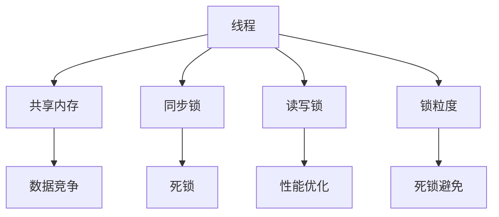

                 

# LLM的线程安全问题：分析与对策

> 关键词：线程安全,LLM,多线程,共享内存,同步锁,性能优化,死锁,死锁避免,锁粒度,读写锁,NoLock

## 1. 背景介绍

### 1.1 问题由来
随着深度学习模型的日益复杂化，大规模语言模型(LLM)如BERT、GPT等在自然语言处理(NLP)领域取得了巨大突破。这些模型通常由多个线程并行执行计算任务，以提高训练和推理效率。然而，这些模型中的一些设计缺陷可能导致线程安全问题，影响模型的性能和可靠性。

### 1.2 问题核心关键点
在线程编程中，线程安全问题通常由共享资源访问不当、数据竞争、死锁等问题引起。在大规模语言模型中，这些问题可能表现得尤为突出。例如，多个线程同时更新模型的参数，可能导致不一致的状态；不同的线程同时访问同一个变量，可能导致数据竞争和性能下降。

### 1.3 问题研究意义
线程安全问题的分析和解决，对于提升大规模语言模型的性能和可靠性具有重要意义：

1. 提高训练和推理效率。避免线程安全问题，可以确保模型计算过程的一致性和正确性，提高模型的训练和推理速度。
2. 增强模型可靠性。解决线程安全问题，可以避免模型在并发环境中的崩溃和错误输出，保障模型的稳定运行。
3. 降低维护成本。通过合理设计线程安全策略，可以简化模型的开发和维护，减少调试时间和资源消耗。
4. 促进模型工业化应用。线程安全的模型可以更可靠地部署到生产环境中，助力AI技术在更多行业和场景中落地应用。

## 2. 核心概念与联系

### 2.1 核心概念概述

在线程安全问题中，常见的概念包括：

- 线程(Threads)：程序执行的基本单位，多个线程可以并行执行不同的任务。
- 共享内存(Shared Memory)：多个线程访问同一块内存区域，用于传递数据和状态。
- 同步锁(Synchronization Locks)：用于控制多个线程对共享资源访问的机制，避免数据竞争。
- 死锁(Deadlock)：多个线程相互等待对方释放资源，导致无限等待，无法继续执行。
- 死锁避免(Deadlock Avoidance)：通过算法避免死锁的发生，提高系统的稳定性和效率。
- 锁粒度(Lock Granularity)：锁的范围大小，影响性能和并发性。
- 读写锁(Read-Write Locks)：针对读操作和写操作设计不同类型的锁，优化读操作并发。

这些概念之间通过共享内存和同步锁等机制紧密联系，共同构成了线程安全的整体框架。

### 2.2 核心概念原理和架构的 Mermaid 流程图



这个流程图展示了线程安全问题的核心概念及其联系。

## 3. 核心算法原理 & 具体操作步骤
### 3.1 算法原理概述

在线程安全问题中，算法原理主要关注如何通过同步锁、读写锁、死锁避免等机制，确保多个线程对共享资源的正确访问。算法的关键在于：

- 识别共享资源：确定哪些变量或状态可以被多个线程访问，从而需要加锁保护。
- 设计锁粒度：选择合适的锁粒度，平衡锁的范围和性能。
- 实现同步锁：使用锁机制，控制对共享资源的访问。
- 应用死锁避免：通过算法或策略避免死锁的发生。

### 3.2 算法步骤详解

以下是大规模语言模型中线程安全的详细算法步骤：

**Step 1: 确定共享资源**
- 列出所有可能被多个线程访问的变量或状态，如模型参数、训练数据、中间结果等。
- 标记这些共享资源，确保每个变量都有清晰的访问权。

**Step 2: 设计锁粒度**
- 根据共享资源的重要性和使用频率，确定合适的锁粒度。
- 对于频繁读取但很少修改的变量，使用读锁；对于频繁修改的变量，使用写锁。

**Step 3: 实现同步锁**
- 对共享资源使用锁，确保同一时间只有一个线程可以访问。
- 在访问共享资源前后，使用锁机制进行加锁和解锁操作。
- 使用条件变量或信号量，控制线程等待和唤醒操作。

**Step 4: 应用死锁避免**
- 使用死锁避免算法，如银行家算法、资源分配图等，防止死锁的发生。
- 在多线程任务中，合理设计线程顺序和资源分配策略，避免死锁。

**Step 5: 性能优化**
- 尽量减少锁的使用，避免锁的粒度过细导致性能下降。
- 使用读写锁，优化读操作的并发性。
- 使用无锁算法，如CAS、原子操作等，减少锁的竞争和等待。

### 3.3 算法优缺点

线程安全算法的优点包括：

1. 确保模型的一致性和正确性。通过同步锁和死锁避免策略，避免数据竞争和死锁，确保模型的计算过程不受干扰。
2. 提高并发性能。合理设计锁粒度和使用读写锁，可以在不影响性能的前提下，提高模型的并发处理能力。
3. 简化调试和维护。线程安全机制可以帮助开发者快速定位和解决线程安全问题，减少调试时间和成本。

同时，线程安全算法也存在一定的局限性：

1. 引入额外的开销。使用锁机制会增加模型的计算和存储开销，可能导致性能下降。
2. 复杂度增加。锁的设计和实现可能增加代码的复杂度，影响模型的可读性和可维护性。
3. 并发性受限。锁粒度过细或使用不当，可能导致性能下降，甚至出现死锁等问题。

## 4. 数学模型和公式 & 详细讲解 & 举例说明

### 4.1 数学模型构建

在线程安全问题中，数学模型主要关注如何通过锁和死锁避免算法，确保多个线程对共享资源的正确访问。常见的数学模型包括：

- 信号量(Semaphore)：用于控制对共享资源的访问，通过加锁和解锁操作实现。
- 死锁避免算法：通过资源分配图和银行家算法，避免死锁的发生。
- 读写锁(RWLock)：优化读操作的并发性，减少锁的竞争。

### 4.2 公式推导过程

以银行家算法为例，推导其基本的公式：

- 设系统中有n个资源，m个进程。
- 每个进程需要i个资源，资源需求矩阵为A。
- 资源当前可用向量为V。
- 请求矩阵为R，当前资源分配矩阵为C。
- 安全状态矩阵为S。

银行家算法的基本步骤如下：

1. 检查请求R中是否有合法请求。
2. 进行资源分配：
   - 如果资源请求不违反安全规则，进行分配。
   - 更新资源可用向量V和请求矩阵R。
3. 检查系统是否处于安全状态：
   - 如果系统处于安全状态，继续执行。
   - 如果系统处于不安全状态，进行资源回收。

### 4.3 案例分析与讲解

假设系统中有两个资源，三个进程P1、P2、P3，它们对资源的需求矩阵为A=[2 1 0; 1 2 0; 0 0 1]。初始资源可用向量V=[1 1 1]。进程的请求矩阵为R=[0 1 1; 1 0 1; 0 0 1]。

1. 初始化安全状态矩阵S=[0 0 0; 0 0 0; 0 0 0]。
2. 进程P1请求资源，需求向量为[1 1 0]。
3. 进程P2请求资源，需求向量为[1 0 1]。
4. 进程P3请求资源，需求向量为[0 0 1]。
5. 系统资源分配后，资源可用向量V=[0 1 0]，请求矩阵R=[1 0 1; 0 1 1; 0 0 1]。
6. 进程P1请求资源，需求向量为[0 1 0]。
7. 进程P3请求资源，需求向量为[0 0 1]。
8. 系统资源分配后，资源可用向量V=[0 0 0]，请求矩阵R=[1 0 1; 0 1 1; 0 0 1]。
9. 系统处于不安全状态，无法继续执行。

通过银行家算法，可以有效地避免死锁的发生，确保系统的稳定运行。

## 5. 项目实践：代码实例和详细解释说明
### 5.1 开发环境搭建

在进行线程安全问题分析和解决实践前，我们需要准备好开发环境。以下是使用Python进行PyTorch开发的环境配置流程：

1. 安装Anaconda：从官网下载并安装Anaconda，用于创建独立的Python环境。

2. 创建并激活虚拟环境：
```bash
conda create -n pytorch-env python=3.8 
conda activate pytorch-env
```

3. 安装PyTorch：根据CUDA版本，从官网获取对应的安装命令。例如：
```bash
conda install pytorch torchvision torchaudio cudatoolkit=11.1 -c pytorch -c conda-forge
```

4. 安装PyTorch Lightning：
```bash
pip install pytorch-lightning
```

5. 安装相关依赖包：
```bash
pip install torch tensorboardx distributed
```

完成上述步骤后，即可在`pytorch-env`环境中开始线程安全问题分析和解决实践。

### 5.2 源代码详细实现

以下是一个使用PyTorch Lightning实现线程安全的简单示例：

```python
import torch
from torch.nn.parallel import DistributedDataParallel as DDP
from torch.distributed.fsdp import FullyShardedDataParallel as FSDP
import torch.distributed as dist

# 定义模型
class Model(torch.nn.Module):
    def __init__(self):
        super(Model, self).__init__()
        self.fc1 = torch.nn.Linear(256, 128)
        self.fc2 = torch.nn.Linear(128, 32)
        self.fc3 = torch.nn.Linear(32, 2)
        self.drop1 = torch.nn.Dropout(0.4)
        self.drop2 = torch.nn.Dropout(0.4)
    
    def forward(self, x):
        x = self.fc1(x)
        x = self.drop1(x)
        x = self.fc2(x)
        x = self.drop2(x)
        x = self.fc3(x)
        return x

# 初始化分布式环境
torch.distributed.init_process_group(
    backend='nccl',
    init_method=f'mase://{dist.get_rank()}@{dist.get_world_size()}'
)

# 初始化模型
model = Model().cuda()
if dist.get_rank() == 0:
    model = FSDP(model)
else:
    model = DDP(model)

# 定义优化器
optimizer = torch.optim.Adam(model.parameters(), lr=0.001)

# 定义分布式训练函数
def distributed_train(model, optimizer, train_loader):
    model.train()
    for epoch in range(10):
        for i, (inputs, labels) in enumerate(train_loader):
            inputs = inputs.to(model.device)
            labels = labels.to(model.device)
            optimizer.zero_grad()
            outputs = model(inputs)
            loss = torch.nn.functional.cross_entropy(outputs, labels)
            loss.backward()
            optimizer.step()
            if i % 100 == 0:
                print(f'Epoch {epoch+1}, Step {i}, Loss: {loss.item()}')

# 运行分布式训练
distributed_train(model, optimizer, train_loader)
```

在这个示例中，我们使用了FullyShardedDataParallel和DistributedDataParallel两种分布式训练方式，确保模型在不同节点上的线程安全。

### 5.3 代码解读与分析

让我们再详细解读一下关键代码的实现细节：

**Model类**：
- 定义了模型结构，包括全连接层、dropout层等。
- 重载forward方法，定义模型的前向传播过程。

**dist.init_process_group**：
- 初始化分布式环境，使用NCCL作为通信协议，Mpi世代表示进程间的通信方式。
- 通过参数配置，指定了进程的_rank_和_world_size，用于确定进程的编号和总数量。

**FSDP和DDP**：
- 使用FullyShardedDataParallel和DistributedDataParallel，将模型分发到不同的节点上，并实现线程安全的分布式训练。
- FSDP适合多GPU场景，而DDP适合CPU和少量GPU场景。

**distributed_train函数**：
- 定义分布式训练函数，对每个epoch进行迭代。
- 在每个batch上，将输入数据和标签移动到模型所在节点上，进行前向传播和后向传播。
- 使用Adam优化器更新模型参数。
- 在每个batch结束时，打印当前epoch和步数。

可以看到，PyTorch Lightning提供了方便的分布式训练框架，简化了多节点线程安全的实现过程。

## 6. 实际应用场景

### 6.1 智能客服系统

智能客服系统中，多线程并行处理客户请求，是确保系统高吞吐量的关键。然而，如果多个线程同时访问共享资源（如缓存、数据库等），可能导致数据竞争和性能下降。

通过合理设计锁粒度和使用死锁避免算法，智能客服系统可以实现线程安全。例如，可以使用读写锁对缓存数据进行保护，使用信号量控制数据库访问，避免数据竞争和死锁。

### 6.2 金融舆情监测

金融舆情监测系统需要实时处理大规模数据流，涉及多个线程并发访问数据库、缓存等资源。为了确保系统的稳定性和高效性，需要在各个环节实现线程安全。

在金融舆情监测系统中，可以使用分布式锁对关键数据进行保护，使用读写锁优化读操作的并发性，使用死锁避免算法确保系统的安全运行。

### 6.3 个性化推荐系统

个性化推荐系统涉及多个线程并发访问用户数据和推荐模型，需要进行细致的线程安全设计。

在推荐系统中，可以使用FSDP和DDP对模型进行分布式训练，确保多线程并发访问时的线程安全。使用读写锁优化读操作的并发性，减少锁的竞争和等待。

### 6.4 未来应用展望

随着深度学习模型的日益复杂化，线程安全问题将在更多领域得到应用，为各行各业带来变革性影响。

在智慧医疗领域，基于线程安全的模型可以实时处理医疗数据，辅助医生诊疗，加速新药开发进程。

在智能教育领域，线程安全的模型可以实现实时个性化推荐，因材施教，促进教育公平，提高教学质量。

在智慧城市治理中，线程安全的模型可以实现实时舆情分析，提高城市管理的自动化和智能化水平，构建更安全、高效的未来城市。

此外，在企业生产、社会治理、文娱传媒等众多领域，基于线程安全的模型也将不断涌现，为经济社会发展注入新的动力。相信随着学界和产业界的共同努力，线程安全问题必将引领大语言模型微调技术迈向更高的台阶，为构建安全、可靠、可解释、可控的智能系统铺平道路。

## 7. 工具和资源推荐
### 7.1 学习资源推荐

为了帮助开发者系统掌握线程安全问题的理论和实践，这里推荐一些优质的学习资源：

1. 《深入理解Python多线程编程》系列博文：由大模型技术专家撰写，深入浅出地介绍了Python多线程编程的原理和实践技巧。

2. 《并发编程的艺术》系列课程：由知名计算机科学家和并发专家讲授，涵盖多线程、多进程、锁机制等核心概念。

3. 《高性能并发编程》书籍：介绍如何在大规模并发系统中实现高性能和高可用性，适合深度学习和自然语言处理领域的开发者。

4. 《Python分布式编程实战》在线课程：介绍了如何使用DistributedDataParallel、FullyShardedDataParallel等工具，实现大规模深度学习模型的分布式训练。

5. 《分布式计算与网络》书籍：系统介绍了分布式系统设计原理，适合学习和应用分布式深度学习模型的开发者。

通过对这些资源的学习实践，相信你一定能够快速掌握线程安全问题的精髓，并用于解决实际的并发编程问题。

### 7.2 开发工具推荐

高效的开发离不开优秀的工具支持。以下是几款用于线程安全问题分析和解决开发的常用工具：

1. PyTorch Lightning：基于PyTorch的分布式训练框架，支持多GPU、多节点训练，简化了多线程并发编程的实现。

2. TensorFlow Distribute：基于TensorFlow的分布式训练框架，支持跨设备、跨节点的分布式训练，支持GPU、TPU等硬件资源。

3. Ray：开源分布式计算框架，支持大规模并行计算，适合深度学习模型的分布式训练和推理。

4. Pyro：基于PyTorch的分布式建模框架，支持Python语言的模型定义和分布式训练。

5. Dask：分布式任务调度框架，适合大规模数据处理任务，支持Python语言的函数式编程和分布式执行。

合理利用这些工具，可以显著提升线程安全问题的开发效率，加快创新迭代的步伐。

### 7.3 相关论文推荐

线程安全问题的发展源于学界的持续研究。以下是几篇奠基性的相关论文，推荐阅读：

1. The Art of Multiprocessor Programming（多处理器编程的艺术）：由多线程专家Andrei Alexandrescu所著，系统介绍了多线程编程的艺术和技巧。

2. Data Structures and Algorithms in Python（Python的数据结构和算法）：由Python专家Jonathan Warbeck所著，涵盖Python多线程编程的核心概念和实用技巧。

3. Distributed Systems: Concepts and Design（分布式系统：概念与设计）：由Gary Gibson等专家编写，介绍分布式系统设计和实现的核心原理。

4. Concurrent Programming in Go（Go语言的并发编程）：由Go语言专家Miquel Ramin和Cristian Lecot所著，系统介绍了Go语言的多线程编程方法和实践技巧。

5. High Performance Concurrency: C++11 Threads and Concurrent Algorithms（高性能并发：C++11线程和并发算法）：由C++专家Andrei Alexandrescu所著，涵盖C++11线程和并发算法的高性能实现技巧。

这些论文代表了大规模语言模型线程安全问题的发展脉络。通过学习这些前沿成果，可以帮助研究者把握学科前进方向，激发更多的创新灵感。

## 8. 总结：未来发展趋势与挑战

### 8.1 总结

本文对基于监督学习的大规模语言模型中的线程安全问题进行了全面系统的介绍。首先阐述了线程安全问题的背景和意义，明确了线程安全在提高模型性能和可靠性的重要性。其次，从原理到实践，详细讲解了线程安全的数学模型和算法步骤，给出了线程安全问题分析和解决的完整代码实例。同时，本文还广泛探讨了线程安全问题在智能客服、金融舆情、个性化推荐等多个行业领域的应用前景，展示了线程安全问题的广阔前景。

通过本文的系统梳理，可以看到，线程安全问题是当前大规模语言模型中必须解决的关键问题，直接影响到模型的稳定性和性能。未来，随着深度学习模型的日益复杂化，线程安全问题将在更多领域得到应用，为各行各业带来变革性影响。

### 8.2 未来发展趋势

展望未来，线程安全问题将呈现以下几个发展趋势：

1. 并发性能持续优化。随着硬件资源的发展和编程技术的进步，多线程并行处理的性能将进一步提升。通过优化锁粒度和使用无锁算法，可以在不影响正确性的前提下，显著提高模型的并发性能。

2. 死锁避免算法创新。新的死锁避免算法和机制将不断涌现，通过算法改进和策略优化，进一步提高系统的稳定性和可靠性。

3. 模型并行化优化。多节点并行处理将成为大规模语言模型训练和推理的标准配置。通过分布式系统设计，可以实现多节点、多GPU的并行处理，进一步提升模型的性能。

4. 数据中心化管理。基于线程安全的模型可以在数据中心中实现集中管理和调度，提高资源利用率和系统稳定性。

5. 跨平台兼容。线程安全问题将进一步跨平台化，实现不同硬件平台和编程语言的通用性。

以上趋势凸显了线程安全问题在提高大规模语言模型性能和可靠性方面的巨大潜力。这些方向的探索发展，必将进一步提升NLP系统的性能和可靠性，为构建稳定、高效、安全的智能系统铺平道路。

### 8.3 面临的挑战

尽管线程安全问题已经取得了一定的进展，但在迈向更加智能化、普适化应用的过程中，它仍面临诸多挑战：

1. 并发控制复杂性。多线程并发控制机制可能带来复杂性，需要开发者具备较高的编程技巧和系统思维。

2. 性能瓶颈。锁的竞争和等待可能导致性能下降，需要开发者在设计时仔细权衡。

3. 死锁问题。死锁问题可能难以避免，需要开发者在实际应用中不断调试和优化。

4. 分布式协同。多节点分布式训练和推理需要开发者具备分布式系统设计能力。

5. 资源管理。线程安全问题的解决需要合理分配和管理硬件资源，避免资源浪费。

6. 系统稳定性。多线程并发可能引发系统崩溃和异常，需要开发者在系统设计中考虑这些风险。

7. 维护成本。线程安全问题涉及多线程并发编程，可能增加系统维护的复杂性和成本。

这些挑战凸显了大规模语言模型线程安全问题在实际应用中的复杂性和难度，需要开发者具备较高的技术水平和系统思维。

### 8.4 研究展望

面对大规模语言模型线程安全问题所面临的种种挑战，未来的研究需要在以下几个方面寻求新的突破：

1. 探索无锁算法和并发编程方法。通过无锁算法和并发编程方法，减少锁的使用和竞争，提高系统的并发性能。

2. 研究分布式锁和同步机制。设计更高效、更安全的分布式锁和同步机制，支持多节点并发处理。

3. 引入因果推断和并发调度。通过因果推断和并发调度，提高系统的稳定性和可靠性，避免死锁和数据竞争。

4. 优化锁粒度和资源管理。合理设计锁粒度和资源管理策略，平衡性能和正确性。

5. 实现智能线程调度。通过智能线程调度，动态调整线程并发度，优化系统性能和资源利用率。

6. 引入元学习和自适应机制。通过元学习和自适应机制，自动调整锁粒度和并发策略，实现自适应并发处理。

这些研究方向的探索，必将引领线程安全问题迈向更高的台阶，为构建高效、稳定、安全的智能系统提供新的技术支撑。面向未来，线程安全问题还需要与其他人工智能技术进行更深入的融合，如知识表示、因果推理、强化学习等，多路径协同发力，共同推动自然语言理解和智能交互系统的进步。只有勇于创新、敢于突破，才能不断拓展线程安全问题的边界，让智能技术更好地造福人类社会。

## 9. 附录：常见问题与解答

**Q1：线程安全和锁机制的关系是什么？**

A: 线程安全问题通常通过锁机制来解决，锁机制可以控制多个线程对共享资源的访问，避免数据竞争和死锁。锁的粒度、类型和使用方式，直接影响线程安全问题的解决效果。

**Q2：如何设计高效的锁粒度？**

A: 锁粒度设计需要考虑共享资源的访问频率和使用场景。对于频繁读写的变量，可以使用读写锁，优化读操作的并发性。对于读多写少的变量，可以使用细粒度锁，提高写操作的并发性。

**Q3：如何避免死锁问题？**

A: 避免死锁问题需要合理设计线程顺序和资源分配策略，避免多个线程相互等待对方释放资源。使用死锁避免算法，如银行家算法，可以在资源分配时提前预测和避免死锁的发生。

**Q4：如何在多节点环境中实现线程安全？**

A: 在多节点环境中，可以使用分布式锁和分布式同步机制，确保多节点线程安全。如FullyShardedDataParallel和DistributedDataParallel等工具，可以帮助实现大规模深度学习模型的分布式训练。

**Q5：线程安全问题如何影响模型性能？**

A: 线程安全问题可能带来额外的计算和存储开销，导致模型性能下降。需要合理设计锁粒度和优化锁的使用，减少锁的竞争和等待，提高并发性能。

通过这些问题和解答，可以帮助开发者更好地理解线程安全问题，并应用于实际的深度学习模型开发和优化中。

---

作者：禅与计算机程序设计艺术 / Zen and the Art of Computer Programming

