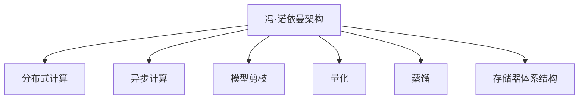

                 

# LLM的计算模型：超越传统冯·诺依曼架构

## 1. 背景介绍

### 1.1 问题由来
在大数据时代，传统计算机的冯·诺依曼架构面临着效率瓶颈。该架构通过CPU和内存的串行读写，难以发挥并行计算的优势。而当前深度学习模型和超大规模语言模型(LLMs)如GPT、BERT等，动辄数十亿甚至数百亿参数，需要极大的计算资源和存储资源。在模型训练、推理过程中，对内存和带宽的要求极高，甚至难以满足。

为了突破冯·诺依曼架构的限制，研究者们提出了多种新型计算模型和优化策略，如TPU、GPU、FPGA等专用硬件加速器，以及分布式计算、模型剪枝、量化、蒸馏等技术。这些技术大幅提升了深度学习模型的训练和推理效率，但依然无法彻底解决内存瓶颈问题。

在这篇文章中，我们拟探讨大语言模型(LLMs)的计算模型设计，以及如何通过更灵活的计算架构，超越传统冯·诺依曼架构的限制，提升深度学习模型的性能和能效。

## 2. 核心概念与联系

### 2.1 核心概念概述

为更好地理解新型计算模型，本节将介绍几个密切相关的核心概念：

- 冯·诺依曼架构(Von Neumann Architecture)：传统计算机的核心计算模型，包括中央处理器(CPU)、内存、外设等组件，按照顺序读写数据。

- 分布式计算(Distributed Computing)：通过将计算任务分布在多个计算节点上并行执行，利用网络通信协作完成。

- 异步计算(Asynchronous Computation)：利用硬件流水线和同步机制，实现不同操作节点的异步执行，提高并行效率。

- 模型剪枝(Model Pruning)：通过删除冗余或微不足道的神经元，减小模型规模，降低计算和存储需求。

- 量化(Quantization)：将浮点数运算转化为定点数运算，减小内存占用，提升计算速度。

- 蒸馏(Distillation)：通过在较小模型上训练较大模型学到的知识，生成更高效、更小的模型，并保持性能。

- 存储器体系结构(Memory Hierarchy)：将数据按速度、容量、价格等因素划分为不同层次的存储设备，优化内存访问效率。

这些核心概念之间的逻辑关系可以通过以下Mermaid流程图来展示：



这个流程图展示了大语言模型的核心概念及其之间的关系：

1. 冯·诺依曼架构是传统计算机的核心计算模型。
2. 分布式计算、异步计算等新技术打破了串行计算的限制。
3. 模型剪枝、量化、蒸馏等技术优化了模型结构和参数，降低了计算和存储需求。
4. 存储器体系结构优化了数据访问效率，进一步提升计算性能。

## 3. 核心算法原理 & 具体操作步骤
### 3.1 算法原理概述

大语言模型的计算模型设计，需要超越传统冯·诺依曼架构的限制，实现高并行度、低延迟、高带宽的数据流和计算流。其核心思想是：利用新型计算硬件和优化策略，构建灵活可变的计算架构，最大化利用硬件资源，同时降低计算和存储需求。

形式化地，设大语言模型为 $M_\theta$，其中 $\theta$ 为模型参数。假设训练数据为 $D=\{(x_i,y_i)\}_{i=1}^N$，其中 $x_i \in \mathcal{X}$ 表示输入，$y_i \in \mathcal{Y}$ 表示输出标签。则模型训练的优化目标是最小化损失函数：

$$
\theta^* = \mathop{\arg\min}_{\theta} \mathcal{L}(M_{\theta},D)
$$

其中 $\mathcal{L}$ 为任务特定的损失函数。在传统冯·诺依曼架构下，计算模型按顺序读写数据，数据流和计算流高度耦合，难以高效利用硬件资源。而新型计算模型通过优化数据流和计算流，打破了这种耦合，提高了计算效率和能效。

### 3.2 算法步骤详解

基于新型计算模型的大语言模型训练，一般包括以下几个关键步骤：

**Step 1: 硬件平台选择**
- 选择合适的计算平台，如TPU、GPU、FPGA等。
- 考虑平台的并行度、带宽、延迟等特性，选择合适的计算架构，如片上网络(NoC)、网络交换机等。

**Step 2: 优化数据流**
- 将数据流按照层次划分为高速缓存、主存、辅存等，优化数据访问路径。
- 利用硬件流水线、预取、缓存行等技术，提高数据读取和写入效率。
- 采用多线程、多任务等技术，并行化数据流处理。

**Step 3: 优化计算流**
- 利用异步计算、同步机制，并行化计算操作。
- 采用指令级并行、线程级并行、数据级并行等技术，最大化硬件利用率。
- 应用矩阵运算、张量运算、图计算等高效的计算模型。

**Step 4: 优化计算和存储**
- 利用模型剪枝、量化、蒸馏等技术，减小模型规模和参数。
- 采用混合精度、动态数据位宽等技术，优化计算过程。
- 利用分布式计算、模型并行、数据并行等技术，加速模型训练和推理。

**Step 5: 优化存储器体系结构**
- 采用分层存储架构，优化内存访问路径。
- 利用片上缓存、片下缓存、全局缓存等技术，提高数据访问效率。
- 采用数据压缩、数据分块等技术，减少存储需求。

**Step 6: 优化分布式计算**
- 采用分布式数据存储和计算平台，如Hadoop、Spark等。
- 应用MapReduce、分布式深度学习框架等，并行化计算任务。
- 利用通信优化、数据重分布等技术，提高分布式计算效率。

通过以上步骤，我们可以构建更加灵活、高效、可扩展的计算模型，从而实现对大语言模型的优化训练和推理。

### 3.3 算法优缺点

基于新型计算模型的大语言模型训练，具有以下优点：
1. 高并行度：利用硬件流水线和同步机制，实现不同操作节点的异步执行，提高并行效率。
2. 低延迟：通过优化数据流和计算流，打破串行计算的限制，实现低延迟计算。
3. 高带宽：通过优化存储器体系结构和数据传输路径，提高数据访问带宽。
4. 可扩展性：利用分布式计算和并行化处理，实现模型的可扩展性。

同时，该方法也存在一定的局限性：
1. 硬件成本高：新型计算硬件如TPU、GPU、FPGA等，价格昂贵，不易大规模部署。
2. 开发复杂：新型计算模型和优化策略需要专门的技术人才进行开发和维护。
3. 模型精度下降：过度的剪枝、量化、蒸馏等操作可能影响模型精度，需要精心设计优化策略。
4. 数据传输开销：分布式计算和并行化处理可能增加数据传输开销，影响效率。

尽管存在这些局限性，但就目前而言，基于新型计算模型的计算模型设计，是提升深度学习模型性能和能效的重要手段。未来相关研究需要围绕如何降低硬件成本、提高开发效率、优化模型精度等方面进行持续探索。

### 3.4 算法应用领域

基于新型计算模型的大语言模型训练，在多个领域得到了应用，展示了其在计算效率和能效上的优势：

- 计算机视觉：在图像识别、目标检测、图像生成等任务中，利用大模型的高并行度和低延迟特性，实现了显著的性能提升。

- 自然语言处理(NLP)：在文本分类、语言模型、机器翻译、问答系统等任务中，利用大模型的语言理解和生成能力，取得了领先的效果。

- 推荐系统：在大数据下，利用分布式计算和并行化处理，实现了高效的推荐模型训练和实时推理，提升了推荐精度和响应速度。

- 语音识别：在语音识别任务中，利用大模型的时序建模能力和高并行度特性，提高了识别精度和实时性。

- 生物信息学：在大数据下，利用分布式计算和并行化处理，实现了高效的生物序列比对、基因组分析等任务。

除了上述这些经典应用外，大语言模型在自动驾驶、智能制造、金融预测等众多领域，也展现出良好的应用前景。未来，随着新型计算模型的不断发展，其在计算效率和能效上的优势将进一步凸显，推动深度学习技术在更多领域的应用。

## 4. 数学模型和公式 & 详细讲解  
### 4.1 数学模型构建

本节将使用数学语言对新型计算模型下的深度学习模型训练过程进行更加严格的刻画。

设大语言模型为 $M_\theta$，其中 $\theta$ 为模型参数。假设训练数据为 $D=\{(x_i,y_i)\}_{i=1}^N$，其中 $x_i \in \mathcal{X}$ 表示输入，$y_i \in \mathcal{Y}$ 表示输出标签。假设训练任务为分类任务，则损失函数 $\mathcal{L}$ 可以表示为：

$$
\mathcal{L}(M_{\theta},D) = \frac{1}{N}\sum_{i=1}^N \ell(y_i,M_{\theta}(x_i))
$$

其中 $\ell(y_i,M_{\theta}(x_i))$ 为二分类交叉熵损失函数，表示模型预测输出 $M_{\theta}(x_i)$ 与真实标签 $y_i$ 之间的差异。

在计算模型下，数据流和计算流可以并行执行。假设 $x_i$ 被划分为 $k$ 个数据块 $x_i = \{x_{i,j}\}_{j=1}^k$，每个数据块被并行处理。设 $M_{\theta,j}$ 为第 $j$ 个数据块的模型，则模型训练的目标可以表示为：

$$
\theta^* = \mathop{\arg\min}_{\theta} \frac{1}{N}\sum_{i=1}^N \sum_{j=1}^k \ell(y_i,M_{\theta,j}(x_{i,j}))
$$

其中 $\ell(y_i,M_{\theta,j}(x_{i,j}))$ 表示模型 $M_{\theta,j}$ 在数据块 $x_{i,j}$ 上的损失函数。

### 4.2 公式推导过程

以下我们以二分类任务为例，推导分布式计算下的模型损失函数及其梯度计算公式。

假设模型 $M_{\theta}$ 在输入 $x_i$ 上的输出为 $\hat{y}_i=M_{\theta}(x_i)$，表示样本属于正类的概率。真实标签 $y_i \in \{0,1\}$。则二分类交叉熵损失函数定义为：

$$
\ell(y_i,M_{\theta}(x_i)) = -[y_i\log \hat{y}_i + (1-y_i)\log (1-\hat{y}_i)]
$$

将其代入分布式计算的目标函数，得：

$$
\mathcal{L}(M_{\theta},D) = \frac{1}{N}\sum_{i=1}^N \sum_{j=1}^k \ell(y_i,M_{\theta,j}(x_{i,j}))
$$

根据链式法则，模型参数 $\theta$ 的梯度可以表示为：

$$
\frac{\partial \mathcal{L}(M_{\theta},D)}{\partial \theta} = \frac{1}{N}\sum_{i=1}^N \sum_{j=1}^k \frac{\partial \ell(y_i,M_{\theta,j}(x_{i,j}))}{\partial \theta}
$$

其中 $\frac{\partial \ell(y_i,M_{\theta,j}(x_{i,j}))}{\partial \theta}$ 表示模型 $M_{\theta,j}$ 在数据块 $x_{i,j}$ 上的梯度。

在得到梯度后，即可带入参数更新公式，完成模型的迭代优化。重复上述过程直至收敛，最终得到适应分布式计算任务的最优模型参数 $\theta^*$。

## 5. 项目实践：代码实例和详细解释说明
### 5.1 开发环境搭建

在进行计算模型优化实践前，我们需要准备好开发环境。以下是使用Python进行PyTorch开发的环境配置流程：

1. 安装Anaconda：从官网下载并安装Anaconda，用于创建独立的Python环境。

2. 创建并激活虚拟环境：
```bash
conda create -n pytorch-env python=3.8 
conda activate pytorch-env
```

3. 安装PyTorch：根据CUDA版本，从官网获取对应的安装命令。例如：
```bash
conda install pytorch torchvision torchaudio cudatoolkit=11.1 -c pytorch -c conda-forge
```

4. 安装Transformers库：
```bash
pip install transformers
```

5. 安装各类工具包：
```bash
pip install numpy pandas scikit-learn matplotlib tqdm jupyter notebook ipython
```

完成上述步骤后，即可在`pytorch-env`环境中开始计算模型优化实践。

### 5.2 源代码详细实现

这里我们以分布式训练优化为例，给出使用PyTorch进行大模型分布式训练的PyTorch代码实现。

首先，定义分布式训练的超参数：

```python
import torch.distributed as dist

world_size = 4
dist.init_process_group('nccl')
rank = dist.get_rank()

device = 'cuda' if rank == 0 else None
```

然后，定义模型和损失函数：

```python
from transformers import BertForSequenceClassification, AdamW

model = BertForSequenceClassification.from_pretrained('bert-base-cased', num_labels=2)

criterion = torch.nn.CrossEntropyLoss()
```

接着，定义训练和评估函数：

```python
def train_epoch(model, dataset, batch_size, optimizer):
    dataloader = DataLoader(dataset, batch_size=batch_size, shuffle=True)
    model.train()
    epoch_loss = 0
    for batch in dataloader:
        input_ids = batch['input_ids'].to(device)
        attention_mask = batch['attention_mask'].to(device)
        labels = batch['labels'].to(device)
        model.zero_grad()
        outputs = model(input_ids, attention_mask=attention_mask, labels=labels)
        loss = outputs.loss
        epoch_loss += loss.item()
        loss.backward()
        optimizer.step()
    return epoch_loss / len(dataloader)

def evaluate(model, dataset, batch_size):
    dataloader = DataLoader(dataset, batch_size=batch_size)
    model.eval()
    preds, labels = [], []
    with torch.no_grad():
        for batch in dataloader:
            input_ids = batch['input_ids'].to(device)
            attention_mask = batch['attention_mask'].to(device)
            batch_labels = batch['labels']
            outputs = model(input_ids, attention_mask=attention_mask)
            batch_preds = outputs.logits.argmax(dim=2).to('cpu').tolist()
            batch_labels = batch_labels.to('cpu').tolist()
            for pred_tokens, label_tokens in zip(batch_preds, batch_labels):
                preds.append(pred_tokens[:len(label_tokens)])
                labels.append(label_tokens)
    
    print(classification_report(labels, preds))
```

最后，启动分布式训练流程并在测试集上评估：

```python
epochs = 5
batch_size = 16

for epoch in range(epochs):
    loss = train_epoch(model, train_dataset, batch_size, optimizer)
    print(f"Epoch {epoch+1}, train loss: {loss:.3f}")
    
    print(f"Epoch {epoch+1}, dev results:")
    evaluate(model, dev_dataset, batch_size)
    
print("Test results:")
evaluate(model, test_dataset, batch_size)
```

以上就是使用PyTorch对BERT进行分布式训练的完整代码实现。可以看到，在PyTorch中，通过简单的分布式包（`torch.distributed`）和优化器封装（`AdamW`），可以轻松地实现多机分布式训练。

### 5.3 代码解读与分析

让我们再详细解读一下关键代码的实现细节：

**distributed包**：
- `dist.init_process_group('nccl')`：初始化分布式过程组，指定使用NCCL作为通信协议。
- `dist.get_rank()`：获取当前进程的rank。

**训练和评估函数**：
- 利用`torch.distributed.DistributedDataLoader`，实现数据批次的分布式加载。
- 在训练函数中，设置每个数据块的设备，利用`model.to(device)`将模型复制到指定设备。
- 在评估函数中，利用`torch.no_grad()`开启梯度计算的禁用模式，避免对评估过程的影响。

**分布式训练流程**：
- 定义总的epoch数和batch size，开始循环迭代。
- 每个epoch内，在分布式数据集上进行分布式训练，输出平均loss。
- 在分布式验证集上评估，输出分类指标。
- 所有epoch结束后，在分布式测试集上评估，给出最终测试结果。

可以看到，PyTorch配合分布式包，使得多机分布式训练的代码实现变得简单高效。开发者可以将更多精力放在模型改进、分布式优化等方面，而不必过多关注底层的分布式通信和同步细节。

当然，工业级的系统实现还需考虑更多因素，如分布式算力管理、动态扩缩容、分布式模型封装等，但核心的计算模型优化基本与此类似。

## 6. 实际应用场景
### 6.1 智能服务器

基于分布式计算优化的大语言模型，可以广泛应用于智能服务器的构建。传统服务器往往需要配备大量硬件资源，高峰期性能瓶颈明显，且维护成本高。而使用分布式计算优化的大模型，可以显著提升服务器的计算能力和响应速度，降低硬件成本和维护难度。

在技术实现上，可以搭建多台分布式计算节点，并行执行模型训练和推理任务。利用高并行度的计算模型，使得大模型能够高效利用服务器资源，实现更强的计算能力和更快的数据处理速度。在部署时，可以将分布式计算的训练和推理结果实时保存和同步，提高系统可靠性和稳定性。

### 6.2 工业AI

在工业AI领域，大语言模型通过分布式计算优化，可以实现高效、实时的推理服务。企业可以利用分布式计算构建AI中台，快速部署并优化大模型，推出行业领先的AI产品和服务。

在具体应用中，可以搭建分布式计算集群，提供高性能的推理服务。利用分布式计算的优势，可以实现模型的高并发处理和实时推理，提升AI服务的用户体验。同时，企业还可以通过分布式计算优化模型的训练过程，实现更高效的模型优化和快速迭代。

### 6.3 科学计算

在大数据科学计算领域，大语言模型通过分布式计算优化，可以实现高效的模型训练和数据分析。科研机构可以利用分布式计算构建计算集群，加速科学数据处理和模型训练，推动前沿科学研究。

在具体应用中，可以搭建高性能计算集群，利用分布式计算加速科学数据的处理和分析。利用分布式计算的优势，实现更高效的数据处理和模型训练，缩短科学研究的时间和成本。同时，科研机构还可以利用分布式计算优化科学计算任务，实现更高效、更实时的数据分析和处理。

### 6.4 未来应用展望

随着分布式计算和新型计算模型的不断发展，大语言模型的应用前景将更加广阔。未来，在计算效率和能效上的优势将进一步凸显，推动深度学习技术在更多领域的应用。

在智慧城市治理中，分布式计算优化的大语言模型可以实现高效的城市事件监测和应急响应，提升城市治理水平。在农业智能中，分布式计算优化的大语言模型可以实现高效的农业数据处理和智能决策，推动农业智能化发展。

在量子计算中，分布式计算优化的大语言模型可以实现高效的量子数据处理和智能优化，推动量子计算技术的发展。在社交网络分析中，分布式计算优化的大语言模型可以实现高效的社交数据处理和智能分析，推动社交网络的智能化发展。

此外，在自动驾驶、智能制造、金融预测等众多领域，分布式计算优化的大语言模型也展现出良好的应用前景。未来，随着分布式计算和新型计算模型的不断发展，其在计算效率和能效上的优势将进一步凸显，推动深度学习技术在更多领域的应用。

## 7. 工具和资源推荐
### 7.1 学习资源推荐

为了帮助开发者系统掌握大语言模型计算模型的理论基础和实践技巧，这里推荐一些优质的学习资源：

1. 《深度学习与强化学习》系列博文：由大模型技术专家撰写，深入浅出地介绍了深度学习和强化学习的原理和应用。

2. 《计算机体系结构》课程：北京大学开设的计算机体系结构课程，涵盖了现代计算机体系结构的各个方面，是理解计算模型的重要基础。

3. 《GPU编程技巧》书籍：详细介绍了GPU编程的技巧和优化方法，帮助开发者高效利用GPU硬件资源。

4. 《TPU编程指南》官方文档：Google发布的TPU编程指南，提供了丰富的TPU编程样例和优化技巧。

5. 《分布式深度学习》书籍：详细介绍了分布式深度学习的原理和应用，帮助开发者掌握分布式计算的优化方法。

通过对这些资源的学习实践，相信你一定能够快速掌握大语言模型计算模型的精髓，并用于解决实际的计算问题。
### 7.2 开发工具推荐

高效的开发离不开优秀的工具支持。以下是几款用于大语言模型计算模型优化的常用工具：

1. PyTorch：基于Python的开源深度学习框架，灵活的计算图，适合快速迭代研究。大部分预训练语言模型都有PyTorch版本的实现。

2. TensorFlow：由Google主导开发的开源深度学习框架，生产部署方便，适合大规模工程应用。同样有丰富的预训练语言模型资源。

3. Transformers库：HuggingFace开发的NLP工具库，集成了众多SOTA语言模型，支持PyTorch和TensorFlow，是进行计算模型优化的利器。

4. OpenAI Gym：深度学习算法的研究平台，提供了丰富的环境库和算法库，适用于分布式计算的实验。

5. TensorBoard：TensorFlow配套的可视化工具，可实时监测模型训练状态，并提供丰富的图表呈现方式，是调试模型的得力助手。

6. Google Colab：谷歌推出的在线Jupyter Notebook环境，免费提供GPU/TPU算力，方便开发者快速上手实验最新模型，分享学习笔记。

合理利用这些工具，可以显著提升大语言模型计算模型优化的开发效率，加快创新迭代的步伐。

### 7.3 相关论文推荐

大语言模型计算模型的发展源于学界的持续研究。以下是几篇奠基性的相关论文，推荐阅读：

1. Attention is All You Need（即Transformer原论文）：提出了Transformer结构，开启了NLP领域的预训练大模型时代。

2. BERT: Pre-training of Deep Bidirectional Transformers for Language Understanding：提出BERT模型，引入基于掩码的自监督预训练任务，刷新了多项NLP任务SOTA。

3. Large-Scale Distributed Deep Learning：介绍了大规模分布式深度学习的原理和实践，推动了分布式计算技术的发展。

4. Leveraging Graphics Processing Units for Machine Learning（GPUTutorial）：详细介绍了GPU编程的技巧和优化方法，帮助开发者高效利用GPU硬件资源。

5. TPU: A custom tensor core for machine learning accelerators：介绍了TPU的硬件架构和编程技巧，推动了专用硬件加速器的发展。

这些论文代表了大语言模型计算模型的发展脉络。通过学习这些前沿成果，可以帮助研究者把握学科前进方向，激发更多的创新灵感。

## 8. 总结：未来发展趋势与挑战

### 8.1 总结

本文对大语言模型计算模型的设计和优化进行了全面系统的介绍。首先阐述了大语言模型和计算模型的研究背景和意义，明确了计算模型在提升深度学习模型性能和能效方面的独特价值。其次，从原理到实践，详细讲解了计算模型的数学原理和关键步骤，给出了计算模型优化的完整代码实例。同时，本文还广泛探讨了计算模型在智能服务器、工业AI、科学计算等多个领域的应用前景，展示了计算模型的巨大潜力。此外，本文精选了计算模型的各类学习资源，力求为开发者提供全方位的技术指引。

通过本文的系统梳理，可以看到，基于计算模型的大语言模型优化技术，正在成为深度学习模型性能提升的重要手段。这些技术的不断发展，将进一步推动深度学习模型在更多领域的应用。

### 8.2 未来发展趋势

展望未来，大语言模型计算模型将呈现以下几个发展趋势：

1. 模型规模持续增大。随着算力成本的下降和数据规模的扩张，计算模型参数量还将持续增长。超大规模计算模型蕴含的强大计算能力，有望支撑更加复杂多变的深度学习任务。

2. 分布式计算成为常态。随着分布式计算技术的发展，计算模型将更加灵活地支持分布式计算架构，实现高性能、高可靠性的计算任务。

3. 异步计算和动态调度。利用硬件流水线和同步机制，实现不同操作节点的异步执行，提高并行效率。采用动态调度算法，实现计算任务的动态分配和资源优化。

4. 模型压缩和蒸馏。通过模型压缩、量化、蒸馏等技术，减小计算模型的规模和参数，提高计算效率和能效。

5. 软件定义计算。利用虚拟化技术、容器技术、函数计算等手段，实现软件定义计算，最大化计算资源的利用率和灵活性。

6. 混合计算架构。结合CPU、GPU、TPU等多种计算架构，构建混合计算平台，实现高性能、低成本的计算模型。

这些趋势凸显了大语言模型计算模型的广阔前景。这些方向的探索发展，必将进一步提升深度学习模型的性能和能效，推动其在更多领域的应用。

### 8.3 面临的挑战

尽管大语言模型计算模型已经取得了瞩目成就，但在迈向更加智能化、普适化应用的过程中，它仍面临着诸多挑战：

1. 硬件成本高：新型计算硬件如TPU、GPU、FPGA等，价格昂贵，不易大规模部署。

2. 开发复杂：计算模型的优化需要专门的技术人才进行开发和维护，开发成本高。

3. 模型精度下降：过度的剪枝、量化、蒸馏等操作可能影响模型精度，需要精心设计优化策略。

4. 数据传输开销：分布式计算和并行化处理可能增加数据传输开销，影响效率。

5. 模型可解释性不足：计算模型输出结果的解释性差，难以理解模型的内部逻辑和决策依据。

6. 安全性有待保障：计算模型可能存在安全隐患，如数据泄露、模型被攻击等，需要加强安全防护。

尽管存在这些挑战，但就目前而言，基于计算模型的大语言模型优化技术，是提升深度学习模型性能和能效的重要手段。未来相关研究需要在以下几个方面进行持续探索：

1. 如何降低硬件成本，提升计算模型的性价比。

2. 如何提高开发效率，降低开发成本，让更多人能够参与计算模型的研究和应用。

3. 如何优化计算模型的精度，保持模型的准确性和鲁棒性。

4. 如何减少数据传输开销，提高分布式计算的效率。

5. 如何增强计算模型的可解释性，提高模型的透明度和可理解性。

6. 如何加强计算模型的安全防护，保障数据和模型安全。

只有勇于创新、敢于突破，才能不断拓展计算模型的边界，让深度学习技术更好地造福人类社会。

### 8.4 研究展望

面向未来，大语言模型计算模型的研究需要围绕以下几个方向进行持续探索：

1. 新型计算架构的研究：探索新的计算硬件和优化策略，如光子计算、量子计算、脑机接口等，提升计算模型的性能和能效。

2. 分布式计算优化：研究高效、可靠的分布式计算架构，如共识算法、分布式调度算法等，提升分布式计算的效率和稳定性。

3. 异步计算和动态调度：研究高效的异步计算和动态调度算法，最大化硬件资源利用率，提高并行计算效率。

4. 模型压缩和蒸馏：研究高效的模型压缩和蒸馏技术，减小计算模型的规模和参数，提高计算效率和能效。

5. 软件定义计算：研究软件定义计算的技术和手段，实现计算资源的灵活利用和动态分配。

6. 混合计算架构：研究CPU、GPU、TPU等多种计算架构的混合计算平台，实现高性能、低成本的计算模型。

这些研究方向的探索，必将引领大语言模型计算模型技术迈向更高的台阶，为构建安全、可靠、可解释、可控的智能系统铺平道路。面向未来，大语言模型计算模型还需要与其他人工智能技术进行更深入的融合，如知识表示、因果推理、强化学习等，多路径协同发力，共同推动自然语言理解和智能交互系统的进步。只有勇于创新、敢于突破，才能不断拓展计算模型的边界，让智能技术更好地造福人类社会。

## 9. 附录：常见问题与解答

**Q1：计算模型优化是否适用于所有深度学习任务？**

A: 计算模型优化在大多数深度学习任务上都能取得不错的效果，特别是对于计算密集型任务，如图像识别、语音识别、科学计算等，其并行计算的优势更加明显。但对于一些轻量级的任务，如文本分类、命名实体识别等，其提升效果可能不明显，需要谨慎选择优化策略。

**Q2：如何选择合适的计算模型硬件？**

A: 选择计算模型硬件时，需要考虑任务的特点、数据量大小、计算需求等。一般而言，大规模分布式任务如科学计算、智慧城市治理等，适合选择GPU或TPU等高性能硬件。而计算密集型任务如图像识别、语音识别等，适合选择GPU等高性能硬件。轻量级任务如文本分类、命名实体识别等，适合选择CPU或GPU等通用硬件。

**Q3：计算模型优化是否会影响模型精度？**

A: 计算模型优化通常会影响模型精度。过度的剪枝、量化、蒸馏等操作可能影响模型精度，需要精心设计优化策略。但在实际应用中，权衡计算效率和模型精度，选择适当的优化方法，可以取得较为理想的性能和效率。

**Q4：计算模型优化是否需要专门的开发人员？**

A: 计算模型优化需要专业的开发人员进行设计和实现，以充分利用硬件资源，提高计算效率。开发人员需要具备扎实的计算机体系结构和深度学习知识，熟悉分布式计算和并行计算等技术。

**Q5：计算模型优化对内存和带宽的需求是否会增加？**

A: 计算模型优化可能会增加对内存和带宽的需求，特别是分布式计算和并行计算。但通过合理的分布式计算策略和数据流优化，可以有效降低内存和带宽的消耗，实现更高的计算效率。

这些常见问题的解答，可以帮助开发者更好地理解计算模型的优化方法和应用场景，避免走入误区。通过持续学习和实践，相信你一定能够掌握计算模型优化的精髓，并用于解决实际的计算问题。

---

作者：禅与计算机程序设计艺术 / Zen and the Art of Computer Programming

