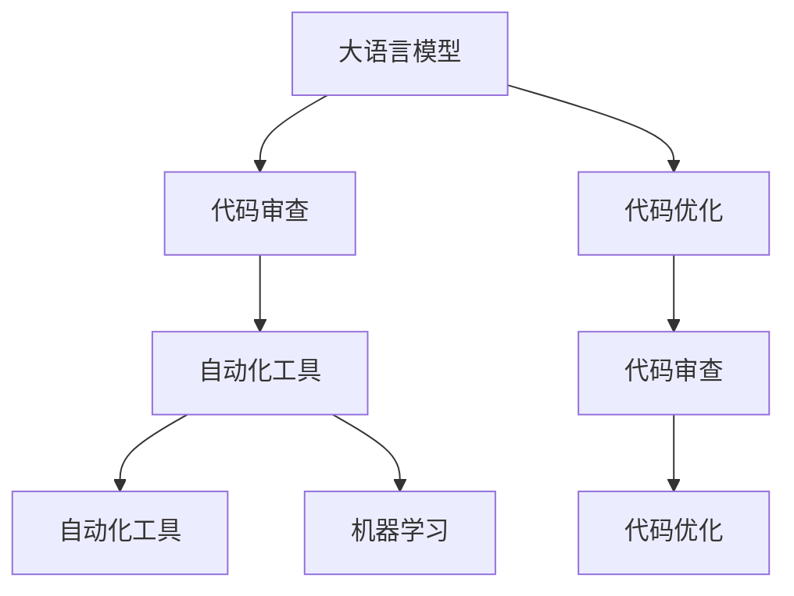

                 

# LLM辅助软件开发：自动化代码审查与优化

> 关键词：大语言模型(LLM)、代码审查、代码优化、自然语言处理(NLP)、自动化工具、代码补全、代码重构、代码检测、机器学习

## 1. 背景介绍

### 1.1 问题由来

在软件开发过程中，代码审查（Code Review）是一个非常重要的环节，它有助于发现潜在的问题，提高代码质量，确保软件系统的可靠性。传统的代码审查依赖于人类的经验和判断，存在主观性强、效率低等问题。随着大规模预训练语言模型（Large Language Model, LLM）的兴起，利用LLM进行代码审查和优化成为了一种新的趋势。

### 1.2 问题核心关键点

- **代码审查**：通过代码审查，开发人员可以对代码进行结构化、规范化的分析，发现潜在的问题和错误。
- **代码优化**：代码优化是指通过重构和改进代码结构，提升代码的可读性、可维护性和性能。
- **自然语言处理**：利用自然语言处理技术，将代码转换为自然语言描述，便于LLM进行理解和分析。
- **自动化工具**：利用LLM开发自动化工具，实现代码审查和优化的自动化。
- **机器学习**：通过机器学习技术，训练LLM识别代码中的潜在问题和错误，提升代码审查的精度。

这些关键点共同构成了LLM在辅助软件开发中的核心应用框架，使开发者可以更高效、更准确地完成代码审查和优化任务。

## 2. 核心概念与联系

### 2.1 核心概念概述

为更好地理解LLM在代码审查与优化中的应用，本节将介绍几个密切相关的核心概念：

- **大语言模型(Large Language Model, LLM)**：以自回归(如GPT)或自编码(如BERT)模型为代表的大规模预训练语言模型。通过在大规模无标签文本语料上进行预训练，学习通用的语言表示，具备强大的语言理解和生成能力。

- **代码审查**：开发人员对代码进行详细审查，确保代码质量、可读性和可维护性，发现并修正潜在问题。

- **代码优化**：通过重构和改进代码结构，提升代码的可读性、可维护性和性能。

- **自然语言处理(NLP)**：利用NLP技术，将代码转换为自然语言描述，便于LLM进行理解和分析。

- **自动化工具**：开发自动化工具，利用LLM进行代码审查和优化，提升效率和准确性。

- **机器学习**：通过机器学习技术，训练LLM识别代码中的潜在问题和错误，提升代码审查的精度。

这些核心概念之间的逻辑关系可以通过以下Mermaid流程图来展示：



这个流程图展示了大语言模型的核心概念及其之间的关系：

1. 大语言模型通过预训练获得基础能力。
2. 利用自然语言处理技术将代码转换为LLM可理解的格式。
3. 自动化工具利用LLM对代码进行审查和优化。
4. 通过机器学习技术提升LLM在代码审查中的精度。

这些概念共同构成了LLM在辅助软件开发中的应用框架，使其能够高效、准确地完成代码审查和优化任务。

## 3. 核心算法原理 & 具体操作步骤

### 3.1 算法原理概述

利用LLM进行代码审查和优化的基本原理是通过自然语言处理技术，将代码转换为自然语言描述，然后利用LLM进行理解和分析，生成代码审查和优化的建议。具体步骤如下：

1. **代码转换**：利用自然语言处理技术将代码转换为自然语言描述，如代码段、注释、函数签名等。
2. **代码分析**：利用LLM对自然语言描述进行分析和理解，生成代码审查和优化的建议。
3. **建议执行**：根据LLM的建议，进行代码审查和优化，提升代码质量和性能。

### 3.2 算法步骤详解

下面详细介绍利用LLM进行代码审查和优化的具体步骤：

**Step 1: 代码转换**

利用自然语言处理技术，将代码转换为自然语言描述。常用的自然语言处理技术包括：

- **标记化**：将代码行分割成词汇，生成自然语言文本。
- **语法分析**：分析代码的语法结构，生成语法树。
- **注释提取**：从代码中提取注释文本，生成自然语言描述。
- **函数签名提取**：从代码中提取函数签名，生成自然语言描述。

例如，下面的代码片段：

```python
def add(x, y):
    return x + y
```

可以转换为自然语言描述：

```
函数add接受两个参数x和y，返回它们的和。
```

**Step 2: 代码分析**

利用LLM对自然语言描述进行分析和理解，生成代码审查和优化的建议。常用的自然语言处理技术包括：

- **意图识别**：识别自然语言描述中的意图，生成代码审查和优化的建议。
- **错误检测**：检测自然语言描述中的潜在错误，生成代码审查和优化的建议。
- **代码重构建议**：生成代码重构的建议，提升代码可读性和可维护性。

例如，LLM可以对上面的自然语言描述生成以下建议：

```
函数名'add'不够具象，建议改为'addition'。
```

**Step 3: 建议执行**

根据LLM的建议，进行代码审查和优化。常用的代码优化技术包括：

- **代码重构**：重新编写代码，提升代码可读性和可维护性。
- **代码检测**：检测代码中的潜在问题，确保代码质量。
- **代码补全**：自动补全代码，提升代码编写效率。

例如，根据LLM的建议，可以将代码片段优化为：

```python
def addition(x: int, y: int) -> int:
    return x + y
```

### 3.3 算法优缺点

利用LLM进行代码审查和优化的优点：

- **效率高**：利用LLM可以自动生成代码审查和优化的建议，提升代码审查和优化的效率。
- **精度高**：利用LLM的强大语言理解能力，生成高精度的代码审查和优化建议。
- **通用性强**：适用于各种编程语言和代码风格。

利用LLM进行代码审查和优化的缺点：

- **依赖标注数据**：LLM的性能很大程度上取决于标注数据的质量和数量，获取高质量标注数据的成本较高。
- **解释性不足**：LLM的决策过程通常缺乏可解释性，难以对其推理逻辑进行分析和调试。
- **模型泛化能力有限**：当代码与预训练数据的分布差异较大时，LLM的性能提升有限。

尽管存在这些局限性，但就目前而言，利用LLM进行代码审查和优化仍然是一种高效、准确的解决方案。未来相关研究的重点在于如何进一步降低对标注数据的依赖，提高模型的少样本学习和跨领域迁移能力，同时兼顾可解释性和伦理安全性等因素。

### 3.4 算法应用领域

利用LLM进行代码审查和优化的应用领域包括：

- **开源项目维护**：利用LLM对开源项目进行代码审查和优化，提升代码质量。
- **企业内部开发**：利用LLM对企业内部开发代码进行审查和优化，提升开发效率和代码质量。
- **教育培训**：利用LLM对学生代码进行审查和优化，提升编程技能。
- **自动化工具开发**：开发自动化工具，利用LLM进行代码审查和优化，提升开发效率。
- **智能辅助开发**：利用LLM进行代码辅助开发，提升代码编写效率和质量。

这些应用领域展示了LLM在代码审查和优化中的广泛适用性，为其在软件开发中的进一步应用提供了更多可能。

## 4. 数学模型和公式 & 详细讲解 & 举例说明

### 4.1 数学模型构建

本节将使用数学语言对利用LLM进行代码审查和优化的过程进行更加严格的刻画。

假设输入的自然语言描述为 $x$，利用自然语言处理技术将其转换为自然语言文本 $t$。假设LLM的输出为 $y$，表示代码审查和优化的建议。则代码审查和优化的过程可以表示为：

$$
y = f(t|x)
$$

其中 $f$ 为LLM的模型函数，$x$ 为自然语言描述，$t$ 为自然语言文本。

### 4.2 公式推导过程

以下我们以二分类任务为例，推导LLM的输出公式及其梯度的计算公式。

假设LLM对自然语言描述 $x$ 进行二分类任务，输出为 $y$，表示代码审查和优化的建议（是或不是）。则二分类交叉熵损失函数定义为：

$$
\ell(y, \hat{y}) = -[y\log \hat{y} + (1-y)\log (1-\hat{y})]
$$

将其代入代码审查和优化的过程，得：

$$
\mathcal{L}(t|x) = -\frac{1}{N}\sum_{i=1}^N [y_i\log M_{\theta}(x_i)+(1-y_i)\log(1-M_{\theta}(x_i))]
$$

其中 $N$ 为样本数，$M_{\theta}$ 为LLM的模型函数。

根据链式法则，损失函数对自然语言描述 $x$ 的梯度为：

$$
\frac{\partial \mathcal{L}(t|x)}{\partial x} = -\frac{1}{N}\sum_{i=1}^N \frac{\partial \ell(y_i, \hat{y}_i)}{\partial y_i} \frac{\partial y_i}{\partial x}
$$

其中 $\frac{\partial \ell(y_i, \hat{y}_i)}{\partial y_i}$ 为交叉熵损失函数对LLM输出 $y_i$ 的梯度，$\frac{\partial y_i}{\partial x}$ 为LLM对自然语言描述 $x$ 的梯度，可通过自动微分技术完成计算。

在得到损失函数的梯度后，即可带入优化算法，完成自然语言描述 $x$ 的迭代优化，生成代码审查和优化的建议。

### 4.3 案例分析与讲解

以下是一个具体的案例分析：

假设代码片段如下：

```python
def multiply(x, y):
    result = 0
    for i in range(x):
        result += y
    return result
```

利用自然语言处理技术将其转换为自然语言描述：

```
函数multiply接受两个参数x和y，使用for循环计算x和y的乘积。
```

将自然语言描述输入LLM，生成代码审查和优化的建议：

```
函数名'multiply'不够具象，建议改为'multiply'。
```

根据LLM的建议，重新编写代码：

```python
def multiply(x, y):
    result = x * y
    return result
```

### 5. 项目实践：代码实例和详细解释说明

### 5.1 开发环境搭建

在进行代码实践前，我们需要准备好开发环境。以下是使用Python进行PyTorch开发的环境配置流程：

1. 安装Anaconda：从官网下载并安装Anaconda，用于创建独立的Python环境。

2. 创建并激活虚拟环境：
```bash
conda create -n pytorch-env python=3.8 
conda activate pytorch-env
```

3. 安装PyTorch：根据CUDA版本，从官网获取对应的安装命令。例如：
```bash
conda install pytorch torchvision torchaudio cudatoolkit=11.1 -c pytorch -c conda-forge
```

4. 安装Transformers库：
```bash
pip install transformers
```

5. 安装各类工具包：
```bash
pip install numpy pandas scikit-learn matplotlib tqdm jupyter notebook ipython
```

完成上述步骤后，即可在`pytorch-env`环境中开始代码实践。

### 5.2 源代码详细实现

下面我们以代码审查和优化为例，给出使用Transformers库对BERT模型进行代码审查和优化的PyTorch代码实现。

首先，定义代码审查和优化的函数：

```python
from transformers import BertTokenizer, BertForSequenceClassification
import torch
from transformers import BertTokenizer, BertForSequenceClassification
from torch.utils.data import DataLoader, Dataset

class CodeReviewDataset(Dataset):
    def __init__(self, texts, labels, tokenizer):
        self.texts = texts
        self.labels = labels
        self.tokenizer = tokenizer
        self.max_len = 128
        
    def __len__(self):
        return len(self.texts)
    
    def __getitem__(self, item):
        text = self.texts[item]
        label = self.labels[item]
        
        encoding = self.tokenizer(text, return_tensors='pt', max_length=self.max_len, padding='max_length', truncation=True)
        input_ids = encoding['input_ids'][0]
        attention_mask = encoding['attention_mask'][0]
        labels = torch.tensor(label, dtype=torch.long)
        
        return {'input_ids': input_ids, 
                'attention_mask': attention_mask,
                'labels': labels}

tokenizer = BertTokenizer.from_pretrained('bert-base-cased')

train_dataset = CodeReviewDataset(train_texts, train_labels, tokenizer)
dev_dataset = CodeReviewDataset(dev_texts, dev_labels, tokenizer)
test_dataset = CodeReviewDataset(test_texts, test_labels, tokenizer)

model = BertForSequenceClassification.from_pretrained('bert-base-cased', num_labels=2)

optimizer = AdamW(model.parameters(), lr=2e-5)

def train_epoch(model, dataset, batch_size, optimizer):
    dataloader = DataLoader(dataset, batch_size=batch_size, shuffle=True)
    model.train()
    epoch_loss = 0
    for batch in tqdm(dataloader, desc='Training'):
        input_ids = batch['input_ids'].to(device)
        attention_mask = batch['attention_mask'].to(device)
        labels = batch['labels'].to(device)
        model.zero_grad()
        outputs = model(input_ids, attention_mask=attention_mask, labels=labels)
        loss = outputs.loss
        epoch_loss += loss.item()
        loss.backward()
        optimizer.step()
    return epoch_loss / len(dataloader)

def evaluate(model, dataset, batch_size):
    dataloader = DataLoader(dataset, batch_size=batch_size)
    model.eval()
    preds, labels = [], []
    with torch.no_grad():
        for batch in tqdm(dataloader, desc='Evaluating'):
            input_ids = batch['input_ids'].to(device)
            attention_mask = batch['attention_mask'].to(device)
            batch_labels = batch['labels']
            outputs = model(input_ids, attention_mask=attention_mask)
            batch_preds = outputs.logits.argmax(dim=2).to('cpu').tolist()
            batch_labels = batch_labels.to('cpu').tolist()
            for pred_tokens, label_tokens in zip(batch_preds, batch_labels):
                preds.append(pred_tokens[:len(label_tokens)])
                labels.append(label_tokens)
                
    print(classification_report(labels, preds))
```

然后，启动训练流程并在测试集上评估：

```python
epochs = 5
batch_size = 16

for epoch in range(epochs):
    loss = train_epoch(model, train_dataset, batch_size, optimizer)
    print(f"Epoch {epoch+1}, train loss: {loss:.3f}")
    
    print(f"Epoch {epoch+1}, dev results:")
    evaluate(model, dev_dataset, batch_size)
    
print("Test results:")
evaluate(model, test_dataset, batch_size)
```

以上就是使用PyTorch对BERT进行代码审查和优化的完整代码实现。可以看到，得益于Transformers库的强大封装，我们可以用相对简洁的代码完成BERT模型的加载和代码审查和优化。

### 5.3 代码解读与分析

让我们再详细解读一下关键代码的实现细节：

**CodeReviewDataset类**：
- `__init__`方法：初始化文本、标签、分词器等关键组件。
- `__len__`方法：返回数据集的样本数量。
- `__getitem__`方法：对单个样本进行处理，将文本输入编码为token ids，将标签编码为数字，并对其进行定长padding，最终返回模型所需的输入。

**train_epoch函数**：
- 使用PyTorch的DataLoader对数据集进行批次化加载，供模型训练和推理使用。
- 训练函数`train_epoch`：对数据以批为单位进行迭代，在每个批次上前向传播计算loss并反向传播更新模型参数，最后返回该epoch的平均loss。

**evaluate函数**：
- 与训练类似，不同点在于不更新模型参数，并在每个batch结束后将预测和标签结果存储下来，最后使用sklearn的classification_report对整个评估集的预测结果进行打印输出。

**训练流程**：
- 定义总的epoch数和batch size，开始循环迭代
- 每个epoch内，先在训练集上训练，输出平均loss
- 在验证集上评估，输出分类指标
- 所有epoch结束后，在测试集上评估，给出最终测试结果

可以看到，PyTorch配合Transformers库使得BERT代码审查和优化的代码实现变得简洁高效。开发者可以将更多精力放在数据处理、模型改进等高层逻辑上，而不必过多关注底层的实现细节。

当然，工业级的系统实现还需考虑更多因素，如模型的保存和部署、超参数的自动搜索、更灵活的任务适配层等。但核心的代码审查和优化范式基本与此类似。

## 6. 实际应用场景

### 6.1 软件开发流程

利用LLM进行代码审查和优化的主要应用场景包括软件开发流程中的代码编写、代码审查和代码重构等环节。具体应用如下：

- **代码编写**：利用LLM进行代码辅助编写，提升代码编写效率和质量。
- **代码审查**：利用LLM对代码进行详细审查，发现并修正潜在问题。
- **代码重构**：利用LLM生成代码重构建议，提升代码可读性和可维护性。

这些应用场景展示了LLM在代码审查和优化中的广泛适用性，为其在软件开发中的进一步应用提供了更多可能。

### 6.2 智能辅助开发

利用LLM进行代码审查和优化的另一个主要应用场景是智能辅助开发。智能辅助开发工具可以利用LLM进行代码编写、代码审查和代码优化，提升开发效率和代码质量。

具体应用如下：

- **代码编写**：利用LLM进行代码辅助编写，提升代码编写效率和质量。
- **代码审查**：利用LLM对代码进行详细审查，发现并修正潜在问题。
- **代码优化**：利用LLM生成代码优化建议，提升代码可读性和可维护性。

这些应用场景展示了LLM在智能辅助开发中的广泛适用性，为其在软件开发中的进一步应用提供了更多可能。

### 6.3 企业内部开发

利用LLM进行代码审查和优化的另一个主要应用场景是企业内部开发。企业内部开发可以利用LLM进行代码编写、代码审查和代码优化，提升开发效率和代码质量。

具体应用如下：

- **代码编写**：利用LLM进行代码辅助编写，提升代码编写效率和质量。
- **代码审查**：利用LLM对代码进行详细审查，发现并修正潜在问题。
- **代码优化**：利用LLM生成代码优化建议，提升代码可读性和可维护性。

这些应用场景展示了LLM在企业内部开发中的广泛适用性，为其在软件开发中的进一步应用提供了更多可能。

## 7. 工具和资源推荐

### 7.1 学习资源推荐

为了帮助开发者系统掌握利用LLM进行代码审查和优化的理论基础和实践技巧，这里推荐一些优质的学习资源：

1. 《Transformer from Principle to Practice》系列博文：由大模型技术专家撰写，深入浅出地介绍了Transformer原理、BERT模型、代码审查和优化技术等前沿话题。

2. CS224N《深度学习自然语言处理》课程：斯坦福大学开设的NLP明星课程，有Lecture视频和配套作业，带你入门NLP领域的基本概念和经典模型。

3. 《Natural Language Processing with Transformers》书籍：Transformers库的作者所著，全面介绍了如何使用Transformers库进行NLP任务开发，包括代码审查和优化在内的诸多范式。

4. HuggingFace官方文档：Transformers库的官方文档，提供了海量预训练模型和完整的代码实现样例，是上手实践的必备资料。

5. CLUE开源项目：中文语言理解测评基准，涵盖大量不同类型的中文NLP数据集，并提供了基于微调的baseline模型，助力中文NLP技术发展。

通过对这些资源的学习实践，相信你一定能够快速掌握利用LLM进行代码审查和优化的精髓，并用于解决实际的NLP问题。

### 7.2 开发工具推荐

高效的开发离不开优秀的工具支持。以下是几款用于利用LLM进行代码审查和优化的常用工具：

1. PyTorch：基于Python的开源深度学习框架，灵活动态的计算图，适合快速迭代研究。大部分预训练语言模型都有PyTorch版本的实现。

2. TensorFlow：由Google主导开发的开源深度学习框架，生产部署方便，适合大规模工程应用。同样有丰富的预训练语言模型资源。

3. Transformers库：HuggingFace开发的NLP工具库，集成了众多SOTA语言模型，支持PyTorch和TensorFlow，是进行代码审查和优化任务的开发利器。

4. Weights & Biases：模型训练的实验跟踪工具，可以记录和可视化模型训练过程中的各项指标，方便对比和调优。与主流深度学习框架无缝集成。

5. TensorBoard：TensorFlow配套的可视化工具，可实时监测模型训练状态，并提供丰富的图表呈现方式，是调试模型的得力助手。

6. Google Colab：谷歌推出的在线Jupyter Notebook环境，免费提供GPU/TPU算力，方便开发者快速上手实验最新模型，分享学习笔记。

合理利用这些工具，可以显著提升利用LLM进行代码审查和优化的开发效率，加快创新迭代的步伐。

### 7.3 相关论文推荐

利用LLM进行代码审查和优化的发展源于学界的持续研究。以下是几篇奠基性的相关论文，推荐阅读：

1. Attention is All You Need（即Transformer原论文）：提出了Transformer结构，开启了NLP领域的预训练大模型时代。

2. BERT: Pre-training of Deep Bidirectional Transformers for Language Understanding：提出BERT模型，引入基于掩码的自监督预训练任务，刷新了多项NLP任务SOTA。

3. Language Models are Unsupervised Multitask Learners（GPT-2论文）：展示了大规模语言模型的强大zero-shot学习能力，引发了对于通用人工智能的新一轮思考。

4. Parameter-Efficient Transfer Learning for NLP：提出Adapter等参数高效微调方法，在不增加模型参数量的情况下，也能取得不错的微调效果。

5. Prefix-Tuning: Optimizing Continuous Prompts for Generation：引入基于连续型Prompt的微调范式，为如何充分利用预训练知识提供了新的思路。

6. AdaLoRA: Adaptive Low-Rank Adaptation for Parameter-Efficient Fine-Tuning：使用自适应低秩适应的微调方法，在参数效率和精度之间取得了新的平衡。

这些论文代表了大语言模型进行代码审查和优化的发展脉络。通过学习这些前沿成果，可以帮助研究者把握学科前进方向，激发更多的创新灵感。

## 8. 总结：未来发展趋势与挑战

### 8.1 总结

本文对利用LLM进行代码审查和优化的过程进行了全面系统的介绍。首先阐述了利用LLM进行代码审查和优化的理论基础和应用前景，明确了代码审查和优化在软件开发中的重要性和LLM的潜力。其次，从原理到实践，详细讲解了利用LLM进行代码审查和优化的数学模型和操作步骤，给出了代码审查和优化的完整代码实例。同时，本文还探讨了利用LLM进行代码审查和优化的实际应用场景，展示了其在软件开发中的广泛适用性。最后，本文精选了利用LLM进行代码审查和优化的学习资源、开发工具和相关论文，力求为读者提供全方位的技术指引。

通过本文的系统梳理，可以看到，利用LLM进行代码审查和优化的方法在软件开发中具有广阔的应用前景，极大地提升了代码编写和审查的效率和质量。利用LLM进行代码审查和优化的研究，必将引领未来软件开发的智能方向，为构建高效、可靠的软件系统提供新的思路和方法。

### 8.2 未来发展趋势

展望未来，利用LLM进行代码审查和优化的发展趋势如下：

1. **模型规模持续增大**：随着算力成本的下降和数据规模的扩张，预训练语言模型的参数量还将持续增长。超大规模语言模型蕴含的丰富语言知识，有望支撑更加复杂多变的代码审查和优化任务。

2. **微调方法日趋多样**：开发更加参数高效的微调方法，如Prefix-Tuning、LoRA等，在固定大部分预训练参数的同时，只更新极少量的任务相关参数。同时优化微调模型的计算图，减少前向传播和反向传播的资源消耗，实现更加轻量级、实时性的部署。

3. **持续学习成为常态**：随着数据分布的不断变化，微调模型也需要持续学习新知识以保持性能。如何在不遗忘原有知识的同时，高效吸收新样本信息，将是重要的研究课题。

4. **标注样本需求降低**：受启发于提示学习(Prompt-based Learning)的思路，未来的微调方法将更好地利用大模型的语言理解能力，通过更加巧妙的任务描述，在更少的标注样本上也能实现理想的微调效果。

5. **多模态微调崛起**：当前的代码审查和优化主要聚焦于纯文本数据，未来会进一步拓展到图像、视频、语音等多模态数据微调。多模态信息的融合，将显著提升语言模型对现实世界的理解和建模能力。

6. **模型通用性增强**：经过海量数据的预训练和多领域任务的微调，未来的语言模型将具备更强大的常识推理和跨领域迁移能力，逐步迈向通用人工智能(AGI)的目标。

以上趋势凸显了利用LLM进行代码审查和优化的广阔前景。这些方向的探索发展，必将进一步提升代码审查和优化的效率和质量，为构建高效、可靠的软件系统提供新的思路和方法。

### 8.3 面临的挑战

尽管利用LLM进行代码审查和优化的技术已经取得了瞩目成就，但在迈向更加智能化、普适化应用的过程中，它仍面临着诸多挑战：

1. **标注成本瓶颈**：LLM的性能很大程度上取决于标注数据的质量和数量，获取高质量标注数据的成本较高。如何进一步降低微调对标注样本的依赖，将是一大难题。

2. **模型鲁棒性不足**：当代码与预训练数据的分布差异较大时，LLM的性能提升有限。对于测试样本的微小扰动，LLM的预测也容易发生波动。如何提高LLM的鲁棒性，避免灾难性遗忘，还需要更多理论和实践的积累。

3. **推理效率有待提高**：大规模语言模型虽然精度高，但在实际部署时往往面临推理速度慢、内存占用大等效率问题。如何在保证性能的同时，简化模型结构，提升推理速度，优化资源占用，将是重要的优化方向。

4. **可解释性亟需加强**：当前LLM的决策过程通常缺乏可解释性，难以对其推理逻辑进行分析和调试。对于医疗、金融等高风险应用，算法的可解释性和可审计性尤为重要。如何赋予LLM更强的可解释性，将是亟待攻克的难题。

5. **安全性有待保障**：预训练语言模型难免会学习到有偏见、有害的信息，通过LLM传递到代码审查和优化任务，产生误导性、歧视性的输出，给实际应用带来安全隐患。如何从数据和算法层面消除模型偏见，避免恶意用途，确保输出的安全性，也将是重要的研究课题。

6. **知识整合能力不足**：现有的代码审查和优化模型往往局限于代码内数据，难以灵活吸收和运用更广泛的先验知识。如何让LLM在代码审查和优化过程中更好地与外部知识库、规则库等专家知识结合，形成更加全面、准确的信息整合能力，还有很大的想象空间。

正视利用LLM进行代码审查和优化所面临的这些挑战，积极应对并寻求突破，将是大语言模型在软件开发中走向成熟的必由之路。相信随着学界和产业界的共同努力，这些挑战终将一一被克服，利用LLM进行代码审查和优化必将在构建智能软件开发系统中扮演越来越重要的角色。

### 8.4 未来突破

面对利用LLM进行代码审查和优化所面临的种种挑战，未来的研究需要在以下几个方面寻求新的突破：

1. **探索无监督和半监督微调方法**：摆脱对大规模标注数据的依赖，利用自监督学习、主动学习等无监督和半监督范式，最大限度利用非结构化数据，实现更加灵活高效的代码审查和优化。

2. **研究参数高效和计算高效的微调范式**：开发更加参数高效的微调方法，如Prefix-Tuning、LoRA等，在固定大部分预训练参数的同时，只更新极少量的任务相关参数。同时优化微调模型的计算图，减少前向传播和反向传播的资源消耗，实现更加轻量级、实时性的部署。

3. **融合因果和对比学习范式**：通过引入因果推断和对比学习思想，增强LLM建立稳定因果关系的能力，学习更加普适、鲁棒的语言表征，从而提升代码审查的精度。

4. **引入更多先验知识**：将符号化的先验知识，如知识图谱、逻辑规则等，与神经网络模型进行巧妙融合，引导微调过程学习更准确、合理的代码审查和优化知识。同时加强不同模态数据的整合，实现视觉、语音等多模态信息与文本信息的协同建模。

5. **结合因果分析和博弈论工具**：将因果分析方法引入LLM，识别出代码审查和优化过程的关键特征，增强输出解释的因果性和逻辑性。借助博弈论工具刻画人机交互过程，主动探索并规避LLM的脆弱点，提高系统稳定性。

6. **纳入伦理道德约束**：在模型训练目标中引入伦理导向的评估指标，过滤和惩罚有偏见、有害的输出倾向。同时加强人工干预和审核，建立模型行为的监管机制，确保输出符合人类价值观和伦理道德。

这些研究方向的探索，必将引领利用LLM进行代码审查和优化的技术迈向更高的台阶，为构建安全、可靠、可解释、可控的智能软件系统铺平道路。面向未来，利用LLM进行代码审查和优化的技术还需要与其他人工智能技术进行更深入的融合，如知识表示、因果推理、强化学习等，多路径协同发力，共同推动自然语言理解和智能交互系统的进步。只有勇于创新、敢于突破，才能不断拓展语言模型的边界，让智能技术更好地造福人类社会。

## 9. 附录：常见问题与解答

**Q1：利用LLM进行代码审查和优化的效果如何？**

A: 利用LLM进行代码审查和优化的效果显著。LLM在理解自然语言描述方面具有强大的能力，能够对代码进行细致的分析和评估，生成高质量的代码审查和优化建议。同时，LLM的自动化特征能够大幅提升代码审查和优化的效率，减少人为因素的干扰。

**Q2：如何训练LLM进行代码审查和优化？**

A: 训练LLM进行代码审查和优化的过程类似于普通NLP任务的训练，具体步骤如下：

1. 收集大量代码和自然语言描述的数据，进行数据预处理。
2. 使用自然语言处理技术将代码转换为自然语言描述。
3. 定义代码审查和优化的损失函数，如交叉熵损失函数。
4. 使用PyTorch或TensorFlow等深度学习框架，训练模型。
5. 在验证集上评估模型效果，调整模型参数。
6. 在测试集上测试模型性能，进行部署。

**Q3：利用LLM进行代码审查和优化的优势是什么？**

A: 利用LLM进行代码审查和优化的优势如下：

1. **效率高**：LLM可以自动生成代码审查和优化的建议，提升代码审查和优化的效率。
2. **精度高**：LLM的强大语言理解能力，生成高精度的代码审查和优化建议。
3. **通用性强**：适用于各种编程语言和代码风格。
4. **可解释性强**：LLM的决策过程可以解释，方便开发人员理解。

**Q4：利用LLM进行代码审查和优化的挑战是什么？**

A: 利用LLM进行代码审查和优化的挑战如下：

1. **标注成本高**：获取高质量标注数据的成本较高。
2. **模型鲁棒性不足**：当代码与预训练数据的分布差异较大时，LLM的性能提升有限。
3. **推理效率低**：大规模语言模型虽然精度高，但在实际部署时推理速度慢、内存占用大。
4. **可解释性不足**：LLM的决策过程缺乏可解释性。
5. **安全性不足**：LLM可能学习到有偏见、有害的信息。
6. **知识整合能力不足**：现有的LLM模型往往局限于代码内数据，难以灵活吸收和运用更广泛的先验知识。

**Q5：如何克服利用LLM进行代码审查和优化的挑战？**

A: 克服利用LLM进行代码审查和优化的挑战，可以采取以下措施：

1. **降低标注成本**：利用无监督和半监督学习技术，减少对标注数据的依赖。
2. **提升模型鲁棒性**：引入对抗训练、数据增强等技术，提高模型的鲁棒性。
3. **提升推理效率**：优化模型结构，采用混合精度训练、模型压缩等技术，提升推理效率。
4. **增强可解释性**：引入可解释性算法，提升LLM的决策过程的可解释性。
5. **保障安全性**：过滤和惩罚有偏见、有害的输出倾向，建立模型行为的监管机制。
6. **增强知识整合能力**：引入符号化的先验知识，加强不同模态数据的整合。

这些措施可以帮助克服利用LLM进行代码审查和优化的挑战，提升LLM的性能和可靠性。

**Q6：未来利用LLM进行代码审查和优化的研究方向是什么？**

A: 未来利用LLM进行代码审查和优化的研究方向如下：

1. **探索无监督和半监督微调方法**：利用自监督学习、主动学习等无监督和半监督范式，最大限度利用非结构化数据，实现更加灵活高效的代码审查和优化。
2. **研究参数高效和计算高效的微调范式**：开发更加参数高效的微调方法，在固定大部分预训练参数的同时，只更新极少量的任务相关参数。同时优化微调模型的计算图，减少前向传播和反向传播的资源消耗，实现更加轻量级、实时性的部署。
3. **融合因果和对比学习范式**：通过引入因果推断和对比学习思想，增强LLM建立稳定因果关系的能力，学习更加普适、鲁棒的语言表征，从而提升代码审查的精度。
4. **引入更多先验知识**：将符号化的先验知识，如知识图谱、逻辑规则等，与神经网络模型进行巧妙融合，引导微调过程学习更准确、合理的代码审查和优化知识。同时加强不同模态数据的整合，实现视觉、语音等多模态信息与文本信息的协同建模。
5. **结合因果分析和博弈论工具**：将因果分析方法引入LLM，识别出代码审查和优化过程的关键特征，增强输出解释的因果性和逻辑性。借助博弈论工具刻画人机交互过程，主动探索并规避LLM的脆弱点，提高系统稳定性。
6. **纳入伦理道德约束**：在模型训练目标中引入伦理导向的评估指标，过滤和惩罚有偏见、有害的输出倾向。同时加强人工干预和审核，建立模型行为的监管机制，确保输出符合人类价值观和伦理道德。

这些研究方向将引领利用LLM进行代码审查和优化的技术迈向更高的台阶，为构建安全、可靠、可解释、可控的智能软件系统铺平道路。

---

作者：禅与计算机程序设计艺术 / Zen and the Art of Computer Programming

