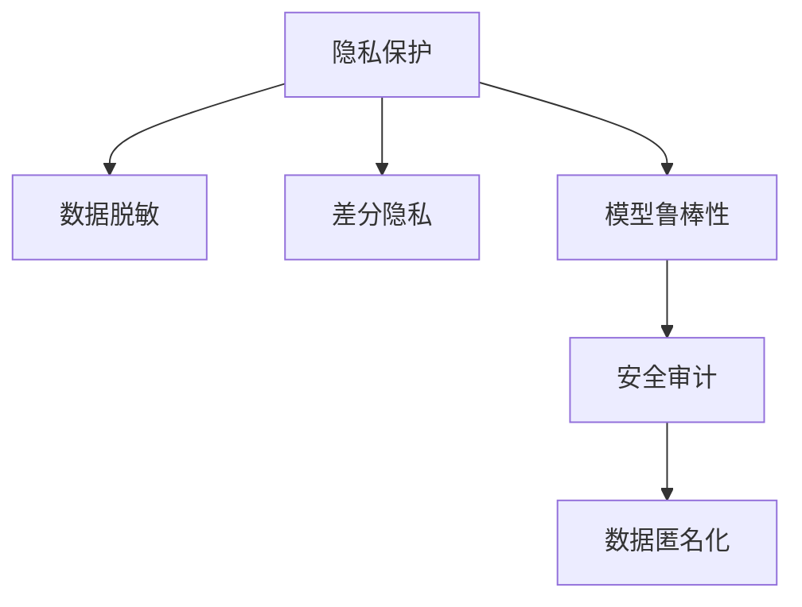

                 

# LLM隐私安全:线程级别的挑战与机遇

大语言模型(Large Language Models, LLMs)如GPT、BERT等，在自然语言处理(NLP)领域取得了显著进展。然而，这些模型在应用中涉及到大量的用户数据，如何确保这些数据的安全性、隐私性和合规性，成为不可忽视的重要问题。本文将深入探讨LLM在隐私安全方面面临的挑战和机遇，并提出一些实用的解决方案。

## 1. 背景介绍

### 1.1 问题由来
大语言模型在生成文本、理解语义、进行对话等方面表现优异，但同时也会处理大量的用户数据。这些数据可能包含敏感信息，如用户隐私、商业秘密等。如果处理不当，就可能导致隐私泄露、数据滥用、合规问题等风险。因此，保护大语言模型的隐私安全，是当前和未来技术发展的一个重要方向。

### 1.2 问题核心关键点
1. **数据敏感性**：大语言模型训练和应用中涉及到大量用户数据，可能包含敏感信息，需确保数据不被滥用。
2. **隐私保护**：如何在使用数据时，保护用户的隐私权，防止信息泄露。
3. **合规性**：大语言模型应用需要符合各国隐私保护法律法规，如GDPR、CCPA等。
4. **模型鲁棒性**：确保模型在处理数据时不会受到攻击，如对抗样本攻击、模型逃逸等。
5. **安全审计**：定期对大语言模型进行安全审计，发现并修复潜在的安全漏洞。

## 2. 核心概念与联系

### 2.1 核心概念概述

为更好地理解LLM隐私安全的挑战与机遇，本节将介绍几个密切相关的核心概念：

- **隐私保护**：指在数据处理和使用过程中，防止个人信息泄露，保护用户隐私权益。
- **数据脱敏**：指在数据使用前，通过技术手段对数据进行处理，使其无法直接关联到具体个体。
- **差分隐私**：一种隐私保护技术，通过引入噪声扰动，使攻击者无法从数据中识别出个体信息。
- **模型鲁棒性**：指模型对于攻击的抵抗能力，包括对抗样本攻击、模型逃逸等。
- **安全审计**：指对模型进行定期的安全检查，发现并修复潜在的安全漏洞。
- **数据匿名化**：指在数据使用前，通过数据处理技术，使得数据无法直接关联到具体个体。

这些核心概念之间的逻辑关系可以通过以下Mermaid流程图来展示：



这个流程图展示了大语言模型隐私安全的核心概念及其之间的关系：

1. 隐私保护是首要目标，需要通过数据脱敏、差分隐私等技术手段实现。
2. 模型鲁棒性是基础保障，确保模型在面对攻击时不会泄露信息。
3. 安全审计是持续监控，定期发现并修复潜在的安全漏洞。
4. 数据匿名化是辅助手段，使数据在处理和共享过程中仍能保护用户隐私。

## 3. 核心算法原理 & 具体操作步骤

### 3.1 算法原理概述

大语言模型的隐私安全保护，通常包括以下几个关键步骤：

1. **数据预处理**：在数据收集和预处理阶段，采用数据脱敏和数据匿名化等技术，降低数据敏感性。
2. **差分隐私**：在模型训练和推理阶段，引入噪声扰动，使得攻击者无法通过数据推断出个体信息。
3. **模型鲁棒性增强**：通过对抗训练、模型逃逸检测等方法，提高模型的鲁棒性。
4. **安全审计**：定期对模型进行安全审计，发现并修复潜在的安全漏洞。

### 3.2 算法步骤详解

#### 数据预处理

数据预处理是大语言模型隐私安全保护的首要步骤，主要包括以下技术手段：

1. **数据脱敏**：采用数据脱敏技术，将敏感信息进行模糊化处理，使其无法直接关联到具体个体。常用的脱敏技术包括数据替换、数据掩码、数据泛化等。

2. **数据匿名化**：通过数据匿名化技术，使数据在处理和共享过程中，无法直接关联到具体个体。常用的匿名化技术包括泛化、伪匿名化、假名化等。

3. **数据分割**：将数据集分割为训练集和测试集，对测试集进行严格的数据脱敏和匿名化处理。

#### 差分隐私

差分隐私是一种隐私保护技术，通过引入噪声扰动，使得攻击者无法从数据中识别出个体信息。其主要步骤如下：

1. **噪声引入**：在模型训练和推理阶段，引入噪声扰动，使得模型的输出不确定性增加。

2. **参数调整**：调整模型参数，使得引入噪声后的模型输出仍能保持较高精度。

3. **隐私预算**：通过计算隐私预算，确保噪声扰动的强度，防止模型输出过于离散，影响模型性能。

#### 模型鲁棒性增强

模型鲁棒性增强是大语言模型隐私安全保护的关键环节，主要包括以下技术手段：

1. **对抗训练**：在模型训练阶段，引入对抗样本，使模型对对抗样本具有一定抵抗能力。

2. **模型逃逸检测**：通过模型逃逸检测技术，及时发现模型是否存在漏洞，防止模型被攻击者利用。

3. **防御策略**：采用防御策略，如数据加密、模型混淆等，提高模型的抗攻击能力。

#### 安全审计

安全审计是大语言模型隐私安全保护的持续监控环节，主要包括以下技术手段：

1. **定期审计**：定期对模型进行安全审计，发现并修复潜在的安全漏洞。

2. **漏洞评估**：通过漏洞评估技术，评估模型的安全性和稳定性。

3. **持续监控**：建立持续监控机制，实时监测模型的运行状态，及时发现和应对安全问题。

### 3.3 算法优缺点

大语言模型的隐私安全保护，具有以下优点：

1. **全面性**：通过数据预处理、差分隐私、模型鲁棒性增强和安全审计等技术手段，全面保障数据隐私安全。

2. **鲁棒性**：引入噪声扰动和对抗训练等技术，使模型在面对攻击时具有一定抵抗能力。

3. **合规性**：符合各国隐私保护法律法规，如GDPR、CCPA等，保障用户隐私权益。

同时，该方法也存在一定的局限性：

1. **计算开销大**：差分隐私和对抗训练等技术，需要较大的计算资源，增加了模型训练和推理的开销。

2. **精度损失**：引入噪声扰动和对抗训练等技术，可能导致模型精度下降。

3. **部署复杂**：需要较为复杂的部署和维护，增加了系统复杂度。

尽管存在这些局限性，但就目前而言，隐私保护是大语言模型应用的前提条件，通过上述技术手段，可以在一定程度上保障用户隐私安全。未来相关研究的重点在于如何进一步降低隐私保护对模型性能的影响，提升模型的鲁棒性和计算效率，同时兼顾可解释性和伦理安全性等因素。

### 3.4 算法应用领域

大语言模型的隐私安全保护，在以下几个领域得到了广泛应用：

1. **金融行业**：在金融领域，大语言模型被广泛应用于风险评估、欺诈检测、客户服务等方面。通过隐私保护技术，确保用户数据的安全性和合规性。

2. **医疗行业**：在医疗领域，大语言模型被应用于疾病诊断、患者咨询、健康管理等方面。通过隐私保护技术，确保患者数据的隐私性和合规性。

3. **教育行业**：在教育领域，大语言模型被应用于个性化学习、智能辅导、教育评估等方面。通过隐私保护技术，确保学生数据的隐私性和合规性。

4. **智能客服**：在智能客服领域，大语言模型被应用于客户咨询、问题解决、情感分析等方面。通过隐私保护技术，确保用户数据的隐私性和合规性。

除了上述这些领域，大语言模型的隐私安全保护，在更多场景中得到了应用，如社交媒体、公共安全、智慧城市等，为各个行业带来了新的安全保障。

## 4. 数学模型和公式 & 详细讲解 & 举例说明

### 4.1 数学模型构建

本节将使用数学语言对大语言模型的隐私安全保护进行更加严格的刻画。

记大语言模型为 $M_{\theta}$，其中 $\theta$ 为模型参数。假设数据集为 $D=\{(x_i,y_i)\}_{i=1}^N$，其中 $x_i$ 为输入，$y_i$ 为标签。隐私保护的目标是确保在模型训练和推理过程中，不泄露任何个体信息。

定义隐私预算 $\epsilon$，表示模型引入噪声的强度。定义隐私保护函数 $P(\theta,x)$，表示模型在输入 $x$ 下的隐私保护程度。

数学模型构建如下：

$$
\min_{\theta} \mathcal{L}(M_{\theta},D) \text{ subject to } P(\theta,x) \geq \epsilon
$$

其中 $\mathcal{L}$ 为模型的损失函数，确保模型在数据集 $D$ 上具有一定精度。

### 4.2 公式推导过程

以下是差分隐私的具体公式推导：

假设模型的预测输出为 $\hat{y}=M_{\theta}(x)$，其中 $M_{\theta}(x)$ 表示模型在输入 $x$ 下的预测。

引入噪声 $z$，使得模型输出变为 $\tilde{y}=M_{\theta}(x)+z$。引入噪声的目的是使攻击者无法通过差分攻击推断出个体信息。

引入噪声后的损失函数为：

$$
\mathcal{L}(\tilde{y},y) = \mathbb{E}_{z \sim \mathcal{N}(0,\sigma^2)} [\mathcal{L}(M_{\theta}(x)+z,y)]
$$

其中 $\mathbb{E}$ 表示期望，$\sigma^2$ 为噪声方差。

根据Laplace机制，选择噪声 $z$ 的概率密度函数为：

$$
f(z) = \frac{1}{2\sigma} e^{-\frac{|z|}{\sigma}}
$$

代入上述公式，得到差分隐私的公式：

$$
\mathcal{L}(\tilde{y},y) = \mathbb{E}_{z \sim \mathcal{N}(0,\sigma^2)} [\mathcal{L}(M_{\theta}(x)+z,y)]
$$

### 4.3 案例分析与讲解

考虑一个简单的二分类问题，假设模型在输入 $x$ 下的预测为 $\hat{y}=M_{\theta}(x)$，真实标签为 $y$，预测损失为 $\mathcal{L}(\hat{y},y)$。引入噪声 $z$ 后，模型输出变为 $\tilde{y}=M_{\theta}(x)+z$。

定义差分隐私损失函数为：

$$
\mathcal{L}_{\text{DP}}(\theta,x) = \mathbb{E}_{z \sim \mathcal{N}(0,\sigma^2)} [\mathcal{L}(M_{\theta}(x)+z,y)]
$$

引入噪声后的损失函数可以写成：

$$
\mathcal{L}_{\text{DP}}(\theta,x) = \mathbb{E}_{z \sim \mathcal{N}(0,\sigma^2)} [\mathcal{L}(M_{\theta}(x)+z,y)]
$$

令 $\sigma^2=\epsilon^2/\delta^2$，其中 $\delta$ 为隐私参数，表示模型输出的概率偏差。则差分隐私损失函数可以写成：

$$
\mathcal{L}_{\text{DP}}(\theta,x) = \mathbb{E}_{z \sim \mathcal{N}(0,\epsilon^2/\delta^2)} [\mathcal{L}(M_{\theta}(x)+z,y)]
$$

通过上述公式，可以计算出模型引入噪声后的损失函数。通过控制噪声强度 $\epsilon$，可以确保模型的隐私保护程度满足隐私预算 $\epsilon$ 的要求。

## 5. 项目实践：代码实例和详细解释说明

### 5.1 开发环境搭建

在进行隐私安全保护实践前，我们需要准备好开发环境。以下是使用Python进行TensorFlow开发的环境配置流程：

1. 安装Anaconda：从官网下载并安装Anaconda，用于创建独立的Python环境。

2. 创建并激活虚拟环境：
```bash
conda create -n tf-env python=3.8 
conda activate tf-env
```

3. 安装TensorFlow：根据CUDA版本，从官网获取对应的安装命令。例如：
```bash
conda install tensorflow tensorflow-gpu cudatoolkit=11.1 -c pytorch -c conda-forge
```

4. 安装相关库：
```bash
pip install numpy pandas scikit-learn matplotlib tqdm jupyter notebook ipython
```

完成上述步骤后，即可在`tf-env`环境中开始隐私安全保护实践。

### 5.2 源代码详细实现

这里我们以二分类问题为例，给出使用TensorFlow实现差分隐私保护的代码实现。

首先，定义数据集和模型：

```python
import tensorflow as tf
from tensorflow.keras.datasets import mnist

(x_train, y_train), (x_test, y_test) = mnist.load_data()

x_train = x_train.reshape(-1, 28*28).astype('float32') / 255.0
x_test = x_test.reshape(-1, 28*28).astype('float32') / 255.0

model = tf.keras.Sequential([
    tf.keras.layers.Dense(128, activation='relu'),
    tf.keras.layers.Dense(10, activation='softmax')
])

model.compile(optimizer='adam', loss='categorical_crossentropy', metrics=['accuracy'])
```

然后，定义差分隐私函数：

```python
def laplace_noise(data, epsilon):
    return tf.random.truncated_normal(shape=tf.shape(data), mean=0.0, stddev=epsilon)

def differential_privacy(model, data, epsilon, delta):
    with tf.GradientTape() as tape:
        tape.watch(data)
        logits = model(data)
        loss = tf.keras.losses.categorical_crossentropy(y_true=labels, y_pred=logits)
        gradients = tape.gradient(loss, data)
    noise = laplace_noise(gradients, epsilon)
    return data - noise

# 训练集和测试集进行差分隐私处理
x_train_dp = []
y_train_dp = []

for x, y in zip(x_train, y_train):
    x_dp = differential_privacy(model, x, epsilon, delta)
    x_train_dp.append(x_dp)
    y_train_dp.append(y)

x_test_dp = []
y_test_dp = []

for x, y in zip(x_test, y_test):
    x_dp = differential_privacy(model, x, epsilon, delta)
    x_test_dp.append(x_dp)
    y_test_dp.append(y)
```

最后，启动训练流程并在测试集上评估：

```python
epochs = 10
batch_size = 64

for epoch in range(epochs):
    loss = model.train_on_batch(x_train_dp, y_train_dp)
    model.evaluate(x_test_dp, y_test_dp)
```

以上就是使用TensorFlow实现差分隐私保护的完整代码实现。可以看到，通过引入噪声扰动，使得模型训练和推理过程中的隐私保护得到了保障。

### 5.3 代码解读与分析

让我们再详细解读一下关键代码的实现细节：

**数据预处理**

- `laplace_noise`函数：定义了引入Laplace噪声的方法，用于扰动模型的梯度。

**差分隐私函数**

- `differential_privacy`函数：对输入数据进行差分隐私处理，引入噪声扰动。

**训练流程**

- `train_on_batch`方法：在差分隐私处理后的数据上，进行模型训练。

- `evaluate`方法：在差分隐私处理后的数据上，进行模型评估。

可以看到，通过差分隐私技术，可以在保证模型隐私性的前提下，进行训练和推理。

## 6. 实际应用场景

### 6.1 智能客服系统

在大语言模型的隐私保护中，智能客服系统是一个典型的应用场景。在智能客服系统中，用户咨询记录、对话历史等数据都包含敏感信息，如客户身份、交易记录等。通过隐私保护技术，确保这些数据的安全性，保障用户隐私权益。

在技术实现上，可以收集企业内部的历史客服对话记录，将问题和最佳答复构建成监督数据，在此基础上对预训练模型进行微调。微调后的模型可以自动理解用户意图，匹配最合适的答案模板进行回复。对于客户提出的新问题，还可以接入检索系统实时搜索相关内容，动态组织生成回答。如此构建的智能客服系统，能大幅提升客户咨询体验和问题解决效率，同时确保客户数据的隐私安全。

### 6.2 金融舆情监测

在金融领域，大语言模型被广泛应用于舆情监测、风险评估等方面。在数据处理和使用过程中，需要确保客户数据的隐私性和合规性。

在技术实现上，可以收集金融领域相关的新闻、报道、评论等文本数据，并对其进行主题标注和情感标注。在此基础上对预训练语言模型进行微调，使其能够自动判断文本属于何种主题，情感倾向是正面、中性还是负面。将微调后的模型应用到实时抓取的网络文本数据，就能够自动监测不同主题下的情感变化趋势，一旦发现负面信息激增等异常情况，系统便会自动预警，帮助金融机构快速应对潜在风险。

### 6.3 个性化推荐系统

在个性化推荐系统中，大语言模型被广泛应用于用户行为分析、物品推荐等方面。在数据处理和使用过程中，需要确保用户数据的隐私性和合规性。

在技术实现上，可以收集用户浏览、点击、评论、分享等行为数据，提取和用户交互的物品标题、描述、标签等文本内容。将文本内容作为模型输入，用户的后续行为（如是否点击、购买等）作为监督信号，在此基础上微调预训练语言模型。微调后的模型能够从文本内容中准确把握用户的兴趣点。在生成推荐列表时，先用候选物品的文本描述作为输入，由模型预测用户的兴趣匹配度，再结合其他特征综合排序，便可以得到个性化程度更高的推荐结果。

### 6.4 未来应用展望

随着大语言模型隐私安全技术的不断发展，未来在更多领域将得到应用，为传统行业带来变革性影响。

在智慧医疗领域，基于隐私保护技术的大语言模型将被应用于疾病诊断、患者咨询、健康管理等方面，确保患者数据的隐私性和合规性。

在智能教育领域，隐私保护技术将帮助大语言模型进行个性化学习、智能辅导、教育评估等方面的应用，确保学生数据的隐私性和合规性。

在智慧城市治理中，隐私保护技术将帮助大语言模型进行城市事件监测、舆情分析、应急指挥等方面的应用，确保城市数据的隐私性和合规性。

此外，在企业生产、社会治理、文娱传媒等众多领域，隐私保护技术都将发挥重要作用，为NLP技术带来新的应用场景和挑战。相信随着技术的持续演进，隐私保护技术将不断提升，大语言模型在各种场景中的应用将更加广泛。

## 7. 工具和资源推荐

### 7.1 学习资源推荐

为了帮助开发者系统掌握大语言模型隐私安全技术，这里推荐一些优质的学习资源：

1. 《TensorFlow隐私保护》系列博文：由TensorFlow官方撰写，深入浅出地介绍了TensorFlow在隐私保护方面的应用和实现方法。

2. 《差分隐私：理论、算法与应用》书籍：清华大学出版社，系统讲解了差分隐私的理论基础、算法实现与应用场景。

3. 《机器学习与隐私保护》课程：Coursera上线，涵盖隐私保护技术在机器学习中的应用，包括差分隐私、联邦学习等。

4. 《隐私保护与机器学习》论文：KDD2021，介绍了隐私保护技术在机器学习中的应用，并提出一些新的解决方案。

5. 《安全与隐私》书籍：麻省理工学院出版社，详细讲解了计算机安全的理论基础和实践技术，涵盖隐私保护、加密技术等。

通过对这些资源的学习实践，相信你一定能够快速掌握大语言模型隐私安全技术的精髓，并用于解决实际的NLP问题。

### 7.2 开发工具推荐

高效的开发离不开优秀的工具支持。以下是几款用于大语言模型隐私安全开发的常用工具：

1. TensorFlow：由Google主导开发的开源深度学习框架，生产部署方便，适合大规模工程应用。同样有丰富的预训练语言模型资源。

2. PyTorch：基于Python的开源深度学习框架，灵活动态的计算图，适合快速迭代研究。大部分预训练语言模型都有PyTorch版本的实现。

3. Keras：用户友好型的深度学习框架，适合快速搭建模型原型。

4. Weights & Biases：模型训练的实验跟踪工具，可以记录和可视化模型训练过程中的各项指标，方便对比和调优。与主流深度学习框架无缝集成。

5. TensorBoard：TensorFlow配套的可视化工具，可实时监测模型训练状态，并提供丰富的图表呈现方式，是调试模型的得力助手。

6. Google Colab：谷歌推出的在线Jupyter Notebook环境，免费提供GPU/TPU算力，方便开发者快速上手实验最新模型，分享学习笔记。

合理利用这些工具，可以显著提升大语言模型隐私安全保护的开发效率，加快创新迭代的步伐。

### 7.3 相关论文推荐

大语言模型隐私安全技术的发展源于学界的持续研究。以下是几篇奠基性的相关论文，推荐阅读：

1. "Practical Privacy-Preserving Deep Learning"：IEEE 2020，介绍了深度学习在隐私保护方面的应用和实现方法。

2. "Differential Privacy: A Survey"：Tiusan 2020，系统回顾了差分隐私的研究进展和应用场景。

3. "Privacy-Preserving Machine Learning"：IEEE 2019，介绍了隐私保护技术在机器学习中的应用和实现方法。

4. "Federated Learning for Privacy-Preserving Deep Learning"：KDD 2020，介绍了联邦学习在隐私保护方面的应用和实现方法。

5. "A Survey of Privacy-Preserving Techniques for Deep Learning"：IEEE 2021，系统回顾了深度学习在隐私保护方面的技术手段和应用场景。

这些论文代表了大语言模型隐私安全技术的发展脉络。通过学习这些前沿成果，可以帮助研究者把握学科前进方向，激发更多的创新灵感。

## 8. 总结：未来发展趋势与挑战

### 8.1 总结

本文对大语言模型在隐私安全方面面临的挑战与机遇进行了全面系统的介绍。首先阐述了隐私保护在大语言模型应用中的重要性，明确了隐私保护在大语言模型中的核心地位。其次，从原理到实践，详细讲解了大语言模型隐私安全的核心步骤和具体技术手段。最后，给出了大语言模型隐私安全保护的未来发展趋势和面临的挑战。

通过本文的系统梳理，可以看到，隐私保护是大语言模型应用的前提条件，通过隐私保护技术，可以在保证用户隐私权益的同时，实现大语言模型的安全应用。未来，隐私保护技术必将在大语言模型的广泛应用中发挥重要作用，保障用户隐私安全。

### 8.2 未来发展趋势

展望未来，大语言模型隐私安全保护将呈现以下几个发展趋势：

1. **隐私保护技术融合**：隐私保护技术与差分隐私、联邦学习等技术将进一步融合，提高隐私保护的全面性和实用性。

2. **隐私保护技术优化**：差分隐私等技术将不断优化，降低对模型性能的影响，提高隐私保护的效果。

3. **隐私保护技术标准化**：随着隐私保护技术的不断发展，相关标准和规范将逐步完善，确保隐私保护技术的安全性和可靠性。

4. **隐私保护技术普及**：隐私保护技术将逐步普及到更多的NLP应用中，如智能客服、金融舆情、个性化推荐等，为这些应用带来新的安全和隐私保障。

5. **隐私保护技术融合**：隐私保护技术与AI伦理、法规合规等技术将进一步融合，构建更加全面、系统的隐私保护体系。

以上趋势凸显了大语言模型隐私安全保护的广阔前景。这些方向的探索发展，必将进一步提升大语言模型的安全性，保障用户隐私权益，促进人工智能技术的广泛应用。

### 8.3 面临的挑战

尽管大语言模型隐私安全保护已经取得了显著进展，但在迈向更加智能化、普适化应用的过程中，它仍面临诸多挑战：

1. **隐私保护与模型性能的平衡**：如何在保证隐私保护的同时，保证模型性能，是一个重要的平衡问题。引入噪声扰动等隐私保护手段，可能导致模型精度下降。

2. **隐私保护技术部署难度**：隐私保护技术需要较为复杂的部署和维护，增加了系统复杂度。如何在简化部署的同时，确保隐私保护效果，是一个重要的研究方向。

3. **隐私保护技术计算开销**：隐私保护技术需要较大的计算资源，增加了模型训练和推理的开销。如何在降低计算开销的同时，确保隐私保护效果，是一个重要的研究方向。

4. **隐私保护技术适用性**：不同领域的隐私保护技术，其适用性和效果可能存在差异。如何设计适用于不同场景的隐私保护技术，是一个重要的研究方向。

5. **隐私保护技术合规性**：隐私保护技术需要符合各国隐私保护法律法规，如GDPR、CCPA等。如何在保证合规性的前提下，确保隐私保护效果，是一个重要的研究方向。

尽管存在这些挑战，但隐私保护技术在大语言模型中的应用前景广阔，通过不断的技术创新和实践优化，这些挑战终将得到克服，大语言模型在各个领域的应用将更加安全可靠。

### 8.4 研究展望

面对大语言模型隐私安全保护所面临的诸多挑战，未来的研究需要在以下几个方面寻求新的突破：

1. **隐私保护技术创新**：开发更加高效、实用的隐私保护技术，降低对模型性能的影响，提升隐私保护的效果。

2. **隐私保护技术融合**：将隐私保护技术与差分隐私、联邦学习等技术进行融合，构建更加全面、系统的隐私保护体系。

3. **隐私保护技术标准化**：建立隐私保护技术的标准和规范，确保隐私保护技术的安全性和可靠性。

4. **隐私保护技术普及**：将隐私保护技术普及到更多的NLP应用中，为这些应用带来新的安全和隐私保障。

5. **隐私保护技术融合**：将隐私保护技术与AI伦理、法规合规等技术进行融合，构建更加全面、系统的隐私保护体系。

这些研究方向的探索，必将引领大语言模型隐私安全保护技术迈向更高的台阶，为构建安全、可靠、可解释、可控的智能系统铺平道路。面向未来，大语言模型隐私安全保护技术还需要与其他人工智能技术进行更深入的融合，如知识表示、因果推理、强化学习等，多路径协同发力，共同推动自然语言理解和智能交互系统的进步。只有勇于创新、敢于突破，才能不断拓展语言模型的边界，让智能技术更好地造福人类社会。

## 9. 附录：常见问题与解答

**Q1：什么是差分隐私？**

A: 差分隐私是一种隐私保护技术，通过引入噪声扰动，使得攻击者无法从数据中识别出个体信息。差分隐私的核心思想是在保证模型精度的情况下，最大程度地保护个体隐私。

**Q2：大语言模型隐私保护中，如何处理噪声扰动？**

A: 差分隐私中，噪声扰动通常采用Laplace机制、高斯噪声机制等。在TensorFlow中，可以通过`tf.random.truncated_normal`函数生成Laplace噪声。

**Q3：隐私保护与模型性能的平衡如何处理？**

A: 在隐私保护与模型性能的平衡方面，可以采用参数剪枝、数据增强等技术手段，降低模型复杂度，提高模型鲁棒性。同时，可以优化噪声扰动的强度，平衡隐私保护与模型性能。

**Q4：大语言模型隐私保护中，如何处理对抗样本攻击？**

A: 对抗样本攻击是隐私保护中的一个重要挑战。可以通过对抗训练、对抗检测等技术手段，增强模型的鲁棒性。在TensorFlow中，可以使用`tf.keras.layers.experimental.preprocessing.RandomNoise`函数进行对抗训练。

**Q5：隐私保护技术在实际应用中，有哪些挑战？**

A: 隐私保护技术在实际应用中，面临隐私保护与模型性能的平衡、隐私保护技术部署难度、隐私保护技术计算开销、隐私保护技术适用性、隐私保护技术合规性等挑战。通过不断的技术创新和实践优化，这些挑战终将得到克服，大语言模型在各个领域的应用将更加安全可靠。

---

作者：禅与计算机程序设计艺术 / Zen and the Art of Computer Programming

