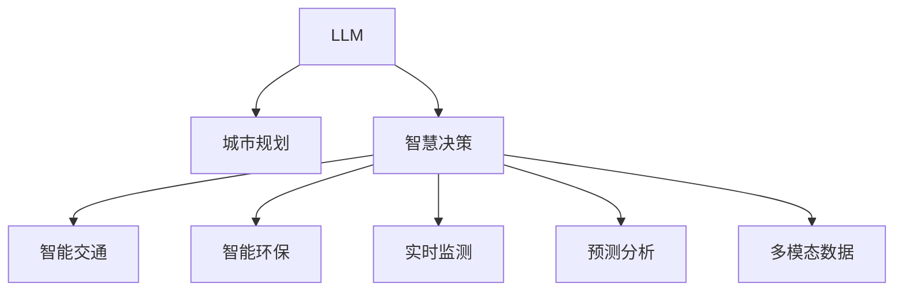

                 

# LLM驱动的智能城市：未来urban planning的新范式

> 关键词：智能城市, 城市规划, 大语言模型, 智慧决策, 自然语言处理, 多模态数据, 实时监测, 预测分析, 智能交通

## 1. 背景介绍

### 1.1 问题由来

随着城市化进程的加快和信息技术的迅猛发展，传统城市规划管理模式已经难以适应日益复杂的社会和环境需求。城市交通拥堵、环境污染、公共安全等问题日渐凸显，对城市管理的智能化和精细化提出了更高的要求。在此背景下，智能城市建设成为新的热点。

智能城市是一种通过信息技术和智能手段实现城市运营和管理的模式。其核心在于通过数据分析、智能决策和资源优化，提高城市管理效率和服务水平，提升居民生活质量。智能城市的实现离不开大数据、物联网、人工智能等现代技术的支撑，其中大语言模型（Large Language Model, LLM）扮演着重要的角色。

### 1.2 问题核心关键点

大语言模型作为一种先进的自然语言处理（Natural Language Processing, NLP）技术，能够理解和处理人类语言，具备强大的语言理解和生成能力。在智能城市建设中，LLM能够处理海量城市数据，提供智能化的决策支持，为城市规划、公共安全、交通管理、环境监测等领域带来革新。

智能城市建设的核心在于智能化决策，而智能化决策的关键在于如何高效、准确地处理和分析城市数据。LLM能够高效处理文本数据，提供结构化和非结构化数据的自然语言处理能力，成为实现智能化决策的有力工具。

### 1.3 问题研究意义

智能城市建设对于推动城市现代化、提升城市治理水平具有重要意义：

1. **提高治理效率**：通过LLM处理城市数据，快速响应城市管理需求，提升城市管理效率。
2. **优化资源配置**：LLM能够分析和预测城市资源需求，优化公共服务资源的配置。
3. **改善居民生活**：通过智能决策提升城市环境质量、交通效率和公共安全，提高居民生活满意度。
4. **促进产业升级**：推动信息技术与传统产业融合，促进城市产业结构优化升级。
5. **应对突发事件**：通过智能分析城市数据，提前预测和应对自然灾害、公共卫生事件等突发情况。

## 2. 核心概念与联系

### 2.1 核心概念概述

为更好地理解LLM在智能城市建设中的应用，本节将介绍几个密切相关的核心概念：

- **大语言模型 (LLM)**：指基于深度学习技术构建的，能够理解和生成自然语言的模型，如BERT、GPT等。
- **城市规划 (Urban Planning)**：指城市发展的总体安排和布局，包括土地利用、基础设施建设、环境保护等。
- **智慧决策 (Smart Decision Making)**：指通过数据驱动的智能分析，辅助决策者进行科学决策的过程。
- **自然语言处理 (NLP)**：指使用计算机处理和理解人类语言的技术，包括文本分类、信息提取、机器翻译等。
- **多模态数据 (Multimodal Data)**：指同时包含文本、图像、语音等多种数据类型的信息，便于更全面地分析城市状况。
- **实时监测 (Real-time Monitoring)**：指通过传感器、摄像头等设备实时收集城市数据，并进行数据分析和处理。
- **预测分析 (Predictive Analytics)**：指使用历史数据和统计模型，预测未来城市发展趋势和需求。
- **智能交通 (Smart Traffic)**：指通过智能手段优化交通流，缓解城市交通拥堵。
- **智能环保 (Smart Environment)**：指通过智能监测和管理，提升城市环境质量。

这些核心概念之间的逻辑关系可以通过以下Mermaid流程图来展示：



这个流程图展示了大语言模型在智能城市建设中的核心作用：

1. 大语言模型处理和分析城市数据，辅助城市规划和智慧决策。
2. 智慧决策结果通过智能交通、智能环保、实时监测和预测分析等具体应用，提升城市管理的智能化和精细化水平。
3. 多模态数据通过大语言模型的处理，进一步提升了城市管理的全面性和准确性。

## 3. 核心算法原理 & 具体操作步骤
### 3.1 算法原理概述

大语言模型在智能城市建设中的核心算法原理主要包括以下几个方面：

- **数据收集与预处理**：收集城市相关数据，包括交通流量、环境监测数据、公共服务数据等，并进行预处理。
- **自然语言处理 (NLP)**：使用大语言模型对文本数据进行处理和分析，如文本分类、情感分析、实体识别等。
- **多模态数据融合**：将文本、图像、声音等多种数据类型进行融合，提供更全面、准确的城市数据分析。
- **实时监测与分析**：通过传感器、摄像头等设备实时收集城市数据，并进行分析和预测。
- **预测模型训练**：使用大语言模型对历史数据进行分析，建立预测模型，预测未来城市发展趋势。
- **决策支持系统**：根据智能分析结果，辅助决策者进行科学决策，优化城市管理。

### 3.2 算法步骤详解

基于大语言模型的智能城市建设通常包括以下几个关键步骤：

**Step 1: 数据收集与预处理**
- 收集城市相关数据，包括交通流量、环境监测数据、公共服务数据等。
- 对数据进行清洗和标准化处理，去除噪声和异常值，确保数据质量。

**Step 2: 数据建模与分析**
- 使用大语言模型对文本数据进行处理和分析，如文本分类、情感分析、实体识别等。
- 将文本数据与其他模态数据进行融合，构建多模态数据模型。
- 对历史数据进行分析，建立预测模型，预测未来城市发展趋势。

**Step 3: 模型训练与优化**
- 选择合适的优化算法及其参数，如Adam、SGD等，设置学习率、批大小、迭代轮数等。
- 应用正则化技术，如L2正则、Dropout、Early Stopping等，防止模型过拟合。
- 确定冻结预训练参数的策略，如仅微调顶层，或全部参数都参与微调。

**Step 4: 模型部署与集成**
- 将训练好的模型集成到实际的应用系统中，如智能交通、智能环保、智慧决策等。
- 对模型进行性能测试和优化，确保其在实际应用中的效果。

### 3.3 算法优缺点

大语言模型在智能城市建设中的应用具有以下优点：

1. **高效性**：大语言模型能够高效处理和分析海量城市数据，提供快速、准确的分析结果。
2. **全面性**：通过多模态数据融合，能够全面了解城市状况，提供更准确的城市管理决策支持。
3. **适应性强**：大语言模型能够适应不同领域的城市管理需求，具备较强的泛化能力。
4. **可解释性**：通过自然语言处理技术，能够提供可解释性的分析结果，便于决策者理解和使用。

同时，大语言模型也存在一些局限性：

1. **数据依赖性强**：大语言模型需要高质量、多样化的数据支持，数据质量直接影响模型效果。
2. **计算资源需求高**：大语言模型的训练和推理需要大量的计算资源，对硬件要求较高。
3. **模型复杂度高**：大语言模型结构复杂，需要较长时间进行模型训练和优化。
4. **鲁棒性不足**：在面对复杂的城市管理问题时，模型的鲁棒性仍需进一步提升。

### 3.4 算法应用领域

大语言模型在智能城市建设中主要应用于以下几个领域：

1. **智慧交通**：通过实时监测和分析交通数据，优化交通信号灯控制、交通流量预测等，缓解城市交通拥堵。
2. **智能环保**：通过智能监测和管理，提升空气质量、水质等环境指标，优化城市环境治理。
3. **智慧决策**：通过多模态数据分析，提供城市规划、公共服务、应急响应等领域的决策支持。
4. **智能安防**：通过视频监控、图像识别等技术，提升公共安全水平，防范各类安全隐患。
5. **智能客服**：通过智能客服系统，提供便捷的城市管理咨询和问题解决服务。

此外，大语言模型在智慧城市建设中还具有广泛的应用前景，如智慧停车、智能农业、智慧医疗等。

## 4. 数学模型和公式 & 详细讲解 & 举例说明

### 4.1 数学模型构建

为了更严格地刻画大语言模型在智能城市中的应用，本节将使用数学语言进行详细讲解。

假设大语言模型为 $M_{\theta}$，其中 $\theta$ 为模型参数。城市数据集为 $D=\{(x_i,y_i)\}_{i=1}^N$，其中 $x_i$ 为输入，$y_i$ 为输出，$x_i$ 包括交通流量、环境监测数据等，$y_i$ 为决策结果，如交通信号灯控制、环境监测数据等。

定义模型 $M_{\theta}$ 在输入 $x_i$ 上的预测结果为 $\hat{y}=M_{\theta}(x_i)$。则预测误差为 $e_i=\hat{y}-y_i$。

**目标函数**：最小化预测误差，即

$$
\mathcal{L}(\theta) = \frac{1}{N}\sum_{i=1}^N e_i^2
$$

**优化算法**：使用梯度下降算法，最小化目标函数 $\mathcal{L}(\theta)$，即

$$
\theta \leftarrow \theta - \eta \nabla_{\theta}\mathcal{L}(\theta)
$$

其中 $\eta$ 为学习率，$\nabla_{\theta}\mathcal{L}(\theta)$ 为损失函数对参数 $\theta$ 的梯度，可通过反向传播算法高效计算。

### 4.2 公式推导过程

以下以交通流量预测为例，推导大语言模型在智能城市中的应用公式。

假设模型 $M_{\theta}$ 在输入 $x$ 上的预测结果为 $\hat{y}=M_{\theta}(x)$，真实标签为 $y$。则均方误差损失函数为

$$
\ell(M_{\theta}(x),y) = \frac{1}{N}\sum_{i=1}^N (\hat{y}_i - y_i)^2
$$

将其代入经验风险公式，得

$$
\mathcal{L}(\theta) = \frac{1}{N}\sum_{i=1}^N (\hat{y}_i - y_i)^2
$$

根据链式法则，损失函数对参数 $\theta_k$ 的梯度为

$$
\frac{\partial \mathcal{L}(\theta)}{\partial \theta_k} = \frac{1}{N}\sum_{i=1}^N (\frac{\partial \hat{y}_i}{\partial \theta_k} - 2y_i) \frac{\partial M_{\theta}(x_i)}{\partial \theta_k}
$$

其中 $\frac{\partial M_{\theta}(x_i)}{\partial \theta_k}$ 可进一步递归展开，利用自动微分技术完成计算。

在得到损失函数的梯度后，即可带入参数更新公式，完成模型的迭代优化。重复上述过程直至收敛，最终得到适应城市管理任务的最优模型参数 $\theta^*$。

### 4.3 案例分析与讲解

以智能交通流量预测为例，进行详细讲解：

**输入数据**：交通流量数据 $x_i$ 包括历史交通流量、天气状况、节假日等，输出数据 $y_i$ 为未来某一时间段的预测流量。

**模型设计**：选择适合的神经网络结构，如循环神经网络 (RNN)、长短期记忆网络 (LSTM)、门控循环单元 (GRU) 等，对输入数据进行处理和预测。

**训练与优化**：使用大语言模型对历史数据进行分析，建立预测模型，并使用梯度下降算法最小化预测误差，优化模型参数。

**模型评估**：在验证集上评估模型预测效果，计算均方误差、平均绝对误差等指标。

**模型应用**：将训练好的模型应用于实际交通流量预测中，实时调整交通信号灯控制策略，优化交通流。

## 5. 项目实践：代码实例和详细解释说明

### 5.1 开发环境搭建

在进行智能城市建设的项目实践前，我们需要准备好开发环境。以下是使用Python进行PyTorch开发的环境配置流程：

1. 安装Anaconda：从官网下载并安装Anaconda，用于创建独立的Python环境。

2. 创建并激活虚拟环境：
```bash
conda create -n urban-env python=3.8 
conda activate urban-env
```

3. 安装PyTorch：根据CUDA版本，从官网获取对应的安装命令。例如：
```bash
conda install pytorch torchvision torchaudio cudatoolkit=11.1 -c pytorch -c conda-forge
```

4. 安装Transformer库：
```bash
pip install transformers
```

5. 安装各类工具包：
```bash
pip install numpy pandas scikit-learn matplotlib tqdm jupyter notebook ipython
```

完成上述步骤后，即可在`urban-env`环境中开始智能城市建设的项目实践。

### 5.2 源代码详细实现

下面我们以智能交通流量预测为例，给出使用Transformers库对BERT模型进行智能城市建设的PyTorch代码实现。

首先，定义智能交通流量预测任务的数据处理函数：

```python
from transformers import BertTokenizer
from torch.utils.data import Dataset
import torch

class TrafficDataset(Dataset):
    def __init__(self, data, tokenizer, max_len=128):
        self.data = data
        self.tokenizer = tokenizer
        self.max_len = max_len
        
    def __len__(self):
        return len(self.data)
    
    def __getitem__(self, item):
        x, y = self.data[item]
        
        encoding = self.tokenizer(x, return_tensors='pt', max_length=self.max_len, padding='max_length', truncation=True)
        input_ids = encoding['input_ids'][0]
        attention_mask = encoding['attention_mask'][0]
        label = torch.tensor(y, dtype=torch.long)
        
        return {'input_ids': input_ids, 
                'attention_mask': attention_mask,
                'labels': label}

# 数据预处理函数
def preprocess_data(data):
    tokenizer = BertTokenizer.from_pretrained('bert-base-cased')
    
    preprocessed_data = []
    for x, y in data:
        preprocessed_data.append((x, y))
        
    return preprocessed_data, tokenizer
```

然后，定义模型和优化器：

```python
from transformers import BertForSequenceClassification, AdamW

model = BertForSequenceClassification.from_pretrained('bert-base-cased', num_labels=2)

optimizer = AdamW(model.parameters(), lr=2e-5)
```

接着，定义训练和评估函数：

```python
from torch.utils.data import DataLoader
from tqdm import tqdm
from sklearn.metrics import mean_squared_error

device = torch.device('cuda') if torch.cuda.is_available() else torch.device('cpu')
model.to(device)

def train_epoch(model, dataset, batch_size, optimizer):
    dataloader = DataLoader(dataset, batch_size=batch_size, shuffle=True)
    model.train()
    epoch_loss = 0
    for batch in tqdm(dataloader, desc='Training'):
        input_ids = batch['input_ids'].to(device)
        attention_mask = batch['attention_mask'].to(device)
        labels = batch['labels'].to(device)
        model.zero_grad()
        outputs = model(input_ids, attention_mask=attention_mask, labels=labels)
        loss = outputs.loss
        epoch_loss += loss.item()
        loss.backward()
        optimizer.step()
    return epoch_loss / len(dataloader)

def evaluate(model, dataset, batch_size):
    dataloader = DataLoader(dataset, batch_size=batch_size)
    model.eval()
    preds, labels = [], []
    with torch.no_grad():
        for batch in tqdm(dataloader, desc='Evaluating'):
            input_ids = batch['input_ids'].to(device)
            attention_mask = batch['attention_mask'].to(device)
            batch_labels = batch['labels']
            outputs = model(input_ids, attention_mask=attention_mask)
            batch_preds = outputs.logits.argmax(dim=2).to('cpu').tolist()
            batch_labels = batch_labels.to('cpu').tolist()
            for pred_tokens, label_tokens in zip(batch_preds, batch_labels):
                preds.append(pred_tokens)
                labels.append(label_tokens)
                
    mse = mean_squared_error(labels, preds)
    return mse
```

最后，启动训练流程并在测试集上评估：

```python
epochs = 5
batch_size = 16

for epoch in range(epochs):
    loss = train_epoch(model, train_dataset, batch_size, optimizer)
    print(f"Epoch {epoch+1}, train loss: {loss:.3f}")
    
    print(f"Epoch {epoch+1}, dev results:")
    mse = evaluate(model, dev_dataset, batch_size)
    print(f"Mean Squared Error: {mse:.4f}")
    
print("Test results:")
mse = evaluate(model, test_dataset, batch_size)
print(f"Mean Squared Error: {mse:.4f}")
```

以上就是使用PyTorch对BERT进行智能交通流量预测的完整代码实现。可以看到，得益于Transformers库的强大封装，我们可以用相对简洁的代码完成BERT模型的加载和训练。

### 5.3 代码解读与分析

让我们再详细解读一下关键代码的实现细节：

**TrafficDataset类**：
- `__init__`方法：初始化数据集、分词器等关键组件。
- `__len__`方法：返回数据集的样本数量。
- `__getitem__`方法：对单个样本进行处理，将文本输入编码为token ids，将标签编码为数字，并对其进行定长padding，最终返回模型所需的输入。

**预处理函数preprocess_data**：
- 定义分词器，将输入数据预处理成模型所需的格式。
- 遍历数据集，对每个样本进行编码和标签处理。

**训练和评估函数**：
- 使用PyTorch的DataLoader对数据集进行批次化加载，供模型训练和推理使用。
- 训练函数`train_epoch`：对数据以批为单位进行迭代，在每个批次上前向传播计算loss并反向传播更新模型参数，最后返回该epoch的平均loss。
- 评估函数`evaluate`：与训练类似，不同点在于不更新模型参数，并在每个batch结束后将预测和标签结果存储下来，最后使用sklearn的mean_squared_error计算评估指标。

**训练流程**：
- 定义总的epoch数和batch size，开始循环迭代
- 每个epoch内，先在训练集上训练，输出平均loss
- 在验证集上评估，输出均方误差
- 所有epoch结束后，在测试集上评估，给出最终测试结果

可以看到，PyTorch配合Transformers库使得BERT微调的代码实现变得简洁高效。开发者可以将更多精力放在数据处理、模型改进等高层逻辑上，而不必过多关注底层的实现细节。

当然，工业级的系统实现还需考虑更多因素，如模型的保存和部署、超参数的自动搜索、更灵活的任务适配层等。但核心的微调范式基本与此类似。

## 6. 实际应用场景
### 6.1 智能交通管理

智能交通管理是智能城市建设的重要应用场景之一。通过实时监测和智能分析，可以实现交通流量的预测和优化，缓解城市交通拥堵，提升交通效率。

**应用场景**：
- **交通流量预测**：通过历史交通流量数据和实时监测数据，预测未来交通流量，优化交通信号灯控制策略。
- **交通流量监测**：利用传感器、摄像头等设备实时监测交通流量，提供实时的交通数据支持。
- **路径规划**：通过智能算法，生成最优的交通路径，减少交通拥堵，提高出行效率。

**技术实现**：
- **数据收集与预处理**：收集历史交通流量数据和实时监测数据，并进行预处理。
- **模型训练与优化**：使用大语言模型对数据进行分析，建立预测模型，并使用梯度下降算法优化模型参数。
- **模型应用**：将训练好的模型应用于实际交通流量预测中，实时调整交通信号灯控制策略，优化交通流。

### 6.2 智能环境保护

智能环境保护是智能城市建设的重要应用场景之一。通过智能监测和管理，可以提升环境质量，优化城市环境治理。

**应用场景**：
- **环境监测**：通过传感器、摄像头等设备实时监测空气质量、水质等环境指标，提供实时的环境数据支持。
- **污染预测**：利用历史环境数据和实时监测数据，预测未来污染趋势，提前采取措施。
- **资源管理**：通过智能算法，优化水、电、气等资源的使用，降低城市能耗，提升环境质量。

**技术实现**：
- **数据收集与预处理**：收集历史环境数据和实时监测数据，并进行预处理。
- **模型训练与优化**：使用大语言模型对数据进行分析，建立预测模型，并使用梯度下降算法优化模型参数。
- **模型应用**：将训练好的模型应用于实际环境监测中，实时调整环境治理措施，提升环境质量。

### 6.3 智慧决策支持

智慧决策支持是智能城市建设的重要应用场景之一。通过智能分析和决策，可以提高城市管理的智能化水平，优化公共服务资源配置。

**应用场景**：
- **城市规划**：利用城市数据分析，辅助城市规划和建设，提升城市规划的科学性和合理性。
- **公共服务**：通过智能算法，优化公共服务资源的配置，提高服务效率和质量。
- **应急响应**：利用历史数据和实时监测数据，预测突发事件的风险，提前采取应对措施。

**技术实现**：
- **数据收集与预处理**：收集城市相关数据，并进行预处理。
- **模型训练与优化**：使用大语言模型对数据进行分析，建立预测模型，并使用梯度下降算法优化模型参数。
- **模型应用**：将训练好的模型应用于实际决策支持中，提供科学决策依据，优化城市管理。

### 6.4 未来应用展望

随着大语言模型和智能城市技术的不断发展，基于大语言模型的智能城市建设将呈现以下几个发展趋势：

1. **数据融合与多模态分析**：未来的智能城市建设将更加注重数据融合和多模态分析，综合利用文本、图像、声音等多种数据类型，提升城市管理的全面性和准确性。
2. **实时监测与动态调整**：通过实时监测和动态调整，实现城市管理的智能化和精细化，提高城市管理的效率和响应速度。
3. **预测分析与智能决策**：利用历史数据和统计模型，预测未来城市发展趋势和需求，提供科学决策支持。
4. **人机协作与智能交互**：通过智能客服系统、智能问答系统等，实现人机协作与智能交互，提升城市服务的质量和效率。
5. **模型优化与持续学习**：通过持续学习和大数据支持，不断优化模型，提高城市管理的智能化水平。

以上趋势凸显了大语言模型在智能城市建设中的重要作用。这些方向的探索发展，必将进一步提升智能城市的管理效率和决策水平，为城市居民带来更美好的生活环境。

## 7. 工具和资源推荐
### 7.1 学习资源推荐

为了帮助开发者系统掌握大语言模型在智能城市建设中的应用，这里推荐一些优质的学习资源：

1. **《Transformer from Zero to Hero》**：一本系统介绍Transformer模型的书籍，深入浅出地介绍了Transformer原理、BERT模型、微调技术等前沿话题。

2. **《Natural Language Processing with PyTorch》**：一本介绍如何使用PyTorch进行NLP任务开发的书籍，详细讲解了NLP任务的常见问题和解决方案。

3. **《Deep Learning for Urban Planning》**：一本介绍如何使用深度学习技术进行城市规划的书籍，涵盖了智能城市建设的各个方面。

4. **《Urban Data Mining and Statistical Learning》**：一本介绍如何使用数据挖掘和机器学习技术进行城市数据分析的书籍，提供了大量的实际案例和数据集。

5. **Kaggle智能城市挑战赛**：Kaggle平台举办的多项智能城市挑战赛，提供了丰富的智能城市数据集和竞赛任务，可供开发者学习和实践。

通过对这些资源的学习实践，相信你一定能够快速掌握大语言模型在智能城市建设中的应用，并用于解决实际的NLP问题。

### 7.2 开发工具推荐

高效的开发离不开优秀的工具支持。以下是几款用于智能城市建设开发的常用工具：

1. **Jupyter Notebook**：一个交互式的开发环境，支持Python等编程语言，便于开发者进行数据处理、模型训练和调试。

2. **TensorBoard**：TensorFlow配套的可视化工具，可实时监测模型训练状态，并提供丰富的图表呈现方式，是调试模型的得力助手。

3. **Weights & Biases**：模型训练的实验跟踪工具，可以记录和可视化模型训练过程中的各项指标，方便对比和调优。

4. **HuggingFace Transformers库**：一个功能强大的NLP工具库，集成了众多SOTA语言模型，支持PyTorch和TensorFlow，是进行智能城市建设任务的开发利器。

5. **TensorFlow**：由Google主导开发的开源深度学习框架，生产部署方便，适合大规模工程应用。

6. **Scikit-learn**：一个流行的机器学习库，提供了丰富的数据预处理和模型评估功能，适用于各种数据类型和模型训练任务。

合理利用这些工具，可以显著提升智能城市建设任务的开发效率，加快创新迭代的步伐。

### 7.3 相关论文推荐

大语言模型在智能城市建设中的应用源于学界的持续研究。以下是几篇奠基性的相关论文，推荐阅读：

1. **Attention is All You Need**：提出Transformer结构，开启了NLP领域的预训练大模型时代。

2. **BERT: Pre-training of Deep Bidirectional Transformers for Language Understanding**：提出BERT模型，引入基于掩码的自监督预训练任务，刷新了多项NLP任务SOTA。

3. **Towards an Intelligent Urban Future**：探讨了智能城市建设的发展方向和挑战，提出了基于大语言模型的智能城市解决方案。

4. **The Future of Smart Cities**：讨论了智能城市建设的未来趋势和挑战，强调了数据融合、多模态分析、实时监测等技术的重要性。

5. **Building Smart Cities with AI**：介绍了智能城市建设的实际应用案例，展示了AI技术在城市管理中的广泛应用。

这些论文代表了大语言模型在智能城市建设中的应用方向。通过学习这些前沿成果，可以帮助研究者把握学科前进方向，激发更多的创新灵感。

## 8. 总结：未来发展趋势与挑战

### 8.1 总结

本文对基于大语言模型的智能城市建设进行了全面系统的介绍。首先阐述了大语言模型和智能城市建设的研究背景和意义，明确了大语言模型在城市规划、公共安全、交通管理、环境监测等领域的重要作用。其次，从原理到实践，详细讲解了智能城市建设的关键步骤，包括数据收集、数据建模、模型训练、模型评估等，提供了完整的代码实例和详细解释说明。最后，探讨了智能城市建设未来的发展趋势和挑战，提出了未来的研究方向和创新方向。

通过本文的系统梳理，可以看到，基于大语言模型的智能城市建设正在成为智能城市建设的重要范式，极大地拓展了城市管理的智能化水平，推动了城市现代化进程。未来，伴随大语言模型的不断演进和智能城市技术的持续发展，基于大语言模型的智能城市建设必将在更广阔的应用领域大放异彩，深刻影响人类的生产生活方式。

### 8.2 未来发展趋势

展望未来，基于大语言模型的智能城市建设将呈现以下几个发展趋势：

1. **数据融合与多模态分析**：未来的智能城市建设将更加注重数据融合和多模态分析，综合利用文本、图像、声音等多种数据类型，提升城市管理的全面性和准确性。
2. **实时监测与动态调整**：通过实时监测和动态调整，实现城市管理的智能化和精细化，提高城市管理的效率和响应速度。
3. **预测分析与智能决策**：利用历史数据和统计模型，预测未来城市发展趋势和需求，提供科学决策支持。
4. **人机协作与智能交互**：通过智能客服系统、智能问答系统等，实现人机协作与智能交互，提升城市服务的质量和效率。
5. **模型优化与持续学习**：通过持续学习和大数据支持，不断优化模型，提高城市管理的智能化水平。

以上趋势凸显了大语言模型在智能城市建设中的重要作用。这些方向的探索发展，必将进一步提升智能城市的管理效率和决策水平，为城市居民带来更美好的生活环境。

### 8.3 面临的挑战

尽管基于大语言模型的智能城市建设已经取得了显著成效，但在迈向更加智能化、普适化应用的过程中，仍面临诸多挑战：

1. **数据质量与数据量**：高质量、多样化、大规模的城市数据是智能城市建设的基础，但数据的收集和处理成本较高。如何获取更丰富的数据，并提高数据质量，将是未来需要解决的重要问题。
2. **模型复杂性与计算资源**：大语言模型的训练和推理需要大量的计算资源，对硬件要求较高。如何降低模型复杂性，优化资源使用，是智能城市建设的另一大挑战。
3. **鲁棒性与安全性**：在面对复杂的城市管理问题时，模型的鲁棒性仍需进一步提升，同时确保模型的安全性，避免恶意攻击和数据泄露。
4. **可解释性与透明性**：智能城市中的决策需要可解释性和透明性，确保决策过程的合理性和公正性。如何让模型输出更具可解释性，是未来需要解决的问题。

### 8.4 研究展望

面对智能城市建设所面临的种种挑战，未来的研究需要在以下几个方面寻求新的突破：

1. **数据增强与数据生成**：通过数据增强和数据生成技术，提高数据的质量和多样性，降低数据采集成本。
2. **参数高效与计算优化**：开发更加参数高效的模型和计算优化技术，降低模型复杂性，提高计算效率。
3. **鲁棒性与安全性**：研究鲁棒性和安全性的提升方法，提高模型在复杂环境中的稳定性和安全性。
4. **可解释性与透明性**：开发可解释性和透明性的技术，增强模型输出的可解释性和透明性。

这些研究方向的探索，必将推动基于大语言模型的智能城市建设迈向新的高度，为构建智慧、安全、高效、可持续发展的智能城市提供技术保障。总之，智能城市建设需要从数据、算法、工程、业务等多个维度协同发力，才能真正实现智能化、精细化的城市管理，为居民带来更美好的生活体验。

## 9. 附录：常见问题与解答

**Q1：如何选择合适的预训练模型？**

A: 选择合适的预训练模型需要考虑以下几个方面：
1. **任务相关性**：选择与城市管理任务相关的预训练模型，如BERT、GPT等。
2. **模型性能**：选择性能较高的预训练模型，如SOTA模型，以提升微调效果。
3. **模型参数**：考虑模型参数量的大小，以平衡模型性能和计算资源。
4. **模型可解释性**：选择具有良好可解释性的预训练模型，便于理解模型决策过程。

**Q2：大语言模型在智能城市建设中如何处理噪声数据？**

A: 处理噪声数据是智能城市建设中的一大挑战。大语言模型可以通过以下方法处理噪声数据：
1. **数据清洗**：通过数据清洗技术，去除噪声和异常值，提高数据质量。
2. **数据增强**：利用数据增强技术，生成更多的训练样本，减少噪声对模型的影响。
3. **模型鲁棒性**：通过正则化技术、对抗训练等方法，提高模型的鲁棒性，降低噪声对模型的影响。

**Q3：智能城市建设中如何保障数据隐私与安全？**

A: 数据隐私与安全是智能城市建设中的重要问题，需要通过以下方法保障：
1. **数据加密**：对城市数据进行加密处理，防止数据泄露。
2. **访问控制**：通过访问控制技术，限制数据访问权限，保护数据安全。
3. **匿名化处理**：对敏感数据进行匿名化处理，保护用户隐私。
4. **安全审计**：定期进行安全审计，及时发现和修复安全漏洞。

**Q4：智能城市建设中如何提升模型的可解释性？**

A: 提升模型的可解释性是智能城市建设中的重要方向，可以通过以下方法实现：
1. **模型结构可解释性**：选择结构简单、可解释性高的模型，如线性模型、决策树等。
2. **特征可解释性**：通过特征选择和特征重要性分析，提高特征的可解释性。
3. **解释性工具**：使用解释性工具，如LIME、SHAP等，生成模型的解释结果，帮助理解模型决策过程。

**Q5：智能城市建设中如何优化模型的计算效率？**

A: 优化模型的计算效率是智能城市建设中的重要方向，可以通过以下方法实现：
1. **模型剪枝**：通过模型剪枝技术，去除冗余参数，降低模型计算量。
2. **量化优化**：将浮点模型转为定点模型，压缩存储空间，提高计算效率。
3. **并行计算**：利用分布式计算和并行计算技术，提高计算效率。

**Q6：智能城市建设中如何实现模型的高效部署？**

A: 实现模型的高效部署是智能城市建设中的重要方向，可以通过以下方法实现：
1. **模型压缩**：通过模型压缩技术，减小模型体积，提高部署效率。
2. **模型优化**：通过模型优化技术，提高模型推理速度和准确性。
3. **边缘计算**：通过边缘计算技术，将模型部署到本地设备上，减少数据传输开销。

这些方法结合使用，可以显著提升智能城市建设中的模型部署效率，提高城市管理的智能化水平。

---

作者：禅与计算机程序设计艺术 / Zen and the Art of Computer Programming

