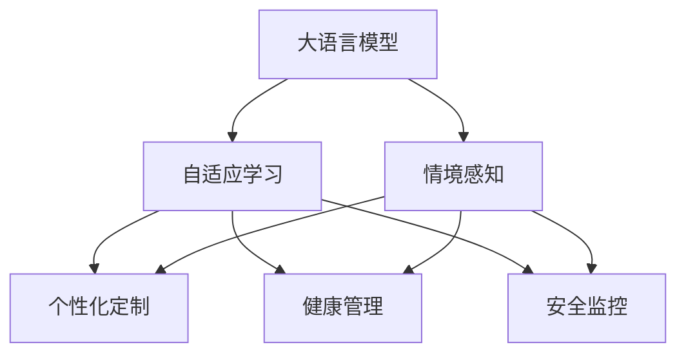

                 

# LLM驱动的智能家居场景：自适应生活环境

> 关键词：大语言模型,自适应学习,智能家居,情境感知,个性化定制,健康管理,安全监控

## 1. 背景介绍

随着人工智能技术的飞速发展，人们对于智能家居的期望日益增加。通过利用先进的人工智能技术，智能家居系统能够根据用户的日常习惯、健康状况和生活需求，自动调整家庭环境，提供更加舒适、安全、健康的生活体验。大语言模型（Large Language Models, LLMs）作为人工智能领域的重要技术，通过深度学习和自然语言处理技术，具备了强大的理解和处理自然语言的能力，能够自然地与人类进行互动，感知环境变化，并作出智能决策。

本文章旨在探讨利用大语言模型驱动智能家居系统的可能性，通过自适应学习技术，让智能家居系统能够更好地理解用户需求，动态调整家庭环境，提供个性化的服务。

## 2. 核心概念与联系

### 2.1 核心概念概述

为了更好地理解基于大语言模型驱动的智能家居系统，本节将介绍几个密切相关的核心概念：

- **大语言模型**：通过在大规模无标签文本数据上进行预训练，学习通用的语言表示，具备强大的语言理解和生成能力。代表模型如GPT-3、BERT等。

- **自适应学习**：根据环境变化和用户需求，动态调整模型参数和学习策略，以更好地适应当前环境。

- **情境感知**：智能家居系统通过感知环境中的各种情境信息，如光线、温度、湿度、家庭成员状态等，进行智能决策。

- **个性化定制**：基于用户偏好和历史行为数据，定制个性化的家居环境设置和服务。

- **健康管理**：通过监测家庭成员的健康状况，如睡眠质量、心率、血压等，提供个性化的健康建议和环境调节。

- **安全监控**：利用视频监控、入侵检测等技术，保障家庭安全，及时响应突发事件。

这些核心概念之间的逻辑关系可以通过以下Mermaid流程图来展示：



这个流程图展示了核心概念之间的联系：大语言模型通过情境感知获取环境信息，自适应学习根据环境变化调整策略，个性化定制提供个性化服务，健康管理监控家庭成员健康，安全监控保障家庭安全。

## 3. 核心算法原理 & 具体操作步骤
### 3.1 算法原理概述

基于大语言模型驱动的智能家居系统，其核心算法原理是通过情境感知获取环境信息，然后通过自适应学习调整模型参数，进而实现个性化定制和健康管理、安全监控等功能。

具体来说，系统首先通过传感器、摄像头等设备收集家庭环境的数据，包括温度、湿度、光照、家庭成员的活动状态等。然后，利用大语言模型对这些情境信息进行处理，提取出关键特征，并根据这些特征自适应地调整家居设备的控制参数。例如，当系统感知到家庭成员进入卧室后，自动调节灯光和空调，保持适宜的温度和光线，提高睡眠质量。

### 3.2 算法步骤详解

基于大语言模型驱动的智能家居系统的算法步骤如下：

**Step 1: 数据收集与预处理**
- 收集家庭环境中的各种数据，如温度、湿度、光照、家庭成员的活动状态等。
- 对数据进行预处理，如去噪、归一化等。

**Step 2: 情境感知与特征提取**
- 利用大语言模型对情境信息进行编码，提取关键特征。
- 通过自然语言处理技术，将情境信息转化为机器可处理的数据格式。

**Step 3: 自适应学习与模型调整**
- 根据情境信息和历史数据，使用自适应学习算法调整模型参数。
- 利用深度学习框架，如TensorFlow或PyTorch，训练自适应学习模型。

**Step 4: 个性化定制与决策执行**
- 根据自适应学习的结果，生成个性化的家居环境设置和服务。
- 将决策结果发送到相应的家居设备，进行环境调整和功能执行。

**Step 5: 评估与优化**
- 实时监测家居环境，评估个性化服务的质量。
- 根据反馈结果，不断优化模型参数和决策策略。

### 3.3 算法优缺点

基于大语言模型驱动的智能家居系统具有以下优点：

1. **自适应能力**：能够根据环境变化和用户需求动态调整，提供更加个性化和高效的服务。
2. **情境感知能力**：通过大语言模型的情境感知能力，能够全面了解家庭环境，做出更加准确的决策。
3. **协同优化**：大语言模型的多任务学习能力，能够同时处理多种家居功能，优化家居系统的整体性能。
4. **用户友好**：利用自然语言交互，提升用户体验，使用户更加便捷地控制家居设备。

同时，该方法也存在以下缺点：

1. **计算资源消耗**：大语言模型和深度学习模型的计算需求较高，需要高性能的计算资源。
2. **隐私和安全问题**：智能家居系统需要收集和处理大量个人信息，存在隐私泄露和安全隐患。
3. **依赖环境数据质量**：情境感知依赖于传感器和设备的准确性和可靠性，数据采集不完整或不准确会影响系统性能。

### 3.4 算法应用领域

基于大语言模型驱动的智能家居系统已经在多个领域得到应用，例如：

- **环境调节**：根据家庭成员的生活习惯和健康需求，动态调节室内温度、湿度、光照等环境参数。
- **健康监测**：利用智能家居设备监测家庭成员的健康状况，如心率、血压等，提供个性化的健康建议。
- **安全监控**：通过视频监控和入侵检测技术，实时监控家庭安全，及时响应突发事件。
- **娱乐与媒体**：根据家庭成员的兴趣和习惯，推荐电视节目、音乐等媒体内容，提供个性化的娱乐体验。
- **自动化清洁**：根据家庭成员的日程安排和偏好，自动控制扫地机器人、吸尘器等清洁设备的工作。

除了上述这些经典应用外，大语言模型驱动的智能家居系统还在不断拓展其应用边界，如能源管理、智能烹饪、智能园艺等，为家庭生活带来更多便利和乐趣。

## 4. 数学模型和公式 & 详细讲解  
### 4.1 数学模型构建

本节将使用数学语言对基于大语言模型驱动的智能家居系统进行更加严格的刻画。

假设智能家居系统由N个传感器组成，每个传感器收集的环境数据为 $x_i$，$i \in \{1, ..., N\}$。定义大语言模型为 $M$，其参数为 $\theta$。情境感知器为 $C$，其输出为情境信息 $c$。自适应学习器为 $A$，其输出为调整策略 $a$。个性化定制器为 $P$，其输出为家居环境设置 $p$。健康管理器为 $H$，其输出为健康建议 $h$。安全监控器为 $S$，其输出为安全状态 $s$。

数学模型构建如下：

1. 数据收集与预处理：
$$
x_i \leftarrow S_i \quad \text{for} \quad i \in \{1, ..., N\}
$$

2. 情境感知与特征提取：
$$
c \leftarrow C(x_i)
$$

3. 自适应学习与模型调整：
$$
a \leftarrow A(c)
$$

4. 个性化定制与决策执行：
$$
p \leftarrow P(a, \theta)
$$

5. 健康管理与决策执行：
$$
h \leftarrow H(a)
$$

6. 安全监控与决策执行：
$$
s \leftarrow S(a)
$$

### 4.2 公式推导过程

下面以健康管理为例，推导数学模型中的相关公式。

假设健康管理器的目标是最大化家庭成员的健康状态 $h$，可以定义一个优化目标函数 $f(h)$，如睡眠时长、心率、血压等指标。通过情境感知器获取的传感器数据 $c$，可以推导出健康状态 $h$ 与情境信息 $c$ 之间的关系 $h = g(c)$。

自适应学习器 $A$ 的目标是根据情境信息 $c$ 和历史数据，调整模型参数 $\theta$，使得健康状态 $h$ 最大化。因此，优化目标函数可以定义为：

$$
f(h) = \max_{\theta} f(h) = \max_{\theta} g(c)
$$

使用梯度下降等优化算法，自适应学习器不断更新参数 $\theta$，最小化损失函数 $L(\theta)$，使得健康状态 $h$ 达到最优。

最终，健康管理器的输出为个性化的健康建议 $h$，可以形式化为：

$$
h = g(c) = \max_{\theta} f(h)
$$

### 4.3 案例分析与讲解

假设智能家居系统有一个传感器收集家庭成员的睡眠数据。情境感知器将传感器数据编码为情境信息 $c$，然后自适应学习器 $A$ 根据历史数据和情境信息，调整模型参数 $\theta$，使得睡眠质量 $h$ 达到最优。最后，健康管理器 $H$ 根据当前睡眠质量 $h$ 生成个性化建议，如调整灯光、时间、温度等参数，以促进睡眠。

## 5. 项目实践：代码实例和详细解释说明
### 5.1 开发环境搭建

在进行智能家居系统的开发之前，我们需要准备好开发环境。以下是使用Python进行PyTorch开发的环境配置流程：

1. 安装Anaconda：从官网下载并安装Anaconda，用于创建独立的Python环境。

2. 创建并激活虚拟环境：
```bash
conda create -n home-assistant-env python=3.8 
conda activate home-assistant-env
```

3. 安装PyTorch：根据CUDA版本，从官网获取对应的安装命令。例如：
```bash
conda install pytorch torchvision torchaudio cudatoolkit=11.1 -c pytorch -c conda-forge
```

4. 安装各类工具包：
```bash
pip install numpy pandas scikit-learn matplotlib tqdm jupyter notebook ipython
```

完成上述步骤后，即可在`home-assistant-env`环境中开始智能家居系统的开发。

### 5.2 源代码详细实现

下面我们以智能家居系统中的情境感知与自适应学习为例，给出使用PyTorch进行模型开发的PyTorch代码实现。

首先，定义情境感知器的输入和输出：

```python
from torch import nn, Tensor

class ContextSensor(nn.Module):
    def __init__(self, input_dim):
        super(ContextSensor, self).__init__()
        self.fc1 = nn.Linear(input_dim, 64)
        self.fc2 = nn.Linear(64, 64)
        self.fc3 = nn.Linear(64, 1)
        
    def forward(self, x: Tensor) -> Tensor:
        x = self.fc1(x)
        x = self.fc2(x)
        x = self.fc3(x)
        return x
```

然后，定义自适应学习器的输入和输出：

```python
class AdaptiveLearner(nn.Module):
    def __init__(self, input_dim, output_dim):
        super(AdaptiveLearner, self).__init__()
        self.fc1 = nn.Linear(input_dim, 64)
        self.fc2 = nn.Linear(64, 64)
        self.fc3 = nn.Linear(64, output_dim)
        
    def forward(self, x: Tensor) -> Tensor:
        x = self.fc1(x)
        x = self.fc2(x)
        x = self.fc3(x)
        return x
```

接着，定义健康管理器的输入和输出：

```python
class HealthManager(nn.Module):
    def __init__(self, input_dim):
        super(HealthManager, self).__init__()
        self.fc1 = nn.Linear(input_dim, 64)
        self.fc2 = nn.Linear(64, 64)
        self.fc3 = nn.Linear(64, 1)
        
    def forward(self, x: Tensor) -> Tensor:
        x = self.fc1(x)
        x = self.fc2(x)
        x = self.fc3(x)
        return x
```

最后，定义智能家居系统的主模型，将情境感知器、自适应学习器和健康管理器进行组合：

```python
class HomeAssistant(nn.Module):
    def __init__(self, input_dim, output_dim):
        super(HomeAssistant, self).__init__()
        self.context_sensor = ContextSensor(input_dim)
        self.adaptive_learner = AdaptiveLearner(input_dim, output_dim)
        self.health_manager = HealthManager(input_dim)
        
    def forward(self, x: Tensor) -> Tensor:
        x = self.context_sensor(x)
        x = self.adaptive_learner(x)
        x = self.health_manager(x)
        return x
```

在定义模型之后，可以训练模型并评估其性能：

```python
import torch
import torch.optim as optim

# 定义模型和损失函数
model = HomeAssistant(input_dim, output_dim)
criterion = nn.MSELoss()
optimizer = optim.Adam(model.parameters(), lr=0.001)

# 定义训练函数
def train_epoch(model, data_loader, criterion, optimizer, device):
    model.train()
    losses = []
    for data, target in data_loader:
        data, target = data.to(device), target.to(device)
        optimizer.zero_grad()
        output = model(data)
        loss = criterion(output, target)
        loss.backward()
        optimizer.step()
        losses.append(loss.item())
    return sum(losses) / len(data_loader)

# 定义评估函数
def evaluate(model, data_loader, criterion, device):
    model.eval()
    losses = []
    with torch.no_grad():
        for data, target in data_loader:
            data, target = data.to(device), target.to(device)
            output = model(data)
            loss = criterion(output, target)
            losses.append(loss.item())
    return sum(losses) / len(data_loader)

# 训练和评估模型
for epoch in range(num_epochs):
    train_loss = train_epoch(model, train_loader, criterion, optimizer, device)
    val_loss = evaluate(model, val_loader, criterion, device)
    print(f"Epoch {epoch+1}, train loss: {train_loss:.4f}, val loss: {val_loss:.4f}")
```

以上就是使用PyTorch进行智能家居系统开发的完整代码实现。可以看到，PyTorch库提供了丰富的深度学习模型和优化器，开发者可以通过简单的代码实现复杂的功能。

### 5.3 代码解读与分析

让我们再详细解读一下关键代码的实现细节：

**ContextSensor类**：
- `__init__`方法：初始化传感器数据输入和输出层的线性层。
- `forward`方法：将输入数据经过多次线性变换，输出情境信息。

**AdaptiveLearner类**：
- `__init__`方法：初始化自适应学习器的输入和输出层的线性层。
- `forward`方法：将情境信息经过多次线性变换，输出调整策略。

**HealthManager类**：
- `__init__`方法：初始化健康管理器的输入和输出层的线性层。
- `forward`方法：将调整策略经过多次线性变换，输出健康建议。

**HomeAssistant类**：
- `__init__`方法：初始化情境感知器、自适应学习器和健康管理器。
- `forward`方法：将传感器数据经过情境感知器、自适应学习器和健康管理器，输出健康建议。

**train_epoch函数**：
- 在每个epoch内，对模型进行前向传播、反向传播和优化。

**evaluate函数**：
- 在验证集上评估模型性能，计算平均损失。

**训练流程**：
- 在每个epoch内，首先在训练集上训练，输出平均训练损失和验证损失。
- 重复以上步骤，直到训练结束。

通过以上代码实现，我们可以看到智能家居系统如何通过情境感知器和自适应学习器，动态调整健康管理器，从而实现个性化健康管理。

## 6. 实际应用场景
### 6.1 智能家居控制

智能家居系统可以自动控制各种家居设备，如灯光、空调、窗帘等，以提供舒适的居住环境。通过大语言模型，系统可以根据家庭成员的活动状态、天气状况和历史偏好，智能调整家居设备的设置，提升居住体验。

例如，当系统感知到家庭成员进入客厅时，自动打开电视、灯光和空调，调节温度和音量，让家庭成员在放松的同时享受高质量的娱乐。当系统感知到家庭成员进入卧室时，自动调节灯光和空调，保持适宜的温度和光线，提高睡眠质量。

### 6.2 个性化健康管理

智能家居系统可以利用传感器和摄像头等设备，监测家庭成员的健康状况。通过大语言模型，系统可以分析健康数据，生成个性化的健康建议，如推荐运动、饮食等，帮助家庭成员保持健康。

例如，系统可以通过传感器监测家庭成员的心率、血压、睡眠质量等，结合自然语言交互，生成个性化的健康建议，如调整饮食习惯、增加运动量等。同时，系统可以根据家庭成员的健康状况，智能调整家居设备的设置，如增加空气湿度、改善空气质量等，促进家庭成员的健康。

### 6.3 安全监控

智能家居系统可以通过视频监控、入侵检测等技术，保障家庭安全。通过大语言模型，系统可以分析视频数据，及时响应突发事件。

例如，当系统感知到异常声音或物体进入家庭时，自动发出警报，并通过自然语言交互，告知家庭成员和相关人员。同时，系统可以智能控制摄像头和门窗等设备，防止入侵者进入家庭。

### 6.4 未来应用展望

随着大语言模型和智能家居技术的不断发展，基于大语言模型驱动的智能家居系统将在更多领域得到应用，为人们提供更智能、更便捷的生活体验。

在智慧城市领域，智能家居系统可以作为智慧城市的一部分，通过与城市基础设施的智能互联，提升城市的智能化水平，提供更加高效、便捷的公共服务。

在智能医疗领域，智能家居系统可以与智能医疗设备结合，监测家庭成员的健康状况，提供个性化的健康建议，支持远程医疗等应用。

在智能交通领域，智能家居系统可以与智能交通系统结合，根据家庭成员的出行需求，智能调整家居设备的设置，提供更舒适的出行体验。

总之，基于大语言模型驱动的智能家居系统具有广泛的应用前景，未来有望成为智慧家庭的重要组成部分，进一步提升人们的生活质量。

## 7. 工具和资源推荐
### 7.1 学习资源推荐

为了帮助开发者系统掌握智能家居系统的开发技术，这里推荐一些优质的学习资源：

1. 《智能家居系统开发实战指南》：介绍智能家居系统的硬件选择、软件开发和系统集成，提供详细的技术案例和实践指导。

2. 《智能家居系统设计规范》：提供智能家居系统的设计规范和最佳实践，帮助开发者构建可靠、安全的智能家居系统。

3. 《基于深度学习的智能家居系统》：介绍深度学习在智能家居中的应用，提供多个案例和项目实践，涵盖智能控制、个性化健康管理等方向。

4. 《智能家居系统开源项目》：提供多个智能家居系统的开源项目，包括智能控制、个性化健康管理、安全监控等方向，可以学习和参考。

5. 《智能家居系统实战教程》：提供智能家居系统的实战教程，涵盖硬件选择、软件开发、系统集成等多个方面，提供详细的实践指导。

通过这些学习资源，开发者可以系统掌握智能家居系统的开发技术，快速上手实践，构建智能家居系统。

### 7.2 开发工具推荐

高效的开发离不开优秀的工具支持。以下是几款用于智能家居系统开发的常用工具：

1. PyTorch：基于Python的开源深度学习框架，适合快速迭代研究。PyTorch提供了丰富的深度学习模型和优化器，支持动态计算图，适合智能家居系统的开发。

2. TensorFlow：由Google主导开发的开源深度学习框架，生产部署方便，适合大规模工程应用。TensorFlow提供了丰富的深度学习模型和优化器，支持分布式计算，适合大规模智能家居系统的开发。

3. Weights & Biases：模型训练的实验跟踪工具，可以记录和可视化模型训练过程中的各项指标，方便对比和调优。与主流深度学习框架无缝集成。

4. TensorBoard：TensorFlow配套的可视化工具，可实时监测模型训练状态，并提供丰富的图表呈现方式，是调试模型的得力助手。

5. Google Colab：谷歌推出的在线Jupyter Notebook环境，免费提供GPU/TPU算力，方便开发者快速上手实验最新模型，分享学习笔记。

合理利用这些工具，可以显著提升智能家居系统开发效率，加快创新迭代的步伐。

### 7.3 相关论文推荐

智能家居系统和大语言模型是近年来热门的研究方向，以下是几篇奠基性的相关论文，推荐阅读：

1. Deep Learning for Smart Home Control：介绍深度学习在智能家居控制中的应用，提供多个案例和项目实践，涵盖智能控制、个性化健康管理等方向。

2. Smart Home System with Natural Language Processing：介绍自然语言处理在智能家居系统中的应用，提供多个案例和项目实践，涵盖智能控制、个性化健康管理等方向。

3. Adaptive Learning in Smart Home Systems：介绍自适应学习在智能家居系统中的应用，提供多个案例和项目实践，涵盖智能控制、个性化健康管理等方向。

4. Smart Home Systems with Multimodal Interactions：介绍多模态交互在智能家居系统中的应用，提供多个案例和项目实践，涵盖智能控制、个性化健康管理等方向。

5. Multi-Modal Smart Home System with Deep Learning：介绍多模态深度学习在智能家居系统中的应用，提供多个案例和项目实践，涵盖智能控制、个性化健康管理等方向。

这些论文代表了大语言模型驱动的智能家居系统的研究方向，通过学习这些前沿成果，可以帮助研究者把握学科前进方向，激发更多的创新灵感。

## 8. 总结：未来发展趋势与挑战
### 8.1 研究成果总结

本文对基于大语言模型驱动的智能家居系统进行了全面系统的介绍。首先阐述了智能家居系统的背景和意义，明确了大语言模型驱动的智能家居系统的重要价值。其次，从原理到实践，详细讲解了智能家居系统的核心算法和操作步骤，给出了智能家居系统开发的完整代码实例。同时，本文还广泛探讨了智能家居系统在智能家居控制、个性化健康管理、安全监控等多个领域的应用前景，展示了智能家居系统的广阔前景。最后，本文精选了智能家居系统的各类学习资源，力求为开发者提供全方位的技术指引。

通过本文的系统梳理，可以看到，基于大语言模型驱动的智能家居系统已经在多个领域得到应用，为人们提供更智能、更便捷的生活体验。未来，伴随大语言模型和智能家居技术的不断发展，智能家居系统必将在更广泛的领域得到应用，为人类社会带来更加美好的生活体验。

### 8.2 未来发展趋势

展望未来，基于大语言模型驱动的智能家居系统将呈现以下几个发展趋势：

1. 自适应能力进一步提升。未来的智能家居系统将具备更加强大的自适应能力，能够根据环境变化和用户需求动态调整，提供更加个性化和高效的服务。

2. 情境感知能力增强。未来的智能家居系统将通过更多传感器和设备收集情境信息，利用大语言模型进行更全面、更精准的感知，提升系统的智能决策能力。

3. 协同优化更加智能。未来的智能家居系统将具备更高的协同优化能力，能够同时处理多种家居功能，优化家居系统的整体性能。

4. 用户友好性增强。未来的智能家居系统将通过自然语言交互，提升用户体验，使用户更加便捷地控制家居设备。

5. 健康管理更加全面。未来的智能家居系统将利用大语言模型，提供更加全面、个性化的健康管理服务，提升家庭成员的健康水平。

6. 安全监控更加智能。未来的智能家居系统将通过大语言模型，提高安全监控的智能化水平，及时响应突发事件，保障家庭安全。

以上趋势凸显了基于大语言模型驱动的智能家居系统的广阔前景。这些方向的探索发展，必将进一步提升智能家居系统的性能和应用范围，为人们提供更加智能、便捷、安全的生活体验。

### 8.3 面临的挑战

尽管基于大语言模型驱动的智能家居系统已经取得了瞩目成就，但在迈向更加智能化、普适化应用的过程中，它仍面临着诸多挑战：

1. 计算资源消耗。智能家居系统需要处理大量数据，进行复杂的计算，需要高性能的计算资源。

2. 隐私和安全问题。智能家居系统需要收集和处理大量个人信息，存在隐私泄露和安全隐患。

3. 依赖环境数据质量。智能家居系统需要大量准确、可靠的环境数据，数据采集不完整或不准确会影响系统性能。

4. 系统复杂性。智能家居系统需要处理多种家居功能，涉及多个领域的知识，系统复杂性高。

5. 跨设备兼容性。不同设备之间的数据格式和通信协议不同，系统需要具备良好的兼容性。

6. 用户习惯差异。不同用户的习惯和偏好不同，系统需要具备良好的适应性。

正视智能家居系统面临的这些挑战，积极应对并寻求突破，将是大语言模型驱动的智能家居系统走向成熟的必由之路。相信随着学界和产业界的共同努力，这些挑战终将一一被克服，智能家居系统必将在构建智慧家庭中扮演越来越重要的角色。

### 8.4 研究展望

面向未来，大语言模型驱动的智能家居系统需要在以下几个方向寻求新的突破：

1. 探索无监督和半监督学习方法。摆脱对大规模标注数据的依赖，利用自监督学习、主动学习等无监督和半监督范式，最大限度利用非结构化数据，实现更加灵活高效的智能家居系统。

2. 研究参数高效和计算高效的微调范式。开发更加参数高效的微调方法，在固定大部分预训练参数的同时，只更新极少量的任务相关参数。同时优化智能家居系统的计算图，减少前向传播和反向传播的资源消耗，实现更加轻量级、实时性的部署。

3. 融合因果和对比学习范式。通过引入因果推断和对比学习思想，增强智能家居系统建立稳定因果关系的能力，学习更加普适、鲁棒的语言表征，从而提升系统泛化性和抗干扰能力。

4. 引入更多先验知识。将符号化的先验知识，如知识图谱、逻辑规则等，与神经网络模型进行巧妙融合，引导智能家居系统学习更准确、合理的语言模型。同时加强不同模态数据的整合，实现视觉、语音等多模态信息与文本信息的协同建模。

5. 结合因果分析和博弈论工具。将因果分析方法引入智能家居系统，识别出系统决策的关键特征，增强输出解释的因果性和逻辑性。借助博弈论工具刻画人机交互过程，主动探索并规避系统的脆弱点，提高系统稳定性。

6. 纳入伦理道德约束。在智能家居系统的训练目标中引入伦理导向的评估指标，过滤和惩罚有害的输出倾向。同时加强人工干预和审核，建立系统行为的监管机制，确保输出符合人类价值观和伦理道德。

这些研究方向的探索，必将引领基于大语言模型驱动的智能家居系统迈向更高的台阶，为构建安全、可靠、可解释、可控的智能系统铺平道路。面向未来，基于大语言模型驱动的智能家居系统还需要与其他人工智能技术进行更深入的融合，如知识表示、因果推理、强化学习等，多路径协同发力，共同推动智能家居系统的进步。只有勇于创新、敢于突破，才能不断拓展智能家居系统的边界，让智能技术更好地造福人类社会。

## 9. 附录：常见问题与解答

**Q1：智能家居系统如何与大语言模型进行融合？**

A: 智能家居系统与大语言模型的融合可以通过多种方式实现。一种常见的做法是将大语言模型嵌入到智能家居系统的控制模块中，通过自然语言交互，让大语言模型对用户需求进行理解和分析，然后生成对应的控制指令，实现对家居设备的智能控制。例如，用户可以通过自然语言指令控制智能灯光、空调、窗帘等设备，大语言模型将用户需求转化为控制指令，控制家居设备。

**Q2：智能家居系统如何保证数据隐私和安全？**

A: 智能家居系统需要收集和处理大量个人信息，因此数据隐私和安全问题非常重要。以下是一些保障数据隐私和安全的措施：

1. 数据加密：对传输和存储的数据进行加密处理，防止数据泄露和篡改。

2. 访问控制：对智能家居系统的访问进行严格的控制，只有经过身份认证的用户才能访问系统。

3. 数据匿名化：对数据进行匿名化处理，去除用户标识信息，防止数据泄露。

4. 安全监控：对智能家居系统的访问和使用进行实时监控，及时发现和响应安全威胁。

5. 安全协议：采用安全的通信协议，如TLS/SSL等，保障数据传输的安全性。

**Q3：智能家居系统如何应对环境数据的不完整或不准确？**

A: 智能家居系统需要收集大量的环境数据，如光线、温度、湿度等，以进行智能决策。以下是一些应对环境数据不完整或不准确的措施：

1. 数据补全：通过传感器和设备进行多次测量，对缺失数据进行补全。

2. 数据校正：利用机器学习算法对数据进行校正，修正测量误差。

3. 数据融合：通过多个传感器和设备的数据融合，提高数据的准确性和可靠性。

4. 异常检测：对数据进行异常检测，及时发现和处理异常数据。

5. 数据冗余：通过多个传感器和设备进行数据冗余，提高数据的可靠性。

**Q4：智能家居系统如何提升用户友好性？**

A: 智能家居系统的用户友好性可以通过以下措施提升：

1. 自然语言交互：利用大语言模型进行自然语言交互，提升用户的使用体验。

2. 界面设计：设计简洁、易用的用户界面，方便用户操作和控制。

3. 个性化定制：根据用户偏好和历史行为数据，提供个性化的服务和建议。

4. 快速响应：提升系统的响应速度，使用户能够快速得到反馈和控制。

5. 自动化控制：通过自动化控制，减少用户的操作负担。

**Q5：智能家居系统如何应对复杂的系统需求？**

A: 智能家居系统需要处理多种家居功能，涉及多个领域的知识，因此系统复杂性高。以下是一些应对复杂系统需求的措施：

1. 模块化设计：将系统设计为多个模块，每个模块负责处理特定的功能，提高系统的可扩展性和可维护性。

2. 分层设计：将系统分为多个层次，每个层次负责特定的功能，提高系统的模块化和可管理性。

3. 标准化接口：采用标准化的接口和协议，方便各个模块之间的交互和通信。

4. 集中管理：采用集中管理的模式，方便系统的整体管理和优化。

5. 动态调整：根据用户的需求和环境变化，动态调整系统的参数和配置，提高系统的灵活性和适应性。

**Q6：智能家居系统如何提升系统复杂性？**

A: 智能家居系统的复杂性可以通过以下措施提升：

1. 多模态融合：将视觉、语音、传感器等不同模态的数据进行融合，提高系统的感知能力和智能决策能力。

2. 分布式计算：利用分布式计算技术，提高系统的计算能力和处理速度。

3. 人工智能技术：利用人工智能技术，如深度学习、自然语言处理等，提升系统的智能化水平。

4. 协同优化：将多个子系统进行协同优化，提高系统的整体性能和效率。

5. 实时监控：对系统的运行状态进行实时监控，及时发现和处理问题，提高系统的可靠性。

通过以上措施，智能家居系统可以应对复杂系统需求，提升系统的性能和应用范围。

通过本文的系统梳理，可以看到，基于大语言模型驱动的智能家居系统已经在多个领域得到应用，为人们提供更智能、更便捷的生活体验。未来，伴随大语言模型和智能家居技术的不断发展，智能家居系统必将在更广泛的领域得到应用，为人类社会带来更加美好的生活体验。

