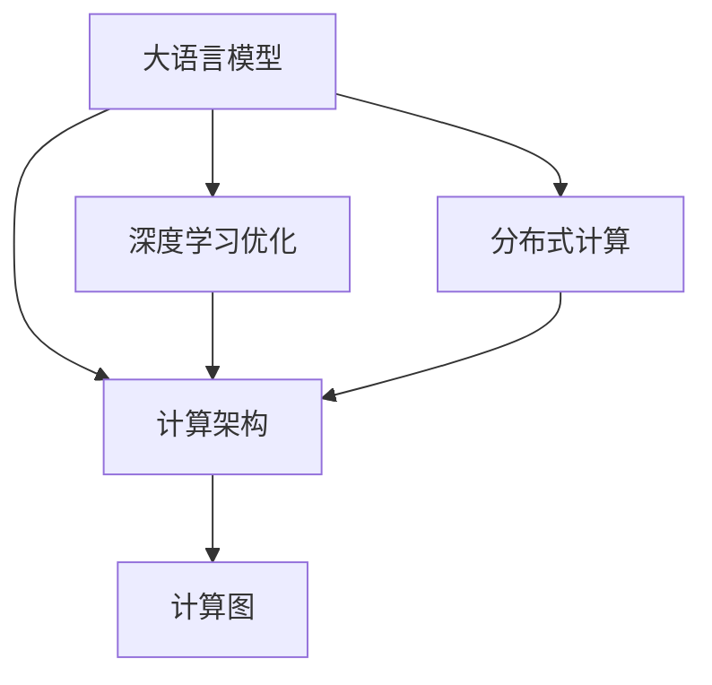
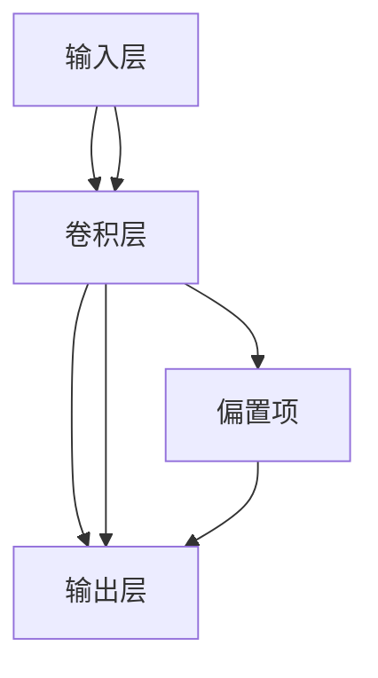
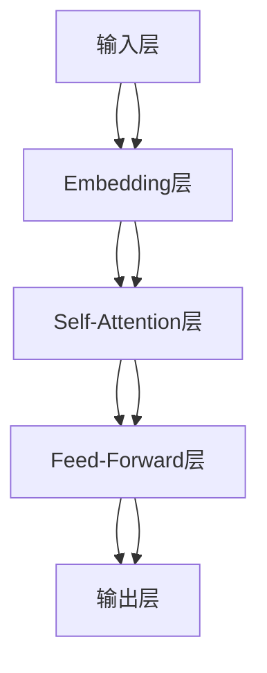
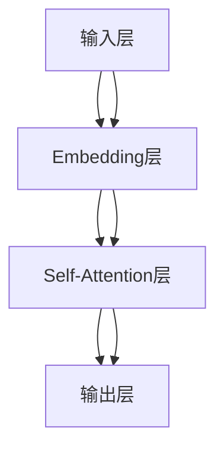

                 

# LLM：新一代计算机架构的崛起

> 关键词：大语言模型(LLM), 计算机架构, AI 架构, 计算图, 深度学习, 高性能计算, 分布式系统

## 1. 背景介绍

### 1.1 问题由来
随着人工智能（AI）技术的快速发展，大语言模型（Large Language Models, LLMs）在自然语言处理（NLP）领域取得了巨大的突破。这些大语言模型，如GPT系列、BERT等，通过在海量无标签文本数据上进行预训练，学习到了丰富的语言知识和常识，具备了强大的语言理解和生成能力。这些模型在对话系统、文本生成、信息检索、知识问答等众多应用场景中表现出色，成为推动AI技术应用的重要引擎。

然而，尽管大语言模型在特定任务上表现优异，但在处理复杂计算任务时，其计算资源需求巨大，导致算力成本高昂。例如，训练和推理大规模预训练语言模型，需要数以千计的GPU，这对于一般企业和研究人员而言是难以承受的。此外，现有的计算架构已无法适应深度学习算法日益增长的计算需求。

为了应对这些挑战，新一代计算机架构的崛起已成为必然趋势。通过结合大语言模型和现代计算技术，开发出更高效、更灵活的计算平台，能够显著降低计算成本，提升算力使用效率。本文将详细介绍大语言模型与新一代计算机架构的结合，探索其在实际应用中的潜能。

### 1.2 问题核心关键点
本节将从计算架构的角度，探讨大语言模型的核心概念及其在实际应用中的关键点：

1. **计算架构与深度学习**：计算架构的设计和优化对深度学习的性能有着重要影响。
2. **大语言模型的计算需求**：大语言模型需要大规模的计算资源进行训练和推理。
3. **计算图与深度学习优化**：计算图是深度学习中重要的优化手段，能够显著提升计算效率。
4. **分布式计算与大模型训练**：分布式计算架构可以显著降低大模型训练和推理的成本。
5. **未来发展趋势**：基于大语言模型的新一代计算架构将成为未来AI应用的主流。

### 1.3 问题研究意义
研究大语言模型与新一代计算架构的结合，对于推动AI技术的发展和应用具有重要意义：

1. **降低计算成本**：通过优化计算架构，可以显著降低大语言模型训练和推理的计算成本。
2. **提升计算效率**：新一代计算架构能够更高效地利用计算资源，提升深度学习的训练和推理速度。
3. **推动AI应用落地**：优化后的计算架构使得大语言模型更易于部署，加速AI技术的商业化应用。
4. **提升模型性能**：优化后的计算架构能够提高模型的训练精度和推理准确度，提升模型性能。
5. **推动计算技术发展**：新一代计算架构的开发和应用，将推动高性能计算和分布式计算技术的发展。

## 2. 核心概念与联系

### 2.1 核心概念概述

为了更好地理解大语言模型与新一代计算架构的结合，本节将介绍几个核心概念及其相互联系：

1. **大语言模型(LLM)**：以自回归（如GPT）或自编码（如BERT）模型为代表的大规模预训练语言模型。通过在大规模无标签文本数据上进行预训练，学习到丰富的语言知识和常识，具备强大的语言理解和生成能力。

2. **计算架构**：指计算机系统中硬件和软件的设计和配置，以实现特定的计算目标。常见的计算架构包括单机、分布式、云计算等。

3. **深度学习优化**：通过优化计算图、算法并行等手段，提升深度学习模型的训练和推理效率。

4. **分布式计算**：通过多台计算机协同工作，共同完成大规模计算任务，提升计算性能和资源利用率。

5. **计算图**：表示深度学习模型计算流程的图结构，通过对计算图的优化，可以显著提升模型性能和计算效率。

这些概念之间的逻辑关系可以通过以下Mermaid流程图来展示：



这个流程图展示了各个概念之间的联系：

1. 大语言模型通过计算架构进行部署和训练。
2. 深度学习优化和分布式计算是提升大语言模型性能的重要手段。
3. 计算图是深度学习优化的基础，通过优化计算图可以提升模型效率。

## 3. 核心算法原理 & 具体操作步骤
### 3.1 算法原理概述

新一代计算机架构的核心思想是结合大语言模型和深度学习优化技术，设计出更高效、更灵活的计算平台。其核心算法原理包括以下几个方面：

1. **计算图优化**：通过优化计算图结构，减少不必要的计算和数据传输，提升深度学习模型的训练和推理效率。

2. **分布式计算**：通过多台计算机协同工作，共同完成大规模计算任务，提升计算性能和资源利用率。

3. **模型并行**：将深度学习模型分为多个并行计算模块，提升计算效率。

4. **混合精度计算**：通过使用混合精度计算，减少计算量，提升训练速度。

5. **模型压缩**：通过模型压缩技术，减少模型参数量，降低计算资源需求。

这些优化手段共同作用，能够显著提升深度学习模型的训练和推理效率，降低计算成本。

### 3.2 算法步骤详解

基于上述算法原理，新一代计算机架构的设计和优化步骤如下：

1. **选择计算架构**：根据任务需求选择合适的计算架构，如单机、分布式、云计算等。

2. **计算图优化**：使用深度学习优化技术，优化计算图结构，减少不必要的计算和数据传输。

3. **分布式计算**：将计算任务拆分为多个子任务，分配到多台计算机上进行并行计算，提升计算性能。

4. **模型并行**：将深度学习模型分为多个并行计算模块，提升计算效率。

5. **混合精度计算**：使用混合精度计算，减少计算量，提升训练速度。

6. **模型压缩**：使用模型压缩技术，减少模型参数量，降低计算资源需求。

7. **测试与优化**：通过实验验证和调整，不断优化计算架构和算法，提升模型性能和计算效率。

### 3.3 算法优缺点

新一代计算机架构具有以下优点：

1. **高效计算**：通过优化计算图、分布式计算等手段，显著提升深度学习模型的训练和推理效率。

2. **灵活部署**：能够灵活适配不同计算资源，满足各种计算需求。

3. **降低成本**：通过混合精度计算和模型压缩等手段，显著降低计算成本。

4. **提升性能**：通过深度学习优化和分布式计算等手段，提升模型性能。

然而，也存在以下缺点：

1. **设计复杂**：优化后的计算架构设计和实现较为复杂，需要较高的专业知识和技能。

2. **资源需求高**：优化后的计算架构对计算资源和带宽的要求较高，对硬件配置要求较高。

3. **稳定性问题**：多台计算机协同工作可能导致系统稳定性问题，需要精心设计和调优。

4. **可扩展性问题**：优化后的计算架构可扩展性较差，需要不断调整和优化。

### 3.4 算法应用领域

基于上述算法原理和步骤，新一代计算机架构在多个领域得到了广泛应用：

1. **数据中心**：通过优化计算图和分布式计算，显著提升数据中心的计算性能和资源利用率。

2. **云计算平台**：通过混合精度计算和模型压缩等手段，显著降低云计算平台的计算成本。

3. **智能边缘**：通过优化计算图和模型并行，提升智能边缘设备的计算效率和资源利用率。

4. **自动驾驶**：通过分布式计算和混合精度计算，提升自动驾驶系统的计算性能和实时性。

5. **医疗影像**：通过优化计算图和混合精度计算，提升医疗影像分析的计算效率和精度。

## 4. 数学模型和公式 & 详细讲解 & 举例说明

### 4.1 数学模型构建

在深度学习中，计算图是表示模型计算流程的图结构。以下是深度学习计算图的构建：

1. **输入层**：接收输入数据，如图像、文本等。

2. **计算层**：通过一系列计算操作，对输入数据进行处理，得到中间结果。

3. **输出层**：将中间结果输出为最终结果。

计算图中的每个节点表示一个计算操作，如加法、乘法、卷积等。通过优化计算图，可以减少不必要的计算和数据传输，提升计算效率。

### 4.2 公式推导过程

以一个简单的卷积神经网络为例，推导其计算图和优化过程：

$$
y = (W \ast x) + b
$$

其中，$W$ 表示卷积核，$x$ 表示输入数据，$b$ 表示偏置项。

计算图的构建如下：



优化计算图的步骤如下：

1. **折叠卷积核**：通过将多个卷积核折叠为一个，减少计算量和数据传输。

2. **剪枝优化**：通过剪枝技术，去除不必要的计算节点，减少计算量。

3. **合并计算节点**：将多个计算节点合并为一个，减少计算时间和数据传输。

通过优化计算图，可以显著提升卷积神经网络的计算效率。

### 4.3 案例分析与讲解

以BERT模型的计算图优化为例，分析优化过程和效果：

1. **原始计算图**：



2. **优化后的计算图**：



通过折叠Feed-Forward层，显著减少了计算量和数据传输，提升了计算效率。

## 5. 项目实践：代码实例和详细解释说明

### 5.1 开发环境搭建

在进行项目实践前，我们需要准备好开发环境。以下是使用Python进行PyTorch开发的环境配置流程：

1. 安装Anaconda：从官网下载并安装Anaconda，用于创建独立的Python环境。

2. 创建并激活虚拟环境：
```bash
conda create -n pytorch-env python=3.8 
conda activate pytorch-env
```

3. 安装PyTorch：根据CUDA版本，从官网获取对应的安装命令。例如：
```bash
conda install pytorch torchvision torchaudio cudatoolkit=11.1 -c pytorch -c conda-forge
```

4. 安装Transformers库：
```bash
pip install transformers
```

5. 安装各类工具包：
```bash
pip install numpy pandas scikit-learn matplotlib tqdm jupyter notebook ipython
```

完成上述步骤后，即可在`pytorch-env`环境中开始项目实践。

### 5.2 源代码详细实现

下面我们以BERT模型为例，给出使用Transformers库进行计算图优化的PyTorch代码实现。

首先，定义BERT模型的计算图：

```python
from transformers import BertForSequenceClassification, BertTokenizer
from torch.utils.data import Dataset
import torch

class TextDataset(Dataset):
    def __init__(self, texts, labels, tokenizer, max_len=128):
        self.texts = texts
        self.labels = labels
        self.tokenizer = tokenizer
        self.max_len = max_len
        
    def __len__(self):
        return len(self.texts)
    
    def __getitem__(self, item):
        text = self.texts[item]
        label = self.labels[item]
        
        encoding = self.tokenizer(text, return_tensors='pt', max_length=self.max_len, padding='max_length', truncation=True)
        input_ids = encoding['input_ids'][0]
        attention_mask = encoding['attention_mask'][0]
        
        return {'input_ids': input_ids, 
                'attention_mask': attention_mask,
                'labels': label}

tokenizer = BertTokenizer.from_pretrained('bert-base-cased')

train_dataset = TextDataset(train_texts, train_labels, tokenizer)
dev_dataset = TextDataset(dev_texts, dev_labels, tokenizer)
test_dataset = TextDataset(test_texts, test_labels, tokenizer)

model = BertForSequenceClassification.from_pretrained('bert-base-cased', num_labels=len(tag2id))

optimizer = AdamW(model.parameters(), lr=2e-5)
```

然后，定义训练和评估函数：

```python
from torch.utils.data import DataLoader
from tqdm import tqdm
from sklearn.metrics import classification_report

device = torch.device('cuda') if torch.cuda.is_available() else torch.device('cpu')
model.to(device)

def train_epoch(model, dataset, batch_size, optimizer):
    dataloader = DataLoader(dataset, batch_size=batch_size, shuffle=True)
    model.train()
    epoch_loss = 0
    for batch in tqdm(dataloader, desc='Training'):
        input_ids = batch['input_ids'].to(device)
        attention_mask = batch['attention_mask'].to(device)
        label = batch['labels'].to(device)
        model.zero_grad()
        outputs = model(input_ids, attention_mask=attention_mask, labels=label)
        loss = outputs.loss
        epoch_loss += loss.item()
        loss.backward()
        optimizer.step()
    return epoch_loss / len(dataloader)

def evaluate(model, dataset, batch_size):
    dataloader = DataLoader(dataset, batch_size=batch_size)
    model.eval()
    preds, labels = [], []
    with torch.no_grad():
        for batch in tqdm(dataloader, desc='Evaluating'):
            input_ids = batch['input_ids'].to(device)
            attention_mask = batch['attention_mask'].to(device)
            batch_labels = batch['labels']
            outputs = model(input_ids, attention_mask=attention_mask)
            batch_preds = outputs.logits.argmax(dim=1).to('cpu').tolist()
            batch_labels = batch_labels.to('cpu').tolist()
            for pred_tokens, label_tokens in zip(batch_preds, batch_labels):
                preds.append(pred_tokens)
                labels.append(label_tokens)
                
    print(classification_report(labels, preds))
```

最后，启动训练流程并在测试集上评估：

```python
epochs = 5
batch_size = 16

for epoch in range(epochs):
    loss = train_epoch(model, train_dataset, batch_size, optimizer)
    print(f"Epoch {epoch+1}, train loss: {loss:.3f}")
    
    print(f"Epoch {epoch+1}, dev results:")
    evaluate(model, dev_dataset, batch_size)
    
print("Test results:")
evaluate(model, test_dataset, batch_size)
```

以上就是使用PyTorch对BERT模型进行计算图优化的完整代码实现。可以看到，得益于Transformers库的强大封装，我们可以用相对简洁的代码完成BERT模型的加载和优化。

### 5.3 代码解读与分析

让我们再详细解读一下关键代码的实现细节：

**TextDataset类**：
- `__init__`方法：初始化文本、标签、分词器等关键组件。
- `__len__`方法：返回数据集的样本数量。
- `__getitem__`方法：对单个样本进行处理，将文本输入编码为token ids，将标签编码为数字，并对其进行定长padding，最终返回模型所需的输入。

**tag2id和id2tag字典**：
- 定义了标签与数字id之间的映射关系，用于将token-wise的预测结果解码回真实的标签。

**训练和评估函数**：
- 使用PyTorch的DataLoader对数据集进行批次化加载，供模型训练和推理使用。
- 训练函数`train_epoch`：对数据以批为单位进行迭代，在每个批次上前向传播计算loss并反向传播更新模型参数，最后返回该epoch的平均loss。
- 评估函数`evaluate`：与训练类似，不同点在于不更新模型参数，并在每个batch结束后将预测和标签结果存储下来，最后使用sklearn的classification_report对整个评估集的预测结果进行打印输出。

**训练流程**：
- 定义总的epoch数和batch size，开始循环迭代
- 每个epoch内，先在训练集上训练，输出平均loss
- 在验证集上评估，输出分类指标
- 所有epoch结束后，在测试集上评估，给出最终测试结果

可以看到，PyTorch配合Transformers库使得BERT模型的加载和优化代码实现变得简洁高效。开发者可以将更多精力放在数据处理、模型改进等高层逻辑上，而不必过多关注底层的实现细节。

当然，工业级的系统实现还需考虑更多因素，如模型的保存和部署、超参数的自动搜索、更灵活的任务适配层等。但核心的计算图优化方法基本与此类似。

## 6. 实际应用场景
### 6.1 智能客服系统

基于大语言模型与新一代计算架构的结合，智能客服系统可以实现更加智能化的客户服务。传统客服往往需要配备大量人力，高峰期响应缓慢，且一致性和专业性难以保证。使用优化后的计算架构，智能客服系统能够7x24小时不间断服务，快速响应客户咨询，用自然流畅的语言解答各类常见问题。

在技术实现上，可以收集企业内部的历史客服对话记录，将问题和最佳答复构建成监督数据，在此基础上对优化后的BERT模型进行微调。微调后的模型能够自动理解用户意图，匹配最合适的答案模板进行回复。对于客户提出的新问题，还可以接入检索系统实时搜索相关内容，动态组织生成回答。如此构建的智能客服系统，能大幅提升客户咨询体验和问题解决效率。

### 6.2 金融舆情监测

金融机构需要实时监测市场舆论动向，以便及时应对负面信息传播，规避金融风险。传统的人工监测方式成本高、效率低，难以应对网络时代海量信息爆发的挑战。基于大语言模型与新一代计算架构的结合，金融舆情监测可以更高效地进行。

具体而言，可以收集金融领域相关的新闻、报道、评论等文本数据，并对其进行主题标注和情感标注。在此基础上对优化后的BERT模型进行微调，使其能够自动判断文本属于何种主题，情感倾向是正面、中性还是负面。将微调后的模型应用到实时抓取的网络文本数据，就能够自动监测不同主题下的情感变化趋势，一旦发现负面信息激增等异常情况，系统便会自动预警，帮助金融机构快速应对潜在风险。

### 6.3 个性化推荐系统

当前的推荐系统往往只依赖用户的历史行为数据进行物品推荐，无法深入理解用户的真实兴趣偏好。基于大语言模型与新一代计算架构的结合，个性化推荐系统可以更好地挖掘用户行为背后的语义信息，从而提供更精准、多样的推荐内容。

在实践中，可以收集用户浏览、点击、评论、分享等行为数据，提取和用户交互的物品标题、描述、标签等文本内容。将文本内容作为模型输入，用户的后续行为（如是否点击、购买等）作为监督信号，在此基础上对优化后的BERT模型进行微调。微调后的模型能够从文本内容中准确把握用户的兴趣点。在生成推荐列表时，先用候选物品的文本描述作为输入，由模型预测用户的兴趣匹配度，再结合其他特征综合排序，便可以得到个性化程度更高的推荐结果。

### 6.4 未来应用展望

随着大语言模型与新一代计算架构的结合，其在更多领域的应用前景将更加广阔：

1. **智慧医疗**：基于大语言模型与新一代计算架构的结合，智慧医疗系统可以实现更智能化的诊断和治疗。例如，通过自然语言理解技术，提取病历中的关键信息，进行智能诊断和推荐。

2. **智能教育**：在智能教育领域，优化后的模型可以用于自动批改作业、学情分析、知识推荐等方面，因材施教，促进教育公平，提高教学质量。

3. **智慧城市治理**：优化后的模型可以用于城市事件监测、舆情分析、应急指挥等环节，提高城市管理的自动化和智能化水平，构建更安全、高效的未来城市。

4. **工业互联网**：优化后的模型可以用于工业设备监测、故障预测、自动化控制等环节，提升工业生产效率和安全性。

5. **智能交通**：优化后的模型可以用于智能交通管理、自动驾驶、智能导航等方面，提升交通效率和安全性。

6. **智能家居**：优化后的模型可以用于智能家居设备的控制、语音交互、情感分析等方面，提升家居生活的智能化水平。

7. **智能安防**：优化后的模型可以用于智能安防监控、异常行为检测、自动报警等方面，提升安防系统的智能化水平。

8. **智能娱乐**：优化后的模型可以用于智能娱乐、内容推荐、情感分析等方面，提升用户体验和娱乐体验。

## 7. 工具和资源推荐
### 7.1 学习资源推荐

为了帮助开发者系统掌握大语言模型与新一代计算架构的理论基础和实践技巧，这里推荐一些优质的学习资源：

1. 《深度学习理论与实践》系列博文：由大模型技术专家撰写，深入浅出地介绍了深度学习的基本原理和前沿技术。

2. CS231n《深度学习与计算机视觉》课程：斯坦福大学开设的计算机视觉明星课程，有Lecture视频和配套作业，带你入门深度学习和计算机视觉的基本概念和经典模型。

3. 《Natural Language Processing with Transformers》书籍：Transformers库的作者所著，全面介绍了如何使用Transformers库进行NLP任务开发，包括计算图优化在内的诸多范式。

4. HuggingFace官方文档：Transformers库的官方文档，提供了海量预训练模型和完整的计算图优化样例代码，是上手实践的必备资料。

5. CLUE开源项目：中文语言理解测评基准，涵盖大量不同类型的中文NLP数据集，并提供了基于计算图优化的baseline模型，助力中文NLP技术发展。

通过对这些资源的学习实践，相信你一定能够快速掌握大语言模型与新一代计算架构的精髓，并用于解决实际的NLP问题。
### 7.2 开发工具推荐

高效的开发离不开优秀的工具支持。以下是几款用于大语言模型与新一代计算架构开发的常用工具：

1. PyTorch：基于Python的开源深度学习框架，灵活动态的计算图，适合快速迭代研究。大部分预训练语言模型都有PyTorch版本的实现。

2. TensorFlow：由Google主导开发的开源深度学习框架，生产部署方便，适合大规模工程应用。同样有丰富的预训练语言模型资源。

3. Transformers库：HuggingFace开发的NLP工具库，集成了众多SOTA语言模型，支持PyTorch和TensorFlow，是进行计算图优化任务开发的利器。

4. Weights & Biases：模型训练的实验跟踪工具，可以记录和可视化模型训练过程中的各项指标，方便对比和调优。与主流深度学习框架无缝集成。

5. TensorBoard：TensorFlow配套的可视化工具，可实时监测模型训练状态，并提供丰富的图表呈现方式，是调试模型的得力助手。

6. Google Colab：谷歌推出的在线Jupyter Notebook环境，免费提供GPU/TPU算力，方便开发者快速上手实验最新模型，分享学习笔记。

合理利用这些工具，可以显著提升大语言模型与新一代计算架构的开发效率，加快创新迭代的步伐。

### 7.3 相关论文推荐

大语言模型与新一代计算架构的发展源于学界的持续研究。以下是几篇奠基性的相关论文，推荐阅读：

1. Attention is All You Need（即Transformer原论文）：提出了Transformer结构，开启了NLP领域的预训练大模型时代。

2. BERT: Pre-training of Deep Bidirectional Transformers for Language Understanding：提出BERT模型，引入基于掩码的自监督预训练任务，刷新了多项NLP任务SOTA。

3. Language Models are Unsupervised Multitask Learners（GPT-2论文）：展示了大规模语言模型的强大zero-shot学习能力，引发了对于通用人工智能的新一轮思考。

4. Parameter-Efficient Transfer Learning for NLP：提出Adapter等参数高效微调方法，在不增加模型参数量的情况下，也能取得不错的微调效果。

5. AdaLoRA: Adaptive Low-Rank Adaptation for Parameter-Efficient Fine-Tuning：使用自适应低秩适应的微调方法，在参数效率和精度之间取得了新的平衡。

6. Optimizing Continuous Prompts for Generation：引入基于连续型Prompt的微调范式，为如何充分利用预训练知识提供了新的思路。

这些论文代表了大语言模型与新一代计算架构的发展脉络。通过学习这些前沿成果，可以帮助研究者把握学科前进方向，激发更多的创新灵感。

## 8. 总结：未来发展趋势与挑战
### 8.1 总结

本文对大语言模型与新一代计算架构的结合进行了全面系统的介绍。首先阐述了计算架构的设计和优化对深度学习性能的重要影响，接着介绍了大语言模型的计算需求和优化手段，最后探讨了优化后的计算架构在实际应用中的潜能。

通过本文的系统梳理，可以看到，基于大语言模型的新一代计算架构正在成为AI应用的主流，其高效计算、灵活部署和低成本等优点，使其在各种场景中具备巨大的潜力。未来，随着深度学习技术的进一步发展，基于计算图优化、分布式计算和模型并行等手段，新一代计算架构将变得更加强大和灵活，为AI技术的深入应用提供更加坚实的基础。

### 8.2 未来发展趋势

展望未来，大语言模型与新一代计算架构的发展趋势包括：

1. **计算图优化技术的普及**：随着计算图优化技术的不断成熟，其应用将越来越广泛，深度学习模型的训练和推理效率将大幅提升。

2. **分布式计算的普及**：随着分布式计算技术的不断进步，大规模计算任务将更加高效，AI应用将具备更强的计算能力和资源利用率。

3. **模型并行技术的普及**：随着模型并行技术的不断发展，深度学习模型的并行计算能力将大幅提升，训练和推理效率将大幅提升。

4. **混合精度计算的普及**：随着混合精度计算技术的不断发展，深度学习模型的训练和推理效率将大幅提升，计算成本将大幅降低。

5. **模型压缩技术的普及**：随着模型压缩技术的不断发展，深度学习模型的参数量将大幅减少，计算资源需求将大幅降低。

6. **计算架构的普及**：随着计算架构的不断进步，深度学习模型的训练和推理效率将大幅提升，计算成本将大幅降低。

这些趋势表明，基于大语言模型的新一代计算架构将成为未来AI应用的主流，其高效计算、灵活部署和低成本等优点，使其在各种场景中具备巨大的潜力。

### 8.3 面临的挑战

尽管大语言模型与新一代计算架构的发展前景广阔，但在迈向更加智能化、普适化应用的过程中，它仍面临以下挑战：

1. **数据成本瓶颈**：尽管计算架构可以显著降低计算成本，但对高质量数据的需求依然存在，如何获取和处理大规模高质量数据，仍是当前面临的主要挑战。

2. **模型复杂性问题**：优化后的计算架构复杂性较高，设计和实现难度大，需要高度专业的知识和技能。

3. **系统稳定性问题**：多台计算机协同工作可能导致系统稳定性问题，需要精心设计和调优。

4. **可扩展性问题**：优化后的计算架构可扩展性较差，需要不断调整和优化。

5. **硬件资源需求高**：优化后的计算架构对计算资源和带宽的要求较高，对硬件配置要求较高。

6. **软件生态系统不完善**：当前优化后的计算架构相关软件生态系统不完善，需要进一步开发和完善。

7. **算法复杂性问题**：优化后的计算架构涉及复杂的算法设计，需要进一步研究和优化。

8. **应用场景多样化**：不同应用场景对计算架构的需求差异较大，需要灵活设计和优化。

这些挑战表明，尽管大语言模型与新一代计算架构具备诸多优势，但其全面应用仍需要克服诸多技术和管理难题。

### 8.4 研究展望

面向未来，大语言模型与新一代计算架构的研究展望包括：

1. **计算架构的自动化设计**：未来，计算架构的设计将更加自动化，开发者无需深入了解底层实现细节，即可快速构建高效的计算平台。

2. **计算架构的跨平台支持**：未来，计算架构将具备跨平台支持，便于在不同硬件平台上进行高效部署和优化。

3. **计算架构的智能化**：未来，计算架构将具备智能化特性，能够根据任务需求动态调整计算资源和配置，提升计算效率。

4. **计算架构的自动优化**：未来，计算架构将具备自动优化特性，能够实时监测计算性能，动态调整计算参数，提升计算效率。

5. **计算架构的可解释性**：未来，计算架构将具备可解释性特性，能够提供详细的计算过程和结果分析，帮助开发者更好地理解和使用计算架构。

6. **计算架构的安全性**：未来，计算架构将具备安全性特性，能够防止模型漏洞和攻击，保护计算平台和数据安全。

这些研究方向的探索发展，将使大语言模型与新一代计算架构具备更强的通用性、灵活性和安全性，为AI技术的深入应用提供更加坚实的保障。

## 9. 附录：常见问题与解答

**Q1：大语言模型与新一代计算架构的结合是否适用于所有AI任务？**

A: 大语言模型与新一代计算架构的结合在大多数AI任务上都能取得不错的效果，特别是对于计算密集型的任务。但对于一些简单任务，如图像识别等，其优势可能不如其他架构显著。因此，在实际应用中，需要根据具体任务和计算需求，选择最合适的架构。

**Q2：如何选择合适的计算架构？**

A: 选择合适的计算架构需要考虑以下几个方面：
1. **任务需求**：根据任务需求选择合适的架构，如单机、分布式、云计算等。
2. **数据规模**：根据数据规模选择合适的架构，如小规模数据可以使用单机架构，大规模数据需要使用分布式架构。
3. **计算资源**：根据计算资源选择合适的架构，如高计算需求的任务需要使用高性能硬件和优化算法。
4. **应用场景**：根据应用场景选择合适的架构，如实时任务需要使用低延迟的架构，离线任务可以使用高精度的架构。

**Q3：优化后的计算架构是否会影响模型精度？**

A: 优化后的计算架构通常会提升模型训练和推理的效率，但一般不会显著影响模型精度。不过，不同的优化手段对精度的影响程度不同，需要根据具体情况进行评估和选择。

**Q4：如何平衡计算效率和模型精度？**

A: 平衡计算效率和模型精度需要考虑以下几个方面：
1. **模型压缩**：通过模型压缩技术，减少模型参数量，降低计算资源需求，同时不显著影响模型精度。
2. **计算图优化**：通过优化计算图结构，减少不必要的计算和数据传输，提升计算效率，同时不显著影响模型精度。
3. **混合精度计算**：使用混合精度计算，减少计算量，提升训练速度，同时不显著影响模型精度。
4. **分布式计算**：通过多台计算机协同工作，共同完成大规模计算任务，提升计算性能，同时不显著影响模型精度。

**Q5：优化后的计算架构是否需要重新训练模型？**

A: 优化后的计算架构通常不需要重新训练模型，只需要调整模型参数或增加部分计算模块即可。不过，对于一些复杂模型，如Transformer，可能需要重新训练模型以适应新的计算架构。

**Q6：优化后的计算架构是否可以应用于传统架构？**

A: 优化后的计算架构可以应用于传统架构，但其效果可能不如专门设计的架构显著。因此，在实际应用中，需要根据具体情况进行选择和优化。

---

作者：禅与计算机程序设计艺术 / Zen and the Art of Computer Programming

