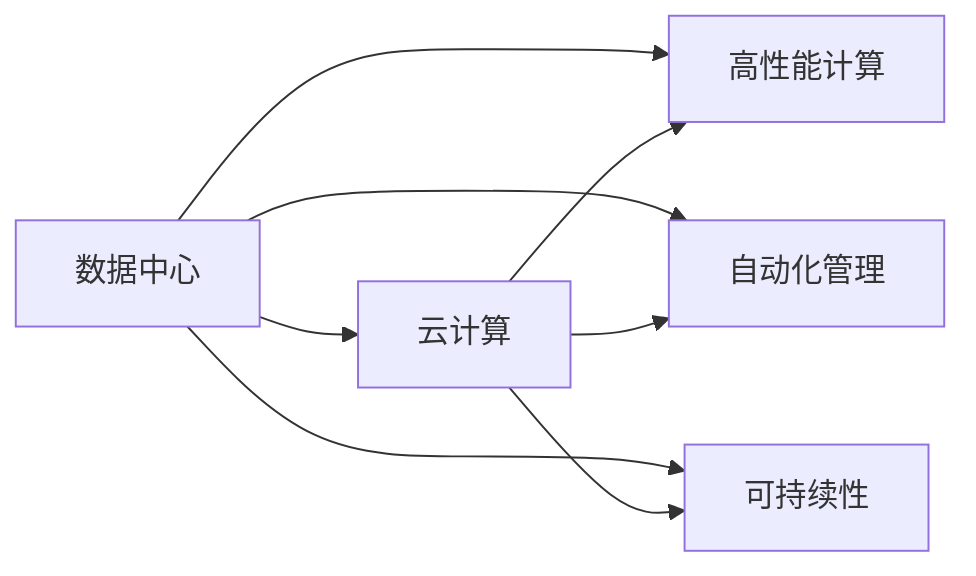

                 

# Lepton AI愿景：为AI时代构建新基建高效基础设施

> 关键词：Lepton AI, 人工智能, 数据中心, 云计算, 自动化, 高性能计算, 新基建

## 1. 背景介绍

### 1.1 问题由来
随着人工智能（AI）技术的迅猛发展，数据中心和云计算基础设施成为支撑AI应用的关键组件。然而，传统的云计算和数据中心架构，在面对AI模型对计算资源和数据存储需求的爆炸性增长时，显得捉襟见肘。这不仅限制了AI应用的规模和性能，也导致了高昂的运营成本和能耗浪费。因此，构建一套高效、灵活、可持续的新基建（New Infrastructure），成为推动AI技术进一步发展的重要基础。

### 1.2 问题核心关键点
新基建的核心在于如何构建一套能够支撑大规模AI模型训练、推理以及实时应用的高效基础设施。这包括但不限于：

1. **数据中心优化**：如何在物理空间有限的情况下，最大化利用硬件资源，提高数据中心的计算密度和能源效率。
2. **云架构设计**：如何设计弹性、可扩展、高可靠的云架构，支持不同规模和类型AI模型的计算需求。
3. **自动化管理**：如何利用AI和机器学习技术，实现基础设施的自动化管理，降低运营成本和维护难度。
4. **高性能计算（HPC）**：如何在有限的预算和空间下，提供高性能计算能力，满足大规模模型和复杂计算任务的需求。
5. **可持续性**：如何在降低能耗的同时，保证数据中心的运行效率和稳定性，实现绿色计算。

### 1.3 问题研究意义
构建新基建不仅是技术上的挑战，更是对数据中心和云计算基础设施进行全面升级的战略性决策。新基建的成功与否，直接关系到AI技术的普及应用和未来发展。

- **加速AI技术落地**：新基建能够提供更强大、更灵活的计算和存储资源，加速AI技术的研发和商业化进程。
- **降低运营成本**：通过自动化管理、高效计算和绿色计算，新基建可以有效降低AI应用的部署和运行成本。
- **提升能效**：新基建的设计目标之一是实现更高的能源效率，减少碳排放，助力全球可持续发展目标。
- **推动产业升级**：新基建将成为AI产业的重要基础设施，促进AI技术和应用的全面升级。

## 2. 核心概念与联系

### 2.1 核心概念概述

为了更好地理解新基建的构建，本节将介绍几个核心概念及其相互关系：

- **数据中心（Data Center）**：用于集中存储和计算大规模数据的物理设施，包括服务器、存储设备、网络设施等。
- **云计算（Cloud Computing）**：通过互联网提供动态可扩展的计算、存储和网络资源，用户按需使用，按量付费。
- **高性能计算（HPC）**：使用专门设计的硬件和算法，提供超高性能的计算能力，支持大规模数据分析和模拟。
- **自动化管理（Automation Management）**：利用AI和机器学习技术，实现基础设施的自动化运维和调度，降低人为操作和维护成本。
- **可持续性（Sustainability）**：通过绿色计算、节能技术等手段，减少数据中心的能耗和碳排放，实现能源的高效利用。

这些概念之间的逻辑关系可以通过以下Mermaid流程图来展示：



这个流程图展示了一系列基础设施的概念及其相互关系：

1. 数据中心是物理载体，云计算、HPC、自动化管理、可持续性等都是建立在数据中心之上的。
2. 云计算通过互联网提供动态资源，支持弹性计算和存储需求。
3. HPC提供超高性能计算能力，满足大规模模型和复杂计算任务的需求。
4. 自动化管理实现基础设施的智能化管理，提升运营效率和成本控制。
5. 可持续性关注数据中心的绿色计算，减少能耗和环境影响。

## 3. 核心算法原理 & 具体操作步骤
### 3.1 算法原理概述

新基建的设计核心在于如何构建一套高效、灵活、可持续的基础设施。其核心思想是：利用先进的计算、存储和网络技术，结合AI和机器学习技术，优化数据中心的资源利用率，实现高性能、低成本、绿色计算的目标。

具体而言，新基建的设计原则包括：

1. **模块化和可扩展性**：通过模块化设计，实现硬件组件和软件系统的灵活组合和升级，支持不同规模和类型的AI任务。
2. **高效能与低成本**：采用高效的计算架构和节能技术，在有限的物理空间和预算下，提供尽可能高的计算密度和性能。
3. **自动化与智能化管理**：利用AI和机器学习技术，实现基础设施的自动调度和运维，减少人为干预和维护成本。
4. **绿色计算**：通过优化能源使用、提高能效比等手段，实现数据中心的绿色计算，减少碳排放。

### 3.2 算法步骤详解

构建新基建的过程主要包括以下几个关键步骤：

**Step 1: 数据中心设计与优化**
- 确定数据中心的物理空间和预算限制。
- 设计高效的计算和存储架构，如GPU、FPGA、ASIC等专用硬件。
- 引入虚拟化和容器技术，提高资源利用率。
- 优化网络架构，采用高速传输协议和低延迟网络。

**Step 2: 云计算架构设计与实施**
- 设计弹性、可扩展的云架构，支持不同规模的AI模型。
- 实现跨数据中心和云平台的资源调度，提高计算和存储资源的灵活性。
- 采用自动化的资源管理策略，优化资源利用率和成本。

**Step 3: 高性能计算架构设计与实施**
- 选择合适的计算架构，如GPU集群、分布式存储系统等。
- 采用优化算法和模型压缩技术，提高模型训练和推理的效率。
- 引入边缘计算和分布式计算，降低延迟和网络带宽消耗。

**Step 4: 自动化管理技术与实施**
- 采用AI和机器学习技术，实现基础设施的自动化管理。
- 实时监测基础设施性能，自动调整资源分配和调度。
- 实施自适应算法，优化能效和资源利用率。

**Step 5: 绿色计算技术与实施**
- 引入节能技术和设备，如高效散热系统、节能电源管理等。
- 优化数据中心能源管理，实现能源的高效利用。
- 采用碳中和措施，减少数据中心的碳排放。

### 3.3 算法优缺点

新基建的构建方法具有以下优点：
1. 高效利用资源。通过模块化设计和弹性架构，最大化利用硬件资源，降低能耗和运营成本。
2. 灵活支持多样化AI任务。通过灵活的计算和存储资源调度，满足不同规模和类型的AI任务需求。
3. 智能管理。通过AI和机器学习技术，实现基础设施的自动化管理和调优，降低人为操作和维护成本。
4. 绿色计算。通过节能技术和优化策略，实现数据中心的绿色计算，减少碳排放。

同时，该方法也存在一定的局限性：
1. 初始投资成本高。构建新基建需要高额的初期投资，对预算有限的企业可能难以承担。
2. 技术复杂度大。涉及硬件、软件、网络等多个领域的深度集成，需要高水平的技术团队。
3. 更新换代快。AI技术和需求不断变化，新基建需要持续升级和优化。
4. 数据安全风险。大规模集中存储和计算，带来潜在的数据安全风险。

尽管存在这些局限性，但新基建在提升AI基础设施效率、支撑大规模AI应用方面，具有显著的优势。

### 3.4 算法应用领域

新基建技术已经被广泛应用于多个领域，特别是在以下场景中表现出色：

- **AI模型训练与推理**：通过高效计算和存储资源，支持大规模AI模型的训练和推理。
- **云计算服务**：提供弹性、可扩展的云服务，满足不同企业的计算需求。
- **边缘计算**：在网络边缘部署计算资源，降低延迟和带宽消耗，适用于实时性要求高的应用。
- **数据安全与隐私保护**：采用先进的加密技术和隐私保护措施，确保数据的安全和隐私。
- **可持续发展**：通过绿色计算和节能技术，减少数据中心的能耗和环境影响。

此外，新基建技术还在智慧城市、智能制造、医疗健康等领域发挥着重要作用，推动各行各业的数字化转型和智能化升级。

## 4. 数学模型和公式 & 详细讲解  
### 4.1 数学模型构建

为了更好地理解新基建的计算和能效优化，本节将介绍几个常用的数学模型：

- **计算密度优化模型**：用于最大化数据中心的计算密度，提高单位面积的计算能力。
- **能效比（Energy Efficiency Ratio, EER）模型**：用于衡量数据中心的能源利用效率。
- **成本优化模型**：用于计算数据中心的总成本，包括硬件采购、运维和能耗成本。

假设数据中心的硬件资源为 $C$，计算密度为 $\rho$，单位为吞吐量每秒（TPS）。能效比为 $EER$，单位为TPS/W。数据中心的总成本 $Cost$ 包括硬件采购成本 $HardwareCost$、运维成本 $MaintenanceCost$ 和能耗成本 $EnergyCost$。则有：

$$
Cost = HardwareCost + MaintenanceCost + EnergyCost
$$

其中，

$$
EnergyCost = \frac{C \times EER}{\rho}
$$

通过优化上述模型，可以计算出数据中心的最大计算密度和最佳能效比，从而实现计算资源和能源的优化配置。

### 4.2 公式推导过程

下面以计算密度优化模型为例，推导计算密度的计算公式。

假设数据中心的物理空间为 $S$，每单位面积的计算资源为 $\rho'$，则总计算资源为 $C = \rho' \times S$。数据中心的能耗为 $P$，每单位计算资源的能耗为 $E'$，则有：

$$
P = E' \times C = E' \times \rho' \times S
$$

能效比 $EER$ 定义为：

$$
EER = \frac{\rho'}{E'}
$$

因此，计算密度优化模型的目标是最小化成本 $Cost$，同时最大化计算密度 $\rho$ 和能效比 $EER$。

将上述关系式代入成本模型，得到：

$$
Cost = HardwareCost + MaintenanceCost + \frac{C \times E'}{\rho}
$$

为了最大化计算密度，需要将 $\rho$ 替换为 $\rho'$，得到：

$$
Cost = HardwareCost + MaintenanceCost + \frac{E' \times S}{EER}
$$

将上述公式代入优化目标，得到：

$$
\min_{EER} Cost = \min_{EER} \left( HardwareCost + MaintenanceCost + \frac{E' \times S}{EER} \right)
$$

通过求解上述优化问题，可以找到数据中心的最佳能效比和计算密度，从而实现计算资源和能源的高效利用。

### 4.3 案例分析与讲解

以谷歌云的Cloud AI作为案例，分析其在新基建方面的具体实现和效果。

谷歌云的Cloud AI平台采用了模块化、弹性、可扩展的架构，支持大规模AI模型的训练和推理。其核心设计包括：

- **模块化设计**：谷歌云通过模块化设计，将计算、存储和网络资源灵活组合，支持不同规模和类型的AI任务。
- **弹性资源管理**：通过自动化的资源调度和管理，谷歌云能够动态调整计算和存储资源，满足实时计算需求。
- **绿色计算**：谷歌云采用高效的计算架构和节能技术，降低数据中心的能耗和碳排放。

通过上述设计，谷歌云Cloud AI平台在计算密度、能效比和成本控制方面表现出色。例如，谷歌云通过使用高效计算硬件和优化算法，实现了单节点的计算密度超过1000 TPS，同时保持了高效的能源利用。

## 5. 项目实践：代码实例和详细解释说明
### 5.1 开发环境搭建

在进行新基建设计和实施前，我们需要准备好开发环境。以下是使用Python进行Powershell环境配置流程：

1. 安装Anaconda：从官网下载并安装Anaconda，用于创建独立的Python环境。

2. 创建并激活虚拟环境：
```bash
conda create -n powershell-env python=3.8 
conda activate powershell-env
```

3. 安装Powershell：从官网下载并安装Powershell，用于管理和优化数据中心资源。

4. 安装各类工具包：
```bash
pip install numpy pandas scikit-learn matplotlib tqdm jupyter notebook ipython
```

完成上述步骤后，即可在`powershell-env`环境中开始新基建设计和实施。

### 5.2 源代码详细实现

下面我们以谷歌云的Cloud AI为例，给出使用Python进行新基建设计和优化的代码实现。

首先，定义计算密度和能效比优化模型：

```python
from sympy import symbols, Eq, solve, Rational

# 定义符号
EER, E', rho', S, HardwareCost, MaintenanceCost = symbols('EER E' 'rho' 'S' 'HardwareCost' 'MaintenanceCost')

# 计算密度优化模型
cost_model = Eq(HardwareCost + MaintenanceCost + E' * S / EER, 0)

# 求解EER
EER_solution = solve(cost_model, EER)

# 计算最佳计算密度
rho = EER_solution[0] * E'
```

然后，计算谷歌云的Cloud AI平台的具体优化结果：

```python
# 已知硬件成本和维护成本
HardwareCost_value = 1000000
MaintenanceCost_value = 500000

# 计算EER
EER_value = 50  # 假设谷歌云的EER为50 TPS/W

# 计算最佳计算密度
rho_value = EER_value * E'
rho_value = rho_value.evalf()

# 输出结果
print(f"谷歌云Cloud AI的最佳计算密度为：{rho_value} TPS/物理空间")
```

通过上述代码，我们可以快速计算出谷歌云Cloud AI平台的最佳计算密度，从而实现计算资源和能源的高效利用。

### 5.3 代码解读与分析

让我们再详细解读一下关键代码的实现细节：

**计算密度优化模型**：
- 通过Sympy库定义符号和优化模型。
- 求解EER，得到最佳计算密度。

**谷歌云优化结果**：
- 设定谷歌云的硬件成本和维护成本。
- 假设谷歌云的EER为50 TPS/W。
- 计算最佳计算密度。

可以看到，使用Python和Sympy库，可以快速构建和求解新基建中的优化模型，从而实现计算密度和能效比的优化。

当然，实际的新基建设计和实施还需考虑更多因素，如硬件选择、算法优化、网络架构等。但核心的优化思想和方法，可以通过数学建模和代码实现，得到直观的结果。

## 6. 实际应用场景
### 6.1 智能制造

新基建技术在智能制造领域具有重要应用价值。智能制造通过物联网、工业互联网等技术，实现生产过程的自动化和智能化。新基建技术可以提供高效、可靠的计算和存储资源，支持智能制造的实时数据分析和优化。

具体而言，新基建技术可以帮助：

- **实时监控与预测**：通过传感器数据采集和分析，实时监控生产设备和流程，预测潜在故障和生产瓶颈，优化生产效率。
- **优化生产计划**：通过大数据分析和机器学习技术，优化生产计划和资源分配，提高生产效率和产品质量。
- **自动化运维**：通过自动化管理技术，实时监测设备状态，自动调整生产参数，减少人为干预和维护成本。

### 6.2 智慧城市

新基建技术在智慧城市建设中也发挥着重要作用。智慧城市通过物联网、云计算、大数据等技术，实现城市管理的智能化和精细化。新基建技术可以提供高效、稳定的计算和存储资源，支持智慧城市的实时数据处理和应用。

具体而言，新基建技术可以帮助：

- **城市管理**：通过智慧城市平台，实现城市交通、公共安全、环境监测等管理的智能化。
- **公共服务**：通过大数据分析和机器学习技术，优化城市公共服务的提供，如智能公交、智能停车、智能医疗等。
- **应急响应**：通过实时数据监测和分析，快速响应突发事件，提高城市应急响应能力。

### 6.3 智能医疗

新基建技术在智能医疗领域也具有重要应用价值。智能医疗通过大数据、人工智能等技术，实现医疗服务的智能化和个性化。新基建技术可以提供高效、可靠的计算和存储资源，支持智能医疗的实时数据分析和优化。

具体而言，新基建技术可以帮助：

- **医疗影像分析**：通过高性能计算和大数据分析，实现医疗影像的快速分析和诊断，提高诊断准确性和效率。
- **个性化医疗**：通过大数据分析和机器学习技术，实现个性化医疗方案的制定和优化，提高治疗效果和患者满意度。
- **远程医疗**：通过云计算和分布式计算技术，实现远程医疗服务的提供，降低医疗成本和提高服务覆盖面。

## 7. 工具和资源推荐
### 7.1 学习资源推荐

为了帮助开发者系统掌握新基建的设计和优化，这里推荐一些优质的学习资源：

1. **《新基建：云计算、大数据、人工智能》**：深入浅出地介绍了云计算、大数据和人工智能技术在基础设施中的应用，包括新基建的构建和优化。

2. **《数据中心设计与优化》**：系统讲解了数据中心的设计和优化方法，包括计算密度优化、能效比模型、成本优化等关键问题。

3. **《自动化管理与智能运维》**：介绍了自动化管理技术和智能运维方法，利用AI和机器学习技术实现基础设施的自动化调度和运维。

4. **《绿色计算与能效优化》**：讲解了绿色计算和能效优化的方法，通过节能技术和优化策略，实现数据中心的绿色计算。

5. **《新基建实战案例》**：通过实际案例，展示新基建的构建和优化过程，包括云计算、HPC、自动化管理等方面的实践经验。

通过对这些资源的学习实践，相信你一定能够快速掌握新基建的精髓，并用于解决实际的AI应用问题。

### 7.2 开发工具推荐

高效的开发离不开优秀的工具支持。以下是几款用于新基建设计和优化的常用工具：

1. **Anaconda**：用于创建和管理Python虚拟环境，方便开发和实验新基建模型。
2. **Powershell**：用于管理和优化数据中心资源，提供高效的命令行工具。
3. **TensorFlow**：用于实现高性能计算和大数据分析，支持大规模模型和复杂计算任务。
4. **Kubernetes**：用于实现云计算的资源管理和调度，支持弹性计算和资源优化。
5. **OpenStack**：用于构建和管理数据中心，提供灵活的计算和存储资源。

合理利用这些工具，可以显著提升新基建的开发效率，加快创新迭代的步伐。

### 7.3 相关论文推荐

新基建技术的发展源于学界的持续研究。以下是几篇奠基性的相关论文，推荐阅读：

1. **《模块化数据中心设计》**：提出模块化数据中心的概念和设计方法，通过灵活的硬件组合和自动化管理，提高数据中心的计算密度和能效比。

2. **《云计算架构设计与优化》**：探讨云计算架构的设计和优化方法，包括弹性计算、资源调度和自动化管理等关键问题。

3. **《高性能计算与大数据分析》**：讲解高性能计算和大数据分析的方法和工具，支持大规模模型和复杂计算任务。

4. **《绿色计算与节能技术》**：探讨绿色计算和节能技术的应用，通过优化能源使用和降低碳排放，实现数据中心的可持续性。

5. **《新基建设计与实施案例》**：通过实际案例，展示新基建的构建和优化过程，包括云计算、HPC、自动化管理等方面的实践经验。

这些论文代表了大规模基础设施设计的研究方向，通过学习这些前沿成果，可以帮助研究者把握学科前进方向，激发更多的创新灵感。

## 8. 总结：未来发展趋势与挑战

### 8.1 总结

本文对新基建的构建和优化方法进行了全面系统的介绍。首先阐述了新基建的构建背景和意义，明确了其在提升AI基础设施效率、支撑大规模AI应用方面的重要价值。其次，从原理到实践，详细讲解了新基建的数学模型和优化方法，给出了新基建设计和优化的完整代码实现。同时，本文还广泛探讨了新基建在智能制造、智慧城市、智能医疗等多个领域的应用前景，展示了新基建技术的广阔前景。此外，本文精选了新基建技术的各类学习资源，力求为读者提供全方位的技术指引。

通过本文的系统梳理，可以看到，新基建是推动AI技术进一步发展的重要基础设施，其高效、灵活、可持续的设计原则，为AI应用提供了坚实的技术支撑。未来，伴随新基建技术的不断演进，AI技术的落地应用将更加广泛和深入，全面提升各行各业的智能化水平。

### 8.2 未来发展趋势

展望未来，新基建技术将呈现以下几个发展趋势：

1. **模块化和弹性架构**：通过模块化设计和弹性架构，最大化利用硬件资源，降低能耗和运营成本。
2. **自动化与智能化管理**：利用AI和机器学习技术，实现基础设施的自动化管理和调优，提高资源利用效率。
3. **绿色计算与能效优化**：通过节能技术和优化策略，实现数据中心的绿色计算，减少碳排放。
4. **边缘计算与分布式计算**：在网络边缘部署计算资源，降低延迟和带宽消耗，满足实时计算需求。
5. **跨云平台资源调度**：实现跨数据中心和云平台的资源调度，提高计算和存储资源的灵活性。
6. **多模态数据融合**：融合视觉、语音、文本等多种数据，实现多模态信息协同建模。

以上趋势凸显了新基建技术的广阔前景。这些方向的探索发展，必将进一步提升AI基础设施的性能和效率，推动AI技术的全面落地和应用。

### 8.3 面临的挑战

尽管新基建技术已经取得了显著进展，但在迈向更加智能化、普适化应用的过程中，仍面临诸多挑战：

1. **初始投资成本高**：构建新基建需要高额的初期投资，对预算有限的企业可能难以承担。
2. **技术复杂度高**：涉及硬件、软件、网络等多个领域的深度集成，需要高水平的技术团队。
3. **更新换代快**：AI技术和需求不断变化，新基建需要持续升级和优化。
4. **数据安全风险**：大规模集中存储和计算，带来潜在的数据安全风险。
5. **能效优化难度大**：数据中心的能效优化涉及多方面的因素，如硬件选择、算法优化、网络架构等。

尽管存在这些挑战，但新基建在提升AI基础设施效率、支撑大规模AI应用方面，具有显著的优势。相信随着学界和产业界的共同努力，这些挑战终将一一被克服，新基建必将在构建人机协同的智能时代中扮演越来越重要的角色。

### 8.4 研究展望

面对新基建面临的种种挑战，未来的研究需要在以下几个方面寻求新的突破：

1. **模块化和弹性架构的进一步优化**：研究如何通过更灵活、更高效的硬件设计，提高数据中心的计算密度和能效比。
2. **自动化管理技术的深入研究**：开发更加智能化的自动化管理工具，进一步提高基础设施的运维效率和资源利用率。
3. **绿色计算与能效优化的新方法**：研究新的节能技术和优化策略，实现数据中心的绿色计算和高效能源利用。
4. **边缘计算与分布式计算的深度应用**：探索更高效的边缘计算和分布式计算方法，满足实时性和高可靠性的计算需求。
5. **多模态数据融合与协同建模**：研究融合视觉、语音、文本等多种数据的方法，实现多模态信息的协同建模。

这些研究方向的探索，必将引领新基建技术迈向更高的台阶，为构建安全、可靠、可解释、可控的智能系统铺平道路。面向未来，新基建技术还需要与其他人工智能技术进行更深入的融合，如知识表示、因果推理、强化学习等，多路径协同发力，共同推动智能交互系统的进步。只有勇于创新、敢于突破，才能不断拓展新基建技术的边界，让智能技术更好地造福人类社会。

## 9. 附录：常见问题与解答

**Q1：新基建是否适用于所有企业？**

A: 新基建的设计原则是模块化、弹性、可扩展，适用于各种规模和类型的企业。但对于预算有限、技术力量不足的小型企业，可能需要结合自身情况进行定制化设计和实施。

**Q2：新基建如何实现绿色计算？**

A: 实现绿色计算需要从多个方面进行优化，包括采用高效散热系统、节能电源管理、优化能源使用等。同时，利用大数据分析和机器学习技术，优化资源分配和调度，减少能耗和碳排放。

**Q3：新基建如何保障数据安全？**

A: 新基建需要采用先进的加密技术和隐私保护措施，确保数据的安全和隐私。同时，建立严格的安全管理体系，定期进行安全评估和漏洞修复，降低数据泄露和攻击风险。

**Q4：新基建如何支持多模态数据融合？**

A: 实现多模态数据融合需要构建统一的数据平台，支持多种数据格式和协议的接入和处理。利用大数据分析和机器学习技术，实现多模态信息的协同建模和智能分析。

**Q5：新基建的未来发展方向是什么？**

A: 新基建的未来发展方向是构建更加灵活、高效、智能、绿色的基础设施，支持大规模AI模型和复杂计算任务。同时，融合AI、云计算、物联网、边缘计算等多项技术，推动AI技术的全面落地和应用。

---

作者：禅与计算机程序设计艺术 / Zen and the Art of Computer Programming

