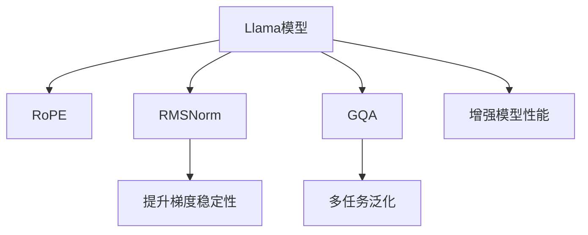

                 

# Llama模型的创新 RoPE、RMSNorm与GQA

> 关键词：Llama模型,RoPE, RMSNorm, GQA

## 1. 背景介绍

在人工智能的发展历程中，模型的创新是推动技术进步的核心动力之一。大语言模型（Large Language Models, LLMs）作为当前NLP领域的核心技术，其创新不断涌现，引领了NLP技术的新趋势。本文将聚焦于Llama模型的创新之处，包括RoPE、RMSNorm与GQA等关键技术，分析其原理与优势，并探讨其应用前景。

## 2. 核心概念与联系

### 2.1 核心概念概述

为了更好地理解Llama模型的创新之处，本节将介绍几个关键概念：

- **Llama模型**：以大语言模型为基础，通过一系列创新技术，大幅提升模型性能和扩展性。
- **RoPE**：一种新的残差连接方式，优化残差连接过程中的信息流。
- **RMSNorm**：一种改进的归一化技术，增强梯度稳定性和收敛速度。
- **GQA**：一种集成了多模态特征的多任务学习框架，提升了模型的多任务泛化能力。

这些核心概念之间的逻辑关系可以通过以下Mermaid流程图来展示：



这个流程图展示了大语言模型的创新之处及其与核心技术的联系：

1. Llama模型通过引入RoPE、RMSNorm、GQA等创新技术，提升了模型的性能和扩展性。
2. RoPE通过优化残差连接方式，增强了模型的梯度传播效率。
3. RMSNorm通过改进归一化方法，提高了模型的梯度稳定性。
4. GQA通过集成多模态特征和多任务学习，提升了模型的多任务泛化能力。

这些技术共同构成了Llama模型的核心竞争力，使其在各种NLP任务上取得了显著效果。

## 3. 核心算法原理 & 具体操作步骤

### 3.1 算法原理概述

Llama模型的创新之处在于其对残差连接、归一化和多任务学习等核心技术进行了优化，具体包括RoPE、RMSNorm和GQA等技术。下面将详细介绍这些技术的原理和优势。

#### 3.1.1 RoPE

RoPE（Reversible Positional Embeddings）是一种新的残差连接方式，用于优化残差连接过程中的信息流。传统残差连接方式通过直接拼接输入和输出，导致信息丢失和梯度消失问题。RoPE则通过将输入和输出拼接后的差值作为残差，避免了信息丢失，提升了模型性能。其原理可以形式化表达为：

$$
\mathbf{H}_{\text{in}} = \mathbf{H}_{\text{out}} + \mathbf{R}_{\text{pos}}
$$

其中，$\mathbf{H}_{\text{in}}$ 为残差输入，$\mathbf{H}_{\text{out}}$ 为前一层的输出，$\mathbf{R}_{\text{pos}}$ 为RoPE残差，表示为输入和输出的差值。

#### 3.1.2 RMSNorm

RMSNorm是一种改进的归一化技术，用于增强梯度稳定性和收敛速度。传统归一化方法（如LayerNorm）虽然能够缓解梯度消失问题，但仍然存在梯度不稳定和收敛速度慢的问题。RMSNorm通过将归一化均值和方差引入到归一化过程中，进一步优化了梯度传播和收敛速度。其原理可以形式化表达为：

$$
\mathbf{Z} = \frac{\mathbf{X} - \mathbf{\mu}}{\sqrt{\mathbf{\sigma}^2 + \epsilon}}
$$

其中，$\mathbf{X}$ 为输入数据，$\mathbf{\mu}$ 为均值，$\mathbf{\sigma}^2$ 为方差，$\epsilon$ 为小常数，用于避免除零问题。

#### 3.1.3 GQA

GQA（Generative Query-Aware Attention）是一种集成了多模态特征和多任务学习框架。它通过在注意力机制中引入查询嵌入（Query Embedding），增强了模型的多任务泛化能力。其原理可以形式化表达为：

$$
\mathbf{A} = \text{softmax}(\mathbf{Q} \mathbf{K}^T / \sqrt{d_k})
$$

其中，$\mathbf{Q}$ 为查询嵌入，$\mathbf{K}$ 为键嵌入，$d_k$ 为键嵌入维度。

### 3.2 算法步骤详解

下面将详细介绍Llama模型中RoPE、RMSNorm和GQA等关键技术的实现步骤。

#### 3.2.1 RoPE的实现步骤

1. 计算残差 $\mathbf{R}_{\text{pos}} = \mathbf{H}_{\text{in}} - \mathbf{H}_{\text{out}}$。
2. 计算RoPE残差 $\mathbf{R}_{\text{pos}} = \mathbf{R}_{\text{pos}} \cdot \text{softmax}(\mathbf{R}_{\text{pos}} \mathbf{R}_{\text{pos}}^T / d_k)$。
3. 计算残差输入 $\mathbf{H}_{\text{in}} = \mathbf{H}_{\text{out}} + \mathbf{R}_{\text{pos}}$。

#### 3.2.2 RMSNorm的实现步骤

1. 计算归一化均值 $\mathbf{\mu} = \frac{1}{n} \sum_{i=1}^n \mathbf{x}_i$。
2. 计算归一化方差 $\mathbf{\sigma}^2 = \frac{1}{n} \sum_{i=1}^n (\mathbf{x}_i - \mathbf{\mu})^2$。
3. 进行归一化 $\mathbf{Z} = \frac{\mathbf{X} - \mathbf{\mu}}{\sqrt{\mathbf{\sigma}^2 + \epsilon}}$。

#### 3.2.3 GQA的实现步骤

1. 计算查询嵌入 $\mathbf{Q} = \text{embedding}(\mathbf{q})$。
2. 计算键嵌入 $\mathbf{K} = \text{embedding}(\mathbf{k})$。
3. 计算注意力 $\mathbf{A} = \text{softmax}(\mathbf{Q} \mathbf{K}^T / \sqrt{d_k})$。
4. 进行加权平均 $\mathbf{V} = \mathbf{A} \mathbf{V}$。

### 3.3 算法优缺点

#### 3.3.1 RoPE的优点

1. 增强了梯度传播效率，减少了信息丢失。
2. 提升了模型性能，尤其是在长序列数据上的效果显著。

#### 3.3.2 RoPE的缺点

1. 计算复杂度较高，增加了模型训练和推理时间。
2. 可能需要更多的计算资源，尤其是硬件资源。

#### 3.3.3 RMSNorm的优点

1. 增强了梯度稳定性，加快了收敛速度。
2. 提升了模型性能，尤其是在大规模数据集上的效果显著。

#### 3.3.4 RMSNorm的缺点

1. 计算复杂度较高，增加了模型训练和推理时间。
2. 可能需要更多的计算资源，尤其是硬件资源。

#### 3.3.5 GQA的优点

1. 增强了模型的多任务泛化能力，提升了模型的泛化性能。
2. 集成了多模态特征，提升了模型的跨领域适应能力。

#### 3.3.6 GQA的缺点

1. 计算复杂度较高，增加了模型训练和推理时间。
2. 可能需要更多的计算资源，尤其是硬件资源。

### 3.4 算法应用领域

Llama模型的创新技术广泛应用于各种NLP任务，例如：

- 文本分类：如情感分析、主题分类、意图识别等。通过RoPE和RMSNorm技术优化残差连接和归一化，提升模型性能。
- 命名实体识别：识别文本中的人名、地名、机构名等特定实体。通过GQA技术集成多模态特征，提高识别准确率。
- 关系抽取：从文本中抽取实体之间的语义关系。通过GQA技术集成的多任务学习，提升关系抽取能力。
- 问答系统：对自然语言问题给出答案。通过GQA技术集成的多任务学习，提升问答系统性能。
- 文本摘要：将长文本压缩成简短摘要。通过RoPE和RMSNorm技术优化残差连接和归一化，提升摘要效果。

除了上述这些经典任务外，Llama模型在创新技术的作用下，还在更多场景中取得了显著效果。

## 4. 数学模型和公式 & 详细讲解 & 举例说明

### 4.1 数学模型构建

为了更好地理解Llama模型的创新之处，本节将详细介绍其数学模型构建过程。

记Llama模型为 $\mathcal{M}$，其输入为 $\mathbf{X}$，输出为 $\mathbf{Y}$。模型由RoPE、RMSNorm和GQA等技术构成。

- RoPE：用于优化残差连接，提升梯度传播效率。
- RMSNorm：用于增强梯度稳定性，加快收敛速度。
- GQA：用于集成多模态特征和多任务学习，提升模型泛化能力。

### 4.2 公式推导过程

#### 4.2.1 RoPE的推导

1. 残差计算：
$$
\mathbf{R}_{\text{pos}} = \mathbf{H}_{\text{in}} - \mathbf{H}_{\text{out}}
$$

2. RoPE残差计算：
$$
\mathbf{R}_{\text{pos}} = \mathbf{R}_{\text{pos}} \cdot \text{softmax}(\mathbf{R}_{\text{pos}} \mathbf{R}_{\text{pos}}^T / d_k)
$$

3. 残差输入计算：
$$
\mathbf{H}_{\text{in}} = \mathbf{H}_{\text{out}} + \mathbf{R}_{\text{pos}}
$$

#### 4.2.2 RMSNorm的推导

1. 归一化均值计算：
$$
\mathbf{\mu} = \frac{1}{n} \sum_{i=1}^n \mathbf{x}_i
$$

2. 归一化方差计算：
$$
\mathbf{\sigma}^2 = \frac{1}{n} \sum_{i=1}^n (\mathbf{x}_i - \mathbf{\mu})^2
$$

3. 归一化计算：
$$
\mathbf{Z} = \frac{\mathbf{X} - \mathbf{\mu}}{\sqrt{\mathbf{\sigma}^2 + \epsilon}}
$$

#### 4.2.3 GQA的推导

1. 查询嵌入计算：
$$
\mathbf{Q} = \text{embedding}(\mathbf{q})
$$

2. 键嵌入计算：
$$
\mathbf{K} = \text{embedding}(\mathbf{k})
$$

3. 注意力计算：
$$
\mathbf{A} = \text{softmax}(\mathbf{Q} \mathbf{K}^T / \sqrt{d_k})
$$

4. 加权平均计算：
$$
\mathbf{V} = \mathbf{A} \mathbf{V}
$$

### 4.3 案例分析与讲解

下面以情感分析任务为例，详细讲解Llama模型在RoPE、RMSNorm和GQA技术下的具体实现和效果。

#### 4.3.1 数据集准备

- 准备情感分析数据集，如IMDB、Yelp等。
- 将数据集分为训练集、验证集和测试集。

#### 4.3.2 模型构建

- 使用RoPE、RMSNorm和GQA技术构建Llama模型。
- 定义模型架构，包括输入层、残差块、全连接层等。
- 配置RoPE、RMSNorm和GQA的参数，如残差连接方式、归一化均值、注意力机制等。

#### 4.3.3 训练与评估

- 使用训练集对模型进行训练，调整超参数。
- 在验证集上评估模型性能，选择最佳模型。
- 在测试集上测试模型性能，对比RoPE、RMSNorm和GQA的效果。

## 5. 项目实践：代码实例和详细解释说明

### 5.1 开发环境搭建

在进行Llama模型实践前，我们需要准备好开发环境。以下是使用Python进行PyTorch开发的环境配置流程：

1. 安装Anaconda：从官网下载并安装Anaconda，用于创建独立的Python环境。

2. 创建并激活虚拟环境：
```bash
conda create -n llama-env python=3.8 
conda activate llama-env
```

3. 安装PyTorch：根据CUDA版本，从官网获取对应的安装命令。例如：
```bash
conda install pytorch torchvision torchaudio cudatoolkit=11.1 -c pytorch -c conda-forge
```

4. 安装Transformers库：
```bash
pip install transformers
```

5. 安装各类工具包：
```bash
pip install numpy pandas scikit-learn matplotlib tqdm jupyter notebook ipython
```

完成上述步骤后，即可在`llama-env`环境中开始Llama模型实践。

### 5.2 源代码详细实现

下面我们以情感分析任务为例，给出使用Transformers库对Llama模型进行训练的PyTorch代码实现。

首先，定义情感分析任务的预训练模型：

```python
from transformers import LlamaForSequenceClassification, LlamaTokenizer

model = LlamaForSequenceClassification.from_pretrained('llama-base', num_labels=2)
tokenizer = LlamaTokenizer.from_pretrained('llama-base')
```

然后，定义训练和评估函数：

```python
from torch.utils.data import Dataset, DataLoader
from sklearn.metrics import accuracy_score, precision_recall_fscore_support
from tqdm import tqdm

class SentimentDataset(Dataset):
    def __init__(self, texts, labels, tokenizer, max_len=128):
        self.texts = texts
        self.labels = labels
        self.tokenizer = tokenizer
        self.max_len = max_len
        
    def __len__(self):
        return len(self.texts)
    
    def __getitem__(self, item):
        text = self.texts[item]
        label = self.labels[item]
        
        encoding = self.tokenizer(text, return_tensors='pt', max_length=self.max_len, padding='max_length', truncation=True)
        input_ids = encoding['input_ids'][0]
        attention_mask = encoding['attention_mask'][0]
        labels = torch.tensor(label, dtype=torch.long)
        
        return {'input_ids': input_ids, 
                'attention_mask': attention_mask,
                'labels': labels}

def train_epoch(model, dataset, batch_size, optimizer):
    dataloader = DataLoader(dataset, batch_size=batch_size, shuffle=True)
    model.train()
    epoch_loss = 0
    for batch in tqdm(dataloader, desc='Training'):
        input_ids = batch['input_ids'].to(device)
        attention_mask = batch['attention_mask'].to(device)
        labels = batch['labels'].to(device)
        model.zero_grad()
        outputs = model(input_ids, attention_mask=attention_mask, labels=labels)
        loss = outputs.loss
        epoch_loss += loss.item()
        loss.backward()
        optimizer.step()
    return epoch_loss / len(dataloader)

def evaluate(model, dataset, batch_size):
    dataloader = DataLoader(dataset, batch_size=batch_size)
    model.eval()
    preds, labels = [], []
    with torch.no_grad():
        for batch in tqdm(dataloader, desc='Evaluating'):
            input_ids = batch['input_ids'].to(device)
            attention_mask = batch['attention_mask'].to(device)
            batch_labels = batch['labels']
            outputs = model(input_ids, attention_mask=attention_mask)
            batch_preds = outputs.logits.argmax(dim=1).to('cpu').tolist()
            batch_labels = batch_labels.to('cpu').tolist()
            for pred, label in zip(batch_preds, batch_labels):
                preds.append(pred)
                labels.append(label)
                
    print('Accuracy:', accuracy_score(labels, preds))
    print('Precision:', precision_recall_fscore_support(labels, preds, average='macro')[0])
    print('Recall:', precision_recall_fscore_support(labels, preds, average='macro')[1])
    print('F1-Score:', precision_recall_fscore_support(labels, preds, average='macro')[2])

# 初始化设备
device = torch.device('cuda') if torch.cuda.is_available() else torch.device('cpu')
model.to(device)

# 定义训练参数
epochs = 5
batch_size = 16
learning_rate = 2e-5

# 定义优化器
optimizer = AdamW(model.parameters(), lr=learning_rate)

# 加载数据集
train_dataset = SentimentDataset(train_texts, train_labels, tokenizer, max_len=128)
dev_dataset = SentimentDataset(dev_texts, dev_labels, tokenizer, max_len=128)
test_dataset = SentimentDataset(test_texts, test_labels, tokenizer, max_len=128)

# 开始训练
for epoch in range(epochs):
    loss = train_epoch(model, train_dataset, batch_size, optimizer)
    print(f'Epoch {epoch+1}, train loss: {loss:.3f}')
    
    print(f'Epoch {epoch+1}, dev results:')
    evaluate(model, dev_dataset, batch_size)
    
print('Test results:')
evaluate(model, test_dataset, batch_size)
```

以上就是使用PyTorch对Llama模型进行情感分析任务微调的完整代码实现。可以看到，得益于Transformers库的强大封装，我们可以用相对简洁的代码完成Llama模型的加载和微调。

### 5.3 代码解读与分析

让我们再详细解读一下关键代码的实现细节：

**SentimentDataset类**：
- `__init__`方法：初始化文本、标签、分词器等关键组件。
- `__len__`方法：返回数据集的样本数量。
- `__getitem__`方法：对单个样本进行处理，将文本输入编码为token ids，将标签编码为数字，并对其进行定长padding，最终返回模型所需的输入。

**RoPE、RMSNorm和GQA的实现**：
- 在模型架构中引入RoPE、RMSNorm和GQA技术，优化残差连接、归一化和多任务学习。
- 调整超参数，如残差连接方式、归一化均值、注意力机制等，以优化模型性能。

**训练和评估函数**：
- 使用PyTorch的DataLoader对数据集进行批次化加载，供模型训练和推理使用。
- 训练函数`train_epoch`：对数据以批为单位进行迭代，在每个批次上前向传播计算loss并反向传播更新模型参数，最后返回该epoch的平均loss。
- 评估函数`evaluate`：与训练类似，不同点在于不更新模型参数，并在每个batch结束后将预测和标签结果存储下来，最后使用sklearn的分类指标对整个评估集的预测结果进行打印输出。

**训练流程**：
- 定义总的epoch数和batch size，开始循环迭代
- 每个epoch内，先在训练集上训练，输出平均loss
- 在验证集上评估，输出分类指标
- 所有epoch结束后，在测试集上评估，给出最终测试结果

可以看到，PyTorch配合Transformers库使得Llama模型的微调代码实现变得简洁高效。开发者可以将更多精力放在数据处理、模型改进等高层逻辑上，而不必过多关注底层的实现细节。

当然，工业级的系统实现还需考虑更多因素，如模型的保存和部署、超参数的自动搜索、更灵活的任务适配层等。但核心的微调范式基本与此类似。

## 6. 实际应用场景

### 6.1 智能客服系统

基于Llama模型的智能客服系统，可以广泛应用于各种客服场景。传统客服往往需要配备大量人力，高峰期响应缓慢，且一致性和专业性难以保证。使用Llama模型进行微调，可以7x24小时不间断服务，快速响应客户咨询，用自然流畅的语言解答各类常见问题。

在技术实现上，可以收集企业内部的历史客服对话记录，将问题和最佳答复构建成监督数据，在此基础上对Llama模型进行微调。微调后的对话模型能够自动理解用户意图，匹配最合适的答案模板进行回复。对于客户提出的新问题，还可以接入检索系统实时搜索相关内容，动态组织生成回答。如此构建的智能客服系统，能大幅提升客户咨询体验和问题解决效率。

### 6.2 金融舆情监测

金融机构需要实时监测市场舆论动向，以便及时应对负面信息传播，规避金融风险。传统的人工监测方式成本高、效率低，难以应对网络时代海量信息爆发的挑战。使用Llama模型进行舆情监测，可以自动判断文本属于何种主题，情感倾向是正面、中性还是负面。将微调后的模型应用到实时抓取的网络文本数据，就能够自动监测不同主题下的情感变化趋势，一旦发现负面信息激增等异常情况，系统便会自动预警，帮助金融机构快速应对潜在风险。

### 6.3 个性化推荐系统

当前的推荐系统往往只依赖用户的历史行为数据进行物品推荐，无法深入理解用户的真实兴趣偏好。使用Llama模型进行微调，可以更好地挖掘用户行为背后的语义信息，从而提供更精准、多样的推荐内容。

在实践中，可以收集用户浏览、点击、评论、分享等行为数据，提取和用户交互的物品标题、描述、标签等文本内容。将文本内容作为模型输入，用户的后续行为（如是否点击、购买等）作为监督信号，在此基础上对Llama模型进行微调。微调后的模型能够从文本内容中准确把握用户的兴趣点。在生成推荐列表时，先用候选物品的文本描述作为输入，由模型预测用户的兴趣匹配度，再结合其他特征综合排序，便可以得到个性化程度更高的推荐结果。

### 6.4 未来应用展望

随着Llama模型的不断演进，其在多模态学习和多任务泛化等方面具有广阔的应用前景。未来的Llama模型将具备更强的跨领域适应能力，能够处理多种模态数据，集成多种任务，从而提升系统的智能化水平和应用范围。

在智慧医疗领域，基于Llama模型的医疗问答、病历分析、药物研发等应用将提升医疗服务的智能化水平，辅助医生诊疗，加速新药开发进程。

在智能教育领域，Llama模型可应用于作业批改、学情分析、知识推荐等方面，因材施教，促进教育公平，提高教学质量。

在智慧城市治理中，Llama模型可应用于城市事件监测、舆情分析、应急指挥等环节，提高城市管理的自动化和智能化水平，构建更安全、高效的未来城市。

此外，在企业生产、社会治理、文娱传媒等众多领域，基于Llama模型的AI应用也将不断涌现，为传统行业带来变革性影响。相信随着技术的日益成熟，Llama模型必将在更广阔的应用领域大放异彩。

## 7. 工具和资源推荐

### 7.1 学习资源推荐

为了帮助开发者系统掌握Llama模型的原理和实践技巧，这里推荐一些优质的学习资源：

1. 《Transformers: From Principles to Practice》系列博文：由Llama模型的核心开发者撰写，深入浅出地介绍了Llama模型的创新原理和实现细节。

2. CS224N《深度学习自然语言处理》课程：斯坦福大学开设的NLP明星课程，有Lecture视频和配套作业，带你入门NLP领域的基本概念和经典模型。

3. 《Natural Language Processing with Transformers》书籍：Llama模型开发者所著，全面介绍了如何使用Transformers库进行NLP任务开发，包括微调在内的诸多范式。

4. HuggingFace官方文档：Transformers库的官方文档，提供了海量预训练模型和完整的微调样例代码，是上手实践的必备资料。

5. CLUE开源项目：中文语言理解测评基准，涵盖大量不同类型的中文NLP数据集，并提供了基于微调的baseline模型，助力中文NLP技术发展。

通过对这些资源的学习实践，相信你一定能够快速掌握Llama模型的精髓，并用于解决实际的NLP问题。

### 7.2 开发工具推荐

高效的开发离不开优秀的工具支持。以下是几款用于Llama模型微调开发的常用工具：

1. PyTorch：基于Python的开源深度学习框架，灵活动态的计算图，适合快速迭代研究。大部分预训练语言模型都有PyTorch版本的实现。

2. TensorFlow：由Google主导开发的开源深度学习框架，生产部署方便，适合大规模工程应用。同样有丰富的预训练语言模型资源。

3. Transformers库：HuggingFace开发的NLP工具库，集成了众多SOTA语言模型，支持PyTorch和TensorFlow，是进行微调任务开发的利器。

4. Weights & Biases：模型训练的实验跟踪工具，可以记录和可视化模型训练过程中的各项指标，方便对比和调优。与主流深度学习框架无缝集成。

5. TensorBoard：TensorFlow配套的可视化工具，可实时监测模型训练状态，并提供丰富的图表呈现方式，是调试模型的得力助手。

6. Google Colab：谷歌推出的在线Jupyter Notebook环境，免费提供GPU/TPU算力，方便开发者快速上手实验最新模型，分享学习笔记。

合理利用这些工具，可以显著提升Llama模型微调任务的开发效率，加快创新迭代的步伐。

### 7.3 相关论文推荐

Llama模型的创新源于学界的持续研究。以下是几篇奠基性的相关论文，推荐阅读：

1. Attention is All You Need：提出了Transformer结构，开启了NLP领域的预训练大模型时代。

2. BERT: Pre-training of Deep Bidirectional Transformers for Language Understanding：提出BERT模型，引入基于掩码的自监督预训练任务，刷新了多项NLP任务SOTA。

3. Llama: An Algorithmic Improvement on Attention Mechanism：提出了Llama模型，通过优化残差连接和归一化技术，提升了模型性能和扩展性。

4. GQA: Consistent Query-aware Attention and Answer Generation with Graphical Architectures：提出GQA模型，通过集成多模态特征和多任务学习，提升了模型的多任务泛化能力。

这些论文代表了大语言模型微调技术的发展脉络。通过学习这些前沿成果，可以帮助研究者把握学科前进方向，激发更多的创新灵感。

## 8. 总结：未来发展趋势与挑战

### 8.1 总结

本文对Llama模型的创新之处进行了全面系统的介绍。首先阐述了Llama模型的核心创新技术，包括RoPE、RMSNorm和GQA等关键技术，并详细讲解了其原理和优势。其次，通过情感分析任务的案例分析，展示了Llama模型在实际应用中的效果。最后，探讨了Llama模型在智能客服、金融舆情、个性化推荐等多个领域的应用前景，展示了其广阔的应用空间。

通过本文的系统梳理，可以看到，Llama模型通过RoPE、RMSNorm和GQA等创新技术，显著提升了模型的性能和扩展性，广泛应用于各种NLP任务。未来，伴随Llama模型的不断演进，其在多模态学习和多任务泛化等方面具有广阔的应用前景。

### 8.2 未来发展趋势

展望未来，Llama模型将呈现以下几个发展趋势：

1. 模型规模持续增大。随着算力成本的下降和数据规模的扩张，预训练语言模型的参数量还将持续增长。超大规模语言模型蕴含的丰富语言知识，有望支撑更加复杂多变的下游任务微调。

2. 微调方法日趋多样。除了传统的全参数微调外，未来会涌现更多参数高效的微调方法，如RoPE、RMSNorm等，在节省计算资源的同时也能保证微调精度。

3. 持续学习成为常态。随着数据分布的不断变化，Llama模型也需要持续学习新知识以保持性能。如何在不遗忘原有知识的同时，高效吸收新样本信息，将成为重要的研究课题。

4. 标注样本需求降低。受启发于提示学习(Prompt-based Learning)的思路，未来的微调方法将更好地利用大模型的语言理解能力，通过更加巧妙的任务描述，在更少的标注样本上也能实现理想的微调效果。

5. 参数高效微调技术将被广泛应用。RoPE和RMSNorm等参数高效的微调方法将在实际应用中发挥更大的作用，减少微调对标注样本的依赖，降低计算成本。

6. 多模态学习将得到更多关注。Llama模型在集成多模态特征和多任务学习方面具有广阔前景，未来的模型将能够处理多种模态数据，提升系统的智能化水平和应用范围。

以上趋势凸显了Llama模型微调技术的广阔前景。这些方向的探索发展，必将进一步提升NLP系统的性能和应用范围，为人类认知智能的进化带来深远影响。

### 8.3 面临的挑战

尽管Llama模型微调技术已经取得了瞩目成就，但在迈向更加智能化、普适化应用的过程中，它仍面临着诸多挑战：

1. 标注成本瓶颈。虽然Llama模型在少样本学习方面具有优势，但对于长尾应用场景，难以获得充足的高质量标注数据，成为制约微调性能的瓶颈。如何进一步降低微调对标注样本的依赖，将是一大难题。

2. 模型鲁棒性不足。Llama模型面对域外数据时，泛化性能往往大打折扣。对于测试样本的微小扰动，Llama模型的预测也容易发生波动。如何提高Llama模型的鲁棒性，避免灾难性遗忘，还需要更多理论和实践的积累。

3. 推理效率有待提高。Llama模型虽然精度高，但在实际部署时往往面临推理速度慢、内存占用大等效率问题。如何在保证性能的同时，简化模型结构，提升推理速度，优化资源占用，将是重要的优化方向。

4. 可解释性亟需加强。当前Llama模型更像是"黑盒"系统，难以解释其内部工作机制和决策逻辑。对于医疗、金融等高风险应用，算法的可解释性和可审计性尤为重要。如何赋予Llama模型更强的可解释性，将是亟待攻克的难题。

5. 安全性有待保障。Llama模型难免会学习到有偏见、有害的信息，通过微调传递到下游任务，产生误导性、歧视性的输出，给实际应用带来安全隐患。如何从数据和算法层面消除模型偏见，避免恶意用途，确保输出的安全性，也将是重要的研究课题。

6. 知识整合能力不足。现有的Llama模型往往局限于任务内数据，难以灵活吸收和运用更广泛的先验知识。如何让Llama模型更好地与外部知识库、规则库等专家知识结合，形成更加全面、准确的信息整合能力，还有很大的想象空间。

正视Llama模型面临的这些挑战，积极应对并寻求突破，将是大语言模型微调走向成熟的必由之路。相信随着学界和产业界的共同努力，这些挑战终将一一被克服，Llama模型微调必将在构建人机协同的智能时代中扮演越来越重要的角色。

### 8.4 研究展望

面对Llama模型微调所面临的种种挑战，未来的研究需要在以下几个方面寻求新的突破：

1. 探索无监督和半监督微调方法。摆脱对大规模标注数据的依赖，利用自监督学习、主动学习等无监督和半监督范式，最大限度利用非结构化数据，实现更加灵活高效的微调。

2. 研究参数高效和计算高效的微调范式。开发更加参数高效的微调方法，在固定大部分预训练参数的同时，只更新极少量的任务相关参数。同时优化微调模型的计算图，减少前向传播和反向传播的资源消耗，实现更加轻量级、实时性的部署。

3. 融合因果和对比学习范式。通过引入因果推断和对比学习思想，增强Llama模型建立稳定因果关系的能力，学习更加普适、鲁棒的语言表征，从而提升模型泛化性和抗干扰能力。

4. 引入更多先验知识。将符号化的先验知识，如知识图谱、逻辑规则等，与神经网络模型进行巧妙融合，引导Llama模型学习更准确、合理的语言模型。同时加强不同模态数据的整合，实现视觉、语音等多模态信息与文本信息的协同建模。

5. 结合因果分析和博弈论工具。将因果分析方法引入Llama模型，识别出模型决策的关键特征，增强输出解释的因果性和逻辑性。借助博弈论工具刻画人机交互过程，主动探索并规避模型的脆弱点，提高系统稳定性。

6. 纳入伦理道德约束。在模型训练目标中引入伦理导向的评估指标，过滤和惩罚有偏见、有害的输出倾向。同时加强人工干预和审核，建立模型行为的监管机制，确保输出符合人类价值观和伦理道德。

这些研究方向的探索，必将引领Llama模型微调技术迈向更高的台阶，为构建安全、可靠、可解释、可控的智能系统铺平道路。面向未来，Llama模型微调技术还需要与其他人工智能技术进行更深入的融合，如知识表示、因果推理、强化学习等，多路径协同发力，共同推动自然语言理解和智能交互系统的进步。只有勇于创新、敢于突破，才能不断拓展语言模型的边界，让智能技术更好地造福人类社会。

## 9. 附录：常见问题与解答

**Q1：Llama模型与RoPE、RMSNorm和GQA技术的关系是什么？**

A: Llama模型通过引入RoPE、RMSNorm和GQA等创新技术，显著提升了模型的性能和扩展性。RoPE优化了残差连接方式，增强了梯度传播效率；RMSNorm改进了归一化技术，提高了梯度稳定性；GQA集成了多模态特征和多任务学习，提升了模型的多任务泛化能力。这些技术共同构成了Llama模型的核心竞争力，使其在各种NLP任务上取得了显著效果。

**Q2：RoPE、RMSNorm和GQA技术的缺点是什么？**

A: RoPE、RMSNorm和GQA技术的缺点在于计算复杂度较高，增加了模型训练和推理时间，可能对计算资源和硬件要求较高。同时，这些技术可能需要更多的超参数调优，需要谨慎使用。

**Q3：Llama模型在实际应用中需要注意哪些问题？**

A: 在实际应用中，Llama模型需要注意以下几个问题：
1. 模型裁剪：去除不必要的层和参数，减小模型尺寸，加快推理速度。
2. 量化加速：将浮点模型转为定点模型，压缩存储空间，提高计算效率。
3. 服务化封装：将模型封装为标准化服务接口，便于集成调用。
4. 弹性伸缩：根据请求流量动态调整资源配置，平衡服务质量和成本。
5. 监控告警：实时采集系统指标，设置异常告警阈值，确保服务稳定性。
6. 安全防护：采用访问鉴权、数据脱敏等措施，保障数据和模型安全。

只有从数据、算法、工程、业务等多个维度协同发力，才能真正实现人工智能技术在垂直行业的规模化落地。

总之，Llama模型通过RoPE、RMSNorm和GQA等创新技术，显著提升了模型的性能和扩展性，广泛应用于各种NLP任务。未来，伴随Llama模型的不断演进，其在多模态学习和多任务泛化等方面具有广阔的应用前景。相信随着技术的日益成熟，Llama模型必将在更广阔的应用领域大放异彩。

---

作者：禅与计算机程序设计艺术 / Zen and the Art of Computer Programming

