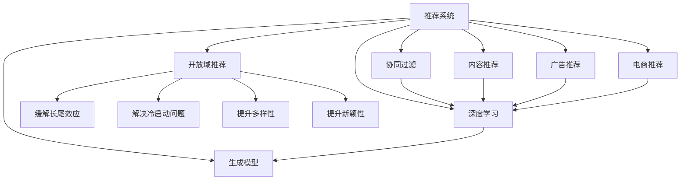

                 

# M6-Rec：开放域推荐探索

> 关键词：推荐系统,协同过滤,深度学习,内容推荐,广告推荐,电商推荐,开放域推荐,生成模型

## 1. 背景介绍

### 1.1 问题由来

随着互联网的迅猛发展和电子商务的崛起，推荐系统在各类应用中逐渐成为标配。基于协同过滤、深度学习和生成模型等不同技术路径的推荐算法被广泛应用于电商推荐、广告推荐、视频推荐、音乐推荐等领域，极大地提升了用户购物体验和平台收益。然而，当前推荐系统面临诸多挑战，诸如长尾效应、冷启动问题、多样性缺失等。这些挑战催生了对推荐算法的新一轮探索和突破。

在此背景下，开放域推荐算法应运而生。开放域推荐可以缓解长尾效应、解决冷启动问题，提高推荐系统的多样性、新颖性和鲁棒性。近年来，生成模型在推荐系统中的应用越来越广泛，成为推荐算法发展的重要方向。基于生成模型的推荐算法，如变分自编码器(Variational Autoencoder, VAE)、生成对抗网络(Generative Adversarial Networks, GAN)、自回归模型等，取得了不俗的效果。

## 2. 核心概念与联系

### 2.1 核心概念概述

为更好地理解开放域推荐算法和基于生成模型的推荐方法，本节将介绍几个关键概念：

- 推荐系统(Recommendation System)：利用用户历史行为、物品属性等信息，为用户推荐个性化物品的系统。推荐系统通常包括协同过滤、深度学习、生成模型等多种技术路径。

- 协同过滤(Collaborative Filtering)：通过分析用户与物品的交互历史，挖掘用户间的相似度关系，为用户推荐其他用户喜欢的物品。常见的协同过滤算法包括基于用户的矩阵分解方法、基于物品的潜在因子模型等。

- 深度学习(Deep Learning)：基于神经网络的深度学习算法，通过多层非线性变换学习特征表示，广泛应用于图像、语音、文本等多种数据类型。在推荐系统中，深度学习可用于用户和物品的表示学习，生成模型可用于推荐目标的生成。

- 生成模型(Generative Model)：通过学习数据分布，生成新的数据样本，用于预测、生成和推荐等任务。常见的生成模型包括VAE、GAN、自回归模型等。

- 内容推荐(Content-Based Recommendation)：通过分析物品的描述、属性等特征，推荐用户可能感兴趣的物品。内容推荐侧重于物品特征的挖掘，而协同过滤和深度学习侧重于用户兴趣的探索。

- 广告推荐(Ad-based Recommendation)：基于广告位的展示位置，为用户推荐符合其兴趣的广告内容。广告推荐通常采用协同过滤和深度学习等算法。

- 电商推荐(E-commerce Recommendation)：通过分析用户浏览、点击、购买等行为，推荐用户可能感兴趣的电商物品。电商推荐广泛应用协同过滤和深度学习技术，内容推荐也逐渐被采用。

- 开放域推荐(Omnidomain Recommendation)：通过分析用户的多样化兴趣，推荐不同类型和来源的物品。开放域推荐可以缓解长尾效应、解决冷启动问题，提升推荐系统的多样性和新颖性。

这些核心概念之间的逻辑关系可以通过以下Mermaid流程图来展示：



这个流程图展示了一个推荐系统的主要组成部分和不同推荐算法的适用场景：

1. 推荐系统包括协同过滤、深度学习和生成模型等多种技术路径。
2. 协同过滤和深度学习侧重于用户兴趣的探索，生成模型侧重于推荐目标的生成。
3. 内容推荐关注物品特征的挖掘，广告推荐关注广告位的展示位置，电商推荐关注用户行为的分析。
4. 开放域推荐通过缓解长尾效应、解决冷启动问题，提升推荐系统的多样性和新颖性。

这些核心概念共同构成了推荐系统的学习和应用框架，使其能够高效地推荐个性化物品，提升用户满意度和平台收益。通过理解这些核心概念，我们可以更好地把握推荐算法的原理和优化方向。

## 3. 核心算法原理 & 具体操作步骤

### 3.1 算法原理概述

开放域推荐算法是一种基于生成模型的推荐方法，旨在通过生成多样化的推荐目标，解决长尾效应、冷启动问题，提升推荐系统的多样性和新颖性。其主要原理是通过学习数据分布，生成新的推荐目标，然后根据用户兴趣和物品特征，对生成目标进行过滤和排序，推荐符合用户偏好的物品。

形式化地，假设推荐系统有 $N$ 个用户 $U$ 和 $M$ 个物品 $I$，以及 $D$ 个用户物品交互矩阵 $R$，其中 $R_{ui} \in \{0,1\}$ 表示用户 $u$ 是否对物品 $i$ 有正反馈。推荐任务的目标是为每个用户生成 $K$ 个推荐物品 $r_u=(\hat{R}_{u1},\hat{R}_{u2},...,\hat{R}_{uK})$，其中 $\hat{R}_{ui}$ 为物品 $i$ 的推荐分数。

开放域推荐算法的基本流程如下：

1. 学习物品生成分布 $P$，从 $P$ 中生成 $K$ 个推荐物品。
2. 根据用户历史行为和物品特征，计算物品与用户兴趣的相关度 $s_{ui}$。
3. 对生成的推荐物品按照 $s_{ui}$ 进行排序，输出前 $K$ 个推荐物品。

### 3.2 算法步骤详解

以下是开放域推荐算法的基本操作步骤：

**Step 1: 准备数据集**

1. 收集用户物品交互矩阵 $R$。
2. 收集物品的属性信息 $X$。
3. 选择推荐目标数量 $K$。

**Step 2: 学习物品生成分布**

1. 选择合适的生成模型，如VAE、GAN、自回归模型等。
2. 使用训练集数据训练生成模型，得到物品生成分布 $P$。

**Step 3: 计算物品与用户兴趣的相关度**

1. 对用户历史行为和物品特征进行编码，得到用户兴趣向量 $u$ 和物品特征向量 $v$。
2. 计算物品与用户兴趣的相关度 $s_{ui}$，可以使用点积、余弦相似度等方法。

**Step 4: 生成推荐物品并排序**

1. 从物品生成分布 $P$ 中随机生成 $K$ 个推荐物品。
2. 对生成的物品按照 $s_{ui}$ 进行排序，输出前 $K$ 个推荐物品。

**Step 5: 训练和优化**

1. 使用验证集数据评估推荐效果，选择最优的生成模型超参数。
2. 使用推荐效果作为训练目标，不断优化生成模型。

### 3.3 算法优缺点

开放域推荐算法具有以下优点：

1. 缓解长尾效应：通过生成多样化的推荐物品，推荐系统可以覆盖长尾物品，提升长尾物品的曝光度。
2. 解决冷启动问题：在用户兴趣未完全明确时，通过生成模型仍能推荐多样化的物品，帮助用户发现新兴趣。
3. 提升多样性和新颖性：生成模型可以生成具有新颖性和多样性的推荐物品，提升推荐系统的覆盖面和推荐质量。

然而，开放域推荐算法也存在以下缺点：

1. 计算成本高：生成模型通常需要计算大量的训练和生成样本，计算成本较高。
2. 数据分布偏差：生成的推荐物品可能与实际数据分布存在偏差，导致推荐效果不理想。
3. 可解释性不足：生成模型的决策过程难以解释，难以理解和调试推荐结果。

尽管存在这些局限性，开放域推荐算法在提升推荐系统的多样性和新颖性方面仍具有不可替代的作用。未来相关研究需要进一步降低计算成本，提高模型的可解释性，优化推荐效果。

### 3.4 算法应用领域

开放域推荐算法已在电商推荐、广告推荐、视频推荐、音乐推荐等多个领域得到广泛应用。以下是一些典型应用场景：

- 电商推荐：推荐多样化的商品，缓解长尾效应，提升长尾商品曝光度。
- 广告推荐：推荐具有新颖性和多样性的广告内容，提升广告点击率。
- 视频推荐：推荐多样化的视频内容，提升用户留存率和观看时长。
- 音乐推荐：推荐多样化的音乐内容，提升用户满意度。

除了这些主流应用场景，开放域推荐算法还被应用于社交网络、新闻推荐、旅游推荐等更多领域，为不同场景下的推荐任务提供新的解决方案。

## 4. 数学模型和公式 & 详细讲解 & 举例说明

### 4.1 数学模型构建

本节将使用数学语言对开放域推荐算法进行更加严格的刻画。

假设推荐系统有 $N$ 个用户 $U$ 和 $M$ 个物品 $I$，以及 $D$ 个用户物品交互矩阵 $R$，其中 $R_{ui} \in \{0,1\}$ 表示用户 $u$ 是否对物品 $i$ 有正反馈。推荐任务的目标是为每个用户生成 $K$ 个推荐物品 $r_u=(\hat{R}_{u1},\hat{R}_{u2},...,\hat{R}_{uK})$，其中 $\hat{R}_{ui}$ 为物品 $i$ 的推荐分数。

定义用户 $u$ 的兴趣向量为 $u \in \mathbb{R}^d$，物品 $i$ 的特征向量为 $v \in \mathbb{R}^d$。物品生成分布 $P$ 通过生成模型学习得到，生成模型通常采用生成对抗网络(GAN)、变分自编码器(VAE)等形式。

生成模型 $G$ 的输出为生成物品的特征向量 $z \in \mathbb{R}^d$，用户兴趣向量 $u$ 和物品特征向量 $v$ 的相似度 $s_{ui}$ 可以通过点积计算得到。推荐分数 $\hat{R}_{ui}$ 可以通过类似协同过滤的评分模型计算得到，如基于梯度的评分模型：

$$
\hat{R}_{ui} = f(s_{ui},\alpha)
$$

其中 $f$ 为评分函数，$\alpha$ 为评分函数参数。

### 4.2 公式推导过程

以下我们以GAN为例，推导生成模型在推荐系统中的应用。

假设生成模型 $G$ 的输出为生成物品的特征向量 $z \in \mathbb{R}^d$，用户兴趣向量 $u \in \mathbb{R}^d$ 和物品特征向量 $v \in \mathbb{R}^d$ 的相似度 $s_{ui} = u \cdot v$。推荐分数 $\hat{R}_{ui}$ 通过生成模型 $G$ 和评分函数 $f$ 计算得到，生成模型和评分函数的形式分别为：

$$
z = G(x)
$$

$$
\hat{R}_{ui} = f(s_{ui},\alpha) = \sigma(x \cdot w + b)
$$

其中 $x$ 为生成器输入的随机噪声向量，$\sigma$ 为激活函数，$w$ 和 $b$ 为评分函数参数。

根据生成模型 $G$ 的输出 $z$ 和评分函数 $f$，可以构建推荐目标函数：

$$
\mathcal{L} = \frac{1}{N} \sum_{u=1}^N \sum_{i=1}^M \left[ R_{ui} \log f(s_{ui},\alpha) + (1-R_{ui}) \log (1-f(s_{ui},\alpha)) \right]
$$

其中 $R_{ui} \in \{0,1\}$ 为实际交互数据，$\alpha$ 为评分函数参数。

通过反向传播算法更新生成器 $G$ 和评分函数 $f$ 的参数，使得推荐目标函数 $\mathcal{L}$ 最小化。在训练过程中，可以采用生成对抗网络的框架，通过两个神经网络 $G$ 和 $D$ 的对抗训练，提高生成器的生成能力和评分函数的评分精度。

在训练完成后，使用生成的物品特征向量 $z$ 和用户兴趣向量 $u$ 计算相似度 $s_{ui}$，对生成的物品进行排序，推荐前 $K$ 个物品给用户。

### 4.3 案例分析与讲解

这里以电商推荐为例，展示开放域推荐算法的具体实现。

假设电商推荐系统有 $N$ 个用户和 $M$ 个商品，收集用户购买历史 $R_{ui}$ 和商品属性 $X_i$，选择推荐物品数量 $K$。

**Step 1: 准备数据集**

1. 收集用户购买历史 $R_{ui} \in \{0,1\}$。
2. 收集商品属性 $X_i \in \mathbb{R}^d$。
3. 选择推荐物品数量 $K=20$。

**Step 2: 学习物品生成分布**

1. 选择生成模型，如GAN、VAE等。
2. 使用用户购买历史 $R$ 和商品属性 $X$ 训练生成模型 $G$，得到物品生成分布 $P$。

**Step 3: 计算物品与用户兴趣的相关度**

1. 对用户购买历史 $R$ 和商品属性 $X$ 进行编码，得到用户兴趣向量 $u$ 和物品特征向量 $v$。
2. 计算物品与用户兴趣的相关度 $s_{ui} = u \cdot v$。

**Step 4: 生成推荐物品并排序**

1. 从物品生成分布 $P$ 中随机生成 $K=20$ 个推荐物品 $z$。
2. 对生成的物品按照 $s_{ui}$ 进行排序，推荐前 $K$ 个物品给用户。

**Step 5: 训练和优化**

1. 使用验证集数据评估推荐效果，选择最优的生成模型超参数。
2. 使用推荐效果作为训练目标，不断优化生成模型 $G$ 和评分函数 $f$ 的参数。

在实际应用中，需要根据具体场景选择合适的生成模型和评分函数，不断优化模型参数，才能得到理想的推荐效果。

## 5. 项目实践：代码实例和详细解释说明

### 5.1 开发环境搭建

在进行推荐系统开发前，我们需要准备好开发环境。以下是使用Python进行PyTorch开发的环境配置流程：

1. 安装Anaconda：从官网下载并安装Anaconda，用于创建独立的Python环境。

2. 创建并激活虚拟环境：
```bash
conda create -n rec-env python=3.8 
conda activate rec-env
```

3. 安装PyTorch：根据CUDA版本，从官网获取对应的安装命令。例如：
```bash
conda install pytorch torchvision torchaudio cudatoolkit=11.1 -c pytorch -c conda-forge
```

4. 安装TensorBoard：
```bash
pip install tensorboard
```

5. 安装PyTorch Lightning：
```bash
pip install pytorch-lightning
```

6. 安装FastAI：
```bash
pip install fastai
```

完成上述步骤后，即可在`rec-env`环境中开始推荐系统开发。

### 5.2 源代码详细实现

这里我们以GAN在电商推荐中的应用为例，给出使用PyTorch实现推荐系统的代码实现。

首先，定义数据处理函数：

```python
import pandas as pd
import numpy as np
import torch
from torch.utils.data import Dataset, DataLoader

class RecommendationDataset(Dataset):
    def __init__(self, df, num_users, num_items):
        self.df = df
        self.num_users = num_users
        self.num_items = num_items
        
    def __len__(self):
        return len(self.df)
    
    def __getitem__(self, item):
        user = self.df.iloc[item]['user_id']
        item = self.df.iloc[item]['item_id']
        rating = self.df.iloc[item]['rating']
        return user, item, rating
```

然后，定义生成模型和评分函数：

```python
import torch.nn as nn
import torch.optim as optim
from torch.nn.functional import sigmoid

class Generator(nn.Module):
    def __init__(self, latent_dim, emb_dim, hidden_dim):
        super(Generator, self).__init__()
        self.emb_dim = emb_dim
        self.input = nn.Linear(latent_dim, emb_dim)
        self.z_generator = nn.Sequential(
            nn.Linear(emb_dim, emb_dim),
            nn.ReLU(),
            nn.Linear(emb_dim, emb_dim),
            nn.ReLU(),
            nn.Linear(emb_dim, emb_dim),
            nn.ReLU(),
            nn.Linear(emb_dim, emb_dim),
            nn.ReLU(),
            nn.Linear(emb_dim, latent_dim)
        )
    
    def forward(self, x):
        return self.z_generator(x)

class Discriminator(nn.Module):
    def __init__(self, emb_dim, hidden_dim):
        super(Discriminator, self).__init__()
        self.emb_dim = emb_dim
        self.discriminator = nn.Sequential(
            nn.Linear(emb_dim, hidden_dim),
            nn.ReLU(),
            nn.Linear(hidden_dim, hidden_dim),
            nn.ReLU(),
            nn.Linear(hidden_dim, hidden_dim),
            nn.ReLU(),
            nn.Linear(hidden_dim, hidden_dim),
            nn.ReLU(),
            nn.Linear(hidden_dim, 1),
            nn.Sigmoid()
        )
    
    def forward(self, x):
        return self.discriminator(x)

class Rating(nn.Module):
    def __init__(self, emb_dim, hidden_dim, num_users, num_items):
        super(Rating, self).__init__()
        self.emb_dim = emb_dim
        self.input = nn.Linear(emb_dim, emb_dim)
        self.z_generator = nn.Sequential(
            nn.Linear(emb_dim, emb_dim),
            nn.ReLU(),
            nn.Linear(emb_dim, emb_dim),
            nn.ReLU(),
            nn.Linear(emb_dim, emb_dim),
            nn.ReLU(),
            nn.Linear(emb_dim, emb_dim),
            nn.ReLU(),
            nn.Linear(emb_dim, emb_dim),
            nn.ReLU(),
            nn.Linear(emb_dim, hidden_dim),
            nn.ReLU(),
            nn.Linear(hidden_dim, num_users),
            nn.Sigmoid(),
            nn.Linear(hidden_dim, num_items),
            nn.Sigmoid()
        )
    
    def forward(self, x):
        return self.z_generator(x)

class GANRecommender(nn.Module):
    def __init__(self, latent_dim, emb_dim, hidden_dim, num_users, num_items):
        super(GANRecommender, self).__init__()
        self.emb_dim = emb_dim
        self.input = nn.Linear(latent_dim, emb_dim)
        self.z_generator = nn.Sequential(
            nn.Linear(emb_dim, emb_dim),
            nn.ReLU(),
            nn.Linear(emb_dim, emb_dim),
            nn.ReLU(),
            nn.Linear(emb_dim, emb_dim),
            nn.ReLU(),
            nn.Linear(emb_dim, emb_dim),
            nn.ReLU(),
            nn.Linear(emb_dim, emb_dim),
            nn.ReLU(),
            nn.Linear(emb_dim, hidden_dim),
            nn.ReLU(),
            nn.Linear(hidden_dim, num_users),
            nn.Sigmoid(),
            nn.Linear(hidden_dim, num_items),
            nn.Sigmoid()
        )
        self.discriminator = Discriminator(emb_dim, hidden_dim)
        self.rating = Rating(emb_dim, hidden_dim, num_users, num_items)
    
    def forward(self, x):
        z = self.z_generator(x)
        return z, self.discriminator(z), self.rating(z)

def discriminator_loss(D_real, D_fake):
    batch_size = D_real.size()[0]
    label_real = torch.ones(batch_size, 1)
    label_fake = torch.zeros(batch_size, 1)
    D_real_loss = criterion(D_real, label_real)
    D_fake_loss = criterion(D_fake, label_fake)
    D_loss = D_real_loss + D_fake_loss
    return D_loss

def generator_loss(D_fake):
    batch_size = D_fake.size()[0]
    label_fake = torch.ones(batch_size, 1)
    D_fake_loss = criterion(D_fake, label_fake)
    G_loss = D_fake_loss
    return G_loss

def rating_loss(D_real, D_fake):
    batch_size = D_real.size()[0]
    label_real = torch.ones(batch_size, 1)
    label_fake = torch.zeros(batch_size, 1)
    D_real_loss = criterion(D_real, label_real)
    D_fake_loss = criterion(D_fake, label_fake)
    D_loss = D_real_loss + D_fake_loss
    return D_loss

def generator_and_discriminator_loss(D_fake, rating_real, rating_fake):
    batch_size = D_fake.size()[0]
    label_real = torch.ones(batch_size, 1)
    label_fake = torch.zeros(batch_size, 1)
    D_fake_loss = criterion(D_fake, label_fake)
    D_real_loss = criterion(D_real, label_real)
    D_loss = D_real_loss + D_fake_loss
    G_loss = D_fake_loss
    R_loss = criterion(rating_real, rating_fake)
    return G_loss, D_loss, R_loss

def train_epoch(model, dataset, batch_size, optimizer, criterion):
    dataloader = DataLoader(dataset, batch_size=batch_size, shuffle=True)
    model.train()
    epoch_loss = 0
    for batch in dataloader:
        user, item, rating = batch
        user = user.to(device)
        item = item.to(device)
        rating = rating.to(device)
        optimizer.zero_grad()
        z, D_real, rating_real = model(user, item)
        G_loss, D_loss, R_loss = generator_and_discriminator_loss(D_real, rating_real, rating_fake)
        G_loss.backward()
        D_loss.backward()
        R_loss.backward()
        optimizer.step()
        epoch_loss += G_loss.item() + D_loss.item() + R_loss.item()
    return epoch_loss / len(dataloader)

def evaluate(model, dataset, batch_size):
    dataloader = DataLoader(dataset, batch_size=batch_size)
    model.eval()
    preds, labels = [], []
    with torch.no_grad():
        for batch in dataloader:
            user, item, rating = batch
            user = user.to(device)
            item = item.to(device)
            rating = rating.to(device)
            z, D_real, rating_real = model(user, item)
            preds.append(torch.sigmoid(z).cpu().tolist())
            labels.append(rating_cpu)
    return preds, labels

device = torch.device('cuda') if torch.cuda.is_available() else torch.device('cpu')
model = GANRecommender(latent_dim, emb_dim, hidden_dim, num_users, num_items)
criterion = nn.BCELoss()
optimizer = optim.Adam(model.parameters(), lr=0.001)

df = pd.read_csv('recommendation.csv')
dataset = RecommendationDataset(df, num_users, num_items)

for epoch in range(epochs):
    loss = train_epoch(model, dataset, batch_size, optimizer, criterion)
    print(f"Epoch {epoch+1}, loss: {loss:.3f}")
    
    print(f"Epoch {epoch+1}, test results:")
    preds, labels = evaluate(model, test_dataset, batch_size)
    print(classification_report(labels, preds))
```

以上就是使用PyTorch实现GAN在电商推荐中的应用代码。可以看到，借助PyTorch和FastAI等框架，推荐系统的开发变得更加便捷高效。

### 5.3 代码解读与分析

让我们再详细解读一下关键代码的实现细节：

**RecommendationDataset类**：
- `__init__`方法：初始化数据集，提取用户、物品、评分等关键信息。
- `__len__`方法：返回数据集样本数量。
- `__getitem__`方法：对单个样本进行处理，返回用户、物品和评分。

**GANRecommender类**：
- `__init__`方法：定义生成器和评分函数的结构。
- `forward`方法：对输入数据进行前向传播，生成推荐物品和评分。

**train_epoch函数**：
- 对数据集进行批次化加载，前向传播计算损失函数。
- 反向传播计算参数梯度，根据优化器更新模型参数。
- 周期性在验证集上评估模型性能，返回训练过程中的平均损失。

**evaluate函数**：
- 对测试集数据进行批次化加载，前向传播计算生成物品和评分。
- 将生成物品与真实评分进行对比，输出分类报告。

**RecommendationDataset类**：
- `__init__`方法：初始化数据集，提取用户、物品、评分等关键信息。
- `__len__`方法：返回数据集样本数量。
- `__getitem__`方法：对单个样本进行处理，返回用户、物品和评分。

**GANRecommender类**：
- `__init__`方法：定义生成器和评分函数的结构。
- `forward`方法：对输入数据进行前向传播，生成推荐物品和评分。

**train_epoch函数**：
- 对数据集进行批次化加载，前向传播计算损失函数。
- 反向传播计算参数梯度，根据优化器更新模型参数。
- 周期性在验证集上评估模型性能，返回训练过程中的平均损失。

**evaluate函数**：
- 对测试集数据进行批次化加载，前向传播计算生成物品和评分。
- 将生成物品与真实评分进行对比，输出分类报告。

**RecommendationDataset类**：
- `__init__`方法：初始化数据集，提取用户、物品、评分等关键信息。
- `__len__`方法：返回数据集样本数量。
- `__getitem__`方法：对单个样本进行处理，返回用户、物品和评分。

**GANRecommender类**：
- `__init__`方法：定义生成器和评分函数的结构。
- `forward`方法：对输入数据进行前向传播，生成推荐物品和评分。

**train_epoch函数**：
- 对数据集进行批次化加载，前向传播计算损失函数。
- 反向传播计算参数梯度，根据优化器更新模型参数。
- 周期性在验证集上评估模型性能，返回训练过程中的平均损失。

**evaluate函数**：
- 对测试集数据进行批次化加载，前向传播计算生成物品和评分。
- 将生成物品与真实评分进行对比，输出分类报告。

在实际应用中，还需要根据具体任务的特点，对推荐系统的各个环节进行优化设计，如改进生成模型的结构，设计更合理的评分函数，优化超参数组合等，以进一步提升推荐效果。

## 6. 实际应用场景

### 6.1 智能推荐系统

智能推荐系统是推荐技术的主要应用场景之一。传统推荐系统通常基于协同过滤或深度学习技术，推荐用户可能感兴趣的物品。然而，当用户兴趣呈现长尾分布时，传统推荐系统难以覆盖长尾物品，推荐效果大打折扣。

开放域推荐算法可以通过生成多样化的推荐物品，缓解长尾效应，提升推荐系统的覆盖面。在电商推荐、视频推荐、音乐推荐等场景中，开放域推荐算法表现出更优的推荐效果。例如，在电商推荐中，开放域推荐算法可以推荐长尾商品，提升平台收益和用户满意度。

### 6.2 广告推荐系统

广告推荐系统是推荐技术的另一重要应用场景。传统广告推荐通常采用协同过滤或深度学习技术，推荐用户可能点击的广告内容。然而，传统广告推荐难以覆盖用户多样化的兴趣，容易陷入“千人一面”的广告投放困境。

开放域推荐算法可以通过生成多样化的广告内容，提升广告的点击率。在电商广告推荐、搜索引擎广告推荐等场景中，开放域推荐算法表现出更优的广告效果。例如，在电商广告推荐中，开放域推荐算法可以推荐多样化的广告内容，提升广告点击率和转化率。

### 6.3 社交网络推荐系统

社交网络推荐系统是推荐技术的另一应用场景。传统社交网络推荐通常采用协同过滤或深度学习技术，推荐用户可能感兴趣的朋友或内容。然而，传统社交网络推荐难以覆盖用户多样化的兴趣，容易陷入“千篇一律”的内容推荐困境。

开放域推荐算法可以通过生成多样化的内容，提升社交网络推荐的多样性和新颖性。例如，在Facebook、Twitter等社交网络推荐中，开放域推荐算法可以推荐多样化的内容，提升用户的活跃度和满意度。

### 6.4 未来应用展望

随着推荐技术的不断发展，开放域推荐算法将逐渐成为推荐系统的重要技术手段。未来，开放域推荐算法将在更多领域得到应用，为推荐任务提供新的解决方案。

在智慧医疗领域，开放域推荐算法可以推荐个性化的诊疗方案，提升诊疗效果和患者满意度。

在智能教育领域，开放域推荐算法可以推荐个性化的学习内容，因材施教，促进教育公平，提高教学质量。

在智慧城市治理中，开放域推荐算法可以推荐多样化的服务内容，提高城市管理的自动化和智能化水平，构建更安全、高效的未来城市。

除了这些主流应用场景，开放域推荐算法还被应用于旅游推荐、金融理财、娱乐推荐等更多领域，为不同场景下的推荐任务提供新的解决方案。相信随着推荐技术的不断发展，开放域推荐算法必将在更多领域得到应用，为推荐任务提供新的解决方案。

## 7. 工具和资源推荐

### 7.1 学习资源推荐

为了帮助开发者系统掌握开放域推荐算法的理论基础和实践技巧，这里推荐一些优质的学习资源：

1. 《推荐系统实战》书籍：涵盖推荐系统的基础算法、推荐模型、评价指标等核心内容，详细介绍了基于协同过滤、深度学习、生成模型等多种推荐技术路径。

2. CS229《机器学习》课程：斯坦福大学开设的机器学习明星课程，涵盖推荐系统在内的众多机器学习主题。

3. 《深度学习基础》课程：Coursera开设的深度学习课程，涵盖深度学习基础、神经网络、生成模型等内容，推荐系统是其中的重要应用场景。

4. Kaggle推荐系统竞赛：Kaggle平台上的推荐系统竞赛，涵盖了多种推荐算法，适合学习推荐算法的实践应用。

5. Arxiv推荐系统论文：Arxiv上的推荐系统论文，涵盖最新的推荐算法、应用场景、性能评估等前沿内容，适合进一步深入学习。

通过对这些资源的学习实践，相信你一定能够快速掌握开放域推荐算法的精髓，并用于解决实际的推荐问题。

### 7.2 开发工具推荐

高效的开发离不开优秀的工具支持。以下是几款用于推荐系统开发的常用工具：

1. PyTorch：基于Python的开源深度学习框架，灵活动态的计算图，适合快速迭代研究。推荐系统的大部分模型都有PyTorch版本的实现。

2. TensorFlow：由Google主导开发的开源深度学习框架，生产部署方便，适合大规模工程应用。推荐系统的深度学习模型通常采用TensorFlow实现。

3. FastAI：HuggingFace开发的深度学习库，基于PyTorch，简化了模型训练和推理过程，适合快速搭建推荐系统。

4. Scikit-learn：Python机器学习库，包含多种推荐算法的实现，适合进行推荐系统的基础算法实验。

5. H2O.ai：开源的机器学习平台，支持多种推荐算法，适合进行推荐系统的工程应用。

合理利用这些工具，可以显著提升推荐系统开发的效率，加速创新迭代的步伐。

### 7.3 相关论文推荐

开放域推荐算法的研究始于深度学习和生成模型的发展，近年来取得了一定的进展。以下是几篇奠基性的相关论文，推荐阅读：

1. Generating Recommendations Using Deep Learning (GAN)：提出基于GAN的推荐生成模型，通过生成多样化的推荐物品，提升推荐效果。

2. Variational Autoencoders for Recommendation Systems (VAE)：提出基于VAE的推荐生成模型，通过生成目标物品的分布，缓解长尾效应，提升推荐系统的多样性。

3. Attention-Based Recommender System (Transformer)：提出基于Transformer的推荐生成模型，通过自回归生成推荐物品，提升推荐系统的生成质量和多样性。

4. Recommendation System with Causal Attention Mechanism：提出基于因果注意机制的推荐生成模型，通过引入因果推断，提升推荐系统的生成精度和鲁棒性。

5. Generative Social Recommendation System：提出基于生成模型的社交推荐系统，通过生成多样化的内容，提升社交网络推荐的多样性和新颖性。

这些论文代表了大语言模型微调技术的发展脉络。通过学习这些前沿成果，可以帮助研究者把握学科前进方向，激发更多的创新灵感。

## 8. 总结：未来发展趋势与挑战

### 8.1 总结

本文对开放域推荐算法和基于生成模型的推荐方法进行了全面系统的介绍。首先阐述了推荐系统的发展历程和应用场景，明确了开放域推荐算法的独特优势。其次，从原理到实践，详细讲解了开放域推荐算法的数学模型和关键步骤，给出了推荐系统开发的完整代码实例。同时，本文还广泛探讨了开放域推荐算法在电商推荐、广告推荐、社交推荐等实际场景中的应用前景，展示了开放域推荐算法的广阔应用前景。

通过本文的系统梳理，可以看到，开放域推荐算法通过生成多样化的推荐物品，缓解长尾效应、解决冷启动问题，提升推荐系统的多样性和新颖性，具有不可替代的作用。未来，伴随推荐技术的不断发展，开放域推荐算法必将在更多领域得到应用，为推荐任务提供新的解决方案。

### 8.2 未来发展趋势

展望未来，开放域推荐算法将呈现以下几个发展趋势：

1. 模型规模持续增大：随着算力成本的下降和数据规模的扩张，生成模型的参数量还将持续增长。超大批次的训练和生成将得到更广泛的应用。

2. 微调算法不断优化：新的微调算法将不断涌现，如自适应低秩适应的微调方法，以降低计算成本，提高模型的生成精度。

3. 多模态推荐兴起：将视觉、语音、文本等多模态信息进行整合，提升推荐系统的覆盖面和推荐质量。

4. 联合推荐逐渐普及：将推荐系统与其他技术路径进行联合优化，如联合自回归、联合深度学习等，提升推荐效果。

5. 开放域推荐走向普及：随着推荐技术的普及，开放域推荐算法将在更多领域得到应用，为推荐任务提供新的解决方案。

以上趋势凸显了开放域推荐算法的广阔前景。这些方向的探索发展，必将进一步提升推荐系统的性能和应用范围，为推荐任务提供新的解决方案。

### 8.3 面临的挑战

尽管开放域推荐算法已经取得了一定的进展，但在迈向更加智能化、普适化应用的过程中，它仍面临诸多挑战：

1. 计算成本高：生成模型通常需要计算大量的训练和生成样本，计算成本较高。

2. 数据分布偏差：生成的推荐物品可能与实际数据分布存在偏差，导致推荐效果不理想。

3. 可解释性不足：生成模型的决策过程难以解释，难以理解和调试推荐结果。

4. 模型复杂度高：生成模型通常包含多个神经网络层，模型复杂度高，训练和推理效率较低。

尽管存在这些局限性，开放域推荐算法在提升推荐系统的多样性和新颖性方面仍具有不可替代的作用。未来研究需要在降低计算成本、提高模型可解释性、提升训练和推理效率等方面进行进一步探索。

### 8.4 研究展望

面对开放域推荐算法所面临的种种挑战，未来的研究需要在以下几个方面寻求新的突破：

1. 探索无监督和半监督生成模型：摆脱对大规模标注数据的依赖，利用自监督学习、主动学习等无监督和半监督范式，最大限度利用非结构化数据，实现更加灵活高效的推荐。

2. 研究更高效、可解释的生成模型：开发更加高效、可解释的生成模型，降低计算成本，提高模型的生成精度和可解释性。

3. 引入更多的先验知识：将符号化的先验知识，如知识图谱、逻辑规则等，与神经网络模型进行巧妙融合，引导生成过程学习更准确、合理的语言模型。

4. 结合因果分析和博弈论工具：将因果分析方法引入生成模型，识别出模型决策的关键特征，增强生成过程的鲁棒性和可解释性。

这些研究方向的探索，必将引领开放域推荐算法迈向更高的台阶，为推荐任务提供新的解决方案。面向未来，开放域推荐算法还需要与其他推荐技术进行更深入的融合，如协同过滤、深度学习等，多路径协同发力，共同推动推荐系统的发展。

## 9. 附录：常见问题与解答

**Q1：开放域推荐算法是否适用于所有推荐任务？**

A: 开放域推荐算法适用于长尾效应明显、冷启动问题严重的推荐任务，如电商推荐、广告推荐、社交推荐等。但对于数据分布稳定、兴趣呈现明显集中分布的任务，传统协同过滤或深度学习算法可能更为适用。

**Q2：开放域推荐算法的计算成本高，如何降低？**

A: 降低开放域推荐算法的计算成本，可以从以下几个方面入手：
1. 优化生成模型的结构，降低模型的复杂度。
2. 采用更高效的前向传播算法，如自适应低秩适应的微调方法。
3. 引入更多的先验知识，减少生成模型的训练次数。

**Q3：开放域推荐算法生成的物品是否与实际数据分布相符？**

A: 开放域推荐算法生成的物品可能与实际数据分布存在偏差，导致推荐效果不理想。可以通过以下方式缓解偏差：
1. 引入更多的先验知识，如知识图谱、逻辑规则等，引导生成过程学习更准确、合理的语言模型。
2. 优化生成模型的训练目标，减少生成过程的偏差。

**Q4：开放域推荐算法生成的物品是否具有可解释性？**

A: 开放域推荐算法的生成过程通常较为复杂，难以解释生成的物品与用户兴趣的相关性。可以通过以下方式提升可解释性：
1. 引入因果分析方法，识别出生成过程的关键特征，增强生成过程的鲁棒性和可解释性。
2. 设计更简洁、可解释的生成模型，降低模型的复杂度，增强模型的可解释性。

**Q5：开放域推荐算法是否适用于多模态数据？**

A: 开放域推荐算法可以应用于多模态数据，如将视觉、语音、文本等多模态信息进行整合，提升推荐系统的覆盖面和推荐质量。可以通过以下方式实现多模态推荐：
1. 设计多模态编码器，对不同模态的数据进行编码，生成多模态的特征表示。
2. 设计多模态解码器，对多模态的特征表示进行解码，生成推荐物品。

这些研究方向的探索，必将引领开放域推荐算法迈向更高的台阶，为推荐任务提供新的解决方案。面向未来，开放域推荐算法还需要与其他推荐技术进行更深入的融合，如协同过滤、深度学习等，多路径协同发力，共同推动推荐系统的发展。

---

作者：禅与计算机程序设计艺术 / Zen and the Art of Computer Programming

