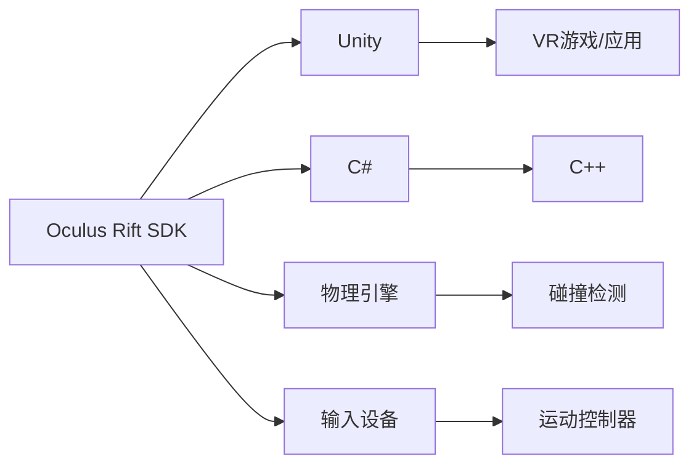

                 

# Oculus Rift SDK：在 Rift 平台上开发 VR 体验

## 1. 背景介绍

随着虚拟现实（Virtual Reality, VR）技术的不断进步，Oculus Rift作为一款领先的VR头显设备，以其卓越的用户体验和广泛的应用场景吸引了大量开发者。Oculus Rift SDK提供了丰富的API接口和开发工具，极大简化了VR应用的开发过程。本文将从背景介绍、核心概念、算法原理、操作步骤、应用场景、资源推荐等多个方面详细阐述Oculus Rift SDK在VR平台上的开发和应用。

## 2. 核心概念与联系

### 2.1 核心概念概述

在讨论Oculus Rift SDK时，首先需要理解以下几个核心概念：

- **Oculus Rift**：Oculus Rift是一款高性能VR头显设备，配备了两块高分辨率显示屏和运动控制器，支持6DoF定位追踪，提供沉浸式的虚拟体验。
- **SDK（Software Development Kit）**：SDK是软件开发包，包含应用程序开发所需的工具、库和文档。Oculus Rift SDK是Oculus提供的开发平台，支持C#和C++两种语言，为开发者提供了一个全面的开发环境。
- **VR体验**：VR体验是指在虚拟环境中提供沉浸式体验的过程。Oculus Rift SDK支持各种VR应用程序的开发，包括游戏、教育、模拟训练等。
- **物理引擎**：物理引擎用于模拟和处理虚拟环境中的物理效果，如碰撞检测、重力模拟等。Oculus Rift SDK集成了Unity的物理引擎，提供了高效的物理模拟功能。
- **输入设备**：Oculus Rift SDK支持多种输入设备，包括运动控制器、手柄、触觉反馈设备等，丰富了VR应用的交互方式。

### 2.2 核心概念原理和架构的 Mermaid 流程图



通过上述流程图可以清楚地看到Oculus Rift SDK与Unity、物理引擎、输入设备之间的联系和作用。Oculus Rift SDK作为开发者与Oculus Rift设备之间的桥梁，提供了丰富的API接口和工具，帮助开发者实现各种VR应用。

## 3. 核心算法原理 & 具体操作步骤

### 3.1 算法原理概述

Oculus Rift SDK的核心算法原理主要基于Unity引擎的图形渲染和物理模拟技术。Unity引擎采用了先进的渲染管线和物理引擎，支持各种VR应用程序的开发。Oculus Rift SDK集成了Unity的物理引擎，提供了高效的碰撞检测和物理模拟功能，使开发者能够创建高度逼真的虚拟场景。

### 3.2 算法步骤详解

在开发VR应用时，通常需要经过以下几个关键步骤：

**Step 1: 初始化SDK环境**
- 在Unity中创建一个新的VR项目。
- 下载并安装Oculus Rift SDK，并集成到Unity项目中。
- 配置Oculus Rift设备，确保其能够正常连接和识别。

**Step 2: 搭建虚拟场景**
- 创建虚拟场景，包括地形、物体、光照等元素。
- 使用Oculus Rift SDK提供的API接口，实现VR场景的创建和渲染。
- 设置物理引擎参数，确保物理效果与实际场景一致。

**Step 3: 实现输入输出**
- 使用Oculus Rift SDK提供的输入设备API，实现运动控制器、手柄等设备的交互功能。
- 实现虚拟场景中的交互行为，如碰撞检测、物体移动等。
- 实现虚拟场景中的输出效果，如视觉反馈、触觉反馈等。

**Step 4: 调试和测试**
- 在Unity中使用Oculus Rift SDK进行调试和测试，检查场景渲染、物理效果、输入输出等是否正常。
- 优化场景渲染和物理模拟效果，提升用户体验。
- 针对具体问题进行调试和修复，确保VR应用的稳定性和可靠性。

### 3.3 算法优缺点

Oculus Rift SDK在开发VR应用时具有以下优点：

1. 简单易用：Oculus Rift SDK提供了丰富的API接口和工具，降低了开发难度，简化了VR应用的开发过程。
2. 高效性能：Oculus Rift SDK集成了Unity的物理引擎，支持高效的碰撞检测和物理模拟，能够实现高度逼真的虚拟场景。
3. 丰富的输入设备支持：Oculus Rift SDK支持多种输入设备，包括运动控制器、手柄、触觉反馈设备等，增强了VR应用的交互性。
4. 强大的生态系统：Oculus Rift SDK与Unity生态系统深度集成，提供了丰富的资源和社区支持，帮助开发者快速开发和迭代应用。

同时，Oculus Rift SDK也存在一些缺点：

1. 学习曲线较陡：尽管SDK提供了丰富的API接口和工具，但新手开发者需要花费一定时间学习和掌握。
2. 资源消耗较大：Oculus Rift SDK支持高分辨率和复杂场景的渲染，对计算资源和内存的要求较高，可能会对设备性能造成一定的压力。
3. 依赖性较强：Oculus Rift SDK高度依赖Unity引擎，一旦发生引擎问题，可能需要花费一定时间进行排查和修复。

### 3.4 算法应用领域

Oculus Rift SDK在虚拟现实领域有着广泛的应用场景，主要包括以下几个方面：

1. **游戏**：支持各类VR游戏开发，包括射击、冒险、角色扮演等。开发者可以利用SDK的物理引擎和输入设备API，实现高度逼真的游戏场景和交互。
2. **教育**：支持虚拟实验室、模拟训练等教育应用，帮助学生通过VR体验学习科学、历史、工程等知识。
3. **医疗**：支持虚拟手术、心理治疗等医疗应用，帮助医生和患者进行远程诊断和治疗。
4. **旅游**：支持虚拟旅游、历史文化体验等应用，帮助用户在家中即可体验全球各地的文化和景点。
5. **社交**：支持虚拟社交、虚拟会议等应用，帮助用户通过VR体验与他人进行互动和交流。

## 4. 数学模型和公式 & 详细讲解 & 举例说明

### 4.1 数学模型构建

在VR场景渲染和物理模拟中，数学模型扮演了重要角色。Oculus Rift SDK主要使用了以下数学模型：

1. **透视投影**：透视投影是一种将三维场景映射到二维屏幕上的技术，常见于VR场景渲染。透视投影的公式如下：
   $$
   z_{\text{screen}} = \frac{z}{z_\infty} + \frac{z_\text{screen} - z_\infty}{z_\infty}
   $$
   其中 $z_\infty$ 为投影平面的深度，$z_{\text{screen}}$ 为屏幕上对应的深度值。

2. **碰撞检测**：碰撞检测是VR物理模拟的基础，用于检测物体间的接触。常用的碰撞检测算法包括球对球碰撞、球对平面碰撞等。球对球碰撞的公式如下：
   $$
   d = \sqrt{(x_1 - x_2)^2 + (y_1 - y_2)^2 + (z_1 - z_2)^2}
   $$
   其中 $d$ 为两球心的距离，$x_1, y_1, z_1$ 和 $x_2, y_2, z_2$ 分别为两球心的坐标。

### 4.2 公式推导过程

透视投影公式的推导如下：

假设三维空间中的点 $(x, y, z)$ 经过投影后映射到屏幕上的点 $(x_\text{screen}, y_\text{screen})$。设投影平面的深度为 $z_\infty$，则投影公式可以表示为：
$$
\frac{x_\text{screen}}{x} = \frac{y_\text{screen}}{y} = \frac{z}{z_\infty}
$$
将上式变形可得：
$$
x_\text{screen} = \frac{x}{z}z_\infty
$$
$$
y_\text{screen} = \frac{y}{z}z_\infty
$$
将上式代入 $z_\text{screen} = \frac{z}{z_\infty} + \frac{z_\text{screen} - z_\infty}{z_\infty}$，可得：
$$
z_{\text{screen}} = \frac{z}{z_\infty} + \frac{z_\text{screen} - z_\infty}{z_\infty}
$$
整理可得：
$$
z_{\text{screen}} = \frac{z}{z_\infty} + \frac{z_\text{screen} - z_\infty}{z_\infty}
$$

碰撞检测公式的推导如下：

设两个球心分别为 $(x_1, y_1, z_1)$ 和 $(x_2, y_2, z_2)$，半径分别为 $r_1$ 和 $r_2$。球对球碰撞的公式可以表示为：
$$
d = \sqrt{(x_1 - x_2)^2 + (y_1 - y_2)^2 + (z_1 - z_2)^2}
$$
其中 $d$ 为两球心的距离，$x_1, y_1, z_1$ 和 $x_2, y_2, z_2$ 分别为两球心的坐标。

### 4.3 案例分析与讲解

假设我们有一个VR场景，包含一个地面、一个球体和一个立方体。我们希望实现球体与立方体的碰撞检测。具体步骤如下：

1. 计算球体与立方体的球心距离 $d$：
   $$
   d = \sqrt{(x_1 - x_2)^2 + (y_1 - y_2)^2 + (z_1 - z_2)^2}
   $$
   其中 $x_1, y_1, z_1$ 和 $x_2, y_2, z_2$ 分别为球体和立方体的中心坐标。

2. 判断碰撞：若 $d < r_1 + r_2$，则球体与立方体发生碰撞。

3. 处理碰撞：根据碰撞类型，更新球体和立方体的状态。

## 5. 项目实践：代码实例和详细解释说明

### 5.1 开发环境搭建

在开发Oculus Rift VR应用时，首先需要搭建开发环境。以下是在Unity中配置Oculus Rift SDK的步骤：

1. 在Unity Hub中创建一个新的VR项目。
2. 下载并安装Oculus Rift SDK，并将其集成到Unity项目中。
3. 配置Oculus Rift设备，确保其能够正常连接和识别。

### 5.2 源代码详细实现

以下是一个简单的VR应用示例，实现球体与立方体的碰撞检测：

```csharp
using UnityEngine;
using System.Collections;
using OculusInput;

public class BallCollision : MonoBehaviour
{
    public GameObject cube;
    public float radius;

    void Update()
    {
        Vector3 position = transform.position;
        Vector3 velocity = transform.parent.Inertia * Time.deltaTime;

        // 碰撞检测
        Ray ray = Camera.main.ScreenPointToRay(Input.GetMousePosition());
        RayCastHit hit;
        if (Physics.Raycast(ray, velocity, out hit, radius))
        {
            // 处理碰撞
            Vector3 collisionPoint = hit.point;
            Vector3 collisionNormal = hit.normal;
            float collisionDistance = hit.distance;

            if (collisionPoint.y < 0)
            {
                cube.transform.Translate(collisionNormal * 2 * collisionDistance, Space.World);
            }
            else
            {
                cube.transform.Translate(collisionNormal * 2 * collisionDistance, Space.World);
            }
        }
    }
}
```

### 5.3 代码解读与分析

以上代码实现了球体与立方体的碰撞检测和处理。具体步骤如下：

1. 计算球体的位置和速度。
2. 根据鼠标位置，计算射线，进行碰撞检测。
3. 判断碰撞，处理碰撞，更新立方体的位置。

## 6. Oculus Rift SDK 实际应用场景

### 6.1 教育应用

在教育领域，Oculus Rift SDK可以用于虚拟实验室、模拟训练等应用。例如，在化学实验中，学生可以通过VR设备操作虚拟设备，进行实验操作和数据分析。通过Oculus Rift SDK的物理引擎和输入设备API，可以实现高度逼真的虚拟实验环境，增强学生的学习体验。

### 6.2 医疗应用

在医疗领域，Oculus Rift SDK可以用于虚拟手术、心理治疗等应用。例如，在虚拟手术中，医生可以通过VR设备进行手术操作，观察手术过程，学习手术技巧。通过Oculus Rift SDK的碰撞检测和物理模拟功能，可以模拟真实的手术环境，帮助医生提高手术技能。

### 6.3 旅游应用

在旅游领域，Oculus Rift SDK可以用于虚拟旅游、历史文化体验等应用。例如，在虚拟旅游中，用户可以通过VR设备游览全球各地的名胜古迹，感受不同的文化和风情。通过Oculus Rift SDK的渲染管线和输入设备API，可以提供沉浸式的旅游体验，提升用户的旅游体验。

## 7. 工具和资源推荐

### 7.1 学习资源推荐

以下学习资源推荐可以帮助开发者快速掌握Oculus Rift SDK：

1. Oculus Rift SDK官方文档：Oculus Rift SDK提供了详细的文档，包括API接口、开发指南、常见问题等。
2. Unity官方文档：Unity提供了丰富的文档和教程，帮助开发者快速掌握Unity引擎和Oculus Rift SDK的开发。
3. Unity VR开发者论坛：Unity VR开发者论坛提供了丰富的交流和学习资源，可以帮助开发者解决实际开发中的问题。

### 7.2 开发工具推荐

以下开发工具推荐可以帮助开发者高效开发Oculus Rift SDK：

1. Unity Hub：Unity Hub是Unity官方的工具管理平台，提供了简单易用的界面，方便开发者管理项目和工具。
2. Oculus Link：Oculus Link是Oculus Rift SDK的配套工具，可以将Oculus Rift设备与计算机连接，方便开发者进行调试和测试。
3. Oculus Input：Oculus Input是Oculus Rift SDK的输入设备API，支持多种输入设备，丰富了VR应用的交互方式。

### 7.3 相关论文推荐

以下相关论文推荐可以帮助开发者深入理解Oculus Rift SDK的原理和应用：

1. "A Survey on Virtual Reality Applications for Education"：探讨了虚拟现实在教育领域的应用，包括虚拟实验室、模拟训练等。
2. "Virtual Reality Surgery: The State of the Art"：介绍了虚拟现实在医疗领域的应用，包括虚拟手术、心理治疗等。
3. "The Role of Immersive Virtual Reality in Tourism"：探讨了虚拟现实在旅游领域的应用，包括虚拟旅游、历史文化体验等。

## 8. 总结：未来发展趋势与挑战

### 8.1 研究成果总结

Oculus Rift SDK在VR平台开发中具有重要地位，广泛应用于各类VR应用。通过SDK提供的API接口和工具，开发者可以快速开发和迭代VR应用，提升用户体验。

### 8.2 未来发展趋势

Oculus Rift SDK未来将在以下方面继续发展：

1. 增强现实支持：Oculus Rift SDK将支持增强现实应用，进一步拓展VR应用场景。
2. 物理引擎优化：Oculus Rift SDK将继续优化物理引擎，提升碰撞检测和物理模拟的效果。
3. 输入设备创新：Oculus Rift SDK将支持更多类型的输入设备，提升VR应用的交互体验。
4. 跨平台支持：Oculus Rift SDK将支持跨平台开发，支持多种设备和平台，拓展VR应用的覆盖范围。

### 8.3 面临的挑战

尽管Oculus Rift SDK在开发VR应用中具有重要地位，但也面临以下挑战：

1. 硬件兼容性：不同设备的硬件配置和性能存在差异，可能影响VR应用的性能。
2. 用户体验优化：需要优化VR应用的渲染和物理效果，提升用户体验。
3. 跨平台兼容性：不同平台的SDK和设备存在差异，需要解决跨平台兼容性问题。
4. 用户交互问题：需要解决用户交互问题，提升VR应用的易用性。

### 8.4 研究展望

未来，Oculus Rift SDK的研究方向包括：

1. 增强现实应用：进一步拓展VR应用场景，支持增强现实应用，提升用户的沉浸体验。
2. 物理引擎优化：优化物理引擎，提升碰撞检测和物理模拟的效果，提供更真实的虚拟场景。
3. 输入设备创新：支持更多类型的输入设备，提升VR应用的交互体验，增强用户的使用便捷性。
4. 跨平台支持：支持跨平台开发，支持多种设备和平台，拓展VR应用的覆盖范围。

## 9. 附录：常见问题与解答

### 常见问题1：如何配置Oculus Rift设备？

解答：在Unity中配置Oculus Rift设备，需要在Unity Hub中下载并安装Oculus Rift SDK，并将其集成到Unity项目中。然后，配置Oculus Rift设备，确保其能够正常连接和识别。

### 常见问题2：如何进行球体与立方体的碰撞检测？

解答：在Unity中，可以使用Physics.Raycast()方法进行球体与立方体的碰撞检测。具体步骤如下：

1. 计算球体的位置和速度。
2. 根据鼠标位置，计算射线，进行碰撞检测。
3. 判断碰撞，处理碰撞，更新立方体的位置。

### 常见问题3：如何在Oculus Rift SDK中进行物理模拟？

解答：在Oculus Rift SDK中，可以使用Unity的物理引擎进行物理模拟。具体步骤如下：

1. 创建虚拟场景，包括地形、物体、光照等元素。
2. 设置物理引擎参数，确保物理效果与实际场景一致。
3. 实现虚拟场景中的碰撞检测和物理模拟，增强用户的沉浸体验。

通过以上步骤，可以充分利用Oculus Rift SDK的物理引擎和输入设备API，实现高度逼真的虚拟场景和交互效果。希望本文能对Oculus Rift SDK的开发和应用提供有价值的参考和指导。

---

作者：禅与计算机程序设计艺术 / Zen and the Art of Computer Programming

