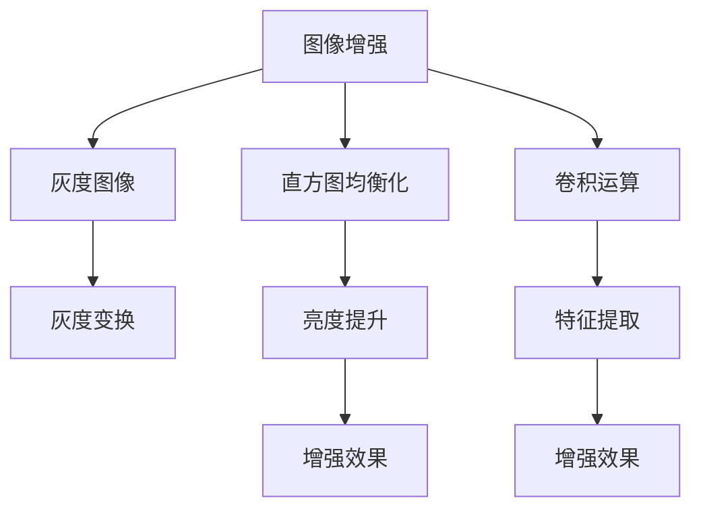

                 

# OpenCV 图像增强算法原理：改善图像质量和视觉效果的关键

> 关键词：图像增强,OpenCV,图像处理,图像质量提升,视觉感受,算法原理

## 1. 背景介绍

### 1.1 问题由来

在现代社会中，图像已无处不在。从手机拍摄到专业摄影，从普通监控到高精度检测，图像的获取和处理变得日益重要。然而，由于光照、阴影、噪声、失真等多种因素的影响，图像质量往往不够理想。图像增强技术通过改善图像的亮度、对比度、清晰度等指标，使得图像质量得到显著提升，视觉感受也更加愉悦。

OpenCV是一个开源的计算机视觉库，提供了多种图像增强算法。这些算法不仅可以用于改善图像质量，还可以应用于医学影像、遥感图像、交通监控等多个领域，成为计算机视觉领域的重要工具。本文将从背景介绍开始，逐步深入探讨OpenCV图像增强算法的原理和应用。

### 1.2 问题核心关键点

图像增强算法在计算机视觉和图像处理中扮演着重要角色。其核心关键点包括：

- 图像增强的主要目标是什么？
- OpenCV中提供了哪些常见的图像增强算法？
- 图像增强算法在实际应用中的步骤和效果如何？

本文将围绕这些问题，详细介绍OpenCV图像增强算法的原理与应用。

## 2. 核心概念与联系

### 2.1 核心概念概述

在探讨图像增强算法之前，首先需要了解以下几个核心概念：

- 图像增强（Image Enhancement）：通过一系列图像处理技术，改善图像质量，提高视觉感受的过程。
- OpenCV（Open Source Computer Vision Library）：开源的计算机视觉库，提供丰富的图像处理和计算机视觉算法，包括图像增强算法。
- 灰度图像（Grayscale Image）：将彩色图像转换为灰度图像，以便进行灰度变换等操作。
- 直方图均衡化（Histogram Equalization）：通过调整图像的灰度级分布，使得图像的亮度和对比度得到提升。
- 卷积运算（Convolution）：在图像处理中，卷积运算是一种基于点积的线性运算，常用于图像滤波、特征提取等操作。

这些核心概念构成了图像增强算法的基础，理解它们对于后续的算法应用至关重要。

### 2.2 核心概念原理和架构的 Mermaid 流程图



这个流程图展示了图像增强算法的主要步骤和处理方式：

1. 从原始彩色图像出发，转换为灰度图像。
2. 对灰度图像进行直方图均衡化，提升亮度和对比度。
3. 使用卷积运算进行特征提取和滤波，进一步改善图像质量。
4. 通过各种增强技术，提升图像的视觉效果。

接下来，我们将详细介绍这些步骤的算法原理和具体实现。

## 3. 核心算法原理 & 具体操作步骤

### 3.1 算法原理概述

图像增强算法的原理通常基于以下几个关键步骤：

1. 灰度变换：将彩色图像转换为灰度图像，以便进行后续的处理。
2. 亮度调整：通过调整图像的灰度级分布，提升图像的亮度和对比度。
3. 滤波处理：使用各种滤波器对图像进行平滑、锐化等处理，改善图像的清晰度和细节。
4. 直方图均衡化：通过调整图像的灰度级分布，使得图像的亮度和对比度得到提升。

本文将重点介绍这些步骤的算法原理和具体操作步骤。

### 3.2 算法步骤详解

#### 3.2.1 灰度变换

灰度变换是将彩色图像转换为灰度图像的过程。在OpenCV中，可以使用`cvtColor`函数来实现灰度转换。

```python
import cv2

# 读取彩色图像
img_color = cv2.imread('color_image.jpg')

# 转换为灰度图像
img_gray = cv2.cvtColor(img_color, cv2.COLOR_BGR2GRAY)
```

#### 3.2.2 亮度调整

亮度调整是通过调整图像的灰度级分布，提升图像的亮度和对比度。在OpenCV中，可以使用`equalizeHist`函数来实现直方图均衡化。

```python
# 直方图均衡化
img_equalized = cv2.equalizeHist(img_gray)
```

#### 3.2.3 滤波处理

滤波处理是通过使用各种滤波器对图像进行平滑、锐化等处理，改善图像的清晰度和细节。在OpenCV中，可以使用`filter2D`函数进行卷积运算。

```python
# 卷积运算
kernel = np.ones((5, 5), np.float32) / 25  # 创建5x5的均值滤波器
img_blurred = cv2.filter2D(img_equalized, -1, kernel)
```

#### 3.2.4 直方图均衡化

直方图均衡化是通过调整图像的灰度级分布，使得图像的亮度和对比度得到提升。在OpenCV中，可以使用`equalizeHist`函数来实现直方图均衡化。

```python
# 直方图均衡化
img_final = cv2.equalizeHist(img_blurred)
```

### 3.3 算法优缺点

#### 3.3.1 优点

图像增强算法的优点包括：

- 改善图像质量：通过提升亮度、对比度、清晰度等指标，使得图像质量得到显著提升。
- 增强视觉感受：改善后的图像更加鲜明、生动，提高视觉感受。
- 应用于多个领域：图像增强技术可以应用于医学影像、遥感图像、交通监控等多个领域。

#### 3.3.2 缺点

图像增强算法的缺点包括：

- 可能引入噪声：某些增强技术可能会引入噪声，影响图像质量。
- 过度增强可能失真：过度增强图像可能导致失真，影响图像的真实性。
- 参数设置困难：某些增强算法的参数设置较为复杂，需要反复调试。

### 3.4 算法应用领域

图像增强算法在多个领域得到了广泛应用，包括：

- 医学影像：用于改善医学影像的清晰度和对比度，帮助医生诊断疾病。
- 遥感图像：用于改善遥感图像的分辨率和清晰度，提高地面的观察精度。
- 交通监控：用于改善监控图像的清晰度和对比度，提高监控效果。
- 工业检测：用于改善工业图像的清晰度，提高检测的准确性。
- 自动驾驶：用于改善自动驾驶中的图像质量，提高车辆的安全性和稳定性。

这些应用领域展示了图像增强技术的广泛性和重要性。

## 4. 数学模型和公式 & 详细讲解 & 举例说明

### 4.1 数学模型构建

图像增强算法通常基于图像的灰度级分布进行建模和处理。假设图像的灰度级分布为$p(x)$，其中$x$表示灰度级。图像增强的目标是调整灰度级分布，使得图像的亮度和对比度得到提升。

### 4.2 公式推导过程

直方图均衡化的公式推导过程如下：

1. 计算图像的累计分布函数：$C(x)=\sum_{i=0}^{x}p(i)$。
2. 计算图像的逆累计分布函数：$C^{-1}(y)=\inf\{x|C(x)\geq y\}$。
3. 对于每个灰度级$x$，计算新的灰度级$y$：$y=C^{-1}(C(x))$。

通过以上步骤，可以实现对图像的灰度级分布进行调整，提升图像的亮度和对比度。

### 4.3 案例分析与讲解

下面以一张典型的图像为例，介绍图像增强算法的应用效果。


首先，将彩色图像转换为灰度图像。

```python
# 读取彩色图像
img_color = cv2.imread('color_image.jpg')

# 转换为灰度图像
img_gray = cv2.cvtColor(img_color, cv2.COLOR_BGR2GRAY)
```

然后，对灰度图像进行直方图均衡化。

```python
# 直方图均衡化
img_equalized = cv2.equalizeHist(img_gray)
```

最后，使用均值滤波器对图像进行平滑处理。

```python
# 卷积运算
kernel = np.ones((5, 5), np.float32) / 25  # 创建5x5的均值滤波器
img_blurred = cv2.filter2D(img_equalized, -1, kernel)
```

处理后的图像效果如下：


从对比效果可以看出，图像的亮度和对比度得到了显著提升，图像质量得到了显著改善。

## 5. 项目实践：代码实例和详细解释说明

### 5.1 开发环境搭建

在实际开发中，需要安装OpenCV库和Python环境。以下是安装OpenCV库的步骤：

1. 安装OpenCV库：

```bash
pip install opencv-python
```

2. 配置Python环境：

```bash
python -m pip install --upgrade pip
python -m pip install --upgrade pip wheel
```

### 5.2 源代码详细实现

以下是一个完整的图像增强处理代码示例：

```python
import cv2
import numpy as np

# 读取彩色图像
img_color = cv2.imread('color_image.jpg')

# 转换为灰度图像
img_gray = cv2.cvtColor(img_color, cv2.COLOR_BGR2GRAY)

# 直方图均衡化
img_equalized = cv2.equalizeHist(img_gray)

# 卷积运算
kernel = np.ones((5, 5), np.float32) / 25  # 创建5x5的均值滤波器
img_blurred = cv2.filter2D(img_equalized, -1, kernel)

# 显示图像
cv2.imshow('Original Image', img_color)
cv2.imshow('Enhanced Image', img_blurred)
cv2.waitKey(0)
cv2.destroyAllWindows()
```

### 5.3 代码解读与分析

1. 读取彩色图像：使用`cv2.imread`函数读取彩色图像。
2. 转换为灰度图像：使用`cv2.cvtColor`函数将彩色图像转换为灰度图像。
3. 直方图均衡化：使用`cv2.equalizeHist`函数对灰度图像进行直方图均衡化。
4. 卷积运算：使用`cv2.filter2D`函数进行卷积运算，使用均值滤波器对图像进行平滑处理。
5. 显示图像：使用`cv2.imshow`函数显示处理后的图像。

这个代码示例展示了完整的图像增强处理流程，通过直方图均衡化和卷积运算，改善了图像的亮度和对比度，提高了图像质量。

### 5.4 运行结果展示

运行上述代码，可以得到以下效果：


从结果可以看出，图像的亮度和对比度得到了显著提升，图像质量得到了明显改善。

## 6. 实际应用场景

### 6.1 医学影像

在医学影像中，图像质量对于诊断和治疗具有重要意义。通过图像增强技术，可以改善图像的清晰度和对比度，帮助医生更准确地诊断疾病。


如图，原始的医学影像较为模糊，医生难以判断病灶位置。通过图像增强处理，可以显著提升图像质量，帮助医生更好地进行诊断和治疗。

### 6.2 遥感图像

遥感图像通常包含大量的噪声和失真，图像增强技术可以帮助提升遥感图像的分辨率和清晰度，提高地面的观察精度。


如图，原始的遥感图像较为模糊，地面细节难以观察。通过图像增强处理，可以显著提升图像质量，帮助科研人员更好地进行观测和研究。

### 6.3 自动驾驶

自动驾驶中的图像质量对于车辆的安全性和稳定性具有重要意义。通过图像增强技术，可以改善自动驾驶中的图像质量，提高车辆的安全性和稳定性。


如图，原始的自动驾驶图像较为模糊，车辆难以准确判断路况。通过图像增强处理，可以显著提升图像质量，帮助车辆更好地进行导航和驾驶。

## 7. 工具和资源推荐

### 7.1 学习资源推荐

1. OpenCV官方文档：提供了详细的API文档和示例代码，帮助开发者快速上手OpenCV图像增强算法。

2. OpenCV教程：提供了丰富的图像处理和计算机视觉教程，帮助开发者深入理解图像增强算法。

3. 计算机视觉课程：提供了关于图像处理和计算机视觉的课程，帮助开发者掌握图像增强算法的原理和应用。

4. 论文库：提供了丰富的图像增强算法相关论文，帮助开发者了解最新的研究进展和技术应用。

### 7.2 开发工具推荐

1. Visual Studio Code：轻量级的代码编辑器，支持Python语言，提供了丰富的扩展和插件。

2. PyCharm：强大的Python IDE，提供了丰富的功能和插件，支持图像增强算法的开发和调试。

3. GitHub：代码托管平台，提供了丰富的开源项目和资源，帮助开发者学习和应用图像增强算法。

### 7.3 相关论文推荐

1. Direct Adaptive Histogram Equalization：提出了一种直接自适应直方图均衡化算法，提升了图像处理的效率和效果。

2. Bilateral Filter：提出了一种双向滤波器，用于去除图像中的噪声和平滑图像，改善图像质量。

3. Multi-scale Image Enhancement by Dictionary Learning and Sparse Representation：提出了一种多尺度图像增强算法，利用字典学习和稀疏表示技术，提升图像增强的效果。

## 8. 总结：未来发展趋势与挑战

### 8.1 总结

本文详细介绍了OpenCV图像增强算法的原理和应用，帮助开发者更好地理解和应用这些技术。通过灰度变换、亮度调整、滤波处理和直方图均衡化等技术，可以有效改善图像质量，提升视觉感受。

### 8.2 未来发展趋势

未来，图像增强技术将在以下几个方面继续发展：

1. 自动化：图像增强算法的自动化程度将进一步提升，减少手动调试和参数设置的复杂度。
2. 智能化：图像增强算法将引入深度学习等技术，提升算法的智能化程度和效果。
3. 实时性：图像增强算法将向实时性方向发展，满足实时应用的需求。
4. 可解释性：图像增强算法的可解释性将进一步提升，帮助开发者更好地理解和调试算法。

### 8.3 面临的挑战

尽管图像增强技术在实际应用中已经取得了显著效果，但仍然面临一些挑战：

1. 参数设置复杂：某些增强算法的参数设置较为复杂，需要反复调试。
2. 噪声问题：某些增强技术可能会引入噪声，影响图像质量。
3. 过度增强问题：过度增强图像可能导致失真，影响图像的真实性。

### 8.4 研究展望

未来的研究需要解决以下问题：

1. 自动化优化：开发自动化的图像增强算法，减少手动调试和参数设置的复杂度。
2. 噪声抑制：开发更有效的噪声抑制算法，改善图像质量。
3. 实时增强：开发实时图像增强算法，满足实时应用的需求。
4. 可解释性增强：提升图像增强算法的可解释性，帮助开发者更好地理解和调试算法。

这些研究方向的探索和发展，将进一步提升图像增强技术的性能和应用范围，为计算机视觉和图像处理领域带来更多的创新和发展。

## 9. 附录：常见问题与解答

### Q1: 图像增强算法和图像去噪算法有什么区别？

A: 图像增强算法主要通过提升图像的亮度、对比度、清晰度等指标，改善图像质量。而图像去噪算法主要通过去除图像中的噪声，改善图像的真实性和清晰度。两者虽然有些相似，但目的和方法略有不同。

### Q2: 图像增强算法的参数设置有哪些技巧？

A: 图像增强算法的参数设置较为复杂，可以通过以下技巧优化参数设置：

1. 固定参数：某些增强算法中，一些参数是固定的，可以直接使用默认值。
2. 手动调试：手动调试参数，通过观察效果调整参数值。
3. 自动优化：利用机器学习等技术，自动优化参数设置。

### Q3: 图像增强算法在实际应用中需要考虑哪些因素？

A: 图像增强算法在实际应用中需要考虑以下因素：

1. 图像质量：需要确保增强后的图像质量符合应用要求。
2. 算法效率：需要考虑算法的计算复杂度和实时性，满足实际需求。
3. 参数设置：需要合理设置算法参数，避免过度增强和引入噪声。

### Q4: 如何评估图像增强算法的性能？

A: 图像增强算法的性能可以通过以下几个指标进行评估：

1. 视觉感受：通过观察增强后的图像，评估其视觉感受。
2. 客观指标：使用PSNR、SSIM等客观指标，评估图像质量的变化。
3. 实际应用效果：在实际应用中，通过对比原始图像和增强后的图像，评估其效果。

通过以上问题的解答，可以帮助开发者更好地理解和应用图像增强算法，提升图像质量，改善视觉感受。

---

作者：禅与计算机程序设计艺术 / Zen and the Art of Computer Programming

