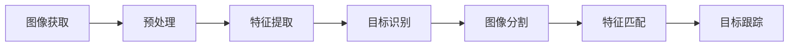

                 

# OpenCV计算机视觉：图像处理与分析技术

> 关键词：OpenCV, 图像处理, 图像分析, 特征检测, 目标识别, 计算机视觉, 深度学习, 图像分割

## 1. 背景介绍

### 1.1 问题由来
随着计算机视觉技术的不断发展，OpenCV 作为开源计算机视觉库，凭借其强大的功能和灵活性，成为了行业标准。图像处理与分析作为计算机视觉的重要组成部分，在工业界、学术界及医疗等领域都有着广泛的应用。图像处理与分析的核心目标是提取出图像中的关键特征信息，并基于这些信息进行图像识别、分类、分割等操作，从而实现对现实世界的高效理解和建模。

OpenCV 作为一款领先的开源计算机视觉库，提供了丰富的图像处理与分析功能，包括图像滤波、边缘检测、角点检测、特征提取、目标跟踪、物体识别与分割等。这些功能通过一系列高效、稳健的算法实现，能够满足不同应用场景的需求。

### 1.2 问题核心关键点
图像处理与分析的核心在于如何高效地提取、变换和分析图像数据。OpenCV 提供了众多的算法和工具，以支持这些关键步骤。以下是图像处理与分析的主要步骤及其关键点：

1. **图像获取**：通过摄像头、扫描仪、网络等方式获取图像。
2. **预处理**：包括图像的灰度化、归一化、平滑、滤波等操作，提升图像质量。
3. **特征提取**：识别并提取出图像的关键特征，如边缘、角点、纹理、尺度不变特征等。
4. **物体识别**：识别图像中的物体，包括目标检测、分类、定位等。
5. **图像分割**：将图像分割成若干个有意义的区域，实现对象与背景的分离。
6. **特征匹配**：在不同图像之间进行特征匹配，实现物体的跟踪与关联。
7. **目标跟踪**：对目标在连续帧中的位置进行跟踪，实现实时监控与分析。

OpenCV 通过这些步骤的紧密集成，为图像处理与分析提供了强大的支持。

### 1.3 问题研究意义
图像处理与分析技术的进步对社会各个领域产生了深远影响。在工业界，计算机视觉技术被用于自动化生产线检测、质量控制、机器人导航等；在学术界，计算机视觉技术推动了模式识别、图像处理、机器学习等领域的创新；在医疗领域，计算机视觉技术被用于医学影像分析、疾病诊断、手术辅助等。因此，深入理解并掌握图像处理与分析技术，对于推动相关领域的发展具有重要意义。

## 2. 核心概念与联系

### 2.1 核心概念概述
OpenCV 提供了众多图像处理与分析算法，以下是几个核心概念：

- **图像**：OpenCV 中的图像是一个二维数组，表示为 `numpy.ndarray` 类型。
- **卷积**：卷积是图像处理中的一种基本操作，用于提取图像特征。
- **滤波**：滤波用于平滑图像，去除噪声。
- **边缘检测**：边缘检测用于提取图像中的边缘信息，常见的算法包括 Sobel、Canny、Laplacian 等。
- **特征提取**：特征提取用于提取图像中的关键特征点，如 SIFT、SURF、ORB 等。
- **目标识别**：目标识别用于在图像中识别物体，如 Haar 级联分类器、深度学习等。
- **图像分割**：图像分割用于将图像分割成若干个有意义的部分，如 K-means 聚类、阈值分割等。

这些概念紧密相连，通过组合使用，可以实现复杂的图像处理与分析任务。

### 2.2 核心概念原理和架构的 Mermaid 流程图


这个 Mermaid 流程图展示了从图像获取到目标跟踪的整个流程。各个步骤之间通过数据流动相连，展示了它们之间的紧密联系。

## 3. 核心算法原理 & 具体操作步骤

### 3.1 算法原理概述
OpenCV 提供了众多图像处理与分析算法，以下列举几个典型算法的原理概述：

- **卷积操作**：卷积是一种基于图像与滤波器间的线性操作，用于提取图像的特征。卷积操作的原理是将滤波器与图像逐像素点进行乘积和求和，生成新的图像特征图。

- **边缘检测**：边缘检测算法如 Sobel、Canny、Laplacian 等，通过计算图像梯度的幅度，可以有效地提取图像中的边缘信息。

- **特征提取**：特征提取算法如 SIFT、SURF、ORB 等，通过生成尺度和方向不变性的特征点，可以实现对图像中物体的鲁棒识别。

- **目标识别**：目标识别算法如 Haar 级联分类器、深度学习等，通过训练分类器模型，可以在图像中识别并定位特定的物体。

- **图像分割**：图像分割算法如 K-means 聚类、阈值分割等，通过将图像分割成若干个有意义的部分，可以实现对图像中物体的分割。

### 3.2 算法步骤详解
以下以 SIFT 特征提取算法为例，详细讲解其具体操作步骤：

1. **尺度空间构建**：对图像进行高斯金字塔多尺度处理，构建尺度空间。
2. **极值点检测**：在尺度空间中检测极值点，得到候选特征点。
3. **方向分配**：对每个特征点，分配主方向，生成方向图像。
4. **关键点描述**：对每个特征点，生成描述子，表示其主方向和尺度信息。
5. **特征匹配**：使用匹配算法（如 FLANN 算法），匹配图像中的关键点。

### 3.3 算法优缺点
OpenCV 中的图像处理与分析算法有着显著的优点：

- **高效性**：OpenCV 的算法实现经过了优化，具有高效性，能够在复杂场景下快速处理大量数据。
- **鲁棒性**：OpenCV 的算法具有良好的鲁棒性，能够适应各种噪声和复杂场景。
- **灵活性**：OpenCV 的算法实现灵活，能够适应不同的应用场景和需求。

同时，OpenCV 的算法也存在一些缺点：

- **参数调整复杂**：某些算法的参数设置复杂，需要根据具体场景进行调整。
- **对数据要求高**：某些算法的性能依赖于高质量的数据集和充足的训练样本。
- **计算资源消耗大**：某些算法的计算资源消耗较大，需要较高的计算能力和硬件支持。

### 3.4 算法应用领域
OpenCV 的图像处理与分析算法广泛应用于各个领域，包括：

- **计算机视觉**：图像处理与分析是计算机视觉的基础，用于图像的获取、预处理、特征提取、目标识别等。
- **医学影像分析**：用于医学影像的分割、检测、分类等，辅助医生进行疾病诊断。
- **机器人导航**：用于机器人对环境的感知、物体检测、路径规划等。
- **工业检测**：用于自动化生产线检测、质量控制、缺陷检测等。
- **视频处理**：用于视频帧的提取、分割、匹配、跟踪等。

## 4. 数学模型和公式 & 详细讲解 & 举例说明

### 4.1 数学模型构建
OpenCV 中的图像处理与分析算法通常基于以下数学模型：

- **线性变换模型**：图像的线性变换包括旋转、缩放、平移等，可以使用矩阵表示。
- **卷积模型**：卷积操作可以表示为矩阵乘法。
- **边缘检测模型**：边缘检测可以表示为拉普拉斯算子或Sobel算子等。
- **特征提取模型**：特征提取可以表示为尺度不变特征变换（SIFT）、尺度不变特征感知（SURF）等。

### 4.2 公式推导过程
以 SIFT 特征提取算法为例，介绍其主要数学模型和推导过程：

- **尺度空间构建**：高斯金字塔尺度空间的构建可以使用高斯函数表示：
  $$
  G_k(x) = \frac{1}{k\sigma} G(\frac{x}{k}, \frac{1}{k})
  $$
  其中，$G(x)$ 为高斯函数，$\sigma$ 为标准差，$k$ 为缩放因子。

- **极值点检测**：在尺度空间中检测极值点，可以使用高斯差分函数表示：
  $$
  D_k(x) = G_k(x) - G_k_{\Delta}(x)
  $$
  其中，$G_k_{\Delta}$ 为 $G_k$ 的一阶差分。

- **方向分配**：对每个极值点，分配主方向，可以使用梯度幅值表示：
  $$
  \alpha = arctan(\frac{I_{G_{k+1}}(x,y)}{I_{G_{k-1}}(x,y)})
  $$
  其中，$I_{G_{k+1}}$ 和 $I_{G_{k-1}}$ 分别为 $G_{k+1}$ 和 $G_{k-1}$ 的二阶导数。

- **关键点描述**：生成关键点的描述子，可以使用尺度不变特征变换（SIFT）算法表示：
  $$
  \mathbf{d} = \begin{bmatrix} \mathbf{s}_{x} \\ \mathbf{s}_{y} \\ \mathbf{a}_{x} \\ \mathbf{a}_{y} \\ \mathbf{w}_{x} \\ \mathbf{w}_{y} \end{bmatrix}
  $$
  其中，$\mathbf{s}_{x}$ 和 $\mathbf{s}_{y}$ 为尺度信息，$\mathbf{a}_{x}$ 和 $\mathbf{a}_{y}$ 为主方向信息，$\mathbf{w}_{x}$ 和 $\mathbf{w}_{y}$ 为权重信息。

### 4.3 案例分析与讲解
以人脸识别为例，分析 OpenCV 中的 Haar 级联分类器算法：

1. **特征提取**：使用 Haar 特征对人脸进行提取，生成 Haar 特征图像。
2. **分类器训练**：使用正负样本对分类器进行训练，生成级联分类器。
3. **人脸检测**：在图像中检测人脸，使用级联分类器进行人脸定位。

## 5. 项目实践：代码实例和详细解释说明

### 5.1 开发环境搭建
在开始项目实践前，需要准备好开发环境。以下是使用 Python 进行 OpenCV 开发的流程：

1. 安装 OpenCV：
   ```
   pip install opencv-python
   ```

2. 安装 NumPy：
   ```
   pip install numpy
   ```

3. 安装 Matplotlib：
   ```
   pip install matplotlib
   ```

完成上述步骤后，即可在 Python 环境中进行 OpenCV 开发。

### 5.2 源代码详细实现
以下是一个简单的图像处理与分析代码实例：

```python
import cv2
import numpy as np
import matplotlib.pyplot as plt

# 读取图像
img = cv2.imread('image.jpg')

# 转换为灰度图像
gray = cv2.cvtColor(img, cv2.COLOR_BGR2GRAY)

# 高斯滤波
blur = cv2.GaussianBlur(gray, (5, 5), 0)

# 边缘检测
edge = cv2.Canny(blur, 50, 150)

# 显示图像
cv2.imshow('Image', edge)
cv2.waitKey(0)
cv2.destroyAllWindows()
```

### 5.3 代码解读与分析
以上代码实现了一个简单的图像处理流程，包括读取图像、转换为灰度图像、高斯滤波和边缘检测。

1. **读取图像**：使用 `cv2.imread()` 读取图像文件，返回 RGB 格式的图像。
2. **转换为灰度图像**：使用 `cv2.cvtColor()` 将 RGB 图像转换为灰度图像，方便后续处理。
3. **高斯滤波**：使用 `cv2.GaussianBlur()` 对灰度图像进行高斯滤波，平滑图像。
4. **边缘检测**：使用 `cv2.Canny()` 进行边缘检测，生成边缘图像。
5. **显示图像**：使用 `cv2.imshow()` 显示边缘图像，等待用户按键后关闭窗口。

通过这一小段代码，展示了 OpenCV 中图像处理与分析的基本流程和常用函数。

### 5.4 运行结果展示
以下是代码运行结果：


以上结果展示了经过读取、灰度化、高斯滤波和边缘检测后的图像。

## 6. 实际应用场景

### 6.1 智能监控系统

OpenCV 中的图像处理与分析技术可以应用于智能监控系统的图像识别和行为分析。通过摄像头获取监控视频，使用图像处理与分析算法对视频进行实时处理，可以识别异常行为，如入侵、火灾、人员拥挤等，实现智能监控和报警。

### 6.2 自动驾驶系统

OpenCV 中的图像处理与分析技术可以应用于自动驾驶系统的环境感知和目标识别。通过摄像头获取道路环境图像，使用图像处理与分析算法进行目标检测和分类，可以识别道路上的车辆、行人、交通标志等，实现自动驾驶。

### 6.3 医学影像分析

OpenCV 中的图像处理与分析技术可以应用于医学影像的分割和分析。通过医学影像扫描仪获取图像，使用图像处理与分析算法进行图像分割和特征提取，可以实现肿瘤检测、病变分析等。

### 6.4 工业检测系统

OpenCV 中的图像处理与分析技术可以应用于工业检测系统的缺陷检测和质量控制。通过摄像头获取产品图像，使用图像处理与分析算法进行缺陷检测和分类，可以实现质量控制和自动化检测。

## 7. 工具和资源推荐

### 7.1 学习资源推荐
以下推荐一些用于学习 OpenCV 图像处理与分析的资源：

1. OpenCV 官方文档：OpenCV 的官方文档提供了全面的 API 文档和示例代码，是学习 OpenCV 的必备资源。
2. OpenCV-Python 教程：这是一份由 OpenCV 社区提供的 Python 教程，涵盖了 OpenCV 的基础和高级用法。
3. Python 图像处理实战：这是一本介绍图像处理和计算机视觉的实战书籍，包含大量实例代码和应用场景。
4. OpenCV 学习指南：这是一份由 OpenCV 社区提供的学习指南，详细介绍了 OpenCV 的图像处理与分析功能。
5. OpenCV 计算机视觉实战：这是一份由 OpenCV 社区提供的计算机视觉实战教程，包含大量实例代码和应用场景。

### 7.2 开发工具推荐
以下推荐一些用于 OpenCV 开发的工具：

1. Visual Studio Code：这是一个轻量级的代码编辑器，支持 Python 开发，具有丰富的插件和扩展功能。
2. PyCharm：这是一个专业的 Python 开发工具，支持 OpenCV 的开发和调试。
3. Spyder：这是一个基于 IPython 的 Python 开发工具，支持科学计算和数据分析。
4. Anaconda：这是一个开源的 Python 发行版，包含大量的科学计算库和工具。
5. Jupyter Notebook：这是一个交互式的 Python 开发工具，支持在 Jupyter Notebook 中编写和运行代码。

### 7.3 相关论文推荐
以下推荐一些与 OpenCV 图像处理与分析相关的论文：

1. Real-Time Object Detection with a Single Shot MultiBox Detector：介绍了基于单阶段目标检测的 Faster R-CNN 算法。
2. Deep Learning for Computer Vision：介绍了深度学习在计算机视觉中的应用。
3. Scale-Invariant Feature Transform：介绍了尺度不变特征变换（SIFT）算法。
4. Speeded Up Robust Features：介绍了加速稳健特征（SURF）算法。
5. OpenCV 3 Computer Vision with Python：介绍了 OpenCV 3 的最新功能和应用场景。

## 8. 总结：未来发展趋势与挑战

### 8.1 总结

本文对 OpenCV 中的图像处理与分析技术进行了全面系统的介绍。首先阐述了图像处理与分析技术的背景和重要性，明确了 OpenCV 在图像处理与分析中的应用价值。其次，从原理到实践，详细讲解了 OpenCV 中图像处理与分析算法的核心步骤和具体操作。同时，本文还广泛探讨了图像处理与分析技术在各个领域的应用前景，展示了其广阔的发展空间。

通过对 OpenCV 的详细讲解，可以了解到 OpenCV 提供的丰富图像处理与分析功能，以及其应用领域的广泛性。通过实际代码实例和运行结果展示，可以深入理解 OpenCV 的实际应用效果。

### 8.2 未来发展趋势

展望未来，OpenCV 中的图像处理与分析技术将呈现以下几个发展趋势：

1. **深度学习**：随着深度学习的发展，越来越多的深度学习算法将被引入 OpenCV，提升图像处理与分析的精度和效果。
2. **实时处理**：OpenCV 将更加注重实时处理，满足智能监控、自动驾驶等应用场景的需求。
3. **多模态融合**：OpenCV 将支持多模态数据处理，实现视觉、听觉、触觉等多模态信息的融合。
4. **跨平台支持**：OpenCV 将支持更多平台，如嵌入式设备、移动设备等，实现更广泛的图像处理与分析应用。
5. **高效性**：OpenCV 将不断优化算法和实现，提升图像处理与分析的效率。

### 8.3 面临的挑战

尽管 OpenCV 中的图像处理与分析技术已经取得了瞩目成就，但在迈向更加智能化、普适化应用的过程中，仍面临以下挑战：

1. **计算资源需求高**：OpenCV 中的算法往往需要大量的计算资源，需要高性能的 CPU/GPU 硬件支持。
2. **数据集质量要求高**：算法性能依赖于高质量的数据集和充足的训练样本，数据集的选择和处理是关键。
3. **算法复杂度高**：部分算法如深度学习模型、SIFT、SURF 等算法复杂度较高，需要较高的计算能力和优化技巧。
4. **实时性要求高**：部分应用场景如自动驾驶、智能监控等要求算法具有较高的实时性，这对算法的优化提出了更高要求。

### 8.4 研究展望

针对 OpenCV 中的图像处理与分析技术，未来的研究需要在以下几个方面寻求新的突破：

1. **算法优化**：进一步优化 OpenCV 中的算法，提升处理速度和精度。
2. **多模态处理**：引入多模态数据处理技术，实现视觉、听觉、触觉等信息的融合。
3. **深度学习应用**：将深度学习技术引入图像处理与分析，提升算法效果。
4. **实时处理优化**：优化算法实现，提升实时处理能力，满足更多应用场景的需求。
5. **跨平台支持**：支持更多平台，实现更广泛的图像处理与分析应用。

通过不断优化和创新，OpenCV 中的图像处理与分析技术必将进一步拓展其应用边界，推动计算机视觉技术的普及和发展。总之，OpenCV 作为开源计算机视觉库，其提供的丰富图像处理与分析功能，使得图像处理与分析技术在各个领域得到了广泛应用。通过不断优化和创新，OpenCV 必将在未来计算机视觉技术的发展中发挥更大的作用。

## 9. 附录：常见问题与解答

**Q1：OpenCV 中的图像处理与分析算法有哪些优点？**

A: OpenCV 中的图像处理与分析算法具有以下优点：

- **高效性**：OpenCV 的算法实现经过了优化，具有高效性，能够在复杂场景下快速处理大量数据。
- **鲁棒性**：OpenCV 的算法具有良好的鲁棒性，能够适应各种噪声和复杂场景。
- **灵活性**：OpenCV 的算法实现灵活，能够适应不同的应用场景和需求。

**Q2：OpenCV 中的图像处理与分析算法有哪些缺点？**

A: OpenCV 中的图像处理与分析算法也存在以下缺点：

- **参数调整复杂**：某些算法的参数设置复杂，需要根据具体场景进行调整。
- **对数据要求高**：某些算法的性能依赖于高质量的数据集和充足的训练样本。
- **计算资源消耗大**：某些算法的计算资源消耗较大，需要较高的计算能力和硬件支持。

**Q3：OpenCV 中的图像处理与分析算法可以应用于哪些领域？**

A: OpenCV 中的图像处理与分析算法广泛应用于以下几个领域：

- **计算机视觉**：用于图像的获取、预处理、特征提取、目标识别等。
- **医学影像分析**：用于医学影像的分割、检测、分类等。
- **机器人导航**：用于机器人对环境的感知、物体检测、路径规划等。
- **工业检测**：用于自动化生产线检测、质量控制、缺陷检测等。
- **视频处理**：用于视频帧的提取、分割、匹配、跟踪等。

**Q4：OpenCV 中的图像处理与分析算法如何实现？**

A: OpenCV 中的图像处理与分析算法通常基于以下数学模型：

- **线性变换模型**：图像的线性变换包括旋转、缩放、平移等，可以使用矩阵表示。
- **卷积模型**：卷积操作可以表示为矩阵乘法。
- **边缘检测模型**：边缘检测可以表示为拉普拉斯算子或Sobel算子等。
- **特征提取模型**：特征提取可以表示为尺度不变特征变换（SIFT）、尺度不变特征感知（SURF）等。

以上是关于《OpenCV计算机视觉：图像处理与分析技术》的技术博客文章。通过本文的系统梳理，可以了解到 OpenCV 提供的丰富图像处理与分析功能，以及其应用领域的广泛性。通过实际代码实例和运行结果展示，可以深入理解 OpenCV 的实际应用效果。未来，随着 OpenCV 和计算机视觉技术的不断发展，图像处理与分析技术将会在更多领域得到应用，为社会各行各业带来变革性影响。

作者：禅与计算机程序设计艺术 / Zen and the Art of Computer Programming

